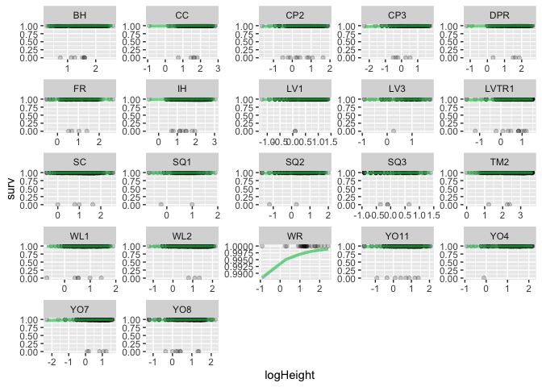
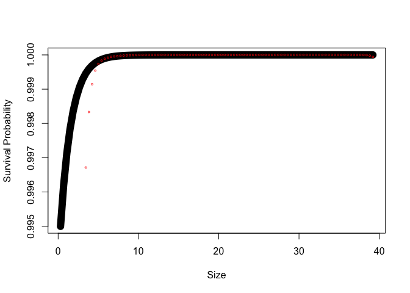

# Make a practice IPM with WL2 2023 Data

To Do:

-   Check P matrix since I ran the models with scaled and transformed data, but did not account for that when making the P matrix 
-   Make a separate P matrix for each pop to take into account random slopes

## Libraries


``` r
library(tidyverse)
```

```
## ── Attaching core tidyverse packages ──────────────────────── tidyverse 2.0.0 ──
## ✔ dplyr     1.1.4     ✔ readr     2.1.5
## ✔ forcats   1.0.0     ✔ stringr   1.5.1
## ✔ ggplot2   3.5.1     ✔ tibble    3.2.1
## ✔ lubridate 1.9.3     ✔ tidyr     1.3.1
## ✔ purrr     1.0.2     
## ── Conflicts ────────────────────────────────────────── tidyverse_conflicts() ──
## ✖ dplyr::filter() masks stats::filter()
## ✖ dplyr::lag()    masks stats::lag()
## ℹ Use the conflicted package (<http://conflicted.r-lib.org/>) to force all conflicts to become errors
```

``` r
library(broom)
library(broom.mixed)
library(magrittr)
```

```
## 
## Attaching package: 'magrittr'
## 
## The following object is masked from 'package:purrr':
## 
##     set_names
## 
## The following object is masked from 'package:tidyr':
## 
##     extract
```

``` r
library(lmerTest)
```

```
## Loading required package: lme4
## Loading required package: Matrix
## 
## Attaching package: 'Matrix'
## 
## The following objects are masked from 'package:tidyr':
## 
##     expand, pack, unpack
## 
## 
## Attaching package: 'lmerTest'
## 
## The following object is masked from 'package:lme4':
## 
##     lmer
## 
## The following object is masked from 'package:stats':
## 
##     step
```

## Load the data


``` r
wl2_size_2023 <- read_csv("data/WL2-2023_Size_Combined.csv") %>% select(survey_date, Genotype, parent.pop, height.cm, long.leaf.cm)
```

```
## Rows: 17336 Columns: 10
## ── Column specification ────────────────────────────────────────────────────────
## Delimiter: ","
## chr  (5): block, Genotype, pop.mf, parent.pop, survey.notes
## dbl  (4): mf, rep, height.cm, long.leaf.cm
## date (1): survey_date
## 
## ℹ Use `spec()` to retrieve the full column specification for this data.
## ℹ Specify the column types or set `show_col_types = FALSE` to quiet this message.
```

``` r
unique(wl2_size_2023$parent.pop) #all 23 pops!
```

```
##  [1] "CP2"   "CP3"   "LV1"   "LV3"   "LVTR1" "SQ1"   "SQ2"   "SQ3"   "WL1"  
## [10] "WL2"   "YO11"  "YO4"   "YO7"   "YO8"   "BH"    "CC"    "SC"    "TM2"  
## [19] "DPR"   "FR"    "IH"    "WR"    "WV"
```

``` r
wl2_mort_2023 <- read_csv("data/WL2_Mortality_2023.csv") %>% 
  select(block, BedLoc, Genotype, parent.pop=pop, mf:death.date) %>% 
  mutate(parent.pop= str_replace(parent.pop, "Y08", "YO8")) %>% 
  mutate(parent.pop= str_replace(parent.pop, "Y04", "YO4")) %>% 
mutate(Genotype= str_replace(Genotype, "Y08", "YO8")) %>% 
  mutate(Genotype= str_replace(Genotype, "Y04", "YO4")) 
```

```
## Rows: 1573 Columns: 11
## ── Column specification ────────────────────────────────────────────────────────
## Delimiter: ","
## chr (8): block, BedLoc, bed, bed.col, Genotype, pop, death.date, survey.notes
## dbl (3): bed.row, mf, rep
## 
## ℹ Use `spec()` to retrieve the full column specification for this data.
## ℹ Specify the column types or set `show_col_types = FALSE` to quiet this message.
```

``` r
unique(wl2_mort_2023$parent.pop) #all 23 pops!
```

```
##  [1] "TM2"   "LVTR1" "SQ2"   "YO8"   "CC"    "YO11"  "BH"    "DPR"   "CP2"  
## [10] "WL1"   "IH"    "CP3"   "SC"    "FR"    "LV3"   "YO7"   "WV"    "SQ3"  
## [19] "WL2"   "LV1"   "YO4"   "WR"    "SQ1"
```

``` r
#wl2_size_2023 %>% filter(Genotype=="YO4_2_2") #I_18_C
#wl2_size_2023 %>% filter(Genotype=="YO8_8_4") #B_58_A

#wl2_mort_2023 %>% filter(Genotype=="YO4_2_2")
#wl2_mort_2023 %>% filter(BedLoc=="I_18_C")
#wl2_mort_2023 %>% filter(BedLoc=="B_58_A")
```

## Merge


``` r
wl2_all_2023_OLD <- left_join(wl2_size_2023, wl2_mort_2023) #42 more rows, why? duplicate rows somewhere 
```

```
## Joining with `by = join_by(Genotype, parent.pop)`
```

``` r
wl2_all_2023_OLD %>% group_by(Genotype, survey_date) %>% summarize(n=n()) %>% arrange(desc(n)) 
```

```
## `summarise()` has grouped output by 'Genotype'. You can override using the
## `.groups` argument.
```

```
## # A tibble: 17,305 × 3
## # Groups:   Genotype [1,581]
##    Genotype survey_date     n
##    <chr>    <date>      <int>
##  1 CC_1_2   2023-07-26      2
##  2 CC_1_2   2023-08-02      2
##  3 CC_1_2   2023-08-16      2
##  4 CC_1_2   2023-08-23      2
##  5 CC_1_2   2023-08-30      2
##  6 CC_1_2   2023-09-06      2
##  7 CC_1_2   2023-09-13      2
##  8 CC_1_2   2023-09-20      2
##  9 CC_1_2   2023-10-13      2
## 10 CC_1_2   2023-10-20      2
## # ℹ 17,295 more rows
```

``` r
##Duplicates: CC_1_2, CC_9_6, IH_4_5, SC_5_6, SQ2_6_2
wl2_size_2023 %>% filter(Genotype=="CC_1_2") #duplicated on certain dates  
```

```
## # A tibble: 21 × 5
##    survey_date Genotype parent.pop height.cm long.leaf.cm
##    <date>      <chr>    <chr>          <dbl>        <dbl>
##  1 2023-07-03  CC_1_2   CC               2.1          1.9
##  2 2023-07-26  CC_1_2   CC               8.8          4.4
##  3 2023-07-26  CC_1_2   CC              NA           NA  
##  4 2023-08-02  CC_1_2   CC               9.4          4  
##  5 2023-08-02  CC_1_2   CC              NA           NA  
##  6 2023-08-16  CC_1_2   CC               9.3          4  
##  7 2023-08-16  CC_1_2   CC              NA           NA  
##  8 2023-08-23  CC_1_2   CC               9.9          4.3
##  9 2023-08-23  CC_1_2   CC              NA           NA  
## 10 2023-08-30  CC_1_2   CC               9.3          4  
## # ℹ 11 more rows
```

``` r
wl2_size_2023 %>% filter(Genotype=="CC_9_6") #duplicated on certain dates  
```

```
## # A tibble: 16 × 5
##    survey_date Genotype parent.pop height.cm long.leaf.cm
##    <date>      <chr>    <chr>          <dbl>        <dbl>
##  1 2023-07-03  CC_9_6   CC               4            2.9
##  2 2023-07-26  CC_9_6   CC               8            4.9
##  3 2023-07-26  CC_9_6   CC              NA           NA  
##  4 2023-08-02  CC_9_6   CC               8            5.1
##  5 2023-08-02  CC_9_6   CC              NA           NA  
##  6 2023-08-16  CC_9_6   CC               8            4  
##  7 2023-08-23  CC_9_6   CC               8.1          4.1
##  8 2023-08-30  CC_9_6   CC               9.1          2.3
##  9 2023-09-06  CC_9_6   CC               9.5          4.3
## 10 2023-09-13  CC_9_6   CC              10.8          2.8
## 11 2023-09-13  CC_9_6   CC              NA           NA  
## 12 2023-09-20  CC_9_6   CC              11.6          3.7
## 13 2023-09-27  CC_9_6   CC              12.2          3.1
## 14 2023-09-27  CC_9_6   CC              NA           NA  
## 15 2023-10-20  CC_9_6   CC              14.3          3.9
## 16 2023-10-20  CC_9_6   CC              NA           NA
```

``` r
wl2_size_2023 %>% filter(Genotype=="IH_4_5") #duplicated on certain dates  
```

```
## # A tibble: 21 × 5
##    survey_date Genotype parent.pop height.cm long.leaf.cm
##    <date>      <chr>    <chr>          <dbl>        <dbl>
##  1 2023-07-03  IH_4_5   IH               2.8          2.7
##  2 2023-07-26  IH_4_5   IH              NA           NA  
##  3 2023-07-26  IH_4_5   IH              NA           NA  
##  4 2023-08-02  IH_4_5   IH              NA           NA  
##  5 2023-08-02  IH_4_5   IH              NA           NA  
##  6 2023-08-16  IH_4_5   IH              NA           NA  
##  7 2023-08-16  IH_4_5   IH              NA           NA  
##  8 2023-08-23  IH_4_5   IH              NA           NA  
##  9 2023-08-23  IH_4_5   IH              NA           NA  
## 10 2023-08-30  IH_4_5   IH              NA           NA  
## # ℹ 11 more rows
```

``` r
wl2_size_2023 %>% filter(Genotype=="SC_5_6") #duplicated on certain dates  
```

```
## # A tibble: 16 × 5
##    survey_date Genotype parent.pop height.cm long.leaf.cm
##    <date>      <chr>    <chr>          <dbl>        <dbl>
##  1 2023-07-03  SC_5_6   SC               2.2          2.3
##  2 2023-07-26  SC_5_6   SC               2.9          4.3
##  3 2023-07-26  SC_5_6   SC              NA           NA  
##  4 2023-08-02  SC_5_6   SC               2.7          3.6
##  5 2023-08-02  SC_5_6   SC              NA           NA  
##  6 2023-08-16  SC_5_6   SC               2.6          3.7
##  7 2023-08-23  SC_5_6   SC               2.6          3.7
##  8 2023-08-30  SC_5_6   SC               2.2          3.2
##  9 2023-09-06  SC_5_6   SC               2.7          4.3
## 10 2023-09-13  SC_5_6   SC               2.8          3.9
## 11 2023-09-13  SC_5_6   SC              NA           NA  
## 12 2023-09-20  SC_5_6   SC               3.9          4  
## 13 2023-09-27  SC_5_6   SC               4.5          3.7
## 14 2023-09-27  SC_5_6   SC              NA           NA  
## 15 2023-10-20  SC_5_6   SC               5.1          4.2
## 16 2023-10-20  SC_5_6   SC              NA           NA
```

``` r
wl2_size_2023 %>% filter(Genotype=="SQ2_6_2") #duplicated on certain dates  
```

```
## # A tibble: 12 × 5
##    survey_date Genotype parent.pop height.cm long.leaf.cm
##    <date>      <chr>    <chr>          <dbl>        <dbl>
##  1 2023-07-03  SQ2_6_2  SQ2              0.6          1.1
##  2 2023-07-26  SQ2_6_2  SQ2             NA           NA  
##  3 2023-07-26  SQ2_6_2  SQ2              1.6          2.6
##  4 2023-08-02  SQ2_6_2  SQ2              1.3          2.7
##  5 2023-08-16  SQ2_6_2  SQ2              1.2          2.5
##  6 2023-08-23  SQ2_6_2  SQ2              1.4          1.9
##  7 2023-08-30  SQ2_6_2  SQ2              1.2          0.4
##  8 2023-09-06  SQ2_6_2  SQ2              1.3         NA  
##  9 2023-09-13  SQ2_6_2  SQ2              0.9         NA  
## 10 2023-09-20  SQ2_6_2  SQ2              0.9         NA  
## 11 2023-10-13  SQ2_6_2  SQ2             NA           NA  
## 12 2023-10-20  SQ2_6_2  SQ2             NA           NA
```

``` r
#anti_join(wl2_size_2023, wl2_mort_2023) #8 rows in the size dataframe without death date info, probably died at planting 
#anti_join(wl2_mort_2023, wl2_size_2023)

#GET RID OF DUPLICATES:
wl2_size_2023_merge_prep <- wl2_size_2023 %>% 
  arrange(Genotype, survey_date, height.cm) %>% 
  distinct(Genotype, survey_date, .keep_all=TRUE)
wl2_size_2023_merge_prep %>% filter(Genotype=="YO4_2_2")
```

```
## # A tibble: 11 × 5
##    survey_date Genotype parent.pop height.cm long.leaf.cm
##    <date>      <chr>    <chr>          <dbl>        <dbl>
##  1 2023-07-03  YO4_2_2  YO4              1.2          0.7
##  2 2023-07-26  YO4_2_2  YO4              3            2.4
##  3 2023-08-02  YO4_2_2  YO4             NA           NA  
##  4 2023-08-16  YO4_2_2  YO4             NA           NA  
##  5 2023-08-23  YO4_2_2  YO4             NA           NA  
##  6 2023-08-30  YO4_2_2  YO4             NA           NA  
##  7 2023-09-06  YO4_2_2  YO4             NA           NA  
##  8 2023-09-13  YO4_2_2  YO4             NA           NA  
##  9 2023-09-20  YO4_2_2  YO4             NA           NA  
## 10 2023-10-13  YO4_2_2  YO4             NA           NA  
## 11 2023-10-20  YO4_2_2  YO4             NA           NA
```

``` r
#Merge with corrections 
wl2_all_2023 <- left_join(wl2_size_2023_merge_prep, wl2_mort_2023) %>%
  select(survey_date:parent.pop, mf:rep,block:BedLoc, height.cm, long.leaf.cm, death.date) %>% 
  drop_na(block) #get rid of plants that were not planted and never got a block assigned. 
```

```
## Joining with `by = join_by(Genotype, parent.pop)`
```

``` r
tail(wl2_all_2023, 10)
```

```
## # A tibble: 10 × 10
##    survey_date Genotype parent.pop    mf   rep block BedLoc height.cm
##    <date>      <chr>    <chr>      <dbl> <dbl> <chr> <chr>      <dbl>
##  1 2023-07-26  YO8_8_9  YO8            8     9 G     D_26_A        NA
##  2 2023-08-02  YO8_8_9  YO8            8     9 G     D_26_A        NA
##  3 2023-08-16  YO8_8_9  YO8            8     9 G     D_26_A        NA
##  4 2023-08-23  YO8_8_9  YO8            8     9 G     D_26_A        NA
##  5 2023-08-30  YO8_8_9  YO8            8     9 G     D_26_A        NA
##  6 2023-09-06  YO8_8_9  YO8            8     9 G     D_26_A        NA
##  7 2023-09-13  YO8_8_9  YO8            8     9 G     D_26_A        NA
##  8 2023-09-20  YO8_8_9  YO8            8     9 G     D_26_A        NA
##  9 2023-10-13  YO8_8_9  YO8            8     9 G     D_26_A        NA
## 10 2023-10-20  YO8_8_9  YO8            8     9 G     D_26_A        NA
## # ℹ 2 more variables: long.leaf.cm <dbl>, death.date <chr>
```

``` r
unique(wl2_all_2023$death.date)
```

```
##  [1] NA         "7/26/23"  "8/9/23"   "8/2/23"   "8/16/23"  "8/23/23" 
##  [7] "9/13/23"  "8/30/23"  "10/27/23" "9/20/23"  "10/20/23" "10/13/23"
## [13] "9/27/23"  "9/6/23"   "7/11/23"
```

## Add in surv and sizenext columns


``` r
wl2_all_2023_timeprep <- wl2_all_2023 %>% 
  select(-long.leaf.cm) %>% 
  mutate(death.date=mdy(death.date)) %>% 
  group_by(Genotype) %>% 
  mutate(height_next = lead(height.cm, order_by = survey_date), #next timepoints height
        # survey_date_char = as.character(survey_date), #grouping variable to compare to continuous survey date 
         date_next = lead(survey_date, order_by = survey_date), #needed for surv code and interval calc
         elapsed_days= date_next - survey_date, #interval length in days
         elapsed_weeks = as.integer(elapsed_days)/7, #interval length in weeks 
         surv=if_else(is.na(death.date), 1,
                      if_else(date_next>=death.date, 0, 1))) %>% #survival to the next size time point
  ungroup() %>%
  mutate(week = as.numeric(survey_date - ymd("2023-07-03")), #Weeks since pre-transplant size 
         pop.mf=str_c(parent.pop, "_", mf)) %>% #for specifying random effects separately  
  drop_na(height.cm, height_next, surv) #for models
         
#wl2_all_2023_timeprep %>% arrange(Genotype, survey_date)

unique(wl2_all_2023_timeprep$elapsed_days) #mostly 1 or 2 weeks. 20 or 23 days from initial size measurements on campus to field measurements 
```

```
## [1] 23  7 14 20
```

``` r
unique(wl2_all_2023_timeprep$week)
```

```
##  [1]   0  23  30  44  51  58  65  72  79 102  86   3
```

``` r
unique(wl2_all_2023_timeprep$block)
```

```
##  [1] "L" "H" "J" "K" "B" "C" "E" "I" "M" "A" "D" "F" "G"
```

``` r
unique(wl2_all_2023_timeprep$parent.pop)
```

```
##  [1] "BH"    "CC"    "CP2"   "CP3"   "DPR"   "FR"    "IH"    "LV1"   "LV3"  
## [10] "LVTR1" "SC"    "SQ1"   "SQ2"   "SQ3"   "TM2"   "WL1"   "WL2"   "WR"   
## [19] "YO11"  "YO4"   "YO7"   "YO8"
```

``` r
unique(wl2_all_2023_timeprep$pop.mf)
```

```
##   [1] "BH_1"    "BH_2"    "BH_3"    "BH_4"    "BH_5"    "BH_6"    "BH_7"   
##   [8] "CC_1"    "CC_2"    "CC_3"    "CC_4"    "CC_5"    "CC_8"    "CC_9"   
##  [15] "CP2_1"   "CP2_2"   "CP2_3"   "CP2_4"   "CP2_5"   "CP2_6"   "CP2_7"  
##  [22] "CP3_1"   "CP3_2"   "CP3_3"   "CP3_4"   "CP3_5"   "CP3_6"   "CP3_7"  
##  [29] "DPR_1"   "DPR_3"   "DPR_4"   "DPR_5"   "DPR_6"   "DPR_7"   "DPR_8"  
##  [36] "FR_1"    "FR_2"    "FR_3"    "FR_4"    "FR_5"    "FR_6"    "FR_7"   
##  [43] "IH_1"    "IH_2"    "IH_3"    "IH_4"    "IH_5"    "IH_6"    "IH_7"   
##  [50] "LV1_1"   "LV1_2"   "LV1_3"   "LV1_4"   "LV1_5"   "LV1_6"   "LV1_8"  
##  [57] "LV3_3"   "LV3_5"   "LV3_6"   "LV3_7"   "LVTR1_2" "LVTR1_3" "LVTR1_4"
##  [64] "LVTR1_5" "LVTR1_6" "LVTR1_7" "LVTR1_8" "SC_2"    "SC_4"    "SC_5"   
##  [71] "SC_6"    "SC_7"    "SC_8"    "SQ1_14"  "SQ1_2"   "SQ1_3"   "SQ1_4"  
##  [78] "SQ1_5"   "SQ1_6"   "SQ2_11"  "SQ2_13"  "SQ2_1"   "SQ2_2"   "SQ2_4"  
##  [85] "SQ2_6"   "SQ2_8"   "SQ3_1"   "SQ3_2"   "SQ3_3"   "SQ3_4"   "SQ3_5"  
##  [92] "SQ3_6"   "TM2_1"   "TM2_2"   "TM2_3"   "TM2_4"   "TM2_5"   "TM2_6"  
##  [99] "TM2_7"   "WL1_10"  "WL1_2"   "WL1_3"   "WL1_4"   "WL1_7"   "WL1_9"  
## [106] "WL2_1"   "WL2_2"   "WL2_3"   "WL2_5"   "WL2_6"   "WL2_7"   "WL2_8"  
## [113] "WR_2"    "WR_3"    "YO11_1"  "YO11_3"  "YO11_4"  "YO11_5"  "YO11_6" 
## [120] "YO11_7"  "YO11_8"  "YO4_1"   "YO4_2"   "YO4_3"   "YO4_4"   "YO4_5"  
## [127] "YO4_6"   "YO4_9"   "YO7_1"   "YO7_2"   "YO7_3"   "YO7_4"   "YO7_5"  
## [134] "YO7_6"   "YO7_7"   "YO8_1"   "YO8_2"   "YO8_3"   "YO8_4"   "YO8_5"  
## [141] "YO8_6"   "YO8_8"
```

### Scaling and transformations


``` r
summary(wl2_all_2023_timeprep)
```

```
##   survey_date           Genotype          parent.pop              mf        
##  Min.   :2023-07-03   Length:6981        Length:6981        Min.   : 1.000  
##  1st Qu.:2023-07-26   Class :character   Class :character   1st Qu.: 3.000  
##  Median :2023-08-23   Mode  :character   Mode  :character   Median : 5.000  
##  Mean   :2023-08-18                                         Mean   : 4.648  
##  3rd Qu.:2023-09-06                                         3rd Qu.: 6.000  
##  Max.   :2023-10-13                                         Max.   :14.000  
##                                                                             
##       rep            block              BedLoc            height.cm     
##  Min.   : 1.000   Length:6981        Length:6981        Min.   : 0.100  
##  1st Qu.: 4.000   Class :character   Class :character   1st Qu.: 1.900  
##  Median : 7.000   Mode  :character   Mode  :character   Median : 3.400  
##  Mean   : 7.577                                         Mean   : 4.677  
##  3rd Qu.:11.000                                         3rd Qu.: 6.000  
##  Max.   :27.000                                         Max.   :39.400  
##                                                                         
##    death.date          height_next       date_next          elapsed_days     
##  Min.   :2023-07-26   Min.   : 0.100   Min.   :2023-07-26   Length:6981      
##  1st Qu.:2023-08-23   1st Qu.: 2.200   1st Qu.:2023-08-02   Class :difftime  
##  Median :2023-09-27   Median : 3.800   Median :2023-08-30   Mode  :numeric   
##  Mean   :2023-09-21   Mean   : 5.164   Mean   :2023-08-29                    
##  3rd Qu.:2023-10-20   3rd Qu.: 6.500   3rd Qu.:2023-09-13                    
##  Max.   :2023-10-27   Max.   :39.400   Max.   :2023-10-20                    
##  NA's   :4674                                                                
##  elapsed_weeks        surv             week          pop.mf         
##  Min.   :1.000   Min.   :0.0000   Min.   :  0.0   Length:6981       
##  1st Qu.:1.000   1st Qu.:1.0000   1st Qu.: 23.0   Class :character  
##  Median :1.000   Median :1.0000   Median : 51.0   Mode  :character  
##  Mean   :1.617   Mean   :0.9851   Mean   : 46.2                     
##  3rd Qu.:2.000   3rd Qu.:1.0000   3rd Qu.: 65.0                     
##  Max.   :3.286   Max.   :1.0000   Max.   :102.0                     
## 
```

``` r
wl2_all_2023_timeprep %>%  #pretty skewed
  ggplot(aes(x=height_next)) +
  geom_histogram()
```

```
## `stat_bin()` using `bins = 30`. Pick better value with `binwidth`.
```

<!-- -->

``` r
wl2_all_2023_timeprep_scaled <- wl2_all_2023_timeprep %>% 
  mutate(logHeight_next=log(height_next)) %>%  #transform the independent variable to be more normal
  mutate_at(c("height.cm","week","elapsed_weeks"), scale) #scale the predictors height.cm + week + elapsed_weeks

wl2_all_2023_timeprep_scaled %>% #better
  ggplot(aes(x=logHeight_next)) +
  geom_histogram()
```

```
## `stat_bin()` using `bins = 30`. Pick better value with `binwidth`.
```

<!-- -->

## Survival Models

Using height as the main size estimate here

Notes:

-   Treating time as a factor not a good idea since we want the models
    to be predictive in other years

    -   Weekly climate variation will be accounted for when we include
        weekly climate data

    -   Time as a random effect in weekly climate models? (to account
        for week to week variance).

### Fixed models


``` r
surv_models_fixed <- tribble(
  ~name,          ~f,
  "1_intercept",              "surv ~ 1", 
  "2a_linear_size",           "surv ~ height.cm", 
  "2b_linear_pops",           "surv ~ parent.pop", 
  "3a_linear_size_date_char", "surv ~ height.cm*survey_date_char",
  "3b_linear_pops_date_char", "surv ~ parent.pop*survey_date_char",
  "3c_linear_pops_date",      "surv ~ parent.pop*survey_date",
  "3d_linear_pops_date",      "surv ~ parent.pop*survey_date",
  "3e_linear_size_pops",      "surv ~ height.cm*parent.pop",
  "4a_linear_size_pops_date_char", "surv ~ height.cm*parent.pop + height.cm*survey_date_char + parent.pop*survey_date_char",
  "4b_linear_size_pops_date", "surv ~ height.cm*parent.pop + height.cm*survey_date + parent.pop*survey_date",
  "5_quadratic_size",         "surv ~ height.cm + I(height.cm^2)", 
  "6_cubic_size",             "surv ~ height.cm + I(height.cm^2) + I(height.cm^3)",
  "7a_quadratic_size_pops",    "surv ~ height.cm*parent.pop + I(height.cm^2)",
  "8a_cubic_size_pops",        "surv ~ height.cm*parent.pop + I(height.cm^2) + I(height.cm^3)",
  "9a_quadratic_full_survey_date_char", "surv ~ height.cm*parent.pop*survey_date_char + I(height.cm^2)", 
  "9b_quadratic_full_survey_date",  "surv ~ height.cm*parent.pop*survey_date + I(height.cm^2)",
  "10a_cubic_full_survey_date_char", "surv ~ height.cm*parent.pop*survey_date_char + I(height.cm^2) + I(height.cm^3)",
  "10b_cubic_full_survey_date", "surv ~ height.cm*parent.pop*survey_date + I(height.cm^2) + I(height.cm^3)"
)


#run the models 
surv_models_fixed <- surv_models_fixed %>%
  mutate(glm = map(f, ~ glm(as.formula(.), 
                            data = wl2_all_2023_timeprep, 
                            family = "binomial")), #run the models 
         predict = map(glm, predict, type = "response"), # predicting from original data...
        # type = response is for glm models, back transforms probabilities from logit scale 
         glance = map(glm, glance)) #glance at the model results

surv_models_fixed %>% select(-f, -glm) %>% unnest(glance) %>% arrange(BIC) #look at the model fitting info 
surv_models_fixed %>% select(-f, -glm) %>% unnest(glance) %>% arrange(AIC) #look at the model fitting info 

#Linear with size and date as a character seems best 
```


``` r
survival.model.final <- surv_models_fixed %>% filter(name == "3a_linear_size_date_char") %>% pull(glm) %>% magrittr::extract2(1)
summary(survival.model.final)
```

#### Predicted vs. Observed Survival

Calculate predictions


``` r
survival_curves <- wl2_all_2023_timeprep %>%
  group_by(survey_date_char) %>%
  summarize(minSize = min(height.cm, na.rm = TRUE),
            maxSize = max(height.cm, na.rm = TRUE)) %>%
  
  # generate a "newdata" data frame for each date
  mutate(newdata = pmap(list(survey_date_char, minSize, maxSize), \(d, x, y) tibble(survey_date_char = d,
                                                        height.cm = seq(x, y, length.out = 101)))) %>%

 # predictions for each date
  mutate(surv = map(newdata, \(nd) predict(survival.model.final, newdata = nd, type = "response"))) %>%
  
  select(-survey_date_char) %>%

  # unnest to plot
  unnest(cols = c(newdata, surv), names_repair = "minimal") 

survival_curves
```


``` r
wl2_all_2023_timeprep %>%
  ggplot(aes(x=height.cm, y = surv)) +
  geom_point() +
  geom_line(color = "red", data = survival_curves) +
  facet_wrap(~survey_date_char, scales = "free_x")
```

### Models with random effects


``` r
surv.models_random <- tribble(
  ~name,          ~f,
  "1a_intercept_pop_mf_block",     "surv ~ 1 + (1|parent.pop/mf) + (1|block)", 
  "1b_intercept_pop_mf_block2",    "surv ~ 1 + (1|parent.pop) + (1|pop.mf) + (1|block)",  #should be the same as above 
  "2_linear_size_pops_mf_block",   "surv ~ height.cm + (1|block) + (1|parent.pop/mf)", 
  "3_linear_weeks",                "surv ~ height.cm + (1|week) + (1|block) + (1|parent.pop/mf)",
  "4_linear_elapsed_weeks",        "surv ~ height.cm + elapsed_weeks + (1|block) + (1|parent.pop/mf)",
  "5_linear_weeks_all",            "surv ~ height.cm + elapsed_weeks + (1|week) + (1|block) + (1|parent.pop/mf)",
  "6a_quadratic_size",             "surv ~ height.cm + I(height.cm^2) + (1|block) + (1|parent.pop/mf)", 
  "6b_quadratic_size_weeks",       "surv ~ height.cm + I(height.cm^2) + (1|week) + (1|block) + (1|parent.pop/mf)", 
  "7a_cubic_size",                 "surv ~ height.cm + I(height.cm^2) + I(height.cm^3) + (1|block) + (1|parent.pop/mf)",
  "7a_cubic_size_weeks",           "surv ~ height.cm + I(height.cm^2) + I(height.cm^3) + (1|week) + (1|block) + (1|parent.pop/mf)",
  "8a_linear_slope_pop",           "surv ~ height.cm + (height.cm|parent.pop) + (1|pop.mf) + (1|block)",
  #"8b_linear_slope_popmf",        "surv ~ height.cm + (1|block) + (height.cm|parent.pop/mf)",
  #"8c_linear_slope_all",          "surv ~ height.cm + (height.cm|block) + (height.cm|parent.pop/mf)",
  "8d_linear_slope_pop_week",      "surv ~ height.cm + (height.cm|parent.pop) + (1|pop.mf) + (1|week) + (1|block)" #,
  #"9_quad_slope",                 "surv ~ height.cm + I(height.cm^2) + (1|block) + (1|pop.mf) + (height.cm+I(height.cm^2)|parent.pop)"
)

#run the models 
#mod_test <- glmer(surv ~ height.cm + (height.cm|parent.pop) + (1|pop.mf) + (1|week) + (1|block), family="binomial", data=wl2_all_2023_timeprep_scaled)
#boundary (singular) fit: see help('isSingular') - linear slope pop & linear slope pop w/ week
#Warning: Model failed to converge with max|grad| = 0.0897006 (tol = 0.002, component 1)Warning: Model is nearly unidentifiable: very large eigenvalue
 # - Rescale variables? - linear slope popmf
#Warning: Model failed to converge with max|grad| = 0.092552 (tol = 0.002, component 1)Warning: Model is nearly unidentifiable: very large eigenvalue
 #- Rescale variables? - linear slope all 
#Warning: Model failed to converge with max|grad| = 0.0116387 (tol = 0.002, component 1) - quad slope

surv.models_random <- surv.models_random %>%
  mutate(glmer = map(f, ~ glmer(as.formula(.), 
                            data = wl2_all_2023_timeprep_scaled, 
                            family = "binomial")), #, #run the models 
         predict = map(glmer, predict, type = "response", re.form = ~ (1|parent.pop)), 
         glance = map(glmer, tidy),
         AIC = map(glmer, AIC),
         BIC = map(glmer, BIC)) #glance at the model results
```

```
## boundary (singular) fit: see help('isSingular')
## boundary (singular) fit: see help('isSingular')
```

``` r
surv.models_random %>% select(-f, -glmer, -predict) %>% filter(name=="1a_intercept_pop_mf_block" | name=="1b_intercept_pop_mf_block2") %>% unnest(glance) #first two models are the same as expected 
```

```
## # A tibble: 8 × 10
##   name     effect group term  estimate std.error statistic   p.value AIC   BIC  
##   <chr>    <chr>  <chr> <chr>    <dbl>     <dbl>     <dbl>     <dbl> <lis> <lis>
## 1 1a_inte… fixed  <NA>  (Int…    4.69      0.371      12.6  1.34e-36 <dbl> <dbl>
## 2 1a_inte… ran_p… mf:p… sd__…    0.585    NA          NA   NA        <dbl> <dbl>
## 3 1a_inte… ran_p… pare… sd__…    0.443    NA          NA   NA        <dbl> <dbl>
## 4 1a_inte… ran_p… block sd__…    1.15     NA          NA   NA        <dbl> <dbl>
## 5 1b_inte… fixed  <NA>  (Int…    4.69      0.371      12.6  1.34e-36 <dbl> <dbl>
## 6 1b_inte… ran_p… pop.… sd__…    0.585    NA          NA   NA        <dbl> <dbl>
## 7 1b_inte… ran_p… pare… sd__…    0.443    NA          NA   NA        <dbl> <dbl>
## 8 1b_inte… ran_p… block sd__…    1.15     NA          NA   NA        <dbl> <dbl>
```

``` r
surv.models_random %>% select(-f, -glmer, -predict) %>% unnest(BIC) %>% arrange(BIC) #look at the model fitting info 
```

```
## # A tibble: 12 × 4
##    name                        glance           AIC         BIC
##    <chr>                       <list>           <list>    <dbl>
##  1 3_linear_weeks              <tibble [6 × 7]> <dbl [1]>  911.
##  2 5_linear_weeks_all          <tibble [7 × 7]> <dbl [1]>  912.
##  3 6b_quadratic_size_weeks     <tibble [7 × 7]> <dbl [1]>  920.
##  4 8d_linear_slope_pop_week    <tibble [8 × 7]> <dbl [1]>  928.
##  5 7a_cubic_size_weeks         <tibble [8 × 7]> <dbl [1]>  928.
##  6 2_linear_size_pops_mf_block <tibble [5 × 7]> <dbl [1]> 1013.
##  7 4_linear_elapsed_weeks      <tibble [6 × 7]> <dbl [1]> 1021.
##  8 6a_quadratic_size           <tibble [6 × 7]> <dbl [1]> 1022.
##  9 7a_cubic_size               <tibble [7 × 7]> <dbl [1]> 1031.
## 10 8a_linear_slope_pop         <tibble [7 × 7]> <dbl [1]> 1032.
## 11 1a_intercept_pop_mf_block   <tibble [4 × 7]> <dbl [1]> 1039.
## 12 1b_intercept_pop_mf_block2  <tibble [4 × 7]> <dbl [1]> 1039.
```

``` r
surv.models_random %>% select(-f, -glmer, -predict) %>% unnest(AIC) %>% arrange(AIC) #look at the model fitting info 
```

```
## # A tibble: 12 × 4
##    name                        glance             AIC BIC      
##    <chr>                       <list>           <dbl> <list>   
##  1 5_linear_weeks_all          <tibble [7 × 7]>  864. <dbl [1]>
##  2 3_linear_weeks              <tibble [6 × 7]>  870. <dbl [1]>
##  3 6b_quadratic_size_weeks     <tibble [7 × 7]>  872. <dbl [1]>
##  4 8d_linear_slope_pop_week    <tibble [8 × 7]>  873. <dbl [1]>
##  5 7a_cubic_size_weeks         <tibble [8 × 7]>  873. <dbl [1]>
##  6 2_linear_size_pops_mf_block <tibble [5 × 7]>  979. <dbl [1]>
##  7 4_linear_elapsed_weeks      <tibble [6 × 7]>  980. <dbl [1]>
##  8 6a_quadratic_size           <tibble [6 × 7]>  981. <dbl [1]>
##  9 7a_cubic_size               <tibble [7 × 7]>  983. <dbl [1]>
## 10 8a_linear_slope_pop         <tibble [7 × 7]>  984. <dbl [1]>
## 11 1a_intercept_pop_mf_block   <tibble [4 × 7]> 1012. <dbl [1]>
## 12 1b_intercept_pop_mf_block2  <tibble [4 × 7]> 1012. <dbl [1]>
```

``` r
#3_linear_weeks wins with BIC
#5_linear_weeks_all wins with AIC - but 3_linear_weeks close behind so go with simpler model 
```


``` r
survival.model.final_random <- surv.models_random %>% filter(name == "3_linear_weeks") %>% pull(glmer) %>% magrittr::extract2(1)
summary(survival.model.final_random)
```

```
## Generalized linear mixed model fit by maximum likelihood (Laplace
##   Approximation) [glmerMod]
##  Family: binomial  ( logit )
## Formula: surv ~ height.cm + (1 | week) + (1 | block) + (1 | parent.pop/mf)
##    Data: wl2_all_2023_timeprep_scaled
## 
##      AIC      BIC   logLik deviance df.resid 
##    869.7    910.8   -428.8    857.7     6975 
## 
## Scaled residuals: 
##     Min      1Q  Median      3Q     Max 
## -42.627   0.022   0.051   0.104   0.708 
## 
## Random effects:
##  Groups        Name        Variance Std.Dev.
##  mf:parent.pop (Intercept) 0.1856   0.4308  
##  parent.pop    (Intercept) 0.1366   0.3696  
##  block         (Intercept) 1.3650   1.1683  
##  week          (Intercept) 2.6108   1.6158  
## Number of obs: 6981, groups:  
## mf:parent.pop, 142; parent.pop, 22; block, 13; week, 12
## 
## Fixed effects:
##             Estimate Std. Error z value Pr(>|z|)    
## (Intercept)   6.0746     0.6449   9.420  < 2e-16 ***
## height.cm     1.2070     0.2806   4.301  1.7e-05 ***
## ---
## Signif. codes:  0 '***' 0.001 '**' 0.01 '*' 0.05 '.' 0.1 ' ' 1
## 
## Correlation of Fixed Effects:
##           (Intr)
## height.cm 0.186
```

#### Predicted vs. Observed Survival

Note that this is on the scaled data


``` r
wl2_all_2023_timeprep_scaled %>% 
  mutate(pred_fixef = predict(survival.model.final_random, newdata = ., re.form = NA), 
        pred_ranef = predict(survival.model.final_random, newdata = ., re.form = ~(1|parent.pop))) %>% 
  ggplot(aes(x = height.cm, y = surv)) +
  geom_point(alpha=.2) +
  geom_line(aes(y = pred_fixef), 
            color = "blue", 
            size = 1.2, alpha=0.5) +
  geom_line(aes(y = pred_ranef), 
            color = "green", 
            size = 1.2, alpha=0.3) +
  facet_wrap(~parent.pop, scales="free")
```

```
## Warning: Using `size` aesthetic for lines was deprecated in ggplot2 3.4.0.
## ℹ Please use `linewidth` instead.
## This warning is displayed once every 8 hours.
## Call `lifecycle::last_lifecycle_warnings()` to see where this warning was
## generated.
```

<!-- -->

## Growth Models

### Observed Patterns


``` r
wl2_all_2023_timeprep %>% 
  #filter(elapsed_days==7) %>% 
  ggplot(aes(x=height.cm, y=height_next)) +
  geom_point(aes(color = parent.pop), alpha=.1)  +
  scale_color_viridis_d(end = 0.9) + 
  geom_abline() +
  geom_smooth(method = "lm")
```

```
## `geom_smooth()` using formula = 'y ~ x'
```

<!-- -->

### Fixed effects models


``` r
growth_models_fixed <- tribble(
  ~name,          ~f,
  "1_intercept",              "height_next ~ 1", 
  "2a_linear_size",            "height_next ~ height.cm", 
  "2b_linear_pops",            "height_next ~ parent.pop",
  "3a_linear_with_weeks",      "height_next ~ elapsed_weeks",
  "3b_linear_with_survey_date_char", "height_next ~ survey_date_char",
  "3c_linear_with_survey_date", "height_next ~ survey_date",
  "4a_linear_with_weeks_pops_2way", "height_next ~ height.cm*elapsed_weeks + height.cm*parent.pop + elapsed_weeks*parent.pop",
  "4b_linear_with_survey_date_char_pops_2way", "height_next ~ height.cm*survey_date_char + height.cm*parent.pop + survey_date_char*parent.pop",
  "4c_linear_with_survey_date_pops_2way", "height_next ~ height.cm*survey_date + height.cm*parent.pop + survey_date*parent.pop",
  "5_quadratic_size",         "height_next ~ height.cm + I(height.cm^2)", 
  "6_cubic_size",             "height_next ~ height.cm + I(height.cm^2) + I(height.cm^3)",
  "7a_quadratic_full_weeks",    "height_next ~ height.cm*parent.pop*elapsed_weeks + I(height.cm^2)", 
  "7b_quadratic_full_survey_date_char",    "height_next ~ height.cm*parent.pop*survey_date_char + I(height.cm^2)", 
  "7c_quadratic_full_survey_date",    "height_next ~ height.cm*parent.pop*survey_date + I(height.cm^2)", 
  "8a_cubic_full_weeks",        "height_next ~ height.cm*parent.pop*elapsed_weeks + I(height.cm^2) + I(height.cm^3)",
  "8b_cubic_full_survey_date_char",        "height_next ~ height.cm*parent.pop*survey_date_char + I(height.cm^2) + I(height.cm^3)",
  "8c_cubic_full_survey_date",        "height_next ~ height.cm*parent.pop*survey_date + I(height.cm^2) + I(height.cm^3)"
)

#run the models 
growth_models_fixed <- growth_models_fixed %>%
  mutate(lm = map(f, ~ lm(as.formula(.), data = wl2_all_2023_timeprep)), #run the models 
         predict = map(lm, predict), # predicting from original data...
         glance = map(lm, glance)) #glance at the model results

growth_models_fixed %>% select(-f, -lm) %>% unnest(glance) %>% arrange(BIC) #look at the model fitting info 
growth_models_fixed %>% select(-f, -lm) %>% unnest(glance) %>% arrange(AIC) #look at the model fitting info 
#quadratic with 3way with survey_date as continuous wins by BIC
#cubic with 3way with survey date as character wins by AIC ... Rsquared higher for this model too
```


``` r
growth.model.final <- growth_models_fixed %>% filter(name == "8b_cubic_full_survey_date_char") %>% pull(lm) %>% magrittr::extract2(1)
summary(growth.model.final)
```

#### Predicted vs. Observed Growth


``` r
wl2_all_2023_timeprep %>% 
  cbind(predicted={growth_models_fixed %>% filter(name=="8b_cubic_full_survey_date_char") %>% pull(predict) %>% unlist()}) %>%
  ggplot(aes(x=height_next, y = predicted)) +
  geom_point(alpha=.2) +
  geom_abline(color="skyblue2") +
  facet_wrap(~parent.pop, scales="free")

#looks decent for most pops
```


``` r
wl2_all_2023_timeprep %>% 
  cbind(predicted={growth_models_fixed %>% filter(name=="7c_quadratic_full_survey_date") %>% pull(predict) %>% unlist()}) %>%
  ggplot(aes(x=height_next, y = predicted)) +
  geom_point(alpha=.2) +
  geom_abline(color="skyblue2") +
  facet_wrap(~parent.pop, scales="free")

#looks decent for most pops
#don't see much difference between the two models 
```

### Random effects for Growth

Notes:

-   one direction would be to test a bunch of things, find what works
    best, then add complexity to those to see if it makes a difference

-   alternative would be to start with all the random effects based on
    the exptal design and then add complexity

-   could also do (height.cm + elapsed_weeks\|parent.pop)


``` r
growth_models_random <- tribble(
  ~name,          ~f,
  "1a_intercept_pop_mf_block",      "logHeight_next ~ 1 + (1|block) +  (1|parent.pop/mf)",
  "1b_intercept_pop_mf_block2",     "logHeight_next ~ 1 + (1|block) +  (1|parent.pop) + (1|pop.mf)", #should be the same as above 
  "2_linear_size_pops_mf_block",    "logHeight_next ~ height.cm + (1|parent.pop/mf) + (1|block)",
  "3_linear_weeks",                 "logHeight_next ~ height.cm + (1|week) + (1|block) + (1|parent.pop/mf)",
  "4a_linear_elapsed_weeks",        "logHeight_next ~ height.cm + elapsed_weeks + (1|block) + (1|parent.pop/mf)",
  "4b_linear_elapsed_weeks_2way",   "logHeight_next ~ height.cm*elapsed_weeks + (1|block) + (1|parent.pop/mf)",
  "5_linear_weeks_all",             "logHeight_next ~ height.cm + elapsed_weeks + (1|week) + (1|block) + (1|parent.pop/mf)",
  "6a_quadratic_size",              "logHeight_next ~ height.cm + I(height.cm^2) + (1|block) + (1|parent.pop/mf)", 
  "6b_quadratic_size_weeks",        "logHeight_next ~ height.cm + I(height.cm^2) + (1|week)+ (1|block) + (1|parent.pop/mf)", 
  "7a_cubic_size",                  "logHeight_next ~ height.cm + I(height.cm^2) + I(height.cm^3) + (1|block) + (1|parent.pop/mf)",
  "7b_cubic_size_weeks",            "logHeight_next ~ height.cm + I(height.cm^2) + I(height.cm^3) +  (1|week)+ (1|block) + (1|parent.pop/mf)",
  "8a_linear_slope_pop",            "logHeight_next ~ height.cm + (height.cm|parent.pop) + (1|pop.mf) + (1|block)",
  #"8b_linear_slope_popmf",         "logHeight_next ~ height.cm + (1|block) + (height.cm|parent.pop/mf)",
  "8c_linear_slope_all",            "logHeight_next ~ height.cm + (height.cm|block) + (height.cm|parent.pop/mf)",
  "8d_linear_slope_pop_week",       "logHeight_next ~ height.cm + (height.cm|parent.pop) + (1|week) + (1|pop.mf) + (1|block)",
  "9_quad_slope",                 "logHeight_next ~ height.cm + I(height.cm^2) + (1|block) + (1|pop.mf) + (height.cm+I(height.cm^2)|parent.pop)"
)

#run the models 
#mod_test <- lmer(logHeight_next ~ height.cm + I(height.cm^2) + (1|block) + (1|pop.mf) + (height.cm+I(height.cm^2)|parent.pop), data=wl2_all_2023_timeprep_scaled)
#Warning: Model failed to converge with max|grad| = 0.00201127 (tol = 0.002, component 1) - 8b_linear_slope_popmf

growth_models_random <- growth_models_random %>%
  mutate(lmer = map(f, ~ lmer(as.formula(.), data = wl2_all_2023_timeprep_scaled)), #run the models 
         predict = map(lmer, predict, re.form = ~ (1|parent.pop)), # predicting from original data...
         glance = map(lmer, glance)) #glance at the model results

growth_models_random %>% select(-f, -lmer, -predict) %>% filter(name=="1a_intercept_pop_mf_block" | name=="1b_intercept_pop_mf_block2") %>% unnest(glance) #first two models are the same as expected 
```

```
## # A tibble: 2 × 8
##   name                        nobs sigma logLik   AIC   BIC REMLcrit df.residual
##   <chr>                      <int> <dbl>  <dbl> <dbl> <dbl>    <dbl>       <int>
## 1 1a_intercept_pop_mf_block   6981 0.467 -4814. 9639. 9673.    9629.        6976
## 2 1b_intercept_pop_mf_block2  6981 0.467 -4814. 9639. 9673.    9629.        6976
```

``` r
growth_models_random %>% select(-f, -lmer) %>% unnest(glance) %>% arrange(BIC) #look at the model fitting info 
```

```
## # A tibble: 15 × 9
##    name              predict  nobs sigma logLik   AIC   BIC REMLcrit df.residual
##    <chr>             <list>  <int> <dbl>  <dbl> <dbl> <dbl>    <dbl>       <int>
##  1 8d_linear_slope_… <dbl>    6981 0.364 -3014. 6046. 6107.    6028.        6972
##  2 7b_cubic_size_we… <dbl>    6981 0.368 -3076. 6169. 6231.    6151.        6972
##  3 8c_linear_slope_… <dbl>    6981 0.378 -3288. 6600. 6682.    6576.        6969
##  4 6b_quadratic_siz… <dbl>    6981 0.379 -3315. 6647. 6702.    6631.        6973
##  5 9_quad_slope      <dbl>    6981 0.378 -3305. 6633. 6716.    6609.        6969
##  6 8a_linear_slope_… <dbl>    6981 0.382 -3338. 6691. 6746.    6675.        6973
##  7 7a_cubic_size     <dbl>    6981 0.389 -3489. 6994. 7049.    6978.        6973
##  8 6a_quadratic_size <dbl>    6981 0.394 -3578. 7170. 7218.    7156.        6974
##  9 5_linear_weeks_a… <dbl>    6981 0.404 -3797. 7610. 7665.    7594.        6973
## 10 3_linear_weeks    <dbl>    6981 0.405 -3804. 7622. 7670.    7608.        6974
## 11 2_linear_size_po… <dbl>    6981 0.410 -3867. 7746. 7787.    7734.        6975
## 12 4a_linear_elapse… <dbl>    6981 0.410 -3869. 7751. 7799.    7737.        6974
## 13 4b_linear_elapse… <dbl>    6981 0.410 -3873. 7762. 7817.    7746.        6973
## 14 1a_intercept_pop… <dbl>    6981 0.467 -4814. 9639. 9673.    9629.        6976
## 15 1b_intercept_pop… <dbl>    6981 0.467 -4814. 9639. 9673.    9629.        6976
```

``` r
growth_models_random %>% select(-f, -lmer) %>% unnest(glance) %>% arrange(AIC) #look at the model fitting info 
```

```
## # A tibble: 15 × 9
##    name              predict  nobs sigma logLik   AIC   BIC REMLcrit df.residual
##    <chr>             <list>  <int> <dbl>  <dbl> <dbl> <dbl>    <dbl>       <int>
##  1 8d_linear_slope_… <dbl>    6981 0.364 -3014. 6046. 6107.    6028.        6972
##  2 7b_cubic_size_we… <dbl>    6981 0.368 -3076. 6169. 6231.    6151.        6972
##  3 8c_linear_slope_… <dbl>    6981 0.378 -3288. 6600. 6682.    6576.        6969
##  4 9_quad_slope      <dbl>    6981 0.378 -3305. 6633. 6716.    6609.        6969
##  5 6b_quadratic_siz… <dbl>    6981 0.379 -3315. 6647. 6702.    6631.        6973
##  6 8a_linear_slope_… <dbl>    6981 0.382 -3338. 6691. 6746.    6675.        6973
##  7 7a_cubic_size     <dbl>    6981 0.389 -3489. 6994. 7049.    6978.        6973
##  8 6a_quadratic_size <dbl>    6981 0.394 -3578. 7170. 7218.    7156.        6974
##  9 5_linear_weeks_a… <dbl>    6981 0.404 -3797. 7610. 7665.    7594.        6973
## 10 3_linear_weeks    <dbl>    6981 0.405 -3804. 7622. 7670.    7608.        6974
## 11 2_linear_size_po… <dbl>    6981 0.410 -3867. 7746. 7787.    7734.        6975
## 12 4a_linear_elapse… <dbl>    6981 0.410 -3869. 7751. 7799.    7737.        6974
## 13 4b_linear_elapse… <dbl>    6981 0.410 -3873. 7762. 7817.    7746.        6973
## 14 1a_intercept_pop… <dbl>    6981 0.467 -4814. 9639. 9673.    9629.        6976
## 15 1b_intercept_pop… <dbl>    6981 0.467 -4814. 9639. 9673.    9629.        6976
```

``` r
#8d_linear_slope_pop_week wins by BIC and AIC
```


``` r
growth.model.final_random <- growth_models_random %>% filter(name == "8d_linear_slope_pop_week") %>% pull(lmer) %>% magrittr::extract2(1)
summary(growth.model.final_random) #positive slope, greater than 1 for height, not negative like Jenny
```

```
## Linear mixed model fit by REML. t-tests use Satterthwaite's method [
## lmerModLmerTest]
## Formula: as.formula(.)
##    Data: wl2_all_2023_timeprep_scaled
## 
## REML criterion at convergence: 6027.5
## 
## Scaled residuals: 
##     Min      1Q  Median      3Q     Max 
## -9.7533 -0.3691  0.1286  0.5305  4.1864 
## 
## Random effects:
##  Groups     Name        Variance Std.Dev. Corr 
##  pop.mf     (Intercept) 0.002707 0.05203       
##  parent.pop (Intercept) 0.027852 0.16689       
##             height.cm   0.132399 0.36387  -0.80
##  block      (Intercept) 0.001850 0.04302       
##  week       (Intercept) 0.024361 0.15608       
##  Residual               0.132813 0.36443       
## Number of obs: 6981, groups:  pop.mf, 142; parent.pop, 22; block, 13; week, 12
## 
## Fixed effects:
##             Estimate Std. Error       df t value Pr(>|t|)    
## (Intercept)  1.50679    0.05978 26.28590   25.20  < 2e-16 ***
## height.cm    1.08404    0.07951 21.50384   13.63 4.68e-12 ***
## ---
## Signif. codes:  0 '***' 0.001 '**' 0.01 '*' 0.05 '.' 0.1 ' ' 1
## 
## Correlation of Fixed Effects:
##           (Intr)
## height.cm -0.440
```

#### Predicted vs. Observed Growth


``` r
wl2_all_2023_timeprep_scaled %>% 
  cbind(predicted={growth_models_random %>% filter(name=="8d_linear_slope_pop_week") %>% pull(predict) %>% unlist()}) %>%
  ggplot(aes(x=logHeight_next, y = predicted)) +
  geom_point(alpha=.2) +
  geom_abline(color="skyblue2") +
  facet_wrap(~parent.pop, scales="free")
```

<!-- -->

``` r
#decent for most pops 
```

## P Matrix

#### Make a dataframe to store the parameters (as in App A)


``` r
params=data.frame(
  surv.int=NA, # Intercept from logistic regression of survival
  surv.slope1=NA, # Slope from logistic regression of survival
  growth.int=NA, # Intercept from linear regression of growth
  growth.slope=NA, # Slope from linear regression of growth
  growth.sd=NA # Residual sd from the linear regression of growth
)
```

#### Use broom:tidy to create a df with the coef from each model


``` r
surv.coefs <- surv.models_random %>% 
  filter(name == "3_linear_weeks") %>% 
  mutate(coefs = map(glmer, tidy)) %>% 
  select(name, f, coefs) %>% 
  unnest(coefs) 

params$surv.int <- surv.coefs %>% filter(term == "(Intercept)") %>% pull(estimate)
params$surv.slope1 <- surv.coefs %>% filter(term == "height.cm") %>% pull(estimate)
```


``` r
growth.coefs <- growth_models_random %>% 
  filter(name == "8d_linear_slope_pop_week") %>% 
  mutate(coefs = map(lmer, tidy)) %>% 
  select(name, f, coefs) %>% 
  unnest(coefs) 

params$growth.int <- growth.coefs %>% filter(term == "(Intercept)") %>% pull(estimate)
params$growth.slope <- growth.coefs %>% filter(term == "height.cm") %>%  pull(estimate) 

#Pull sigma which is the _modeled_ standard deviation of the residuals.  Merow uses observed sd of residuals.  
params$growth.sd <- growth_models_random %>% filter(name == "8d_linear_slope_pop_week") %>% unnest(glance) %>% pull(sigma)
```

#### Define the functions


``` r
# 1. survival probability function
##This is inverse logit.  Provides survival probability based on size.
s.x=function(x,params) {
  u=exp(params$surv.int + params$surv.slope1*x)
  return(u/(1+u)) 
}

# 2. growth function
## Return a probability distribution of new sizes at t+1 (xp) at a given size x.  
g.yx=function(xp,x,params) {
  dnorm(xp,mean=exp(params$growth.int)+exp(params$growth.slope*x),sd=exp(params$growth.sd))
}
```

#### Define the structure of the IPM


``` r
# the sizes we are integrating over
minSize<-min(wl2_all_2023_timeprep$height.cm,na.rm=T) 
maxSize<-max(wl2_all_2023_timeprep$height.cm,na.rm=T) 

n=100 # dimensions of the matrix 

b=minSize+c(0:n)*(maxSize-minSize)/n # boundary points
y=0.5*(b[1:n]+b[2:(n+1)]) # mesh points
h=y[2]-y[1] # step size
```

#### Make the matrices (G, S, and P)


``` r
G=h*outer(y,y,g.yx,params=params) # growth matrix

S=s.x(y,params=params) # survival at each size midpoint

P=G # placeholder; redefine P on the next line
for(i in 1:n) P[,i]=G[,i]*S[i] # growth/survival matrix
```

#### Plot the matrix


``` r
P %>% as_tibble() %>%
  set_colnames(y) %>% #column names = each size mesh point 
  mutate(size.t1=y) %>%
  pivot_longer(-size.t1, names_to = "size.t", names_transform = as.numeric) %>%
  ggplot(aes(x=size.t, y = size.t1)) +
  geom_raster(aes(fill = value)) + #basic contour with fill determined by the growth*surv value 
  geom_contour(aes(z = value),lwd=.25) + #adds contour lines 
  geom_abline(intercept=0, slope = 1, color="gray90", lty=5) + #add 1:1 line 
  scale_fill_viridis_c(option = "plasma") + #change contour colors 
  labs(x = "Size (t)", y = "Size (t + 1)", title = "P Matrix: Size and Growth") +
  coord_equal() + #make it a square plot 
  theme_bw()
```

```
## Warning: The `x` argument of `as_tibble.matrix()` must have unique column names if
## `.name_repair` is omitted as of tibble 2.0.0.
## ℹ Using compatibility `.name_repair`.
## This warning is displayed once every 8 hours.
## Call `lifecycle::last_lifecycle_warnings()` to see where this warning was
## generated.
```

<!-- -->

Check for eviction Comparison of predicted survival probability to
observed values to test for unintentional eviction. The black line shows
the fitted survival model. The red dot shows the column sums of the
growth/survival matrix


``` r
plot(y,s.x(y,params), #fitted survival model 
     xlab="Size",type="l",
        ylab="Survival Probability",lwd=12)
     points(y,apply(P,2,sum),col="red",lwd=3,cex=.1,pch=19) # column sums 
```

<!-- -->
