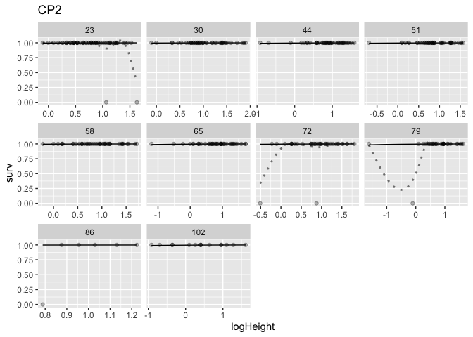

# Incorporate weekly climate into models --> IPM 

Added in climate data

    -   Used moisture and temp for the time interval between t and t+1

    -   Kept SWC and Temp in separate models b/c negatively correlated (r>-0.69 for everything except min temp: r=-0.38)

    -   Think about ways to aggregate

        -   See chillR package for Chilling Hours, Chill Units, Chil Portions, Growing Degree Hours, and Growing Degree Days (Rishav will tackle this first)

        -   Tried daily max, min, and avg + diurnal range for temp 

## Libraries


``` r
library(tidyverse)
```

```
## ── Attaching core tidyverse packages ──────────────────────── tidyverse 2.0.0 ──
## ✔ dplyr     1.1.4     ✔ readr     2.1.5
## ✔ forcats   1.0.0     ✔ stringr   1.5.1
## ✔ ggplot2   3.5.1     ✔ tibble    3.2.1
## ✔ lubridate 1.9.3     ✔ tidyr     1.3.1
## ✔ purrr     1.0.2     
## ── Conflicts ────────────────────────────────────────── tidyverse_conflicts() ──
## ✖ dplyr::filter() masks stats::filter()
## ✖ dplyr::lag()    masks stats::lag()
## ℹ Use the conflicted package (<http://conflicted.r-lib.org/>) to force all conflicts to become errors
```

``` r
library(tidymodels)
```

```
## ── Attaching packages ────────────────────────────────────── tidymodels 1.2.0 ──
## ✔ broom        1.0.7     ✔ rsample      1.2.1
## ✔ dials        1.3.0     ✔ tune         1.2.1
## ✔ infer        1.0.7     ✔ workflows    1.1.4
## ✔ modeldata    1.4.0     ✔ workflowsets 1.1.0
## ✔ parsnip      1.2.1     ✔ yardstick    1.3.1
## ✔ recipes      1.1.0     
## ── Conflicts ───────────────────────────────────────── tidymodels_conflicts() ──
## ✖ scales::discard() masks purrr::discard()
## ✖ dplyr::filter()   masks stats::filter()
## ✖ recipes::fixed()  masks stringr::fixed()
## ✖ dplyr::lag()      masks stats::lag()
## ✖ yardstick::spec() masks readr::spec()
## ✖ recipes::step()   masks stats::step()
## • Use tidymodels_prefer() to resolve common conflicts.
```

``` r
library(multilevelmod)
library(lmerTest)
```

```
## Loading required package: lme4
## Loading required package: Matrix
## 
## Attaching package: 'Matrix'
## 
## The following objects are masked from 'package:tidyr':
## 
##     expand, pack, unpack
## 
## 
## Attaching package: 'lmerTest'
## 
## The following object is masked from 'package:lme4':
## 
##     lmer
## 
## The following object is masked from 'package:recipes':
## 
##     step
## 
## The following object is masked from 'package:stats':
## 
##     step
```

``` r
library(broom.mixed)
library(doMC)
```

```
## Loading required package: foreach
## 
## Attaching package: 'foreach'
## 
## The following objects are masked from 'package:purrr':
## 
##     accumulate, when
## 
## Loading required package: iterators
## Loading required package: parallel
```

``` r
library(furrr)
```

```
## Loading required package: future
```

``` r
library(modelr)
```

```
## 
## Attaching package: 'modelr'
## 
## The following objects are masked from 'package:yardstick':
## 
##     mae, mape, rmse
## 
## The following object is masked from 'package:broom':
## 
##     bootstrap
```

``` r
library(zoo)
```

```
## 
## Attaching package: 'zoo'
## 
## The following objects are masked from 'package:base':
## 
##     as.Date, as.Date.numeric
```

``` r
library(future)
library(chillR)
```

```
## 
## Attaching package: 'chillR'
## 
## The following object is masked from 'package:lubridate':
## 
##     leap_year
```

``` r
library(corrplot)
```

```
## corrplot 0.94 loaded
```

``` r
library(magrittr)
```

```
## 
## Attaching package: 'magrittr'
## 
## The following object is masked from 'package:purrr':
## 
##     set_names
## 
## The following object is masked from 'package:tidyr':
## 
##     extract
```

``` r
conflicted::conflict_prefer("select", "dplyr")
```

```
## [conflicted] Will prefer dplyr::select over any other package.
```

``` r
conflicted::conflict_prefer("filter", "dplyr")
```

```
## [conflicted] Will prefer dplyr::filter over any other package.
```

``` r
conflicted::conflict_prefer("lag", "dplyr")
```

```
## [conflicted] Will prefer dplyr::lag over any other package.
```

## Load the data

``` r
wl2_size_2023 <- read_csv("data/WL2-2023_Size_Combined.csv") %>% select(survey_date, Genotype, parent.pop, height.cm, long.leaf.cm)
```

```
## Rows: 17336 Columns: 10
## ── Column specification ────────────────────────────────────────────────────────
## Delimiter: ","
## chr  (5): block, Genotype, pop.mf, parent.pop, survey.notes
## dbl  (4): mf, rep, height.cm, long.leaf.cm
## date (1): survey_date
## 
## ℹ Use `spec()` to retrieve the full column specification for this data.
## ℹ Specify the column types or set `show_col_types = FALSE` to quiet this message.
```

``` r
unique(wl2_size_2023$parent.pop) #all 23 pops!
```

```
##  [1] "CP2"   "CP3"   "LV1"   "LV3"   "LVTR1" "SQ1"   "SQ2"   "SQ3"   "WL1"  
## [10] "WL2"   "YO11"  "YO4"   "YO7"   "YO8"   "BH"    "CC"    "SC"    "TM2"  
## [19] "DPR"   "FR"    "IH"    "WR"    "WV"
```

``` r
wl2_mort_2023 <- read_csv("data/WL2_Mortality_2023.csv") %>% 
  select(block, BedLoc, Genotype, parent.pop=pop, mf:death.date) %>% 
  mutate(parent.pop= str_replace(parent.pop, "Y08", "YO8")) %>% 
  mutate(parent.pop= str_replace(parent.pop, "Y04", "YO4")) %>% 
mutate(Genotype= str_replace(Genotype, "Y08", "YO8")) %>% 
  mutate(Genotype= str_replace(Genotype, "Y04", "YO4")) 
```

```
## Rows: 1573 Columns: 11
## ── Column specification ────────────────────────────────────────────────────────
## Delimiter: ","
## chr (8): block, BedLoc, bed, bed.col, Genotype, pop, death.date, survey.notes
## dbl (3): bed.row, mf, rep
## 
## ℹ Use `spec()` to retrieve the full column specification for this data.
## ℹ Specify the column types or set `show_col_types = FALSE` to quiet this message.
```

``` r
unique(wl2_mort_2023$parent.pop) #all 23 pops!
```

```
##  [1] "TM2"   "LVTR1" "SQ2"   "YO8"   "CC"    "YO11"  "BH"    "DPR"   "CP2"  
## [10] "WL1"   "IH"    "CP3"   "SC"    "FR"    "LV3"   "YO7"   "WV"    "SQ3"  
## [19] "WL2"   "LV1"   "YO4"   "WR"    "SQ1"
```

``` r
#wl2_size_2023 %>% filter(Genotype=="YO4_2_2") #I_18_C
#wl2_size_2023 %>% filter(Genotype=="YO8_8_4") #B_58_A

#wl2_mort_2023 %>% filter(Genotype=="YO4_2_2")
#wl2_mort_2023 %>% filter(BedLoc=="I_18_C")
#wl2_mort_2023 %>% filter(BedLoc=="B_58_A")
```

## Merge


``` r
wl2_all_2023_OLD <- left_join(wl2_size_2023, wl2_mort_2023) #42 more rows, why? duplicate rows somewhere 
```

```
## Joining with `by = join_by(Genotype, parent.pop)`
```

``` r
wl2_all_2023_OLD %>% group_by(Genotype, survey_date) %>% summarize(n=n()) %>% arrange(desc(n)) 
```

```
## `summarise()` has grouped output by 'Genotype'. You can override using the
## `.groups` argument.
```

```
## # A tibble: 17,305 × 3
## # Groups:   Genotype [1,581]
##    Genotype survey_date     n
##    <chr>    <date>      <int>
##  1 CC_1_2   2023-07-26      2
##  2 CC_1_2   2023-08-02      2
##  3 CC_1_2   2023-08-16      2
##  4 CC_1_2   2023-08-23      2
##  5 CC_1_2   2023-08-30      2
##  6 CC_1_2   2023-09-06      2
##  7 CC_1_2   2023-09-13      2
##  8 CC_1_2   2023-09-20      2
##  9 CC_1_2   2023-10-13      2
## 10 CC_1_2   2023-10-20      2
## # ℹ 17,295 more rows
```

``` r
##Duplicates: CC_1_2, CC_9_6, IH_4_5, SC_5_6, SQ2_6_2
wl2_size_2023 %>% filter(Genotype=="CC_1_2") #duplicated on certain dates  
```

```
## # A tibble: 21 × 5
##    survey_date Genotype parent.pop height.cm long.leaf.cm
##    <date>      <chr>    <chr>          <dbl>        <dbl>
##  1 2023-07-03  CC_1_2   CC               2.1          1.9
##  2 2023-07-26  CC_1_2   CC               8.8          4.4
##  3 2023-07-26  CC_1_2   CC              NA           NA  
##  4 2023-08-02  CC_1_2   CC               9.4          4  
##  5 2023-08-02  CC_1_2   CC              NA           NA  
##  6 2023-08-16  CC_1_2   CC               9.3          4  
##  7 2023-08-16  CC_1_2   CC              NA           NA  
##  8 2023-08-23  CC_1_2   CC               9.9          4.3
##  9 2023-08-23  CC_1_2   CC              NA           NA  
## 10 2023-08-30  CC_1_2   CC               9.3          4  
## # ℹ 11 more rows
```

``` r
wl2_size_2023 %>% filter(Genotype=="CC_9_6") #duplicated on certain dates  
```

```
## # A tibble: 16 × 5
##    survey_date Genotype parent.pop height.cm long.leaf.cm
##    <date>      <chr>    <chr>          <dbl>        <dbl>
##  1 2023-07-03  CC_9_6   CC               4            2.9
##  2 2023-07-26  CC_9_6   CC               8            4.9
##  3 2023-07-26  CC_9_6   CC              NA           NA  
##  4 2023-08-02  CC_9_6   CC               8            5.1
##  5 2023-08-02  CC_9_6   CC              NA           NA  
##  6 2023-08-16  CC_9_6   CC               8            4  
##  7 2023-08-23  CC_9_6   CC               8.1          4.1
##  8 2023-08-30  CC_9_6   CC               9.1          2.3
##  9 2023-09-06  CC_9_6   CC               9.5          4.3
## 10 2023-09-13  CC_9_6   CC              10.8          2.8
## 11 2023-09-13  CC_9_6   CC              NA           NA  
## 12 2023-09-20  CC_9_6   CC              11.6          3.7
## 13 2023-09-27  CC_9_6   CC              12.2          3.1
## 14 2023-09-27  CC_9_6   CC              NA           NA  
## 15 2023-10-20  CC_9_6   CC              14.3          3.9
## 16 2023-10-20  CC_9_6   CC              NA           NA
```

``` r
wl2_size_2023 %>% filter(Genotype=="IH_4_5") #duplicated on certain dates  
```

```
## # A tibble: 21 × 5
##    survey_date Genotype parent.pop height.cm long.leaf.cm
##    <date>      <chr>    <chr>          <dbl>        <dbl>
##  1 2023-07-03  IH_4_5   IH               2.8          2.7
##  2 2023-07-26  IH_4_5   IH              NA           NA  
##  3 2023-07-26  IH_4_5   IH              NA           NA  
##  4 2023-08-02  IH_4_5   IH              NA           NA  
##  5 2023-08-02  IH_4_5   IH              NA           NA  
##  6 2023-08-16  IH_4_5   IH              NA           NA  
##  7 2023-08-16  IH_4_5   IH              NA           NA  
##  8 2023-08-23  IH_4_5   IH              NA           NA  
##  9 2023-08-23  IH_4_5   IH              NA           NA  
## 10 2023-08-30  IH_4_5   IH              NA           NA  
## # ℹ 11 more rows
```

``` r
wl2_size_2023 %>% filter(Genotype=="SC_5_6") #duplicated on certain dates  
```

```
## # A tibble: 16 × 5
##    survey_date Genotype parent.pop height.cm long.leaf.cm
##    <date>      <chr>    <chr>          <dbl>        <dbl>
##  1 2023-07-03  SC_5_6   SC               2.2          2.3
##  2 2023-07-26  SC_5_6   SC               2.9          4.3
##  3 2023-07-26  SC_5_6   SC              NA           NA  
##  4 2023-08-02  SC_5_6   SC               2.7          3.6
##  5 2023-08-02  SC_5_6   SC              NA           NA  
##  6 2023-08-16  SC_5_6   SC               2.6          3.7
##  7 2023-08-23  SC_5_6   SC               2.6          3.7
##  8 2023-08-30  SC_5_6   SC               2.2          3.2
##  9 2023-09-06  SC_5_6   SC               2.7          4.3
## 10 2023-09-13  SC_5_6   SC               2.8          3.9
## 11 2023-09-13  SC_5_6   SC              NA           NA  
## 12 2023-09-20  SC_5_6   SC               3.9          4  
## 13 2023-09-27  SC_5_6   SC               4.5          3.7
## 14 2023-09-27  SC_5_6   SC              NA           NA  
## 15 2023-10-20  SC_5_6   SC               5.1          4.2
## 16 2023-10-20  SC_5_6   SC              NA           NA
```

``` r
wl2_size_2023 %>% filter(Genotype=="SQ2_6_2") #duplicated on certain dates  
```

```
## # A tibble: 12 × 5
##    survey_date Genotype parent.pop height.cm long.leaf.cm
##    <date>      <chr>    <chr>          <dbl>        <dbl>
##  1 2023-07-03  SQ2_6_2  SQ2              0.6          1.1
##  2 2023-07-26  SQ2_6_2  SQ2             NA           NA  
##  3 2023-07-26  SQ2_6_2  SQ2              1.6          2.6
##  4 2023-08-02  SQ2_6_2  SQ2              1.3          2.7
##  5 2023-08-16  SQ2_6_2  SQ2              1.2          2.5
##  6 2023-08-23  SQ2_6_2  SQ2              1.4          1.9
##  7 2023-08-30  SQ2_6_2  SQ2              1.2          0.4
##  8 2023-09-06  SQ2_6_2  SQ2              1.3         NA  
##  9 2023-09-13  SQ2_6_2  SQ2              0.9         NA  
## 10 2023-09-20  SQ2_6_2  SQ2              0.9         NA  
## 11 2023-10-13  SQ2_6_2  SQ2             NA           NA  
## 12 2023-10-20  SQ2_6_2  SQ2             NA           NA
```

``` r
#anti_join(wl2_size_2023, wl2_mort_2023) #8 rows in the size dataframe without death date info, probably died at planting 
#anti_join(wl2_mort_2023, wl2_size_2023)

#GET RID OF DUPLICATES:
wl2_size_2023_merge_prep <- wl2_size_2023 %>% 
  arrange(Genotype, survey_date, height.cm) %>% 
  distinct(Genotype, survey_date, .keep_all=TRUE)
wl2_size_2023_merge_prep %>% filter(Genotype=="YO4_2_2")
```

```
## # A tibble: 11 × 5
##    survey_date Genotype parent.pop height.cm long.leaf.cm
##    <date>      <chr>    <chr>          <dbl>        <dbl>
##  1 2023-07-03  YO4_2_2  YO4              1.2          0.7
##  2 2023-07-26  YO4_2_2  YO4              3            2.4
##  3 2023-08-02  YO4_2_2  YO4             NA           NA  
##  4 2023-08-16  YO4_2_2  YO4             NA           NA  
##  5 2023-08-23  YO4_2_2  YO4             NA           NA  
##  6 2023-08-30  YO4_2_2  YO4             NA           NA  
##  7 2023-09-06  YO4_2_2  YO4             NA           NA  
##  8 2023-09-13  YO4_2_2  YO4             NA           NA  
##  9 2023-09-20  YO4_2_2  YO4             NA           NA  
## 10 2023-10-13  YO4_2_2  YO4             NA           NA  
## 11 2023-10-20  YO4_2_2  YO4             NA           NA
```

``` r
#Merge with corrections 
wl2_all_2023 <- left_join(wl2_size_2023_merge_prep, wl2_mort_2023) %>%
  select(survey_date:parent.pop, mf:rep,block:BedLoc, height.cm, long.leaf.cm, death.date) %>% 
  drop_na(block) #get rid of plants that were not planted and never got a block assigned. 
```

```
## Joining with `by = join_by(Genotype, parent.pop)`
```

``` r
tail(wl2_all_2023, 10)
```

```
## # A tibble: 10 × 10
##    survey_date Genotype parent.pop    mf   rep block BedLoc height.cm
##    <date>      <chr>    <chr>      <dbl> <dbl> <chr> <chr>      <dbl>
##  1 2023-07-26  YO8_8_9  YO8            8     9 G     D_26_A        NA
##  2 2023-08-02  YO8_8_9  YO8            8     9 G     D_26_A        NA
##  3 2023-08-16  YO8_8_9  YO8            8     9 G     D_26_A        NA
##  4 2023-08-23  YO8_8_9  YO8            8     9 G     D_26_A        NA
##  5 2023-08-30  YO8_8_9  YO8            8     9 G     D_26_A        NA
##  6 2023-09-06  YO8_8_9  YO8            8     9 G     D_26_A        NA
##  7 2023-09-13  YO8_8_9  YO8            8     9 G     D_26_A        NA
##  8 2023-09-20  YO8_8_9  YO8            8     9 G     D_26_A        NA
##  9 2023-10-13  YO8_8_9  YO8            8     9 G     D_26_A        NA
## 10 2023-10-20  YO8_8_9  YO8            8     9 G     D_26_A        NA
## # ℹ 2 more variables: long.leaf.cm <dbl>, death.date <chr>
```

``` r
unique(wl2_all_2023$death.date)
```

```
##  [1] NA         "7/26/23"  "8/9/23"   "8/2/23"   "8/16/23"  "8/23/23" 
##  [7] "9/13/23"  "8/30/23"  "10/27/23" "9/20/23"  "10/20/23" "10/13/23"
## [13] "9/27/23"  "9/6/23"   "7/11/23"
```

## Add in surv and sizenext columns


``` r
wl2_all_2023_timeprep <- wl2_all_2023 %>% 
  select(-long.leaf.cm) %>% 
  mutate(death.date=mdy(death.date)) %>% 
  group_by(Genotype) %>% 
  mutate(height_next = lead(height.cm, order_by = survey_date), #next timepoints height
        # survey_date_char = as.character(survey_date), #grouping variable to compare to continuous survey date 
         date_next = lead(survey_date, order_by = survey_date), #needed for surv code and interval calc
         elapsed_days= date_next - survey_date, #interval length in days
         elapsed_weeks = as.integer(elapsed_days)/7, #interval length in weeks 
         surv=if_else(is.na(death.date), 1,
                      if_else(date_next>=death.date, 0, 1))) %>% #survival to the next size time point
  ungroup() %>%
  mutate(week = as.numeric(survey_date - ymd("2023-07-03")), #Weeks since pre-transplant size 
         pop.mf=str_c(parent.pop, "_", mf)) %>% #for specifying random effects separately  
  drop_na(height.cm, height_next, surv) #for models
         
#wl2_all_2023_timeprep %>% arrange(Genotype, survey_date)

unique(wl2_all_2023_timeprep$elapsed_days) #mostly 1 or 2 weeks. 20 or 23 days from initial size measurements on campus to field measurements 
```

```
## [1] 23  7 14 20
```

``` r
unique(wl2_all_2023_timeprep$week)
```

```
##  [1]   0  23  30  44  51  58  65  72  79 102  86   3
```

``` r
unique(wl2_all_2023_timeprep$block)
```

```
##  [1] "L" "H" "J" "K" "B" "C" "E" "I" "M" "A" "D" "F" "G"
```

``` r
unique(wl2_all_2023_timeprep$parent.pop)
```

```
##  [1] "BH"    "CC"    "CP2"   "CP3"   "DPR"   "FR"    "IH"    "LV1"   "LV3"  
## [10] "LVTR1" "SC"    "SQ1"   "SQ2"   "SQ3"   "TM2"   "WL1"   "WL2"   "WR"   
## [19] "YO11"  "YO4"   "YO7"   "YO8"
```

``` r
unique(wl2_all_2023_timeprep$pop.mf)
```

```
##   [1] "BH_1"    "BH_2"    "BH_3"    "BH_4"    "BH_5"    "BH_6"    "BH_7"   
##   [8] "CC_1"    "CC_2"    "CC_3"    "CC_4"    "CC_5"    "CC_8"    "CC_9"   
##  [15] "CP2_1"   "CP2_2"   "CP2_3"   "CP2_4"   "CP2_5"   "CP2_6"   "CP2_7"  
##  [22] "CP3_1"   "CP3_2"   "CP3_3"   "CP3_4"   "CP3_5"   "CP3_6"   "CP3_7"  
##  [29] "DPR_1"   "DPR_3"   "DPR_4"   "DPR_5"   "DPR_6"   "DPR_7"   "DPR_8"  
##  [36] "FR_1"    "FR_2"    "FR_3"    "FR_4"    "FR_5"    "FR_6"    "FR_7"   
##  [43] "IH_1"    "IH_2"    "IH_3"    "IH_4"    "IH_5"    "IH_6"    "IH_7"   
##  [50] "LV1_1"   "LV1_2"   "LV1_3"   "LV1_4"   "LV1_5"   "LV1_6"   "LV1_8"  
##  [57] "LV3_3"   "LV3_5"   "LV3_6"   "LV3_7"   "LVTR1_2" "LVTR1_3" "LVTR1_4"
##  [64] "LVTR1_5" "LVTR1_6" "LVTR1_7" "LVTR1_8" "SC_2"    "SC_4"    "SC_5"   
##  [71] "SC_6"    "SC_7"    "SC_8"    "SQ1_14"  "SQ1_2"   "SQ1_3"   "SQ1_4"  
##  [78] "SQ1_5"   "SQ1_6"   "SQ2_11"  "SQ2_13"  "SQ2_1"   "SQ2_2"   "SQ2_4"  
##  [85] "SQ2_6"   "SQ2_8"   "SQ3_1"   "SQ3_2"   "SQ3_3"   "SQ3_4"   "SQ3_5"  
##  [92] "SQ3_6"   "TM2_1"   "TM2_2"   "TM2_3"   "TM2_4"   "TM2_5"   "TM2_6"  
##  [99] "TM2_7"   "WL1_10"  "WL1_2"   "WL1_3"   "WL1_4"   "WL1_7"   "WL1_9"  
## [106] "WL2_1"   "WL2_2"   "WL2_3"   "WL2_5"   "WL2_6"   "WL2_7"   "WL2_8"  
## [113] "WR_2"    "WR_3"    "YO11_1"  "YO11_3"  "YO11_4"  "YO11_5"  "YO11_6" 
## [120] "YO11_7"  "YO11_8"  "YO4_1"   "YO4_2"   "YO4_3"   "YO4_4"   "YO4_5"  
## [127] "YO4_6"   "YO4_9"   "YO7_1"   "YO7_2"   "YO7_3"   "YO7_4"   "YO7_5"  
## [134] "YO7_6"   "YO7_7"   "YO8_1"   "YO8_2"   "YO8_3"   "YO8_4"   "YO8_5"  
## [141] "YO8_6"   "YO8_8"
```

### Scaling and transformations

``` r
summary(wl2_all_2023_timeprep)
```

```
##   survey_date           Genotype          parent.pop              mf        
##  Min.   :2023-07-03   Length:6981        Length:6981        Min.   : 1.000  
##  1st Qu.:2023-07-26   Class :character   Class :character   1st Qu.: 3.000  
##  Median :2023-08-23   Mode  :character   Mode  :character   Median : 5.000  
##  Mean   :2023-08-18                                         Mean   : 4.648  
##  3rd Qu.:2023-09-06                                         3rd Qu.: 6.000  
##  Max.   :2023-10-13                                         Max.   :14.000  
##                                                                             
##       rep            block              BedLoc            height.cm     
##  Min.   : 1.000   Length:6981        Length:6981        Min.   : 0.100  
##  1st Qu.: 4.000   Class :character   Class :character   1st Qu.: 1.900  
##  Median : 7.000   Mode  :character   Mode  :character   Median : 3.400  
##  Mean   : 7.577                                         Mean   : 4.677  
##  3rd Qu.:11.000                                         3rd Qu.: 6.000  
##  Max.   :27.000                                         Max.   :39.400  
##                                                                         
##    death.date          height_next       date_next          elapsed_days     
##  Min.   :2023-07-26   Min.   : 0.100   Min.   :2023-07-26   Length:6981      
##  1st Qu.:2023-08-23   1st Qu.: 2.200   1st Qu.:2023-08-02   Class :difftime  
##  Median :2023-09-27   Median : 3.800   Median :2023-08-30   Mode  :numeric   
##  Mean   :2023-09-21   Mean   : 5.164   Mean   :2023-08-29                    
##  3rd Qu.:2023-10-20   3rd Qu.: 6.500   3rd Qu.:2023-09-13                    
##  Max.   :2023-10-27   Max.   :39.400   Max.   :2023-10-20                    
##  NA's   :4674                                                                
##  elapsed_weeks        surv             week          pop.mf         
##  Min.   :1.000   Min.   :0.0000   Min.   :  0.0   Length:6981       
##  1st Qu.:1.000   1st Qu.:1.0000   1st Qu.: 23.0   Class :character  
##  Median :1.000   Median :1.0000   Median : 51.0   Mode  :character  
##  Mean   :1.617   Mean   :0.9851   Mean   : 46.2                     
##  3rd Qu.:2.000   3rd Qu.:1.0000   3rd Qu.: 65.0                     
##  Max.   :3.286   Max.   :1.0000   Max.   :102.0                     
## 
```

``` r
wl2_all_2023_timeprep %>%  #pretty skewed
  ggplot(aes(x=height.cm)) +
  geom_histogram()
```

```
## `stat_bin()` using `bins = 30`. Pick better value with `binwidth`.
```

<!-- -->

``` r
wl2_all_2023_timeprep_scaled <- wl2_all_2023_timeprep %>% 
  mutate(logHeight=log(height.cm))  #transform height to be more normal - only for surv models 

wl2_all_2023_timeprep_scaled %>% #better
  ggplot(aes(x=logHeight)) +
  geom_histogram()
```

```
## `stat_bin()` using `bins = 30`. Pick better value with `binwidth`.
```

<!-- -->

## Add in weekly climate data


``` r
swc_raw <- read_csv("data/WL2_2023_Bed_C_Soil_Moisture_Corrected.csv") %>% 
  mutate(Date_Time=mdy_hm(Date_Time))
```

```
## Rows: 2209 Columns: 6
## ── Column specification ────────────────────────────────────────────────────────
## Delimiter: ","
## chr (1): Date_Time
## dbl (5): Port_1, Port_2, Port_3, Port_4, Port_5
## 
## ℹ Use `spec()` to retrieve the full column specification for this data.
## ℹ Specify the column types or set `show_col_types = FALSE` to quiet this message.
```

``` r
head(swc_raw)
```

```
## # A tibble: 6 × 6
##   Date_Time           Port_1 Port_2 Port_3 Port_4 Port_5
##   <dttm>               <dbl>  <dbl>  <dbl>  <dbl>  <dbl>
## 1 2023-07-20 12:00:00  0.071  0.141  0.075  0.055  0.092
## 2 2023-07-20 13:00:00  0.07   0.142  0.077  0.056  0.094
## 3 2023-07-20 14:00:00  0.074  0.142  0.079  0.056  0.094
## 4 2023-07-20 15:00:00  0.076  0.141  0.081  0.055  0.094
## 5 2023-07-20 16:00:00  0.077  0.14   0.082  0.054  0.093
## 6 2023-07-20 17:00:00  0.077  0.136  0.081  0.052  0.091
```

``` r
swc_port_avgs <- swc_raw %>% #avg across the probes (all in same bed)
  rowwise() %>% #for each row...
  mutate(SWC_port_avg = mean(c_across(-Date_Time))) %>%  #avg across all columns except Date_Time  
  select(Date_Time, SWC_port_avg) %>%
  mutate(Date=as.Date(Date_Time)) 

swc_daily_summary <- swc_port_avgs%>%
  group_by(Date) %>%
  summarize(
    Daily_AvgSWC = mean(SWC_port_avg),
    Daily_MaxSWC = max(SWC_port_avg),
    Daily_MinSWC = min(SWC_port_avg))
head(swc_daily_summary)
```

```
## # A tibble: 6 × 4
##   Date       Daily_AvgSWC Daily_MaxSWC Daily_MinSWC
##   <date>            <dbl>        <dbl>        <dbl>
## 1 2023-07-20       0.0853       0.0894       0.0808
## 2 2023-07-21       0.0809       0.0868       0.076 
## 3 2023-07-22       0.0754       0.0808       0.0714
## 4 2023-07-23       0.0711       0.076        0.0664
## 5 2023-07-24       0.0668       0.0718       0.0614
## 6 2023-07-25       0.0622       0.068        0.0588
```

``` r
summary(swc_daily_summary)
```

```
##       Date             Daily_AvgSWC        Daily_MaxSWC      Daily_MinSWC     
##  Min.   :2023-07-20   Min.   :-0.002183   Min.   :0.00340   Min.   :-0.00720  
##  1st Qu.:2023-08-12   1st Qu.: 0.066708   1st Qu.:0.07520   1st Qu.: 0.06220  
##  Median :2023-09-04   Median : 0.093250   Median :0.10120   Median : 0.08700  
##  Mean   :2023-09-04   Mean   : 0.085346   Mean   :0.09534   Mean   : 0.07939  
##  3rd Qu.:2023-09-27   3rd Qu.: 0.109600   3rd Qu.:0.11920   3rd Qu.: 0.10520  
##  Max.   :2023-10-20   Max.   : 0.155433   Max.   :0.19740   Max.   : 0.14100
```

            

``` r
soil_temp_raw <- read_csv("data/WL2_2022_2023_iButton_Data_Corrected.csv") %>% 
  mutate(Date_Time=mdy_hm(Date_Time))
```

```
## New names:
## Rows: 14253 Columns: 4
## ── Column specification
## ──────────────────────────────────────────────────────── Delimiter: "," chr
## (3): Bed, Date_Time, ...3 dbl (1): SoilTemp
## ℹ Use `spec()` to retrieve the full column specification for this data. ℹ
## Specify the column types or set `show_col_types = FALSE` to quiet this message.
## • `` -> `...3`
```

``` r
head(soil_temp_raw)
```

```
## # A tibble: 6 × 4
##   Bed   Date_Time           ...3  SoilTemp
##   <chr> <dttm>              <chr>    <dbl>
## 1 A     2022-10-27 18:02:00 C          7.5
## 2 A     2022-10-27 21:02:00 C          2  
## 3 A     2022-10-28 00:02:00 C          0  
## 4 A     2022-10-28 03:02:00 C         -0.5
## 5 A     2022-10-28 06:02:00 C         -0.5
## 6 A     2022-10-28 09:02:00 C         -0.5
```

``` r
unique(soil_temp_raw$Bed) #probes not spread out enough to assign half of the field to one probe and the other half to another...
```

```
## [1] "A"   "A_1" "A_2" "I"   "D_1" "D_2" "D_3"
```

``` r
#A_2 kind of captures the variance and the trends of the other probes 

soil_temp_bedA <- soil_temp_raw %>% 
  filter(Bed=="A_2") %>% 
  separate(Date_Time, into = c("Date", "Time"), sep = " ") %>% 
   mutate(Date=as.Date(Date)) %>% 
  select(Bed:Time, SoilTemp)

soil_temp_daily_summary <- soil_temp_bedA %>% 
  group_by(Date) %>%
  summarize(
    Daily_AvgTemp = mean(SoilTemp),
    Daily_MaxTemp = max(SoilTemp),
    Daily_MinTemp = min(SoilTemp),
    Diurnal_Range = Daily_MaxTemp-Daily_MinTemp)
head(soil_temp_daily_summary)
```

```
## # A tibble: 6 × 5
##   Date       Daily_AvgTemp Daily_MaxTemp Daily_MinTemp Diurnal_Range
##   <date>             <dbl>         <dbl>         <dbl>         <dbl>
## 1 2023-07-13          17.8          27            12.5          14.5
## 2 2023-07-14          15.8          24.5           8.5          16  
## 3 2023-07-15          17.2          25            11            14  
## 4 2023-07-16          17.5          25            11            14  
## 5 2023-07-17          18.9          25.5          14.5          11  
## 6 2023-07-18          18.2          25            13.5          11.5
```

``` r
summary(soil_temp_daily_summary)
```

```
##       Date            Daily_AvgTemp    Daily_MaxTemp   Daily_MinTemp   
##  Min.   :2023-07-13   Min.   : 7.792   Min.   :11.50   Min.   : 2.500  
##  1st Qu.:2023-08-03   1st Qu.:15.427   1st Qu.:27.38   1st Qu.: 8.625  
##  Median :2023-08-24   Median :18.990   Median :33.50   Median :10.000  
##  Mean   :2023-08-24   Mean   :18.389   Mean   :32.81   Mean   : 9.529  
##  3rd Qu.:2023-09-14   3rd Qu.:20.656   3rd Qu.:37.00   3rd Qu.:11.500  
##  Max.   :2023-10-06   Max.   :25.458   Max.   :50.50   Max.   :14.500  
##  Diurnal_Range  
##  Min.   : 4.00  
##  1st Qu.:20.00  
##  Median :24.00  
##  Mean   :23.28  
##  3rd Qu.:28.00  
##  Max.   :40.00
```

### Visualize trends


``` r
swc_daily_summary %>% 
  ggplot(aes(x=Date, Daily_AvgSWC)) +
  geom_point()
```

<!-- -->

``` r
swc_daily_summary %>% 
  ggplot(aes(x=Date, Daily_MaxSWC)) +
  geom_point()
```

<!-- -->

``` r
swc_daily_summary %>% 
  ggplot(aes(x=Date, Daily_MinSWC)) +
  geom_point()
```

<!-- -->


``` r
soil_temp_daily_summary %>% 
  ggplot(aes(x=Date, Daily_AvgTemp)) +
  geom_point()
```

<!-- -->

``` r
soil_temp_daily_summary %>% 
  ggplot(aes(x=Date, Daily_MaxTemp)) +
  geom_point()
```

<!-- -->

``` r
soil_temp_daily_summary %>% 
  ggplot(aes(x=Date, Daily_MinTemp)) +
  geom_point()
```

<!-- -->

``` r
soil_temp_daily_summary %>% 
  ggplot(aes(x=Date, Diurnal_Range)) +
  geom_point()
```

<!-- -->


## Correlation between temp and swc

-   Check correlation to see if they go in the same model or need to be kept separate 


``` r
daily_temp_swc <- full_join(swc_daily_summary, soil_temp_daily_summary) %>% 
  drop_na() #drop NAs - note you lose some dates for both temp and swc 
```

```
## Joining with `by = join_by(Date)`
```

``` r
summary(daily_temp_swc)
```

```
##       Date             Daily_AvgSWC        Daily_MaxSWC      Daily_MinSWC     
##  Min.   :2023-07-20   Min.   :-0.002183   Min.   :0.00340   Min.   :-0.00720  
##  1st Qu.:2023-08-08   1st Qu.: 0.060154   1st Qu.:0.06830   1st Qu.: 0.05660  
##  Median :2023-08-28   Median : 0.087142   Median :0.09360   Median : 0.07980  
##  Mean   :2023-08-28   Mean   : 0.082364   Mean   :0.09213   Mean   : 0.07623  
##  3rd Qu.:2023-09-16   3rd Qu.: 0.110796   3rd Qu.:0.11950   3rd Qu.: 0.10530  
##  Max.   :2023-10-06   Max.   : 0.155433   Max.   :0.19740   Max.   : 0.14100  
##  Daily_AvgTemp    Daily_MaxTemp   Daily_MinTemp    Diurnal_Range  
##  Min.   : 7.792   Min.   :11.50   Min.   : 2.500   Min.   : 4.00  
##  1st Qu.:15.188   1st Qu.:30.25   1st Qu.: 8.000   1st Qu.:21.00  
##  Median :19.229   Median :33.50   Median :10.000   Median :24.50  
##  Mean   :18.462   Mean   :33.47   Mean   : 9.316   Mean   :24.16  
##  3rd Qu.:20.958   3rd Qu.:37.50   3rd Qu.:11.500   3rd Qu.:28.00  
##  Max.   :25.458   Max.   :50.50   Max.   :14.000   Max.   :40.00
```

``` r
temp_swc_scaled <- daily_temp_swc %>% select(Daily_AvgSWC:Diurnal_Range) %>% scale() #normalize the data so they're all on the same scale
#head(temp_swc_scaled)
cor.norm_tempswc = cor(temp_swc_scaled) #test correlations among the traits
cor.sig_tempswc <- cor.mtest(temp_swc_scaled, method="pearson") #test significance of corrs
corrplot(cor.norm_tempswc, type = "upper",
         tl.srt = 45, p.mat = cor.sig_tempswc$p, 
         sig.level = 0.05, insig="blank") # a lot of significant correlations! --> keep separate 
```

<!-- -->

``` r
cor.norm_tempswc
```

```
##               Daily_AvgSWC Daily_MaxSWC Daily_MinSWC Daily_AvgTemp
## Daily_AvgSWC     1.0000000    0.9589254    0.9840262    -0.6947392
## Daily_MaxSWC     0.9589254    1.0000000    0.9055522    -0.7279555
## Daily_MinSWC     0.9840262    0.9055522    1.0000000    -0.6568684
## Daily_AvgTemp   -0.6947392   -0.7279555   -0.6568684     1.0000000
## Daily_MaxTemp   -0.7732206   -0.8297575   -0.7190848     0.9295710
## Daily_MinTemp   -0.3805168   -0.3377999   -0.3994371     0.7451953
## Diurnal_Range   -0.7295240   -0.8077717   -0.6623608     0.7754461
##               Daily_MaxTemp Daily_MinTemp Diurnal_Range
## Daily_AvgSWC     -0.7732206    -0.3805168    -0.7295240
## Daily_MaxSWC     -0.8297575    -0.3377999    -0.8077717
## Daily_MinSWC     -0.7190848    -0.3994371    -0.6623608
## Daily_AvgTemp     0.9295710     0.7451953     0.7754461
## Daily_MaxTemp     1.0000000     0.4726511     0.9503613
## Daily_MinTemp     0.4726511     1.0000000     0.1749898
## Diurnal_Range     0.9503613     0.1749898     1.0000000
```

``` r
#use only daily AVG SWC b/c highly correlated to max and min swc (r > 0.96)
#avg and max temp highly correlated (r=0.93)
#max temp and diurnal range highly correlated (r=0.95) --> don't use max temp 
```

## Merge with size/surv data 

``` r
date_intervals <- wl2_all_2023 %>% 
  select(survey_date) %>% 
  distinct() %>% 
  mutate(prev_date = lag(survey_date, order_by = survey_date)) 
#date_intervals %>% arrange(survey_date)
```


``` r
swc_intervals <- swc_daily_summary %>% 
  mutate(Interval=if_else(Date>="2023-07-26" & Date<"2023-08-02", 1,
                                if_else(Date>="2023-08-02" & Date<"2023-08-16", 2,
                                if_else(Date>="2023-08-16" & Date<"2023-08-23", 3,
                                if_else(Date>="2023-08-23" & Date<"2023-08-30", 4,
                                if_else(Date>="2023-08-30" & Date<"2023-09-06", 5,
                                if_else(Date>="2023-09-06" & Date<"2023-09-13", 6,
                                if_else(Date>="2023-09-13" & Date<"2023-09-20", 7,
                                if_else(Date>="2023-09-20" & Date<"2023-09-27", 8,
                                if_else(Date>="2023-09-27" & Date<"2023-10-13", 9,
                                if_else(Date>="2023-10-13" & Date<"2023-10-20", 10, NA))))))))))) %>% 
  select(Date:Daily_AvgSWC, Interval) %>% 
  group_by(Interval) %>% 
  filter(!is.na(Interval)) %>% 
  summarise(meanSWC=mean(Daily_AvgSWC, na.rm=TRUE))
```


``` r
soil_temp_intervals <- soil_temp_daily_summary %>% 
  mutate(Interval=if_else(Date>="2023-07-26" & Date<"2023-08-02", 1,
                                                    if_else(Date>="2023-08-02" & Date<"2023-08-16", 2,
                                                    if_else(Date>="2023-08-16" & Date<"2023-08-23", 3,
                                                    if_else(Date>="2023-08-23" & Date<"2023-08-30", 4,
                                                    if_else(Date>="2023-08-30" & Date<"2023-09-06", 5,
                                                    if_else(Date>="2023-09-06" & Date<"2023-09-13", 6,
                                                    if_else(Date>="2023-09-13" & Date<"2023-09-20", 7,
                                                    if_else(Date>="2023-09-20" & Date<"2023-09-27", 8,
                                                    if_else(Date>="2023-09-27" & Date<"2023-10-13", 9,
                                                    if_else(Date>="2023-10-13" & Date<"2023-10-20", 10, NA))))))))))) %>% 
  group_by(Interval) %>% 
  filter(!is.na(Interval)) %>% 
  summarise(meanTemp=mean(Daily_AvgTemp, na.rm=TRUE), maxTemp=max(Daily_MaxTemp, na.rm = TRUE), 
            minTemp=min(Daily_MinTemp, na.rm = TRUE), meanDiurnal_Range=mean(Diurnal_Range, na.rm = TRUE))
```


``` r
wl2_all_2023_clim_for_surv <- wl2_all_2023_timeprep_scaled %>% 
  mutate(Interval=if_else(survey_date=="2023-07-26", 1,
                              if_else(survey_date=="2023-08-02", 2,
                              if_else(survey_date=="2023-08-16", 3,
                              if_else(survey_date=="2023-08-23", 4,
                              if_else(survey_date=="2023-08-30", 5,
                              if_else(survey_date=="2023-09-06", 6,
                              if_else(survey_date=="2023-09-13", 7,
                              if_else(survey_date=="2023-09-20", 8,
                              if_else(survey_date=="2023-09-27", 9,
                              if_else(survey_date=="2023-10-13", 10, NA))))))))))) %>% 
  left_join(soil_temp_intervals) %>% 
  left_join(swc_intervals) %>% 
  filter(!is.na(Interval))
```

```
## Joining with `by = join_by(Interval)`
## Joining with `by = join_by(Interval)`
```

``` r
head(wl2_all_2023_clim_for_surv)
```

```
## # A tibble: 6 × 23
##   survey_date Genotype parent.pop    mf   rep block BedLoc height.cm death.date
##   <date>      <chr>    <chr>      <dbl> <dbl> <chr> <chr>      <dbl> <date>    
## 1 2023-07-26  BH_1_1   BH             1     1 L     I_18_A       4.7 NA        
## 2 2023-08-02  BH_1_1   BH             1     1 L     I_18_A       4.8 NA        
## 3 2023-08-16  BH_1_1   BH             1     1 L     I_18_A       4.9 NA        
## 4 2023-08-23  BH_1_1   BH             1     1 L     I_18_A       5.7 NA        
## 5 2023-08-30  BH_1_1   BH             1     1 L     I_18_A       4.9 NA        
## 6 2023-09-06  BH_1_1   BH             1     1 L     I_18_A       3.6 NA        
## # ℹ 14 more variables: height_next <dbl>, date_next <date>,
## #   elapsed_days <drtn>, elapsed_weeks <dbl>, surv <dbl>, week <dbl>,
## #   pop.mf <chr>, logHeight <dbl>, Interval <dbl>, meanTemp <dbl>,
## #   maxTemp <dbl>, minTemp <dbl>, meanDiurnal_Range <dbl>, meanSWC <dbl>
```

``` r
summary(wl2_all_2023_clim_for_surv)
```

```
##   survey_date           Genotype          parent.pop              mf        
##  Min.   :2023-07-26   Length:5911        Length:5911        Min.   : 1.000  
##  1st Qu.:2023-08-02   Class :character   Class :character   1st Qu.: 3.000  
##  Median :2023-08-30   Mode  :character   Mode  :character   Median : 5.000  
##  Mean   :2023-08-26                                         Mean   : 4.657  
##  3rd Qu.:2023-09-13                                         3rd Qu.: 7.000  
##  Max.   :2023-10-13                                         Max.   :14.000  
##                                                                             
##       rep            block              BedLoc            height.cm     
##  Min.   : 1.000   Length:5911        Length:5911        Min.   : 0.100  
##  1st Qu.: 4.000   Class :character   Class :character   1st Qu.: 2.400  
##  Median : 7.000   Mode  :character   Mode  :character   Median : 3.900  
##  Mean   : 7.569                                         Mean   : 5.228  
##  3rd Qu.:11.000                                         3rd Qu.: 6.600  
##  Max.   :27.000                                         Max.   :39.400  
##                                                                         
##    death.date          height_next       date_next          elapsed_days     
##  Min.   :2023-08-02   Min.   : 0.100   Min.   :2023-08-02   Length:5911      
##  1st Qu.:2023-09-20   1st Qu.: 2.300   1st Qu.:2023-08-16   Class :difftime  
##  Median :2023-10-13   Median : 3.900   Median :2023-09-06   Mode  :numeric   
##  Mean   :2023-09-30   Mean   : 5.404   Mean   :2023-09-04                    
##  3rd Qu.:2023-10-20   3rd Qu.: 6.800   3rd Qu.:2023-09-20                    
##  Max.   :2023-10-27   Max.   :39.400   Max.   :2023-10-20                    
##  NA's   :4208                                                                
##  elapsed_weeks        surv            week           pop.mf         
##  Min.   :1.000   Min.   :0.000   Min.   : 23.00   Length:5911       
##  1st Qu.:1.000   1st Qu.:1.000   1st Qu.: 30.00   Class :character  
##  Median :1.000   Median :1.000   Median : 58.00   Mode  :character  
##  Mean   :1.321   Mean   :0.987   Mean   : 54.52                     
##  3rd Qu.:1.000   3rd Qu.:1.000   3rd Qu.: 72.00                     
##  Max.   :3.286   Max.   :1.000   Max.   :102.00                     
##                                                                     
##    logHeight          Interval         meanTemp        maxTemp     
##  Min.   :-2.3026   Min.   : 1.000   Min.   :11.84   Min.   :33.50  
##  1st Qu.: 0.8755   1st Qu.: 2.000   1st Qu.:15.62   1st Qu.:35.50  
##  Median : 1.3610   Median : 5.000   Median :19.13   Median :37.50  
##  Mean   : 1.3615   Mean   : 4.702   Mean   :18.78   Mean   :39.16  
##  3rd Qu.: 1.8871   3rd Qu.: 7.000   3rd Qu.:22.07   3rd Qu.:44.00  
##  Max.   : 3.6738   Max.   :10.000   Max.   :23.32   Max.   :50.50  
##                                     NA's   :320     NA's   :320    
##     minTemp       meanDiurnal_Range    meanSWC       
##  Min.   : 2.500   Min.   :15.64     Min.   :0.02366  
##  1st Qu.: 4.000   1st Qu.:18.90     1st Qu.:0.04298  
##  Median : 9.000   Median :23.71     Median :0.09962  
##  Mean   : 7.945   Mean   :24.03     Mean   :0.08703  
##  3rd Qu.:10.500   3rd Qu.:28.50     3rd Qu.:0.11820  
##  Max.   :10.500   Max.   :33.36     Max.   :0.12406  
##  NA's   :320      NA's   :320
```

``` r
names(wl2_all_2023_clim_for_surv)
```

```
##  [1] "survey_date"       "Genotype"          "parent.pop"       
##  [4] "mf"                "rep"               "block"            
##  [7] "BedLoc"            "height.cm"         "death.date"       
## [10] "height_next"       "date_next"         "elapsed_days"     
## [13] "elapsed_weeks"     "surv"              "week"             
## [16] "pop.mf"            "logHeight"         "Interval"         
## [19] "meanTemp"          "maxTemp"           "minTemp"          
## [22] "meanDiurnal_Range" "meanSWC"
```


``` r
wl2_all_2023_clim_for_growth <- wl2_all_2023_timeprep %>% 
  mutate(Interval=if_else(survey_date=="2023-07-26", 1,
                              if_else(survey_date=="2023-08-02", 2,
                              if_else(survey_date=="2023-08-16", 3,
                              if_else(survey_date=="2023-08-23", 4,
                              if_else(survey_date=="2023-08-30", 5,
                              if_else(survey_date=="2023-09-06", 6,
                              if_else(survey_date=="2023-09-13", 7,
                              if_else(survey_date=="2023-09-20", 8,
                              if_else(survey_date=="2023-09-27", 9,
                              if_else(survey_date=="2023-10-13", 10, NA))))))))))) %>% 
  left_join(soil_temp_intervals) %>% 
  left_join(swc_intervals) %>% 
  filter(!is.na(Interval))
```

```
## Joining with `by = join_by(Interval)`
## Joining with `by = join_by(Interval)`
```

``` r
head(wl2_all_2023_clim_for_growth)
```

```
## # A tibble: 6 × 22
##   survey_date Genotype parent.pop    mf   rep block BedLoc height.cm death.date
##   <date>      <chr>    <chr>      <dbl> <dbl> <chr> <chr>      <dbl> <date>    
## 1 2023-07-26  BH_1_1   BH             1     1 L     I_18_A       4.7 NA        
## 2 2023-08-02  BH_1_1   BH             1     1 L     I_18_A       4.8 NA        
## 3 2023-08-16  BH_1_1   BH             1     1 L     I_18_A       4.9 NA        
## 4 2023-08-23  BH_1_1   BH             1     1 L     I_18_A       5.7 NA        
## 5 2023-08-30  BH_1_1   BH             1     1 L     I_18_A       4.9 NA        
## 6 2023-09-06  BH_1_1   BH             1     1 L     I_18_A       3.6 NA        
## # ℹ 13 more variables: height_next <dbl>, date_next <date>,
## #   elapsed_days <drtn>, elapsed_weeks <dbl>, surv <dbl>, week <dbl>,
## #   pop.mf <chr>, Interval <dbl>, meanTemp <dbl>, maxTemp <dbl>, minTemp <dbl>,
## #   meanDiurnal_Range <dbl>, meanSWC <dbl>
```

``` r
summary(wl2_all_2023_clim_for_growth)
```

```
##   survey_date           Genotype          parent.pop              mf        
##  Min.   :2023-07-26   Length:5911        Length:5911        Min.   : 1.000  
##  1st Qu.:2023-08-02   Class :character   Class :character   1st Qu.: 3.000  
##  Median :2023-08-30   Mode  :character   Mode  :character   Median : 5.000  
##  Mean   :2023-08-26                                         Mean   : 4.657  
##  3rd Qu.:2023-09-13                                         3rd Qu.: 7.000  
##  Max.   :2023-10-13                                         Max.   :14.000  
##                                                                             
##       rep            block              BedLoc            height.cm     
##  Min.   : 1.000   Length:5911        Length:5911        Min.   : 0.100  
##  1st Qu.: 4.000   Class :character   Class :character   1st Qu.: 2.400  
##  Median : 7.000   Mode  :character   Mode  :character   Median : 3.900  
##  Mean   : 7.569                                         Mean   : 5.228  
##  3rd Qu.:11.000                                         3rd Qu.: 6.600  
##  Max.   :27.000                                         Max.   :39.400  
##                                                                         
##    death.date          height_next       date_next          elapsed_days     
##  Min.   :2023-08-02   Min.   : 0.100   Min.   :2023-08-02   Length:5911      
##  1st Qu.:2023-09-20   1st Qu.: 2.300   1st Qu.:2023-08-16   Class :difftime  
##  Median :2023-10-13   Median : 3.900   Median :2023-09-06   Mode  :numeric   
##  Mean   :2023-09-30   Mean   : 5.404   Mean   :2023-09-04                    
##  3rd Qu.:2023-10-20   3rd Qu.: 6.800   3rd Qu.:2023-09-20                    
##  Max.   :2023-10-27   Max.   :39.400   Max.   :2023-10-20                    
##  NA's   :4208                                                                
##  elapsed_weeks        surv            week           pop.mf         
##  Min.   :1.000   Min.   :0.000   Min.   : 23.00   Length:5911       
##  1st Qu.:1.000   1st Qu.:1.000   1st Qu.: 30.00   Class :character  
##  Median :1.000   Median :1.000   Median : 58.00   Mode  :character  
##  Mean   :1.321   Mean   :0.987   Mean   : 54.52                     
##  3rd Qu.:1.000   3rd Qu.:1.000   3rd Qu.: 72.00                     
##  Max.   :3.286   Max.   :1.000   Max.   :102.00                     
##                                                                     
##     Interval         meanTemp        maxTemp         minTemp      
##  Min.   : 1.000   Min.   :11.84   Min.   :33.50   Min.   : 2.500  
##  1st Qu.: 2.000   1st Qu.:15.62   1st Qu.:35.50   1st Qu.: 4.000  
##  Median : 5.000   Median :19.13   Median :37.50   Median : 9.000  
##  Mean   : 4.702   Mean   :18.78   Mean   :39.16   Mean   : 7.945  
##  3rd Qu.: 7.000   3rd Qu.:22.07   3rd Qu.:44.00   3rd Qu.:10.500  
##  Max.   :10.000   Max.   :23.32   Max.   :50.50   Max.   :10.500  
##                   NA's   :320     NA's   :320     NA's   :320     
##  meanDiurnal_Range    meanSWC       
##  Min.   :15.64     Min.   :0.02366  
##  1st Qu.:18.90     1st Qu.:0.04298  
##  Median :23.71     Median :0.09962  
##  Mean   :24.03     Mean   :0.08703  
##  3rd Qu.:28.50     3rd Qu.:0.11820  
##  Max.   :33.36     Max.   :0.12406  
##  NA's   :320
```

``` r
names(wl2_all_2023_clim_for_growth)
```

```
##  [1] "survey_date"       "Genotype"          "parent.pop"       
##  [4] "mf"                "rep"               "block"            
##  [7] "BedLoc"            "height.cm"         "death.date"       
## [10] "height_next"       "date_next"         "elapsed_days"     
## [13] "elapsed_weeks"     "surv"              "week"             
## [16] "pop.mf"            "Interval"          "meanTemp"         
## [19] "maxTemp"           "minTemp"           "meanDiurnal_Range"
## [22] "meanSWC"
```

## Surv Models with climate

### Set up Recipes and workflows


``` r
surv.spec <- linear_reg() %>% 
  set_engine("glmer", family = "binomial")

surv.rec <- wl2_all_2023_clim_for_surv %>% 
  select(surv, logHeight, week, elapsed_weeks, parent.pop:mf, pop.mf, block, meanTemp:meanSWC) %>% 
  recipe() %>% 
  update_role(surv, new_role = "outcome") %>% 
  update_role(c(logHeight, week, elapsed_weeks, parent.pop, mf, pop.mf, block, 
                contains("mean"), maxTemp, minTemp), new_role = "predictor")

surv.rec.poly <- surv.rec %>% 
  step_poly(logHeight, degree = 3, keep_original_cols = TRUE)  %>%
  step_poly(week, degree = 3, keep_original_cols = TRUE) %>%
  step_normalize(all_numeric_predictors()) %>%
  step_rename_at(contains("poly"), fn = \(x) str_replace(x, "_poly_", ".p"))

surv.wflow <- workflow() %>%
  add_recipe(surv.rec)

surv.wflow.poly <- workflow() %>% add_recipe(surv.rec.poly)
```

### Models

``` r
#start with best random effects model 
surv.models <- tibble(wflow=list(
   m1_linear_weeks = {surv.wflow %>%
      add_model(surv.spec,
                formula = surv ~ logHeight + (1|week) + (1|block) + (1|parent.pop/mf)) },
   m2_min_temp = {surv.wflow %>%
      add_model(surv.spec,
                formula = surv ~ logHeight + minTemp + (1|week) + (1|block) + (1|parent.pop/mf))},
   m3_max_temp = {surv.wflow %>%
      add_model(surv.spec,
                formula = surv ~ logHeight + maxTemp + (1|week) + (1|block) + (1|parent.pop/mf))},
   m4_avg_temp = {surv.wflow %>%
      add_model(surv.spec,
                formula = surv ~ logHeight + meanTemp + (1|week) + (1|block) + (1|parent.pop/mf))},
   m5_diurnal_range = {surv.wflow %>%
      add_model(surv.spec,
                formula = surv ~ logHeight + meanDiurnal_Range + (1|week) + (1|block) + (1|parent.pop/mf))},
   m6_swc = {surv.wflow %>%
      add_model(surv.spec,
                formula = surv ~ logHeight + meanSWC + (1|week) + (1|block) + (1|parent.pop/mf))}
),
name = names(wflow))
```

### Fit the models

``` r
system.time( { 
  surv.models <- surv.models %>%
    mutate(fit = future_map(wflow, fit, data = drop_na(wl2_all_2023_clim_for_surv,contains("Temp"), contains("Diurnal"),
                                                       contains("SWC")),  .progress = TRUE, 
                            .options = furrr_options(packages = c("workflows", "multilevelmod"))),
           glance = map(fit, glance)
    ) 
})
```

```
##    user  system elapsed 
##  24.664   1.085  26.020
```

``` r
surv.models %>% select(-wflow, -fit) %>% unnest(glance) %>% arrange(BIC) #m1_linear_weeks wins both AIC and BIC
```

```
## # A tibble: 6 × 8
##   name              nobs sigma logLik   AIC   BIC deviance df.residual
##   <chr>            <int> <dbl>  <dbl> <dbl> <dbl>    <dbl>       <int>
## 1 m1_linear_weeks   5591     1  -298.  607.  647.     467.        5585
## 2 m6_swc            5591     1  -297.  609.  655.     468.        5584
## 3 m5_diurnal_range  5591     1  -297.  609.  655.     468.        5584
## 4 m2_min_temp       5591     1  -298.  609.  655.     467.        5584
## 5 m4_avg_temp       5591     1  -298.  609.  656.     467.        5584
## 6 m3_max_temp       5591     1  -298.  609.  656.     467.        5584
```

``` r
surv.models %>% select(-wflow, -fit) %>% unnest(glance) %>% arrange(AIC)
```

```
## # A tibble: 6 × 8
##   name              nobs sigma logLik   AIC   BIC deviance df.residual
##   <chr>            <int> <dbl>  <dbl> <dbl> <dbl>    <dbl>       <int>
## 1 m1_linear_weeks   5591     1  -298.  607.  647.     467.        5585
## 2 m6_swc            5591     1  -297.  609.  655.     468.        5584
## 3 m5_diurnal_range  5591     1  -297.  609.  655.     468.        5584
## 4 m2_min_temp       5591     1  -298.  609.  655.     467.        5584
## 5 m4_avg_temp       5591     1  -298.  609.  656.     467.        5584
## 6 m3_max_temp       5591     1  -298.  609.  656.     467.        5584
```

### Look at the best models 

``` r
surv.models.best <- surv.models %>%
  unnest(glance) %>%
  filter(rank(BIC) <= 3) %>%
  arrange(BIC)

surv.models.best %>% select(-wflow, -fit)
```

```
## # A tibble: 3 × 8
##   name              nobs sigma logLik   AIC   BIC deviance df.residual
##   <chr>            <int> <dbl>  <dbl> <dbl> <dbl>    <dbl>       <int>
## 1 m1_linear_weeks   5591     1  -298.  607.  647.     467.        5585
## 2 m6_swc            5591     1  -297.  609.  655.     468.        5584
## 3 m5_diurnal_range  5591     1  -297.  609.  655.     468.        5584
```

``` r
surv.models.best %>%
  pull(fit) 
```

```
## $m1_linear_weeks
## ══ Workflow [trained] ══════════════════════════════════════════════════════════
## Preprocessor: Recipe
## Model: linear_reg()
## 
## ── Preprocessor ────────────────────────────────────────────────────────────────
## 0 Recipe Steps
## 
## ── Model ───────────────────────────────────────────────────────────────────────
## Generalized linear mixed model fit by maximum likelihood (Laplace
##   Approximation) [glmerMod]
##  Family: binomial  ( logit )
## Formula: surv ~ logHeight + (1 | week) + (1 | block) + (1 | parent.pop/mf)
##    Data: data
##       AIC       BIC    logLik  deviance  df.resid 
##  607.1761  646.9496 -297.5881  595.1761      5585 
## Random effects:
##  Groups        Name        Std.Dev.
##  mf:parent.pop (Intercept) 0.8232  
##  parent.pop    (Intercept) 0.3127  
##  block         (Intercept) 1.1211  
##  week          (Intercept) 2.0288  
## Number of obs: 5591, groups:  
## mf:parent.pop, 140; parent.pop, 22; block, 13; week, 9
## Fixed Effects:
## (Intercept)    logHeight  
##      5.5846       0.9252  
## 
## $m6_swc
## ══ Workflow [trained] ══════════════════════════════════════════════════════════
## Preprocessor: Recipe
## Model: linear_reg()
## 
## ── Preprocessor ────────────────────────────────────────────────────────────────
## 0 Recipe Steps
## 
## ── Model ───────────────────────────────────────────────────────────────────────
## Generalized linear mixed model fit by maximum likelihood (Laplace
##   Approximation) [glmerMod]
##  Family: binomial  ( logit )
## Formula: surv ~ logHeight + meanSWC + (1 | week) + (1 | block) + (1 |  
##     parent.pop/mf)
##    Data: data
##       AIC       BIC    logLik  deviance  df.resid 
##  608.5743  654.9767 -297.2872  594.5743      5584 
## Random effects:
##  Groups        Name        Std.Dev.
##  mf:parent.pop (Intercept) 0.8240  
##  parent.pop    (Intercept) 0.3111  
##  block         (Intercept) 1.1188  
##  week          (Intercept) 1.8538  
## Number of obs: 5591, groups:  
## mf:parent.pop, 140; parent.pop, 22; block, 13; week, 9
## Fixed Effects:
## (Intercept)    logHeight      meanSWC  
##      3.9179       0.9258      18.0053  
## 
## $m5_diurnal_range
## ══ Workflow [trained] ══════════════════════════════════════════════════════════
## Preprocessor: Recipe
## Model: linear_reg()
## 
## ── Preprocessor ────────────────────────────────────────────────────────────────
## 0 Recipe Steps
## 
## ── Model ───────────────────────────────────────────────────────────────────────
## Generalized linear mixed model fit by maximum likelihood (Laplace
##   Approximation) [glmerMod]
##  Family: binomial  ( logit )
## Formula: surv ~ logHeight + meanDiurnal_Range + (1 | week) + (1 | block) +  
##     (1 | parent.pop/mf)
##    Data: data
##       AIC       BIC    logLik  deviance  df.resid 
##  608.7698  655.1722 -297.3849  594.7698      5584 
## Random effects:
##  Groups        Name        Std.Dev.
##  mf:parent.pop (Intercept) 0.8231  
##  parent.pop    (Intercept) 0.3112  
##  block         (Intercept) 1.1194  
##  week          (Intercept) 1.9177  
## Number of obs: 5591, groups:  
## mf:parent.pop, 140; parent.pop, 22; block, 13; week, 9
## Fixed Effects:
##       (Intercept)          logHeight  meanDiurnal_Range  
##           7.83713            0.92380           -0.09716
```

### Cross fold validation 

``` r
set.seed(1001)
surv_folds <- vfold_cv(wl2_all_2023_clim_for_surv, v = 10)

system.time( {  #114.627  secs 
  surv.models.best <- surv.models.best %>%
    mutate(resamples = map(wflow, fit_resamples, resamples = surv_folds, control = control_resamples(save_pred = TRUE)))
})
```

```
## → A | warning: Model failed to converge with max|grad| = 0.00337864 (tol = 0.002, component 1)
```

```
## 
There were issues with some computations   A: x1
boundary (singular) fit: see help('isSingular')
## 
There were issues with some computations   A: x1
## → A | warning: Model failed to converge with max|grad| = 0.00622789 (tol = 0.002, component 1)
## 
There were issues with some computations   A: x1
boundary (singular) fit: see help('isSingular')
## 
There were issues with some computations   A: x1
## → A | warning: Model failed to converge with max|grad| = 0.00389533 (tol = 0.002, component 1)
## 
There were issues with some computations   A: x1

                                                 
→ B | warning: Model failed to converge with max|grad| = 0.00887365 (tol = 0.002, component 1)
## There were issues with some computations   A: x1

There were issues with some computations   A: x1   B: x1

                                                         
→ C | warning: Model failed to converge with max|grad| = 0.00323735 (tol = 0.002, component 1)
## There were issues with some computations   A: x1   B: x1

There were issues with some computations   A: x1   B: x1   C: x1

There were issues with some computations   A: x1   B: x1   C: x1
```

```
##    user  system elapsed 
## 111.668   4.230 116.091
```

``` r
#some singularity and convergence errors 
#→ A | warning: Model failed to converge with max|grad| = 0.00337864 (tol = 0.002, component 1)
#boundary (singular) fit: see help('isSingular')1
#There were issues with some computations   A: x1
```


``` r
surv.models.best %>% 
  mutate(metrics = map(resamples, collect_metrics, type = "wide")) %>%
  select(name, metrics) %>%
  unnest(metrics) %>%
  select(-.config) %>%
  arrange(desc(rsq))
```

```
## # A tibble: 3 × 3
##   name              rmse     rsq
##   <chr>            <dbl>   <dbl>
## 1 m6_swc           0.111 0.0114 
## 2 m1_linear_weeks  0.111 0.0110 
## 3 m5_diurnal_range 0.113 0.00975
```

``` r
#m6_swc has the best rsq
```


``` r
surv.models.best %>% 
  mutate(metrics = map(resamples, collect_metrics, type = "long")) %>%
  select(name, metrics) %>%
  unnest(metrics) %>%
  arrange(.metric, mean) %>%
  select(name, .metric, mean, std_err)
```

```
## # A tibble: 6 × 4
##   name             .metric    mean std_err
##   <chr>            <chr>     <dbl>   <dbl>
## 1 m6_swc           rmse    0.111   0.00857
## 2 m1_linear_weeks  rmse    0.111   0.00859
## 3 m5_diurnal_range rmse    0.113   0.00870
## 4 m5_diurnal_range rsq     0.00975 0.00390
## 5 m1_linear_weeks  rsq     0.0110  0.00416
## 6 m6_swc           rsq     0.0114  0.00433
```


``` r
surv.models.best %>% 
  mutate(metrics = map(resamples, collect_metrics, type = "long")) %>%
  select(name, metrics) %>%
  unnest(metrics) %>%
  arrange(.metric, mean) %>%
  select(name, .metric, mean, std_err) %>%
  ggplot(aes(x=reorder(name, mean), y = mean, ymin=mean-std_err, ymax=mean+std_err, fill = reorder(name, mean))) +
  geom_col() +
  geom_errorbar(width = 0.5) +
  facet_wrap(~.metric, scales = "free_y") +
  theme(axis.text.x = element_blank(), axis.title.x = element_blank()) +
  ggtitle("10-fold cross validation") +
  scale_fill_viridis_d()
```

<!-- -->


``` r
surv.model.final <- surv.models.best %>% slice_min(BIC) %>% pull(fit) %>% magrittr::extract2(1)
#simplest model the best? or the one with best rsq?
```


### Predictions 

``` r
newdata.survival <- wl2_all_2023_clim_for_surv %>%
  group_by(parent.pop, week) %>%
  reframe(logHeight = seq(min(logHeight, na.rm = TRUE),
                          max(logHeight, na.rm = TRUE),
                          length.out = 101),
          elapsed_weeks = 1) %>%
  filter(parent.pop != "WV")

surv.predictions <- surv.model.final %>%  
  extract_fit_engine() %>% 
  predict(newdata.survival, type = "response", re.form = ~ (1 | parent.pop)) %>%
  cbind(newdata.survival, surv=.)

surv.predictions %>%
  ungroup() %>%
  nest(.by = parent.pop) %>% 
  mutate(plot = map2(data, parent.pop, \(x, pp) {
    ggplot(x, aes(x=logHeight, y = surv)) +
      geom_smooth(color = "grey50", lty=3, se = FALSE, method = "gam", data = {wl2_all_2023_clim_for_surv %>% filter(parent.pop==pp)}) + 
      geom_line() +
      facet_wrap(~week, scale = "free_x") +
      geom_point(alpha = 0.3, data = {wl2_all_2023_clim_for_surv %>% filter(parent.pop==pp)}) + 
      ggtitle(pp) +
      scale_color_brewer(type = "qual", palette = "Accent")
  })) %>%
  pull(plot) %>% walk(print)
```

```
## `geom_smooth()` using formula = 'y ~ s(x, bs = "cs")'
```

```
## Warning: Failed to fit group -1.
## Failed to fit group -1.
## Failed to fit group -1.
## Failed to fit group -1.
## Failed to fit group -1.
## Failed to fit group -1.
## Failed to fit group -1.
## Failed to fit group -1.
## Failed to fit group -1.
## Caused by error in `gam.reparam()`:
## ! NA/NaN/Inf in foreign function call (arg 3)
```

<!-- -->

```
## `geom_smooth()` using formula = 'y ~ s(x, bs = "cs")'
```

```
## Warning: Failed to fit group -1.
## Failed to fit group -1.
## Failed to fit group -1.
## Failed to fit group -1.
## Failed to fit group -1.
## Failed to fit group -1.
## Failed to fit group -1.
## Failed to fit group -1.
## Failed to fit group -1.
## Caused by error in `gam.reparam()`:
## ! NA/NaN/Inf in foreign function call (arg 3)
```

<!-- -->

```
## `geom_smooth()` using formula = 'y ~ s(x, bs = "cs")'
```

```
## Warning: Failed to fit group -1.
## Failed to fit group -1.
## Failed to fit group -1.
## Failed to fit group -1.
## Failed to fit group -1.
## Caused by error in `gam.reparam()`:
## ! NA/NaN/Inf in foreign function call (arg 3)
```

```
## Warning: Failed to fit group -1.
## Caused by error in `smooth.construct.cr.smooth.spec()`:
## ! x has insufficient unique values to support 10 knots: reduce k.
```

```
## Warning: Failed to fit group -1.
## Caused by error in `gam.reparam()`:
## ! NA/NaN/Inf in foreign function call (arg 3)
```

<!-- -->

```
## `geom_smooth()` using formula = 'y ~ s(x, bs = "cs")'
```

```
## Warning: Failed to fit group -1.
## Failed to fit group -1.
## Failed to fit group -1.
## Failed to fit group -1.
## Failed to fit group -1.
## Failed to fit group -1.
## Caused by error in `gam.reparam()`:
## ! NA/NaN/Inf in foreign function call (arg 3)
```

```
## Warning: Failed to fit group -1.
## Caused by error in `smooth.construct.cr.smooth.spec()`:
## ! x has insufficient unique values to support 10 knots: reduce k.
```

```
## Warning: Failed to fit group -1.
## Caused by error in `gam.reparam()`:
## ! NA/NaN/Inf in foreign function call (arg 3)
```

<!-- -->

```
## `geom_smooth()` using formula = 'y ~ s(x, bs = "cs")'
```

```
## Warning: Failed to fit group -1.
## Failed to fit group -1.
## Failed to fit group -1.
## Failed to fit group -1.
## Failed to fit group -1.
## Failed to fit group -1.
## Failed to fit group -1.
## Caused by error in `gam.reparam()`:
## ! NA/NaN/Inf in foreign function call (arg 3)
```

```
## Warning: Failed to fit group -1.
## Caused by error in `smooth.construct.cr.smooth.spec()`:
## ! x has insufficient unique values to support 10 knots: reduce k.
```

```
## Warning: Failed to fit group -1.
## Caused by error in `gam.reparam()`:
## ! NA/NaN/Inf in foreign function call (arg 3)
```

<!-- -->

```
## `geom_smooth()` using formula = 'y ~ s(x, bs = "cs")'
```

```
## Warning: Failed to fit group -1.
## Failed to fit group -1.
## Failed to fit group -1.
## Failed to fit group -1.
## Failed to fit group -1.
## Failed to fit group -1.
## Caused by error in `gam.reparam()`:
## ! NA/NaN/Inf in foreign function call (arg 3)
```

```
## Warning: Failed to fit group -1.
## Caused by error in `smooth.construct.cr.smooth.spec()`:
## ! x has insufficient unique values to support 10 knots: reduce k.
```

<!-- -->

```
## `geom_smooth()` using formula = 'y ~ s(x, bs = "cs")'
```

```
## Warning: Failed to fit group -1.
## Caused by error in `gam.reparam()`:
## ! NA/NaN/Inf in foreign function call (arg 3)
```

```
## Warning: Failed to fit group -1.
## Failed to fit group -1.
## Failed to fit group -1.
## Failed to fit group -1.
## Failed to fit group -1.
## Failed to fit group -1.
## Failed to fit group -1.
## Failed to fit group -1.
## Caused by error in `gam.reparam()`:
## ! NA/NaN/Inf in foreign function call (arg 3)
```

<!-- -->

```
## `geom_smooth()` using formula = 'y ~ s(x, bs = "cs")'
```

```
## Warning: Failed to fit group -1.
## Failed to fit group -1.
## Failed to fit group -1.
## Failed to fit group -1.
## Failed to fit group -1.
## Failed to fit group -1.
## Failed to fit group -1.
## Caused by error in `gam.reparam()`:
## ! NA/NaN/Inf in foreign function call (arg 3)
```

```
## Warning: Failed to fit group -1.
## Caused by error in `smooth.construct.cr.smooth.spec()`:
## ! x has insufficient unique values to support 10 knots: reduce k.
```

<!-- -->

```
## `geom_smooth()` using formula = 'y ~ s(x, bs = "cs")'
```

```
## Warning: Failed to fit group -1.
## Failed to fit group -1.
## Failed to fit group -1.
## Failed to fit group -1.
## Failed to fit group -1.
## Failed to fit group -1.
## Failed to fit group -1.
## Failed to fit group -1.
## Failed to fit group -1.
## Caused by error in `smooth.construct.cr.smooth.spec()`:
## ! x has insufficient unique values to support 10 knots: reduce k.
```

<!-- -->

```
## `geom_smooth()` using formula = 'y ~ s(x, bs = "cs")'
```

```
## Warning: Failed to fit group -1.
## Caused by error in `gam.reparam()`:
## ! NA/NaN/Inf in foreign function call (arg 3)
```

```
## Warning: Failed to fit group -1.
## Failed to fit group -1.
## Failed to fit group -1.
## Caused by error in `gam.reparam()`:
## ! NA/NaN/Inf in foreign function call (arg 3)
```

```
## Warning: Failed to fit group -1.
## Failed to fit group -1.
## Caused by error in `smooth.construct.cr.smooth.spec()`:
## ! x has insufficient unique values to support 10 knots: reduce k.
```

<!-- -->

```
## `geom_smooth()` using formula = 'y ~ s(x, bs = "cs")'
```

```
## Warning: Failed to fit group -1.
## Caused by error in `gam.reparam()`:
## ! NA/NaN/Inf in foreign function call (arg 3)
```

```
## Warning: Failed to fit group -1.
## Failed to fit group -1.
## Failed to fit group -1.
## Failed to fit group -1.
## Failed to fit group -1.
## Failed to fit group -1.
## Failed to fit group -1.
## Failed to fit group -1.
## Caused by error in `gam.reparam()`:
## ! NA/NaN/Inf in foreign function call (arg 3)
```

<!-- -->

```
## `geom_smooth()` using formula = 'y ~ s(x, bs = "cs")'
```

```
## Warning: Failed to fit group -1.
## Failed to fit group -1.
## Failed to fit group -1.
## Failed to fit group -1.
## Failed to fit group -1.
## Failed to fit group -1.
## Caused by error in `gam.reparam()`:
## ! NA/NaN/Inf in foreign function call (arg 3)
```

```
## Warning: Failed to fit group -1.
## Failed to fit group -1.
## Failed to fit group -1.
## Caused by error in `smooth.construct.cr.smooth.spec()`:
## ! x has insufficient unique values to support 10 knots: reduce k.
```

<!-- -->

```
## `geom_smooth()` using formula = 'y ~ s(x, bs = "cs")'
```

```
## Warning: Failed to fit group -1.
## Caused by error in `gam.reparam()`:
## ! NA/NaN/Inf in foreign function call (arg 3)
```

```
## Warning: Failed to fit group -1.
## Failed to fit group -1.
## Failed to fit group -1.
## Failed to fit group -1.
## Failed to fit group -1.
## Failed to fit group -1.
## Caused by error in `gam.reparam()`:
## ! NA/NaN/Inf in foreign function call (arg 3)
```

```
## Warning: Failed to fit group -1.
## Failed to fit group -1.
## Caused by error in `smooth.construct.cr.smooth.spec()`:
## ! x has insufficient unique values to support 10 knots: reduce k.
```

<!-- -->

```
## `geom_smooth()` using formula = 'y ~ s(x, bs = "cs")'
```

```
## Warning: Failed to fit group -1.
## Failed to fit group -1.
## Failed to fit group -1.
## Caused by error in `gam.reparam()`:
## ! NA/NaN/Inf in foreign function call (arg 3)
```

```
## Warning: Failed to fit group -1.
## Failed to fit group -1.
## Caused by error in `gam.reparam()`:
## ! NA/NaN/Inf in foreign function call (arg 3)
```

```
## Warning: Failed to fit group -1.
## Failed to fit group -1.
## Failed to fit group -1.
## Failed to fit group -1.
## Caused by error in `smooth.construct.cr.smooth.spec()`:
## ! x has insufficient unique values to support 10 knots: reduce k.
```

<!-- -->

```
## `geom_smooth()` using formula = 'y ~ s(x, bs = "cs")'
```

```
## Warning: Failed to fit group -1.
## Caused by error in `gam.reparam()`:
## ! NA/NaN/Inf in foreign function call (arg 3)
```

```
## Warning: Failed to fit group -1.
## Failed to fit group -1.
## Failed to fit group -1.
## Failed to fit group -1.
## Failed to fit group -1.
## Failed to fit group -1.
## Failed to fit group -1.
## Failed to fit group -1.
## Caused by error in `gam.reparam()`:
## ! NA/NaN/Inf in foreign function call (arg 3)
```

<!-- -->

```
## `geom_smooth()` using formula = 'y ~ s(x, bs = "cs")'
```

```
## Warning: Failed to fit group -1.
## Failed to fit group -1.
## Failed to fit group -1.
## Failed to fit group -1.
## Caused by error in `gam.reparam()`:
## ! NA/NaN/Inf in foreign function call (arg 3)
```

```
## Warning: Failed to fit group -1.
## Failed to fit group -1.
## Caused by error in `smooth.construct.cr.smooth.spec()`:
## ! x has insufficient unique values to support 10 knots: reduce k.
```

<!-- -->

```
## `geom_smooth()` using formula = 'y ~ s(x, bs = "cs")'
```

```
## Warning: Failed to fit group -1.
## Caused by error in `gam.reparam()`:
## ! NA/NaN/Inf in foreign function call (arg 3)
```

```
## Warning: Failed to fit group -1.
## Failed to fit group -1.
## Failed to fit group -1.
## Failed to fit group -1.
## Failed to fit group -1.
## Failed to fit group -1.
## Failed to fit group -1.
## Failed to fit group -1.
## Caused by error in `gam.reparam()`:
## ! NA/NaN/Inf in foreign function call (arg 3)
```

<!-- -->

```
## `geom_smooth()` using formula = 'y ~ s(x, bs = "cs")'
```

```
## Warning: Failed to fit group -1.
## Caused by error in `smooth.construct.cr.smooth.spec()`:
## ! x has insufficient unique values to support 10 knots: reduce k.
```

```
## Warning: Failed to fit group -1.
## Failed to fit group -1.
## Failed to fit group -1.
## Failed to fit group -1.
## Failed to fit group -1.
## Failed to fit group -1.
## Failed to fit group -1.
## Failed to fit group -1.
## Caused by error in `smooth.construct.cr.smooth.spec()`:
## ! x has insufficient unique values to support 10 knots: reduce k.
```

<!-- -->

```
## `geom_smooth()` using formula = 'y ~ s(x, bs = "cs")'
```

```
## Warning: Failed to fit group -1.
## Caused by error in `gam.reparam()`:
## ! NA/NaN/Inf in foreign function call (arg 3)
```

```
## Warning: Failed to fit group -1.
## Failed to fit group -1.
## Failed to fit group -1.
## Failed to fit group -1.
## Caused by error in `gam.reparam()`:
## ! NA/NaN/Inf in foreign function call (arg 3)
```

```
## Warning: Failed to fit group -1.
## Failed to fit group -1.
## Caused by error in `smooth.construct.cr.smooth.spec()`:
## ! x has insufficient unique values to support 10 knots: reduce k.
```

<!-- -->

```
## `geom_smooth()` using formula = 'y ~ s(x, bs = "cs")'
```

```
## Warning: Failed to fit group -1.
## Caused by error in `gam.reparam()`:
## ! NA/NaN/Inf in foreign function call (arg 3)
```

```
## Warning: Failed to fit group -1.
## Failed to fit group -1.
## Failed to fit group -1.
## Failed to fit group -1.
## Failed to fit group -1.
## Failed to fit group -1.
## Caused by error in `gam.reparam()`:
## ! NA/NaN/Inf in foreign function call (arg 3)
```

```
## Warning: Failed to fit group -1.
## Failed to fit group -1.
## Caused by error in `smooth.construct.cr.smooth.spec()`:
## ! x has insufficient unique values to support 10 knots: reduce k.
```

<!-- -->

```
## `geom_smooth()` using formula = 'y ~ s(x, bs = "cs")'
```

```
## Warning: Failed to fit group -1.
## Caused by error in `gam.reparam()`:
## ! NA/NaN/Inf in foreign function call (arg 3)
```

```
## Warning: Failed to fit group -1.
## Failed to fit group -1.
## Failed to fit group -1.
## Failed to fit group -1.
## Failed to fit group -1.
## Failed to fit group -1.
## Failed to fit group -1.
## Failed to fit group -1.
## Caused by error in `gam.reparam()`:
## ! NA/NaN/Inf in foreign function call (arg 3)
```

<!-- -->

```
## `geom_smooth()` using formula = 'y ~ s(x, bs = "cs")'
```

```
## Warning: Failed to fit group -1.
## Failed to fit group -1.
## Failed to fit group -1.
## Failed to fit group -1.
## Failed to fit group -1.
## Caused by error in `gam.reparam()`:
## ! NA/NaN/Inf in foreign function call (arg 3)
```

```
## Warning: Failed to fit group -1.
## Failed to fit group -1.
## Caused by error in `smooth.construct.cr.smooth.spec()`:
## ! x has insufficient unique values to support 10 knots: reduce k.
```

<!-- -->


``` r
surv.model.final <- surv.model.final %>% extract_fit_engine() #this needs to be after the predictions 
```

## Growth Models wtih climate

### Set up Recipes and workflows


``` r
growth.spec <- linear_reg() %>%
  set_engine("lmer")

growth.rec <-  wl2_all_2023_clim_for_growth %>% 
  select(height_next, height.cm, week, elapsed_weeks, parent.pop:mf, pop.mf, block, meanTemp:meanSWC) %>% 
  recipe() %>% 
  update_role(height_next, new_role = "outcome") %>% 
  update_role(c(height.cm, week, elapsed_weeks, parent.pop, mf, pop.mf, block, 
                contains("mean"), maxTemp, minTemp), new_role = "predictor")

growth.rec.poly <- growth.rec %>% 
  step_poly(height.cm, degree = 3, keep_original_cols = TRUE)  %>%
  step_rename_at(contains("poly"), fn = \(x) str_replace(x, "_poly_", ".p"))

growth.wflow <- workflow() %>%
  add_recipe(growth.rec)

growth.wflow.poly <- workflow() %>% add_recipe(growth.rec.poly)
```

### Models

``` r
#start with best random effects model 
growth.models <- tibble(wflow=list(
   m1_linear_weeks = {growth.wflow %>%
      add_model(growth.spec,
                formula = height_next ~ height.cm + (height.cm|parent.pop) + (1|week) + (1|pop.mf) + (1|block)) },
   m2_min_temp = {growth.wflow %>%
      add_model(growth.spec,
                formula = height_next ~ height.cm + minTemp + (height.cm|parent.pop) + (1|week) + (1|pop.mf) + (1|block))},
   m3_max_temp = {growth.wflow %>%
      add_model(growth.spec,
                formula = height_next ~ height.cm + maxTemp + (height.cm|parent.pop) + (1|week) + (1|pop.mf) + (1|block))},
   m4_avg_temp = {growth.wflow %>%
      add_model(growth.spec,
                formula = height_next ~ height.cm + meanTemp + (height.cm|parent.pop) + (1|week) + (1|pop.mf) + (1|block))},
   m5_diurnal_range = {growth.wflow %>%
      add_model(growth.spec,
                formula = height_next ~ height.cm + meanDiurnal_Range + (height.cm|parent.pop) + (1|week) + (1|pop.mf) + (1|block))},
   m6_swc = {growth.wflow %>%
      add_model(growth.spec,
                formula = height_next ~ height.cm + meanSWC + (height.cm|parent.pop) + (1|week) + (1|pop.mf) + (1|block))}
),
name = names(wflow))
```

### Fit the models

``` r
system.time( { # fast
  growth.models <- growth.models %>%
    mutate(fit = map(wflow, fit, data = drop_na(wl2_all_2023_clim_for_growth, contains("Temp"), contains("Diurnal"),
                                                       contains("SWC") )),
           glance = map(fit, glance)
    ) 
})
```

```
## boundary (singular) fit: see help('isSingular')
## boundary (singular) fit: see help('isSingular')
## boundary (singular) fit: see help('isSingular')
## boundary (singular) fit: see help('isSingular')
## boundary (singular) fit: see help('isSingular')
## boundary (singular) fit: see help('isSingular')
```

```
##    user  system elapsed 
##   2.574   0.222   2.795
```

``` r
growth.models %>% select(-wflow, -fit) %>% unnest(glance) %>% arrange(BIC) #M1 best
```

```
## # A tibble: 6 × 8
##   name              nobs sigma logLik    AIC    BIC REMLcrit df.residual
##   <chr>            <int> <dbl>  <dbl>  <dbl>  <dbl>    <dbl>       <int>
## 1 m1_linear_weeks   5591  1.31 -9505. 19028. 19087.   19010.        5582
## 2 m6_swc            5591  1.31 -9503. 19027. 19093.   19007.        5581
## 3 m2_min_temp       5591  1.31 -9508. 19036. 19102.   19016.        5581
## 4 m4_avg_temp       5591  1.31 -9508. 19036. 19102.   19016.        5581
## 5 m3_max_temp       5591  1.31 -9508. 19036. 19103.   19016.        5581
## 6 m5_diurnal_range  5591  1.31 -9508. 19037. 19103.   19017.        5581
```

``` r
growth.models %>% select(-wflow, -fit) %>% unnest(glance) %>% arrange(AIC) #m6_swc best 
```

```
## # A tibble: 6 × 8
##   name              nobs sigma logLik    AIC    BIC REMLcrit df.residual
##   <chr>            <int> <dbl>  <dbl>  <dbl>  <dbl>    <dbl>       <int>
## 1 m6_swc            5591  1.31 -9503. 19027. 19093.   19007.        5581
## 2 m1_linear_weeks   5591  1.31 -9505. 19028. 19087.   19010.        5582
## 3 m2_min_temp       5591  1.31 -9508. 19036. 19102.   19016.        5581
## 4 m4_avg_temp       5591  1.31 -9508. 19036. 19102.   19016.        5581
## 5 m3_max_temp       5591  1.31 -9508. 19036. 19103.   19016.        5581
## 6 m5_diurnal_range  5591  1.31 -9508. 19037. 19103.   19017.        5581
```

### Look at the best models 

``` r
growth.models.best <- growth.models %>%
  unnest(glance) %>%
  filter(rank(BIC) <= 3) %>%
  arrange(BIC)

growth.models.best %>% select(-wflow, -fit)
```

```
## # A tibble: 3 × 8
##   name             nobs sigma logLik    AIC    BIC REMLcrit df.residual
##   <chr>           <int> <dbl>  <dbl>  <dbl>  <dbl>    <dbl>       <int>
## 1 m1_linear_weeks  5591  1.31 -9505. 19028. 19087.   19010.        5582
## 2 m6_swc           5591  1.31 -9503. 19027. 19093.   19007.        5581
## 3 m2_min_temp      5591  1.31 -9508. 19036. 19102.   19016.        5581
```

``` r
growth.models.best %>%
  pull(fit) 
```

```
## $m1_linear_weeks
## ══ Workflow [trained] ══════════════════════════════════════════════════════════
## Preprocessor: Recipe
## Model: linear_reg()
## 
## ── Preprocessor ────────────────────────────────────────────────────────────────
## 0 Recipe Steps
## 
## ── Model ───────────────────────────────────────────────────────────────────────
## Linear mixed model fit by REML ['lmerMod']
## Formula: height_next ~ height.cm + (height.cm | parent.pop) + (1 | week) +  
##     (1 | pop.mf) + (1 | block)
##    Data: data
## REML criterion at convergence: 19009.75
## Random effects:
##  Groups     Name        Std.Dev. Corr
##  pop.mf     (Intercept) 0.0000       
##  parent.pop (Intercept) 0.4230       
##             height.cm   0.1138   0.05
##  block      (Intercept) 0.0838       
##  week       (Intercept) 0.1554       
##  Residual               1.3075       
## Number of obs: 5591, groups:  pop.mf, 140; parent.pop, 22; block, 13; week, 9
## Fixed Effects:
## (Intercept)    height.cm  
##      0.6908       0.8159  
## optimizer (nloptwrap) convergence code: 0 (OK) ; 0 optimizer warnings; 1 lme4 warnings 
## 
## $m6_swc
## ══ Workflow [trained] ══════════════════════════════════════════════════════════
## Preprocessor: Recipe
## Model: linear_reg()
## 
## ── Preprocessor ────────────────────────────────────────────────────────────────
## 0 Recipe Steps
## 
## ── Model ───────────────────────────────────────────────────────────────────────
## Linear mixed model fit by REML ['lmerMod']
## Formula: height_next ~ height.cm + meanSWC + (height.cm | parent.pop) +  
##     (1 | week) + (1 | pop.mf) + (1 | block)
##    Data: data
## REML criterion at convergence: 19006.65
## Random effects:
##  Groups     Name        Std.Dev.  Corr
##  pop.mf     (Intercept) 7.095e-05     
##  parent.pop (Intercept) 4.233e-01     
##             height.cm   1.135e-01 0.05
##  block      (Intercept) 8.374e-02     
##  week       (Intercept) 1.656e-01     
##  Residual               1.307e+00     
## Number of obs: 5591, groups:  pop.mf, 140; parent.pop, 22; block, 13; week, 9
## Fixed Effects:
## (Intercept)    height.cm      meanSWC  
##      0.6234       0.8160       0.7599  
## optimizer (nloptwrap) convergence code: 0 (OK) ; 0 optimizer warnings; 1 lme4 warnings 
## 
## $m2_min_temp
## ══ Workflow [trained] ══════════════════════════════════════════════════════════
## Preprocessor: Recipe
## Model: linear_reg()
## 
## ── Preprocessor ────────────────────────────────────────────────────────────────
## 0 Recipe Steps
## 
## ── Model ───────────────────────────────────────────────────────────────────────
## Linear mixed model fit by REML ['lmerMod']
## Formula: height_next ~ height.cm + minTemp + (height.cm | parent.pop) +  
##     (1 | week) + (1 | pop.mf) + (1 | block)
##    Data: data
## REML criterion at convergence: 19015.77
## Random effects:
##  Groups     Name        Std.Dev. Corr
##  pop.mf     (Intercept) 0.00000      
##  parent.pop (Intercept) 0.42298      
##             height.cm   0.11358  0.05
##  block      (Intercept) 0.08371      
##  week       (Intercept) 0.16707      
##  Residual               1.30746      
## Number of obs: 5591, groups:  pop.mf, 140; parent.pop, 22; block, 13; week, 9
## Fixed Effects:
## (Intercept)    height.cm      minTemp  
##    0.702060     0.816006    -0.001486  
## optimizer (nloptwrap) convergence code: 0 (OK) ; 0 optimizer warnings; 1 lme4 warnings
```

### Cross fold validation 

``` r
set.seed(1001)
growth_folds <- vfold_cv(wl2_all_2023_clim_for_growth, v = 10)

system.time( {  #114.627  secs 
  growth.models.best <- growth.models.best %>%
    mutate(resamples = map(wflow, fit_resamples, resamples = growth_folds, control = control_resamples(save_pred = TRUE)))
})
```

```
## boundary (singular) fit: see help('isSingular')
## boundary (singular) fit: see help('isSingular')
## boundary (singular) fit: see help('isSingular')
## boundary (singular) fit: see help('isSingular')
## boundary (singular) fit: see help('isSingular')
## boundary (singular) fit: see help('isSingular')
## boundary (singular) fit: see help('isSingular')
```

```
## → A | warning: Model failed to converge with max|grad| = 0.00623781 (tol = 0.002, component 1)
```

```
## 
There were issues with some computations   A: x1
boundary (singular) fit: see help('isSingular')
## 
There were issues with some computations   A: x1
## boundary (singular) fit: see help('isSingular')
## boundary (singular) fit: see help('isSingular')
## boundary (singular) fit: see help('isSingular')
## boundary (singular) fit: see help('isSingular')
## boundary (singular) fit: see help('isSingular')
## boundary (singular) fit: see help('isSingular')
## boundary (singular) fit: see help('isSingular')
## boundary (singular) fit: see help('isSingular')
## boundary (singular) fit: see help('isSingular')
## boundary (singular) fit: see help('isSingular')
## boundary (singular) fit: see help('isSingular')
## boundary (singular) fit: see help('isSingular')
## boundary (singular) fit: see help('isSingular')
## boundary (singular) fit: see help('isSingular')
## boundary (singular) fit: see help('isSingular')
## → A | warning: Model failed to converge with max|grad| = 0.0410608 (tol = 0.002, component 1)
## 
There were issues with some computations   A: x1
boundary (singular) fit: see help('isSingular')
## boundary (singular) fit: see help('isSingular')
## boundary (singular) fit: see help('isSingular')
## 
There were issues with some computations   A: x1
```

```
##    user  system elapsed 
##  11.979   0.414  12.422
```

``` r
#some singularity and convergence errors 
#→ A | warning: Model failed to converge with max|grad| = 0.00337864 (tol = 0.002, component 1)
#boundary (singular) fit: see help('isSingular')1
#There were issues with some computations   A: x1
```


``` r
growth.models.best %>% 
  mutate(metrics = map(resamples, collect_metrics, type = "wide")) %>%
  select(name, metrics) %>%
  unnest(metrics) %>%
  select(-.config) %>%
  arrange(desc(rsq))
```

```
## # A tibble: 3 × 3
##   name             rmse   rsq
##   <chr>           <dbl> <dbl>
## 1 m1_linear_weeks  1.73 0.925
## 2 m6_swc           1.73 0.925
## 3 m2_min_temp      1.75 0.921
```

``` r
#m1 has the best rsq
```


``` r
growth.models.best %>% 
  mutate(metrics = map(resamples, collect_metrics, type = "long")) %>%
  select(name, metrics) %>%
  unnest(metrics) %>%
  arrange(.metric, mean) %>%
  select(name, .metric, mean, std_err)
```

```
## # A tibble: 6 × 4
##   name            .metric  mean std_err
##   <chr>           <chr>   <dbl>   <dbl>
## 1 m6_swc          rmse    1.73  0.0389 
## 2 m1_linear_weeks rmse    1.73  0.0388 
## 3 m2_min_temp     rmse    1.75  0.0412 
## 4 m2_min_temp     rsq     0.921 0.00452
## 5 m6_swc          rsq     0.925 0.00422
## 6 m1_linear_weeks rsq     0.925 0.00424
```


``` r
growth.models.best %>% 
  mutate(metrics = map(resamples, collect_metrics, type = "long")) %>%
  select(name, metrics) %>%
  unnest(metrics) %>%
  arrange(.metric, mean) %>%
  select(name, .metric, mean, std_err) %>%
  ggplot(aes(x=reorder(name, mean), y = mean, ymin=mean-std_err, ymax=mean+std_err, fill = reorder(name, mean))) +
  geom_col() +
  geom_errorbar(width = 0.5) +
  facet_wrap(~.metric, scales = "free_y") +
  theme(axis.text.x = element_blank(), axis.title.x = element_blank()) +
  ggtitle("10-fold cross validation") +
  scale_fill_viridis_d()
```

<!-- -->


``` r
growth.model.final <- growth.models.best %>% slice_min(BIC) %>% pull(fit) %>% magrittr::extract2(1)
#simplest model the best? or the one with best rsq?
```


### Predictions 

``` r
newdata.growth <- wl2_all_2023_clim_for_growth %>%
  group_by(parent.pop, week) %>%
  reframe(height.cm = seq(min(height.cm, na.rm = TRUE),
                          max(height.cm, na.rm = TRUE),
                          length.out = 101),
          elapsed_weeks = 1) %>%
  filter(parent.pop != "WV")

growth.predictions <- growth.model.final %>%  
  extract_fit_engine() %>% 
  predict(newdata.growth, type = "response", re.form = ~ (1 | parent.pop)) %>%
  cbind(newdata.growth, height_next=.)

growth.predictions %>%
  ungroup() %>%
  nest(.by = parent.pop) %>% 
  mutate(plot = map2(data, parent.pop, \(x, pp) {
    ggplot(x, aes(x=height.cm, y = height_next)) +
      geom_smooth(color = "grey50", lty=3, se = FALSE, method = "gam", data = {wl2_all_2023_clim_for_growth %>% filter(parent.pop==pp)}) + 
      geom_line() +
      facet_wrap(~week, scale = "free_x") +
      geom_point(alpha = 0.3, data = {wl2_all_2023_clim_for_growth %>% filter(parent.pop==pp)}) + 
      ggtitle(pp) +
      scale_color_brewer(type = "qual", palette = "Accent")
  })) %>%
  pull(plot) %>% walk(print)
```

```
## `geom_smooth()` using formula = 'y ~ s(x, bs = "cs")'
```

<!-- -->

```
## `geom_smooth()` using formula = 'y ~ s(x, bs = "cs")'
```

<!-- -->

```
## `geom_smooth()` using formula = 'y ~ s(x, bs = "cs")'
```

```
## Warning: Failed to fit group -1.
## Caused by error in `smooth.construct.cr.smooth.spec()`:
## ! x has insufficient unique values to support 10 knots: reduce k.
```

<!-- -->

```
## `geom_smooth()` using formula = 'y ~ s(x, bs = "cs")'
```

```
## Warning: Failed to fit group -1.
## Caused by error in `smooth.construct.cr.smooth.spec()`:
## ! x has insufficient unique values to support 10 knots: reduce k.
```

<!-- -->

```
## `geom_smooth()` using formula = 'y ~ s(x, bs = "cs")'
```

```
## Warning: Failed to fit group -1.
## Caused by error in `smooth.construct.cr.smooth.spec()`:
## ! x has insufficient unique values to support 10 knots: reduce k.
```

<!-- -->

```
## `geom_smooth()` using formula = 'y ~ s(x, bs = "cs")'
```

```
## Warning: Failed to fit group -1.
## Caused by error in `smooth.construct.cr.smooth.spec()`:
## ! x has insufficient unique values to support 10 knots: reduce k.
```

<!-- -->

```
## `geom_smooth()` using formula = 'y ~ s(x, bs = "cs")'
```

<!-- -->

```
## `geom_smooth()` using formula = 'y ~ s(x, bs = "cs")'
```

```
## Warning: Failed to fit group -1.
## Caused by error in `smooth.construct.cr.smooth.spec()`:
## ! x has insufficient unique values to support 10 knots: reduce k.
```

<!-- -->

```
## `geom_smooth()` using formula = 'y ~ s(x, bs = "cs")'
```

```
## Warning: Failed to fit group -1.
## Failed to fit group -1.
## Failed to fit group -1.
## Failed to fit group -1.
## Failed to fit group -1.
## Failed to fit group -1.
## Failed to fit group -1.
## Failed to fit group -1.
## Failed to fit group -1.
## Caused by error in `smooth.construct.cr.smooth.spec()`:
## ! x has insufficient unique values to support 10 knots: reduce k.
```

<!-- -->

```
## `geom_smooth()` using formula = 'y ~ s(x, bs = "cs")'
```

```
## Warning: Failed to fit group -1.
## Failed to fit group -1.
## Caused by error in `smooth.construct.cr.smooth.spec()`:
## ! x has insufficient unique values to support 10 knots: reduce k.
```

<!-- -->

```
## `geom_smooth()` using formula = 'y ~ s(x, bs = "cs")'
```

<!-- -->

```
## `geom_smooth()` using formula = 'y ~ s(x, bs = "cs")'
```

```
## Warning: Failed to fit group -1.
## Failed to fit group -1.
## Failed to fit group -1.
## Caused by error in `smooth.construct.cr.smooth.spec()`:
## ! x has insufficient unique values to support 10 knots: reduce k.
```

<!-- -->

```
## `geom_smooth()` using formula = 'y ~ s(x, bs = "cs")'
```

```
## Warning: Failed to fit group -1.
## Failed to fit group -1.
## Caused by error in `smooth.construct.cr.smooth.spec()`:
## ! x has insufficient unique values to support 10 knots: reduce k.
```

<!-- -->

```
## `geom_smooth()` using formula = 'y ~ s(x, bs = "cs")'
```

```
## Warning: Failed to fit group -1.
## Failed to fit group -1.
## Failed to fit group -1.
## Failed to fit group -1.
## Failed to fit group -1.
## Failed to fit group -1.
## Caused by error in `smooth.construct.cr.smooth.spec()`:
## ! x has insufficient unique values to support 10 knots: reduce k.
```

<!-- -->

```
## `geom_smooth()` using formula = 'y ~ s(x, bs = "cs")'
```

<!-- -->

```
## `geom_smooth()` using formula = 'y ~ s(x, bs = "cs")'
```

```
## Warning: Failed to fit group -1.
## Failed to fit group -1.
## Caused by error in `smooth.construct.cr.smooth.spec()`:
## ! x has insufficient unique values to support 10 knots: reduce k.
```

<!-- -->

```
## `geom_smooth()` using formula = 'y ~ s(x, bs = "cs")'
```

<!-- -->

```
## `geom_smooth()` using formula = 'y ~ s(x, bs = "cs")'
```

```
## Warning: Failed to fit group -1.
## Failed to fit group -1.
## Failed to fit group -1.
## Failed to fit group -1.
## Failed to fit group -1.
## Failed to fit group -1.
## Failed to fit group -1.
## Failed to fit group -1.
## Failed to fit group -1.
## Caused by error in `smooth.construct.cr.smooth.spec()`:
## ! x has insufficient unique values to support 10 knots: reduce k.
```

<!-- -->

```
## `geom_smooth()` using formula = 'y ~ s(x, bs = "cs")'
```

```
## Warning: Failed to fit group -1.
## Failed to fit group -1.
## Caused by error in `smooth.construct.cr.smooth.spec()`:
## ! x has insufficient unique values to support 10 knots: reduce k.
```

<!-- -->

```
## `geom_smooth()` using formula = 'y ~ s(x, bs = "cs")'
```

```
## Warning: Failed to fit group -1.
## Failed to fit group -1.
## Caused by error in `smooth.construct.cr.smooth.spec()`:
## ! x has insufficient unique values to support 10 knots: reduce k.
```

<!-- -->

```
## `geom_smooth()` using formula = 'y ~ s(x, bs = "cs")'
```

<!-- -->

```
## `geom_smooth()` using formula = 'y ~ s(x, bs = "cs")'
```

```
## Warning: Failed to fit group -1.
## Failed to fit group -1.
## Caused by error in `smooth.construct.cr.smooth.spec()`:
## ! x has insufficient unique values to support 10 knots: reduce k.
```

<!-- -->


``` r
growth.model.final <- growth.model.final %>% extract_fit_engine() #this needs to be after the predictions 
```

## P matrix with weekly climate

### update the recipes to remove unused variable. 

``` r
growth.rec <- growth.rec %>% 
  update_role(elapsed_weeks, mf, contains("mean"), maxTemp, minTemp, new_role = "unused") %>%
  update_role_requirements(role="unused", bake = FALSE) 

surv.rec <- surv.rec %>% 
  update_role(elapsed_weeks, pop.mf,contains("mean"), maxTemp, minTemp, new_role = "unused") %>%
  update_role_requirements(role="unused", bake = FALSE) 
```

### Set up the prediction functions

-     Add stdev for block and mf if included in final model 


``` r
# 1. survival probability function
##This is inverse logit.  Provides survival probability based on size.
s.x=function(x, model, parent.pop,  week = 5, re.form= ~(1 | parent.pop)) { #need to add mf, block,
  newdata=tibble(logHeight=x, parent.pop,  week) #mf, block,
 # newdata <- prep(surv.rec.poly) %>% bake(newdata) # creates the polynomial variables
  predict(model, newdata, re.form = re.form, type = "response")
}

# 2. growth function
## Return a probability distribution of new sizes at t+1 (xp) at a given size x.  
## Consider going back and modelling variance as a function of pop.  Might need to do this in BRMS.
g.yx=function(xp, x, model, parent.pop,  week=5, re.form = ~ (1 | parent.pop)) { #need to add pop.mf, block,
  newdata <- tibble(height.cm=x, parent.pop,  week) #pop.mf, block,
 # newdata <- prep(growth.rec.poly) %>% bake(newdata) # creates the polynomial variables
  pred.mean <- predict(model, newdata, re.form = re.form)
  dnorm(xp,mean=(pred.mean), sd=sigma(model))
}
```

### Define the structure of the IPM


``` r
# the sizes we are integrating over
minSize<-min(wl2_all_2023_timeprep$height.cm,na.rm=T) 
maxSize<-max(wl2_all_2023_timeprep$height.cm,na.rm=T) 

n=100 # dimensions of the matrix 

b=minSize+c(0:n)*(maxSize-minSize)/n # boundary points
y=0.5*(b[1:n]+b[2:(n+1)]) # mesh points
h=y[2]-y[1] # step size
```

### Make the matrices (G, S, and P)

``` r
makeG <- function(parent.pop, y, h, fn=g.yx, model=growth.model.final) {
  h*outer(y, y, fn, model=model, parent.pop=parent.pop)
}  # growth matrix
# OK for each value of y,y evaluate the growth function g.yx using params
# If I understand this correctly, the rows are x(t) and the columns are x(t+1)

makeP <- function(parent.pop, G, y, fn=s.x, model=surv.model.final) {
  S <- fn(y, model, parent.pop) 
  P=G # placeholder; redefine P on the next line
  for(i in 1:length(y)) P[,i]=G[,i]*S[i] # growth/survival matrix
  P
}
```

### Plot the matrix

``` r
plotMatrix <- function(m, title=NA, y) {
m %>% as_tibble() %>%
  set_colnames(y) %>% 
  mutate(size.t1=y) %>%
  pivot_longer(-size.t1, names_to = "size.t", names_transform = as.numeric) %>%
  ggplot(aes(x=size.t, y = size.t1)) +
  geom_raster(aes(fill = value)) +
  geom_contour(aes(z = value),lwd=.25) +
  geom_abline(intercept=0, slope = 1, color="gray90", lty=5) +
  scale_fill_viridis_c(option = "plasma") +
  labs(x = "Size (t)", y = "Size (t + 1)", title = title) +
  coord_equal() +
  theme_bw()
}
```

#### Create a tibble to hold the matrices from each pop and fill it

``` r
IPM.tibble <- tibble(parent.pop=unique(wl2_all_2023_clim_for_growth$parent.pop)) %>%
  mutate(G = map(parent.pop, makeG, y, h),
         P = map2(parent.pop, G, makeP, y))

IPM.tibble
```

```
## # A tibble: 22 × 3
##    parent.pop G                 P                
##    <chr>      <list>            <list>           
##  1 BH         <dbl [100 × 100]> <dbl [100 × 100]>
##  2 CC         <dbl [100 × 100]> <dbl [100 × 100]>
##  3 CP2        <dbl [100 × 100]> <dbl [100 × 100]>
##  4 CP3        <dbl [100 × 100]> <dbl [100 × 100]>
##  5 DPR        <dbl [100 × 100]> <dbl [100 × 100]>
##  6 FR         <dbl [100 × 100]> <dbl [100 × 100]>
##  7 IH         <dbl [100 × 100]> <dbl [100 × 100]>
##  8 LV1        <dbl [100 × 100]> <dbl [100 × 100]>
##  9 LV3        <dbl [100 × 100]> <dbl [100 × 100]>
## 10 LVTR1      <dbl [100 × 100]> <dbl [100 × 100]>
## # ℹ 12 more rows
```

#### Plot G matrices

``` r
IPM.tibble %>%
  mutate(Gplot = map2(G, parent.pop, \(G, parent.pop) {
    plotMatrix(G, str_c("G matrix: ", parent.pop), y)}
    )) %>%
  pull(Gplot) %>% walk(print)
```

```
## Warning: There was 1 warning in `mutate()`.
## ℹ In argument: `Gplot = map2(...)`.
## Caused by warning:
## ! The `x` argument of `as_tibble.matrix()` must have unique column names if
##   `.name_repair` is omitted as of tibble 2.0.0.
## ℹ Using compatibility `.name_repair`.
```

<!-- --><!-- --><!-- --><!-- --><!-- --><!-- --><!-- --><!-- --><!-- --><!-- --><!-- --><!-- --><!-- --><!-- --><!-- --><!-- --><!-- --><!-- --><!-- --><!-- --><!-- --><!-- -->

#### Plot P matrices

``` r
IPM.tibble %>%
  mutate(Pplot = map2(P, parent.pop, \(P, parent.pop) {
    plotMatrix(P, str_c("P matrix: ", parent.pop), y)}
    )) %>%
  pull(Pplot) %>% walk(print)
```

#### Check for Eviction 

