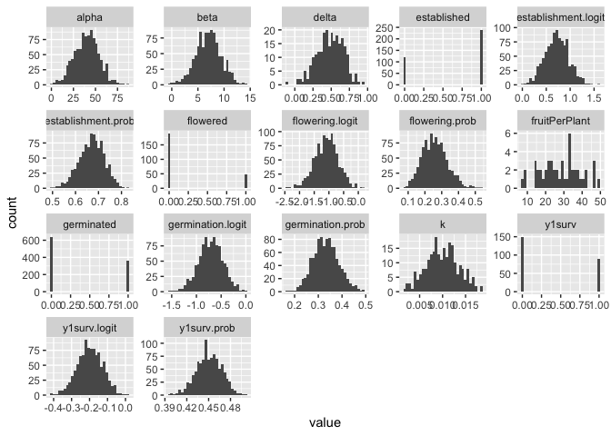
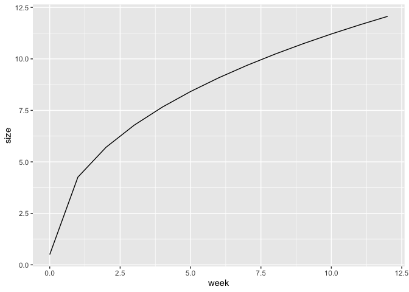

# Population Simulation Attempt

Suggested parameters from Julin:

-   1000 F2s (or just 1000 individuals)

    -   Done with runMacs

-   100 loci per trait with some kind of (expotnetial?) decay in effect
    size

    -   Use nQtlPerChr??

-   Traits:

    -   Germination

    -   Initial size

    -   Establishment

    -   Growth rate

    -   Flowering probability

        -   Ideally would depend on size... - do this through
            correlation matrix?

    -   Fruit per plant

        -   Ideally would depend on size...

    -   others?

Rishav demoed AlphaRSim:
<https://cran.r-project.org/web/packages/AlphaSimR/index.html>

-   Rishav's demo is on his GitHub:
    <https://github.com/rishavray/IPM_practice/blob/main/IPM_genetic_simulation.Rmd>

## Libraries


``` r
library(AlphaSimR)
```

```
## Loading required package: R6
```

``` r
library(tidyverse)
```

```
## ── Attaching core tidyverse packages ──────────────────────── tidyverse 2.0.0 ──
## ✔ dplyr     1.1.4     ✔ readr     2.1.5
## ✔ forcats   1.0.0     ✔ stringr   1.5.1
## ✔ ggplot2   3.5.1     ✔ tibble    3.2.1
## ✔ lubridate 1.9.3     ✔ tidyr     1.3.1
## ✔ purrr     1.0.2
```

```
## ── Conflicts ────────────────────────────────────────── tidyverse_conflicts() ──
## ✖ dplyr::filter() masks stats::filter()
## ✖ dplyr::lag()    masks stats::lag()
## ✖ dplyr::mutate() masks AlphaSimR::mutate()
## ℹ Use the conflicted package (<http://conflicted.r-lib.org/>) to force all conflicts to become errors
```

``` r
logit <- brms::logit_scaled
inv_logit <- brms::inv_logit_scaled
```

## Create Founder Population


``` r
founderPop = runMacs(
  nInd = 1000, #number of individuals to simulate 
  nChr = 10, #number of chromosomes to simulate - may not be important to match to Streps' 14
  segSites = NULL, #number of segregating sites to keep per chromosome.
  species = "GENERIC" #The GENERIC history is meant to be a reasonable all-purpose choice. It runs quickly and models a population with an effective populations size that has gone through several historic bottlenecks.
)
```

## Define Genetic Architecture for Traits


``` r
SP <- SimParam$new(founderPop)
#Starts the process of building a new simulation by creating a new SimParam object and assigning a founder population to the class.

traitMeans <- c(germination.logit = logit(0.33), #logit to scale it (from gene --> trait)
                establishment.logit = logit(0.67),
                y1surv.logit = logit(0.45),
                alpha = 40, #Hmax = alpha -Sets the asymptote (max growth) for the Weibull model 
                beta = 7, #Hmin = beta -Changes the y intercept (the lower limit) for the Weibull model- recruit size?
                k = 0.01, #Often described as the growth rate --\> related to the slope of the line for the Weibull model 
                delta = 0.5, #Sets the inflection point - when you shift b/t concave to convex for the Weibull model 
                flowering.logit = logit(0.25),
                fruitPerPlant = 30)

SP$addTraitA(nQtlPerChr = 10, 
              mean = traitMeans, 
              var = (traitMeans*0.25)^2, #genetic CV = 0.25 (?)
              gamma = TRUE, #a lot of small effect loci and a few large effect loci 
              shape = 1, #shape parameter for gamma distribution 
              name=names(traitMeans))
#addTraitAG - Randomly assigns eligible QTLs for one or more additive GxE traits. If simulating more than one trait, all traits will be pleiotropic with correlated effects.
#addTraitA - Randomly assigns eligible QTLs for one or more additive traits. If simulating more than one trait, all traits will be pleiotropic with correlated additive effects. (we will keep it simple for now)
##nQtlPerChr = number of QTLs per chromosome. Can be a single value or nChr values.
##mean = a vector of desired mean genetic values for one or more traits
##var = a vector of desired genetic variances for one or more traits
##varGxE = a vector of total genotype-by-environment variances for the traits
##name = optional name for trait(s)

SP$setVarE(h2=rep(0.5, length(traitMeans))) #set heritability to 0.5 
#Error in SP$setVarE(h2 = rep(0.5, length(traitMeans))) : all(private$.varG > 0) is not TRUE -  Y1 SURV = logit(0.5)
```

## Create Initial Population


``` r
pop = newPop(founderPop, simParam = SP)
pop1 <- setPheno(pop)
```


``` r
pheno <- pop1@pheno %>% as_tibble()
dim(pheno)
```

```
## [1] 1000    9
```

``` r
head(pheno)
```

```
## # A tibble: 6 × 9
##   germination.logit establishment.logit y1surv.logit alpha  beta       k delta
##               <dbl>               <dbl>        <dbl> <dbl> <dbl>   <dbl> <dbl>
## 1            -0.632               0.700       -0.218  35.3  6.58 0.0112  0.536
## 2            -0.658               0.996       -0.211  31.2  7.06 0.0140  0.737
## 3            -1.00                0.727       -0.197  55.6  6.46 0.0109  0.765
## 4            -0.786               0.920       -0.167  43.9  8.45 0.00902 0.151
## 5            -0.412               0.159       -0.103  22.4  6.59 0.0124  0.212
## 6            -0.516               0.664       -0.215  54.3  8.55 0.00779 0.475
## # ℹ 2 more variables: flowering.logit <dbl>, fruitPerPlant <dbl>
```

### Convert pheno logits to probabilities and phenotypes

``` r
pheno <- pheno %>%
  mutate(across(ends_with(".logit"), .fns = inv_logit, 
         .names = "{.col}.prob")) %>%
  rename_with(.fn = \(n) str_replace(n, "\\.logit\\.prob", "\\.prob")) %>%
  mutate(germinated = rbinom(n(), size=1, prob=germination.prob),
         established = ifelse(germinated, rbinom(n(), size=1, prob=establishment.prob), NA),
         beta, 
         alpha, 
         k = ifelse(established, k, NA), #can only have a growth rate if you establish
         delta = ifelse(established, delta, NA),
         y1surv = ifelse(established, rbinom(n(), size =1, prob=y1surv.prob), NA),
         flowered = ifelse(established, rbinom(n(), size = 1, prob = flowering.prob), NA),
         fruitPerPlant = ifelse(flowered, fruitPerPlant, NA))
```


``` r
pheno %>%
  pivot_longer(everything()) %>%
  ggplot(aes(x=value)) +
  geom_histogram() +
  facet_wrap(~name, scales="free")
```

```
## `stat_bin()` using `bins = 30`. Pick better value with `binwidth`.
```

```
## Warning: Removed 4636 rows containing non-finite outside the scale range
## (`stat_bin()`).
```

<!-- -->

## Try to get weekly growth data

### Model growth with the Weibull model


``` r
weibull <- function (t, alpha, beta, k, delta) {
  result <- alpha - (alpha - beta) * exp(-(k * t)^delta)
  return(result)
}

##Example:
growth <- tibble(week = seq(0,12, 1)) %>%
  mutate(size = weibull(t = week,
                          alpha = 40, #Hmax = alpha -  Sets the asymptote (max growth)
                          beta = 0.5, #Hmin = beta - Changes the y intercept (the lower limit)
                          k = 0.01, #k - Often described as the growth rate --\> related to the slope of the line
                          delta = 0.5)) #delta - Sets the inflection point - when you shift b/t concave to convex

growth %>%  ggplot(aes(x=week, y=size)) +
  geom_line()
```

<!-- -->

### Pheno weekly

``` r
pheno_weekly <- pheno %>% 
  mutate(Indiv_ID=row_number()) %>% 
  slice(rep(1:n(), each = 12)) %>% #duplicate each row 12 times 
  group_by(Indiv_ID) %>% 
  mutate(week=row_number(), #12 weeks for each indiv
         week_next=lead(week, order_by = week), 
         elapsed_days= week_next - week, #interval length in days
         size = if_else(week==1, beta, #size in week 1 is the min size (beta)
                        weibull(t = week, #otherwise use the weibull formula to calculate size
                        alpha = alpha,
                        beta = beta,
                        k = k, 
                        delta = delta)))
pheno_weekly
```

```
## # A tibble: 12,000 × 22
## # Groups:   Indiv_ID [1,000]
##    germination.logit establishment.logit y1surv.logit alpha  beta     k delta
##                <dbl>               <dbl>        <dbl> <dbl> <dbl> <dbl> <dbl>
##  1            -0.632               0.700       -0.218  35.3  6.58    NA    NA
##  2            -0.632               0.700       -0.218  35.3  6.58    NA    NA
##  3            -0.632               0.700       -0.218  35.3  6.58    NA    NA
##  4            -0.632               0.700       -0.218  35.3  6.58    NA    NA
##  5            -0.632               0.700       -0.218  35.3  6.58    NA    NA
##  6            -0.632               0.700       -0.218  35.3  6.58    NA    NA
##  7            -0.632               0.700       -0.218  35.3  6.58    NA    NA
##  8            -0.632               0.700       -0.218  35.3  6.58    NA    NA
##  9            -0.632               0.700       -0.218  35.3  6.58    NA    NA
## 10            -0.632               0.700       -0.218  35.3  6.58    NA    NA
## # ℹ 11,990 more rows
## # ℹ 15 more variables: flowering.logit <dbl>, fruitPerPlant <dbl>,
## #   germination.prob <dbl>, establishment.prob <dbl>, y1surv.prob <dbl>,
## #   flowering.prob <dbl>, germinated <int>, established <int>, y1surv <int>,
## #   flowered <int>, Indiv_ID <int>, week <int>, week_next <int>,
## #   elapsed_days <int>, size <dbl>
```

