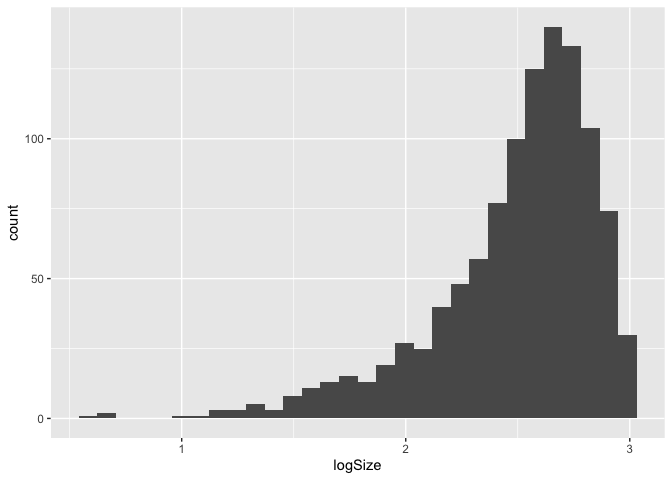
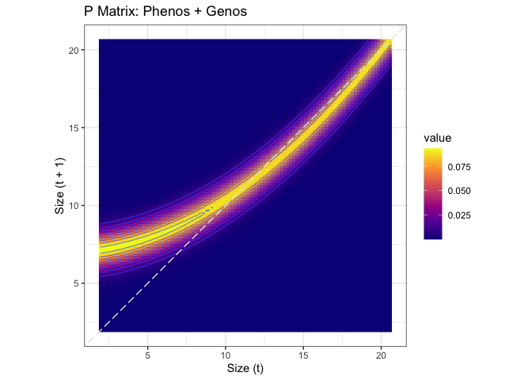
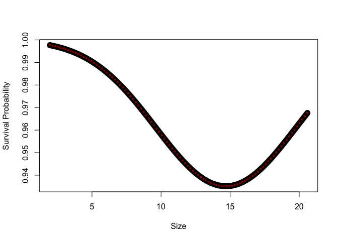

# IPM from Population Simulation

\*Simulations done in "Population_Sim_Trial.Rmd" file (currently using AlphaSimR)

**Goal:** Compare IPM created from just phenotypes from the simulation to an IPM created from phenotypes + genotype scores.

## Libraries


``` r
library(tidyverse)
```

```
## ── Attaching core tidyverse packages ──────────────────────── tidyverse 2.0.0 ──
## ✔ dplyr     1.1.4     ✔ readr     2.1.5
## ✔ forcats   1.0.0     ✔ stringr   1.5.1
## ✔ ggplot2   3.5.1     ✔ tibble    3.2.1
## ✔ lubridate 1.9.3     ✔ tidyr     1.3.1
## ✔ purrr     1.0.2     
## ── Conflicts ────────────────────────────────────────── tidyverse_conflicts() ──
## ✖ dplyr::filter() masks stats::filter()
## ✖ dplyr::lag()    masks stats::lag()
## ℹ Use the conflicted package (<http://conflicted.r-lib.org/>) to force all conflicts to become errors
```

``` r
library(broom)
library(broom.mixed)
library(magrittr)
```

```
## 
## Attaching package: 'magrittr'
## 
## The following object is masked from 'package:purrr':
## 
##     set_names
## 
## The following object is masked from 'package:tidyr':
## 
##     extract
```

``` r
library(lmerTest)
```

```
## Loading required package: lme4
## Loading required package: Matrix
## 
## Attaching package: 'Matrix'
## 
## The following objects are masked from 'package:tidyr':
## 
##     expand, pack, unpack
## 
## 
## Attaching package: 'lmerTest'
## 
## The following object is masked from 'package:lme4':
## 
##     lmer
## 
## The following object is masked from 'package:stats':
## 
##     step
```

``` r
conflicted::conflicts_prefer(lmerTest::lmer)
```

```
## [conflicted] Will prefer lmerTest::lmer over any other package.
```

``` r
conflicted::conflicts_prefer(dplyr::filter)
```

```
## [conflicted] Will prefer dplyr::filter over any other package.
```

``` r
conflicted::conflicts_prefer(dplyr::mutate)
```

```
## [conflicted] Will prefer dplyr::mutate over any other package.
```

## Load the data

``` r
simpop <- read_csv("../output/PopSim_Phenos-Genos_v3.csv")
```

```
## Rows: 12000 Columns: 27
## ── Column specification ────────────────────────────────────────────────────────
## Delimiter: ","
## dbl (27): germination.logit_pheno, establishment.logit_pheno, y1surv.logit_p...
## 
## ℹ Use `spec()` to retrieve the full column specification for this data.
## ℹ Specify the column types or set `show_col_types = FALSE` to quiet this message.
```

``` r
names(simpop)
```

```
##  [1] "germination.logit_pheno"   "establishment.logit_pheno"
##  [3] "y1surv.logit_pheno"        "beta_pheno"               
##  [5] "k_pheno"                   "flowering.logit_pheno"    
##  [7] "fruitPerPlant_pheno"       "germination.prob"         
##  [9] "establishment.prob"        "y1surv.prob"              
## [11] "flowering.prob"            "germinated"               
## [13] "established"               "y1surv"                   
## [15] "flowered"                  "Indiv_ID"                 
## [17] "week"                      "week_next"                
## [19] "elapsed_weeks"             "size"                     
## [21] "germination.logit_geno"    "establishment.logit_geno" 
## [23] "y1surv.logit_geno"         "beta_geno"                
## [25] "k_geno"                    "flowering.logit_geno"     
## [27] "fruitPerPlant_geno"
```

``` r
#logit_pheno = scaled probability/phenotype
#_geno = genotype score for that trait 
#size = height calculated from simulated Weibull parameters (alpha, beta, k, and delta)
####Note: we will use the genotype score for k for this 
#elapsed_weeks = interval between weeks - should all be 1 in this data
```

### Add size next and weekly surv

``` r
unique(simpop$established) #NA = did not germinate, 1 = established (survived first 3 weeks in field); 0 = did not establish
```

```
## [1] NA  0  1
```

``` r
unique(simpop$y1surv) #NA = did not establish, 1 = survived to week 12; 0 = did not survive 
```

```
## [1] NA  0  1
```

``` r
#simpop %>% select(Indiv_ID, germinated, established, y1surv, k_pheno, week, size) %>% filter(Indiv_ID<5)

simpop_timeprep <- simpop %>%
  mutate(weeks = as.numeric(week - 1), #Weeks since week 1 (equivalent to pre-transplant or initial size) 
         size = if_else(germinated==0, NA, size) #no size if no germ
         ) %>%   
  group_by(Indiv_ID) %>% 
  mutate(surv=if_else(germinated==0, NA, #surv = NA if you did not germ 
                        if_else(week==1, 1, #if you did germinate, assume you survived to week 1 (equivalent to pre-transplant size time point)
                                if_else(established==0, 0, #surv = 0 after week 1 if you did not establish 
                                        if_else(week<5, 1, #if you did establish, your surv is equal to 1 for the first 3 weeks post-transplant 
                                                y1surv) #your survival for weeks 5-12 is then equal to your y1surv
                                        )))) %>% 
  mutate(death.week=if_else(y1surv==1, NA, #if survive year 1 no death week 
                            first(week, order_by = surv)) #first week where surv = 0 
           ) %>% 
  #note we only have establishment and y1surv survival from the pop sim --> little weekly variation 
  mutate(size_next = lead(size, order_by = week), #next time point's size) 
         size = if_else(is.na(death.week), size,
                        if_else(week>death.week, NA, size))) %>%  
  ungroup() %>% 
  mutate(size_next=if_else(surv==0, NA, size_next))

simpop_timeprep %>% #look at data for a few indivs to see if above worked
  drop_na(surv) %>% 
  select(Indiv_ID, week, weeks, germinated, established, y1surv, size, size_next, surv, death.week) %>% 
  filter(Indiv_ID<25)
```

```
## # A tibble: 84 × 10
##    Indiv_ID  week weeks germinated established y1surv  size size_next  surv
##       <dbl> <dbl> <dbl>      <dbl>       <dbl>  <dbl> <dbl>     <dbl> <dbl>
##  1        3     1     0          1           0     NA  4.37        NA     1
##  2        3     2     1          1           0     NA NA           NA     0
##  3        3     3     2          1           0     NA NA           NA     0
##  4        3     4     3          1           0     NA NA           NA     0
##  5        3     5     4          1           0     NA NA           NA     0
##  6        3     6     5          1           0     NA NA           NA     0
##  7        3     7     6          1           0     NA NA           NA     0
##  8        3     8     7          1           0     NA NA           NA     0
##  9        3     9     8          1           0     NA NA           NA     0
## 10        3    10     9          1           0     NA NA           NA     0
## # ℹ 74 more rows
## # ℹ 1 more variable: death.week <dbl>
```

``` r
simpop_timeprep_surv <- simpop_timeprep %>% drop_na(surv, size) #for surv models 
simpop_timeprep_size <- simpop_timeprep %>% drop_na(size, size_next) #for size models 
```

### Scaling and transformations

``` r
simpop_timeprep_surv %>%  #slightly skewed
  ggplot(aes(x=size)) +
  geom_histogram()
```

```
## `stat_bin()` using `bins = 30`. Pick better value with `binwidth`.
```

<!-- -->

``` r
simpop_timeprep_surv_scaled <- simpop_timeprep_surv %>% 
  mutate(logSize=log(size),
         sqSize=sqrt(size)) 

simpop_timeprep_surv_scaled %>% #not better
  ggplot(aes(x=logSize)) +
  geom_histogram()
```

```
## `stat_bin()` using `bins = 30`. Pick better value with `binwidth`.
```

<!-- -->

``` r
simpop_timeprep_surv_scaled %>% #not better
  ggplot(aes(x=sqSize)) +
  geom_histogram()
```

```
## `stat_bin()` using `bins = 30`. Pick better value with `binwidth`.
```

<!-- -->

## Survival Models

### Phenos Only

``` r
surv.models_pheno <- tribble(
  ~name,          ~f,
  "1_linear_size",                 "surv ~ size", 
  "2_linear_weeks",                "surv ~ size + weeks",
  "3a_quadratic_size",             "surv ~ size + I(size^2)", 
  "3b_quadratic_size_weeks",       "surv ~ size + I(size^2) + weeks", 
  "4a_cubic_size",                 "surv ~ size + I(size^2) + I(size^3)",
  "4b_cubic_size_weeks",           "surv ~ size + I(size^2) + I(size^3) + weeks"
)

#run the models 
surv.models_pheno <- surv.models_pheno %>%
  mutate(glm = map(f, ~ glm(as.formula(.), 
                            data = simpop_timeprep_surv, 
                            family = "binomial")), #, #run the models 
         predict = map(glm, predict, type = "response"), 
         glance = map(glm, tidy),
         AIC = map(glm, AIC),
         BIC = map(glm, BIC)) #glance at the model results

surv.models_pheno %>% select(-f, -glm, -predict) %>% unnest(BIC) %>% arrange(BIC) #look at the model fitting info 
```

```
## # A tibble: 6 × 4
##   name                    glance           AIC         BIC
##   <chr>                   <list>           <list>    <dbl>
## 1 3a_quadratic_size       <tibble [3 × 5]> <dbl [1]>  538.
## 2 3b_quadratic_size_weeks <tibble [4 × 5]> <dbl [1]>  544.
## 3 4a_cubic_size           <tibble [4 × 5]> <dbl [1]>  544.
## 4 4b_cubic_size_weeks     <tibble [5 × 5]> <dbl [1]>  549.
## 5 1_linear_size           <tibble [2 × 5]> <dbl [1]>  551.
## 6 2_linear_weeks          <tibble [3 × 5]> <dbl [1]>  555.
```

``` r
surv.models_pheno %>% select(-f, -glm, -predict) %>% unnest(AIC) %>% arrange(AIC) #look at the model fitting info 
```

```
## # A tibble: 6 × 4
##   name                    glance             AIC BIC      
##   <chr>                   <list>           <dbl> <list>   
## 1 3a_quadratic_size       <tibble [3 × 5]>  523. <dbl [1]>
## 2 3b_quadratic_size_weeks <tibble [4 × 5]>  524. <dbl [1]>
## 3 4a_cubic_size           <tibble [4 × 5]>  524. <dbl [1]>
## 4 4b_cubic_size_weeks     <tibble [5 × 5]>  524. <dbl [1]>
## 5 2_linear_weeks          <tibble [3 × 5]>  540. <dbl [1]>
## 6 1_linear_size           <tibble [2 × 5]>  541. <dbl [1]>
```

``` r
#3a_quadratic size best by AIC and BIC
```


``` r
survival.model.final_pheno <- surv.models_pheno %>% filter(name == "3a_quadratic_size") %>% pull(glm) %>% magrittr::extract2(1)
summary(survival.model.final_pheno)
```

```
## 
## Call:
## glm(formula = as.formula(.), family = "binomial", data = simpop_timeprep_surv)
## 
## Coefficients:
##             Estimate Std. Error z value Pr(>|z|)    
## (Intercept) 10.58309    2.28396   4.634 3.59e-06 ***
## size        -1.26333    0.35096  -3.600 0.000319 ***
## I(size^2)    0.04734    0.01328   3.565 0.000364 ***
## ---
## Signif. codes:  0 '***' 0.001 '**' 0.01 '*' 0.05 '.' 0.1 ' ' 1
## 
## (Dispersion parameter for binomial family taken to be 1)
## 
##     Null deviance: 539.26  on 1077  degrees of freedom
## Residual deviance: 517.13  on 1075  degrees of freedom
## AIC: 523.13
## 
## Number of Fisher Scoring iterations: 7
```

#### Predicted vs. Observed Survival

``` r
simpop_timeprep_surv %>% 
  mutate(pred_fixef = predict(survival.model.final_pheno, newdata = ., type="response", re.form = NA)) %>% 
  ggplot(aes(x = size, y = surv)) +
  geom_point(alpha=.2) +
  geom_line(aes(y = pred_fixef), 
            color = "blue", 
            size = 1.2, alpha=0.3) 
```

```
## Warning: Using `size` aesthetic for lines was deprecated in ggplot2 3.4.0.
## ℹ Please use `linewidth` instead.
## This warning is displayed once every 8 hours.
## Call `lifecycle::last_lifecycle_warnings()` to see where this warning was
## generated.
```

<!-- -->

### Phenos + Genos

``` r
surv.models_genos <- tribble(
  ~name,          ~f,
  "1a_linear_size",                 "surv ~ size", 
  "1b_linear_size_genos",           "surv ~ size + establishment.logit_geno + y1surv.logit_geno", 
  "2a_linear_weeks",                "surv ~ size + weeks",
  "2b_linear_weeks_geno",           "surv ~ size + weeks + establishment.logit_geno + y1surv.logit_geno",
  "3a_quadratic_size",              "surv ~ size + I(size^2)", 
  "3b_quadratic_size_weeks",        "surv ~ size + I(size^2) + weeks", 
  "3c_quadratic_size_weeks_geno",   "surv ~ size + I(size^2) + weeks + establishment.logit_geno + y1surv.logit_geno",
  "4a_cubic_size",                  "surv ~ size + I(size^2) + I(size^3)",
  "4b_cubic_size_weeks",            "surv ~ size + I(size^2) + I(size^3) + weeks",
  "4c_cubic_size_weeks_geno",       "surv ~ size + I(size^2) + I(size^3) + weeks + establishment.logit_geno + y1surv.logit_geno"
)

#run the models 
surv.models_genos <- surv.models_genos %>%
  mutate(glm = map(f, ~ glm(as.formula(.), 
                            data = simpop_timeprep_surv, 
                            family = "binomial")), #, #run the models 
         predict = map(glm, predict, type = "response"), 
         glance = map(glm, tidy),
         AIC = map(glm, AIC),
         BIC = map(glm, BIC)) #glance at the model results

surv.models_genos %>% select(-f, -glm, -predict) %>% unnest(BIC) %>% arrange(BIC) #look at the model fitting info 
```

```
## # A tibble: 10 × 4
##    name                         glance           AIC         BIC
##    <chr>                        <list>           <list>    <dbl>
##  1 3a_quadratic_size            <tibble [3 × 5]> <dbl [1]>  538.
##  2 3b_quadratic_size_weeks      <tibble [4 × 5]> <dbl [1]>  544.
##  3 4a_cubic_size                <tibble [4 × 5]> <dbl [1]>  544.
##  4 4b_cubic_size_weeks          <tibble [5 × 5]> <dbl [1]>  549.
##  5 1a_linear_size               <tibble [2 × 5]> <dbl [1]>  551.
##  6 3c_quadratic_size_weeks_geno <tibble [6 × 5]> <dbl [1]>  552.
##  7 2a_linear_weeks              <tibble [3 × 5]> <dbl [1]>  555.
##  8 4c_cubic_size_weeks_geno     <tibble [7 × 5]> <dbl [1]>  558.
##  9 1b_linear_size_genos         <tibble [4 × 5]> <dbl [1]>  559.
## 10 2b_linear_weeks_geno         <tibble [5 × 5]> <dbl [1]>  562.
```

``` r
surv.models_genos %>% select(-f, -glm, -predict) %>% unnest(AIC) %>% arrange(AIC) #look at the model fitting info 
```

```
## # A tibble: 10 × 4
##    name                         glance             AIC BIC      
##    <chr>                        <list>           <dbl> <list>   
##  1 3c_quadratic_size_weeks_geno <tibble [6 × 5]>  522. <dbl [1]>
##  2 4c_cubic_size_weeks_geno     <tibble [7 × 5]>  523. <dbl [1]>
##  3 3a_quadratic_size            <tibble [3 × 5]>  523. <dbl [1]>
##  4 3b_quadratic_size_weeks      <tibble [4 × 5]>  524. <dbl [1]>
##  5 4a_cubic_size                <tibble [4 × 5]>  524. <dbl [1]>
##  6 4b_cubic_size_weeks          <tibble [5 × 5]>  524. <dbl [1]>
##  7 2b_linear_weeks_geno         <tibble [5 × 5]>  538. <dbl [1]>
##  8 1b_linear_size_genos         <tibble [4 × 5]>  539. <dbl [1]>
##  9 2a_linear_weeks              <tibble [3 × 5]>  540. <dbl [1]>
## 10 1a_linear_size               <tibble [2 × 5]>  541. <dbl [1]>
```

``` r
#3a_quadratic_size best by BIC
#3c_quadratic_size_weeks_geno best by AIC 
```


``` r
survival.model.final_genos <- surv.models_genos %>% filter(name == "3c_quadratic_size_weeks_geno") %>% pull(glm) %>% magrittr::extract2(1)
summary(survival.model.final_genos)
```

```
## 
## Call:
## glm(formula = as.formula(.), family = "binomial", data = simpop_timeprep_surv)
## 
## Coefficients:
##                          Estimate Std. Error z value Pr(>|z|)    
## (Intercept)              10.95377    2.46308   4.447  8.7e-06 ***
## size                     -1.27993    0.35498  -3.606 0.000311 ***
## I(size^2)                 0.04596    0.01348   3.409 0.000653 ***
## weeks                     0.06035    0.05115   1.180 0.238032    
## establishment.logit_geno -1.18035    0.82833  -1.425 0.154166    
## y1surv.logit_geno        -3.91592    2.43225  -1.610 0.107398    
## ---
## Signif. codes:  0 '***' 0.001 '**' 0.01 '*' 0.05 '.' 0.1 ' ' 1
## 
## (Dispersion parameter for binomial family taken to be 1)
## 
##     Null deviance: 539.26  on 1077  degrees of freedom
## Residual deviance: 510.09  on 1072  degrees of freedom
## AIC: 522.09
## 
## Number of Fisher Scoring iterations: 7
```

#### Predicted vs. Observed Survival

``` r
simpop_timeprep_surv %>% 
  mutate(pred_fixef = predict(survival.model.final_genos, newdata = ., type="response", re.form = NA)) %>% 
  ggplot(aes(x = size, y = surv)) +
  geom_point(alpha=.2) +
  geom_line(aes(y = pred_fixef), 
            color = "blue", 
            size = 1.2, alpha=0.3) 
```

<!-- -->

## Growth Models

### Observed Patterns

``` r
simpop_timeprep_size %>% 
  ggplot(aes(x=size, y=size_next)) +
  geom_point()  +
  geom_abline() +
  geom_smooth(method = "lm")
```

```
## `geom_smooth()` using formula = 'y ~ x'
```

<!-- -->

### Phenos Only

``` r
size.models_pheno <- tribble(
  ~name,          ~f,
  "1_linear_size",                 "size_next ~ size", 
  "2_linear_weeks",                "size_next ~ size + weeks",
  "3a_quadratic_size",             "size_next ~ size + I(size^2)", 
  "3b_quadratic_size_weeks",       "size_next ~ size + I(size^2) + weeks", 
  "4a_cubic_size",                 "size_next ~ size + I(size^2) + I(size^3)",
  "4b_cubic_size_weeks",           "size_next ~ size + I(size^2) + I(size^3) + weeks"
)

#run the models 
size.models_pheno <- size.models_pheno %>%
  mutate(lm = map(f, ~ lm(as.formula(.), 
                            data = simpop_timeprep_size)), #, #run the models 
         predict = map(lm, predict), 
         glance = map(lm, glance)) #glance at the model results

size.models_pheno %>% select(-f, -lm, -predict) %>% unnest(glance) %>% arrange(BIC) #look at the model fitting info 
```

```
## # A tibble: 6 × 13
##   name  r.squared adj.r.squared sigma statistic p.value    df logLik   AIC   BIC
##   <chr>     <dbl>         <dbl> <dbl>     <dbl>   <dbl> <dbl>  <dbl> <dbl> <dbl>
## 1 3b_q…     0.921         0.921 0.809     3493.       0     3 -1086. 2181. 2205.
## 2 4b_c…     0.921         0.921 0.810     2618.       0     4 -1086. 2183. 2212.
## 3 3a_q…     0.912         0.912 0.854     4656.       0     2 -1135. 2278. 2297.
## 4 4a_c…     0.912         0.912 0.855     3101.       0     3 -1135. 2280. 2304.
## 5 2_li…     0.888         0.888 0.964     3556.       0     2 -1244. 2497. 2516.
## 6 1_li…     0.883         0.883 0.984     6798.       0     1 -1263. 2531. 2546.
## # ℹ 3 more variables: deviance <dbl>, df.residual <int>, nobs <int>
```

``` r
size.models_pheno %>% select(-f, -lm, -predict) %>% unnest(glance) %>% arrange(AIC) #look at the model fitting info 
```

```
## # A tibble: 6 × 13
##   name  r.squared adj.r.squared sigma statistic p.value    df logLik   AIC   BIC
##   <chr>     <dbl>         <dbl> <dbl>     <dbl>   <dbl> <dbl>  <dbl> <dbl> <dbl>
## 1 3b_q…     0.921         0.921 0.809     3493.       0     3 -1086. 2181. 2205.
## 2 4b_c…     0.921         0.921 0.810     2618.       0     4 -1086. 2183. 2212.
## 3 3a_q…     0.912         0.912 0.854     4656.       0     2 -1135. 2278. 2297.
## 4 4a_c…     0.912         0.912 0.855     3101.       0     3 -1135. 2280. 2304.
## 5 2_li…     0.888         0.888 0.964     3556.       0     2 -1244. 2497. 2516.
## 6 1_li…     0.883         0.883 0.984     6798.       0     1 -1263. 2531. 2546.
## # ℹ 3 more variables: deviance <dbl>, df.residual <int>, nobs <int>
```

``` r
#3b_quadratic_size_weeks best by AIC and BIC
```


``` r
size.model.final_pheno <- size.models_pheno %>% filter(name == "3b_quadratic_size_weeks") %>% pull(lm) %>% magrittr::extract2(1)
summary(size.model.final_pheno)
```

```
## 
## Call:
## lm(formula = as.formula(.), data = simpop_timeprep_size)
## 
## Residuals:
##     Min      1Q  Median      3Q     Max 
## -2.9978 -0.3287 -0.0451  0.2080  3.3750 
## 
## Coefficients:
##              Estimate Std. Error t value Pr(>|t|)    
## (Intercept)  8.145335   0.239225  34.049   <2e-16 ***
## size         0.039671   0.040509   0.979    0.328    
## I(size^2)    0.032509   0.001671  19.457   <2e-16 ***
## weeks       -0.125330   0.012312 -10.179   <2e-16 ***
## ---
## Signif. codes:  0 '***' 0.001 '**' 0.01 '*' 0.05 '.' 0.1 ' ' 1
## 
## Residual standard error: 0.8092 on 897 degrees of freedom
## Multiple R-squared:  0.9212,	Adjusted R-squared:  0.9209 
## F-statistic:  3493 on 3 and 897 DF,  p-value: < 2.2e-16
```

#### Predicted vs. Observed Growth

``` r
simpop_timeprep_size %>% 
  cbind(predicted={size.models_pheno %>% filter(name=="3b_quadratic_size_weeks") %>% pull(predict) %>% unlist()}) %>%
  ggplot(aes(x=size_next, y = predicted)) +
  geom_point() +
  geom_abline(color="skyblue2")
```

<!-- -->

### Phenos + Genos

``` r
size.models_genos <- tribble(
  ~name,          ~f,
  "1a_linear_size",                 "size_next ~ size", 
  "1b_linear_size_geno",            "size_next ~ size + k_geno", 
  "2a_linear_weeks",                "size_next ~ size + weeks",
  "2b_linear_weeks_geno",           "size_next ~ size + weeks + k_geno",
  "3a_quadratic_size",              "size_next ~ size + I(size^2)", 
  "3b_quadratic_size_weeks",        "size_next ~ size + I(size^2) + weeks", 
  "3c_quadratic_size_weeks_geno",   "size_next ~ size + I(size^2) + weeks + k_geno",
  "4a_cubic_size",                  "size_next ~ size + I(size^2) + I(size^3)",
  "4b_cubic_size_weeks",            "size_next ~ size + I(size^2) + I(size^3) + weeks",
  "4c_cubic_size_weeks_geno",       "size_next ~ size + I(size^2) + I(size^3) + weeks + k_geno"
)

#run the models 
size.models_genos <- size.models_genos %>%
  mutate(lm = map(f, ~ lm(as.formula(.), 
                            data = simpop_timeprep_size)), #, #run the models 
         predict = map(lm, predict), 
         glance = map(lm, glance)) #glance at the model results

size.models_genos %>% select(-f, -lm, -predict) %>% unnest(glance) %>% arrange(BIC) #look at the model fitting info 
```

```
## # A tibble: 10 × 13
##    name       r.squared adj.r.squared sigma statistic p.value    df logLik   AIC
##    <chr>          <dbl>         <dbl> <dbl>     <dbl>   <dbl> <dbl>  <dbl> <dbl>
##  1 3c_quadra…     0.930         0.930 0.761     2995.       0     4 -1029. 2071.
##  2 4c_cubic_…     0.930         0.930 0.761     2394.       0     5 -1029. 2073.
##  3 3b_quadra…     0.921         0.921 0.809     3493.       0     3 -1086. 2181.
##  4 4b_cubic_…     0.921         0.921 0.810     2618.       0     4 -1086. 2183.
##  5 3a_quadra…     0.912         0.912 0.854     4656.       0     2 -1135. 2278.
##  6 4a_cubic_…     0.912         0.912 0.855     3101.       0     3 -1135. 2280.
##  7 2b_linear…     0.904         0.904 0.893     2812.       0     3 -1175. 2360.
##  8 1b_linear…     0.903         0.903 0.896     4186.       0     2 -1178. 2365.
##  9 2a_linear…     0.888         0.888 0.964     3556.       0     2 -1244. 2497.
## 10 1a_linear…     0.883         0.883 0.984     6798.       0     1 -1263. 2531.
## # ℹ 4 more variables: BIC <dbl>, deviance <dbl>, df.residual <int>, nobs <int>
```

``` r
size.models_genos %>% select(-f, -lm, -predict) %>% unnest(glance) %>% arrange(AIC) #look at the model fitting info 
```

```
## # A tibble: 10 × 13
##    name       r.squared adj.r.squared sigma statistic p.value    df logLik   AIC
##    <chr>          <dbl>         <dbl> <dbl>     <dbl>   <dbl> <dbl>  <dbl> <dbl>
##  1 3c_quadra…     0.930         0.930 0.761     2995.       0     4 -1029. 2071.
##  2 4c_cubic_…     0.930         0.930 0.761     2394.       0     5 -1029. 2073.
##  3 3b_quadra…     0.921         0.921 0.809     3493.       0     3 -1086. 2181.
##  4 4b_cubic_…     0.921         0.921 0.810     2618.       0     4 -1086. 2183.
##  5 3a_quadra…     0.912         0.912 0.854     4656.       0     2 -1135. 2278.
##  6 4a_cubic_…     0.912         0.912 0.855     3101.       0     3 -1135. 2280.
##  7 2b_linear…     0.904         0.904 0.893     2812.       0     3 -1175. 2360.
##  8 1b_linear…     0.903         0.903 0.896     4186.       0     2 -1178. 2365.
##  9 2a_linear…     0.888         0.888 0.964     3556.       0     2 -1244. 2497.
## 10 1a_linear…     0.883         0.883 0.984     6798.       0     1 -1263. 2531.
## # ℹ 4 more variables: BIC <dbl>, deviance <dbl>, df.residual <int>, nobs <int>
```

``` r
#3c_quadratic_size_weeks_geno best by AIC and BIC
```


``` r
size.model.final_genos <- size.models_genos %>% filter(name == "3c_quadratic_size_weeks_geno") %>% pull(lm) %>% magrittr::extract2(1)
summary(size.model.final_genos)
```

```
## 
## Call:
## lm(formula = as.formula(.), data = simpop_timeprep_size)
## 
## Residuals:
##     Min      1Q  Median      3Q     Max 
## -3.0004 -0.3675 -0.0804  0.2436  3.1670 
## 
## Coefficients:
##               Estimate Std. Error t value Pr(>|t|)    
## (Intercept)   6.949027   0.250134  27.781  < 2e-16 ***
## size          0.059096   0.038119   1.550    0.121    
## I(size^2)     0.029475   0.001595  18.480  < 2e-16 ***
## weeks        -0.082543   0.012219  -6.755 2.56e-11 ***
## k_geno      131.867772  12.076474  10.919  < 2e-16 ***
## ---
## Signif. codes:  0 '***' 0.001 '**' 0.01 '*' 0.05 '.' 0.1 ' ' 1
## 
## Residual standard error: 0.7606 on 896 degrees of freedom
## Multiple R-squared:  0.9304,	Adjusted R-squared:  0.9301 
## F-statistic:  2995 on 4 and 896 DF,  p-value: < 2.2e-16
```

#### Predicted vs. Observed Growth

``` r
simpop_timeprep_size %>% 
  cbind(predicted={size.models_genos %>% filter(name=="3c_quadratic_size_weeks_geno") %>% pull(predict) %>% unlist()}) %>%
  ggplot(aes(x=size_next, y = predicted)) +
  geom_point() +
  geom_abline(color="skyblue2")
```

<!-- -->

## P Matrix

### Make a dataframe to store the parameters

``` r
params=data.frame(
  surv.int=NA, # Intercept from logistic regression of survival
  surv.slope1=NA, # Slope from logistic regression of survival
  surv.slope2=NA, # Quadratic slope from logistic regression of survival
  growth.int=NA, # Intercept from linear regression of growth
  growth.slope1=NA, # Slope from linear regression of growth
  growth.slope2=NA, # Quadratic slope from linear regression of growth
  growth.sd=NA # Residual sd from the linear regression of growth
)

params_phenos <- params
params_genos <- params
```

### Use broom:tidy to create a df with the coef from each model

``` r
surv.coefs_pheno <- surv.models_pheno %>% 
  filter(name == "3a_quadratic_size") %>%
  mutate(coefs = map(glm, tidy)) %>% 
  select(name, f, coefs) %>% 
  unnest(coefs) 

params_phenos$surv.int <- surv.coefs_pheno %>% filter(term == "(Intercept)") %>% pull(estimate)
params_phenos$surv.slope1 <- surv.coefs_pheno %>% filter(term == "size") %>% pull(estimate)
params_phenos$surv.slope2 <- surv.coefs_pheno %>% filter(term == "I(size^2)") %>% pull(estimate)
```


``` r
surv.coefs_genos <- surv.models_genos %>% 
  filter(name == "3c_quadratic_size_weeks_geno") %>%
  mutate(coefs = map(glm, tidy)) %>% 
  select(name, f, coefs) %>% 
  unnest(coefs) 

params_genos$surv.int <- surv.coefs_genos %>% filter(term == "(Intercept)") %>% pull(estimate)
params_genos$surv.slope1 <- surv.coefs_genos %>% filter(term == "size") %>% pull(estimate)
params_genos$surv.slope2 <- surv.coefs_genos %>% filter(term == "I(size^2)") %>% pull(estimate)
```


``` r
growth.coefs_pheno <- size.models_pheno %>% 
  filter(name == "3b_quadratic_size_weeks") %>% 
  mutate(coefs = map(lm, tidy)) %>% 
  select(name, f, coefs) %>% 
  unnest(coefs) 

params_phenos$growth.int <- growth.coefs_pheno %>% filter(term == "(Intercept)") %>% pull(estimate)
params_phenos$growth.slope1 <- growth.coefs_pheno %>% filter(term == "size") %>% pull(estimate)
params_phenos$growth.slope2 <- growth.coefs_pheno %>% filter(term == "I(size^2)") %>% pull(estimate)

#Pull sigma which is the _modeled_ standard deviation of the residuals.  Merow uses observed sd of residuals.  
params_phenos$growth.sd <- size.models_pheno %>% filter(name == "3b_quadratic_size_weeks") %>% unnest(glance) %>% pull(sigma)
```


``` r
growth.coefs_genos <- size.models_genos %>% 
  filter(name == "3c_quadratic_size_weeks_geno") %>% 
  mutate(coefs = map(lm, tidy)) %>% 
  select(name, f, coefs) %>% 
  unnest(coefs) 

params_genos$growth.int <- growth.coefs_genos %>% filter(term == "(Intercept)") %>% pull(estimate)
params_genos$growth.slope1 <- growth.coefs_genos %>% filter(term == "size") %>% pull(estimate)
params_genos$growth.slope2 <- growth.coefs_genos %>% filter(term == "I(size^2)") %>% pull(estimate)

#Pull sigma which is the _modeled_ standard deviation of the residuals.  Merow uses observed sd of residuals.  
params_genos$growth.sd <- size.models_genos %>% filter(name == "3c_quadratic_size_weeks_geno") %>% unnest(glance) %>% pull(sigma)
```

### Define the functions

``` r
# 1. survival probability function
##This is inverse logit.  Provides survival probability based on size.
s.x_phenos=function(x,params_phenos) {
  u=exp(params_phenos$surv.int + params_phenos$surv.slope1*x + params_phenos$surv.slope2*x^2)
  return(u/(1+u)) 
}

# 2. growth function
## Return a probability distribution of new sizes at t+1 (xp) at a given size x.  
g.yx_phenos=function(xp,x,params_phenos) {
  dnorm(xp,mean=params_phenos$growth.int + params_phenos$growth.slope1*x + params_phenos$growth.slope2*x^2, sd=params_phenos$growth.sd)
}
```


``` r
# 1. survival probability function
##This is inverse logit.  Provides survival probability based on size.
s.x_genos=function(x,params_genos) {
  u=exp(params_genos$surv.int + params_genos$surv.slope1*x + params_genos$surv.slope2*x^2)
  return(u/(1+u)) 
}

# 2. growth function
## Return a probability distribution of new sizes at t+1 (xp) at a given size x.  
g.yx_genos=function(xp,x,params_genos) {
  dnorm(xp,mean=params_genos$growth.int + params_genos$growth.slope1*x + params_genos$growth.slope2*x^2, sd=params_genos$growth.sd)
}
```

### Define the structure of the IPM

``` r
# the sizes we are integrating over
minSize<-min(simpop_timeprep$size,na.rm=T) 
maxSize<-max(simpop_timeprep$size,na.rm=T) 

n=100 # dimensions of the matrix 

b=minSize+c(0:n)*(maxSize-minSize)/n # boundary points
y=0.5*(b[1:n]+b[2:(n+1)]) # mesh points
h=y[2]-y[1] # step size
```

### Make the matrices (G, S, and P)

``` r
G_phenos=h*outer(y,y,g.yx_phenos,params=params_phenos) # growth matrix

S_phenos=s.x_phenos(y,params=params_phenos) # survival at each size midpoint

P_phenos=G_phenos # placeholder; redefine P on the next line
for(i in 1:n) P_phenos[,i]=G_phenos[,i]*S_phenos[i] # growth/survival matrix
```


``` r
G_genos=h*outer(y,y,g.yx_genos,params=params_genos) # growth matrix

S_genos=s.x_genos(y,params=params_genos) # survival at each size midpoint

P_genos=G_genos # placeholder; redefine P on the next line
for(i in 1:n) P_genos[,i]=G_genos[,i]*S_genos[i] # growth/survival matrix
```

### Plot the matrix

``` r
P_phenos %>% as_tibble() %>%
  set_colnames(y) %>% #column names = each size mesh point 
  mutate(size.t1=y) %>%
  pivot_longer(-size.t1, names_to = "size.t", names_transform = as.numeric) %>%
  ggplot(aes(x=size.t, y = size.t1)) +
  geom_raster(aes(fill = value)) + #basic contour with fill determined by the growth*surv value 
  geom_contour(aes(z = value),lwd=.25) + #adds contour lines 
  geom_abline(intercept=0, slope = 1, color="gray90", lty=5) + #add 1:1 line 
  scale_fill_viridis_c(option = "plasma") + #change contour colors 
  labs(x = "Size (t)", y = "Size (t + 1)", title = "P Matrix: Phenos Only") +
  coord_equal() + #make it a square plot 
  theme_bw()
```

```
## Warning: The `x` argument of `as_tibble.matrix()` must have unique column names if
## `.name_repair` is omitted as of tibble 2.0.0.
## ℹ Using compatibility `.name_repair`.
## This warning is displayed once every 8 hours.
## Call `lifecycle::last_lifecycle_warnings()` to see where this warning was
## generated.
```

<!-- -->

``` r
P_genos %>% as_tibble() %>%
  set_colnames(y) %>% #column names = each size mesh point 
  mutate(size.t1=y) %>%
  pivot_longer(-size.t1, names_to = "size.t", names_transform = as.numeric) %>%
  ggplot(aes(x=size.t, y = size.t1)) +
  geom_raster(aes(fill = value)) + #basic contour with fill determined by the growth*surv value 
  geom_contour(aes(z = value),lwd=.25) + #adds contour lines 
  geom_abline(intercept=0, slope = 1, color="gray90", lty=5) + #add 1:1 line 
  scale_fill_viridis_c(option = "plasma") + #change contour colors 
  labs(x = "Size (t)", y = "Size (t + 1)", title = "P Matrix: Phenos + Genos") +
  coord_equal() + #make it a square plot 
  theme_bw()
```

<!-- -->
### Check for eviction

``` r
plot(y,s.x_phenos(y,params_phenos), #fitted survival model 
     xlab="Size",type="l",
        ylab="Survival Probability",lwd=12)
     points(y,apply(P_phenos,2,sum),col="red",lwd=3,cex=.1,pch=19) # column sums 
```

<!-- -->

``` r
#some eviction at larger sizes
```

``` r
plot(y,s.x_genos(y,params_genos), #fitted survival model 
     xlab="Size",type="l",
        ylab="Survival Probability",lwd=12)
     points(y,apply(P_genos,2,sum),col="red",lwd=3,cex=.1,pch=19) # column sums 
```

<!-- -->

``` r
#some eviction at larger sizes
```
#### Eviction correction using a constant 

``` r
Pc_phenos=G_phenos # placeholder; redefine P on the next line
for(i in 1:n) Pc_phenos[,i]=G_phenos[,i]*S_phenos[i] # growth/survival matrix
nvals <- colSums(Pc_phenos, na.rm = TRUE)
Pc_phenos <- t((t(Pc_phenos)/nvals) * s.x_phenos(y, params=params_phenos))

plot(y,s.x_phenos(y,params_phenos),xlab="Size",type="l",
        ylab="Survival Probability",lwd=12)
     points(y,apply(Pc_phenos,2,sum),col="red",lwd=3,cex=.1,pch=19) # solution worked
```

<!-- -->


``` r
Pc_genos=G_genos # placeholder; redefine P on the next line
for(i in 1:n) Pc_genos[,i]=G_genos[,i]*S_genos[i] # growth/survival matrix
nvals <- colSums(Pc_genos, na.rm = TRUE)
Pc_genos <- t((t(Pc_genos)/nvals) * s.x_genos(y, params=params_genos))

plot(y,s.x_genos(y,params_genos),xlab="Size",type="l",
        ylab="Survival Probability",lwd=12)
     points(y,apply(Pc_genos,2,sum),col="red",lwd=3,cex=.1,pch=19) # solution worked
```

<!-- -->

#### Plot corrected P matrices 

``` r
Pc_phenos %>% as_tibble() %>%
  set_colnames(y) %>% #column names = each size mesh point 
  mutate(size.t1=y) %>%
  pivot_longer(-size.t1, names_to = "size.t", names_transform = as.numeric) %>%
  ggplot(aes(x=size.t, y = size.t1)) +
  geom_raster(aes(fill = value)) + #basic contour with fill determined by the growth*surv value 
  geom_contour(aes(z = value),lwd=.25) + #adds contour lines 
  geom_abline(intercept=0, slope = 1, color="gray90", lty=5) + #add 1:1 line 
  scale_fill_viridis_c(option = "plasma") + #change contour colors 
  labs(x = "Size (t)", y = "Size (t + 1)", title = "P Matrix: Phenos Only") +
  coord_equal() + #make it a square plot 
  theme_bw()
```

<!-- -->


``` r
Pc_genos %>% as_tibble() %>%
  set_colnames(y) %>% #column names = each size mesh point 
  mutate(size.t1=y) %>%
  pivot_longer(-size.t1, names_to = "size.t", names_transform = as.numeric) %>%
  ggplot(aes(x=size.t, y = size.t1)) +
  geom_raster(aes(fill = value)) + #basic contour with fill determined by the growth*surv value 
  geom_contour(aes(z = value),lwd=.25) + #adds contour lines 
  geom_abline(intercept=0, slope = 1, color="gray90", lty=5) + #add 1:1 line 
  scale_fill_viridis_c(option = "plasma") + #change contour colors 
  labs(x = "Size (t)", y = "Size (t + 1)", title = "P Matrix: Phenos + Genos") +
  coord_equal() + #make it a square plot 
  theme_bw()
```

<!-- -->
## Asymptotic Lambda Comparison

``` r
(lam_pheno = Re(eigen(Pc_phenos)$values[1]))  #0.9889141
```

```
## [1] 0.9889141
```

``` r
(lam_geno = Re(eigen(Pc_genos)$values[1]))  #0.9097057
```

```
## [1] 0.9097057
```

``` r
#lambda slightly lower with genotypes added 
#both just below 1 (population growth)
```

## Sensitivities Comparison

``` r
#prep:
w.eigen_pheno <- Re(eigen(Pc_phenos)$vectors[,1]) #right eigenvector
stable.dist_pheno <- w.eigen_pheno/sum(w.eigen_pheno)
v.eigen_pheno <- Re(eigen(t(Pc_phenos))$vectors[,1]) #left eigenvector 
repro.val_pheno <- v.eigen_pheno/v.eigen_pheno[1]

w.eigen_geno <- Re(eigen(Pc_genos)$vectors[,1]) #right eigenvector
stable.dist_geno <- w.eigen_geno/sum(w.eigen_geno)
v.eigen_geno <- Re(eigen(t(Pc_genos))$vectors[,1]) #left eigenvector 
repro.val_geno <- v.eigen_geno/v.eigen_geno[1]

#combine eigens to get sensitivity and elasticity matrices
v.dot.w_pheno = sum(stable.dist_pheno*repro.val_pheno)*h
sens_pheno = outer(repro.val_pheno,stable.dist_pheno)/v.dot.w_pheno
elas_pheno = matrix(as.vector(sens_pheno)*as.vector(Pc_phenos)/lam_pheno,nrow=n)

v.dot.w_geno = sum(stable.dist_geno*repro.val_geno)*h
sens_geno = outer(repro.val_geno,stable.dist_geno)/v.dot.w_geno
elas_geno = matrix(as.vector(sens_geno)*as.vector(Pc_genos)/lam_geno,nrow=n)

sens_pheno
```

```
##                 [,1]          [,2]          [,3]          [,4]          [,5]
##   [1,] -1.359864e-33 -6.966344e-34  2.954721e-33 -2.061397e-32 -4.158001e-32
##   [2,] -6.146220e-33 -3.148599e-33  1.335454e-32 -9.316958e-32 -1.879304e-31
##   [3,]  8.178141e-33  4.189516e-33 -1.776951e-32  1.239711e-31  2.500596e-31
##   [4,]  9.804288e-33  5.022562e-33 -2.130281e-32  1.486217e-31  2.997816e-31
##   [5,]  9.886425e-33  5.064640e-33 -2.148128e-32  1.498668e-31  3.022931e-31
##   [6,]  1.035344e-32  5.303882e-33 -2.249601e-32  1.569461e-31  3.165727e-31
##   [7,]  1.008548e-32  5.166613e-33 -2.191379e-32  1.528842e-31  3.083796e-31
##   [8,]  1.019623e-32  5.223347e-33 -2.215442e-32  1.545630e-31  3.117658e-31
##   [9,]  1.016873e-32  5.209260e-33 -2.209468e-32  1.541462e-31  3.109250e-31
##  [10,]  1.018046e-32  5.215268e-33 -2.212016e-32  1.543240e-31  3.112836e-31
##  [11,]  1.019065e-32  5.220487e-33 -2.214230e-32  1.544784e-31  3.115952e-31
##  [12,]  1.019095e-32  5.220644e-33 -2.214296e-32  1.544831e-31  3.116045e-31
##  [13,]  1.018698e-32  5.218610e-33 -2.213433e-32  1.544229e-31  3.114831e-31
##  [14,]  1.018622e-32  5.218220e-33 -2.213268e-32  1.544113e-31  3.114598e-31
##  [15,]  1.018310e-32  5.216622e-33 -2.212590e-32  1.543640e-31  3.113644e-31
##  [16,]  1.018015e-32  5.215108e-33 -2.211948e-32  1.543192e-31  3.112741e-31
##  [17,]  1.017697e-32  5.213480e-33 -2.211258e-32  1.542711e-31  3.111769e-31
##  [18,]  1.017348e-32  5.211695e-33 -2.210501e-32  1.542182e-31  3.110704e-31
##  [19,]  1.016967e-32  5.209742e-33 -2.209672e-32  1.541604e-31  3.109538e-31
##  [20,]  1.016551e-32  5.207610e-33 -2.208768e-32  1.540974e-31  3.108265e-31
##  [21,]  1.016099e-32  5.205297e-33 -2.207787e-32  1.540289e-31  3.106885e-31
##  [22,]  1.015612e-32  5.202799e-33 -2.206727e-32  1.539550e-31  3.105394e-31
##  [23,]  1.015089e-32  5.200119e-33 -2.205591e-32  1.538757e-31  3.103795e-31
##  [24,]  1.014531e-32  5.197264e-33 -2.204380e-32  1.537912e-31  3.102090e-31
##  [25,]  1.013942e-32  5.194245e-33 -2.203099e-32  1.537019e-31  3.100289e-31
##  [26,]  1.013325e-32  5.191083e-33 -2.201758e-32  1.536083e-31  3.098401e-31
##  [27,]  1.012684e-32  5.187802e-33 -2.200366e-32  1.535112e-31  3.096443e-31
##  [28,]  1.012028e-32  5.184439e-33 -2.198940e-32  1.534117e-31  3.094436e-31
##  [29,]  1.011364e-32  5.181039e-33 -2.197498e-32  1.533111e-31  3.092406e-31
##  [30,]  1.010704e-32  5.177657e-33 -2.196063e-32  1.532110e-31  3.090388e-31
##  [31,]  1.010061e-32  5.174361e-33 -2.194666e-32  1.531135e-31  3.088420e-31
##  [32,]  1.009450e-32  5.171232e-33 -2.193338e-32  1.530209e-31  3.086552e-31
##  [33,]  1.008890e-32  5.168362e-33 -2.192121e-32  1.529360e-31  3.084839e-31
##  [34,]  1.008401e-32  5.165860e-33 -2.191060e-32  1.528619e-31  3.083346e-31
##  [35,]  1.008008e-32  5.163848e-33 -2.190206e-32  1.528024e-31  3.082145e-31
##  [36,]  1.007738e-32  5.162464e-33 -2.189619e-32  1.527614e-31  3.081319e-31
##  [37,]  1.007620e-32  5.161860e-33 -2.189363e-32  1.527436e-31  3.080959e-31
##  [38,]  1.007687e-32  5.162204e-33 -2.189509e-32  1.527538e-31  3.081164e-31
##  [39,]  1.007975e-32  5.163679e-33 -2.190135e-32  1.527974e-31  3.082045e-31
##  [40,]  1.008523e-32  5.166482e-33 -2.191324e-32  1.528803e-31  3.083717e-31
##  [41,]  1.009370e-32  5.170823e-33 -2.193165e-32  1.530088e-31  3.086308e-31
##  [42,]  1.010561e-32  5.176924e-33 -2.195753e-32  1.531893e-31  3.089950e-31
##  [43,]  1.012141e-32  5.185020e-33 -2.199186e-32  1.534289e-31  3.094782e-31
##  [44,]  1.014159e-32  5.195354e-33 -2.203570e-32  1.537347e-31  3.100951e-31
##  [45,]  1.016662e-32  5.208178e-33 -2.209009e-32  1.541142e-31  3.108605e-31
##  [46,]  1.019701e-32  5.223749e-33 -2.215613e-32  1.545749e-31  3.117898e-31
##  [47,]  1.023328e-32  5.242326e-33 -2.223492e-32  1.551246e-31  3.128987e-31
##  [48,]  1.027592e-32  5.264173e-33 -2.232759e-32  1.557711e-31  3.142026e-31
##  [49,]  1.032546e-32  5.289548e-33 -2.243521e-32  1.565220e-31  3.157172e-31
##  [50,]  1.038238e-32  5.318707e-33 -2.255889e-32  1.573848e-31  3.174576e-31
##  [51,]  1.044716e-32  5.351896e-33 -2.269966e-32  1.583669e-31  3.194385e-31
##  [52,]  1.052028e-32  5.389351e-33 -2.285852e-32  1.594752e-31  3.216741e-31
##  [53,]  1.060215e-32  5.431291e-33 -2.303640e-32  1.607163e-31  3.241774e-31
##  [54,]  1.069316e-32  5.477917e-33 -2.323416e-32  1.620960e-31  3.269604e-31
##  [55,]  1.079367e-32  5.529405e-33 -2.345255e-32  1.636195e-31  3.300335e-31
##  [56,]  1.090396e-32  5.585904e-33 -2.369218e-32  1.652914e-31  3.334058e-31
##  [57,]  1.102425e-32  5.647528e-33 -2.395356e-32  1.671149e-31  3.370839e-31
##  [58,]  1.115470e-32  5.714354e-33 -2.423699e-32  1.690923e-31  3.410726e-31
##  [59,]  1.129537e-32  5.786417e-33 -2.454264e-32  1.712247e-31  3.453738e-31
##  [60,]  1.144623e-32  5.863701e-33 -2.487044e-32  1.735116e-31  3.499867e-31
##  [61,]  1.160716e-32  5.946141e-33 -2.522010e-32  1.759511e-31  3.549073e-31
##  [62,]  1.177791e-32  6.033613e-33 -2.559111e-32  1.785394e-31  3.601282e-31
##  [63,]  1.195812e-32  6.125931e-33 -2.598267e-32  1.812712e-31  3.656384e-31
##  [64,]  1.214730e-32  6.222847e-33 -2.639373e-32  1.841390e-31  3.714230e-31
##  [65,]  1.234485e-32  6.324047e-33 -2.682296e-32  1.871336e-31  3.774633e-31
##  [66,]  1.255001e-32  6.429148e-33 -2.726874e-32  1.902437e-31  3.837365e-31
##  [67,]  1.276192e-32  6.537704e-33 -2.772917e-32  1.934559e-31  3.902159e-31
##  [68,]  1.297957e-32  6.649205e-33 -2.820209e-32  1.967553e-31  3.968710e-31
##  [69,]  1.320187e-32  6.763081e-33 -2.868509e-32  2.001250e-31  4.036679e-31
##  [70,]  1.342758e-32  6.878711e-33 -2.917553e-32  2.035466e-31  4.105696e-31
##  [71,]  1.365542e-32  6.995430e-33 -2.967058e-32  2.070004e-31  4.175362e-31
##  [72,]  1.388402e-32  7.112539e-33 -3.016729e-32  2.104657e-31  4.245260e-31
##  [73,]  1.411198e-32  7.229318e-33 -3.066260e-32  2.139213e-31  4.314962e-31
##  [74,]  1.433787e-32  7.345039e-33 -3.115342e-32  2.173456e-31  4.384032e-31
##  [75,]  1.456030e-32  7.458981e-33 -3.163669e-32  2.207172e-31  4.452041e-31
##  [76,]  1.477788e-32  7.570448e-33 -3.210947e-32  2.240156e-31  4.518572e-31
##  [77,]  1.498936e-32  7.678784e-33 -3.256897e-32  2.272214e-31  4.583235e-31
##  [78,]  1.519355e-32  7.783388e-33 -3.301264e-32  2.303167e-31  4.645670e-31
##  [79,]  1.538943e-32  7.883730e-33 -3.343823e-32  2.332859e-31  4.705561e-31
##  [80,]  1.557609e-32  7.979353e-33 -3.384381e-32  2.361155e-31  4.762636e-31
##  [81,]  1.575280e-32  8.069880e-33 -3.422777e-32  2.387942e-31  4.816668e-31
##  [82,]  1.591896e-32  8.155001e-33 -3.458881e-32  2.413130e-31  4.867474e-31
##  [83,]  1.607409e-32  8.234470e-33 -3.492587e-32  2.436646e-31  4.914907e-31
##  [84,]  1.621782e-32  8.308102e-33 -3.523817e-32  2.458434e-31  4.958856e-31
##  [85,]  1.634993e-32  8.375779e-33 -3.552522e-32  2.478460e-31  4.999250e-31
##  [86,]  1.647038e-32  8.437481e-33 -3.578693e-32  2.496718e-31  5.036078e-31
##  [87,]  1.657936e-32  8.493310e-33 -3.602372e-32  2.513239e-31  5.069401e-31
##  [88,]  1.667734e-32  8.543508e-33 -3.623663e-32  2.528092e-31  5.099362e-31
##  [89,]  1.676506e-32  8.588440e-33 -3.642721e-32  2.541388e-31  5.126181e-31
##  [90,]  1.684339e-32  8.628567e-33 -3.659741e-32  2.553262e-31  5.150132e-31
##  [91,]  1.691331e-32  8.664387e-33 -3.674933e-32  2.563862e-31  5.171512e-31
##  [92,]  1.697578e-32  8.696393e-33 -3.688508e-32  2.573332e-31  5.190615e-31
##  [93,]  1.703170e-32  8.725039e-33 -3.700658e-32  2.581809e-31  5.207713e-31
##  [94,]  1.708184e-32  8.750725e-33 -3.711553e-32  2.589410e-31  5.223044e-31
##  [95,]  1.712687e-32  8.773793e-33 -3.721337e-32  2.596236e-31  5.236813e-31
##  [96,]  1.716735e-32  8.794530e-33 -3.730132e-32  2.602372e-31  5.249190e-31
##  [97,]  1.720376e-32  8.813179e-33 -3.738042e-32  2.607890e-31  5.260321e-31
##  [98,]  1.723648e-32  8.829944e-33 -3.745153e-32  2.612851e-31  5.270328e-31
##  [99,]  1.726588e-32  8.845003e-33 -3.751540e-32  2.617307e-31  5.279316e-31
## [100,]  1.729225e-32  8.858510e-33 -3.757269e-32  2.621304e-31  5.287378e-31
##                 [,6]          [,7]          [,8]          [,9]         [,10]
##   [1,]  1.601137e-31  2.633632e-31  2.578447e-30  1.464571e-29  4.892160e-30
##   [2,]  7.236708e-31  1.190331e-30  1.165389e-29  6.619464e-29  2.211124e-29
##   [3,] -9.629141e-31 -1.583850e-30 -1.550662e-29 -8.807838e-29 -2.942115e-29
##   [4,] -1.154381e-30 -1.898784e-30 -1.858997e-29 -1.055919e-28 -3.527127e-29
##   [5,] -1.164052e-30 -1.914691e-30 -1.874571e-29 -1.064766e-28 -3.556676e-29
##   [6,] -1.219039e-30 -2.005137e-30 -1.963121e-29 -1.115063e-28 -3.724685e-29
##   [7,] -1.187489e-30 -1.953242e-30 -1.912314e-29 -1.086204e-28 -3.628287e-29
##   [8,] -1.200529e-30 -1.974691e-30 -1.933313e-29 -1.098131e-28 -3.668128e-29
##   [9,] -1.197291e-30 -1.969365e-30 -1.928099e-29 -1.095170e-28 -3.658236e-29
##  [10,] -1.198672e-30 -1.971637e-30 -1.930323e-29 -1.096433e-28 -3.662455e-29
##  [11,] -1.199871e-30 -1.973610e-30 -1.932255e-29 -1.097530e-28 -3.666121e-29
##  [12,] -1.199908e-30 -1.973669e-30 -1.932313e-29 -1.097563e-28 -3.666231e-29
##  [13,] -1.199440e-30 -1.972900e-30 -1.931560e-29 -1.097136e-28 -3.664802e-29
##  [14,] -1.199350e-30 -1.972752e-30 -1.931416e-29 -1.097054e-28 -3.664528e-29
##  [15,] -1.198983e-30 -1.972148e-30 -1.930824e-29 -1.096717e-28 -3.663406e-29
##  [16,] -1.198635e-30 -1.971576e-30 -1.930264e-29 -1.096399e-28 -3.662343e-29
##  [17,] -1.198261e-30 -1.970961e-30 -1.929661e-29 -1.096057e-28 -3.661200e-29
##  [18,] -1.197851e-30 -1.970286e-30 -1.929001e-29 -1.095682e-28 -3.659946e-29
##  [19,] -1.197402e-30 -1.969547e-30 -1.928277e-29 -1.095271e-28 -3.658574e-29
##  [20,] -1.196912e-30 -1.968741e-30 -1.927488e-29 -1.094823e-28 -3.657077e-29
##  [21,] -1.196380e-30 -1.967867e-30 -1.926632e-29 -1.094337e-28 -3.655453e-29
##  [22,] -1.195806e-30 -1.966923e-30 -1.925708e-29 -1.093812e-28 -3.653699e-29
##  [23,] -1.195190e-30 -1.965910e-30 -1.924716e-29 -1.093248e-28 -3.651817e-29
##  [24,] -1.194534e-30 -1.964830e-30 -1.923659e-29 -1.092648e-28 -3.649812e-29
##  [25,] -1.193840e-30 -1.963689e-30 -1.922542e-29 -1.092013e-28 -3.647692e-29
##  [26,] -1.193113e-30 -1.962493e-30 -1.921371e-29 -1.091348e-28 -3.645471e-29
##  [27,] -1.192359e-30 -1.961253e-30 -1.920157e-29 -1.090659e-28 -3.643167e-29
##  [28,] -1.191586e-30 -1.959982e-30 -1.918912e-29 -1.089952e-28 -3.640805e-29
##  [29,] -1.190805e-30 -1.958696e-30 -1.917654e-29 -1.089237e-28 -3.638418e-29
##  [30,] -1.190027e-30 -1.957418e-30 -1.916402e-29 -1.088526e-28 -3.636043e-29
##  [31,] -1.189270e-30 -1.956172e-30 -1.915182e-29 -1.087833e-28 -3.633728e-29
##  [32,] -1.188551e-30 -1.954988e-30 -1.914024e-29 -1.087175e-28 -3.631530e-29
##  [33,] -1.187891e-30 -1.953904e-30 -1.912962e-29 -1.086572e-28 -3.629515e-29
##  [34,] -1.187316e-30 -1.952958e-30 -1.912036e-29 -1.086046e-28 -3.627758e-29
##  [35,] -1.186854e-30 -1.952197e-30 -1.911291e-29 -1.085623e-28 -3.626345e-29
##  [36,] -1.186535e-30 -1.951674e-30 -1.910779e-29 -1.085332e-28 -3.625373e-29
##  [37,] -1.186397e-30 -1.951445e-30 -1.910555e-29 -1.085205e-28 -3.624949e-29
##  [38,] -1.186476e-30 -1.951576e-30 -1.910683e-29 -1.085277e-28 -3.625191e-29
##  [39,] -1.186815e-30 -1.952133e-30 -1.911228e-29 -1.085587e-28 -3.626227e-29
##  [40,] -1.187459e-30 -1.953193e-30 -1.912266e-29 -1.086176e-28 -3.628195e-29
##  [41,] -1.188457e-30 -1.954834e-30 -1.913872e-29 -1.087089e-28 -3.631243e-29
##  [42,] -1.189859e-30 -1.957141e-30 -1.916131e-29 -1.088372e-28 -3.635528e-29
##  [43,] -1.191720e-30 -1.960201e-30 -1.919127e-29 -1.090074e-28 -3.641213e-29
##  [44,] -1.194095e-30 -1.964108e-30 -1.922952e-29 -1.092246e-28 -3.648471e-29
##  [45,] -1.197042e-30 -1.968956e-30 -1.927699e-29 -1.094942e-28 -3.657476e-29
##  [46,] -1.200621e-30 -1.974843e-30 -1.933462e-29 -1.098216e-28 -3.668411e-29
##  [47,] -1.204891e-30 -1.981866e-30 -1.940338e-29 -1.102122e-28 -3.681457e-29
##  [48,] -1.209912e-30 -1.990125e-30 -1.948424e-29 -1.106714e-28 -3.696799e-29
##  [49,] -1.215744e-30 -1.999718e-30 -1.957816e-29 -1.112049e-28 -3.714619e-29
##  [50,] -1.222446e-30 -2.010742e-30 -1.968609e-29 -1.118179e-28 -3.735096e-29
##  [51,] -1.230074e-30 -2.023289e-30 -1.980893e-29 -1.125157e-28 -3.758403e-29
##  [52,] -1.238683e-30 -2.037449e-30 -1.994756e-29 -1.133031e-28 -3.784706e-29
##  [53,] -1.248322e-30 -2.053304e-30 -2.010279e-29 -1.141849e-28 -3.814159e-29
##  [54,] -1.259039e-30 -2.070931e-30 -2.027537e-29 -1.151651e-28 -3.846902e-29
##  [55,] -1.270873e-30 -2.090396e-30 -2.046594e-29 -1.162476e-28 -3.883060e-29
##  [56,] -1.283858e-30 -2.111756e-30 -2.067506e-29 -1.174354e-28 -3.922737e-29
##  [57,] -1.298022e-30 -2.135053e-30 -2.090315e-29 -1.187309e-28 -3.966012e-29
##  [58,] -1.313381e-30 -2.160316e-30 -2.115049e-29 -1.201358e-28 -4.012942e-29
##  [59,] -1.329944e-30 -2.187560e-30 -2.141722e-29 -1.216508e-28 -4.063548e-29
##  [60,] -1.347707e-30 -2.216777e-30 -2.170327e-29 -1.232756e-28 -4.117822e-29
##  [61,] -1.366655e-30 -2.247944e-30 -2.200841e-29 -1.250088e-28 -4.175716e-29
##  [62,] -1.386759e-30 -2.281012e-30 -2.233216e-29 -1.268478e-28 -4.237143e-29
##  [63,] -1.407978e-30 -2.315913e-30 -2.267386e-29 -1.287886e-28 -4.301974e-29
##  [64,] -1.430253e-30 -2.352553e-30 -2.303258e-29 -1.308262e-28 -4.370034e-29
##  [65,] -1.453512e-30 -2.390811e-30 -2.340714e-29 -1.329537e-28 -4.441102e-29
##  [66,] -1.477669e-30 -2.430545e-30 -2.379616e-29 -1.351633e-28 -4.514910e-29
##  [67,] -1.502619e-30 -2.471585e-30 -2.419795e-29 -1.374456e-28 -4.591145e-29
##  [68,] -1.528247e-30 -2.513738e-30 -2.461065e-29 -1.397897e-28 -4.669447e-29
##  [69,] -1.554420e-30 -2.556789e-30 -2.503214e-29 -1.421838e-28 -4.749417e-29
##  [70,] -1.580996e-30 -2.600503e-30 -2.546012e-29 -1.446147e-28 -4.830619e-29
##  [71,] -1.607823e-30 -2.644628e-30 -2.589213e-29 -1.470686e-28 -4.912586e-29
##  [72,] -1.634739e-30 -2.688901e-30 -2.632558e-29 -1.495306e-28 -4.994826e-29
##  [73,] -1.661579e-30 -2.733050e-30 -2.675782e-29 -1.519857e-28 -5.076835e-29
##  [74,] -1.688176e-30 -2.776798e-30 -2.718613e-29 -1.544186e-28 -5.158100e-29
##  [75,] -1.714365e-30 -2.819874e-30 -2.760787e-29 -1.568140e-28 -5.238117e-29
##  [76,] -1.739984e-30 -2.862014e-30 -2.802044e-29 -1.591575e-28 -5.316395e-29
##  [77,] -1.764884e-30 -2.902971e-30 -2.842142e-29 -1.614351e-28 -5.392475e-29
##  [78,] -1.788926e-30 -2.942516e-30 -2.880859e-29 -1.636342e-28 -5.465934e-29
##  [79,] -1.811988e-30 -2.980451e-30 -2.917999e-29 -1.657437e-28 -5.536400e-29
##  [80,] -1.833966e-30 -3.016601e-30 -2.953392e-29 -1.677541e-28 -5.603552e-29
##  [81,] -1.854773e-30 -3.050825e-30 -2.986898e-29 -1.696573e-28 -5.667125e-29
##  [82,] -1.874337e-30 -3.083005e-30 -3.018404e-29 -1.714468e-28 -5.726901e-29
##  [83,] -1.892602e-30 -3.113048e-30 -3.047818e-29 -1.731175e-28 -5.782709e-29
##  [84,] -1.909526e-30 -3.140885e-30 -3.075071e-29 -1.746655e-28 -5.834417e-29
##  [85,] -1.925080e-30 -3.166470e-30 -3.100120e-29 -1.760884e-28 -5.881944e-29
##  [86,] -1.939262e-30 -3.189797e-30 -3.122958e-29 -1.773856e-28 -5.925275e-29
##  [87,] -1.952094e-30 -3.210903e-30 -3.143622e-29 -1.785593e-28 -5.964482e-29
##  [88,] -1.963631e-30 -3.229880e-30 -3.162202e-29 -1.796146e-28 -5.999733e-29
##  [89,] -1.973958e-30 -3.246867e-30 -3.178833e-29 -1.805592e-28 -6.031287e-29
##  [90,] -1.983181e-30 -3.262037e-30 -3.193685e-29 -1.814029e-28 -6.059467e-29
##  [91,] -1.991414e-30 -3.275579e-30 -3.206943e-29 -1.821559e-28 -6.084621e-29
##  [92,] -1.998770e-30 -3.287679e-30 -3.218789e-29 -1.828288e-28 -6.107097e-29
##  [93,] -2.005354e-30 -3.298508e-30 -3.229392e-29 -1.834310e-28 -6.127214e-29
##  [94,] -2.011258e-30 -3.308219e-30 -3.238899e-29 -1.839710e-28 -6.145253e-29
##  [95,] -2.016560e-30 -3.316940e-30 -3.247437e-29 -1.844560e-28 -6.161452e-29
##  [96,] -2.021326e-30 -3.324780e-30 -3.255112e-29 -1.848920e-28 -6.176015e-29
##  [97,] -2.025612e-30 -3.331830e-30 -3.262015e-29 -1.852840e-28 -6.189111e-29
##  [98,] -2.029465e-30 -3.338168e-30 -3.268220e-29 -1.856365e-28 -6.200885e-29
##  [99,] -2.032926e-30 -3.343861e-30 -3.273794e-29 -1.859531e-28 -6.211460e-29
## [100,] -2.036031e-30 -3.348967e-30 -3.278793e-29 -1.862371e-28 -6.220945e-29
##                [,11]         [,12]         [,13]         [,14]         [,15]
##   [1,]  7.143230e-31  8.610869e-30  6.600445e-30  1.183377e-28  5.035299e-29
##   [2,]  3.228547e-30  3.891880e-29  2.983223e-29  5.348545e-28  2.275819e-28
##   [3,] -4.295895e-30 -5.178523e-29 -3.969467e-29 -7.116757e-28 -3.028198e-28
##   [4,] -5.150093e-30 -6.208224e-29 -4.758759e-29 -8.531857e-28 -3.630327e-28
##   [5,] -5.193239e-30 -6.260235e-29 -4.798626e-29 -8.603335e-28 -3.660740e-28
##   [6,] -5.438556e-30 -6.555954e-29 -5.025302e-29 -9.009736e-28 -3.833665e-28
##   [7,] -5.297801e-30 -6.386280e-29 -4.895243e-29 -8.776556e-28 -3.734447e-28
##   [8,] -5.355975e-30 -6.456407e-29 -4.948997e-29 -8.872930e-28 -3.775454e-28
##   [9,] -5.341531e-30 -6.438995e-29 -4.935650e-29 -8.849001e-28 -3.765272e-28
##  [10,] -5.347692e-30 -6.446422e-29 -4.941343e-29 -8.859207e-28 -3.769615e-28
##  [11,] -5.353044e-30 -6.452873e-29 -4.946288e-29 -8.868073e-28 -3.773387e-28
##  [12,] -5.353205e-30 -6.453067e-29 -4.946436e-29 -8.868340e-28 -3.773501e-28
##  [13,] -5.351119e-30 -6.450553e-29 -4.944509e-29 -8.864885e-28 -3.772030e-28
##  [14,] -5.350719e-30 -6.450070e-29 -4.944139e-29 -8.864222e-28 -3.771748e-28
##  [15,] -5.349080e-30 -6.448095e-29 -4.942625e-29 -8.861507e-28 -3.770593e-28
##  [16,] -5.347528e-30 -6.446224e-29 -4.941191e-29 -8.858936e-28 -3.769499e-28
##  [17,] -5.345859e-30 -6.444212e-29 -4.939649e-29 -8.856170e-28 -3.768323e-28
##  [18,] -5.344028e-30 -6.442006e-29 -4.937958e-29 -8.853139e-28 -3.767033e-28
##  [19,] -5.342025e-30 -6.439590e-29 -4.936106e-29 -8.849819e-28 -3.765620e-28
##  [20,] -5.339839e-30 -6.436956e-29 -4.934087e-29 -8.846198e-28 -3.764079e-28
##  [21,] -5.337467e-30 -6.434096e-29 -4.931895e-29 -8.842269e-28 -3.762408e-28
##  [22,] -5.334906e-30 -6.431009e-29 -4.929529e-29 -8.838027e-28 -3.760602e-28
##  [23,] -5.332159e-30 -6.427697e-29 -4.926990e-29 -8.833474e-28 -3.758665e-28
##  [24,] -5.329231e-30 -6.424167e-29 -4.924284e-29 -8.828624e-28 -3.756602e-28
##  [25,] -5.326135e-30 -6.420436e-29 -4.921424e-29 -8.823496e-28 -3.754420e-28
##  [26,] -5.322892e-30 -6.416527e-29 -4.918427e-29 -8.818123e-28 -3.752134e-28
##  [27,] -5.319528e-30 -6.412472e-29 -4.915319e-29 -8.812551e-28 -3.749762e-28
##  [28,] -5.316080e-30 -6.408315e-29 -4.912133e-29 -8.806838e-28 -3.747332e-28
##  [29,] -5.312593e-30 -6.404112e-29 -4.908911e-29 -8.801062e-28 -3.744874e-28
##  [30,] -5.309126e-30 -6.399932e-29 -4.905707e-29 -8.795317e-28 -3.742429e-28
##  [31,] -5.305746e-30 -6.395858e-29 -4.902584e-29 -8.789719e-28 -3.740047e-28
##  [32,] -5.302537e-30 -6.391990e-29 -4.899619e-29 -8.784402e-28 -3.737785e-28
##  [33,] -5.299595e-30 -6.388442e-29 -4.896900e-29 -8.779528e-28 -3.735711e-28
##  [34,] -5.297029e-30 -6.385350e-29 -4.894529e-29 -8.775277e-28 -3.733902e-28
##  [35,] -5.294966e-30 -6.382863e-29 -4.892623e-29 -8.771860e-28 -3.732448e-28
##  [36,] -5.293547e-30 -6.381152e-29 -4.891312e-29 -8.769508e-28 -3.731448e-28
##  [37,] -5.292927e-30 -6.380405e-29 -4.890740e-29 -8.768483e-28 -3.731011e-28
##  [38,] -5.293281e-30 -6.380831e-29 -4.891066e-29 -8.769067e-28 -3.731260e-28
##  [39,] -5.294793e-30 -6.382654e-29 -4.892463e-29 -8.771573e-28 -3.732326e-28
##  [40,] -5.297667e-30 -6.386119e-29 -4.895119e-29 -8.776334e-28 -3.734352e-28
##  [41,] -5.302118e-30 -6.391484e-29 -4.899232e-29 -8.783708e-28 -3.737489e-28
##  [42,] -5.308374e-30 -6.399026e-29 -4.905012e-29 -8.794072e-28 -3.741900e-28
##  [43,] -5.316676e-30 -6.409033e-29 -4.912683e-29 -8.807825e-28 -3.747752e-28
##  [44,] -5.327273e-30 -6.421807e-29 -4.922475e-29 -8.825380e-28 -3.755221e-28
##  [45,] -5.340422e-30 -6.437658e-29 -4.934625e-29 -8.847164e-28 -3.764490e-28
##  [46,] -5.356388e-30 -6.456904e-29 -4.949378e-29 -8.873614e-28 -3.775745e-28
##  [47,] -5.375437e-30 -6.479868e-29 -4.966980e-29 -8.905172e-28 -3.789173e-28
##  [48,] -5.397839e-30 -6.506871e-29 -4.987679e-29 -8.942283e-28 -3.804964e-28
##  [49,] -5.423858e-30 -6.538237e-29 -5.011721e-29 -8.985387e-28 -3.823305e-28
##  [50,] -5.453757e-30 -6.574279e-29 -5.039348e-29 -9.034920e-28 -3.844381e-28
##  [51,] -5.487789e-30 -6.615303e-29 -5.070794e-29 -9.091298e-28 -3.868370e-28
##  [52,] -5.526195e-30 -6.661599e-29 -5.106282e-29 -9.154923e-28 -3.895442e-28
##  [53,] -5.569200e-30 -6.713440e-29 -5.146019e-29 -9.226167e-28 -3.925757e-28
##  [54,] -5.617010e-30 -6.771073e-29 -5.190196e-29 -9.305371e-28 -3.959458e-28
##  [55,] -5.669805e-30 -6.834716e-29 -5.238980e-29 -9.392834e-28 -3.996674e-28
##  [56,] -5.727739e-30 -6.904552e-29 -5.292511e-29 -9.488809e-28 -4.037512e-28
##  [57,] -5.790927e-30 -6.980724e-29 -5.350898e-29 -9.593490e-28 -4.082054e-28
##  [58,] -5.859450e-30 -7.063325e-29 -5.414215e-29 -9.707008e-28 -4.130356e-28
##  [59,] -5.933343e-30 -7.152400e-29 -5.482492e-29 -9.829421e-28 -4.182443e-28
##  [60,] -6.012590e-30 -7.247929e-29 -5.555718e-29 -9.960705e-28 -4.238305e-28
##  [61,] -6.097123e-30 -7.349830e-29 -5.633828e-29 -1.010075e-27 -4.297893e-28
##  [62,] -6.186816e-30 -7.457951e-29 -5.716705e-29 -1.024933e-27 -4.361117e-28
##  [63,] -6.281478e-30 -7.572062e-29 -5.804174e-29 -1.040616e-27 -4.427845e-28
##  [64,] -6.380855e-30 -7.691857e-29 -5.896000e-29 -1.057079e-27 -4.497897e-28
##  [65,] -6.484624e-30 -7.816947e-29 -5.991884e-29 -1.074270e-27 -4.571044e-28
##  [66,] -6.592394e-30 -7.946859e-29 -6.091465e-29 -1.092123e-27 -4.647012e-28
##  [67,] -6.703707e-30 -8.081042e-29 -6.194320e-29 -1.110564e-27 -4.725477e-28
##  [68,] -6.818039e-30 -8.218864e-29 -6.299964e-29 -1.129504e-27 -4.806070e-28
##  [69,] -6.934806e-30 -8.359622e-29 -6.407859e-29 -1.148849e-27 -4.888380e-28
##  [70,] -7.053372e-30 -8.502549e-29 -6.517415e-29 -1.168491e-27 -4.971958e-28
##  [71,] -7.173055e-30 -8.646822e-29 -6.628004e-29 -1.188318e-27 -5.056323e-28
##  [72,] -7.293138e-30 -8.791576e-29 -6.738962e-29 -1.208211e-27 -5.140969e-28
##  [73,] -7.412882e-30 -8.935923e-29 -6.849607e-29 -1.228049e-27 -5.225378e-28
##  [74,] -7.531541e-30 -9.078961e-29 -6.959250e-29 -1.247706e-27 -5.309021e-28
##  [75,] -7.648376e-30 -9.219801e-29 -7.067207e-29 -1.267062e-27 -5.391379e-28
##  [76,] -7.762673e-30 -9.357582e-29 -7.172819e-29 -1.285997e-27 -5.471947e-28
##  [77,] -7.873760e-30 -9.491492e-29 -7.275465e-29 -1.304400e-27 -5.550253e-28
##  [78,] -7.981021e-30 -9.620790e-29 -7.374575e-29 -1.322169e-27 -5.625861e-28
##  [79,] -8.083910e-30 -9.744820e-29 -7.469647e-29 -1.339214e-27 -5.698389e-28
##  [80,] -8.181962e-30 -9.863017e-29 -7.560248e-29 -1.355458e-27 -5.767506e-28
##  [81,] -8.274786e-30 -9.974913e-29 -7.646019e-29 -1.370835e-27 -5.832939e-28
##  [82,] -8.362069e-30 -1.008013e-28 -7.726669e-29 -1.385295e-27 -5.894464e-28
##  [83,] -8.443556e-30 -1.017836e-28 -7.801965e-29 -1.398794e-27 -5.951905e-28
##  [84,] -8.519057e-30 -1.026937e-28 -7.871729e-29 -1.411302e-27 -6.005126e-28
##  [85,] -8.588453e-30 -1.035303e-28 -7.935852e-29 -1.422799e-27 -6.054044e-28
##  [86,] -8.651722e-30 -1.042929e-28 -7.994313e-29 -1.433280e-27 -6.098642e-28
##  [87,] -8.708969e-30 -1.049830e-28 -8.047210e-29 -1.442764e-27 -6.138996e-28
##  [88,] -8.760441e-30 -1.056035e-28 -8.094770e-29 -1.451291e-27 -6.175279e-28
##  [89,] -8.806514e-30 -1.061589e-28 -8.137343e-29 -1.458924e-27 -6.207756e-28
##  [90,] -8.847660e-30 -1.066549e-28 -8.175363e-29 -1.465740e-27 -6.236760e-28
##  [91,] -8.884390e-30 -1.070976e-28 -8.209301e-29 -1.471825e-27 -6.262651e-28
##  [92,] -8.917208e-30 -1.074933e-28 -8.239626e-29 -1.477262e-27 -6.285785e-28
##  [93,] -8.946581e-30 -1.078473e-28 -8.266767e-29 -1.482128e-27 -6.306490e-28
##  [94,] -8.972920e-30 -1.081648e-28 -8.291104e-29 -1.486491e-27 -6.325056e-28
##  [95,] -8.996573e-30 -1.084500e-28 -8.312960e-29 -1.490410e-27 -6.341730e-28
##  [96,] -9.017837e-30 -1.087063e-28 -8.332608e-29 -1.493932e-27 -6.356719e-28
##  [97,] -9.036959e-30 -1.089368e-28 -8.350278e-29 -1.497100e-27 -6.370198e-28
##  [98,] -9.054150e-30 -1.091440e-28 -8.366162e-29 -1.499948e-27 -6.382316e-28
##  [99,] -9.069592e-30 -1.093302e-28 -8.380430e-29 -1.502506e-27 -6.393201e-28
## [100,] -9.083442e-30 -1.094971e-28 -8.393228e-29 -1.504800e-27 -6.402964e-28
##                [,16]         [,17]         [,18]         [,19]         [,20]
##   [1,]  7.793752e-28  3.141155e-27  6.918647e-27 -2.873854e-27  7.333218e-26
##   [2,]  3.522565e-27  1.419717e-26  3.127041e-26 -1.298904e-26  3.314416e-25
##   [3,] -4.687114e-27 -1.889071e-26 -4.160832e-26  1.728318e-26 -4.410152e-25
##   [4,] -5.619103e-27 -2.264696e-26 -4.988174e-26  2.071978e-26 -5.287070e-25
##   [5,] -5.666179e-27 -2.283669e-26 -5.029964e-26  2.089337e-26 -5.331363e-25
##   [6,] -5.933836e-27 -2.391544e-26 -5.267567e-26  2.188032e-26 -5.583204e-25
##   [7,] -5.780263e-27 -2.329648e-26 -5.131238e-26  2.131404e-26 -5.438706e-25
##   [8,] -5.843735e-27 -2.355230e-26 -5.187583e-26  2.154808e-26 -5.498428e-25
##   [9,] -5.827975e-27 -2.348878e-26 -5.173593e-26  2.148997e-26 -5.483599e-25
##  [10,] -5.834697e-27 -2.351587e-26 -5.179560e-26  2.151476e-26 -5.489924e-25
##  [11,] -5.840536e-27 -2.353941e-26 -5.184744e-26  2.153629e-26 -5.495418e-25
##  [12,] -5.840712e-27 -2.354012e-26 -5.184900e-26  2.153694e-26 -5.495583e-25
##  [13,] -5.838436e-27 -2.353094e-26 -5.182879e-26  2.152854e-26 -5.493442e-25
##  [14,] -5.838000e-27 -2.352918e-26 -5.182492e-26  2.152694e-26 -5.493031e-25
##  [15,] -5.836211e-27 -2.352198e-26 -5.180905e-26  2.152034e-26 -5.491349e-25
##  [16,] -5.834518e-27 -2.351515e-26 -5.179402e-26  2.151410e-26 -5.489756e-25
##  [17,] -5.832697e-27 -2.350781e-26 -5.177785e-26  2.150738e-26 -5.488042e-25
##  [18,] -5.830700e-27 -2.349976e-26 -5.176012e-26  2.150002e-26 -5.486163e-25
##  [19,] -5.828514e-27 -2.349095e-26 -5.174072e-26  2.149196e-26 -5.484106e-25
##  [20,] -5.826129e-27 -2.348134e-26 -5.171955e-26  2.148316e-26 -5.481862e-25
##  [21,] -5.823542e-27 -2.347091e-26 -5.169657e-26  2.147362e-26 -5.479427e-25
##  [22,] -5.820747e-27 -2.345965e-26 -5.167177e-26  2.146332e-26 -5.476798e-25
##  [23,] -5.817749e-27 -2.344757e-26 -5.164515e-26  2.145226e-26 -5.473977e-25
##  [24,] -5.814555e-27 -2.343469e-26 -5.161680e-26  2.144048e-26 -5.470972e-25
##  [25,] -5.811178e-27 -2.342108e-26 -5.158682e-26  2.142803e-26 -5.467794e-25
##  [26,] -5.807639e-27 -2.340682e-26 -5.155540e-26  2.141498e-26 -5.464465e-25
##  [27,] -5.803969e-27 -2.339203e-26 -5.152282e-26  2.140145e-26 -5.461011e-25
##  [28,] -5.800207e-27 -2.337686e-26 -5.148942e-26  2.138758e-26 -5.457471e-25
##  [29,] -5.796402e-27 -2.336153e-26 -5.145565e-26  2.137355e-26 -5.453892e-25
##  [30,] -5.792619e-27 -2.334628e-26 -5.142207e-26  2.135960e-26 -5.450332e-25
##  [31,] -5.788932e-27 -2.333142e-26 -5.138933e-26  2.134600e-26 -5.446863e-25
##  [32,] -5.785430e-27 -2.331731e-26 -5.135825e-26  2.133309e-26 -5.443568e-25
##  [33,] -5.782220e-27 -2.330437e-26 -5.132975e-26  2.132125e-26 -5.440547e-25
##  [34,] -5.779420e-27 -2.329309e-26 -5.130490e-26  2.131093e-26 -5.437913e-25
##  [35,] -5.777170e-27 -2.328402e-26 -5.128492e-26  2.130263e-26 -5.435796e-25
##  [36,] -5.775621e-27 -2.327778e-26 -5.127117e-26  2.129692e-26 -5.434338e-25
##  [37,] -5.774945e-27 -2.327505e-26 -5.126518e-26  2.129443e-26 -5.433703e-25
##  [38,] -5.775331e-27 -2.327661e-26 -5.126860e-26  2.129585e-26 -5.434065e-25
##  [39,] -5.776981e-27 -2.328326e-26 -5.128325e-26  2.130194e-26 -5.435618e-25
##  [40,] -5.780116e-27 -2.329589e-26 -5.131108e-26  2.131350e-26 -5.438568e-25
##  [41,] -5.784973e-27 -2.331547e-26 -5.135419e-26  2.133140e-26 -5.443138e-25
##  [42,] -5.791799e-27 -2.334298e-26 -5.141479e-26  2.135658e-26 -5.449560e-25
##  [43,] -5.800856e-27 -2.337948e-26 -5.149519e-26  2.138997e-26 -5.458083e-25
##  [44,] -5.812418e-27 -2.342608e-26 -5.159783e-26  2.143261e-26 -5.468961e-25
##  [45,] -5.826765e-27 -2.348391e-26 -5.172519e-26  2.148551e-26 -5.482461e-25
##  [46,] -5.844185e-27 -2.355411e-26 -5.187983e-26  2.154974e-26 -5.498851e-25
##  [47,] -5.864969e-27 -2.363788e-26 -5.206433e-26  2.162638e-26 -5.518407e-25
##  [48,] -5.889411e-27 -2.373639e-26 -5.228130e-26  2.171651e-26 -5.541404e-25
##  [49,] -5.917800e-27 -2.385081e-26 -5.253332e-26  2.182119e-26 -5.568116e-25
##  [50,] -5.950422e-27 -2.398228e-26 -5.282291e-26  2.194148e-26 -5.598810e-25
##  [51,] -5.987553e-27 -2.413193e-26 -5.315253e-26  2.207839e-26 -5.633747e-25
##  [52,] -6.029456e-27 -2.430082e-26 -5.352451e-26  2.223291e-26 -5.673174e-25
##  [53,] -6.076378e-27 -2.448993e-26 -5.394104e-26  2.240593e-26 -5.717323e-25
##  [54,] -6.128541e-27 -2.470017e-26 -5.440411e-26  2.259827e-26 -5.766405e-25
##  [55,] -6.186145e-27 -2.493233e-26 -5.491547e-26  2.281068e-26 -5.820605e-25
##  [56,] -6.249354e-27 -2.518709e-26 -5.547658e-26  2.304376e-26 -5.880079e-25
##  [57,] -6.318297e-27 -2.546495e-26 -5.608860e-26  2.329798e-26 -5.944948e-25
##  [58,] -6.393061e-27 -2.576627e-26 -5.675229e-26  2.357366e-26 -6.015294e-25
##  [59,] -6.473682e-27 -2.609121e-26 -5.746798e-26  2.387094e-26 -6.091151e-25
##  [60,] -6.560146e-27 -2.643969e-26 -5.823554e-26  2.418977e-26 -6.172506e-25
##  [61,] -6.652378e-27 -2.681141e-26 -5.905429e-26  2.452986e-26 -6.259288e-25
##  [62,] -6.750239e-27 -2.720583e-26 -5.992302e-26  2.489071e-26 -6.351366e-25
##  [63,] -6.853522e-27 -2.762209e-26 -6.083988e-26  2.527155e-26 -6.448546e-25
##  [64,] -6.961949e-27 -2.805909e-26 -6.180241e-26  2.567137e-26 -6.550566e-25
##  [65,] -7.075168e-27 -2.851541e-26 -6.280748e-26  2.608885e-26 -6.657095e-25
##  [66,] -7.192753e-27 -2.898931e-26 -6.385129e-26  2.652243e-26 -6.767732e-25
##  [67,] -7.314202e-27 -2.947880e-26 -6.492942e-26  2.697026e-26 -6.882005e-25
##  [68,] -7.438946e-27 -2.998156e-26 -6.603679e-26  2.743024e-26 -6.999377e-25
##  [69,] -7.566347e-27 -3.049503e-26 -6.716776e-26  2.790001e-26 -7.119251e-25
##  [70,] -7.695711e-27 -3.101641e-26 -6.831614e-26  2.837703e-26 -7.240970e-25
##  [71,] -7.826293e-27 -3.154270e-26 -6.947534e-26  2.885853e-26 -7.363836e-25
##  [72,] -7.957311e-27 -3.207075e-26 -7.063841e-26  2.934165e-26 -7.487112e-25
##  [73,] -8.087960e-27 -3.259731e-26 -7.179820e-26  2.982340e-26 -7.610041e-25
##  [74,] -8.217425e-27 -3.311910e-26 -7.294749e-26  3.030079e-26 -7.731856e-25
##  [75,] -8.344901e-27 -3.363287e-26 -7.407911e-26  3.077084e-26 -7.851799e-25
##  [76,] -8.469607e-27 -3.413548e-26 -7.518615e-26  3.123068e-26 -7.969136e-25
##  [77,] -8.590810e-27 -3.462397e-26 -7.626209e-26  3.167760e-26 -8.083177e-25
##  [78,] -8.707839e-27 -3.509564e-26 -7.730097e-26  3.210913e-26 -8.193291e-25
##  [79,] -8.820098e-27 -3.554809e-26 -7.829752e-26  3.252307e-26 -8.298917e-25
##  [80,] -8.927079e-27 -3.597926e-26 -7.924720e-26  3.291755e-26 -8.399576e-25
##  [81,] -9.028357e-27 -3.638744e-26 -8.014627e-26  3.329100e-26 -8.494870e-25
##  [82,] -9.123588e-27 -3.677126e-26 -8.099165e-26  3.364216e-26 -8.584474e-25
##  [83,] -9.212496e-27 -3.712959e-26 -8.178090e-26  3.396999e-26 -8.668128e-25
##  [84,] -9.294873e-27 -3.746160e-26 -8.251218e-26  3.427375e-26 -8.745638e-25
##  [85,] -9.370589e-27 -3.776676e-26 -8.318432e-26  3.455294e-26 -8.816879e-25
##  [86,] -9.439620e-27 -3.804497e-26 -8.379712e-26  3.480748e-26 -8.881831e-25
##  [87,] -9.502080e-27 -3.829671e-26 -8.435159e-26  3.503780e-26 -8.940600e-25
##  [88,] -9.558239e-27 -3.852305e-26 -8.485012e-26  3.524488e-26 -8.993441e-25
##  [89,] -9.608509e-27 -3.872566e-26 -8.529637e-26  3.543024e-26 -9.040740e-25
##  [90,] -9.653402e-27 -3.890659e-26 -8.569490e-26  3.559578e-26 -9.082980e-25
##  [91,] -9.693476e-27 -3.906810e-26 -8.605064e-26  3.574355e-26 -9.120687e-25
##  [92,] -9.729283e-27 -3.921242e-26 -8.636851e-26  3.587558e-26 -9.154378e-25
##  [93,] -9.761331e-27 -3.934158e-26 -8.665300e-26  3.599376e-26 -9.184532e-25
##  [94,] -9.790068e-27 -3.945741e-26 -8.690811e-26  3.609972e-26 -9.211571e-25
##  [95,] -9.815876e-27 -3.956142e-26 -8.713721e-26  3.619489e-26 -9.235854e-25
##  [96,] -9.839076e-27 -3.965492e-26 -8.734316e-26  3.628043e-26 -9.257683e-25
##  [97,] -9.859940e-27 -3.973901e-26 -8.752837e-26  3.635737e-26 -9.277314e-25
##  [98,] -9.878697e-27 -3.981461e-26 -8.769488e-26  3.642653e-26 -9.294963e-25
##  [99,] -9.895544e-27 -3.988251e-26 -8.784443e-26  3.648865e-26 -9.310814e-25
## [100,] -9.910655e-27 -3.994341e-26 -8.797858e-26  3.654437e-26 -9.325033e-25
##                [,21]         [,22]         [,23]         [,24]         [,25]
##   [1,]  1.037006e-26  1.730426e-25  2.640572e-25  1.001790e-26 -6.289544e-25
##   [2,]  4.686989e-26  7.821058e-25  1.193467e-24  4.527820e-26 -2.842704e-24
##   [3,] -6.236493e-26 -1.040667e-24 -1.588024e-24 -6.024703e-26  3.782493e-24
##   [4,] -7.476561e-26 -1.247594e-24 -1.903788e-24 -7.222659e-26  4.534606e-24
##   [5,] -7.539197e-26 -1.258046e-24 -1.919737e-24 -7.283168e-26  4.572596e-24
##   [6,] -7.895331e-26 -1.317474e-24 -2.010421e-24 -7.627208e-26  4.788595e-24
##   [7,] -7.690993e-26 -1.283376e-24 -1.958390e-24 -7.429809e-26  4.664662e-24
##   [8,] -7.775447e-26 -1.297469e-24 -1.979894e-24 -7.511395e-26  4.715884e-24
##   [9,] -7.754478e-26 -1.293970e-24 -1.974555e-24 -7.491138e-26  4.703166e-24
##  [10,] -7.763422e-26 -1.295462e-24 -1.976832e-24 -7.499778e-26  4.708590e-24
##  [11,] -7.771191e-26 -1.296759e-24 -1.978811e-24 -7.507283e-26  4.713302e-24
##  [12,] -7.771425e-26 -1.296798e-24 -1.978870e-24 -7.507509e-26  4.713444e-24
##  [13,] -7.768396e-26 -1.296292e-24 -1.978099e-24 -7.504584e-26  4.711608e-24
##  [14,] -7.767816e-26 -1.296195e-24 -1.977951e-24 -7.504023e-26  4.711255e-24
##  [15,] -7.765436e-26 -1.295798e-24 -1.977345e-24 -7.501724e-26  4.709812e-24
##  [16,] -7.763184e-26 -1.295423e-24 -1.976772e-24 -7.499548e-26  4.708446e-24
##  [17,] -7.760760e-26 -1.295018e-24 -1.976155e-24 -7.497207e-26  4.706976e-24
##  [18,] -7.758103e-26 -1.294575e-24 -1.975478e-24 -7.494640e-26  4.705365e-24
##  [19,] -7.755195e-26 -1.294089e-24 -1.974737e-24 -7.491830e-26  4.703601e-24
##  [20,] -7.752022e-26 -1.293560e-24 -1.973929e-24 -7.488765e-26  4.701676e-24
##  [21,] -7.748578e-26 -1.292985e-24 -1.973053e-24 -7.485439e-26  4.699588e-24
##  [22,] -7.744861e-26 -1.292365e-24 -1.972106e-24 -7.481847e-26  4.697333e-24
##  [23,] -7.740871e-26 -1.291699e-24 -1.971090e-24 -7.477993e-26  4.694913e-24
##  [24,] -7.736621e-26 -1.290990e-24 -1.970008e-24 -7.473887e-26  4.692335e-24
##  [25,] -7.732127e-26 -1.290240e-24 -1.968864e-24 -7.469546e-26  4.689610e-24
##  [26,] -7.727419e-26 -1.289455e-24 -1.967665e-24 -7.464998e-26  4.686754e-24
##  [27,] -7.722536e-26 -1.288640e-24 -1.966421e-24 -7.460280e-26  4.683793e-24
##  [28,] -7.717530e-26 -1.287804e-24 -1.965147e-24 -7.455444e-26  4.680756e-24
##  [29,] -7.712468e-26 -1.286960e-24 -1.963858e-24 -7.450555e-26  4.677686e-24
##  [30,] -7.707434e-26 -1.286120e-24 -1.962576e-24 -7.445691e-26  4.674633e-24
##  [31,] -7.702528e-26 -1.285301e-24 -1.961327e-24 -7.440952e-26  4.671658e-24
##  [32,] -7.697869e-26 -1.284524e-24 -1.960140e-24 -7.436451e-26  4.668832e-24
##  [33,] -7.693597e-26 -1.283811e-24 -1.959053e-24 -7.432325e-26  4.666241e-24
##  [34,] -7.689873e-26 -1.283189e-24 -1.958104e-24 -7.428727e-26  4.663982e-24
##  [35,] -7.686878e-26 -1.282689e-24 -1.957342e-24 -7.425833e-26  4.662166e-24
##  [36,] -7.684817e-26 -1.282346e-24 -1.956817e-24 -7.423843e-26  4.660916e-24
##  [37,] -7.683918e-26 -1.282196e-24 -1.956588e-24 -7.422974e-26  4.660371e-24
##  [38,] -7.684431e-26 -1.282281e-24 -1.956719e-24 -7.423470e-26  4.660682e-24
##  [39,] -7.686627e-26 -1.282648e-24 -1.957278e-24 -7.425591e-26  4.662013e-24
##  [40,] -7.690799e-26 -1.283344e-24 -1.958340e-24 -7.429621e-26  4.664544e-24
##  [41,] -7.697260e-26 -1.284422e-24 -1.959985e-24 -7.435863e-26  4.668463e-24
##  [42,] -7.706343e-26 -1.285938e-24 -1.962298e-24 -7.444637e-26  4.673971e-24
##  [43,] -7.718395e-26 -1.287949e-24 -1.965367e-24 -7.456280e-26  4.681281e-24
##  [44,] -7.733778e-26 -1.290516e-24 -1.969284e-24 -7.471141e-26  4.690611e-24
##  [45,] -7.752868e-26 -1.293701e-24 -1.974145e-24 -7.489582e-26  4.702189e-24
##  [46,] -7.776046e-26 -1.297569e-24 -1.980047e-24 -7.511973e-26  4.716247e-24
##  [47,] -7.803701e-26 -1.302183e-24 -1.987089e-24 -7.538689e-26  4.733020e-24
##  [48,] -7.836221e-26 -1.307610e-24 -1.995370e-24 -7.570105e-26  4.752744e-24
##  [49,] -7.873995e-26 -1.313913e-24 -2.004988e-24 -7.606596e-26  4.775654e-24
##  [50,] -7.917400e-26 -1.321156e-24 -2.016040e-24 -7.648527e-26  4.801980e-24
##  [51,] -7.966805e-26 -1.329400e-24 -2.028621e-24 -7.696255e-26  4.831944e-24
##  [52,] -8.022560e-26 -1.338704e-24 -2.042818e-24 -7.750116e-26  4.865760e-24
##  [53,] -8.084992e-26 -1.349122e-24 -2.058715e-24 -7.810428e-26  4.903626e-24
##  [54,] -8.154399e-26 -1.360704e-24 -2.076389e-24 -7.877478e-26  4.945722e-24
##  [55,] -8.231044e-26 -1.373493e-24 -2.095905e-24 -7.951520e-26  4.992208e-24
##  [56,] -8.315148e-26 -1.387527e-24 -2.117321e-24 -8.032768e-26  5.043218e-24
##  [57,] -8.406881e-26 -1.402835e-24 -2.140679e-24 -8.121386e-26  5.098855e-24
##  [58,] -8.506358e-26 -1.419434e-24 -2.166009e-24 -8.217485e-26  5.159189e-24
##  [59,] -8.613630e-26 -1.437334e-24 -2.193324e-24 -8.321114e-26  5.224250e-24
##  [60,] -8.728676e-26 -1.456532e-24 -2.222619e-24 -8.432252e-26  5.294026e-24
##  [61,] -8.851396e-26 -1.477010e-24 -2.253868e-24 -8.550805e-26  5.368457e-24
##  [62,] -8.981605e-26 -1.498737e-24 -2.287023e-24 -8.676592e-26  5.447430e-24
##  [63,] -9.119030e-26 -1.521669e-24 -2.322016e-24 -8.809350e-26  5.530780e-24
##  [64,] -9.263299e-26 -1.545743e-24 -2.358752e-24 -8.948720e-26  5.618280e-24
##  [65,] -9.413944e-26 -1.570881e-24 -2.397112e-24 -9.094249e-26  5.709648e-24
##  [66,] -9.570398e-26 -1.596988e-24 -2.436950e-24 -9.245389e-26  5.804539e-24
##  [67,] -9.731994e-26 -1.623953e-24 -2.478098e-24 -9.401498e-26  5.902548e-24
##  [68,] -9.897973e-26 -1.651649e-24 -2.520362e-24 -9.561840e-26  6.003216e-24
##  [69,] -1.006749e-25 -1.679936e-24 -2.563526e-24 -9.725599e-26  6.106029e-24
##  [70,] -1.023961e-25 -1.708658e-24 -2.607356e-24 -9.891880e-26  6.210425e-24
##  [71,] -1.041336e-25 -1.737651e-24 -2.651598e-24 -1.005973e-25  6.315805e-24
##  [72,] -1.058769e-25 -1.766741e-24 -2.695987e-24 -1.022813e-25  6.421536e-24
##  [73,] -1.076153e-25 -1.795748e-24 -2.740252e-24 -1.039607e-25  6.526970e-24
##  [74,] -1.093379e-25 -1.824493e-24 -2.784116e-24 -1.056248e-25  6.631448e-24
##  [75,] -1.110340e-25 -1.852796e-24 -2.827305e-24 -1.072633e-25  6.734320e-24
##  [76,] -1.126933e-25 -1.880484e-24 -2.869556e-24 -1.088663e-25  6.834958e-24
##  [77,] -1.143060e-25 -1.907394e-24 -2.910621e-24 -1.104242e-25  6.932768e-24
##  [78,] -1.158631e-25 -1.933378e-24 -2.950271e-24 -1.119284e-25  7.027210e-24
##  [79,] -1.173568e-25 -1.958303e-24 -2.988305e-24 -1.133714e-25  7.117803e-24
##  [80,] -1.187802e-25 -1.982055e-24 -3.024551e-24 -1.147465e-25  7.204137e-24
##  [81,] -1.201278e-25 -2.004542e-24 -3.058864e-24 -1.160483e-25  7.285868e-24
##  [82,] -1.213949e-25 -2.025686e-24 -3.091129e-24 -1.172724e-25  7.362719e-24
##  [83,] -1.225779e-25 -2.045426e-24 -3.121252e-24 -1.184152e-25  7.434468e-24
##  [84,] -1.236740e-25 -2.063716e-24 -3.149162e-24 -1.194740e-25  7.500946e-24
##  [85,] -1.246814e-25 -2.080527e-24 -3.174815e-24 -1.204473e-25  7.562049e-24
##  [86,] -1.255999e-25 -2.095853e-24 -3.198203e-24 -1.213346e-25  7.617756e-24
##  [87,] -1.264310e-25 -2.109721e-24 -3.219365e-24 -1.221374e-25  7.668162e-24
##  [88,] -1.271782e-25 -2.122190e-24 -3.238392e-24 -1.228593e-25  7.713482e-24
##  [89,] -1.278471e-25 -2.133351e-24 -3.255423e-24 -1.235054e-25  7.754049e-24
##  [90,] -1.284444e-25 -2.143319e-24 -3.270633e-24 -1.240825e-25  7.790278e-24
##  [91,] -1.289776e-25 -2.152216e-24 -3.284211e-24 -1.245976e-25  7.822618e-24
##  [92,] -1.294541e-25 -2.160167e-24 -3.296343e-24 -1.250578e-25  7.851514e-24
##  [93,] -1.298805e-25 -2.167282e-24 -3.307201e-24 -1.254698e-25  7.877377e-24
##  [94,] -1.302628e-25 -2.173663e-24 -3.316937e-24 -1.258392e-25  7.900568e-24
##  [95,] -1.306062e-25 -2.179393e-24 -3.325681e-24 -1.261709e-25  7.921394e-24
##  [96,] -1.309149e-25 -2.184544e-24 -3.333541e-24 -1.264691e-25  7.940117e-24
##  [97,] -1.311925e-25 -2.189176e-24 -3.340610e-24 -1.267373e-25  7.956954e-24
##  [98,] -1.314421e-25 -2.193341e-24 -3.346965e-24 -1.269784e-25  7.972091e-24
##  [99,] -1.316663e-25 -2.197081e-24 -3.352673e-24 -1.271949e-25  7.985686e-24
## [100,] -1.318673e-25 -2.200436e-24 -3.357793e-24 -1.273892e-25  7.997881e-24
##                [,26]         [,27]         [,28]         [,29]         [,30]
##   [1,]  1.122946e-25 -1.884479e-24 -7.488043e-24 -2.756099e-24 -2.964817e-23
##   [2,]  5.075412e-25 -8.517334e-24 -3.384393e-23 -1.245682e-23 -1.340017e-22
##   [3,] -6.753328e-25  1.133314e-23  4.503263e-23  1.657501e-23  1.783023e-22
##   [4,] -8.096164e-25  1.358663e-23  5.398694e-23  1.987080e-23  2.137560e-22
##   [5,] -8.163991e-25  1.370045e-23  5.443923e-23  2.003727e-23  2.155468e-22
##   [6,] -8.549639e-25  1.434763e-23  5.701081e-23  2.098378e-23  2.257287e-22
##   [7,] -8.328367e-25  1.397630e-23  5.553532e-23  2.044070e-23  2.198867e-22
##   [8,] -8.419819e-25  1.412977e-23  5.614515e-23  2.066516e-23  2.223012e-22
##   [9,] -8.397112e-25  1.409167e-23  5.599373e-23  2.060943e-23  2.217017e-22
##  [10,] -8.406797e-25  1.410792e-23  5.605831e-23  2.063320e-23  2.219574e-22
##  [11,] -8.415211e-25  1.412204e-23  5.611442e-23  2.065385e-23  2.221795e-22
##  [12,] -8.415464e-25  1.412246e-23  5.611610e-23  2.065447e-23  2.221862e-22
##  [13,] -8.412185e-25  1.411696e-23  5.609424e-23  2.064642e-23  2.220996e-22
##  [14,] -8.411556e-25  1.411590e-23  5.609004e-23  2.064488e-23  2.220830e-22
##  [15,] -8.408979e-25  1.411158e-23  5.607286e-23  2.063855e-23  2.220150e-22
##  [16,] -8.406540e-25  1.410749e-23  5.605660e-23  2.063257e-23  2.219506e-22
##  [17,] -8.403915e-25  1.410308e-23  5.603910e-23  2.062612e-23  2.218813e-22
##  [18,] -8.401038e-25  1.409825e-23  5.601991e-23  2.061906e-23  2.218054e-22
##  [19,] -8.397889e-25  1.409297e-23  5.599891e-23  2.061133e-23  2.217222e-22
##  [20,] -8.394453e-25  1.408720e-23  5.597600e-23  2.060290e-23  2.216315e-22
##  [21,] -8.390724e-25  1.408094e-23  5.595113e-23  2.059375e-23  2.215330e-22
##  [22,] -8.386698e-25  1.407419e-23  5.592429e-23  2.058387e-23  2.214267e-22
##  [23,] -8.382378e-25  1.406694e-23  5.589548e-23  2.057327e-23  2.213127e-22
##  [24,] -8.377776e-25  1.405922e-23  5.586479e-23  2.056197e-23  2.211912e-22
##  [25,] -8.372910e-25  1.405105e-23  5.583234e-23  2.055003e-23  2.210627e-22
##  [26,] -8.367811e-25  1.404249e-23  5.579835e-23  2.053751e-23  2.209281e-22
##  [27,] -8.362523e-25  1.403362e-23  5.576308e-23  2.052453e-23  2.207885e-22
##  [28,] -8.357102e-25  1.402452e-23  5.572694e-23  2.051123e-23  2.206454e-22
##  [29,] -8.351621e-25  1.401532e-23  5.569039e-23  2.049778e-23  2.205006e-22
##  [30,] -8.346170e-25  1.400618e-23  5.565404e-23  2.048440e-23  2.203567e-22
##  [31,] -8.340857e-25  1.399726e-23  5.561861e-23  2.047136e-23  2.202164e-22
##  [32,] -8.335812e-25  1.398879e-23  5.558497e-23  2.045898e-23  2.200833e-22
##  [33,] -8.331186e-25  1.398103e-23  5.555412e-23  2.044762e-23  2.199611e-22
##  [34,] -8.327153e-25  1.397426e-23  5.552723e-23  2.043772e-23  2.198546e-22
##  [35,] -8.323910e-25  1.396882e-23  5.550560e-23  2.042976e-23  2.197690e-22
##  [36,] -8.321679e-25  1.396508e-23  5.549073e-23  2.042429e-23  2.197101e-22
##  [37,] -8.320705e-25  1.396344e-23  5.548424e-23  2.042190e-23  2.196844e-22
##  [38,] -8.321260e-25  1.396437e-23  5.548794e-23  2.042326e-23  2.196991e-22
##  [39,] -8.323638e-25  1.396836e-23  5.550379e-23  2.042910e-23  2.197618e-22
##  [40,] -8.328156e-25  1.397595e-23  5.553392e-23  2.044019e-23  2.198811e-22
##  [41,] -8.335153e-25  1.398769e-23  5.558057e-23  2.045736e-23  2.200658e-22
##  [42,] -8.344988e-25  1.400419e-23  5.564616e-23  2.048150e-23  2.203255e-22
##  [43,] -8.358039e-25  1.402609e-23  5.573318e-23  2.051353e-23  2.206701e-22
##  [44,] -8.374697e-25  1.405405e-23  5.584426e-23  2.055441e-23  2.211099e-22
##  [45,] -8.395369e-25  1.408874e-23  5.598211e-23  2.060515e-23  2.216557e-22
##  [46,] -8.420468e-25  1.413086e-23  5.614947e-23  2.066675e-23  2.223183e-22
##  [47,] -8.450414e-25  1.418111e-23  5.634916e-23  2.074025e-23  2.231090e-22
##  [48,] -8.485630e-25  1.424021e-23  5.658399e-23  2.082668e-23  2.240388e-22
##  [49,] -8.526534e-25  1.430885e-23  5.685674e-23  2.092707e-23  2.251187e-22
##  [50,] -8.573536e-25  1.438773e-23  5.717017e-23  2.104243e-23  2.263597e-22
##  [51,] -8.627036e-25  1.447751e-23  5.752691e-23  2.117374e-23  2.277722e-22
##  [52,] -8.687411e-25  1.457883e-23  5.792951e-23  2.132192e-23  2.293662e-22
##  [53,] -8.755017e-25  1.469229e-23  5.838032e-23  2.148785e-23  2.311512e-22
##  [54,] -8.830176e-25  1.481841e-23  5.888150e-23  2.167232e-23  2.331355e-22
##  [55,] -8.913173e-25  1.495770e-23  5.943494e-23  2.187602e-23  2.353268e-22
##  [56,] -9.004247e-25  1.511053e-23  6.004223e-23  2.209955e-23  2.377314e-22
##  [57,] -9.103582e-25  1.527723e-23  6.070462e-23  2.234335e-23  2.403540e-22
##  [58,] -9.211303e-25  1.545800e-23  6.142293e-23  2.260774e-23  2.431981e-22
##  [59,] -9.327465e-25  1.565294e-23  6.219752e-23  2.289284e-23  2.462650e-22
##  [60,] -9.452045e-25  1.586201e-23  6.302825e-23  2.319860e-23  2.495542e-22
##  [61,] -9.584935e-25  1.608502e-23  6.391439e-23  2.352476e-23  2.530628e-22
##  [62,] -9.725935e-25  1.632164e-23  6.485461e-23  2.387082e-23  2.567855e-22
##  [63,] -9.874749e-25  1.657137e-23  6.584693e-23  2.423606e-23  2.607145e-22
##  [64,] -1.003097e-24  1.683354e-23  6.688867e-23  2.461949e-23  2.648391e-22
##  [65,] -1.019410e-24  1.710730e-23  6.797645e-23  2.501987e-23  2.691461e-22
##  [66,] -1.036352e-24  1.739161e-23  6.910617e-23  2.543568e-23  2.736191e-22
##  [67,] -1.053851e-24  1.768527e-23  7.027303e-23  2.586516e-23  2.782392e-22
##  [68,] -1.071824e-24  1.798689e-23  7.147154e-23  2.630629e-23  2.829846e-22
##  [69,] -1.090181e-24  1.829494e-23  7.269558e-23  2.675682e-23  2.878310e-22
##  [70,] -1.108820e-24  1.860773e-23  7.393847e-23  2.721429e-23  2.927521e-22
##  [71,] -1.127635e-24  1.892347e-23  7.519307e-23  2.767606e-23  2.977196e-22
##  [72,] -1.146512e-24  1.924026e-23  7.645186e-23  2.813938e-23  3.027037e-22
##  [73,] -1.165336e-24  1.955616e-23  7.770710e-23  2.860140e-23  3.076737e-22
##  [74,] -1.183990e-24  1.986920e-23  7.895097e-23  2.905922e-23  3.125986e-22
##  [75,] -1.202357e-24  2.017743e-23  8.017572e-23  2.951001e-23  3.174479e-22
##  [76,] -1.220325e-24  2.047896e-23  8.137387e-23  2.995101e-23  3.221919e-22
##  [77,] -1.237788e-24  2.077202e-23  8.253836e-23  3.037962e-23  3.268025e-22
##  [78,] -1.254650e-24  2.105499e-23  8.366274e-23  3.079347e-23  3.312544e-22
##  [79,] -1.270825e-24  2.132642e-23  8.474130e-23  3.119045e-23  3.355249e-22
##  [80,] -1.286239e-24  2.158510e-23  8.576915e-23  3.156877e-23  3.395945e-22
##  [81,] -1.300831e-24  2.182998e-23  8.674220e-23  3.192692e-23  3.434473e-22
##  [82,] -1.314553e-24  2.206024e-23  8.765716e-23  3.226368e-23  3.470699e-22
##  [83,] -1.327363e-24  2.227522e-23  8.851137e-23  3.257809e-23  3.504521e-22
##  [84,] -1.339232e-24  2.247440e-23  8.930282e-23  3.286939e-23  3.535858e-22
##  [85,] -1.350141e-24  2.265747e-23  9.003028e-23  3.313715e-23  3.564661e-22
##  [86,] -1.360087e-24  2.282439e-23  9.069351e-23  3.338126e-23  3.590921e-22
##  [87,] -1.369087e-24  2.297541e-23  9.129361e-23  3.360214e-23  3.614681e-22
##  [88,] -1.377178e-24  2.311120e-23  9.183318e-23  3.380073e-23  3.636045e-22
##  [89,] -1.384421e-24  2.323275e-23  9.231615e-23  3.397850e-23  3.655168e-22
##  [90,] -1.390890e-24  2.334130e-23  9.274747e-23  3.413726e-23  3.672245e-22
##  [91,] -1.396664e-24  2.343819e-23  9.313250e-23  3.427897e-23  3.687490e-22
##  [92,] -1.401823e-24  2.352477e-23  9.347652e-23  3.440559e-23  3.701111e-22
##  [93,] -1.406440e-24  2.360226e-23  9.378443e-23  3.451893e-23  3.713303e-22
##  [94,] -1.410581e-24  2.367175e-23  9.406053e-23  3.462055e-23  3.724235e-22
##  [95,] -1.414299e-24  2.373415e-23  9.430849e-23  3.471181e-23  3.734052e-22
##  [96,] -1.417642e-24  2.379025e-23  9.453139e-23  3.479386e-23  3.742878e-22
##  [97,] -1.420648e-24  2.384069e-23  9.473184e-23  3.486764e-23  3.750815e-22
##  [98,] -1.423351e-24  2.388605e-23  9.491205e-23  3.493396e-23  3.757950e-22
##  [99,] -1.425778e-24  2.392678e-23  9.507392e-23  3.499354e-23  3.764359e-22
## [100,] -1.427955e-24  2.396332e-23  9.521910e-23  3.504698e-23  3.770107e-22
##                [,31]         [,32]         [,33]         [,34]         [,35]
##   [1,] -3.194043e-23 -1.101192e-22 -1.547420e-22  4.594646e-22  1.774212e-23
##   [2,] -1.443621e-22 -4.977089e-22 -6.993921e-22  2.076656e-21  8.018957e-23
##   [3,]  1.920878e-22  6.622499e-22  9.306089e-22 -2.763192e-21 -1.067000e-22
##   [4,]  2.302826e-22  7.939321e-22  1.115652e-21 -3.312626e-21 -1.279163e-22
##   [5,]  2.322119e-22  8.005834e-22  1.124998e-21 -3.340379e-21 -1.289879e-22
##   [6,]  2.431810e-22  8.384011e-22  1.178141e-21 -3.498170e-21 -1.350810e-22
##   [7,]  2.368873e-22  8.167025e-22  1.147649e-21 -3.407635e-21 -1.315850e-22
##   [8,]  2.394885e-22  8.256706e-22  1.160252e-21 -3.445053e-21 -1.330299e-22
##   [9,]  2.388426e-22  8.234439e-22  1.157123e-21 -3.435763e-21 -1.326712e-22
##  [10,]  2.391181e-22  8.243936e-22  1.158457e-21 -3.439725e-21 -1.328242e-22
##  [11,]  2.393574e-22  8.252187e-22  1.159616e-21 -3.443168e-21 -1.329571e-22
##  [12,]  2.393646e-22  8.252435e-22  1.159651e-21 -3.443271e-21 -1.329611e-22
##  [13,]  2.392713e-22  8.249219e-22  1.159199e-21 -3.441929e-21 -1.329093e-22
##  [14,]  2.392534e-22  8.248603e-22  1.159113e-21 -3.441672e-21 -1.328994e-22
##  [15,]  2.391802e-22  8.246076e-22  1.158758e-21 -3.440618e-21 -1.328587e-22
##  [16,]  2.391108e-22  8.243684e-22  1.158422e-21 -3.439620e-21 -1.328201e-22
##  [17,]  2.390361e-22  8.241110e-22  1.158060e-21 -3.438546e-21 -1.327786e-22
##  [18,]  2.389543e-22  8.238289e-22  1.157664e-21 -3.437369e-21 -1.327332e-22
##  [19,]  2.388647e-22  8.235200e-22  1.157230e-21 -3.436080e-21 -1.326834e-22
##  [20,]  2.387670e-22  8.231831e-22  1.156756e-21 -3.434674e-21 -1.326291e-22
##  [21,]  2.386609e-22  8.228175e-22  1.156242e-21 -3.433149e-21 -1.325702e-22
##  [22,]  2.385464e-22  8.224227e-22  1.155687e-21 -3.431501e-21 -1.325066e-22
##  [23,]  2.384235e-22  8.219991e-22  1.155092e-21 -3.429734e-21 -1.324384e-22
##  [24,]  2.382926e-22  8.215477e-22  1.154458e-21 -3.427851e-21 -1.323656e-22
##  [25,]  2.381542e-22  8.210705e-22  1.153787e-21 -3.425860e-21 -1.322888e-22
##  [26,]  2.380092e-22  8.205706e-22  1.153085e-21 -3.423774e-21 -1.322082e-22
##  [27,]  2.378588e-22  8.200520e-22  1.152356e-21 -3.421610e-21 -1.321247e-22
##  [28,]  2.377046e-22  8.195204e-22  1.151609e-21 -3.419392e-21 -1.320390e-22
##  [29,]  2.375487e-22  8.189829e-22  1.150854e-21 -3.417149e-21 -1.319524e-22
##  [30,]  2.373936e-22  8.184483e-22  1.150103e-21 -3.414919e-21 -1.318663e-22
##  [31,]  2.372425e-22  8.179274e-22  1.149371e-21 -3.412745e-21 -1.317824e-22
##  [32,]  2.370990e-22  8.174327e-22  1.148675e-21 -3.410681e-21 -1.317026e-22
##  [33,]  2.369675e-22  8.169790e-22  1.148038e-21 -3.408788e-21 -1.316296e-22
##  [34,]  2.368527e-22  8.165835e-22  1.147482e-21 -3.407138e-21 -1.315658e-22
##  [35,]  2.367605e-22  8.162655e-22  1.147035e-21 -3.405811e-21 -1.315146e-22
##  [36,]  2.366970e-22  8.160467e-22  1.146728e-21 -3.404898e-21 -1.314793e-22
##  [37,]  2.366693e-22  8.159512e-22  1.146594e-21 -3.404500e-21 -1.314640e-22
##  [38,]  2.366851e-22  8.160057e-22  1.146670e-21 -3.404727e-21 -1.314727e-22
##  [39,]  2.367528e-22  8.162388e-22  1.146998e-21 -3.405700e-21 -1.315103e-22
##  [40,]  2.368813e-22  8.166819e-22  1.147620e-21 -3.407548e-21 -1.315817e-22
##  [41,]  2.370803e-22  8.173680e-22  1.148585e-21 -3.410411e-21 -1.316922e-22
##  [42,]  2.373600e-22  8.183325e-22  1.149940e-21 -3.414435e-21 -1.318476e-22
##  [43,]  2.377312e-22  8.196122e-22  1.151738e-21 -3.419775e-21 -1.320538e-22
##  [44,]  2.382051e-22  8.212458e-22  1.154034e-21 -3.426591e-21 -1.323170e-22
##  [45,]  2.387930e-22  8.232729e-22  1.156882e-21 -3.435049e-21 -1.326436e-22
##  [46,]  2.395069e-22  8.257342e-22  1.160341e-21 -3.445319e-21 -1.330402e-22
##  [47,]  2.403587e-22  8.286708e-22  1.164468e-21 -3.457571e-21 -1.335133e-22
##  [48,]  2.413604e-22  8.321242e-22  1.169320e-21 -3.471980e-21 -1.340697e-22
##  [49,]  2.425238e-22  8.361353e-22  1.174957e-21 -3.488717e-21 -1.347160e-22
##  [50,]  2.438607e-22  8.407445e-22  1.181434e-21 -3.507948e-21 -1.354586e-22
##  [51,]  2.453824e-22  8.459908e-22  1.188806e-21 -3.529838e-21 -1.363039e-22
##  [52,]  2.470997e-22  8.519114e-22  1.197126e-21 -3.554541e-21 -1.372578e-22
##  [53,]  2.490227e-22  8.585410e-22  1.206442e-21 -3.582203e-21 -1.383259e-22
##  [54,]  2.511604e-22  8.659114e-22  1.216799e-21 -3.612955e-21 -1.395134e-22
##  [55,]  2.535212e-22  8.740503e-22  1.228236e-21 -3.646914e-21 -1.408247e-22
##  [56,]  2.561116e-22  8.829812e-22  1.240786e-21 -3.684178e-21 -1.422637e-22
##  [57,]  2.589370e-22  8.927223e-22  1.254474e-21 -3.724822e-21 -1.438331e-22
##  [58,]  2.620010e-22  9.032857e-22  1.269318e-21 -3.768897e-21 -1.455351e-22
##  [59,]  2.653050e-22  9.146769e-22  1.285325e-21 -3.816426e-21 -1.473704e-22
##  [60,]  2.688485e-22  9.268935e-22  1.302492e-21 -3.867399e-21 -1.493387e-22
##  [61,]  2.726284e-22  9.399250e-22  1.320805e-21 -3.921772e-21 -1.514383e-22
##  [62,]  2.766389e-22  9.537519e-22  1.340234e-21 -3.979464e-21 -1.536661e-22
##  [63,]  2.808717e-22  9.683450e-22  1.360741e-21 -4.040352e-21 -1.560173e-22
##  [64,]  2.853152e-22  9.836648e-22  1.382269e-21 -4.104273e-21 -1.584855e-22
##  [65,]  2.899552e-22  9.996618e-22  1.404748e-21 -4.171019e-21 -1.610629e-22
##  [66,]  2.947740e-22  1.016275e-21  1.428094e-21 -4.240339e-21 -1.637397e-22
##  [67,]  2.997513e-22  1.033435e-21  1.452207e-21 -4.311937e-21 -1.665044e-22
##  [68,]  3.048636e-22  1.051061e-21  1.476975e-21 -4.385477e-21 -1.693442e-22
##  [69,]  3.100847e-22  1.069061e-21  1.502270e-21 -4.460584e-21 -1.722444e-22
##  [70,]  3.153863e-22  1.087339e-21  1.527954e-21 -4.536848e-21 -1.751893e-22
##  [71,]  3.207379e-22  1.105789e-21  1.553881e-21 -4.613829e-21 -1.781619e-22
##  [72,]  3.261073e-22  1.124301e-21  1.579894e-21 -4.691069e-21 -1.811445e-22
##  [73,]  3.314615e-22  1.142761e-21  1.605834e-21 -4.768090e-21 -1.841187e-22
##  [74,]  3.367673e-22  1.161053e-21  1.631539e-21 -4.844413e-21 -1.870659e-22
##  [75,]  3.419915e-22  1.179064e-21  1.656849e-21 -4.919564e-21 -1.899678e-22
##  [76,]  3.471022e-22  1.196684e-21  1.681609e-21 -4.993082e-21 -1.928067e-22
##  [77,]  3.520694e-22  1.213809e-21  1.705673e-21 -5.064535e-21 -1.955658e-22
##  [78,]  3.568654e-22  1.230344e-21  1.728909e-21 -5.133526e-21 -1.982299e-22
##  [79,]  3.614661e-22  1.246206e-21  1.751197e-21 -5.199707e-21 -2.007855e-22
##  [80,]  3.658504e-22  1.261321e-21  1.772438e-21 -5.262775e-21 -2.032208e-22
##  [81,]  3.700010e-22  1.275631e-21  1.792546e-21 -5.322482e-21 -2.055264e-22
##  [82,]  3.739037e-22  1.289086e-21  1.811454e-21 -5.378623e-21 -2.076943e-22
##  [83,]  3.775474e-22  1.301648e-21  1.829106e-21 -5.431037e-21 -2.097182e-22
##  [84,]  3.809234e-22  1.313287e-21  1.845462e-21 -5.479601e-21 -2.115935e-22
##  [85,]  3.840263e-22  1.323985e-21  1.860495e-21 -5.524237e-21 -2.133171e-22
##  [86,]  3.868554e-22  1.333739e-21  1.874201e-21 -5.564933e-21 -2.148886e-22
##  [87,]  3.894151e-22  1.342564e-21  1.886602e-21 -5.601755e-21 -2.163105e-22
##  [88,]  3.917166e-22  1.350499e-21  1.897752e-21 -5.634862e-21 -2.175889e-22
##  [89,]  3.937768e-22  1.357601e-21  1.907733e-21 -5.664498e-21 -2.187333e-22
##  [90,]  3.956166e-22  1.363944e-21  1.916647e-21 -5.690964e-21 -2.197552e-22
##  [91,]  3.972589e-22  1.369607e-21  1.924603e-21 -5.714589e-21 -2.206675e-22
##  [92,]  3.987264e-22  1.374666e-21  1.931712e-21 -5.735698e-21 -2.214826e-22
##  [93,]  4.000398e-22  1.379194e-21  1.938076e-21 -5.754591e-21 -2.222122e-22
##  [94,]  4.012175e-22  1.383254e-21  1.943781e-21 -5.771533e-21 -2.228664e-22
##  [95,]  4.022751e-22  1.386901e-21  1.948905e-21 -5.786747e-21 -2.234539e-22
##  [96,]  4.032259e-22  1.390179e-21  1.953512e-21 -5.800424e-21 -2.239820e-22
##  [97,]  4.040810e-22  1.393127e-21  1.957654e-21 -5.812724e-21 -2.244570e-22
##  [98,]  4.048496e-22  1.395777e-21  1.961378e-21 -5.823782e-21 -2.248840e-22
##  [99,]  4.055401e-22  1.398157e-21  1.964723e-21 -5.833714e-21 -2.252675e-22
## [100,]  4.061594e-22  1.400292e-21  1.967723e-21 -5.842622e-21 -2.256115e-22
##                [,36]         [,37]         [,38]         [,39]         [,40]
##   [1,]  8.481652e-22  2.003281e-22  9.770723e-22  1.206867e-21  4.734270e-21
##   [2,]  3.833477e-21  9.054287e-22  4.416103e-21  5.454711e-21  2.139762e-20
##   [3,] -5.100813e-21 -1.204761e-21 -5.876052e-21 -7.258021e-21 -2.847161e-20
##   [4,] -6.115062e-21 -1.444316e-21 -7.044451e-21 -8.701211e-21 -3.413292e-20
##   [5,] -6.166292e-21 -1.456416e-21 -7.103467e-21 -8.774108e-21 -3.441888e-20
##   [6,] -6.457573e-21 -1.525214e-21 -7.439018e-21 -9.188576e-21 -3.604474e-20
##   [7,] -6.290446e-21 -1.485740e-21 -7.246490e-21 -8.950768e-21 -3.511187e-20
##   [8,] -6.359520e-21 -1.502054e-21 -7.326062e-21 -9.049055e-21 -3.549743e-20
##   [9,] -6.342370e-21 -1.498004e-21 -7.306305e-21 -9.024651e-21 -3.540170e-20
##  [10,] -6.349685e-21 -1.499731e-21 -7.314732e-21 -9.035059e-21 -3.544253e-20
##  [11,] -6.356039e-21 -1.501232e-21 -7.322052e-21 -9.044101e-21 -3.547800e-20
##  [12,] -6.356230e-21 -1.501277e-21 -7.322272e-21 -9.044373e-21 -3.547907e-20
##  [13,] -6.353754e-21 -1.500692e-21 -7.319419e-21 -9.040849e-21 -3.546524e-20
##  [14,] -6.353279e-21 -1.500580e-21 -7.318872e-21 -9.040173e-21 -3.546259e-20
##  [15,] -6.351333e-21 -1.500121e-21 -7.316630e-21 -9.037404e-21 -3.545173e-20
##  [16,] -6.349490e-21 -1.499686e-21 -7.314508e-21 -9.034783e-21 -3.544145e-20
##  [17,] -6.347508e-21 -1.499217e-21 -7.312224e-21 -9.031962e-21 -3.543038e-20
##  [18,] -6.345335e-21 -1.498704e-21 -7.309721e-21 -9.028870e-21 -3.541825e-20
##  [19,] -6.342956e-21 -1.498142e-21 -7.306981e-21 -9.025485e-21 -3.540497e-20
##  [20,] -6.340361e-21 -1.497529e-21 -7.303991e-21 -9.021792e-21 -3.539049e-20
##  [21,] -6.337544e-21 -1.496864e-21 -7.300747e-21 -9.017785e-21 -3.537477e-20
##  [22,] -6.334504e-21 -1.496146e-21 -7.297244e-21 -9.013458e-21 -3.535779e-20
##  [23,] -6.331241e-21 -1.495375e-21 -7.293485e-21 -9.008815e-21 -3.533958e-20
##  [24,] -6.327764e-21 -1.494554e-21 -7.289480e-21 -9.003869e-21 -3.532018e-20
##  [25,] -6.324089e-21 -1.493686e-21 -7.285246e-21 -8.998639e-21 -3.529966e-20
##  [26,] -6.320238e-21 -1.492777e-21 -7.280810e-21 -8.993160e-21 -3.527817e-20
##  [27,] -6.316244e-21 -1.491833e-21 -7.276209e-21 -8.987476e-21 -3.525587e-20
##  [28,] -6.312150e-21 -1.490866e-21 -7.271492e-21 -8.981650e-21 -3.523302e-20
##  [29,] -6.308010e-21 -1.489888e-21 -7.266723e-21 -8.975760e-21 -3.520991e-20
##  [30,] -6.303893e-21 -1.488916e-21 -7.261980e-21 -8.969901e-21 -3.518693e-20
##  [31,] -6.299880e-21 -1.487968e-21 -7.257358e-21 -8.964191e-21 -3.516453e-20
##  [32,] -6.296069e-21 -1.487068e-21 -7.252968e-21 -8.958769e-21 -3.514326e-20
##  [33,] -6.292575e-21 -1.486243e-21 -7.248943e-21 -8.953798e-21 -3.512376e-20
##  [34,] -6.289529e-21 -1.485523e-21 -7.245434e-21 -8.949463e-21 -3.510676e-20
##  [35,] -6.287080e-21 -1.484945e-21 -7.242612e-21 -8.945978e-21 -3.509308e-20
##  [36,] -6.285394e-21 -1.484547e-21 -7.240671e-21 -8.943580e-21 -3.508368e-20
##  [37,] -6.284659e-21 -1.484373e-21 -7.239824e-21 -8.942534e-21 -3.507957e-20
##  [38,] -6.285078e-21 -1.484472e-21 -7.240306e-21 -8.943130e-21 -3.508191e-20
##  [39,] -6.286874e-21 -1.484896e-21 -7.242375e-21 -8.945685e-21 -3.509194e-20
##  [40,] -6.290287e-21 -1.485702e-21 -7.246306e-21 -8.950541e-21 -3.511098e-20
##  [41,] -6.295571e-21 -1.486950e-21 -7.252394e-21 -8.958061e-21 -3.514048e-20
##  [42,] -6.303000e-21 -1.488705e-21 -7.260952e-21 -8.968631e-21 -3.518195e-20
##  [43,] -6.312857e-21 -1.491033e-21 -7.272307e-21 -8.982657e-21 -3.523697e-20
##  [44,] -6.325439e-21 -1.494005e-21 -7.286802e-21 -9.000560e-21 -3.530720e-20
##  [45,] -6.341053e-21 -1.497693e-21 -7.304788e-21 -9.022777e-21 -3.539435e-20
##  [46,] -6.360010e-21 -1.502170e-21 -7.326626e-21 -9.049751e-21 -3.550016e-20
##  [47,] -6.382629e-21 -1.507512e-21 -7.352683e-21 -9.081936e-21 -3.562642e-20
##  [48,] -6.409227e-21 -1.513795e-21 -7.383324e-21 -9.119783e-21 -3.577488e-20
##  [49,] -6.440122e-21 -1.521092e-21 -7.418914e-21 -9.163744e-21 -3.594733e-20
##  [50,] -6.475623e-21 -1.529477e-21 -7.459811e-21 -9.214259e-21 -3.614549e-20
##  [51,] -6.516032e-21 -1.539021e-21 -7.506361e-21 -9.271757e-21 -3.637104e-20
##  [52,] -6.561633e-21 -1.549792e-21 -7.558893e-21 -9.336644e-21 -3.662558e-20
##  [53,] -6.612696e-21 -1.561852e-21 -7.617717e-21 -9.409303e-21 -3.691060e-20
##  [54,] -6.669464e-21 -1.575260e-21 -7.683113e-21 -9.490079e-21 -3.722747e-20
##  [55,] -6.732152e-21 -1.590066e-21 -7.755328e-21 -9.579278e-21 -3.757738e-20
##  [56,] -6.800940e-21 -1.606313e-21 -7.834571e-21 -9.677158e-21 -3.796134e-20
##  [57,] -6.875969e-21 -1.624034e-21 -7.921003e-21 -9.783917e-21 -3.838013e-20
##  [58,] -6.957331e-21 -1.643251e-21 -8.014731e-21 -9.899688e-21 -3.883428e-20
##  [59,] -7.045068e-21 -1.663974e-21 -8.115803e-21 -1.002453e-20 -3.932401e-20
##  [60,] -7.139164e-21 -1.686198e-21 -8.224199e-21 -1.015842e-20 -3.984923e-20
##  [61,] -7.239536e-21 -1.709905e-21 -8.339826e-21 -1.030124e-20 -4.040949e-20
##  [62,] -7.346034e-21 -1.735059e-21 -8.462510e-21 -1.045278e-20 -4.100393e-20
##  [63,] -7.458434e-21 -1.761607e-21 -8.591992e-21 -1.061271e-20 -4.163132e-20
##  [64,] -7.576431e-21 -1.789477e-21 -8.727923e-21 -1.078061e-20 -4.228996e-20
##  [65,] -7.699643e-21 -1.818578e-21 -8.869862e-21 -1.095594e-20 -4.297770e-20
##  [66,] -7.827606e-21 -1.848802e-21 -9.017273e-21 -1.113802e-20 -4.369196e-20
##  [67,] -7.959775e-21 -1.880019e-21 -9.169530e-21 -1.132608e-20 -4.442970e-20
##  [68,] -8.095529e-21 -1.912082e-21 -9.325916e-21 -1.151925e-20 -4.518745e-20
##  [69,] -8.234175e-21 -1.944829e-21 -9.485634e-21 -1.171653e-20 -4.596134e-20
##  [70,] -8.374957e-21 -1.978080e-21 -9.647813e-21 -1.191685e-20 -4.674715e-20
##  [71,] -8.517065e-21 -2.011645e-21 -9.811518e-21 -1.211906e-20 -4.754037e-20
##  [72,] -8.659647e-21 -2.045321e-21 -9.975771e-21 -1.232194e-20 -4.833623e-20
##  [73,] -8.801827e-21 -2.078903e-21 -1.013956e-20 -1.252425e-20 -4.912985e-20
##  [74,] -8.942719e-21 -2.112180e-21 -1.030187e-20 -1.272473e-20 -4.991628e-20
##  [75,] -9.081446e-21 -2.144946e-21 -1.046168e-20 -1.292212e-20 -5.069062e-20
##  [76,] -9.217159e-21 -2.177000e-21 -1.061802e-20 -1.311523e-20 -5.144814e-20
##  [77,] -9.349060e-21 -2.208154e-21 -1.076996e-20 -1.330291e-20 -5.218438e-20
##  [78,] -9.476418e-21 -2.238234e-21 -1.091668e-20 -1.348413e-20 -5.289526e-20
##  [79,] -9.598586e-21 -2.267089e-21 -1.105741e-20 -1.365797e-20 -5.357718e-20
##  [80,] -9.715009e-21 -2.294587e-21 -1.119153e-20 -1.382363e-20 -5.422703e-20
##  [81,] -9.825227e-21 -2.320619e-21 -1.131850e-20 -1.398046e-20 -5.484224e-20
##  [82,] -9.928863e-21 -2.345097e-21 -1.143789e-20 -1.412792e-20 -5.542071e-20
##  [83,] -1.002562e-20 -2.367950e-21 -1.154935e-20 -1.426560e-20 -5.596078e-20
##  [84,] -1.011527e-20 -2.389124e-21 -1.165262e-20 -1.439316e-20 -5.646117e-20
##  [85,] -1.019766e-20 -2.408585e-21 -1.174754e-20 -1.451041e-20 -5.692110e-20
##  [86,] -1.027279e-20 -2.426329e-21 -1.183408e-20 -1.461730e-20 -5.734043e-20
##  [87,] -1.034076e-20 -2.442383e-21 -1.191239e-20 -1.471402e-20 -5.771984e-20
##  [88,] -1.040188e-20 -2.456818e-21 -1.198279e-20 -1.480098e-20 -5.806097e-20
##  [89,] -1.045658e-20 -2.469740e-21 -1.204581e-20 -1.487883e-20 -5.836633e-20
##  [90,] -1.050544e-20 -2.481279e-21 -1.210209e-20 -1.494834e-20 -5.863903e-20
##  [91,] -1.054905e-20 -2.491579e-21 -1.215233e-20 -1.501040e-20 -5.888246e-20
##  [92,] -1.058802e-20 -2.500783e-21 -1.219722e-20 -1.506585e-20 -5.909997e-20
##  [93,] -1.062290e-20 -2.509021e-21 -1.223740e-20 -1.511547e-20 -5.929464e-20
##  [94,] -1.065417e-20 -2.516407e-21 -1.227343e-20 -1.515997e-20 -5.946921e-20
##  [95,] -1.068225e-20 -2.523041e-21 -1.230578e-20 -1.519994e-20 -5.962597e-20
##  [96,] -1.070750e-20 -2.529004e-21 -1.233487e-20 -1.523586e-20 -5.976690e-20
##  [97,] -1.073021e-20 -2.534367e-21 -1.236102e-20 -1.526817e-20 -5.989364e-20
##  [98,] -1.075062e-20 -2.539188e-21 -1.238454e-20 -1.529721e-20 -6.000757e-20
##  [99,] -1.076895e-20 -2.543518e-21 -1.240566e-20 -1.532330e-20 -6.010991e-20
## [100,] -1.078540e-20 -2.547402e-21 -1.242460e-20 -1.534670e-20 -6.020170e-20
##                [,41]         [,42]         [,43]         [,44]         [,45]
##   [1,]  2.732806e-21 -1.575311e-20 -9.545996e-20 -2.424276e-19 -6.983526e-19
##   [2,]  1.235155e-20 -7.119979e-20 -4.314532e-19 -1.095707e-18 -3.156365e-18
##   [3,] -1.643493e-20  9.473821e-20  5.740903e-19  1.457945e-18  4.199849e-18
##   [4,] -1.970286e-20  1.135760e-19  6.882428e-19  1.747844e-18  5.034950e-18
##   [5,] -1.986792e-20  1.145275e-19  6.940087e-19  1.762487e-18  5.077132e-18
##   [6,] -2.080644e-20  1.199375e-19  7.267921e-19  1.845742e-18  5.316963e-18
##   [7,] -2.026795e-20  1.168335e-19  7.079821e-19  1.797973e-18  5.179356e-18
##   [8,] -2.049051e-20  1.181164e-19  7.157563e-19  1.817716e-18  5.236230e-18
##   [9,] -2.043525e-20  1.177978e-19  7.138260e-19  1.812814e-18  5.222108e-18
##  [10,] -2.045882e-20  1.179337e-19  7.146493e-19  1.814905e-18  5.228131e-18
##  [11,] -2.047929e-20  1.180517e-19  7.153645e-19  1.816721e-18  5.233363e-18
##  [12,] -2.047991e-20  1.180553e-19  7.153860e-19  1.816776e-18  5.233521e-18
##  [13,] -2.047193e-20  1.180093e-19  7.151073e-19  1.816068e-18  5.231482e-18
##  [14,] -2.047040e-20  1.180005e-19  7.150538e-19  1.815932e-18  5.231090e-18
##  [15,] -2.046413e-20  1.179643e-19  7.148348e-19  1.815376e-18  5.229488e-18
##  [16,] -2.045819e-20  1.179301e-19  7.146275e-19  1.814849e-18  5.227971e-18
##  [17,] -2.045180e-20  1.178933e-19  7.144043e-19  1.814283e-18  5.226339e-18
##  [18,] -2.044480e-20  1.178529e-19  7.141598e-19  1.813662e-18  5.224550e-18
##  [19,] -2.043714e-20  1.178087e-19  7.138920e-19  1.812982e-18  5.222591e-18
##  [20,] -2.042878e-20  1.177605e-19  7.135999e-19  1.812240e-18  5.220454e-18
##  [21,] -2.041970e-20  1.177082e-19  7.132830e-19  1.811435e-18  5.218135e-18
##  [22,] -2.040990e-20  1.176517e-19  7.129407e-19  1.810566e-18  5.215632e-18
##  [23,] -2.039939e-20  1.175911e-19  7.125735e-19  1.809633e-18  5.212945e-18
##  [24,] -2.038819e-20  1.175266e-19  7.121822e-19  1.808639e-18  5.210083e-18
##  [25,] -2.037635e-20  1.174583e-19  7.117686e-19  1.807589e-18  5.207057e-18
##  [26,] -2.036394e-20  1.173868e-19  7.113352e-19  1.806488e-18  5.203886e-18
##  [27,] -2.035107e-20  1.173126e-19  7.108857e-19  1.805347e-18  5.200597e-18
##  [28,] -2.033788e-20  1.172366e-19  7.104248e-19  1.804176e-18  5.197226e-18
##  [29,] -2.032454e-20  1.171597e-19  7.099589e-19  1.802993e-18  5.193818e-18
##  [30,] -2.031127e-20  1.170832e-19  7.094955e-19  1.801816e-18  5.190427e-18
##  [31,] -2.029835e-20  1.170087e-19  7.090439e-19  1.800669e-18  5.187124e-18
##  [32,] -2.028607e-20  1.169379e-19  7.086150e-19  1.799580e-18  5.183986e-18
##  [33,] -2.027481e-20  1.168730e-19  7.082218e-19  1.798582e-18  5.181109e-18
##  [34,] -2.026500e-20  1.168164e-19  7.078789e-19  1.797711e-18  5.178601e-18
##  [35,] -2.025710e-20  1.167709e-19  7.076032e-19  1.797011e-18  5.176584e-18
##  [36,] -2.025167e-20  1.167396e-19  7.074135e-19  1.796529e-18  5.175197e-18
##  [37,] -2.024930e-20  1.167260e-19  7.073308e-19  1.796319e-18  5.174591e-18
##  [38,] -2.025066e-20  1.167338e-19  7.073780e-19  1.796439e-18  5.174936e-18
##  [39,] -2.025644e-20  1.167671e-19  7.075801e-19  1.796952e-18  5.176415e-18
##  [40,] -2.026744e-20  1.168305e-19  7.079642e-19  1.797927e-18  5.179225e-18
##  [41,] -2.028446e-20  1.169287e-19  7.085590e-19  1.799438e-18  5.183576e-18
##  [42,] -2.030840e-20  1.170666e-19  7.093950e-19  1.801561e-18  5.189693e-18
##  [43,] -2.034016e-20  1.172497e-19  7.105044e-19  1.804379e-18  5.197809e-18
##  [44,] -2.038070e-20  1.174834e-19  7.119206e-19  1.807975e-18  5.208168e-18
##  [45,] -2.043101e-20  1.177734e-19  7.136778e-19  1.812438e-18  5.221024e-18
##  [46,] -2.049209e-20  1.181255e-19  7.158114e-19  1.817856e-18  5.236633e-18
##  [47,] -2.056496e-20  1.185456e-19  7.183571e-19  1.824321e-18  5.255256e-18
##  [48,] -2.065067e-20  1.190396e-19  7.213508e-19  1.831924e-18  5.277157e-18
##  [49,] -2.075021e-20  1.196134e-19  7.248279e-19  1.840754e-18  5.302595e-18
##  [50,] -2.086460e-20  1.202728e-19  7.288236e-19  1.850901e-18  5.331825e-18
##  [51,] -2.099479e-20  1.210233e-19  7.333715e-19  1.862451e-18  5.365096e-18
##  [52,] -2.114172e-20  1.218703e-19  7.385039e-19  1.875485e-18  5.402643e-18
##  [53,] -2.130625e-20  1.228187e-19  7.442510e-19  1.890080e-18  5.444687e-18
##  [54,] -2.148916e-20  1.238730e-19  7.506402e-19  1.906306e-18  5.491428e-18
##  [55,] -2.169114e-20  1.250373e-19  7.576956e-19  1.924224e-18  5.543043e-18
##  [56,] -2.191277e-20  1.263150e-19  7.654376e-19  1.943885e-18  5.599681e-18
##  [57,] -2.215452e-20  1.277085e-19  7.738820e-19  1.965331e-18  5.661457e-18
##  [58,] -2.241667e-20  1.292196e-19  7.830392e-19  1.988586e-18  5.728448e-18
##  [59,] -2.269936e-20  1.308492e-19  7.929139e-19  2.013664e-18  5.800689e-18
##  [60,] -2.300254e-20  1.325968e-19  8.035043e-19  2.040559e-18  5.878164e-18
##  [61,] -2.332594e-20  1.344611e-19  8.148011e-19  2.069248e-18  5.960807e-18
##  [62,] -2.366908e-20  1.364391e-19  8.267873e-19  2.099687e-18  6.048494e-18
##  [63,] -2.403123e-20  1.385267e-19  8.394377e-19  2.131814e-18  6.141040e-18
##  [64,] -2.441142e-20  1.407183e-19  8.527182e-19  2.165541e-18  6.238196e-18
##  [65,] -2.480841e-20  1.430067e-19  8.665855e-19  2.200758e-18  6.339645e-18
##  [66,] -2.522071e-20  1.453834e-19  8.809876e-19  2.237333e-18  6.445005e-18
##  [67,] -2.564656e-20  1.478382e-19  8.958631e-19  2.275111e-18  6.553829e-18
##  [68,] -2.608397e-20  1.503596e-19  9.111420e-19  2.313913e-18  6.665605e-18
##  [69,] -2.653069e-20  1.529347e-19  9.267465e-19  2.353541e-18  6.779762e-18
##  [70,] -2.698429e-20  1.555494e-19  9.425913e-19  2.393780e-18  6.895677e-18
##  [71,] -2.744216e-20  1.581888e-19  9.585853e-19  2.434398e-18  7.012684e-18
##  [72,] -2.790157e-20  1.608370e-19  9.746328e-19  2.475152e-18  7.130082e-18
##  [73,] -2.835967e-20  1.634777e-19  9.906350e-19  2.515791e-18  7.247149e-18
##  [74,] -2.881363e-20  1.660946e-19  1.006492e-18  2.556062e-18  7.363155e-18
##  [75,] -2.926061e-20  1.686711e-19  1.022106e-18  2.595713e-18  7.477378e-18
##  [76,] -2.969788e-20  1.711918e-19  1.037380e-18  2.634504e-18  7.589120e-18
##  [77,] -3.012287e-20  1.736416e-19  1.052225e-18  2.672204e-18  7.697723e-18
##  [78,] -3.053322e-20  1.760070e-19  1.066559e-18  2.708606e-18  7.802585e-18
##  [79,] -3.092685e-20  1.782761e-19  1.080309e-18  2.743525e-18  7.903175e-18
##  [80,] -3.130196e-20  1.804384e-19  1.093413e-18  2.776802e-18  7.999034e-18
##  [81,] -3.165709e-20  1.824855e-19  1.105817e-18  2.808305e-18  8.089784e-18
##  [82,] -3.199101e-20  1.844104e-19  1.117482e-18  2.837927e-18  8.175115e-18
##  [83,] -3.230275e-20  1.862074e-19  1.128371e-18  2.865582e-18  8.254780e-18
##  [84,] -3.259160e-20  1.878725e-19  1.138461e-18  2.891206e-18  8.328593e-18
##  [85,] -3.285709e-20  1.894029e-19  1.147735e-18  2.914758e-18  8.396437e-18
##  [86,] -3.309914e-20  1.907981e-19  1.156190e-18  2.936230e-18  8.458292e-18
##  [87,] -3.331815e-20  1.920606e-19  1.163840e-18  2.955658e-18  8.514259e-18
##  [88,] -3.351507e-20  1.931957e-19  1.170719e-18  2.973127e-18  8.564580e-18
##  [89,] -3.369133e-20  1.942118e-19  1.176876e-18  2.988763e-18  8.609623e-18
##  [90,] -3.384875e-20  1.951192e-19  1.182374e-18  3.002727e-18  8.649849e-18
##  [91,] -3.398926e-20  1.959292e-19  1.187283e-18  3.015193e-18  8.685758e-18
##  [92,] -3.411482e-20  1.966529e-19  1.191669e-18  3.026331e-18  8.717842e-18
##  [93,] -3.422719e-20  1.973007e-19  1.195594e-18  3.036299e-18  8.746559e-18
##  [94,] -3.432796e-20  1.978816e-19  1.199114e-18  3.045238e-18  8.772308e-18
##  [95,] -3.441845e-20  1.984032e-19  1.202275e-18  3.053266e-18  8.795433e-18
##  [96,] -3.449980e-20  1.988721e-19  1.205116e-18  3.060482e-18  8.816222e-18
##  [97,] -3.457295e-20  1.992939e-19  1.207672e-18  3.066972e-18  8.834916e-18
##  [98,] -3.463872e-20  1.996730e-19  1.209969e-18  3.072806e-18  8.851723e-18
##  [99,] -3.469780e-20  2.000135e-19  1.212033e-18  3.078047e-18  8.866819e-18
## [100,] -3.475078e-20  2.003189e-19  1.213884e-18  3.082747e-18  8.880359e-18
##                [,46]         [,47]         [,48]         [,49]         [,50]
##   [1,] -1.761579e-18 -4.090472e-18 -9.487001e-18 -2.190045e-17 -4.795340e-17
##   [2,] -7.961861e-18 -1.848783e-17 -4.287868e-17 -9.898413e-17 -2.167364e-16
##   [3,]  1.059403e-17  2.459985e-17  5.705424e-17  1.317080e-16  2.883888e-16
##   [4,]  1.270055e-17  2.949130e-17  6.839894e-17  1.578969e-16  3.457322e-16
##   [5,]  1.280695e-17  2.973837e-17  6.897197e-17  1.592197e-16  3.486287e-16
##   [6,]  1.341192e-17  3.114314e-17  7.223004e-17  1.667409e-16  3.650971e-16
##   [7,]  1.306481e-17  3.033713e-17  7.036067e-17  1.624255e-16  3.556480e-16
##   [8,]  1.320827e-17  3.067026e-17  7.113329e-17  1.642090e-16  3.595533e-16
##   [9,]  1.317265e-17  3.058754e-17  7.094145e-17  1.637662e-16  3.585837e-16
##  [10,]  1.318784e-17  3.062282e-17  7.102327e-17  1.639551e-16  3.589973e-16
##  [11,]  1.320104e-17  3.065347e-17  7.109435e-17  1.641191e-16  3.593565e-16
##  [12,]  1.320144e-17  3.065439e-17  7.109649e-17  1.641241e-16  3.593673e-16
##  [13,]  1.319630e-17  3.064244e-17  7.106878e-17  1.640601e-16  3.592273e-16
##  [14,]  1.319531e-17  3.064015e-17  7.106347e-17  1.640479e-16  3.592005e-16
##  [15,]  1.319127e-17  3.063077e-17  7.104170e-17  1.639976e-16  3.590904e-16
##  [16,]  1.318744e-17  3.062188e-17  7.102110e-17  1.639500e-16  3.589863e-16
##  [17,]  1.318332e-17  3.061232e-17  7.099892e-17  1.638989e-16  3.588742e-16
##  [18,]  1.317881e-17  3.060184e-17  7.097462e-17  1.638427e-16  3.587513e-16
##  [19,]  1.317387e-17  3.059037e-17  7.094801e-17  1.637813e-16  3.586168e-16
##  [20,]  1.316848e-17  3.057785e-17  7.091898e-17  1.637143e-16  3.584701e-16
##  [21,]  1.316263e-17  3.056427e-17  7.088748e-17  1.636416e-16  3.583109e-16
##  [22,]  1.315632e-17  3.054961e-17  7.085347e-17  1.635631e-16  3.581390e-16
##  [23,]  1.314954e-17  3.053387e-17  7.081697e-17  1.634788e-16  3.579545e-16
##  [24,]  1.314232e-17  3.051711e-17  7.077809e-17  1.633891e-16  3.577579e-16
##  [25,]  1.313469e-17  3.049938e-17  7.073698e-17  1.632942e-16  3.575502e-16
##  [26,]  1.312669e-17  3.048081e-17  7.069391e-17  1.631947e-16  3.573324e-16
##  [27,]  1.311839e-17  3.046155e-17  7.064923e-17  1.630916e-16  3.571066e-16
##  [28,]  1.310989e-17  3.044180e-17  7.060343e-17  1.629859e-16  3.568751e-16
##  [29,]  1.310129e-17  3.042183e-17  7.055713e-17  1.628790e-16  3.566411e-16
##  [30,]  1.309274e-17  3.040198e-17  7.051107e-17  1.627727e-16  3.564083e-16
##  [31,]  1.308440e-17  3.038263e-17  7.046619e-17  1.626691e-16  3.561814e-16
##  [32,]  1.307649e-17  3.036425e-17  7.042357e-17  1.625707e-16  3.559660e-16
##  [33,]  1.306923e-17  3.034740e-17  7.038449e-17  1.624804e-16  3.557684e-16
##  [34,]  1.306291e-17  3.033271e-17  7.035041e-17  1.624018e-16  3.555962e-16
##  [35,]  1.305782e-17  3.032089e-17  7.032301e-17  1.623385e-16  3.554577e-16
##  [36,]  1.305432e-17  3.031277e-17  7.030416e-17  1.622950e-16  3.553624e-16
##  [37,]  1.305279e-17  3.030922e-17  7.029594e-17  1.622760e-16  3.553209e-16
##  [38,]  1.305366e-17  3.031124e-17  7.030063e-17  1.622869e-16  3.553446e-16
##  [39,]  1.305739e-17  3.031990e-17  7.032072e-17  1.623332e-16  3.554461e-16
##  [40,]  1.306448e-17  3.033636e-17  7.035889e-17  1.624213e-16  3.556390e-16
##  [41,]  1.307546e-17  3.036185e-17  7.041800e-17  1.625578e-16  3.559378e-16
##  [42,]  1.309088e-17  3.039767e-17  7.050109e-17  1.627496e-16  3.563578e-16
##  [43,]  1.311136e-17  3.044521e-17  7.061134e-17  1.630041e-16  3.569151e-16
##  [44,]  1.313749e-17  3.050589e-17  7.075208e-17  1.633290e-16  3.576265e-16
##  [45,]  1.316992e-17  3.058119e-17  7.092672e-17  1.637322e-16  3.585092e-16
##  [46,]  1.320929e-17  3.067262e-17  7.113876e-17  1.642217e-16  3.595810e-16
##  [47,]  1.325627e-17  3.078170e-17  7.139176e-17  1.648057e-16  3.608598e-16
##  [48,]  1.331151e-17  3.090998e-17  7.168928e-17  1.654925e-16  3.623637e-16
##  [49,]  1.337568e-17  3.105898e-17  7.203484e-17  1.662902e-16  3.641104e-16
##  [50,]  1.344941e-17  3.123019e-17  7.243194e-17  1.672069e-16  3.661176e-16
##  [51,]  1.353334e-17  3.142507e-17  7.288392e-17  1.682503e-16  3.684022e-16
##  [52,]  1.362805e-17  3.164499e-17  7.339399e-17  1.694278e-16  3.709804e-16
##  [53,]  1.373410e-17  3.189126e-17  7.396514e-17  1.707463e-16  3.738674e-16
##  [54,]  1.385200e-17  3.216503e-17  7.460011e-17  1.722121e-16  3.770769e-16
##  [55,]  1.398220e-17  3.246736e-17  7.530130e-17  1.738308e-16  3.806211e-16
##  [56,]  1.412507e-17  3.279911e-17  7.607071e-17  1.756069e-16  3.845103e-16
##  [57,]  1.428090e-17  3.316095e-17  7.690993e-17  1.775442e-16  3.887522e-16
##  [58,]  1.444988e-17  3.355334e-17  7.781999e-17  1.796451e-16  3.933523e-16
##  [59,]  1.463211e-17  3.397647e-17  7.880136e-17  1.819106e-16  3.983127e-16
##  [60,]  1.482754e-17  3.443027e-17  7.985385e-17  1.843402e-16  4.036327e-16
##  [61,]  1.503600e-17  3.491434e-17  8.097655e-17  1.869319e-16  4.093075e-16
##  [62,]  1.525719e-17  3.542795e-17  8.216777e-17  1.896818e-16  4.153287e-16
##  [63,]  1.549064e-17  3.597002e-17  8.342499e-17  1.925840e-16  4.216835e-16
##  [64,]  1.573571e-17  3.653909e-17  8.474483e-17  1.956309e-16  4.283548e-16
##  [65,]  1.599161e-17  3.713331e-17  8.612299e-17  1.988123e-16  4.353210e-16
##  [66,]  1.625738e-17  3.775044e-17  8.755430e-17  2.021164e-16  4.425557e-16
##  [67,]  1.653189e-17  3.838785e-17  8.903265e-17  2.055292e-16  4.500283e-16
##  [68,]  1.681384e-17  3.904256e-17  9.055111e-17  2.090345e-16  4.577035e-16
##  [69,]  1.710180e-17  3.971121e-17  9.210191e-17  2.126145e-16  4.655422e-16
##  [70,]  1.739419e-17  4.039017e-17  9.367660e-17  2.162496e-16  4.735017e-16
##  [71,]  1.768934e-17  4.107551e-17  9.526612e-17  2.199189e-16  4.815362e-16
##  [72,]  1.798547e-17  4.176315e-17  9.686095e-17  2.236006e-16  4.895975e-16
##  [73,]  1.828077e-17  4.244885e-17  9.845128e-17  2.272718e-16  4.976360e-16
##  [74,]  1.857339e-17  4.312833e-17  1.000272e-16  2.309098e-16  5.056018e-16
##  [75,]  1.886152e-17  4.379737e-17  1.015789e-16  2.344918e-16  5.134451e-16
##  [76,]  1.914339e-17  4.445188e-17  1.030969e-16  2.379961e-16  5.211180e-16
##  [77,]  1.941734e-17  4.508800e-17  1.045723e-16  2.414019e-16  5.285754e-16
##  [78,]  1.968185e-17  4.570221e-17  1.059968e-16  2.446904e-16  5.357759e-16
##  [79,]  1.993558e-17  4.629140e-17  1.073633e-16  2.478449e-16  5.426830e-16
##  [80,]  2.017739e-17  4.685288e-17  1.086655e-16  2.508510e-16  5.492653e-16
##  [81,]  2.040630e-17  4.738443e-17  1.098983e-16  2.536970e-16  5.554968e-16
##  [82,]  2.062154e-17  4.788424e-17  1.110575e-16  2.563729e-16  5.613562e-16
##  [83,]  2.082250e-17  4.835086e-17  1.121398e-16  2.588713e-16  5.668265e-16
##  [84,]  2.100869e-17  4.878321e-17  1.131425e-16  2.611861e-16  5.718950e-16
##  [85,]  2.117983e-17  4.918059e-17  1.140642e-16  2.633137e-16  5.765536e-16
##  [86,]  2.133585e-17  4.954289e-17  1.149045e-16  2.652534e-16  5.808010e-16
##  [87,]  2.147703e-17  4.987071e-17  1.156648e-16  2.670086e-16  5.846440e-16
##  [88,]  2.160396e-17  5.016546e-17  1.163484e-16  2.685866e-16  5.880994e-16
##  [89,]  2.171758e-17  5.042929e-17  1.169603e-16  2.699992e-16  5.911924e-16
##  [90,]  2.181905e-17  5.066491e-17  1.175067e-16  2.712607e-16  5.939545e-16
##  [91,]  2.190963e-17  5.087523e-17  1.179945e-16  2.723868e-16  5.964202e-16
##  [92,]  2.199056e-17  5.106316e-17  1.184304e-16  2.733930e-16  5.986233e-16
##  [93,]  2.206300e-17  5.123137e-17  1.188205e-16  2.742935e-16  6.005952e-16
##  [94,]  2.212795e-17  5.138219e-17  1.191703e-16  2.751010e-16  6.023633e-16
##  [95,]  2.218628e-17  5.151764e-17  1.194845e-16  2.758262e-16  6.039512e-16
##  [96,]  2.223872e-17  5.163940e-17  1.197669e-16  2.764782e-16  6.053787e-16
##  [97,]  2.228588e-17  5.174890e-17  1.200208e-16  2.770644e-16  6.066624e-16
##  [98,]  2.232827e-17  5.184735e-17  1.202491e-16  2.775915e-16  6.078165e-16
##  [99,]  2.236635e-17  5.193577e-17  1.204542e-16  2.780649e-16  6.088531e-16
## [100,]  2.240051e-17  5.201508e-17  1.206382e-16  2.784895e-16  6.097828e-16
##                [,51]         [,52]         [,53]         [,54]         [,55]
##   [1,] -1.035250e-16 -2.190875e-16 -4.560111e-16 -9.372037e-16 -1.895198e-15
##   [2,] -4.679051e-16 -9.902162e-16 -2.061047e-15 -4.235908e-15 -8.565783e-15
##   [3,]  6.225930e-16  1.317579e-15  2.742422e-15  5.636285e-15  1.139760e-14
##   [4,]  7.463898e-16  1.579567e-15  3.287727e-15  6.757008e-15  1.366391e-14
##   [5,]  7.526428e-16  1.592800e-15  3.315271e-15  6.813616e-15  1.377838e-14
##   [6,]  7.881959e-16  1.668040e-15  3.471877e-15  7.135476e-15  1.442924e-14
##   [7,]  7.677967e-16  1.624870e-15  3.382022e-15  6.950803e-15  1.405580e-14
##   [8,]  7.762278e-16  1.642712e-15  3.419159e-15  7.027129e-15  1.421015e-14
##   [9,]  7.741344e-16  1.638282e-15  3.409938e-15  7.008178e-15  1.417182e-14
##  [10,]  7.750273e-16  1.640172e-15  3.413871e-15  7.016261e-15  1.418817e-14
##  [11,]  7.758029e-16  1.641813e-15  3.417287e-15  7.023283e-15  1.420237e-14
##  [12,]  7.758262e-16  1.641862e-15  3.417390e-15  7.023494e-15  1.420279e-14
##  [13,]  7.755239e-16  1.641223e-15  3.416059e-15  7.020757e-15  1.419726e-14
##  [14,]  7.754659e-16  1.641100e-15  3.415803e-15  7.020232e-15  1.419620e-14
##  [15,]  7.752284e-16  1.640597e-15  3.414757e-15  7.018082e-15  1.419185e-14
##  [16,]  7.750036e-16  1.640121e-15  3.413766e-15  7.016046e-15  1.418773e-14
##  [17,]  7.747616e-16  1.639609e-15  3.412701e-15  7.013856e-15  1.418330e-14
##  [18,]  7.744963e-16  1.639048e-15  3.411532e-15  7.011454e-15  1.417845e-14
##  [19,]  7.742060e-16  1.638434e-15  3.410253e-15  7.008826e-15  1.417313e-14
##  [20,]  7.738892e-16  1.637763e-15  3.408858e-15  7.005958e-15  1.416733e-14
##  [21,]  7.735455e-16  1.637036e-15  3.407344e-15  7.002846e-15  1.416104e-14
##  [22,]  7.731743e-16  1.636250e-15  3.405709e-15  6.999486e-15  1.415425e-14
##  [23,]  7.727761e-16  1.635407e-15  3.403955e-15  6.995881e-15  1.414696e-14
##  [24,]  7.723517e-16  1.634509e-15  3.402086e-15  6.992040e-15  1.413919e-14
##  [25,]  7.719032e-16  1.633560e-15  3.400110e-15  6.987979e-15  1.413098e-14
##  [26,]  7.714331e-16  1.632565e-15  3.398039e-15  6.983723e-15  1.412237e-14
##  [27,]  7.709456e-16  1.631534e-15  3.395892e-15  6.979310e-15  1.411345e-14
##  [28,]  7.704459e-16  1.630476e-15  3.393691e-15  6.974786e-15  1.410430e-14
##  [29,]  7.699406e-16  1.629407e-15  3.391465e-15  6.970211e-15  1.409505e-14
##  [30,]  7.694380e-16  1.628343e-15  3.389251e-15  6.965662e-15  1.408585e-14
##  [31,]  7.689482e-16  1.627307e-15  3.387094e-15  6.961228e-15  1.407688e-14
##  [32,]  7.684831e-16  1.626322e-15  3.385045e-15  6.957017e-15  1.406837e-14
##  [33,]  7.680567e-16  1.625420e-15  3.383167e-15  6.953156e-15  1.406056e-14
##  [34,]  7.676848e-16  1.624633e-15  3.381529e-15  6.949790e-15  1.405375e-14
##  [35,]  7.673859e-16  1.624000e-15  3.380212e-15  6.947084e-15  1.404828e-14
##  [36,]  7.671802e-16  1.623565e-15  3.379306e-15  6.945222e-15  1.404451e-14
##  [37,]  7.670904e-16  1.623375e-15  3.378910e-15  6.944409e-15  1.404287e-14
##  [38,]  7.671416e-16  1.623483e-15  3.379136e-15  6.944872e-15  1.404381e-14
##  [39,]  7.673608e-16  1.623947e-15  3.380101e-15  6.946857e-15  1.404782e-14
##  [40,]  7.677773e-16  1.624829e-15  3.381936e-15  6.950627e-15  1.405545e-14
##  [41,]  7.684223e-16  1.626194e-15  3.384777e-15  6.956467e-15  1.406725e-14
##  [42,]  7.693291e-16  1.628113e-15  3.388771e-15  6.964675e-15  1.408385e-14
##  [43,]  7.705322e-16  1.630659e-15  3.394071e-15  6.975567e-15  1.410588e-14
##  [44,]  7.720680e-16  1.633909e-15  3.400836e-15  6.989470e-15  1.413399e-14
##  [45,]  7.739737e-16  1.637942e-15  3.409230e-15  7.006723e-15  1.416888e-14
##  [46,]  7.762876e-16  1.642839e-15  3.419422e-15  7.027670e-15  1.421124e-14
##  [47,]  7.790483e-16  1.648681e-15  3.431583e-15  7.052663e-15  1.426178e-14
##  [48,]  7.822949e-16  1.655552e-15  3.445884e-15  7.082054e-15  1.432121e-14
##  [49,]  7.860658e-16  1.663532e-15  3.462494e-15  7.116192e-15  1.439025e-14
##  [50,]  7.903990e-16  1.672702e-15  3.481581e-15  7.155420e-15  1.446957e-14
##  [51,]  7.953312e-16  1.683140e-15  3.503306e-15  7.200071e-15  1.455987e-14
##  [52,]  8.008972e-16  1.694920e-15  3.527824e-15  7.250460e-15  1.466176e-14
##  [53,]  8.071299e-16  1.708110e-15  3.555278e-15  7.306883e-15  1.477586e-14
##  [54,]  8.140588e-16  1.722773e-15  3.585799e-15  7.369611e-15  1.490271e-14
##  [55,]  8.217104e-16  1.738966e-15  3.619503e-15  7.438879e-15  1.504278e-14
##  [56,]  8.301065e-16  1.756734e-15  3.656486e-15  7.514889e-15  1.519649e-14
##  [57,]  8.392643e-16  1.776115e-15  3.696825e-15  7.597793e-15  1.536413e-14
##  [58,]  8.491951e-16  1.797131e-15  3.740569e-15  7.687697e-15  1.554594e-14
##  [59,]  8.599042e-16  1.819794e-15  3.787740e-15  7.784645e-15  1.574198e-14
##  [60,]  8.713892e-16  1.844100e-15  3.838330e-15  7.888618e-15  1.595223e-14
##  [61,]  8.836404e-16  1.870027e-15  3.892295e-15  7.999527e-15  1.617651e-14
##  [62,]  8.966393e-16  1.897536e-15  3.949553e-15  8.117205e-15  1.641448e-14
##  [63,]  9.103585e-16  1.926570e-15  4.009983e-15  8.241404e-15  1.666563e-14
##  [64,]  9.247610e-16  1.957049e-15  4.073424e-15  8.371788e-15  1.692929e-14
##  [65,]  9.398000e-16  1.988876e-15  4.139668e-15  8.507935e-15  1.720461e-14
##  [66,]  9.554188e-16  2.021930e-15  4.208467e-15  8.649331e-15  1.749054e-14
##  [67,]  9.715511e-16  2.056070e-15  4.279527e-15  8.795375e-15  1.778586e-14
##  [68,]  9.881209e-16  2.091136e-15  4.352514e-15  8.945381e-15  1.808920e-14
##  [69,]  1.005044e-15  2.126950e-15  4.427057e-15  9.098582e-15  1.839900e-14
##  [70,]  1.022227e-15  2.163315e-15  4.502747e-15  9.254142e-15  1.871358e-14
##  [71,]  1.039572e-15  2.200022e-15  4.579150e-15  9.411168e-15  1.903111e-14
##  [72,]  1.056976e-15  2.236852e-15  4.655809e-15  9.568718e-15  1.934971e-14
##  [73,]  1.074330e-15  2.273579e-15  4.732251e-15  9.725824e-15  1.966740e-14
##  [74,]  1.091527e-15  2.309972e-15  4.808001e-15  9.881507e-15  1.998222e-14
##  [75,]  1.108460e-15  2.345806e-15  4.882587e-15  1.003480e-14  2.029220e-14
##  [76,]  1.125024e-15  2.380862e-15  4.955552e-15  1.018476e-14  2.059545e-14
##  [77,]  1.141124e-15  2.414933e-15  5.026468e-15  1.033050e-14  2.089018e-14
##  [78,]  1.156669e-15  2.447830e-15  5.094941e-15  1.047123e-14  2.117475e-14
##  [79,]  1.171580e-15  2.479387e-15  5.160624e-15  1.060622e-14  2.144773e-14
##  [80,]  1.185791e-15  2.509460e-15  5.223218e-15  1.073487e-14  2.170788e-14
##  [81,]  1.199244e-15  2.537930e-15  5.282476e-15  1.085666e-14  2.195416e-14
##  [82,]  1.211893e-15  2.564700e-15  5.338195e-15  1.097117e-14  2.218573e-14
##  [83,]  1.223703e-15  2.589693e-15  5.390215e-15  1.107809e-14  2.240193e-14
##  [84,]  1.234645e-15  2.612850e-15  5.438414e-15  1.117715e-14  2.260224e-14
##  [85,]  1.244702e-15  2.634134e-15  5.482715e-15  1.126819e-14  2.278636e-14
##  [86,]  1.253872e-15  2.653539e-15  5.523105e-15  1.135120e-14  2.295422e-14
##  [87,]  1.262169e-15  2.671097e-15  5.559650e-15  1.142631e-14  2.310610e-14
##  [88,]  1.269628e-15  2.686884e-15  5.592509e-15  1.149384e-14  2.324266e-14
##  [89,]  1.276306e-15  2.701015e-15  5.621922e-15  1.155429e-14  2.336490e-14
##  [90,]  1.282269e-15  2.713634e-15  5.648188e-15  1.160828e-14  2.347407e-14
##  [91,]  1.287592e-15  2.724900e-15  5.671636e-15  1.165647e-14  2.357152e-14
##  [92,]  1.292348e-15  2.734965e-15  5.692586e-15  1.169953e-14  2.365859e-14
##  [93,]  1.296605e-15  2.743974e-15  5.711338e-15  1.173806e-14  2.373652e-14
##  [94,]  1.300422e-15  2.752052e-15  5.728152e-15  1.177262e-14  2.380640e-14
##  [95,]  1.303850e-15  2.759307e-15  5.743252e-15  1.180365e-14  2.386916e-14
##  [96,]  1.306932e-15  2.765829e-15  5.756826e-15  1.183155e-14  2.392557e-14
##  [97,]  1.309703e-15  2.771694e-15  5.769033e-15  1.185664e-14  2.397631e-14
##  [98,]  1.312195e-15  2.776966e-15  5.780008e-15  1.187920e-14  2.402192e-14
##  [99,]  1.314433e-15  2.781702e-15  5.789865e-15  1.189946e-14  2.406288e-14
## [100,]  1.316440e-15  2.785950e-15  5.798707e-15  1.191763e-14  2.409963e-14
##                [,56]         [,57]         [,58]         [,59]         [,60]
##   [1,] -3.786952e-15 -7.479271e-15 -1.462064e-14 -2.831539e-14 -5.438017e-14
##   [2,] -1.711600e-14 -3.380428e-14 -6.608133e-14 -1.279779e-13 -2.457837e-13
##   [3,]  2.277449e-14  4.497987e-14  8.792761e-14  1.702870e-13  3.270390e-13
##   [4,]  2.730299e-14  5.392370e-14  1.054112e-13  2.041470e-13  3.920676e-13
##   [5,]  2.753173e-14  5.437546e-14  1.062943e-13  2.058573e-13  3.953522e-13
##   [6,]  2.883226e-14  5.694403e-14  1.113154e-13  2.155815e-13  4.140277e-13
##   [7,]  2.808606e-14  5.547027e-14  1.084345e-13  2.100021e-13  4.033124e-13
##   [8,]  2.839446e-14  5.607938e-14  1.096252e-13  2.123081e-13  4.077411e-13
##   [9,]  2.831789e-14  5.592814e-14  1.093295e-13  2.117355e-13  4.066414e-13
##  [10,]  2.835055e-14  5.599265e-14  1.094556e-13  2.119797e-13  4.071104e-13
##  [11,]  2.837892e-14  5.604868e-14  1.095652e-13  2.121919e-13  4.075179e-13
##  [12,]  2.837978e-14  5.605037e-14  1.095685e-13  2.121983e-13  4.075301e-13
##  [13,]  2.836872e-14  5.602853e-14  1.095258e-13  2.121156e-13  4.073713e-13
##  [14,]  2.836660e-14  5.602434e-14  1.095176e-13  2.120997e-13  4.073409e-13
##  [15,]  2.835791e-14  5.600718e-14  1.094840e-13  2.120347e-13  4.072161e-13
##  [16,]  2.834968e-14  5.599093e-14  1.094523e-13  2.119732e-13  4.070980e-13
##  [17,]  2.834083e-14  5.597345e-14  1.094181e-13  2.119071e-13  4.069709e-13
##  [18,]  2.833113e-14  5.595429e-14  1.093806e-13  2.118345e-13  4.068316e-13
##  [19,]  2.832051e-14  5.593331e-14  1.093396e-13  2.117551e-13  4.066790e-13
##  [20,]  2.830892e-14  5.591043e-14  1.092949e-13  2.116685e-13  4.065126e-13
##  [21,]  2.829635e-14  5.588559e-14  1.092463e-13  2.115744e-13  4.063321e-13
##  [22,]  2.828277e-14  5.585878e-14  1.091939e-13  2.114729e-13  4.061371e-13
##  [23,]  2.826820e-14  5.583001e-14  1.091377e-13  2.113640e-13  4.059279e-13
##  [24,]  2.825268e-14  5.579935e-14  1.090778e-13  2.112479e-13  4.057050e-13
##  [25,]  2.823627e-14  5.576694e-14  1.090144e-13  2.111252e-13  4.054694e-13
##  [26,]  2.821908e-14  5.573298e-14  1.089480e-13  2.109967e-13  4.052225e-13
##  [27,]  2.820124e-14  5.569776e-14  1.088792e-13  2.108633e-13  4.049664e-13
##  [28,]  2.818296e-14  5.566166e-14  1.088086e-13  2.107267e-13  4.047039e-13
##  [29,]  2.816448e-14  5.562515e-14  1.087372e-13  2.105884e-13  4.044385e-13
##  [30,]  2.814609e-14  5.558884e-14  1.086663e-13  2.104510e-13  4.041745e-13
##  [31,]  2.812818e-14  5.555346e-14  1.085971e-13  2.103170e-13  4.039172e-13
##  [32,]  2.811116e-14  5.551986e-14  1.085314e-13  2.101898e-13  4.036729e-13
##  [33,]  2.809556e-14  5.548905e-14  1.084712e-13  2.100732e-13  4.034489e-13
##  [34,]  2.808196e-14  5.546219e-14  1.084187e-13  2.099715e-13  4.032536e-13
##  [35,]  2.807103e-14  5.544059e-14  1.083764e-13  2.098897e-13  4.030965e-13
##  [36,]  2.806350e-14  5.542572e-14  1.083474e-13  2.098334e-13  4.029885e-13
##  [37,]  2.806022e-14  5.541924e-14  1.083347e-13  2.098089e-13  4.029413e-13
##  [38,]  2.806209e-14  5.542294e-14  1.083419e-13  2.098229e-13  4.029682e-13
##  [39,]  2.807011e-14  5.543877e-14  1.083729e-13  2.098828e-13  4.030834e-13
##  [40,]  2.808534e-14  5.546886e-14  1.084317e-13  2.099968e-13  4.033021e-13
##  [41,]  2.810894e-14  5.551547e-14  1.085228e-13  2.101732e-13  4.036410e-13
##  [42,]  2.814211e-14  5.558097e-14  1.086509e-13  2.104212e-13  4.041173e-13
##  [43,]  2.818612e-14  5.566790e-14  1.088208e-13  2.107503e-13  4.047493e-13
##  [44,]  2.824230e-14  5.577885e-14  1.090377e-13  2.111703e-13  4.055560e-13
##  [45,]  2.831201e-14  5.591653e-14  1.093068e-13  2.116916e-13  4.065570e-13
##  [46,]  2.839665e-14  5.608370e-14  1.096336e-13  2.123244e-13  4.077725e-13
##  [47,]  2.849764e-14  5.628315e-14  1.100235e-13  2.130795e-13  4.092227e-13
##  [48,]  2.861640e-14  5.651770e-14  1.104820e-13  2.139675e-13  4.109280e-13
##  [49,]  2.875434e-14  5.679014e-14  1.110146e-13  2.149989e-13  4.129088e-13
##  [50,]  2.891285e-14  5.710320e-14  1.116265e-13  2.161841e-13  4.151850e-13
##  [51,]  2.909327e-14  5.745952e-14  1.123231e-13  2.175331e-13  4.177758e-13
##  [52,]  2.929687e-14  5.786165e-14  1.131092e-13  2.190555e-13  4.206996e-13
##  [53,]  2.952486e-14  5.831193e-14  1.139894e-13  2.207602e-13  4.239735e-13
##  [54,]  2.977833e-14  5.881252e-14  1.149680e-13  2.226553e-13  4.276132e-13
##  [55,]  3.005822e-14  5.936532e-14  1.160486e-13  2.247481e-13  4.316324e-13
##  [56,]  3.036535e-14  5.997190e-14  1.172343e-13  2.270446e-13  4.360427e-13
##  [57,]  3.070034e-14  6.063351e-14  1.185277e-13  2.295494e-13  4.408532e-13
##  [58,]  3.106361e-14  6.135098e-14  1.199302e-13  2.322656e-13  4.460697e-13
##  [59,]  3.145535e-14  6.212467e-14  1.214426e-13  2.351946e-13  4.516950e-13
##  [60,]  3.187548e-14  6.295442e-14  1.230646e-13  2.383359e-13  4.577280e-13
##  [61,]  3.232363e-14  6.383952e-14  1.247948e-13  2.416868e-13  4.641633e-13
##  [62,]  3.279913e-14  6.477864e-14  1.266307e-13  2.452422e-13  4.709915e-13
##  [63,]  3.330098e-14  6.576979e-14  1.285682e-13  2.489945e-13  4.781980e-13
##  [64,]  3.382782e-14  6.681031e-14  1.306022e-13  2.529338e-13  4.857634e-13
##  [65,]  3.437795e-14  6.789682e-14  1.327262e-13  2.570471e-13  4.936631e-13
##  [66,]  3.494928e-14  6.902522e-14  1.349320e-13  2.613191e-13  5.018675e-13
##  [67,]  3.553940e-14  7.019071e-14  1.372103e-13  2.657315e-13  5.103415e-13
##  [68,]  3.614553e-14  7.138782e-14  1.395504e-13  2.702635e-13  5.190454e-13
##  [69,]  3.676457e-14  7.261042e-14  1.419404e-13  2.748921e-13  5.279347e-13
##  [70,]  3.739314e-14  7.385186e-14  1.443672e-13  2.795920e-13  5.369609e-13
##  [71,]  3.802763e-14  7.510499e-14  1.468168e-13  2.843362e-13  5.460722e-13
##  [72,]  3.866424e-14  7.636231e-14  1.492747e-13  2.890962e-13  5.552138e-13
##  [73,]  3.929906e-14  7.761608e-14  1.517256e-13  2.938428e-13  5.643297e-13
##  [74,]  3.992813e-14  7.885849e-14  1.541542e-13  2.985464e-13  5.733630e-13
##  [75,]  4.054752e-14  8.008180e-14  1.565456e-13  3.031776e-13  5.822575e-13
##  [76,]  4.115347e-14  8.127855e-14  1.588850e-13  3.077083e-13  5.909588e-13
##  [77,]  4.174239e-14  8.244167e-14  1.611587e-13  3.121118e-13  5.994156e-13
##  [78,]  4.231102e-14  8.356474e-14  1.633541e-13  3.163635e-13  6.075812e-13
##  [79,]  4.285649e-14  8.464204e-14  1.654600e-13  3.204420e-13  6.154140e-13
##  [80,]  4.337630e-14  8.566868e-14  1.674669e-13  3.243287e-13  6.228785e-13
##  [81,]  4.386841e-14  8.664059e-14  1.693669e-13  3.280082e-13  6.299451e-13
##  [82,]  4.433113e-14  8.755448e-14  1.711534e-13  3.314681e-13  6.365897e-13
##  [83,]  4.476314e-14  8.840769e-14  1.728212e-13  3.346982e-13  6.427932e-13
##  [84,]  4.516340e-14  8.919821e-14  1.743666e-13  3.376910e-13  6.485410e-13
##  [85,]  4.553130e-14  8.992482e-14  1.757869e-13  3.404418e-13  6.538239e-13
##  [86,]  4.586672e-14  9.058727e-14  1.770819e-13  3.429498e-13  6.586405e-13
##  [87,]  4.617021e-14  9.118667e-14  1.782536e-13  3.452190e-13  6.629986e-13
##  [88,]  4.644308e-14  9.172560e-14  1.793072e-13  3.472593e-13  6.669170e-13
##  [89,]  4.668734e-14  9.220802e-14  1.802502e-13  3.490857e-13  6.704246e-13
##  [90,]  4.690548e-14  9.263883e-14  1.810924e-13  3.507167e-13  6.735569e-13
##  [91,]  4.710019e-14  9.302340e-14  1.818441e-13  3.521726e-13  6.763531e-13
##  [92,]  4.727418e-14  9.336702e-14  1.825158e-13  3.534735e-13  6.788515e-13
##  [93,]  4.742990e-14  9.367458e-14  1.831171e-13  3.546378e-13  6.810876e-13
##  [94,]  4.756953e-14  9.395035e-14  1.836561e-13  3.556819e-13  6.830927e-13
##  [95,]  4.769493e-14  9.419801e-14  1.841403e-13  3.566195e-13  6.848934e-13
##  [96,]  4.780766e-14  9.442066e-14  1.845755e-13  3.574624e-13  6.865122e-13
##  [97,]  4.790904e-14  9.462087e-14  1.849669e-13  3.582204e-13  6.879679e-13
##  [98,]  4.800017e-14  9.480087e-14  1.853188e-13  3.589018e-13  6.892767e-13
##  [99,]  4.808203e-14  9.496255e-14  1.856348e-13  3.595139e-13  6.904522e-13
## [100,]  4.815546e-14  9.510756e-14  1.859183e-13  3.600629e-13  6.915066e-13
##                [,61]         [,62]         [,63]         [,64]         [,65]
##   [1,] -1.036926e-13 -1.964967e-13 -3.705175e-13 -6.959113e-13 -1.303439e-12
##   [2,] -4.686626e-13 -8.881122e-13 -1.674639e-12 -3.145331e-12 -5.891191e-12
##   [3,]  6.236010e-13  1.181719e-12  2.228269e-12  4.185168e-12  7.838801e-12
##   [4,]  7.475982e-13  1.416693e-12  2.671340e-12  5.017349e-12  9.397473e-12
##   [5,]  7.538614e-13  1.428562e-12  2.693720e-12  5.059383e-12  9.476203e-12
##   [6,]  7.894720e-13  1.496044e-12  2.820965e-12  5.298376e-12  9.923836e-12
##   [7,]  7.690398e-13  1.457325e-12  2.747956e-12  5.161250e-12  9.666999e-12
##   [8,]  7.774845e-13  1.473327e-12  2.778130e-12  5.217925e-12  9.773150e-12
##   [9,]  7.753878e-13  1.469354e-12  2.770638e-12  5.203853e-12  9.746794e-12
##  [10,]  7.762821e-13  1.471049e-12  2.773834e-12  5.209855e-12  9.758035e-12
##  [11,]  7.770589e-13  1.472521e-12  2.776610e-12  5.215069e-12  9.767801e-12
##  [12,]  7.770823e-13  1.472565e-12  2.776693e-12  5.215225e-12  9.768095e-12
##  [13,]  7.767795e-13  1.471991e-12  2.775611e-12  5.213193e-12  9.764288e-12
##  [14,]  7.767214e-13  1.471881e-12  2.775404e-12  5.212804e-12  9.763558e-12
##  [15,]  7.764835e-13  1.471431e-12  2.774554e-12  5.211207e-12  9.760568e-12
##  [16,]  7.762583e-13  1.471004e-12  2.773749e-12  5.209695e-12  9.757737e-12
##  [17,]  7.760159e-13  1.470544e-12  2.772883e-12  5.208069e-12  9.754690e-12
##  [18,]  7.757503e-13  1.470041e-12  2.771934e-12  5.206286e-12  9.751351e-12
##  [19,]  7.754594e-13  1.469490e-12  2.770894e-12  5.204334e-12  9.747695e-12
##  [20,]  7.751421e-13  1.468889e-12  2.769761e-12  5.202204e-12  9.743706e-12
##  [21,]  7.747979e-13  1.468236e-12  2.768530e-12  5.199894e-12  9.739379e-12
##  [22,]  7.744261e-13  1.467532e-12  2.767202e-12  5.197399e-12  9.734706e-12
##  [23,]  7.740272e-13  1.466776e-12  2.765777e-12  5.194722e-12  9.729692e-12
##  [24,]  7.736022e-13  1.465970e-12  2.764258e-12  5.191869e-12  9.724349e-12
##  [25,]  7.731529e-13  1.465119e-12  2.762653e-12  5.188854e-12  9.718701e-12
##  [26,]  7.726821e-13  1.464227e-12  2.760970e-12  5.185694e-12  9.712783e-12
##  [27,]  7.721938e-13  1.463302e-12  2.759225e-12  5.182417e-12  9.706645e-12
##  [28,]  7.716932e-13  1.462353e-12  2.757437e-12  5.179058e-12  9.700353e-12
##  [29,]  7.711871e-13  1.461394e-12  2.755628e-12  5.175661e-12  9.693991e-12
##  [30,]  7.706837e-13  1.460440e-12  2.753830e-12  5.172283e-12  9.687663e-12
##  [31,]  7.701932e-13  1.459510e-12  2.752077e-12  5.168990e-12  9.681496e-12
##  [32,]  7.697273e-13  1.458628e-12  2.750412e-12  5.165864e-12  9.675641e-12
##  [33,]  7.693002e-13  1.457818e-12  2.748886e-12  5.162997e-12  9.670271e-12
##  [34,]  7.689277e-13  1.457112e-12  2.747555e-12  5.160498e-12  9.665590e-12
##  [35,]  7.686283e-13  1.456545e-12  2.746485e-12  5.158488e-12  9.661826e-12
##  [36,]  7.684222e-13  1.456154e-12  2.745749e-12  5.157105e-12  9.659236e-12
##  [37,]  7.683323e-13  1.455984e-12  2.745428e-12  5.156502e-12  9.658106e-12
##  [38,]  7.683836e-13  1.456081e-12  2.745611e-12  5.156846e-12  9.658750e-12
##  [39,]  7.686032e-13  1.456497e-12  2.746395e-12  5.158319e-12  9.661510e-12
##  [40,]  7.690203e-13  1.457288e-12  2.747886e-12  5.161119e-12  9.666754e-12
##  [41,]  7.696664e-13  1.458512e-12  2.750195e-12  5.165455e-12  9.674876e-12
##  [42,]  7.705746e-13  1.460233e-12  2.753440e-12  5.171550e-12  9.686292e-12
##  [43,]  7.717797e-13  1.462517e-12  2.757746e-12  5.179638e-12  9.701440e-12
##  [44,]  7.733179e-13  1.465432e-12  2.763242e-12  5.189962e-12  9.720776e-12
##  [45,]  7.752267e-13  1.469049e-12  2.770063e-12  5.202772e-12  9.744770e-12
##  [46,]  7.775444e-13  1.473441e-12  2.778344e-12  5.218327e-12  9.773903e-12
##  [47,]  7.803096e-13  1.478681e-12  2.788225e-12  5.236885e-12  9.808663e-12
##  [48,]  7.835615e-13  1.484843e-12  2.799845e-12  5.258709e-12  9.849539e-12
##  [49,]  7.873385e-13  1.492001e-12  2.813341e-12  5.284058e-12  9.897017e-12
##  [50,]  7.916787e-13  1.500225e-12  2.828850e-12  5.313186e-12  9.951575e-12
##  [51,]  7.966188e-13  1.509587e-12  2.846502e-12  5.346341e-12  1.001367e-11
##  [52,]  8.021939e-13  1.520152e-12  2.866423e-12  5.383757e-12  1.008375e-11
##  [53,]  8.084366e-13  1.531981e-12  2.888729e-12  5.425653e-12  1.016223e-11
##  [54,]  8.153768e-13  1.545133e-12  2.913528e-12  5.472231e-12  1.024946e-11
##  [55,]  8.230407e-13  1.559656e-12  2.940913e-12  5.523666e-12  1.034580e-11
##  [56,]  8.314504e-13  1.575592e-12  2.970963e-12  5.580106e-12  1.045151e-11
##  [57,]  8.406230e-13  1.592974e-12  3.003739e-12  5.641666e-12  1.056682e-11
##  [58,]  8.505700e-13  1.611824e-12  3.039282e-12  5.708423e-12  1.069185e-11
##  [59,]  8.612964e-13  1.632150e-12  3.077609e-12  5.780410e-12  1.082668e-11
##  [60,]  8.728000e-13  1.653950e-12  3.118715e-12  5.857615e-12  1.097129e-11
##  [61,]  8.850711e-13  1.677203e-12  3.162562e-12  5.939969e-12  1.112554e-11
##  [62,]  8.980910e-13  1.701876e-12  3.209085e-12  6.027350e-12  1.128920e-11
##  [63,]  9.118324e-13  1.727916e-12  3.258186e-12  6.119573e-12  1.146193e-11
##  [64,]  9.262582e-13  1.755252e-12  3.309733e-12  6.216388e-12  1.164327e-11
##  [65,]  9.413215e-13  1.783797e-12  3.363558e-12  6.317483e-12  1.183262e-11
##  [66,]  9.569657e-13  1.813443e-12  3.419458e-12  6.422475e-12  1.202927e-11
##  [67,]  9.731240e-13  1.844063e-12  3.477195e-12  6.530918e-12  1.223238e-11
##  [68,]  9.897207e-13  1.875513e-12  3.536499e-12  6.642303e-12  1.244101e-11
##  [69,]  1.006671e-12  1.907634e-12  3.597066e-12  6.756061e-12  1.265407e-11
##  [70,]  1.023882e-12  1.940249e-12  3.658566e-12  6.871571e-12  1.287042e-11
##  [71,]  1.041256e-12  1.973172e-12  3.720645e-12  6.988169e-12  1.308881e-11
##  [72,]  1.058687e-12  2.006204e-12  3.782931e-12  7.105156e-12  1.330793e-11
##  [73,]  1.076069e-12  2.039143e-12  3.845042e-12  7.221814e-12  1.352643e-11
##  [74,]  1.093294e-12  2.071784e-12  3.906590e-12  7.337415e-12  1.374295e-11
##  [75,]  1.110254e-12  2.103923e-12  3.967193e-12  7.451238e-12  1.395614e-11
##  [76,]  1.126846e-12  2.135364e-12  4.026478e-12  7.562590e-12  1.416470e-11
##  [77,]  1.142971e-12  2.165922e-12  4.084099e-12  7.670813e-12  1.436740e-11
##  [78,]  1.158542e-12  2.195428e-12  4.139734e-12  7.775309e-12  1.456312e-11
##  [79,]  1.173477e-12  2.223731e-12  4.193103e-12  7.875547e-12  1.475086e-11
##  [80,]  1.187711e-12  2.250703e-12  4.243962e-12  7.971071e-12  1.492978e-11
##  [81,]  1.201185e-12  2.276237e-12  4.292110e-12  8.061503e-12  1.509916e-11
##  [82,]  1.213855e-12  2.300247e-12  4.337383e-12  8.146536e-12  1.525843e-11
##  [83,]  1.225684e-12  2.322662e-12  4.379650e-12  8.225923e-12  1.540712e-11
##  [84,]  1.236644e-12  2.343431e-12  4.418813e-12  8.299478e-12  1.554489e-11
##  [85,]  1.246718e-12  2.362521e-12  4.454808e-12  8.367085e-12  1.567151e-11
##  [86,]  1.255902e-12  2.379925e-12  4.487626e-12  8.428723e-12  1.578696e-11
##  [87,]  1.264212e-12  2.395672e-12  4.517319e-12  8.484494e-12  1.589142e-11
##  [88,]  1.271684e-12  2.409831e-12  4.544018e-12  8.534639e-12  1.598534e-11
##  [89,]  1.278372e-12  2.422505e-12  4.567916e-12  8.579526e-12  1.606941e-11
##  [90,]  1.284345e-12  2.433824e-12  4.589258e-12  8.619611e-12  1.614449e-11
##  [91,]  1.289676e-12  2.443927e-12  4.608310e-12  8.655394e-12  1.621152e-11
##  [92,]  1.294440e-12  2.452955e-12  4.625332e-12  8.687366e-12  1.627140e-11
##  [93,]  1.298704e-12  2.461035e-12  4.640568e-12  8.715982e-12  1.632500e-11
##  [94,]  1.302528e-12  2.468280e-12  4.654230e-12  8.741642e-12  1.637306e-11
##  [95,]  1.305961e-12  2.474787e-12  4.666499e-12  8.764686e-12  1.641622e-11
##  [96,]  1.309048e-12  2.480636e-12  4.677529e-12  8.785402e-12  1.645502e-11
##  [97,]  1.311824e-12  2.485896e-12  4.687447e-12  8.804031e-12  1.648991e-11
##  [98,]  1.314319e-12  2.490625e-12  4.696364e-12  8.820779e-12  1.652128e-11
##  [99,]  1.316561e-12  2.494873e-12  4.704373e-12  8.835822e-12  1.654946e-11
## [100,]  1.318571e-12  2.498683e-12  4.711557e-12  8.849315e-12  1.657473e-11
##                [,66]         [,67]         [,68]         [,69]         [,70]
##   [1,] -2.437429e-12 -4.555996e-12 -8.522469e-12 -1.597385e-11 -3.003708e-11
##   [2,] -1.101652e-11 -2.059187e-11 -3.851926e-11 -7.219751e-11 -1.357595e-10
##   [3,]  1.465855e-11  2.739948e-11  5.125360e-11  9.606578e-11  1.806411e-10
##   [4,]  1.757327e-11  3.284761e-11  6.144490e-11  1.151676e-10  2.165599e-10
##   [5,]  1.772049e-11  3.312280e-11  6.195967e-11  1.161324e-10  2.183742e-10
##   [6,]  1.855756e-11  3.468744e-11  6.488650e-11  1.216182e-10  2.286897e-10
##   [7,]  1.807728e-11  3.378970e-11  6.320718e-11  1.184706e-10  2.227710e-10
##   [8,]  1.827578e-11  3.416074e-11  6.390125e-11  1.197715e-10  2.252172e-10
##   [9,]  1.822649e-11  3.406861e-11  6.372892e-11  1.194485e-10  2.246098e-10
##  [10,]  1.824752e-11  3.410791e-11  6.380242e-11  1.195863e-10  2.248689e-10
##  [11,]  1.826578e-11  3.414204e-11  6.386627e-11  1.197060e-10  2.250939e-10
##  [12,]  1.826633e-11  3.414307e-11  6.386819e-11  1.197096e-10  2.251007e-10
##  [13,]  1.825921e-11  3.412976e-11  6.384330e-11  1.196629e-10  2.250130e-10
##  [14,]  1.825784e-11  3.412721e-11  6.383853e-11  1.196540e-10  2.249962e-10
##  [15,]  1.825225e-11  3.411676e-11  6.381898e-11  1.196173e-10  2.249272e-10
##  [16,]  1.824696e-11  3.410686e-11  6.380047e-11  1.195826e-10  2.248620e-10
##  [17,]  1.824126e-11  3.409621e-11  6.378055e-11  1.195453e-10  2.247918e-10
##  [18,]  1.823502e-11  3.408454e-11  6.375871e-11  1.195044e-10  2.247148e-10
##  [19,]  1.822818e-11  3.407176e-11  6.373481e-11  1.194596e-10  2.246306e-10
##  [20,]  1.822072e-11  3.405782e-11  6.370873e-11  1.194107e-10  2.245387e-10
##  [21,]  1.821263e-11  3.404269e-11  6.368043e-11  1.193577e-10  2.244390e-10
##  [22,]  1.820389e-11  3.402636e-11  6.364988e-11  1.193004e-10  2.243313e-10
##  [23,]  1.819451e-11  3.400883e-11  6.361709e-11  1.192389e-10  2.242157e-10
##  [24,]  1.818452e-11  3.399016e-11  6.358216e-11  1.191735e-10  2.240926e-10
##  [25,]  1.817396e-11  3.397042e-11  6.354523e-11  1.191043e-10  2.239624e-10
##  [26,]  1.816289e-11  3.394973e-11  6.350654e-11  1.190317e-10  2.238261e-10
##  [27,]  1.815142e-11  3.392828e-11  6.346640e-11  1.189565e-10  2.236846e-10
##  [28,]  1.813965e-11  3.390628e-11  6.342526e-11  1.188794e-10  2.235396e-10
##  [29,]  1.812775e-11  3.388405e-11  6.338367e-11  1.188014e-10  2.233930e-10
##  [30,]  1.811592e-11  3.386193e-11  6.334229e-11  1.187239e-10  2.232472e-10
##  [31,]  1.810439e-11  3.384037e-11  6.330197e-11  1.186483e-10  2.231051e-10
##  [32,]  1.809344e-11  3.381991e-11  6.326369e-11  1.185765e-10  2.229701e-10
##  [33,]  1.808340e-11  3.380114e-11  6.322858e-11  1.185107e-10  2.228464e-10
##  [34,]  1.807464e-11  3.378477e-11  6.319797e-11  1.184534e-10  2.227385e-10
##  [35,]  1.806760e-11  3.377162e-11  6.317336e-11  1.184072e-10  2.226518e-10
##  [36,]  1.806276e-11  3.376256e-11  6.315642e-11  1.183755e-10  2.225921e-10
##  [37,]  1.806065e-11  3.375861e-11  6.314903e-11  1.183617e-10  2.225661e-10
##  [38,]  1.806185e-11  3.376087e-11  6.315325e-11  1.183695e-10  2.225809e-10
##  [39,]  1.806701e-11  3.377051e-11  6.317129e-11  1.184034e-10  2.226445e-10
##  [40,]  1.807682e-11  3.378884e-11  6.320558e-11  1.184676e-10  2.227654e-10
##  [41,]  1.809201e-11  3.381723e-11  6.325868e-11  1.185672e-10  2.229525e-10
##  [42,]  1.811336e-11  3.385713e-11  6.333333e-11  1.187071e-10  2.232156e-10
##  [43,]  1.814168e-11  3.391008e-11  6.343237e-11  1.188927e-10  2.235647e-10
##  [44,]  1.817784e-11  3.397767e-11  6.355880e-11  1.191297e-10  2.240103e-10
##  [45,]  1.822271e-11  3.406154e-11  6.371568e-11  1.194237e-10  2.245632e-10
##  [46,]  1.827719e-11  3.416337e-11  6.390617e-11  1.197808e-10  2.252345e-10
##  [47,]  1.834219e-11  3.428487e-11  6.413344e-11  1.202068e-10  2.260356e-10
##  [48,]  1.841863e-11  3.442774e-11  6.440071e-11  1.207077e-10  2.269775e-10
##  [49,]  1.850741e-11  3.459370e-11  6.471114e-11  1.212896e-10  2.280717e-10
##  [50,]  1.860943e-11  3.478440e-11  6.506787e-11  1.219582e-10  2.293289e-10
##  [51,]  1.872556e-11  3.500145e-11  6.547389e-11  1.227192e-10  2.307599e-10
##  [52,]  1.885661e-11  3.524641e-11  6.593211e-11  1.235780e-10  2.323749e-10
##  [53,]  1.900335e-11  3.552070e-11  6.644519e-11  1.245397e-10  2.341832e-10
##  [54,]  1.916649e-11  3.582563e-11  6.701561e-11  1.256089e-10  2.361936e-10
##  [55,]  1.934664e-11  3.616237e-11  6.764550e-11  1.267895e-10  2.384137e-10
##  [56,]  1.954432e-11  3.653187e-11  6.833669e-11  1.280850e-10  2.408497e-10
##  [57,]  1.975993e-11  3.693489e-11  6.909059e-11  1.294980e-10  2.435068e-10
##  [58,]  1.999375e-11  3.737193e-11  6.990812e-11  1.310304e-10  2.463882e-10
##  [59,]  2.024589e-11  3.784322e-11  7.078972e-11  1.326828e-10  2.494953e-10
##  [60,]  2.051630e-11  3.834866e-11  7.173520e-11  1.344549e-10  2.528276e-10
##  [61,]  2.080474e-11  3.888782e-11  7.274376e-11  1.363453e-10  2.563823e-10
##  [62,]  2.111079e-11  3.945989e-11  7.381386e-11  1.383510e-10  2.601538e-10
##  [63,]  2.143380e-11  4.006365e-11  7.494327e-11  1.404678e-10  2.641343e-10
##  [64,]  2.177290e-11  4.069748e-11  7.612892e-11  1.426901e-10  2.683131e-10
##  [65,]  2.212698e-11  4.135933e-11  7.736697e-11  1.450107e-10  2.726766e-10
##  [66,]  2.249472e-11  4.204669e-11  7.865276e-11  1.474206e-10  2.772083e-10
##  [67,]  2.287454e-11  4.275665e-11  7.998081e-11  1.499098e-10  2.818889e-10
##  [68,]  2.326467e-11  4.348587e-11  8.134488e-11  1.524665e-10  2.866965e-10
##  [69,]  2.366310e-11  4.423062e-11  8.273802e-11  1.550777e-10  2.916066e-10
##  [70,]  2.406768e-11  4.498684e-11  8.415261e-11  1.577291e-10  2.965923e-10
##  [71,]  2.447606e-11  4.575018e-11  8.558052e-11  1.604055e-10  3.016249e-10
##  [72,]  2.488581e-11  4.651608e-11  8.701321e-11  1.630908e-10  3.066743e-10
##  [73,]  2.529440e-11  4.727981e-11  8.844185e-11  1.657686e-10  3.117095e-10
##  [74,]  2.569929e-11  4.803663e-11  8.985755e-11  1.684220e-10  3.166991e-10
##  [75,]  2.609796e-11  4.878181e-11  9.125150e-11  1.710347e-10  3.216120e-10
##  [76,]  2.648797e-11  4.951080e-11  9.261516e-11  1.735907e-10  3.264182e-10
##  [77,]  2.686702e-11  5.021932e-11  9.394051e-11  1.760748e-10  3.310893e-10
##  [78,]  2.723302e-11  5.090344e-11  9.522022e-11  1.784734e-10  3.355996e-10
##  [79,]  2.758410e-11  5.155967e-11  9.644778e-11  1.807742e-10  3.399261e-10
##  [80,]  2.791868e-11  5.218505e-11  9.761762e-11  1.829669e-10  3.440491e-10
##  [81,]  2.823542e-11  5.277709e-11  9.872510e-11  1.850427e-10  3.479524e-10
##  [82,]  2.853324e-11  5.333379e-11  9.976645e-11  1.869945e-10  3.516226e-10
##  [83,]  2.881129e-11  5.385352e-11  1.007387e-10  1.888167e-10  3.550491e-10
##  [84,]  2.906892e-11  5.433507e-11  1.016394e-10  1.905051e-10  3.582239e-10
##  [85,]  2.930572e-11  5.477768e-11  1.024674e-10  1.920570e-10  3.611420e-10
##  [86,]  2.952160e-11  5.518121e-11  1.032223e-10  1.934718e-10  3.638024e-10
##  [87,]  2.971694e-11  5.554633e-11  1.039053e-10  1.947520e-10  3.662096e-10
##  [88,]  2.989257e-11  5.587462e-11  1.045194e-10  1.959030e-10  3.683740e-10
##  [89,]  3.004979e-11  5.616849e-11  1.050691e-10  1.969333e-10  3.703114e-10
##  [90,]  3.019019e-11  5.643092e-11  1.055600e-10  1.978534e-10  3.720415e-10
##  [91,]  3.031552e-11  5.666518e-11  1.059982e-10  1.986747e-10  3.735860e-10
##  [92,]  3.042750e-11  5.687450e-11  1.063897e-10  1.994086e-10  3.749660e-10
##  [93,]  3.052773e-11  5.706184e-11  1.067402e-10  2.000655e-10  3.762011e-10
##  [94,]  3.061760e-11  5.722983e-11  1.070544e-10  2.006545e-10  3.773087e-10
##  [95,]  3.069831e-11  5.738069e-11  1.073366e-10  2.011834e-10  3.783033e-10
##  [96,]  3.077087e-11  5.751632e-11  1.075903e-10  2.016589e-10  3.791974e-10
##  [97,]  3.083612e-11  5.763828e-11  1.078185e-10  2.020865e-10  3.800015e-10
##  [98,]  3.089478e-11  5.774792e-11  1.080236e-10  2.024710e-10  3.807244e-10
##  [99,]  3.094747e-11  5.784641e-11  1.082078e-10  2.028163e-10  3.813737e-10
## [100,]  3.099473e-11  5.793474e-11  1.083730e-10  2.031260e-10  3.819561e-10
##                [,71]         [,72]         [,73]         [,74]         [,75]
##   [1,] -5.673635e-11 -1.077919e-10 -2.062580e-10 -3.980411e-10 -7.757904e-10
##   [2,] -2.564330e-10 -4.871905e-10 -9.322306e-10 -1.799038e-09 -3.506363e-09
##   [3,]  3.412089e-10  6.482541e-10  1.240423e-09  2.393795e-09  4.665555e-09
##   [4,]  4.090551e-10  7.771534e-10  1.487070e-09  2.869778e-09  5.593257e-09
##   [5,]  4.124820e-10  7.836642e-10  1.499528e-09  2.893820e-09  5.640116e-09
##   [6,]  4.319667e-10  8.206826e-10  1.570362e-09  3.030518e-09  5.906542e-09
##   [7,]  4.207870e-10  7.994426e-10  1.529720e-09  2.952085e-09  5.753676e-09
##   [8,]  4.254076e-10  8.082212e-10  1.546517e-09  2.984502e-09  5.816856e-09
##   [9,]  4.242604e-10  8.060416e-10  1.542347e-09  2.976453e-09  5.801169e-09
##  [10,]  4.247497e-10  8.069712e-10  1.544126e-09  2.979886e-09  5.807860e-09
##  [11,]  4.251748e-10  8.077788e-10  1.545671e-09  2.982868e-09  5.813672e-09
##  [12,]  4.251876e-10  8.078031e-10  1.545717e-09  2.982958e-09  5.813847e-09
##  [13,]  4.250219e-10  8.074883e-10  1.545115e-09  2.981795e-09  5.811581e-09
##  [14,]  4.249901e-10  8.074280e-10  1.545000e-09  2.981573e-09  5.811147e-09
##  [15,]  4.248599e-10  8.071806e-10  1.544526e-09  2.980659e-09  5.809367e-09
##  [16,]  4.247367e-10  8.069465e-10  1.544078e-09  2.979795e-09  5.807682e-09
##  [17,]  4.246041e-10  8.066946e-10  1.543596e-09  2.978864e-09  5.805869e-09
##  [18,]  4.244587e-10  8.064184e-10  1.543068e-09  2.977845e-09  5.803881e-09
##  [19,]  4.242996e-10  8.061161e-10  1.542489e-09  2.976728e-09  5.801705e-09
##  [20,]  4.241260e-10  8.057862e-10  1.541858e-09  2.975510e-09  5.799331e-09
##  [21,]  4.239376e-10  8.054283e-10  1.541173e-09  2.974189e-09  5.796755e-09
##  [22,]  4.237342e-10  8.050419e-10  1.540434e-09  2.972762e-09  5.793974e-09
##  [23,]  4.235160e-10  8.046272e-10  1.539640e-09  2.971230e-09  5.790990e-09
##  [24,]  4.232834e-10  8.041854e-10  1.538795e-09  2.969599e-09  5.787810e-09
##  [25,]  4.230376e-10  8.037183e-10  1.537901e-09  2.967874e-09  5.784448e-09
##  [26,]  4.227800e-10  8.032289e-10  1.536965e-09  2.966067e-09  5.780926e-09
##  [27,]  4.225128e-10  8.027213e-10  1.535993e-09  2.964192e-09  5.777273e-09
##  [28,]  4.222389e-10  8.022010e-10  1.534998e-09  2.962271e-09  5.773528e-09
##  [29,]  4.219620e-10  8.016748e-10  1.533991e-09  2.960328e-09  5.769741e-09
##  [30,]  4.216865e-10  8.011516e-10  1.532990e-09  2.958396e-09  5.765975e-09
##  [31,]  4.214181e-10  8.006416e-10  1.532014e-09  2.956513e-09  5.762305e-09
##  [32,]  4.211632e-10  8.001573e-10  1.531087e-09  2.954724e-09  5.758819e-09
##  [33,]  4.209295e-10  7.997133e-10  1.530238e-09  2.953085e-09  5.755624e-09
##  [34,]  4.207257e-10  7.993261e-10  1.529497e-09  2.951655e-09  5.752837e-09
##  [35,]  4.205619e-10  7.990148e-10  1.528901e-09  2.950506e-09  5.750597e-09
##  [36,]  4.204491e-10  7.988007e-10  1.528491e-09  2.949715e-09  5.749055e-09
##  [37,]  4.204000e-10  7.987072e-10  1.528313e-09  2.949370e-09  5.748383e-09
##  [38,]  4.204280e-10  7.987605e-10  1.528414e-09  2.949566e-09  5.748766e-09
##  [39,]  4.205481e-10  7.989887e-10  1.528851e-09  2.950409e-09  5.750409e-09
##  [40,]  4.207764e-10  7.994224e-10  1.529681e-09  2.952011e-09  5.753530e-09
##  [41,]  4.211299e-10  8.000940e-10  1.530966e-09  2.954491e-09  5.758364e-09
##  [42,]  4.216268e-10  8.010381e-10  1.532773e-09  2.957977e-09  5.765159e-09
##  [43,]  4.222862e-10  8.022909e-10  1.535170e-09  2.962603e-09  5.774175e-09
##  [44,]  4.231279e-10  8.038899e-10  1.538230e-09  2.968508e-09  5.785683e-09
##  [45,]  4.241723e-10  8.058742e-10  1.542026e-09  2.975835e-09  5.799964e-09
##  [46,]  4.254404e-10  8.082834e-10  1.546636e-09  2.984732e-09  5.817304e-09
##  [47,]  4.269534e-10  8.111580e-10  1.552137e-09  2.995346e-09  5.837992e-09
##  [48,]  4.287327e-10  8.145384e-10  1.558605e-09  3.007829e-09  5.862321e-09
##  [49,]  4.307993e-10  8.184647e-10  1.566118e-09  3.022328e-09  5.890580e-09
##  [50,]  4.331741e-10  8.229765e-10  1.574751e-09  3.038989e-09  5.923052e-09
##  [51,]  4.358772e-10  8.281120e-10  1.584578e-09  3.057952e-09  5.960012e-09
##  [52,]  4.389276e-10  8.339074e-10  1.595668e-09  3.079353e-09  6.001723e-09
##  [53,]  4.423434e-10  8.403970e-10  1.608085e-09  3.103317e-09  6.048428e-09
##  [54,]  4.461408e-10  8.476115e-10  1.621890e-09  3.129958e-09  6.100352e-09
##  [55,]  4.503341e-10  8.555784e-10  1.637135e-09  3.159377e-09  6.157691e-09
##  [56,]  4.549356e-10  8.643206e-10  1.653863e-09  3.191659e-09  6.220609e-09
##  [57,]  4.599545e-10  8.738558e-10  1.672108e-09  3.226869e-09  6.289235e-09
##  [58,]  4.653970e-10  8.841960e-10  1.691894e-09  3.265052e-09  6.363655e-09
##  [59,]  4.712660e-10  8.953464e-10  1.713230e-09  3.306227e-09  6.443906e-09
##  [60,]  4.775604e-10  9.073049e-10  1.736112e-09  3.350386e-09  6.529972e-09
##  [61,]  4.842746e-10  9.200610e-10  1.760521e-09  3.397490e-09  6.621779e-09
##  [62,]  4.913986e-10  9.335957e-10  1.786419e-09  3.447470e-09  6.719190e-09
##  [63,]  4.989173e-10  9.478803e-10  1.813753e-09  3.500218e-09  6.821998e-09
##  [64,]  5.068105e-10  9.628764e-10  1.842448e-09  3.555594e-09  6.929926e-09
##  [65,]  5.150525e-10  9.785353e-10  1.872410e-09  3.613417e-09  7.042625e-09
##  [66,]  5.236124e-10  9.947979e-10  1.903529e-09  3.673470e-09  7.159668e-09
##  [67,]  5.324536e-10  1.011595e-09  1.935670e-09  3.735496e-09  7.280559e-09
##  [68,]  5.415346e-10  1.028848e-09  1.968683e-09  3.799205e-09  7.404729e-09
##  [69,]  5.508090e-10  1.046468e-09  2.002399e-09  3.864271e-09  7.531545e-09
##  [70,]  5.602264e-10  1.064360e-09  2.036634e-09  3.930340e-09  7.660314e-09
##  [71,]  5.697324e-10  1.082420e-09  2.071192e-09  3.997030e-09  7.790295e-09
##  [72,]  5.792701e-10  1.100541e-09  2.105866e-09  4.063944e-09  7.920710e-09
##  [73,]  5.887810e-10  1.118610e-09  2.140441e-09  4.130668e-09  8.050758e-09
##  [74,]  5.982057e-10  1.136516e-09  2.174704e-09  4.196789e-09  8.179628e-09
##  [75,]  6.074855e-10  1.154146e-09  2.208439e-09  4.261892e-09  8.306517e-09
##  [76,]  6.165638e-10  1.171394e-09  2.241442e-09  4.325582e-09  8.430650e-09
##  [77,]  6.253871e-10  1.188157e-09  2.273518e-09  4.387483e-09  8.551295e-09
##  [78,]  6.339064e-10  1.204343e-09  2.304489e-09  4.447252e-09  8.667785e-09
##  [79,]  6.420786e-10  1.219869e-09  2.334198e-09  4.504584e-09  8.779529e-09
##  [80,]  6.498665e-10  1.234665e-09  2.362510e-09  4.559222e-09  8.886017e-09
##  [81,]  6.572393e-10  1.248672e-09  2.389313e-09  4.610946e-09  8.986830e-09
##  [82,]  6.641718e-10  1.261843e-09  2.414515e-09  4.659582e-09  9.081623e-09
##  [83,]  6.706441e-10  1.274140e-09  2.438044e-09  4.704989e-09  9.170122e-09
##  [84,]  6.766409e-10  1.285533e-09  2.459845e-09  4.747061e-09  9.252120e-09
##  [85,]  6.821528e-10  1.296005e-09  2.479883e-09  4.785730e-09  9.327488e-09
##  [86,]  6.871780e-10  1.305552e-09  2.498152e-09  4.820985e-09  9.396201e-09
##  [87,]  6.917250e-10  1.314191e-09  2.514681e-09  4.852885e-09  9.458374e-09
##  [88,]  6.958132e-10  1.321958e-09  2.529544e-09  4.881566e-09  9.514274e-09
##  [89,]  6.994727e-10  1.328910e-09  2.542847e-09  4.907240e-09  9.564313e-09
##  [90,]  7.027408e-10  1.335119e-09  2.554728e-09  4.930168e-09  9.608999e-09
##  [91,]  7.056581e-10  1.340662e-09  2.565333e-09  4.950634e-09  9.648889e-09
##  [92,]  7.082647e-10  1.345614e-09  2.574810e-09  4.968922e-09  9.684532e-09
##  [93,]  7.105977e-10  1.350047e-09  2.583291e-09  4.985289e-09  9.716432e-09
##  [94,]  7.126897e-10  1.354021e-09  2.590896e-09  4.999966e-09  9.745037e-09
##  [95,]  7.145685e-10  1.357590e-09  2.597726e-09  5.013146e-09  9.770726e-09
##  [96,]  7.162574e-10  1.360799e-09  2.603866e-09  5.024995e-09  9.793820e-09
##  [97,]  7.177762e-10  1.363685e-09  2.609387e-09  5.035651e-09  9.814588e-09
##  [98,]  7.191416e-10  1.366279e-09  2.614351e-09  5.045230e-09  9.833258e-09
##  [99,]  7.203681e-10  1.368609e-09  2.618810e-09  5.053834e-09  9.850028e-09
## [100,]  7.214681e-10  1.370699e-09  2.622809e-09  5.061552e-09  9.865070e-09
##                [,76]         [,77]         [,78]         [,79]         [,80]
##   [1,] -1.529257e-09 -3.053285e-09 -6.183599e-09 -1.272143e-08 -2.662366e-08
##   [2,] -6.911830e-09 -1.380002e-08 -2.794820e-08 -5.749743e-08 -1.203317e-07
##   [3,]  9.196859e-09  1.836227e-08  3.718778e-08  7.650590e-08  1.601130e-07
##   [4,]  1.102557e-08  2.201343e-08  4.458223e-08  9.171839e-08  1.919500e-07
##   [5,]  1.111794e-08  2.219786e-08  4.495572e-08  9.248678e-08  1.935581e-07
##   [6,]  1.164312e-08  2.324643e-08  4.707933e-08  9.685564e-08  2.027014e-07
##   [7,]  1.134179e-08  2.264479e-08  4.586087e-08  9.434893e-08  1.974553e-07
##   [8,]  1.146633e-08  2.289345e-08  4.636446e-08  9.538496e-08  1.996235e-07
##   [9,]  1.143541e-08  2.283171e-08  4.623943e-08  9.512772e-08  1.990852e-07
##  [10,]  1.144860e-08  2.285805e-08  4.629276e-08  9.523744e-08  1.993148e-07
##  [11,]  1.146005e-08  2.288092e-08  4.633908e-08  9.533275e-08  1.995142e-07
##  [12,]  1.146040e-08  2.288161e-08  4.634048e-08  9.533562e-08  1.995202e-07
##  [13,]  1.145593e-08  2.287269e-08  4.632242e-08  9.529847e-08  1.994425e-07
##  [14,]  1.145508e-08  2.287098e-08  4.631896e-08  9.529134e-08  1.994276e-07
##  [15,]  1.145157e-08  2.286398e-08  4.630477e-08  9.526216e-08  1.993665e-07
##  [16,]  1.144825e-08  2.285735e-08  4.629134e-08  9.523452e-08  1.993087e-07
##  [17,]  1.144467e-08  2.285021e-08  4.627689e-08  9.520479e-08  1.992464e-07
##  [18,]  1.144075e-08  2.284239e-08  4.626104e-08  9.517220e-08  1.991782e-07
##  [19,]  1.143647e-08  2.283382e-08  4.624370e-08  9.513652e-08  1.991036e-07
##  [20,]  1.143179e-08  2.282448e-08  4.622478e-08  9.509759e-08  1.990221e-07
##  [21,]  1.142671e-08  2.281434e-08  4.620425e-08  9.505535e-08  1.989337e-07
##  [22,]  1.142123e-08  2.280340e-08  4.618208e-08  9.500974e-08  1.988382e-07
##  [23,]  1.141534e-08  2.279165e-08  4.615829e-08  9.496081e-08  1.987358e-07
##  [24,]  1.140907e-08  2.277914e-08  4.613295e-08  9.490866e-08  1.986267e-07
##  [25,]  1.140245e-08  2.276591e-08  4.610615e-08  9.485354e-08  1.985113e-07
##  [26,]  1.139551e-08  2.275204e-08  4.607808e-08  9.479578e-08  1.983905e-07
##  [27,]  1.138830e-08  2.273766e-08  4.604896e-08  9.473587e-08  1.982651e-07
##  [28,]  1.138092e-08  2.272292e-08  4.601911e-08  9.467446e-08  1.981366e-07
##  [29,]  1.137346e-08  2.270802e-08  4.598892e-08  9.461237e-08  1.980066e-07
##  [30,]  1.136603e-08  2.269320e-08  4.595891e-08  9.455061e-08  1.978774e-07
##  [31,]  1.135880e-08  2.267875e-08  4.592965e-08  9.449043e-08  1.977514e-07
##  [32,]  1.135193e-08  2.266504e-08  4.590187e-08  9.443328e-08  1.976318e-07
##  [33,]  1.134563e-08  2.265246e-08  4.587640e-08  9.438087e-08  1.975221e-07
##  [34,]  1.134014e-08  2.264149e-08  4.585419e-08  9.433518e-08  1.974265e-07
##  [35,]  1.133572e-08  2.263268e-08  4.583633e-08  9.429844e-08  1.973496e-07
##  [36,]  1.133268e-08  2.262661e-08  4.582404e-08  9.427316e-08  1.972967e-07
##  [37,]  1.133136e-08  2.262396e-08  4.581868e-08  9.426214e-08  1.972736e-07
##  [38,]  1.133211e-08  2.262547e-08  4.582174e-08  9.426842e-08  1.972868e-07
##  [39,]  1.133535e-08  2.263194e-08  4.583483e-08  9.429536e-08  1.973432e-07
##  [40,]  1.134150e-08  2.264422e-08  4.585971e-08  9.434654e-08  1.974503e-07
##  [41,]  1.135103e-08  2.266324e-08  4.589824e-08  9.442581e-08  1.976162e-07
##  [42,]  1.136442e-08  2.268999e-08  4.595240e-08  9.453723e-08  1.978493e-07
##  [43,]  1.138220e-08  2.272547e-08  4.602426e-08  9.468507e-08  1.981588e-07
##  [44,]  1.140488e-08  2.277077e-08  4.611599e-08  9.487379e-08  1.985537e-07
##  [45,]  1.143303e-08  2.282697e-08  4.622982e-08  9.510797e-08  1.990438e-07
##  [46,]  1.146721e-08  2.289522e-08  4.636803e-08  9.539231e-08  1.996389e-07
##  [47,]  1.150800e-08  2.297664e-08  4.653294e-08  9.573156e-08  2.003489e-07
##  [48,]  1.155595e-08  2.307239e-08  4.672686e-08  9.613051e-08  2.011838e-07
##  [49,]  1.161166e-08  2.318361e-08  4.695210e-08  9.659389e-08  2.021536e-07
##  [50,]  1.167567e-08  2.331141e-08  4.721092e-08  9.712636e-08  2.032679e-07
##  [51,]  1.174852e-08  2.345687e-08  4.750552e-08  9.773244e-08  2.045363e-07
##  [52,]  1.183074e-08  2.362103e-08  4.783798e-08  9.841641e-08  2.059678e-07
##  [53,]  1.192281e-08  2.380485e-08  4.821026e-08  9.918229e-08  2.075706e-07
##  [54,]  1.202517e-08  2.400921e-08  4.862413e-08  1.000337e-07  2.093526e-07
##  [55,]  1.213819e-08  2.423488e-08  4.908116e-08  1.009740e-07  2.113203e-07
##  [56,]  1.226222e-08  2.448251e-08  4.958266e-08  1.020057e-07  2.134796e-07
##  [57,]  1.239750e-08  2.475260e-08  5.012966e-08  1.031311e-07  2.158347e-07
##  [58,]  1.254419e-08  2.504549e-08  5.072284e-08  1.043514e-07  2.183886e-07
##  [59,]  1.270239e-08  2.536134e-08  5.136249e-08  1.056673e-07  2.211427e-07
##  [60,]  1.287204e-08  2.570007e-08  5.204850e-08  1.070787e-07  2.240963e-07
##  [61,]  1.305302e-08  2.606140e-08  5.278027e-08  1.085841e-07  2.272469e-07
##  [62,]  1.324503e-08  2.644478e-08  5.355670e-08  1.101815e-07  2.305899e-07
##  [63,]  1.344769e-08  2.684940e-08  5.437616e-08  1.118673e-07  2.341181e-07
##  [64,]  1.366044e-08  2.727417e-08  5.523642e-08  1.136371e-07  2.378220e-07
##  [65,]  1.388260e-08  2.771772e-08  5.613471e-08  1.154852e-07  2.416896e-07
##  [66,]  1.411332e-08  2.817837e-08  5.706763e-08  1.174044e-07  2.457063e-07
##  [67,]  1.435162e-08  2.865416e-08  5.803122e-08  1.193868e-07  2.498550e-07
##  [68,]  1.459639e-08  2.914286e-08  5.902094e-08  1.214230e-07  2.541163e-07
##  [69,]  1.484637e-08  2.964197e-08  6.003175e-08  1.235025e-07  2.584684e-07
##  [70,]  1.510020e-08  3.014877e-08  6.105813e-08  1.256140e-07  2.628875e-07
##  [71,]  1.535642e-08  3.066033e-08  6.209417e-08  1.277455e-07  2.673482e-07
##  [72,]  1.561350e-08  3.117361e-08  6.313368e-08  1.298840e-07  2.718238e-07
##  [73,]  1.586986e-08  3.168544e-08  6.417025e-08  1.320166e-07  2.762868e-07
##  [74,]  1.612389e-08  3.219264e-08  6.519743e-08  1.341298e-07  2.807094e-07
##  [75,]  1.637401e-08  3.269203e-08  6.620883e-08  1.362105e-07  2.850640e-07
##  [76,]  1.661871e-08  3.318058e-08  6.719825e-08  1.382460e-07  2.893240e-07
##  [77,]  1.685653e-08  3.365541e-08  6.815988e-08  1.402244e-07  2.934643e-07
##  [78,]  1.708615e-08  3.411388e-08  6.908839e-08  1.421346e-07  2.974620e-07
##  [79,]  1.730643e-08  3.455367e-08  6.997907e-08  1.439670e-07  3.012968e-07
##  [80,]  1.751634e-08  3.497278e-08  7.082786e-08  1.457132e-07  3.049513e-07
##  [81,]  1.771506e-08  3.536955e-08  7.163140e-08  1.473663e-07  3.084110e-07
##  [82,]  1.790192e-08  3.574263e-08  7.238697e-08  1.489207e-07  3.116641e-07
##  [83,]  1.807637e-08  3.609093e-08  7.309237e-08  1.503719e-07  3.147013e-07
##  [84,]  1.823801e-08  3.641365e-08  7.374595e-08  1.517165e-07  3.175153e-07
##  [85,]  1.838658e-08  3.671028e-08  7.434669e-08  1.529524e-07  3.201018e-07
##  [86,]  1.852202e-08  3.698071e-08  7.489438e-08  1.540792e-07  3.224599e-07
##  [87,]  1.864458e-08  3.722541e-08  7.538994e-08  1.550987e-07  3.245935e-07
##  [88,]  1.875477e-08  3.744542e-08  7.583551e-08  1.560153e-07  3.265119e-07
##  [89,]  1.885341e-08  3.764235e-08  7.623435e-08  1.568359e-07  3.282291e-07
##  [90,]  1.894150e-08  3.781823e-08  7.659053e-08  1.575686e-07  3.297627e-07
##  [91,]  1.902013e-08  3.797522e-08  7.690849e-08  1.582227e-07  3.311316e-07
##  [92,]  1.909039e-08  3.811550e-08  7.719258e-08  1.588072e-07  3.323548e-07
##  [93,]  1.915327e-08  3.824105e-08  7.744685e-08  1.593303e-07  3.334496e-07
##  [94,]  1.920966e-08  3.835363e-08  7.767485e-08  1.597994e-07  3.344313e-07
##  [95,]  1.926030e-08  3.845474e-08  7.787961e-08  1.602206e-07  3.353129e-07
##  [96,]  1.930582e-08  3.854563e-08  7.806369e-08  1.605993e-07  3.361054e-07
##  [97,]  1.934676e-08  3.862736e-08  7.822922e-08  1.609399e-07  3.368181e-07
##  [98,]  1.938356e-08  3.870084e-08  7.837803e-08  1.612460e-07  3.374588e-07
##  [99,]  1.941662e-08  3.876684e-08  7.851170e-08  1.615210e-07  3.380343e-07
## [100,]  1.944627e-08  3.882604e-08  7.863160e-08  1.617677e-07  3.385506e-07
##                [,81]         [,82]         [,83]         [,84]         [,85]
##   [1,] -5.675592e-08 -1.233833e-07 -2.737404e-07 -6.199196e-07 -1.431963e-06
##   [2,] -2.565214e-07 -5.576592e-07 -1.237233e-06 -2.801869e-06 -6.472086e-06
##   [3,]  3.413266e-07  7.420196e-07  1.646258e-06  3.728158e-06  8.611737e-06
##   [4,]  4.091962e-07  8.895632e-07  1.973601e-06  4.469468e-06  1.032410e-05
##   [5,]  4.126243e-07  8.970157e-07  1.990135e-06  4.506912e-06  1.041059e-05
##   [6,]  4.321157e-07  9.393886e-07  2.084144e-06  4.719808e-06  1.090236e-05
##   [7,]  4.209322e-07  9.150765e-07  2.030205e-06  4.597655e-06  1.062020e-05
##   [8,]  4.255544e-07  9.251248e-07  2.052498e-06  4.648141e-06  1.073682e-05
##   [9,]  4.244068e-07  9.226299e-07  2.046963e-06  4.635606e-06  1.070787e-05
##  [10,]  4.248962e-07  9.236940e-07  2.049324e-06  4.640952e-06  1.072022e-05
##  [11,]  4.253215e-07  9.246184e-07  2.051375e-06  4.645597e-06  1.073094e-05
##  [12,]  4.253343e-07  9.246462e-07  2.051437e-06  4.645737e-06  1.073127e-05
##  [13,]  4.251685e-07  9.242859e-07  2.050637e-06  4.643926e-06  1.072709e-05
##  [14,]  4.251367e-07  9.242168e-07  2.050484e-06  4.643579e-06  1.072628e-05
##  [15,]  4.250065e-07  9.239337e-07  2.049856e-06  4.642157e-06  1.072300e-05
##  [16,]  4.248832e-07  9.236657e-07  2.049261e-06  4.640810e-06  1.071989e-05
##  [17,]  4.247506e-07  9.233773e-07  2.048621e-06  4.639361e-06  1.071654e-05
##  [18,]  4.246052e-07  9.230612e-07  2.047920e-06  4.637773e-06  1.071287e-05
##  [19,]  4.244460e-07  9.227152e-07  2.047152e-06  4.636034e-06  1.070886e-05
##  [20,]  4.242723e-07  9.223376e-07  2.046315e-06  4.634137e-06  1.070447e-05
##  [21,]  4.240839e-07  9.219279e-07  2.045406e-06  4.632079e-06  1.069972e-05
##  [22,]  4.238804e-07  9.214856e-07  2.044424e-06  4.629857e-06  1.069459e-05
##  [23,]  4.236621e-07  9.210110e-07  2.043371e-06  4.627472e-06  1.068908e-05
##  [24,]  4.234294e-07  9.205052e-07  2.042249e-06  4.624931e-06  1.068321e-05
##  [25,]  4.231835e-07  9.199706e-07  2.041063e-06  4.622245e-06  1.067700e-05
##  [26,]  4.229258e-07  9.194104e-07  2.039820e-06  4.619430e-06  1.067050e-05
##  [27,]  4.226585e-07  9.188294e-07  2.038531e-06  4.616511e-06  1.066376e-05
##  [28,]  4.223846e-07  9.182338e-07  2.037210e-06  4.613518e-06  1.065685e-05
##  [29,]  4.221075e-07  9.176315e-07  2.035874e-06  4.610492e-06  1.064986e-05
##  [30,]  4.218320e-07  9.170326e-07  2.034545e-06  4.607483e-06  1.064290e-05
##  [31,]  4.215635e-07  9.164488e-07  2.033250e-06  4.604550e-06  1.063613e-05
##  [32,]  4.213085e-07  9.158945e-07  2.032020e-06  4.601765e-06  1.062970e-05
##  [33,]  4.210747e-07  9.153863e-07  2.030892e-06  4.599211e-06  1.062380e-05
##  [34,]  4.208709e-07  9.149431e-07  2.029909e-06  4.596985e-06  1.061865e-05
##  [35,]  4.207070e-07  9.145868e-07  2.029119e-06  4.595195e-06  1.061452e-05
##  [36,]  4.205942e-07  9.143416e-07  2.028575e-06  4.593963e-06  1.061167e-05
##  [37,]  4.205450e-07  9.142347e-07  2.028337e-06  4.593425e-06  1.061043e-05
##  [38,]  4.205730e-07  9.142956e-07  2.028473e-06  4.593732e-06  1.061114e-05
##  [39,]  4.206932e-07  9.145569e-07  2.029052e-06  4.595045e-06  1.061417e-05
##  [40,]  4.209216e-07  9.150533e-07  2.030154e-06  4.597539e-06  1.061993e-05
##  [41,]  4.212752e-07  9.158221e-07  2.031859e-06  4.601401e-06  1.062886e-05
##  [42,]  4.217723e-07  9.169027e-07  2.034257e-06  4.606831e-06  1.064140e-05
##  [43,]  4.224319e-07  9.183367e-07  2.037438e-06  4.614035e-06  1.065804e-05
##  [44,]  4.232738e-07  9.201670e-07  2.041499e-06  4.623232e-06  1.067928e-05
##  [45,]  4.243186e-07  9.224383e-07  2.046538e-06  4.634643e-06  1.070564e-05
##  [46,]  4.255872e-07  9.251960e-07  2.052656e-06  4.648499e-06  1.073765e-05
##  [47,]  4.271007e-07  9.284864e-07  2.059957e-06  4.665031e-06  1.077584e-05
##  [48,]  4.288806e-07  9.323557e-07  2.068541e-06  4.684472e-06  1.082074e-05
##  [49,]  4.309480e-07  9.368500e-07  2.078512e-06  4.707053e-06  1.087290e-05
##  [50,]  4.333236e-07  9.420144e-07  2.089970e-06  4.733000e-06  1.093284e-05
##  [51,]  4.360275e-07  9.478926e-07  2.103012e-06  4.762534e-06  1.100106e-05
##  [52,]  4.390790e-07  9.545264e-07  2.117729e-06  4.795865e-06  1.107805e-05
##  [53,]  4.424960e-07  9.619545e-07  2.134210e-06  4.833186e-06  1.116426e-05
##  [54,]  4.462947e-07  9.702126e-07  2.152531e-06  4.874678e-06  1.126010e-05
##  [55,]  4.504895e-07  9.793319e-07  2.172763e-06  4.920496e-06  1.136594e-05
##  [56,]  4.550925e-07  9.893385e-07  2.194964e-06  4.970773e-06  1.148207e-05
##  [57,]  4.601131e-07  1.000253e-06  2.219179e-06  5.025611e-06  1.160874e-05
##  [58,]  4.655576e-07  1.012089e-06  2.245438e-06  5.085078e-06  1.174611e-05
##  [59,]  4.714286e-07  1.024852e-06  2.273755e-06  5.149205e-06  1.189424e-05
##  [60,]  4.777251e-07  1.038540e-06  2.304124e-06  5.217979e-06  1.205310e-05
##  [61,]  4.844417e-07  1.053141e-06  2.336518e-06  5.291340e-06  1.222256e-05
##  [62,]  4.915681e-07  1.068634e-06  2.370890e-06  5.369179e-06  1.240236e-05
##  [63,]  4.990894e-07  1.084985e-06  2.407166e-06  5.451331e-06  1.259212e-05
##  [64,]  5.069854e-07  1.102150e-06  2.445249e-06  5.537575e-06  1.279134e-05
##  [65,]  5.152302e-07  1.120074e-06  2.485015e-06  5.627630e-06  1.299936e-05
##  [66,]  5.237930e-07  1.138688e-06  2.526315e-06  5.721158e-06  1.321540e-05
##  [67,]  5.326373e-07  1.157915e-06  2.568971e-06  5.817759e-06  1.343854e-05
##  [68,]  5.417214e-07  1.177663e-06  2.612785e-06  5.916981e-06  1.366774e-05
##  [69,]  5.509991e-07  1.197832e-06  2.657533e-06  6.018317e-06  1.390181e-05
##  [70,]  5.604196e-07  1.218312e-06  2.702969e-06  6.121214e-06  1.413950e-05
##  [71,]  5.699289e-07  1.238985e-06  2.748833e-06  6.225079e-06  1.437942e-05
##  [72,]  5.794700e-07  1.259726e-06  2.794851e-06  6.329292e-06  1.462014e-05
##  [73,]  5.889841e-07  1.280409e-06  2.840739e-06  6.433211e-06  1.486018e-05
##  [74,]  5.984121e-07  1.300905e-06  2.886211e-06  6.536188e-06  1.509805e-05
##  [75,]  6.076951e-07  1.321086e-06  2.930984e-06  6.637583e-06  1.533227e-05
##  [76,]  6.167765e-07  1.340828e-06  2.974785e-06  6.736775e-06  1.556139e-05
##  [77,]  6.256028e-07  1.360016e-06  3.017355e-06  6.833181e-06  1.578408e-05
##  [78,]  6.341251e-07  1.378543e-06  3.058459e-06  6.926266e-06  1.599910e-05
##  [79,]  6.423001e-07  1.396314e-06  3.097888e-06  7.015558e-06  1.620536e-05
##  [80,]  6.500907e-07  1.413251e-06  3.135463e-06  7.100651e-06  1.640192e-05
##  [81,]  6.574660e-07  1.429284e-06  3.171035e-06  7.181208e-06  1.658800e-05
##  [82,]  6.644010e-07  1.444360e-06  3.204483e-06  7.256956e-06  1.676297e-05
##  [83,]  6.708755e-07  1.458435e-06  3.235710e-06  7.327674e-06  1.692632e-05
##  [84,]  6.768743e-07  1.471476e-06  3.264644e-06  7.393197e-06  1.707767e-05
##  [85,]  6.823881e-07  1.483463e-06  3.291237e-06  7.453421e-06  1.721679e-05
##  [86,]  6.874151e-07  1.494391e-06  3.315483e-06  7.508329e-06  1.734362e-05
##  [87,]  6.919636e-07  1.504279e-06  3.337421e-06  7.558010e-06  1.745838e-05
##  [88,]  6.960532e-07  1.513170e-06  3.357146e-06  7.602679e-06  1.756156e-05
##  [89,]  6.997140e-07  1.521128e-06  3.374802e-06  7.642664e-06  1.765392e-05
##  [90,]  7.029832e-07  1.528235e-06  3.390570e-06  7.678372e-06  1.773640e-05
##  [91,]  7.059015e-07  1.534579e-06  3.404645e-06  7.710248e-06  1.781003e-05
##  [92,]  7.085091e-07  1.540248e-06  3.417222e-06  7.738729e-06  1.787582e-05
##  [93,]  7.108429e-07  1.545321e-06  3.428478e-06  7.764220e-06  1.793471e-05
##  [94,]  7.129356e-07  1.549871e-06  3.438571e-06  7.787078e-06  1.798750e-05
##  [95,]  7.148150e-07  1.553957e-06  3.447636e-06  7.807605e-06  1.803492e-05
##  [96,]  7.165045e-07  1.557629e-06  3.455784e-06  7.826059e-06  1.807755e-05
##  [97,]  7.180238e-07  1.560932e-06  3.463112e-06  7.842654e-06  1.811588e-05
##  [98,]  7.193897e-07  1.563902e-06  3.469700e-06  7.857573e-06  1.815034e-05
##  [99,]  7.206166e-07  1.566569e-06  3.475618e-06  7.870974e-06  1.818130e-05
## [100,]  7.217170e-07  1.568961e-06  3.480925e-06  7.882993e-06  1.820906e-05
##                [,86]         [,87]         [,88]         [,89]         [,90]
##   [1,] -3.367376e-06 -8.034701e-06 -1.936053e-05 -0.0000468374 -0.0001130197
##   [2,] -1.521963e-05 -3.631468e-05 -8.750437e-05 -0.0002116924 -0.0005108187
##   [3,]  2.025119e-05  4.832020e-05  1.164330e-04  0.0002816772  0.0006796937
##   [4,]  2.427795e-05  5.792822e-05  1.395847e-04  0.0003376861  0.0008148445
##   [5,]  2.448134e-05  5.841352e-05  1.407541e-04  0.0003405152  0.0008216710
##   [6,]  2.563779e-05  6.117284e-05  1.474030e-04  0.0003566003  0.0008604848
##   [7,]  2.497426e-05  5.958963e-05  1.435880e-04  0.0003473712  0.0008382147
##   [8,]  2.524850e-05  6.024398e-05  1.451648e-04  0.0003511856  0.0008474190
##   [9,]  2.518041e-05  6.008151e-05  1.447733e-04  0.0003502385  0.0008451337
##  [10,]  2.520945e-05  6.015080e-05  1.449402e-04  0.0003506425  0.0008461084
##  [11,]  2.523468e-05  6.021100e-05  1.450853e-04  0.0003509934  0.0008469552
##  [12,]  2.523543e-05  6.021281e-05  1.450897e-04  0.0003510039  0.0008469807
##  [13,]  2.522560e-05  6.018935e-05  1.450331e-04  0.0003508672  0.0008466506
##  [14,]  2.522372e-05  6.018485e-05  1.450223e-04  0.0003508409  0.0008465873
##  [15,]  2.521599e-05  6.016642e-05  1.449779e-04  0.0003507335  0.0008463280
##  [16,]  2.520868e-05  6.014896e-05  1.449358e-04  0.0003506317  0.0008460825
##  [17,]  2.520081e-05  6.013018e-05  1.448906e-04  0.0003505223  0.0008458184
##  [18,]  2.519218e-05  6.010960e-05  1.448410e-04  0.0003504023  0.0008455288
##  [19,]  2.518273e-05  6.008706e-05  1.447867e-04  0.0003502709  0.0008452118
##  [20,]  2.517243e-05  6.006248e-05  1.447274e-04  0.0003501276  0.0008448660
##  [21,]  2.516125e-05  6.003580e-05  1.446631e-04  0.0003499721  0.0008444907
##  [22,]  2.514918e-05  6.000699e-05  1.445937e-04  0.0003498041  0.0008440855
##  [23,]  2.513622e-05  5.997609e-05  1.445192e-04  0.0003496240  0.0008436508
##  [24,]  2.512242e-05  5.994315e-05  1.444399e-04  0.0003494320  0.0008431875
##  [25,]  2.510783e-05  5.990834e-05  1.443560e-04  0.0003492290  0.0008426978
##  [26,]  2.509254e-05  5.987186e-05  1.442681e-04  0.0003490164  0.0008421847
##  [27,]  2.507668e-05  5.983402e-05  1.441769e-04  0.0003487958  0.0008416524
##  [28,]  2.506043e-05  5.979524e-05  1.440835e-04  0.0003485697  0.0008411068
##  [29,]  2.504399e-05  5.975602e-05  1.439890e-04  0.0003483411  0.0008405552
##  [30,]  2.502764e-05  5.971701e-05  1.438950e-04  0.0003481137  0.0008400065
##  [31,]  2.501171e-05  5.967900e-05  1.438034e-04  0.0003478921  0.0008394718
##  [32,]  2.499658e-05  5.964291e-05  1.437164e-04  0.0003476817  0.0008389641
##  [33,]  2.498271e-05  5.960981e-05  1.436366e-04  0.0003474888  0.0008384985
##  [34,]  2.497062e-05  5.958095e-05  1.435671e-04  0.0003473206  0.0008380926
##  [35,]  2.496089e-05  5.955774e-05  1.435112e-04  0.0003471853  0.0008377662
##  [36,]  2.495420e-05  5.954178e-05  1.434727e-04  0.0003470922  0.0008375416
##  [37,]  2.495128e-05  5.953482e-05  1.434559e-04  0.0003470516  0.0008374436
##  [38,]  2.495295e-05  5.953879e-05  1.434655e-04  0.0003470748  0.0008374995
##  [39,]  2.496008e-05  5.955580e-05  1.435065e-04  0.0003471739  0.0008377388
##  [40,]  2.497363e-05  5.958812e-05  1.435844e-04  0.0003473624  0.0008381935
##  [41,]  2.499461e-05  5.963819e-05  1.437050e-04  0.0003476542  0.0008388977
##  [42,]  2.502410e-05  5.970856e-05  1.438746e-04  0.0003480644  0.0008398876
##  [43,]  2.506324e-05  5.980194e-05  1.440996e-04  0.0003486088  0.0008412011
##  [44,]  2.511319e-05  5.992113e-05  1.443868e-04  0.0003493036  0.0008428777
##  [45,]  2.517518e-05  6.006903e-05  1.447432e-04  0.0003501658  0.0008449582
##  [46,]  2.525044e-05  6.024862e-05  1.451759e-04  0.0003512126  0.0008474843
##  [47,]  2.534024e-05  6.046288e-05  1.456922e-04  0.0003524617  0.0008504983
##  [48,]  2.544584e-05  6.071485e-05  1.462994e-04  0.0003539305  0.0008540426
##  [49,]  2.556850e-05  6.100752e-05  1.470046e-04  0.0003556366  0.0008581594
##  [50,]  2.570945e-05  6.134383e-05  1.478150e-04  0.0003575970  0.0008628900
##  [51,]  2.586988e-05  6.172662e-05  1.487373e-04  0.0003598285  0.0008682745
##  [52,]  2.605092e-05  6.215860e-05  1.497783e-04  0.0003623467  0.0008743510
##  [53,]  2.625365e-05  6.264233e-05  1.509438e-04  0.0003651665  0.0008811553
##  [54,]  2.647903e-05  6.318009e-05  1.522397e-04  0.0003683014  0.0008887197
##  [55,]  2.672792e-05  6.377394e-05  1.536706e-04  0.0003717631  0.0008970730
##  [56,]  2.700102e-05  6.442557e-05  1.552408e-04  0.0003755617  0.0009062392
##  [57,]  2.729889e-05  6.513631e-05  1.569534e-04  0.0003797049  0.0009162369
##  [58,]  2.762192e-05  6.590706e-05  1.588106e-04  0.0003841979  0.0009270785
##  [59,]  2.797025e-05  6.673820e-05  1.608133e-04  0.0003890430  0.0009387697
##  [60,]  2.834383e-05  6.762957e-05  1.629612e-04  0.0003942391  0.0009513082
##  [61,]  2.874233e-05  6.858040e-05  1.652523e-04  0.0003997819  0.0009646830
##  [62,]  2.916514e-05  6.958926e-05  1.676833e-04  0.0004056629  0.0009788741
##  [63,]  2.961139e-05  7.065403e-05  1.702490e-04  0.0004118698  0.0009938515
##  [64,]  3.007986e-05  7.177182e-05  1.729424e-04  0.0004183859  0.0010095749
##  [65,]  3.056904e-05  7.293901e-05  1.757549e-04  0.0004251899  0.0010259932
##  [66,]  3.107707e-05  7.415121e-05  1.786758e-04  0.0004322563  0.0010430445
##  [67,]  3.160181e-05  7.540325e-05  1.816928e-04  0.0004395549  0.0010606563
##  [68,]  3.214078e-05  7.668926e-05  1.847915e-04  0.0004470515  0.0010787458
##  [69,]  3.269123e-05  7.800266e-05  1.879563e-04  0.0004547079  0.0010972207
##  [70,]  3.325016e-05  7.933629e-05  1.911699e-04  0.0004624821  0.0011159801
##  [71,]  3.381436e-05  8.068248e-05  1.944137e-04  0.0004703296  0.0011349162
##  [72,]  3.438043e-05  8.203317e-05  1.976683e-04  0.0004782033  0.0011539156
##  [73,]  3.494492e-05  8.338005e-05  2.009138e-04  0.0004860548  0.0011728615
##  [74,]  3.550428e-05  8.471472e-05  2.041298e-04  0.0004938351  0.0011916356
##  [75,]  3.605506e-05  8.602888e-05  2.072964e-04  0.0005014959  0.0012101212
##  [76,]  3.659386e-05  8.731450e-05  2.103943e-04  0.0005089902  0.0012282053
##  [77,]  3.711753e-05  8.856400e-05  2.134051e-04  0.0005162741  0.0012457813
##  [78,]  3.762317e-05  8.977047e-05  2.163122e-04  0.0005233070  0.0012627520
##  [79,]  3.810820e-05  9.092777e-05  2.191009e-04  0.0005300534  0.0012790311
##  [80,]  3.857042e-05  9.203065e-05  2.217584e-04  0.0005364825  0.0012945448
##  [81,]  3.900801e-05  9.307475e-05  2.242742e-04  0.0005425689  0.0013092315
##  [82,]  3.941946e-05  9.405650e-05  2.266399e-04  0.0005482919  0.0013230412
##  [83,]  3.980360e-05  9.497307e-05  2.288485e-04  0.0005536350  0.0013359341
##  [84,]  4.015952e-05  9.582230e-05  2.308948e-04  0.0005585855  0.0013478799
##  [85,]  4.048665e-05  9.660287e-05  2.327757e-04  0.0005631357  0.0013588596
##  [86,]  4.078491e-05  9.731452e-05  2.344905e-04  0.0005672842  0.0013688700
##  [87,]  4.105478e-05  9.795843e-05  2.360420e-04  0.0005710378  0.0013779275
##  [88,]  4.129742e-05  9.853738e-05  2.374371e-04  0.0005744128  0.0013860714
##  [89,]  4.151461e-05  9.905562e-05  2.386858e-04  0.0005774338  0.0013933611
##  [90,]  4.170858e-05  9.951843e-05  2.398010e-04  0.0005801317  0.0013998712
##  [91,]  4.188172e-05  9.993156e-05  2.407965e-04  0.0005825400  0.0014056825
##  [92,]  4.203643e-05  1.003007e-04  2.416860e-04  0.0005846918  0.0014108750
##  [93,]  4.217490e-05  1.006311e-04  2.424821e-04  0.0005866178  0.0014155224
##  [94,]  4.229906e-05  1.009273e-04  2.431960e-04  0.0005883448  0.0014196897
##  [95,]  4.241057e-05  1.011934e-04  2.438371e-04  0.0005898957  0.0014234321
##  [96,]  4.251081e-05  1.014326e-04  2.444134e-04  0.0005912900  0.0014267965
##  [97,]  4.260095e-05  1.016477e-04  2.449317e-04  0.0005925438  0.0014298220
##  [98,]  4.268199e-05  1.018410e-04  2.453976e-04  0.0005936710  0.0014325420
##  [99,]  4.275478e-05  1.020147e-04  2.458161e-04  0.0005946835  0.0014349851
## [100,]  4.282007e-05  1.021705e-04  2.461915e-04  0.0005955916  0.0014371764
##                [,91]         [,92]        [,93]        [,94]        [,95]
##   [1,] -0.0002701954 -0.0006358424 -0.001464189 -0.003282167 -0.007130318
##   [2,] -0.0012212102 -0.0028738357 -0.006617738 -0.014834507 -0.032227113
##   [3,]  0.0016249384  0.0038239167  0.008805541  0.019738748  0.042881294
##   [4,]  0.0019480423  0.0045842669  0.010556441  0.023663614  0.051407840
##   [5,]  0.0019643624  0.0046226726  0.010644880  0.023861861  0.051838520
##   [6,]  0.0020571543  0.0048410367  0.011147719  0.024989039  0.054287249
##   [7,]  0.0020039134  0.0047157466  0.010859206  0.024342302  0.052882249
##   [8,]  0.0020259180  0.0047675295  0.010978449  0.024609601  0.053462941
##   [9,]  0.0020204544  0.0047546722  0.010948842  0.024543232  0.053318760
##  [10,]  0.0020227847  0.0047601560  0.010961470  0.024571539  0.053380255
##  [11,]  0.0020248091  0.0047649198  0.010972440  0.024596130  0.053433676
##  [12,]  0.0020248700  0.0047650631  0.010972770  0.024596870  0.053435284
##  [13,]  0.0020240810  0.0047632064  0.010968494  0.024587285  0.053414462
##  [14,]  0.0020239297  0.0047628503  0.010967675  0.024585447  0.053410469
##  [15,]  0.0020233097  0.0047613915  0.010964315  0.024577917  0.053394109
##  [16,]  0.0020227228  0.0047600103  0.010961135  0.024570787  0.053378621
##  [17,]  0.0020220913  0.0047585242  0.010957712  0.024563116  0.053361956
##  [18,]  0.0020213991  0.0047568951  0.010953961  0.024554707  0.053343687
##  [19,]  0.0020206412  0.0047551117  0.010949854  0.024545501  0.053323689
##  [20,]  0.0020198144  0.0047531661  0.010945374  0.024535458  0.053301870
##  [21,]  0.0020189173  0.0047510549  0.010940513  0.024524560  0.053278196
##  [22,]  0.0020179486  0.0047487753  0.010935263  0.024512793  0.053252632
##  [23,]  0.0020169092  0.0047463294  0.010929631  0.024500167  0.053225203
##  [24,]  0.0020158017  0.0047437232  0.010923629  0.024486714  0.053195977
##  [25,]  0.0020146310  0.0047409680  0.010917285  0.024472492  0.053165081
##  [26,]  0.0020134042  0.0047380811  0.010910637  0.024457590  0.053132707
##  [27,]  0.0020121318  0.0047350868  0.010903742  0.024442134  0.053099130
##  [28,]  0.0020108275  0.0047320174  0.010896674  0.024426290  0.053064709
##  [29,]  0.0020095087  0.0047289138  0.010889527  0.024410270  0.053029906
##  [30,]  0.0020081970  0.0047258271  0.010882419  0.024394336  0.052995292
##  [31,]  0.0020069187  0.0047228189  0.010875492  0.024378808  0.052961558
##  [32,]  0.0020057048  0.0047199624  0.010868914  0.024364063  0.052929525
##  [33,]  0.0020045918  0.0047173431  0.010862883  0.024350543  0.052900152
##  [34,]  0.0020036213  0.0047150594  0.010857624  0.024338754  0.052874542
##  [35,]  0.0020028410  0.0047132230  0.010853395  0.024329275  0.052853950
##  [36,]  0.0020023041  0.0047119596  0.010850486  0.024322753  0.052839782
##  [37,]  0.0020020699  0.0047114085  0.010849217  0.024319909  0.052833601
##  [38,]  0.0020022035  0.0047117227  0.010849940  0.024321531  0.052837126
##  [39,]  0.0020027756  0.0047130691  0.010853041  0.024328480  0.052852224
##  [40,]  0.0020038626  0.0047156272  0.010858931  0.024341685  0.052880910
##  [41,]  0.0020055462  0.0047195891  0.010868054  0.024362136  0.052925339
##  [42,]  0.0020079127  0.0047251580  0.010880878  0.024390883  0.052987789
##  [43,]  0.0020110528  0.0047325476  0.010897895  0.024429027  0.053070655
##  [44,]  0.0020150611  0.0047419801  0.010919616  0.024477717  0.053176431
##  [45,]  0.0020200349  0.0047536849  0.010946569  0.024538136  0.053307688
##  [46,]  0.0020260740  0.0047678966  0.010979295  0.024611496  0.053467058
##  [47,]  0.0020332796  0.0047848531  0.011018342  0.024699024  0.053657208
##  [48,]  0.0020417529  0.0048047932  0.011064259  0.024801953  0.053880816
##  [49,]  0.0020515949  0.0048279540  0.011117592  0.024921507  0.054140540
##  [50,]  0.0020629043  0.0048545682  0.011178878  0.025058887  0.054438990
##  [51,]  0.0020757770  0.0048848610  0.011248635  0.025215257  0.054778694
##  [52,]  0.0020903041  0.0049190473  0.011327358  0.025391723  0.055162058
##  [53,]  0.0021065710  0.0049573276  0.011415508  0.025589323  0.055591332
##  [54,]  0.0021246553  0.0049998848  0.011513507  0.025809000  0.056068566
##  [55,]  0.0021446254  0.0050468799  0.011621725  0.026051585  0.056595568
##  [56,]  0.0021665389  0.0050984481  0.011740474  0.026317776  0.057173853
##  [57,]  0.0021904403  0.0051546945  0.011869995  0.026608115  0.057804598
##  [58,]  0.0022163594  0.0052156891  0.012010451  0.026922964  0.058488591
##  [59,]  0.0022443094  0.0052814631  0.012161912  0.027262484  0.059226178
##  [60,]  0.0022742849  0.0053520035  0.012324350  0.027626608  0.060017216
##  [61,]  0.0023062600  0.0054272494  0.012497622  0.028015021  0.060861021
##  [62,]  0.0023401865  0.0055070877  0.012681470  0.028427140  0.061756326
##  [63,]  0.0023759929  0.0055913498  0.012875505  0.028862094  0.062701239
##  [64,]  0.0024135827  0.0056798086  0.013079204  0.029318712  0.063693214
##  [65,]  0.0024528338  0.0057721769  0.013291906  0.029795509  0.064729029
##  [66,]  0.0024935982  0.0058681066  0.013512808  0.030290691  0.065804782
##  [67,]  0.0025357026  0.0059671896  0.013740972  0.030802149  0.066915896
##  [68,]  0.0025789491  0.0060689601  0.013975325  0.031327480  0.068057147
##  [69,]  0.0026231168  0.0061728987  0.014214670  0.031864003  0.069222711
##  [70,]  0.0026679649  0.0062784383  0.014457701  0.032408789  0.070406230
##  [71,]  0.0027132353  0.0063849717  0.014703022  0.032958706  0.071600893
##  [72,]  0.0027586570  0.0064918612  0.014949162  0.033510461  0.072799548
##  [73,]  0.0028039506  0.0065984492  0.015194608  0.034060660  0.073994823
##  [74,]  0.0028488338  0.0067040715  0.015437830  0.034605873  0.075179268
##  [75,]  0.0028930272  0.0068080704  0.015677314  0.035142707  0.076345509
##  [76,]  0.0029362606  0.0069098102  0.015911596  0.035667880  0.077486417
##  [77,]  0.0029782796  0.0070086921  0.016139297  0.036178300  0.078595275
##  [78,]  0.0030188513  0.0071041683  0.016359155  0.036671141  0.079665942
##  [79,]  0.0030577697  0.0071957536  0.016570053  0.037143897  0.080692978
##  [80,]  0.0030948580  0.0072830324  0.016771035  0.037594423  0.081671720
##  [81,]  0.0031299694  0.0073656590  0.016961304  0.038020935  0.082598292
##  [82,]  0.0031629843  0.0074433518  0.017140211  0.038421979  0.083469537
##  [83,]  0.0031938071  0.0075158864  0.017307240  0.038796396  0.084282937
##  [84,]  0.0032223657  0.0075830924  0.017461999  0.039143308  0.085036584
##  [85,]  0.0032486150  0.0076448640  0.017604244  0.039462168  0.085729289
##  [86,]  0.0032725467  0.0077011817  0.017733930  0.039752876  0.086360834
##  [87,]  0.0032942005  0.0077521390  0.017851272  0.040015913  0.086932267
##  [88,]  0.0033136699  0.0077979556  0.017956777  0.040252415  0.087446054
##  [89,]  0.0033310975  0.0078389674  0.018051217  0.040464114  0.087905959
##  [90,]  0.0033466611  0.0078755927  0.018135556  0.040653171  0.088316674
##  [91,]  0.0033605541  0.0079082867  0.018210842  0.040821935  0.088683304
##  [92,]  0.0033729677  0.0079374993  0.018278111  0.040972728  0.089010893
##  [93,]  0.0033840783  0.0079636455  0.018338320  0.041107693  0.089304096
##  [94,]  0.0033940409  0.0079870902  0.018392307  0.041228712  0.089567004
##  [95,]  0.0034029880  0.0080081451  0.018440791  0.041337396  0.089803113
##  [96,]  0.0034110311  0.0080270728  0.018484377  0.041435099  0.090015367
##  [97,]  0.0034182642  0.0080440940  0.018523573  0.041522961  0.090206243
##  [98,]  0.0034247668  0.0080593964  0.018558811  0.041601951  0.090377844
##  [99,]  0.0034306075  0.0080731411  0.018590461  0.041672900  0.090531977
## [100,]  0.0034358462  0.0080854694  0.018618850  0.041736537  0.090670225
##              [,96]       [,97]       [,98]      [,99]     [,100]
##   [1,] -0.01495626 -0.03019692 -0.05853623 -0.1087187 -0.1931340
##   [2,] -0.06759827 -0.13648193 -0.26456792 -0.4913792 -0.8729133
##   [3,]  0.08994605  0.18160242  0.35203324  0.6538276  1.1614957
##   [4,]  0.10783098  0.21771237  0.42203177  0.7838352  1.3924483
##   [5,]  0.10873436  0.21953631  0.42556743  0.7904019  1.4041139
##   [6,]  0.11387071  0.22990668  0.44567023  0.8277386  1.4704409
##   [7,]  0.11092364  0.22395650  0.43413591  0.8063160  1.4323846
##   [8,]  0.11214168  0.22641573  0.43890309  0.8151701  1.4481134
##   [9,]  0.11183925  0.22580512  0.43771943  0.8129717  1.4442081
##  [10,]  0.11196824  0.22606556  0.43822428  0.8139093  1.4458738
##  [11,]  0.11208029  0.22629180  0.43866284  0.8147239  1.4473207
##  [12,]  0.11208367  0.22629860  0.43867604  0.8147484  1.4473643
##  [13,]  0.11203999  0.22621042  0.43850510  0.8144309  1.4468003
##  [14,]  0.11203162  0.22619351  0.43847232  0.8143700  1.4466921
##  [15,]  0.11199730  0.22612423  0.43833802  0.8141206  1.4462490
##  [16,]  0.11196481  0.22605864  0.43821087  0.8138844  1.4458295
##  [17,]  0.11192986  0.22598806  0.43807405  0.8136303  1.4453781
##  [18,]  0.11189154  0.22591069  0.43792408  0.8133518  1.4448833
##  [19,]  0.11184959  0.22582600  0.43775990  0.8130469  1.4443416
##  [20,]  0.11180382  0.22573360  0.43758078  0.8127142  1.4437506
##  [21,]  0.11175416  0.22563334  0.43738643  0.8123532  1.4431093
##  [22,]  0.11170054  0.22552507  0.43717656  0.8119634  1.4424169
##  [23,]  0.11164301  0.22540891  0.43695139  0.8115452  1.4416740
##  [24,]  0.11158171  0.22528514  0.43671146  0.8110996  1.4408824
##  [25,]  0.11151690  0.22515429  0.43645781  0.8106285  1.4400455
##  [26,]  0.11144899  0.22501719  0.43619204  0.8101349  1.4391686
##  [27,]  0.11137856  0.22487499  0.43591639  0.8096229  1.4382591
##  [28,]  0.11130636  0.22472922  0.43563381  0.8090981  1.4373268
##  [29,]  0.11123336  0.22458183  0.43534810  0.8085674  1.4363841
##  [30,]  0.11116076  0.22443524  0.43506393  0.8080397  1.4354465
##  [31,]  0.11109000  0.22429237  0.43478699  0.8075253  1.4345328
##  [32,]  0.11102281  0.22415671  0.43452402  0.8070369  1.4336651
##  [33,]  0.11096120  0.22403232  0.43428288  0.8065890  1.4328695
##  [34,]  0.11090748  0.22392386  0.43407264  0.8061985  1.4321759
##  [35,]  0.11086428  0.22383665  0.43390359  0.8058846  1.4316181
##  [36,]  0.11083457  0.22377665  0.43378728  0.8056685  1.4312343
##  [37,]  0.11082160  0.22375048  0.43373654  0.8055743  1.4310669
##  [38,]  0.11082899  0.22376540  0.43376547  0.8056280  1.4311624
##  [39,]  0.11086066  0.22382934  0.43388941  0.8058582  1.4315713
##  [40,]  0.11092084  0.22395083  0.43412492  0.8062956  1.4323483
##  [41,]  0.11101403  0.22413898  0.43448965  0.8069731  1.4335517
##  [42,]  0.11114502  0.22440346  0.43500234  0.8079253  1.4352433
##  [43,]  0.11131884  0.22475440  0.43568263  0.8091888  1.4374878
##  [44,]  0.11154071  0.22520236  0.43655099  0.8108016  1.4403529
##  [45,]  0.11181603  0.22575823  0.43762854  0.8128029  1.4439082
##  [46,]  0.11215031  0.22643317  0.43893688  0.8152328  1.4482249
##  [47,]  0.11254917  0.22723845  0.44049792  0.8181321  1.4533754
##  [48,]  0.11301820  0.22818543  0.44233362  0.8215416  1.4594321
##  [49,]  0.11356298  0.22928537  0.44446583  0.8255017  1.4664671
##  [50,]  0.11418900  0.23054931  0.44691595  0.8300523  1.4745510
##  [51,]  0.11490155  0.23198795  0.44970474  0.8352319  1.4837523
##  [52,]  0.11570568  0.23361150  0.45285196  0.8410772  1.4941362
##  [53,]  0.11660610  0.23542948  0.45637608  0.8476225  1.5057636
##  [54,]  0.11760713  0.23745057  0.46029393  0.8548991  1.5186902
##  [55,]  0.11871255  0.23968242  0.46462034  0.8629345  1.5329647
##  [56,]  0.11992554  0.24213146  0.46936776  0.8717518  1.5486283
##  [57,]  0.12124856  0.24480267  0.47454585  0.8813690  1.5657128
##  [58,]  0.12268328  0.24769938  0.48016107  0.8917981  1.5842397
##  [59,]  0.12423041  0.25082306  0.48621628  0.9030444  1.6042182
##  [60,]  0.12588966  0.25417311  0.49271029  0.9151056  1.6256445
##  [61,]  0.12765959  0.25774663  0.49963750  0.9279715  1.6485000
##  [62,]  0.12953754  0.26153825  0.50698749  0.9416225  1.6727505
##  [63,]  0.13151955  0.26553995  0.51474473  0.9560300  1.6983447
##  [64,]  0.13360028  0.26974097  0.52288833  0.9711550  1.7252137
##  [65,]  0.13577296  0.27412765  0.53139184  0.9869485  1.7532701
##  [66,]  0.13802942  0.27868347  0.54022322  1.0033509  1.7824082
##  [67,]  0.14036005  0.28338904  0.54934489  1.0202925  1.8125042
##  [68,]  0.14275389  0.28822224  0.55871397  1.0376936  1.8434165
##  [69,]  0.14519873  0.29315841  0.56828265  1.0554654  1.8749873
##  [70,]  0.14768123  0.29817062  0.57799872  1.0735109  1.9070445
##  [71,]  0.15018710  0.30323002  0.58780629  1.0917264  1.9394035
##  [72,]  0.15270136  0.30830633  0.59764663  1.1100028  1.9718706
##  [73,]  0.15520852  0.31336832  0.60745922  1.1282276  2.0042462
##  [74,]  0.15769296  0.31838445  0.61718290  1.1462873  2.0363284
##  [75,]  0.16013922  0.32332348  0.62675714  1.1640694  2.0679176
##  [76,]  0.16253234  0.32815523  0.63612340  1.1814653  2.0988205
##  [77,]  0.16485824  0.33285125  0.64522655  1.1983725  2.1288554
##  [78,]  0.16710402  0.33738553  0.65401618  1.2146974  2.1578558
##  [79,]  0.16925829  0.34173503  0.66244760  1.2303570  2.1856744
##  [80,]  0.17131126  0.34588001  0.67048257  1.2452802  2.2121849
##  [81,]  0.17325480  0.34980404  0.67808925  1.2594080  2.2372823
##  [82,]  0.17508229  0.35349377  0.68524172  1.2726922  2.2608812
##  [83,]  0.17678844  0.35693852  0.69191932  1.2850945  2.2829132
##  [84,]  0.17836926  0.36013022  0.69810637  1.2965856  2.3033267
##  [85,]  0.17982225  0.36306382  0.70379311  1.3071475  2.3220895
##  [86,]  0.18114695  0.36573842  0.70897777  1.3167769  2.3391957
##  [87,]  0.18234557  0.36815844  0.71366895  1.3254898  2.3546737
##  [88,]  0.18342327  0.37033433  0.71788687  1.3333237  2.3685903
##  [89,]  0.18438795  0.37228203  0.72166245  1.3403361  2.3810474
##  [90,]  0.18524945  0.37402141  0.72503421  1.3465984  2.3921722
##  [91,]  0.18601847  0.37557409  0.72804405  1.3521885  2.4021028
##  [92,]  0.18670561  0.37696143  0.73073339  1.3571834  2.4109760
##  [93,]  0.18732062  0.37820314  0.73314043  1.3616540  2.4189178
##  [94,]  0.18787209  0.37931656  0.73529877  1.3656627  2.4260390
##  [95,]  0.18836734  0.38031648  0.73723710  1.3692627  2.4324343
##  [96,]  0.18881255  0.38121538  0.73897960  1.3724990  2.4381835
##  [97,]  0.18921293  0.38202374  0.74054659  1.3754094  2.4433536
##  [98,]  0.18957287  0.38275047  0.74195534  1.3780258  2.4480016
##  [99,]  0.18989617  0.38340322  0.74322070  1.3803760  2.4521765
## [100,]  0.19018616  0.38398871  0.74435565  1.3824839  2.4559212
```

``` r
sens_geno
```

```
##                [,1]         [,2]         [,3]         [,4]         [,5]
##   [1,] 6.136598e-23 5.257324e-22 4.277595e-21 3.305809e-20 2.427166e-19
##   [2,] 6.128828e-23 5.250668e-22 4.272179e-21 3.301624e-20 2.424093e-19
##   [3,] 6.120555e-23 5.243580e-22 4.266412e-21 3.297167e-20 2.420821e-19
##   [4,] 6.111676e-23 5.235973e-22 4.260222e-21 3.292383e-20 2.417309e-19
##   [5,] 6.102176e-23 5.227835e-22 4.253601e-21 3.287266e-20 2.413552e-19
##   [6,] 6.092030e-23 5.219143e-22 4.246528e-21 3.281800e-20 2.409539e-19
##   [7,] 6.081213e-23 5.209875e-22 4.238988e-21 3.275973e-20 2.405260e-19
##   [8,] 6.069694e-23 5.200007e-22 4.230959e-21 3.269768e-20 2.400704e-19
##   [9,] 6.057441e-23 5.189510e-22 4.222418e-21 3.263167e-20 2.395858e-19
##  [10,] 6.044420e-23 5.178354e-22 4.213341e-21 3.256153e-20 2.390708e-19
##  [11,] 6.030593e-23 5.166508e-22 4.203702e-21 3.248704e-20 2.385239e-19
##  [12,] 6.015919e-23 5.153937e-22 4.193474e-21 3.240799e-20 2.379435e-19
##  [13,] 6.000356e-23 5.140604e-22 4.182626e-21 3.232415e-20 2.373280e-19
##  [14,] 5.983858e-23 5.126470e-22 4.171126e-21 3.223528e-20 2.366754e-19
##  [15,] 5.966377e-23 5.111494e-22 4.158940e-21 3.214111e-20 2.359840e-19
##  [16,] 5.947862e-23 5.095631e-22 4.146034e-21 3.204136e-20 2.352517e-19
##  [17,] 5.928260e-23 5.078838e-22 4.132370e-21 3.193576e-20 2.344764e-19
##  [18,] 5.907515e-23 5.061065e-22 4.117909e-21 3.182401e-20 2.336559e-19
##  [19,] 5.885570e-23 5.042265e-22 4.102613e-21 3.170580e-20 2.327879e-19
##  [20,] 5.862368e-23 5.022387e-22 4.086439e-21 3.158081e-20 2.318702e-19
##  [21,] 5.837850e-23 5.001382e-22 4.069349e-21 3.144872e-20 2.309004e-19
##  [22,] 5.811956e-23 4.979198e-22 4.051299e-21 3.130923e-20 2.298763e-19
##  [23,] 5.784628e-23 4.955786e-22 4.032250e-21 3.116202e-20 2.287954e-19
##  [24,] 5.755810e-23 4.931097e-22 4.012162e-21 3.100677e-20 2.276556e-19
##  [25,] 5.725447e-23 4.905085e-22 3.990997e-21 3.084321e-20 2.264547e-19
##  [26,] 5.693489e-23 4.877705e-22 3.968720e-21 3.067104e-20 2.251906e-19
##  [27,] 5.659888e-23 4.848919e-22 3.945298e-21 3.049004e-20 2.238616e-19
##  [28,] 5.624604e-23 4.818691e-22 3.920703e-21 3.029996e-20 2.224661e-19
##  [29,] 5.587604e-23 4.786992e-22 3.894912e-21 3.010064e-20 2.210027e-19
##  [30,] 5.548862e-23 4.753802e-22 3.867906e-21 2.989194e-20 2.194703e-19
##  [31,] 5.508362e-23 4.719104e-22 3.839675e-21 2.967376e-20 2.178684e-19
##  [32,] 5.466098e-23 4.682896e-22 3.810214e-21 2.944608e-20 2.161968e-19
##  [33,] 5.422077e-23 4.645182e-22 3.779528e-21 2.920894e-20 2.144557e-19
##  [34,] 5.376316e-23 4.605978e-22 3.747630e-21 2.896242e-20 2.126457e-19
##  [35,] 5.328848e-23 4.565312e-22 3.714542e-21 2.870671e-20 2.107682e-19
##  [36,] 5.279720e-23 4.523223e-22 3.680297e-21 2.844206e-20 2.088251e-19
##  [37,] 5.228992e-23 4.479764e-22 3.644936e-21 2.816878e-20 2.068187e-19
##  [38,] 5.176742e-23 4.435000e-22 3.608514e-21 2.788731e-20 2.047521e-19
##  [39,] 5.123059e-23 4.389009e-22 3.571094e-21 2.759812e-20 2.026288e-19
##  [40,] 5.068051e-23 4.341883e-22 3.532750e-21 2.730179e-20 2.004531e-19
##  [41,] 5.011839e-23 4.293725e-22 3.493567e-21 2.699897e-20 1.982298e-19
##  [42,] 4.954556e-23 4.244649e-22 3.453637e-21 2.669038e-20 1.959641e-19
##  [43,] 4.896350e-23 4.194783e-22 3.413064e-21 2.637683e-20 1.936619e-19
##  [44,] 4.837380e-23 4.144263e-22 3.371958e-21 2.605916e-20 1.913296e-19
##  [45,] 4.777817e-23 4.093234e-22 3.330439e-21 2.573828e-20 1.889737e-19
##  [46,] 4.717838e-23 4.041849e-22 3.288629e-21 2.541517e-20 1.866014e-19
##  [47,] 4.657629e-23 3.990267e-22 3.246660e-21 2.509083e-20 1.842200e-19
##  [48,] 4.597382e-23 3.938653e-22 3.204664e-21 2.476628e-20 1.818371e-19
##  [49,] 4.537293e-23 3.887174e-22 3.162779e-21 2.444257e-20 1.794604e-19
##  [50,] 4.477561e-23 3.836000e-22 3.121141e-21 2.412079e-20 1.770979e-19
##  [51,] 4.418383e-23 3.785301e-22 3.079891e-21 2.380200e-20 1.747573e-19
##  [52,] 4.359959e-23 3.735249e-22 3.039166e-21 2.348727e-20 1.724465e-19
##  [53,] 4.302486e-23 3.686010e-22 2.999103e-21 2.317766e-20 1.701732e-19
##  [54,] 4.246155e-23 3.637751e-22 2.959837e-21 2.287420e-20 1.679453e-19
##  [55,] 4.191158e-23 3.590634e-22 2.921501e-21 2.257793e-20 1.657700e-19
##  [56,] 4.137677e-23 3.544816e-22 2.884221e-21 2.228983e-20 1.636547e-19
##  [57,] 4.085892e-23 3.500451e-22 2.848124e-21 2.201086e-20 1.616065e-19
##  [58,] 4.035975e-23 3.457686e-22 2.813328e-21 2.174195e-20 1.596321e-19
##  [59,] 3.988094e-23 3.416666e-22 2.779952e-21 2.148402e-20 1.577383e-19
##  [60,] 3.942410e-23 3.377527e-22 2.748108e-21 2.123792e-20 1.559314e-19
##  [61,] 3.899080e-23 3.340406e-22 2.717904e-21 2.100449e-20 1.542176e-19
##  [62,] 3.858255e-23 3.305430e-22 2.689446e-21 2.078457e-20 1.526029e-19
##  [63,] 3.820084e-23 3.272729e-22 2.662839e-21 2.057894e-20 1.510932e-19
##  [64,] 3.784715e-23 3.242428e-22 2.638185e-21 2.038841e-20 1.496942e-19
##  [65,] 3.752295e-23 3.214652e-22 2.615585e-21 2.021376e-20 1.484119e-19
##  [66,] 3.722972e-23 3.189531e-22 2.595145e-21 2.005579e-20 1.472521e-19
##  [67,] 3.696900e-23 3.167195e-22 2.576972e-21 1.991535e-20 1.462209e-19
##  [68,] 3.674244e-23 3.147785e-22 2.561179e-21 1.979329e-20 1.453248e-19
##  [69,] 3.655178e-23 3.131451e-22 2.547889e-21 1.969058e-20 1.445707e-19
##  [70,] 3.639896e-23 3.118358e-22 2.537236e-21 1.960826e-20 1.439663e-19
##  [71,] 3.628616e-23 3.108695e-22 2.529374e-21 1.954750e-20 1.435202e-19
##  [72,] 3.621592e-23 3.102678e-22 2.524478e-21 1.950966e-20 1.432423e-19
##  [73,] 3.619120e-23 3.100560e-22 2.522755e-21 1.949634e-20 1.431446e-19
##  [74,] 3.621555e-23 3.102646e-22 2.524452e-21 1.950946e-20 1.432409e-19
##  [75,] 3.629326e-23 3.109303e-22 2.529868e-21 1.955132e-20 1.435482e-19
##  [76,] 3.642959e-23 3.120983e-22 2.539372e-21 1.962476e-20 1.440875e-19
##  [77,] 3.663105e-23 3.138242e-22 2.553414e-21 1.973329e-20 1.448843e-19
##  [78,] 3.690566e-23 3.161769e-22 2.572557e-21 1.988122e-20 1.459704e-19
##  [79,] 3.726338e-23 3.192415e-22 2.597492e-21 2.007393e-20 1.473853e-19
##  [80,] 3.771646e-23 3.231231e-22 2.629075e-21 2.031800e-20 1.491773e-19
##  [81,] 3.827987e-23 3.279499e-22 2.668348e-21 2.062151e-20 1.514057e-19
##  [82,] 3.897161e-23 3.338762e-22 2.716567e-21 2.099416e-20 1.541417e-19
##  [83,] 3.981295e-23 3.410841e-22 2.775213e-21 2.144739e-20 1.574694e-19
##  [84,] 4.082824e-23 3.497822e-22 2.845985e-21 2.199433e-20 1.614851e-19
##  [85,] 4.204437e-23 3.602010e-22 2.930757e-21 2.264947e-20 1.662952e-19
##  [86,] 4.348939e-23 3.725808e-22 3.031484e-21 2.342790e-20 1.720106e-19
##  [87,] 4.519016e-23 3.871515e-22 3.150038e-21 2.434411e-20 1.787375e-19
##  [88,] 4.716873e-23 4.041023e-22 3.287957e-21 2.540998e-20 1.865632e-19
##  [89,] 4.943726e-23 4.235372e-22 3.446088e-21 2.663205e-20 1.955358e-19
##  [90,] 5.199157e-23 4.454204e-22 3.624140e-21 2.800806e-20 2.056387e-19
##  [91,] 5.480414e-23 4.695161e-22 3.820193e-21 2.952320e-20 2.167630e-19
##  [92,] 5.781845e-23 4.953401e-22 4.030309e-21 3.114702e-20 2.286853e-19
##  [93,] 6.094790e-23 5.221507e-22 4.248452e-21 3.283287e-20 2.410630e-19
##  [94,] 6.408256e-23 5.490058e-22 4.466957e-21 3.452152e-20 2.534613e-19
##  [95,] 6.710458e-23 5.748960e-22 4.677611e-21 3.614950e-20 2.654141e-19
##  [96,] 6.990847e-23 5.989173e-22 4.873060e-21 3.765996e-20 2.765041e-19
##  [97,] 7.241860e-23 6.204220e-22 5.048032e-21 3.901218e-20 2.864323e-19
##  [98,] 7.459750e-23 6.390890e-22 5.199915e-21 4.018596e-20 2.950503e-19
##  [99,] 7.644325e-23 6.549019e-22 5.328575e-21 4.118027e-20 3.023507e-19
## [100,] 7.797975e-23 6.680653e-22 5.435679e-21 4.200799e-20 3.084279e-19
##                [,6]         [,7]         [,8]         [,9]        [,10]
##   [1,] 1.693485e-18 1.123086e-17 7.081244e-17 4.246026e-16 2.421853e-15
##   [2,] 1.691341e-18 1.121664e-17 7.072279e-17 4.240651e-16 2.418787e-15
##   [3,] 1.689058e-18 1.120150e-17 7.062732e-17 4.234926e-16 2.415522e-15
##   [4,] 1.686608e-18 1.118525e-17 7.052486e-17 4.228782e-16 2.412018e-15
##   [5,] 1.683986e-18 1.116786e-17 7.041524e-17 4.222209e-16 2.408269e-15
##   [6,] 1.681186e-18 1.114930e-17 7.029816e-17 4.215189e-16 2.404265e-15
##   [7,] 1.678201e-18 1.112950e-17 7.017334e-17 4.207705e-16 2.399995e-15
##   [8,] 1.675022e-18 1.110842e-17 7.004041e-17 4.199735e-16 2.395449e-15
##   [9,] 1.671641e-18 1.108599e-17 6.989903e-17 4.191257e-16 2.390614e-15
##  [10,] 1.668047e-18 1.106216e-17 6.974877e-17 4.182247e-16 2.385475e-15
##  [11,] 1.664231e-18 1.103686e-17 6.958921e-17 4.172680e-16 2.380018e-15
##  [12,] 1.660182e-18 1.101000e-17 6.941989e-17 4.162527e-16 2.374227e-15
##  [13,] 1.655887e-18 1.098152e-17 6.924030e-17 4.151758e-16 2.368085e-15
##  [14,] 1.651334e-18 1.095133e-17 6.904993e-17 4.140343e-16 2.361574e-15
##  [15,] 1.646510e-18 1.091933e-17 6.884820e-17 4.128248e-16 2.354675e-15
##  [16,] 1.641401e-18 1.088545e-17 6.863455e-17 4.115437e-16 2.347367e-15
##  [17,] 1.635991e-18 1.084957e-17 6.840835e-17 4.101873e-16 2.339631e-15
##  [18,] 1.630266e-18 1.081161e-17 6.816897e-17 4.087520e-16 2.331444e-15
##  [19,] 1.624210e-18 1.077144e-17 6.791574e-17 4.072336e-16 2.322784e-15
##  [20,] 1.617807e-18 1.072898e-17 6.764801e-17 4.056282e-16 2.313627e-15
##  [21,] 1.611041e-18 1.068411e-17 6.736508e-17 4.039317e-16 2.303950e-15
##  [22,] 1.603895e-18 1.063672e-17 6.706628e-17 4.021401e-16 2.293731e-15
##  [23,] 1.596354e-18 1.058671e-17 6.675094e-17 4.002492e-16 2.282946e-15
##  [24,] 1.588401e-18 1.053397e-17 6.641840e-17 3.982552e-16 2.271573e-15
##  [25,] 1.580022e-18 1.047840e-17 6.606803e-17 3.961544e-16 2.259590e-15
##  [26,] 1.571203e-18 1.041991e-17 6.569924e-17 3.939431e-16 2.246977e-15
##  [27,] 1.561930e-18 1.035841e-17 6.531151e-17 3.916182e-16 2.233716e-15
##  [28,] 1.552193e-18 1.029384e-17 6.490436e-17 3.891769e-16 2.219791e-15
##  [29,] 1.541982e-18 1.022612e-17 6.447740e-17 3.866168e-16 2.205189e-15
##  [30,] 1.531291e-18 1.015522e-17 6.403035e-17 3.839361e-16 2.189899e-15
##  [31,] 1.520114e-18 1.008110e-17 6.356300e-17 3.811339e-16 2.173916e-15
##  [32,] 1.508451e-18 1.000375e-17 6.307530e-17 3.782095e-16 2.157236e-15
##  [33,] 1.496302e-18 9.923184e-18 6.256732e-17 3.751636e-16 2.139862e-15
##  [34,] 1.483674e-18 9.839435e-18 6.203927e-17 3.719973e-16 2.121803e-15
##  [35,] 1.470575e-18 9.752562e-18 6.149152e-17 3.687129e-16 2.103069e-15
##  [36,] 1.457017e-18 9.662651e-18 6.092461e-17 3.653137e-16 2.083680e-15
##  [37,] 1.443018e-18 9.569812e-18 6.033925e-17 3.618037e-16 2.063660e-15
##  [38,] 1.428599e-18 9.474186e-18 5.973631e-17 3.581884e-16 2.043039e-15
##  [39,] 1.413784e-18 9.375939e-18 5.911685e-17 3.544740e-16 2.021853e-15
##  [40,] 1.398604e-18 9.275267e-18 5.848209e-17 3.506679e-16 2.000144e-15
##  [41,] 1.383091e-18 9.172389e-18 5.783343e-17 3.467785e-16 1.977959e-15
##  [42,] 1.367283e-18 9.067553e-18 5.717243e-17 3.428149e-16 1.955352e-15
##  [43,] 1.351220e-18 8.961028e-18 5.650077e-17 3.387876e-16 1.932380e-15
##  [44,] 1.334947e-18 8.853106e-18 5.582030e-17 3.347074e-16 1.909108e-15
##  [45,] 1.318509e-18 8.744096e-18 5.513297e-17 3.305860e-16 1.885600e-15
##  [46,] 1.301957e-18 8.634325e-18 5.444085e-17 3.264360e-16 1.861929e-15
##  [47,] 1.285342e-18 8.524134e-18 5.374608e-17 3.222700e-16 1.838167e-15
##  [48,] 1.268716e-18 8.413874e-18 5.305087e-17 3.181014e-16 1.814391e-15
##  [49,] 1.252133e-18 8.303903e-18 5.235748e-17 3.139438e-16 1.790676e-15
##  [50,] 1.235649e-18 8.194583e-18 5.166820e-17 3.098108e-16 1.767102e-15
##  [51,] 1.219318e-18 8.086280e-18 5.098533e-17 3.057162e-16 1.743747e-15
##  [52,] 1.203195e-18 7.979356e-18 5.031116e-17 3.016737e-16 1.720690e-15
##  [53,] 1.187335e-18 7.874171e-18 4.964795e-17 2.976970e-16 1.698008e-15
##  [54,] 1.171790e-18 7.771078e-18 4.899794e-17 2.937994e-16 1.675776e-15
##  [55,] 1.156612e-18 7.670425e-18 4.836330e-17 2.899940e-16 1.654071e-15
##  [56,] 1.141853e-18 7.572547e-18 4.774617e-17 2.862936e-16 1.632965e-15
##  [57,] 1.127562e-18 7.477773e-18 4.714860e-17 2.827105e-16 1.612527e-15
##  [58,] 1.113787e-18 7.386418e-18 4.657259e-17 2.792566e-16 1.592827e-15
##  [59,] 1.100574e-18 7.298789e-18 4.602007e-17 2.759437e-16 1.573931e-15
##  [60,] 1.087966e-18 7.215180e-18 4.549291e-17 2.727827e-16 1.555901e-15
##  [61,] 1.076009e-18 7.135879e-18 4.499290e-17 2.697846e-16 1.538800e-15
##  [62,] 1.064743e-18 7.061164e-18 4.452181e-17 2.669598e-16 1.522689e-15
##  [63,] 1.054209e-18 6.991307e-18 4.408135e-17 2.643188e-16 1.507624e-15
##  [64,] 1.044448e-18 6.926576e-18 4.367321e-17 2.618715e-16 1.493666e-15
##  [65,] 1.035501e-18 6.867242e-18 4.329910e-17 2.596283e-16 1.480871e-15
##  [66,] 1.027409e-18 6.813576e-18 4.296073e-17 2.575993e-16 1.469298e-15
##  [67,] 1.020214e-18 6.765862e-18 4.265988e-17 2.557954e-16 1.459009e-15
##  [68,] 1.013962e-18 6.724398e-18 4.239844e-17 2.542278e-16 1.450067e-15
##  [69,] 1.008700e-18 6.689504e-18 4.217843e-17 2.529086e-16 1.442543e-15
##  [70,] 1.004483e-18 6.661535e-18 4.200208e-17 2.518512e-16 1.436512e-15
##  [71,] 1.001370e-18 6.640893e-18 4.187193e-17 2.510707e-16 1.432060e-15
##  [72,] 9.994321e-19 6.628038e-18 4.179088e-17 2.505847e-16 1.429288e-15
##  [73,] 9.987499e-19 6.623514e-18 4.176235e-17 2.504137e-16 1.428312e-15
##  [74,] 9.994218e-19 6.627969e-18 4.179044e-17 2.505821e-16 1.429273e-15
##  [75,] 1.001566e-18 6.642191e-18 4.188011e-17 2.511198e-16 1.432340e-15
##  [76,] 1.005329e-18 6.667142e-18 4.203744e-17 2.520631e-16 1.437721e-15
##  [77,] 1.010888e-18 6.704011e-18 4.226990e-17 2.534570e-16 1.445671e-15
##  [78,] 1.018466e-18 6.754270e-18 4.258679e-17 2.553571e-16 1.456509e-15
##  [79,] 1.028338e-18 6.819738e-18 4.299957e-17 2.578323e-16 1.470627e-15
##  [80,] 1.040842e-18 6.902658e-18 4.352240e-17 2.609672e-16 1.488508e-15
##  [81,] 1.056390e-18 7.005769e-18 4.417254e-17 2.648655e-16 1.510743e-15
##  [82,] 1.075479e-18 7.132369e-18 4.497077e-17 2.696519e-16 1.538043e-15
##  [83,] 1.098697e-18 7.286345e-18 4.594161e-17 2.754732e-16 1.571247e-15
##  [84,] 1.126716e-18 7.472158e-18 4.711320e-17 2.824982e-16 1.611317e-15
##  [85,] 1.160277e-18 7.694728e-18 4.851653e-17 2.909128e-16 1.659312e-15
##  [86,] 1.200154e-18 7.959187e-18 5.018399e-17 3.009112e-16 1.716341e-15
##  [87,] 1.247089e-18 8.270452e-18 5.214657e-17 3.126791e-16 1.783463e-15
##  [88,] 1.301691e-18 8.632560e-18 5.442972e-17 3.263692e-16 1.861549e-15
##  [89,] 1.364295e-18 9.047734e-18 5.704746e-17 3.420656e-16 1.951078e-15
##  [90,] 1.434785e-18 9.515210e-18 5.999497e-17 3.597394e-16 2.051886e-15
##  [91,] 1.512401e-18 1.002995e-17 6.324050e-17 3.792001e-16 2.162886e-15
##  [92,] 1.595586e-18 1.058161e-17 6.671882e-17 4.000566e-16 2.281848e-15
##  [93,] 1.681948e-18 1.115435e-17 7.033000e-17 4.217099e-16 2.405354e-15
##  [94,] 1.768453e-18 1.172803e-17 7.394720e-17 4.433992e-16 2.529065e-15
##  [95,] 1.851850e-18 1.228111e-17 7.743443e-17 4.643091e-16 2.648332e-15
##  [96,] 1.929228e-18 1.279426e-17 8.066993e-17 4.837097e-16 2.758989e-15
##  [97,] 1.998499e-18 1.325365e-17 8.356646e-17 5.010778e-16 2.858053e-15
##  [98,] 2.058628e-18 1.365242e-17 8.608077e-17 5.161540e-16 2.944045e-15
##  [99,] 2.109565e-18 1.399022e-17 8.821065e-17 5.289251e-16 3.016889e-15
## [100,] 2.151967e-18 1.427142e-17 8.998367e-17 5.395564e-16 3.077528e-15
##               [,11]        [,12]        [,13]        [,14]        [,15]
##   [1,] 1.314388e-14 6.789411e-14 3.338863e-13 1.563695e-12 6.976302e-12
##   [2,] 1.312724e-14 6.780815e-14 3.334635e-13 1.561715e-12 6.967469e-12
##   [3,] 1.310952e-14 6.771661e-14 3.330134e-13 1.559607e-12 6.958064e-12
##   [4,] 1.309050e-14 6.761837e-14 3.325303e-13 1.557345e-12 6.947970e-12
##   [5,] 1.307016e-14 6.751327e-14 3.320134e-13 1.554924e-12 6.937170e-12
##   [6,] 1.304842e-14 6.740102e-14 3.314614e-13 1.552339e-12 6.925636e-12
##   [7,] 1.302525e-14 6.728134e-14 3.308728e-13 1.549582e-12 6.913338e-12
##   [8,] 1.300058e-14 6.715390e-14 3.302461e-13 1.546647e-12 6.900243e-12
##   [9,] 1.297434e-14 6.701834e-14 3.295794e-13 1.543525e-12 6.886314e-12
##  [10,] 1.294645e-14 6.687427e-14 3.288710e-13 1.540207e-12 6.871511e-12
##  [11,] 1.291683e-14 6.672129e-14 3.281186e-13 1.536683e-12 6.855792e-12
##  [12,] 1.288540e-14 6.655894e-14 3.273203e-13 1.532944e-12 6.839110e-12
##  [13,] 1.285207e-14 6.638676e-14 3.264735e-13 1.528979e-12 6.821418e-12
##  [14,] 1.281673e-14 6.620423e-14 3.255759e-13 1.524775e-12 6.802662e-12
##  [15,] 1.277929e-14 6.601082e-14 3.246247e-13 1.520320e-12 6.782789e-12
##  [16,] 1.273963e-14 6.580597e-14 3.236173e-13 1.515602e-12 6.761740e-12
##  [17,] 1.269765e-14 6.558909e-14 3.225508e-13 1.510607e-12 6.739456e-12
##  [18,] 1.265321e-14 6.535958e-14 3.214221e-13 1.505321e-12 6.715872e-12
##  [19,] 1.260621e-14 6.511679e-14 3.202281e-13 1.499730e-12 6.690925e-12
##  [20,] 1.255651e-14 6.486009e-14 3.189657e-13 1.493817e-12 6.664548e-12
##  [21,] 1.250400e-14 6.458882e-14 3.176317e-13 1.487570e-12 6.636675e-12
##  [22,] 1.244854e-14 6.430233e-14 3.162228e-13 1.480972e-12 6.607237e-12
##  [23,] 1.239000e-14 6.399999e-14 3.147360e-13 1.474008e-12 6.576170e-12
##  [24,] 1.232828e-14 6.368115e-14 3.131680e-13 1.466665e-12 6.543409e-12
##  [25,] 1.226325e-14 6.334522e-14 3.115160e-13 1.458928e-12 6.508891e-12
##  [26,] 1.219479e-14 6.299163e-14 3.097771e-13 1.450784e-12 6.472560e-12
##  [27,] 1.212282e-14 6.261988e-14 3.079489e-13 1.442222e-12 6.434361e-12
##  [28,] 1.204725e-14 6.222951e-14 3.060292e-13 1.433232e-12 6.394249e-12
##  [29,] 1.196800e-14 6.182015e-14 3.040161e-13 1.423803e-12 6.352186e-12
##  [30,] 1.188502e-14 6.139152e-14 3.019082e-13 1.413931e-12 6.308143e-12
##  [31,] 1.179827e-14 6.094343e-14 2.997046e-13 1.403611e-12 6.262101e-12
##  [32,] 1.170775e-14 6.047583e-14 2.974050e-13 1.392842e-12 6.214054e-12
##  [33,] 1.161346e-14 5.998878e-14 2.950099e-13 1.381625e-12 6.164009e-12
##  [34,] 1.151545e-14 5.948250e-14 2.925201e-13 1.369964e-12 6.111986e-12
##  [35,] 1.141378e-14 5.895732e-14 2.899374e-13 1.357869e-12 6.058023e-12
##  [36,] 1.130855e-14 5.841378e-14 2.872644e-13 1.345350e-12 6.002172e-12
##  [37,] 1.119990e-14 5.785254e-14 2.845043e-13 1.332424e-12 5.944504e-12
##  [38,] 1.108798e-14 5.727445e-14 2.816614e-13 1.319110e-12 5.885103e-12
##  [39,] 1.097300e-14 5.668051e-14 2.787406e-13 1.305431e-12 5.824075e-12
##  [40,] 1.085518e-14 5.607192e-14 2.757477e-13 1.291414e-12 5.761540e-12
##  [41,] 1.073478e-14 5.544999e-14 2.726892e-13 1.277090e-12 5.697636e-12
##  [42,] 1.061208e-14 5.481623e-14 2.695725e-13 1.262493e-12 5.632514e-12
##  [43,] 1.048741e-14 5.417225e-14 2.664056e-13 1.247662e-12 5.566344e-12
##  [44,] 1.036111e-14 5.351982e-14 2.631971e-13 1.232635e-12 5.499305e-12
##  [45,] 1.023353e-14 5.286082e-14 2.599563e-13 1.217458e-12 5.431591e-12
##  [46,] 1.010506e-14 5.219722e-14 2.566929e-13 1.202174e-12 5.363405e-12
##  [47,] 9.976102e-15 5.153108e-14 2.534170e-13 1.186832e-12 5.294957e-12
##  [48,] 9.847060e-15 5.086453e-14 2.501390e-13 1.171480e-12 5.226467e-12
##  [49,] 9.718357e-15 5.019972e-14 2.468697e-13 1.156169e-12 5.158156e-12
##  [50,] 9.590416e-15 4.953885e-14 2.436197e-13 1.140948e-12 5.090249e-12
##  [51,] 9.463665e-15 4.888412e-14 2.403999e-13 1.125869e-12 5.022974e-12
##  [52,] 9.338528e-15 4.823773e-14 2.372211e-13 1.110982e-12 4.956556e-12
##  [53,] 9.215426e-15 4.760185e-14 2.340940e-13 1.096336e-12 4.891218e-12
##  [54,] 9.094773e-15 4.697863e-14 2.310292e-13 1.081983e-12 4.827180e-12
##  [55,] 8.976975e-15 4.637014e-14 2.280368e-13 1.067968e-12 4.764657e-12
##  [56,] 8.862425e-15 4.577844e-14 2.251269e-13 1.054341e-12 4.703858e-12
##  [57,] 8.751507e-15 4.520550e-14 2.223094e-13 1.041145e-12 4.644987e-12
##  [58,] 8.644591e-15 4.465323e-14 2.195934e-13 1.028426e-12 4.588239e-12
##  [59,] 8.542036e-15 4.412348e-14 2.169883e-13 1.016225e-12 4.533806e-12
##  [60,] 8.444186e-15 4.361805e-14 2.145027e-13 1.004584e-12 4.481871e-12
##  [61,] 8.351377e-15 4.313865e-14 2.121451e-13 9.935426e-13 4.432612e-12
##  [62,] 8.263935e-15 4.268697e-14 2.099239e-13 9.831398e-13 4.386201e-12
##  [63,] 8.182178e-15 4.226466e-14 2.078470e-13 9.734135e-13 4.342807e-12
##  [64,] 8.106422e-15 4.187334e-14 2.059226e-13 9.644009e-13 4.302598e-12
##  [65,] 8.036981e-15 4.151465e-14 2.041587e-13 9.561397e-13 4.265741e-12
##  [66,] 7.974174e-15 4.119022e-14 2.025632e-13 9.486677e-13 4.232406e-12
##  [67,] 7.918333e-15 4.090178e-14 2.011447e-13 9.420244e-13 4.202767e-12
##  [68,] 7.869805e-15 4.065111e-14 1.999120e-13 9.362512e-13 4.177011e-12
##  [69,] 7.828967e-15 4.044016e-14 1.988746e-13 9.313928e-13 4.155335e-12
##  [70,] 7.796235e-15 4.027109e-14 1.980431e-13 9.274987e-13 4.137962e-12
##  [71,] 7.772076e-15 4.014629e-14 1.974295e-13 9.246246e-13 4.125140e-12
##  [72,] 7.757032e-15 4.006858e-14 1.970473e-13 9.228348e-13 4.117155e-12
##  [73,] 7.751737e-15 4.004123e-14 1.969128e-13 9.222049e-13 4.114344e-12
##  [74,] 7.756951e-15 4.006817e-14 1.970453e-13 9.228253e-13 4.117112e-12
##  [75,] 7.773596e-15 4.015414e-14 1.974681e-13 9.248054e-13 4.125946e-12
##  [76,] 7.802797e-15 4.030498e-14 1.982098e-13 9.282794e-13 4.141445e-12
##  [77,] 7.845946e-15 4.052787e-14 1.993059e-13 9.334128e-13 4.164347e-12
##  [78,] 7.904765e-15 4.083169e-14 2.008001e-13 9.404103e-13 4.195566e-12
##  [79,] 7.981385e-15 4.122747e-14 2.027464e-13 9.495256e-13 4.236233e-12
##  [80,] 8.078429e-15 4.172875e-14 2.052116e-13 9.610707e-13 4.287741e-12
##  [81,] 8.199105e-15 4.235209e-14 2.082770e-13 9.754271e-13 4.351791e-12
##  [82,] 8.347268e-15 4.311742e-14 2.120407e-13 9.930538e-13 4.430431e-12
##  [83,] 8.527473e-15 4.404826e-14 2.166183e-13 1.014492e-12 4.526077e-12
##  [84,] 8.744936e-15 4.517156e-14 2.221424e-13 1.040363e-12 4.641499e-12
##  [85,] 9.005418e-15 4.651706e-14 2.287593e-13 1.071352e-12 4.779753e-12
##  [86,] 9.314924e-15 4.811580e-14 2.366215e-13 1.108173e-12 4.944028e-12
##  [87,] 9.679209e-15 4.999750e-14 2.458752e-13 1.151511e-12 5.137377e-12
##  [88,] 1.010300e-14 5.218655e-14 2.566404e-13 1.201928e-12 5.362308e-12
##  [89,] 1.058889e-14 5.469641e-14 2.689833e-13 1.259734e-12 5.620203e-12
##  [90,] 1.113599e-14 5.752245e-14 2.828811e-13 1.324822e-12 5.910586e-12
##  [91,] 1.173841e-14 6.063422e-14 2.981839e-13 1.396490e-12 6.230329e-12
##  [92,] 1.238404e-14 6.396919e-14 3.145845e-13 1.473299e-12 6.573006e-12
##  [93,] 1.305433e-14 6.743155e-14 3.316115e-13 1.553042e-12 6.928773e-12
##  [94,] 1.372574e-14 7.089968e-14 3.486669e-13 1.632918e-12 7.285132e-12
##  [95,] 1.437302e-14 7.424318e-14 3.651094e-13 1.709923e-12 7.628687e-12
##  [96,] 1.497358e-14 7.734535e-14 3.803651e-13 1.781370e-12 7.947442e-12
##  [97,] 1.551123e-14 8.012251e-14 3.940225e-13 1.845332e-12 8.232803e-12
##  [98,] 1.597792e-14 8.253320e-14 4.058777e-13 1.900854e-12 8.480508e-12
##  [99,] 1.637326e-14 8.457530e-14 4.159202e-13 1.947886e-12 8.690339e-12
## [100,] 1.670236e-14 8.627525e-14 4.242801e-13 1.987038e-12 8.865014e-12
##               [,16]        [,17]        [,18]        [,19]        [,20]
##   [1,] 2.965887e-11 1.201933e-10 4.644580e-10 1.711992e-09 6.021412e-09
##   [2,] 2.962131e-11 1.200411e-10 4.638699e-10 1.709824e-09 6.013788e-09
##   [3,] 2.958133e-11 1.198791e-10 4.632437e-10 1.707516e-09 6.005670e-09
##   [4,] 2.953841e-11 1.197051e-10 4.625717e-10 1.705039e-09 5.996958e-09
##   [5,] 2.949250e-11 1.195191e-10 4.618527e-10 1.702389e-09 5.987637e-09
##   [6,] 2.944347e-11 1.193204e-10 4.610848e-10 1.699558e-09 5.977681e-09
##   [7,] 2.939118e-11 1.191085e-10 4.602661e-10 1.696540e-09 5.967067e-09
##   [8,] 2.933551e-11 1.188829e-10 4.593942e-10 1.693327e-09 5.955764e-09
##   [9,] 2.927629e-11 1.186429e-10 4.584669e-10 1.689908e-09 5.943741e-09
##  [10,] 2.921336e-11 1.183879e-10 4.574813e-10 1.686276e-09 5.930965e-09
##  [11,] 2.914653e-11 1.181170e-10 4.564348e-10 1.682418e-09 5.917397e-09
##  [12,] 2.907561e-11 1.178296e-10 4.553242e-10 1.678325e-09 5.902999e-09
##  [13,] 2.900039e-11 1.175248e-10 4.541463e-10 1.673983e-09 5.887728e-09
##  [14,] 2.892066e-11 1.172017e-10 4.528976e-10 1.669380e-09 5.871540e-09
##  [15,] 2.883617e-11 1.168593e-10 4.515746e-10 1.664503e-09 5.854387e-09
##  [16,] 2.874668e-11 1.164966e-10 4.501732e-10 1.659338e-09 5.836219e-09
##  [17,] 2.865194e-11 1.161127e-10 4.486896e-10 1.653869e-09 5.816984e-09
##  [18,] 2.855168e-11 1.157064e-10 4.471194e-10 1.648082e-09 5.796629e-09
##  [19,] 2.844562e-11 1.152766e-10 4.454586e-10 1.641960e-09 5.775096e-09
##  [20,] 2.833348e-11 1.148221e-10 4.437025e-10 1.635487e-09 5.752330e-09
##  [21,] 2.821498e-11 1.143419e-10 4.418468e-10 1.628647e-09 5.728272e-09
##  [22,] 2.808984e-11 1.138347e-10 4.398869e-10 1.621423e-09 5.702864e-09
##  [23,] 2.795776e-11 1.132995e-10 4.378186e-10 1.613799e-09 5.676049e-09
##  [24,] 2.781848e-11 1.127351e-10 4.356375e-10 1.605759e-09 5.647772e-09
##  [25,] 2.767173e-11 1.121404e-10 4.333394e-10 1.597289e-09 5.617979e-09
##  [26,] 2.751727e-11 1.115144e-10 4.309206e-10 1.588373e-09 5.586620e-09
##  [27,] 2.735487e-11 1.108563e-10 4.283774e-10 1.578999e-09 5.553650e-09
##  [28,] 2.718434e-11 1.101652e-10 4.257069e-10 1.569155e-09 5.519029e-09
##  [29,] 2.700552e-11 1.094405e-10 4.229065e-10 1.558833e-09 5.482723e-09
##  [30,] 2.681827e-11 1.086817e-10 4.199743e-10 1.548025e-09 5.444709e-09
##  [31,] 2.662253e-11 1.078885e-10 4.169090e-10 1.536726e-09 5.404969e-09
##  [32,] 2.641827e-11 1.070607e-10 4.137102e-10 1.524935e-09 5.363498e-09
##  [33,] 2.620550e-11 1.061984e-10 4.103783e-10 1.512654e-09 5.320303e-09
##  [34,] 2.598434e-11 1.053022e-10 4.069148e-10 1.499888e-09 5.275401e-09
##  [35,] 2.575492e-11 1.043724e-10 4.033222e-10 1.486645e-09 5.228824e-09
##  [36,] 2.551748e-11 1.034102e-10 3.996038e-10 1.472939e-09 5.180618e-09
##  [37,] 2.527231e-11 1.024166e-10 3.957644e-10 1.458787e-09 5.130842e-09
##  [38,] 2.501977e-11 1.013932e-10 3.918097e-10 1.444210e-09 5.079573e-09
##  [39,] 2.476032e-11 1.003418e-10 3.877467e-10 1.429234e-09 5.026898e-09
##  [40,] 2.449446e-11 9.926440e-11 3.835833e-10 1.413888e-09 4.972922e-09
##  [41,] 2.422278e-11 9.816340e-11 3.793288e-10 1.398206e-09 4.917765e-09
##  [42,] 2.394592e-11 9.704144e-11 3.749933e-10 1.382225e-09 4.861557e-09
##  [43,] 2.366461e-11 9.590140e-11 3.705879e-10 1.365986e-09 4.804444e-09
##  [44,] 2.337960e-11 9.474641e-11 3.661247e-10 1.349535e-09 4.746581e-09
##  [45,] 2.309172e-11 9.357977e-11 3.616165e-10 1.332918e-09 4.688136e-09
##  [46,] 2.280184e-11 9.240500e-11 3.570769e-10 1.316185e-09 4.629282e-09
##  [47,] 2.251084e-11 9.122574e-11 3.525199e-10 1.299388e-09 4.570204e-09
##  [48,] 2.221966e-11 9.004572e-11 3.479600e-10 1.282580e-09 4.511088e-09
##  [49,] 2.192925e-11 8.886881e-11 3.434121e-10 1.265817e-09 4.452127e-09
##  [50,] 2.164055e-11 8.769886e-11 3.388911e-10 1.249152e-09 4.393515e-09
##  [51,] 2.135454e-11 8.653980e-11 3.344122e-10 1.232643e-09 4.335449e-09
##  [52,] 2.107217e-11 8.539549e-11 3.299903e-10 1.216344e-09 4.278122e-09
##  [53,] 2.079440e-11 8.426979e-11 3.256403e-10 1.200310e-09 4.221727e-09
##  [54,] 2.052215e-11 8.316649e-11 3.213769e-10 1.184595e-09 4.166454e-09
##  [55,] 2.025634e-11 8.208929e-11 3.172143e-10 1.169252e-09 4.112489e-09
##  [56,] 1.999786e-11 8.104180e-11 3.131665e-10 1.154332e-09 4.060012e-09
##  [57,] 1.974757e-11 8.002752e-11 3.092471e-10 1.139884e-09 4.009198e-09
##  [58,] 1.950632e-11 7.904984e-11 3.054691e-10 1.125959e-09 3.960219e-09
##  [59,] 1.927491e-11 7.811202e-11 3.018451e-10 1.112601e-09 3.913236e-09
##  [60,] 1.905411e-11 7.721724e-11 2.983874e-10 1.099856e-09 3.868410e-09
##  [61,] 1.884469e-11 7.636856e-11 2.951079e-10 1.087767e-09 3.825893e-09
##  [62,] 1.864738e-11 7.556895e-11 2.920180e-10 1.076378e-09 3.785834e-09
##  [63,] 1.846290e-11 7.482133e-11 2.891290e-10 1.065729e-09 3.748380e-09
##  [64,] 1.829195e-11 7.412859e-11 2.864521e-10 1.055862e-09 3.713675e-09
##  [65,] 1.813526e-11 7.349358e-11 2.839983e-10 1.046817e-09 3.681863e-09
##  [66,] 1.799354e-11 7.291925e-11 2.817789e-10 1.038637e-09 3.653090e-09
##  [67,] 1.786753e-11 7.240862e-11 2.798057e-10 1.031363e-09 3.627508e-09
##  [68,] 1.775803e-11 7.196486e-11 2.780909e-10 1.025043e-09 3.605277e-09
##  [69,] 1.766588e-11 7.159142e-11 2.766478e-10 1.019724e-09 3.586569e-09
##  [70,] 1.759202e-11 7.129210e-11 2.754912e-10 1.015460e-09 3.571574e-09
##  [71,] 1.753751e-11 7.107119e-11 2.746375e-10 1.012313e-09 3.560506e-09
##  [72,] 1.750356e-11 7.093361e-11 2.741059e-10 1.010354e-09 3.553614e-09
##  [73,] 1.749162e-11 7.088520e-11 2.739188e-10 1.009664e-09 3.551189e-09
##  [74,] 1.750338e-11 7.093288e-11 2.741030e-10 1.010343e-09 3.553577e-09
##  [75,] 1.754094e-11 7.108508e-11 2.746912e-10 1.012511e-09 3.561202e-09
##  [76,] 1.760683e-11 7.135211e-11 2.757230e-10 1.016315e-09 3.574580e-09
##  [77,] 1.770420e-11 7.174668e-11 2.772478e-10 1.021935e-09 3.594347e-09
##  [78,] 1.783692e-11 7.228455e-11 2.793262e-10 1.029596e-09 3.621293e-09
##  [79,] 1.800981e-11 7.298519e-11 2.820337e-10 1.039576e-09 3.656394e-09
##  [80,] 1.822879e-11 7.387261e-11 2.854629e-10 1.052216e-09 3.700851e-09
##  [81,] 1.850109e-11 7.497612e-11 2.897271e-10 1.067934e-09 3.756134e-09
##  [82,] 1.883542e-11 7.633099e-11 2.949627e-10 1.087232e-09 3.824010e-09
##  [83,] 1.924204e-11 7.797885e-11 3.013305e-10 1.110704e-09 3.906565e-09
##  [84,] 1.973275e-11 7.996744e-11 3.090149e-10 1.139029e-09 4.006188e-09
##  [85,] 2.032052e-11 8.234939e-11 3.182194e-10 1.172956e-09 4.125519e-09
##  [86,] 2.101891e-11 8.517964e-11 3.291562e-10 1.213269e-09 4.267308e-09
##  [87,] 2.184091e-11 8.851082e-11 3.420288e-10 1.260718e-09 4.434193e-09
##  [88,] 2.279718e-11 9.238611e-11 3.570039e-10 1.315916e-09 4.628336e-09
##  [89,] 2.389358e-11 9.682933e-11 3.741736e-10 1.379204e-09 4.850931e-09
##  [90,] 2.512811e-11 1.018323e-10 3.935063e-10 1.450464e-09 5.101568e-09
##  [91,] 2.648746e-11 1.073411e-10 4.147937e-10 1.528929e-09 5.377545e-09
##  [92,] 2.794430e-11 1.132450e-10 4.376079e-10 1.613022e-09 5.673318e-09
##  [93,] 2.945680e-11 1.193744e-10 4.612937e-10 1.700328e-09 5.980389e-09
##  [94,] 3.097182e-11 1.255141e-10 4.850188e-10 1.787779e-09 6.287971e-09
##  [95,] 3.243240e-11 1.314331e-10 5.078915e-10 1.872087e-09 6.584501e-09
##  [96,] 3.378755e-11 1.369249e-10 5.291131e-10 1.950310e-09 6.859626e-09
##  [97,] 3.500072e-11 1.418413e-10 5.481114e-10 2.020338e-09 7.105928e-09
##  [98,] 3.605381e-11 1.461089e-10 5.646028e-10 2.081125e-09 7.319728e-09
##  [99,] 3.694588e-11 1.497241e-10 5.785726e-10 2.132618e-09 7.500839e-09
## [100,] 3.768849e-11 1.527335e-10 5.902019e-10 2.175483e-09 7.651604e-09
##               [,21]        [,22]        [,23]        [,24]        [,25]
##   [1,] 2.021592e-08 6.481095e-08 1.984856e-07 5.809060e-07 1.625378e-06
##   [2,] 2.019032e-08 6.472889e-08 1.982343e-07 5.801705e-07 1.623320e-06
##   [3,] 2.016307e-08 6.464152e-08 1.979667e-07 5.793873e-07 1.621129e-06
##   [4,] 2.013382e-08 6.454774e-08 1.976795e-07 5.785468e-07 1.618777e-06
##   [5,] 2.010252e-08 6.444741e-08 1.973722e-07 5.776475e-07 1.616261e-06
##   [6,] 2.006910e-08 6.434026e-08 1.970441e-07 5.766871e-07 1.613574e-06
##   [7,] 2.003346e-08 6.422601e-08 1.966942e-07 5.756631e-07 1.610709e-06
##   [8,] 1.999552e-08 6.410436e-08 1.963216e-07 5.745727e-07 1.607658e-06
##   [9,] 1.995515e-08 6.397495e-08 1.959253e-07 5.734128e-07 1.604412e-06
##  [10,] 1.991226e-08 6.383743e-08 1.955041e-07 5.721802e-07 1.600964e-06
##  [11,] 1.986670e-08 6.369139e-08 1.950569e-07 5.708713e-07 1.597301e-06
##  [12,] 1.981837e-08 6.353642e-08 1.945823e-07 5.694822e-07 1.593415e-06
##  [13,] 1.976710e-08 6.337205e-08 1.940789e-07 5.680090e-07 1.589292e-06
##  [14,] 1.971275e-08 6.319781e-08 1.935453e-07 5.664473e-07 1.584923e-06
##  [15,] 1.965516e-08 6.301319e-08 1.929799e-07 5.647925e-07 1.580293e-06
##  [16,] 1.959416e-08 6.281764e-08 1.923810e-07 5.630398e-07 1.575389e-06
##  [17,] 1.952959e-08 6.261061e-08 1.917470e-07 5.611841e-07 1.570196e-06
##  [18,] 1.946125e-08 6.239152e-08 1.910760e-07 5.592204e-07 1.564702e-06
##  [19,] 1.938895e-08 6.215975e-08 1.903662e-07 5.571431e-07 1.558890e-06
##  [20,] 1.931252e-08 6.191471e-08 1.896158e-07 5.549467e-07 1.552744e-06
##  [21,] 1.923175e-08 6.165576e-08 1.888227e-07 5.526257e-07 1.546250e-06
##  [22,] 1.914645e-08 6.138229e-08 1.879852e-07 5.501745e-07 1.539392e-06
##  [23,] 1.905642e-08 6.109367e-08 1.871013e-07 5.475876e-07 1.532153e-06
##  [24,] 1.896148e-08 6.078931e-08 1.861692e-07 5.448597e-07 1.524520e-06
##  [25,] 1.886146e-08 6.046863e-08 1.851871e-07 5.419854e-07 1.516478e-06
##  [26,] 1.875618e-08 6.013111e-08 1.841534e-07 5.389601e-07 1.508014e-06
##  [27,] 1.864548e-08 5.977623e-08 1.830666e-07 5.357794e-07 1.499114e-06
##  [28,] 1.852925e-08 5.940359e-08 1.819254e-07 5.324394e-07 1.489768e-06
##  [29,] 1.840736e-08 5.901282e-08 1.807286e-07 5.289368e-07 1.479968e-06
##  [30,] 1.827973e-08 5.860365e-08 1.794755e-07 5.252694e-07 1.469707e-06
##  [31,] 1.814631e-08 5.817591e-08 1.781656e-07 5.214356e-07 1.458980e-06
##  [32,] 1.800708e-08 5.772955e-08 1.767986e-07 5.174348e-07 1.447785e-06
##  [33,] 1.786206e-08 5.726462e-08 1.753747e-07 5.132676e-07 1.436126e-06
##  [34,] 1.771131e-08 5.678132e-08 1.738946e-07 5.089357e-07 1.424005e-06
##  [35,] 1.755493e-08 5.628000e-08 1.723593e-07 5.044423e-07 1.411433e-06
##  [36,] 1.739309e-08 5.576113e-08 1.707702e-07 4.997917e-07 1.398420e-06
##  [37,] 1.722598e-08 5.522538e-08 1.691295e-07 4.949897e-07 1.384984e-06
##  [38,] 1.705385e-08 5.467354e-08 1.674395e-07 4.900435e-07 1.371145e-06
##  [39,] 1.687700e-08 5.410658e-08 1.657031e-07 4.849618e-07 1.356926e-06
##  [40,] 1.669578e-08 5.352562e-08 1.639239e-07 4.797546e-07 1.342356e-06
##  [41,] 1.651060e-08 5.293194e-08 1.621057e-07 4.744334e-07 1.327467e-06
##  [42,] 1.632189e-08 5.232695e-08 1.602529e-07 4.690108e-07 1.312295e-06
##  [43,] 1.613015e-08 5.171222e-08 1.583703e-07 4.635009e-07 1.296878e-06
##  [44,] 1.593588e-08 5.108942e-08 1.564630e-07 4.579187e-07 1.281259e-06
##  [45,] 1.573966e-08 5.046035e-08 1.545364e-07 4.522803e-07 1.265483e-06
##  [46,] 1.554207e-08 4.982688e-08 1.525964e-07 4.466025e-07 1.249596e-06
##  [47,] 1.534372e-08 4.919099e-08 1.506490e-07 4.409030e-07 1.233649e-06
##  [48,] 1.514525e-08 4.855471e-08 1.487003e-07 4.351999e-07 1.217692e-06
##  [49,] 1.494730e-08 4.792008e-08 1.467568e-07 4.295117e-07 1.201776e-06
##  [50,] 1.475052e-08 4.728923e-08 1.448247e-07 4.238573e-07 1.185955e-06
##  [51,] 1.455557e-08 4.666423e-08 1.429107e-07 4.182554e-07 1.170281e-06
##  [52,] 1.436310e-08 4.604719e-08 1.410210e-07 4.127248e-07 1.154806e-06
##  [53,] 1.417377e-08 4.544019e-08 1.391620e-07 4.072842e-07 1.139584e-06
##  [54,] 1.398820e-08 4.484527e-08 1.373400e-07 4.019519e-07 1.124664e-06
##  [55,] 1.380702e-08 4.426442e-08 1.355612e-07 3.967457e-07 1.110097e-06
##  [56,] 1.363083e-08 4.369959e-08 1.338314e-07 3.916830e-07 1.095931e-06
##  [57,] 1.346024e-08 4.315266e-08 1.321564e-07 3.867809e-07 1.082215e-06
##  [58,] 1.329579e-08 4.262547e-08 1.305419e-07 3.820557e-07 1.068994e-06
##  [59,] 1.313806e-08 4.211978e-08 1.289932e-07 3.775231e-07 1.056312e-06
##  [60,] 1.298756e-08 4.163730e-08 1.275155e-07 3.731986e-07 1.044212e-06
##  [61,] 1.284482e-08 4.117967e-08 1.261140e-07 3.690968e-07 1.032735e-06
##  [62,] 1.271033e-08 4.074850e-08 1.247936e-07 3.652322e-07 1.021922e-06
##  [63,] 1.258458e-08 4.034537e-08 1.235590e-07 3.616189e-07 1.011812e-06
##  [64,] 1.246806e-08 3.997182e-08 1.224150e-07 3.582708e-07 1.002444e-06
##  [65,] 1.236126e-08 3.962941e-08 1.213663e-07 3.552018e-07 9.938566e-07
##  [66,] 1.226466e-08 3.931972e-08 1.204179e-07 3.524260e-07 9.860899e-07
##  [67,] 1.217877e-08 3.904438e-08 1.195746e-07 3.499580e-07 9.791845e-07
##  [68,] 1.210414e-08 3.880509e-08 1.188418e-07 3.478133e-07 9.731836e-07
##  [69,] 1.204133e-08 3.860373e-08 1.182251e-07 3.460084e-07 9.681335e-07
##  [70,] 1.199098e-08 3.844233e-08 1.177308e-07 3.445618e-07 9.640858e-07
##  [71,] 1.195382e-08 3.832320e-08 1.173660e-07 3.434941e-07 9.610984e-07
##  [72,] 1.193069e-08 3.824902e-08 1.171388e-07 3.428292e-07 9.592380e-07
##  [73,] 1.192254e-08 3.822291e-08 1.170589e-07 3.425952e-07 9.585832e-07
##  [74,] 1.193056e-08 3.824862e-08 1.171376e-07 3.428256e-07 9.592280e-07
##  [75,] 1.195616e-08 3.833069e-08 1.173890e-07 3.435612e-07 9.612863e-07
##  [76,] 1.200107e-08 3.847468e-08 1.178299e-07 3.448518e-07 9.648973e-07
##  [77,] 1.206744e-08 3.868745e-08 1.184815e-07 3.467588e-07 9.702332e-07
##  [78,] 1.215791e-08 3.897748e-08 1.193698e-07 3.493584e-07 9.775068e-07
##  [79,] 1.227575e-08 3.935528e-08 1.205268e-07 3.527446e-07 9.869816e-07
##  [80,] 1.242501e-08 3.983379e-08 1.219923e-07 3.570336e-07 9.989822e-07
##  [81,] 1.261061e-08 4.042883e-08 1.238146e-07 3.623670e-07 1.013905e-06
##  [82,] 1.283850e-08 4.115941e-08 1.260520e-07 3.689152e-07 1.032227e-06
##  [83,] 1.311566e-08 4.204797e-08 1.287732e-07 3.768795e-07 1.054511e-06
##  [84,] 1.345013e-08 4.312026e-08 1.320572e-07 3.864905e-07 1.081403e-06
##  [85,] 1.385076e-08 4.440467e-08 1.359907e-07 3.980027e-07 1.113614e-06
##  [86,] 1.432680e-08 4.593080e-08 1.406645e-07 4.116816e-07 1.151888e-06
##  [87,] 1.488709e-08 4.772705e-08 1.461656e-07 4.277815e-07 1.196935e-06
##  [88,] 1.553889e-08 4.981670e-08 1.525652e-07 4.465112e-07 1.249341e-06
##  [89,] 1.628622e-08 5.221258e-08 1.599027e-07 4.679857e-07 1.309427e-06
##  [90,] 1.712769e-08 5.491028e-08 1.681645e-07 4.921655e-07 1.377082e-06
##  [91,] 1.805424e-08 5.788074e-08 1.772616e-07 5.187899e-07 1.451577e-06
##  [92,] 1.904725e-08 6.106427e-08 1.870113e-07 5.473241e-07 1.531416e-06
##  [93,] 2.007819e-08 6.436940e-08 1.971333e-07 5.769483e-07 1.614305e-06
##  [94,] 2.111085e-08 6.768004e-08 2.072722e-07 6.066218e-07 1.697331e-06
##  [95,] 2.210640e-08 7.087171e-08 2.170468e-07 6.352291e-07 1.777375e-06
##  [96,] 2.303009e-08 7.383300e-08 2.261159e-07 6.617713e-07 1.851640e-06
##  [97,] 2.385701e-08 7.648404e-08 2.342348e-07 6.855329e-07 1.918125e-06
##  [98,] 2.457480e-08 7.878526e-08 2.412824e-07 7.061589e-07 1.975837e-06
##  [99,] 2.518285e-08 8.073463e-08 2.472524e-07 7.236312e-07 2.024724e-06
## [100,] 2.568903e-08 8.235739e-08 2.522221e-07 7.381761e-07 2.065421e-06
##               [,26]        [,27]        [,28]        [,29]        [,30]
##   [1,] 4.349659e-06 1.113765e-05 2.729987e-05 6.408434e-05 1.441350e-04
##   [2,] 4.344152e-06 1.112355e-05 2.726530e-05 6.400321e-05 1.439525e-04
##   [3,] 4.338288e-06 1.110854e-05 2.722850e-05 6.391681e-05 1.437582e-04
##   [4,] 4.331994e-06 1.109242e-05 2.718900e-05 6.382408e-05 1.435497e-04
##   [5,] 4.325261e-06 1.107518e-05 2.714674e-05 6.372488e-05 1.433265e-04
##   [6,] 4.318069e-06 1.105676e-05 2.710160e-05 6.361893e-05 1.430882e-04
##   [7,] 4.310402e-06 1.103713e-05 2.705348e-05 6.350596e-05 1.428342e-04
##   [8,] 4.302237e-06 1.101623e-05 2.700223e-05 6.338567e-05 1.425636e-04
##   [9,] 4.293552e-06 1.099399e-05 2.694772e-05 6.325771e-05 1.422758e-04
##  [10,] 4.284323e-06 1.097035e-05 2.688980e-05 6.312173e-05 1.419700e-04
##  [11,] 4.274522e-06 1.094526e-05 2.682828e-05 6.297734e-05 1.416452e-04
##  [12,] 4.264121e-06 1.091863e-05 2.676300e-05 6.282410e-05 1.413006e-04
##  [13,] 4.253090e-06 1.089038e-05 2.669377e-05 6.266158e-05 1.409350e-04
##  [14,] 4.241396e-06 1.086044e-05 2.662038e-05 6.248929e-05 1.405475e-04
##  [15,] 4.229006e-06 1.082871e-05 2.654261e-05 6.230673e-05 1.401369e-04
##  [16,] 4.215882e-06 1.079511e-05 2.646024e-05 6.211338e-05 1.397021e-04
##  [17,] 4.201988e-06 1.075953e-05 2.637303e-05 6.190867e-05 1.392416e-04
##  [18,] 4.187283e-06 1.072188e-05 2.628074e-05 6.169203e-05 1.387544e-04
##  [19,] 4.171729e-06 1.068205e-05 2.618312e-05 6.146287e-05 1.382390e-04
##  [20,] 4.155283e-06 1.063994e-05 2.607990e-05 6.122057e-05 1.376940e-04
##  [21,] 4.137905e-06 1.059544e-05 2.597083e-05 6.096453e-05 1.371181e-04
##  [22,] 4.119551e-06 1.054844e-05 2.585563e-05 6.069412e-05 1.365099e-04
##  [23,] 4.100181e-06 1.049884e-05 2.573406e-05 6.040874e-05 1.358681e-04
##  [24,] 4.079754e-06 1.044654e-05 2.560586e-05 6.010779e-05 1.351912e-04
##  [25,] 4.058233e-06 1.039143e-05 2.547078e-05 5.979071e-05 1.344780e-04
##  [26,] 4.035580e-06 1.033343e-05 2.532861e-05 5.945696e-05 1.337274e-04
##  [27,] 4.011764e-06 1.027244e-05 2.517913e-05 5.910607e-05 1.329382e-04
##  [28,] 3.986755e-06 1.020841e-05 2.502216e-05 5.873761e-05 1.321094e-04
##  [29,] 3.960529e-06 1.014125e-05 2.485756e-05 5.835122e-05 1.312404e-04
##  [30,] 3.933068e-06 1.007094e-05 2.468521e-05 5.794664e-05 1.303304e-04
##  [31,] 3.904362e-06 9.997433e-06 2.450504e-05 5.752369e-05 1.293792e-04
##  [32,] 3.874405e-06 9.920725e-06 2.431702e-05 5.708233e-05 1.283865e-04
##  [33,] 3.843202e-06 9.840828e-06 2.412118e-05 5.662261e-05 1.273525e-04
##  [34,] 3.810766e-06 9.757774e-06 2.391760e-05 5.614474e-05 1.262777e-04
##  [35,] 3.777121e-06 9.671622e-06 2.370643e-05 5.564903e-05 1.251628e-04
##  [36,] 3.742298e-06 9.582457e-06 2.348788e-05 5.513599e-05 1.240089e-04
##  [37,] 3.706342e-06 9.490388e-06 2.326220e-05 5.460624e-05 1.228174e-04
##  [38,] 3.669307e-06 9.395556e-06 2.302976e-05 5.406059e-05 1.215901e-04
##  [39,] 3.631256e-06 9.298125e-06 2.279094e-05 5.349998e-05 1.203293e-04
##  [40,] 3.592267e-06 9.198288e-06 2.254623e-05 5.292554e-05 1.190373e-04
##  [41,] 3.552423e-06 9.096264e-06 2.229615e-05 5.233851e-05 1.177169e-04
##  [42,] 3.511820e-06 8.992298e-06 2.204132e-05 5.174031e-05 1.163715e-04
##  [43,] 3.470564e-06 8.886657e-06 2.178238e-05 5.113246e-05 1.150044e-04
##  [44,] 3.428766e-06 8.779630e-06 2.152004e-05 5.051665e-05 1.136193e-04
##  [45,] 3.386546e-06 8.671525e-06 2.125506e-05 4.989463e-05 1.122203e-04
##  [46,] 3.344033e-06 8.562665e-06 2.098823e-05 4.926826e-05 1.108115e-04
##  [47,] 3.301356e-06 8.453389e-06 2.072038e-05 4.863950e-05 1.093973e-04
##  [48,] 3.258653e-06 8.344044e-06 2.045236e-05 4.801035e-05 1.079823e-04
##  [49,] 3.216062e-06 8.234986e-06 2.018504e-05 4.738284e-05 1.065709e-04
##  [50,] 3.173723e-06 8.126573e-06 1.991931e-05 4.675906e-05 1.051679e-04
##  [51,] 3.131778e-06 8.019169e-06 1.965605e-05 4.614107e-05 1.037780e-04
##  [52,] 3.090367e-06 7.913132e-06 1.939614e-05 4.553095e-05 1.024057e-04
##  [53,] 3.049629e-06 7.808820e-06 1.914046e-05 4.493075e-05 1.010558e-04
##  [54,] 3.009702e-06 7.706583e-06 1.888986e-05 4.434250e-05 9.973275e-05
##  [55,] 2.970719e-06 7.606765e-06 1.864519e-05 4.376816e-05 9.844098e-05
##  [56,] 2.932811e-06 7.509700e-06 1.840727e-05 4.320966e-05 9.718483e-05
##  [57,] 2.896106e-06 7.415712e-06 1.817690e-05 4.266887e-05 9.596851e-05
##  [58,] 2.860724e-06 7.325115e-06 1.795483e-05 4.214759e-05 9.479608e-05
##  [59,] 2.826786e-06 7.238213e-06 1.774182e-05 4.164757e-05 9.367146e-05
##  [60,] 2.794405e-06 7.155299e-06 1.753859e-05 4.117049e-05 9.259844e-05
##  [61,] 2.763692e-06 7.076656e-06 1.734582e-05 4.071799e-05 9.158071e-05
##  [62,] 2.734755e-06 7.002561e-06 1.716421e-05 4.029166e-05 9.062182e-05
##  [63,] 2.707700e-06 6.933283e-06 1.699440e-05 3.989305e-05 8.972528e-05
##  [64,] 2.682630e-06 6.869090e-06 1.683705e-05 3.952369e-05 8.889454e-05
##  [65,] 2.659650e-06 6.810248e-06 1.669282e-05 3.918512e-05 8.813305e-05
##  [66,] 2.638866e-06 6.757028e-06 1.656237e-05 3.887890e-05 8.744432e-05
##  [67,] 2.620386e-06 6.709710e-06 1.644639e-05 3.860664e-05 8.683197e-05
##  [68,] 2.604327e-06 6.668589e-06 1.634560e-05 3.837004e-05 8.629982e-05
##  [69,] 2.590813e-06 6.633985e-06 1.626078e-05 3.817093e-05 8.585199e-05
##  [70,] 2.579981e-06 6.606249e-06 1.619279e-05 3.801134e-05 8.549305e-05
##  [71,] 2.571986e-06 6.585777e-06 1.614262e-05 3.789355e-05 8.522813e-05
##  [72,] 2.567007e-06 6.573029e-06 1.611137e-05 3.782020e-05 8.506315e-05
##  [73,] 2.565255e-06 6.568543e-06 1.610037e-05 3.779439e-05 8.500509e-05
##  [74,] 2.566981e-06 6.572961e-06 1.611120e-05 3.781981e-05 8.506227e-05
##  [75,] 2.572489e-06 6.587065e-06 1.614577e-05 3.790096e-05 8.524479e-05
##  [76,] 2.582152e-06 6.611809e-06 1.620642e-05 3.804334e-05 8.556501e-05
##  [77,] 2.596432e-06 6.648372e-06 1.629604e-05 3.825371e-05 8.603818e-05
##  [78,] 2.615896e-06 6.698213e-06 1.641821e-05 3.854049e-05 8.668319e-05
##  [79,] 2.641252e-06 6.763138e-06 1.657735e-05 3.891406e-05 8.752339e-05
##  [80,] 2.673366e-06 6.845370e-06 1.677891e-05 3.938721e-05 8.858758e-05
##  [81,] 2.713301e-06 6.947626e-06 1.702955e-05 3.997557e-05 8.991090e-05
##  [82,] 2.762332e-06 7.073175e-06 1.733729e-05 4.069796e-05 9.153565e-05
##  [83,] 2.821967e-06 7.225873e-06 1.771158e-05 4.157657e-05 9.351176e-05
##  [84,] 2.893931e-06 7.410144e-06 1.816325e-05 4.263683e-05 9.589646e-05
##  [85,] 2.980131e-06 7.630867e-06 1.870427e-05 4.390684e-05 9.875288e-05
##  [86,] 3.082555e-06 7.893131e-06 1.934711e-05 4.541586e-05 1.021469e-04
##  [87,] 3.203107e-06 8.201813e-06 2.010373e-05 4.719197e-05 1.061416e-04
##  [88,] 3.343349e-06 8.560915e-06 2.098394e-05 4.925819e-05 1.107889e-04
##  [89,] 3.504144e-06 8.972644e-06 2.199314e-05 5.162721e-05 1.161171e-04
##  [90,] 3.685195e-06 9.436240e-06 2.312948e-05 5.429468e-05 1.221166e-04
##  [91,] 3.884552e-06 9.946708e-06 2.438070e-05 5.723183e-05 1.287227e-04
##  [92,] 4.098208e-06 1.049379e-05 2.572168e-05 6.037967e-05 1.358027e-04
##  [93,] 4.320025e-06 1.106177e-05 2.711388e-05 6.364774e-05 1.431531e-04
##  [94,] 4.542212e-06 1.163070e-05 2.850839e-05 6.692126e-05 1.505157e-04
##  [95,] 4.756415e-06 1.217918e-05 2.985280e-05 7.007715e-05 1.576137e-04
##  [96,] 4.955156e-06 1.268808e-05 3.110016e-05 7.300524e-05 1.641994e-04
##  [97,] 5.133076e-06 1.314365e-05 3.221684e-05 7.562657e-05 1.700952e-04
##  [98,] 5.287517e-06 1.353911e-05 3.318617e-05 7.790198e-05 1.752129e-04
##  [99,] 5.418345e-06 1.387411e-05 3.400729e-05 7.982950e-05 1.795482e-04
## [100,] 5.527253e-06 1.415298e-05 3.469083e-05 8.143406e-05 1.831571e-04
##               [,31]        [,32]        [,33]       [,34]       [,35]
##   [1,] 0.0003107568 0.0006425671 0.0012749173 0.002428491 0.004443379
##   [2,] 0.0003103634 0.0006417535 0.0012733031 0.002425416 0.004437754
##   [3,] 0.0003099444 0.0006408872 0.0012715843 0.002422142 0.004431763
##   [4,] 0.0003094948 0.0006399575 0.0012697395 0.002418628 0.004425334
##   [5,] 0.0003090137 0.0006389628 0.0012677659 0.002414869 0.004418456
##   [6,] 0.0003084999 0.0006379004 0.0012656581 0.002410854 0.004411109
##   [7,] 0.0003079522 0.0006367677 0.0012634107 0.002406573 0.004403276
##   [8,] 0.0003073688 0.0006355615 0.0012610176 0.002402014 0.004394936
##   [9,] 0.0003067484 0.0006342786 0.0012584720 0.002397166 0.004386064
##  [10,] 0.0003060890 0.0006329151 0.0012557668 0.002392013 0.004376636
##  [11,] 0.0003053887 0.0006314672 0.0012528940 0.002386541 0.004366623
##  [12,] 0.0003046457 0.0006299307 0.0012498455 0.002380734 0.004355999
##  [13,] 0.0003038576 0.0006283011 0.0012466122 0.002374575 0.004344730
##  [14,] 0.0003030221 0.0006265736 0.0012431847 0.002368046 0.004332784
##  [15,] 0.0003021369 0.0006247432 0.0012395529 0.002361128 0.004320126
##  [16,] 0.0003011993 0.0006228044 0.0012357062 0.002353801 0.004306720
##  [17,] 0.0003002066 0.0006207519 0.0012316337 0.002346043 0.004292526
##  [18,] 0.0002991561 0.0006185796 0.0012273238 0.002337834 0.004277505
##  [19,] 0.0002980448 0.0006162818 0.0012227647 0.002329150 0.004261616
##  [20,] 0.0002968699 0.0006138523 0.0012179443 0.002319968 0.004244816
##  [21,] 0.0002956283 0.0006112850 0.0012128505 0.002310265 0.004227062
##  [22,] 0.0002943170 0.0006085736 0.0012074708 0.002300017 0.004208313
##  [23,] 0.0002929331 0.0006057121 0.0012017934 0.002289203 0.004188526
##  [24,] 0.0002914738 0.0006026946 0.0011958062 0.002277798 0.004167659
##  [25,] 0.0002899362 0.0005995153 0.0011894981 0.002265783 0.004145674
##  [26,] 0.0002883178 0.0005961688 0.0011828585 0.002253135 0.004122534
##  [27,] 0.0002866163 0.0005926505 0.0011758777 0.002239838 0.004098204
##  [28,] 0.0002848295 0.0005889559 0.0011685473 0.002225875 0.004072656
##  [29,] 0.0002829558 0.0005850816 0.0011608603 0.002211233 0.004045865
##  [30,] 0.0002809940 0.0005810249 0.0011528115 0.002195901 0.004017813
##  [31,] 0.0002789430 0.0005767841 0.0011443973 0.002179874 0.003988487
##  [32,] 0.0002768028 0.0005723586 0.0011356167 0.002163148 0.003957885
##  [33,] 0.0002745735 0.0005677491 0.0011264709 0.002145727 0.003926010
##  [34,] 0.0002722562 0.0005629575 0.0011169638 0.002127618 0.003892875
##  [35,] 0.0002698524 0.0005579871 0.0011071021 0.002108833 0.003858505
##  [36,] 0.0002673646 0.0005528428 0.0010968954 0.002089391 0.003822932
##  [37,] 0.0002647958 0.0005475311 0.0010863564 0.002069316 0.003786202
##  [38,] 0.0002621498 0.0005420599 0.0010755010 0.002048638 0.003748368
##  [39,] 0.0002594313 0.0005364388 0.0010643481 0.002027394 0.003709498
##  [40,] 0.0002566457 0.0005306789 0.0010529199 0.002005625 0.003669668
##  [41,] 0.0002537991 0.0005247928 0.0010412414 0.001983380 0.003628965
##  [42,] 0.0002508983 0.0005187947 0.0010293405 0.001960711 0.003587488
##  [43,] 0.0002479508 0.0005126999 0.0010172478 0.001937676 0.003545342
##  [44,] 0.0002449646 0.0005065252 0.0010049966 0.001914340 0.003502644
##  [45,] 0.0002419483 0.0005002882 0.0009926218 0.001890768 0.003459515
##  [46,] 0.0002389109 0.0004940078 0.0009801608 0.001867032 0.003416085
##  [47,] 0.0002358620 0.0004877033 0.0009676520 0.001843205 0.003372490
##  [48,] 0.0002328111 0.0004813948 0.0009551354 0.001819363 0.003328866
##  [49,] 0.0002297682 0.0004751029 0.0009426515 0.001795584 0.003285357
##  [50,] 0.0002267433 0.0004688482 0.0009302417 0.001771945 0.003242106
##  [51,] 0.0002237466 0.0004626517 0.0009179472 0.001748526 0.003199257
##  [52,] 0.0002207880 0.0004565341 0.0009058093 0.001725406 0.003156953
##  [53,] 0.0002178775 0.0004505160 0.0008938688 0.001702661 0.003115338
##  [54,] 0.0002150250 0.0004446177 0.0008821658 0.001680369 0.003074550
##  [55,] 0.0002122399 0.0004388588 0.0008707397 0.001658604 0.003034728
##  [56,] 0.0002095316 0.0004332588 0.0008596287 0.001637440 0.002996004
##  [57,] 0.0002069092 0.0004278363 0.0008488700 0.001616947 0.002958507
##  [58,] 0.0002043815 0.0004226095 0.0008384995 0.001597193 0.002922363
##  [59,] 0.0002019568 0.0004175959 0.0008285519 0.001578244 0.002887694
##  [60,] 0.0001996433 0.0004128123 0.0008190608 0.001560165 0.002854615
##  [61,] 0.0001974491 0.0004082751 0.0008100586 0.001543018 0.002823240
##  [62,] 0.0001953817 0.0004040003 0.0008015770 0.001526862 0.002793680
##  [63,] 0.0001934488 0.0004000035 0.0007936468 0.001511756 0.002766041
##  [64,] 0.0001916577 0.0003963000 0.0007862987 0.001497759 0.002740431
##  [65,] 0.0001900159 0.0003929052 0.0007795631 0.001484929 0.002716956
##  [66,] 0.0001885310 0.0003898347 0.0007734710 0.001473325 0.002695724
##  [67,] 0.0001872107 0.0003871048 0.0007680546 0.001463008 0.002676847
##  [68,] 0.0001860634 0.0003847324 0.0007633475 0.001454041 0.002660442
##  [69,] 0.0001850979 0.0003827360 0.0007593864 0.001446496 0.002646636
##  [70,] 0.0001843240 0.0003811358 0.0007562115 0.001440448 0.002635571
##  [71,] 0.0001837528 0.0003799547 0.0007538681 0.001435985 0.002627404
##  [72,] 0.0001833972 0.0003792193 0.0007524089 0.001433205 0.002622318
##  [73,] 0.0001832720 0.0003789604 0.0007518953 0.001432227 0.002620528
##  [74,] 0.0001833953 0.0003792153 0.0007524011 0.001433190 0.002622291
##  [75,] 0.0001837888 0.0003800290 0.0007540155 0.001436266 0.002627917
##  [76,] 0.0001844792 0.0003814566 0.0007568480 0.001441661 0.002637789
##  [77,] 0.0001854993 0.0003835660 0.0007610333 0.001449633 0.002652376
##  [78,] 0.0001868900 0.0003864415 0.0007667386 0.001460501 0.002672260
##  [79,] 0.0001887015 0.0003901872 0.0007741704 0.001474657 0.002698162
##  [80,] 0.0001909959 0.0003949315 0.0007835835 0.001492587 0.002730968
##  [81,] 0.0001938490 0.0004008309 0.0007952886 0.001514884 0.002771763
##  [82,] 0.0001973519 0.0004080743 0.0008096601 0.001542259 0.002821851
##  [83,] 0.0002016125 0.0004168839 0.0008271393 0.001575553 0.002882771
##  [84,] 0.0002067539 0.0004275151 0.0008482327 0.001615733 0.002956286
##  [85,] 0.0002129124 0.0004402493 0.0008734986 0.001663860 0.003044343
##  [86,] 0.0002202299 0.0004553802 0.0009035197 0.001721045 0.003148974
##  [87,] 0.0002288426 0.0004731890 0.0009388543 0.001788351 0.003272123
##  [88,] 0.0002388621 0.0004939068 0.0009799604 0.001866651 0.003415387
##  [89,] 0.0002503499 0.0005176607 0.0010270906 0.001956425 0.003579647
##  [90,] 0.0002632849 0.0005444071 0.0010801580 0.002057509 0.003764599
##  [91,] 0.0002775277 0.0005738577 0.0011385909 0.002168813 0.003968251
##  [92,] 0.0002927922 0.0006054207 0.0012012150 0.002288101 0.004186510
##  [93,] 0.0003086397 0.0006381893 0.0012662314 0.002411946 0.004413107
##  [94,] 0.0003245136 0.0006710126 0.0013313559 0.002535997 0.004640081
##  [95,] 0.0003398171 0.0007026564 0.0013941404 0.002655590 0.004858900
##  [96,] 0.0003540159 0.0007320160 0.0014523929 0.002766550 0.005061923
##  [97,] 0.0003667272 0.0007582998 0.0015045425 0.002865886 0.005243676
##  [98,] 0.0003777611 0.0007811151 0.0015498104 0.002952114 0.005401445
##  [99,] 0.0003871080 0.0008004421 0.0015881571 0.003025157 0.005535092
## [100,] 0.0003948888 0.0008165309 0.0016200789 0.003085962 0.005646347
##              [,36]       [,37]      [,38]      [,39]      [,40]      [,41]
##   [1,] 0.007813591 0.013212739 0.02149766 0.03367470 0.05081547 0.07391630
##   [2,] 0.007803699 0.013196010 0.02147044 0.03363207 0.05075113 0.07382271
##   [3,] 0.007793164 0.013178197 0.02144146 0.03358667 0.05068262 0.07372306
##   [4,] 0.007781859 0.013159079 0.02141035 0.03353794 0.05060910 0.07361611
##   [5,] 0.007769763 0.013138625 0.02137707 0.03348581 0.05053043 0.07350169
##   [6,] 0.007756844 0.013116780 0.02134153 0.03343014 0.05044642 0.07337948
##   [7,] 0.007743071 0.013093489 0.02130363 0.03337078 0.05035684 0.07324918
##   [8,] 0.007728404 0.013068688 0.02126328 0.03330757 0.05026146 0.07311043
##   [9,] 0.007712803 0.013042307 0.02122036 0.03324033 0.05016000 0.07296285
##  [10,] 0.007696224 0.013014271 0.02117474 0.03316887 0.05005217 0.07280600
##  [11,] 0.007678617 0.012984499 0.02112630 0.03309300 0.04993767 0.07263945
##  [12,] 0.007659934 0.012952905 0.02107490 0.03301248 0.04981616 0.07246271
##  [13,] 0.007640118 0.012919396 0.02102038 0.03292707 0.04968729 0.07227525
##  [14,] 0.007619112 0.012883875 0.02096258 0.03283654 0.04955068 0.07207653
##  [15,] 0.007596853 0.012846236 0.02090134 0.03274061 0.04940592 0.07186597
##  [16,] 0.007573278 0.012806371 0.02083648 0.03263901 0.04925260 0.07164295
##  [17,] 0.007548319 0.012764165 0.02076781 0.03253144 0.04909028 0.07140683
##  [18,] 0.007521905 0.012719499 0.02069514 0.03241760 0.04891850 0.07115696
##  [19,] 0.007493964 0.012672250 0.02061826 0.03229718 0.04873678 0.07089263
##  [20,] 0.007464421 0.012622294 0.02053698 0.03216986 0.04854465 0.07061316
##  [21,] 0.007433202 0.012569503 0.02045109 0.03203532 0.04834162 0.07031783
##  [22,] 0.007400232 0.012513751 0.02036038 0.03189322 0.04812720 0.07000594
##  [23,] 0.007365437 0.012454912 0.02026464 0.03174326 0.04790091 0.06967677
##  [24,] 0.007328743 0.012392863 0.02016369 0.03158512 0.04766227 0.06932965
##  [25,] 0.007290083 0.012327489 0.02005732 0.03141851 0.04741085 0.06896393
##  [26,] 0.007249390 0.012258678 0.01994536 0.03124313 0.04714621 0.06857898
##  [27,] 0.007206607 0.012186332 0.01982765 0.03105875 0.04686797 0.06817425
##  [28,] 0.007161681 0.012110363 0.01970405 0.03086513 0.04657579 0.06774925
##  [29,] 0.007114570 0.012030698 0.01957443 0.03066209 0.04626941 0.06730358
##  [30,] 0.007065241 0.011947283 0.01943871 0.03044949 0.04594859 0.06683693
##  [31,] 0.007013673 0.011860082 0.01929683 0.03022725 0.04561322 0.06634910
##  [32,] 0.006959859 0.011769083 0.01914877 0.02999532 0.04526325 0.06584003
##  [33,] 0.006903808 0.011674300 0.01899456 0.02975375 0.04489872 0.06530978
##  [34,] 0.006845541 0.011575772 0.01883425 0.02950264 0.04451978 0.06475858
##  [35,] 0.006785102 0.011473569 0.01866796 0.02924216 0.04412672 0.06418682
##  [36,] 0.006722548 0.011367790 0.01849585 0.02897257 0.04371990 0.06359507
##  [37,] 0.006657958 0.011258569 0.01831814 0.02869420 0.04329984 0.06298404
##  [38,] 0.006591428 0.011146068 0.01813510 0.02840747 0.04286717 0.06235468
##  [39,] 0.006523075 0.011030484 0.01794704 0.02811289 0.04242264 0.06170806
##  [40,] 0.006453035 0.010912046 0.01775434 0.02781103 0.04196713 0.06104549
##  [41,] 0.006381461 0.010791014 0.01755741 0.02750256 0.04150165 0.06036839
##  [42,] 0.006308524 0.010667678 0.01735674 0.02718822 0.04102731 0.05967841
##  [43,] 0.006234412 0.010542355 0.01715284 0.02686882 0.04054532 0.05897731
##  [44,] 0.006159327 0.010415387 0.01694625 0.02654522 0.04005701 0.05826702
##  [45,] 0.006083486 0.010287141 0.01673759 0.02621836 0.03956378 0.05754956
##  [46,] 0.006007116 0.010157999 0.01652747 0.02588923 0.03906711 0.05682711
##  [47,] 0.005930453 0.010028363 0.01631655 0.02555883 0.03856854 0.05610188
##  [48,] 0.005853743 0.009898646 0.01610550 0.02522822 0.03806965 0.05537620
##  [49,] 0.005777233 0.009769268 0.01589499 0.02489849 0.03757207 0.05465242
##  [50,] 0.005701177 0.009640657 0.01568574 0.02457070 0.03707744 0.05393293
##  [51,] 0.005625827 0.009513242 0.01547843 0.02424596 0.03658741 0.05322013
##  [52,] 0.005551438 0.009387450 0.01527376 0.02392536 0.03610362 0.05251640
##  [53,] 0.005478258 0.009263703 0.01507242 0.02360997 0.03562769 0.05182413
##  [54,] 0.005406534 0.009142418 0.01487508 0.02330086 0.03516124 0.05114562
##  [55,] 0.005336507 0.009024003 0.01468242 0.02299906 0.03470582 0.05048316
##  [56,] 0.005268411 0.008908853 0.01449506 0.02270558 0.03426296 0.04983898
##  [57,] 0.005202474 0.008797354 0.01431365 0.02242141 0.03383414 0.04921522
##  [58,] 0.005138916 0.008689878 0.01413878 0.02214749 0.03342079 0.04861396
##  [59,] 0.005077950 0.008586785 0.01397104 0.02188474 0.03302430 0.04803723
##  [60,] 0.005019781 0.008488422 0.01381100 0.02163405 0.03264601 0.04748696
##  [61,] 0.004964610 0.008395127 0.01365921 0.02139628 0.03228720 0.04696503
##  [62,] 0.004912628 0.008307227 0.01351619 0.02117225 0.03194914 0.04647329
##  [63,] 0.004864027 0.008225042 0.01338247 0.02096279 0.03163306 0.04601352
##  [64,] 0.004818992 0.008148889 0.01325857 0.02076870 0.03134018 0.04558750
##  [65,] 0.004777712 0.008079084 0.01314499 0.02059079 0.03107171 0.04519699
##  [66,] 0.004740375 0.008015948 0.01304227 0.02042988 0.03082890 0.04484379
##  [67,] 0.004707180 0.007959814 0.01295094 0.02028681 0.03061301 0.04452975
##  [68,] 0.004678332 0.007911032 0.01287157 0.02016249 0.03042540 0.04425685
##  [69,] 0.004654055 0.007869981 0.01280478 0.02005786 0.03026752 0.04402720
##  [70,] 0.004634597 0.007837077 0.01275124 0.01997400 0.03014097 0.04384312
##  [71,] 0.004620235 0.007812792 0.01271173 0.01991210 0.03004757 0.04370726
##  [72,] 0.004611292 0.007797668 0.01268712 0.01987356 0.02998941 0.04362266
##  [73,] 0.004608144 0.007792346 0.01267846 0.01986000 0.02996894 0.04359288
##  [74,] 0.004611244 0.007797588 0.01268699 0.01987335 0.02998910 0.04362221
##  [75,] 0.004621138 0.007814319 0.01271421 0.01991600 0.03005344 0.04371581
##  [76,] 0.004638498 0.007843673 0.01276197 0.01999081 0.03016634 0.04388002
##  [77,] 0.004664148 0.007887049 0.01283255 0.02010136 0.03033316 0.04412268
##  [78,] 0.004699114 0.007946176 0.01292875 0.02025205 0.03056056 0.04445346
##  [79,] 0.004744662 0.008023197 0.01305406 0.02044835 0.03085678 0.04488434
##  [80,] 0.004802352 0.008120750 0.01321279 0.02069698 0.03123196 0.04543008
##  [81,] 0.004874089 0.008242057 0.01341016 0.02100615 0.03169850 0.04610871
##  [82,] 0.004962167 0.008390997 0.01365249 0.02138575 0.03227132 0.04694193
##  [83,] 0.005069293 0.008572145 0.01394723 0.02184743 0.03296800 0.04795533
##  [84,] 0.005198568 0.008790748 0.01430290 0.02240458 0.03380874 0.04917827
##  [85,] 0.005353415 0.009052594 0.01472894 0.02307193 0.03481578 0.05064312
##  [86,] 0.005537406 0.009363722 0.01523515 0.02386489 0.03601236 0.05238366
##  [87,] 0.005753961 0.009729915 0.01583096 0.02479819 0.03742072 0.05443227
##  [88,] 0.006005888 0.010155923 0.01652409 0.02588393 0.03905912 0.05681549
##  [89,] 0.006294735 0.010644361 0.01731880 0.02712880 0.04093763 0.05954797
##  [90,] 0.006619970 0.011194331 0.01821363 0.02853048 0.04305278 0.06262468
##  [91,] 0.006978087 0.011799906 0.01919892 0.03007388 0.04538179 0.06601246
##  [92,] 0.007361892 0.012448918 0.02025489 0.03172799 0.04787786 0.06964324
##  [93,] 0.007760358 0.013122722 0.02135120 0.03344528 0.05046927 0.07341272
##  [94,] 0.008159487 0.013797647 0.02244933 0.03516543 0.05306499 0.07718846
##  [95,] 0.008544275 0.014448320 0.02350800 0.03682377 0.05556745 0.08082854
##  [96,] 0.008901287 0.015052026 0.02449025 0.03836241 0.05788927 0.08420586
##  [97,] 0.009220896 0.015592484 0.02536960 0.03973985 0.05996784 0.08722936
##  [98,] 0.009498330 0.016061623 0.02613291 0.04093552 0.06177212 0.08985387
##  [99,] 0.009733346 0.016459033 0.02677951 0.04194838 0.06330054 0.09207711
## [100,] 0.009928985 0.016789857 0.02731777 0.04279154 0.06457287 0.09392785
##             [,42]      [,43]     [,44]     [,45]     [,46]     [,47]     [,48]
##   [1,] 0.10370901 0.14044694 0.1837058 0.2322476 0.2839939 0.3361363 0.3853882
##   [2,] 0.10357770 0.14026912 0.1834732 0.2319536 0.2836343 0.3357107 0.3849003
##   [3,] 0.10343788 0.14007977 0.1832255 0.2316405 0.2832514 0.3352575 0.3843807
##   [4,] 0.10328783 0.13987655 0.1829597 0.2313044 0.2828405 0.3347711 0.3838231
##   [5,] 0.10312728 0.13965914 0.1826753 0.2309449 0.2824009 0.3342508 0.3832265
##   [6,] 0.10295581 0.13942693 0.1823716 0.2305609 0.2819313 0.3336950 0.3825893
##   [7,] 0.10277300 0.13917935 0.1820478 0.2301515 0.2814307 0.3331025 0.3819099
##   [8,] 0.10257833 0.13891572 0.1817029 0.2297156 0.2808977 0.3324716 0.3811865
##   [9,] 0.10237126 0.13863530 0.1813361 0.2292519 0.2803306 0.3318004 0.3804170
##  [10,] 0.10215120 0.13833729 0.1809463 0.2287590 0.2797280 0.3310872 0.3795993
##  [11,] 0.10191752 0.13802082 0.1805324 0.2282357 0.2790881 0.3303298 0.3787309
##  [12,] 0.10166953 0.13768499 0.1800931 0.2276804 0.2784090 0.3295260 0.3778094
##  [13,] 0.10140652 0.13732881 0.1796272 0.2270914 0.2776888 0.3286735 0.3768320
##  [14,] 0.10112770 0.13695122 0.1791334 0.2264670 0.2769253 0.3277699 0.3757959
##  [15,] 0.10083227 0.13655114 0.1786100 0.2258054 0.2761163 0.3268123 0.3746981
##  [16,] 0.10051936 0.13612738 0.1780558 0.2251047 0.2752594 0.3257981 0.3735353
##  [17,] 0.10018808 0.13567875 0.1774689 0.2243628 0.2743522 0.3247244 0.3723042
##  [18,] 0.09983749 0.13520396 0.1768479 0.2235777 0.2733922 0.3235881 0.3710014
##  [19,] 0.09946662 0.13470172 0.1761910 0.2227472 0.2723766 0.3223861 0.3696233
##  [20,] 0.09907451 0.13417071 0.1754964 0.2218691 0.2713029 0.3211152 0.3681661
##  [21,] 0.09866014 0.13360956 0.1747624 0.2209411 0.2701682 0.3197721 0.3666263
##  [22,] 0.09822254 0.13301693 0.1739873 0.2199611 0.2689699 0.3183538 0.3650002
##  [23,] 0.09776070 0.13239149 0.1731692 0.2189269 0.2677052 0.3168569 0.3632840
##  [24,] 0.09727367 0.13173194 0.1723065 0.2178362 0.2663715 0.3152784 0.3614741
##  [25,] 0.09676053 0.13103703 0.1713975 0.2166871 0.2649664 0.3136152 0.3595673
##  [26,] 0.09622043 0.13030560 0.1704408 0.2154776 0.2634873 0.3118647 0.3575602
##  [27,] 0.09565257 0.12953658 0.1694349 0.2142059 0.2619323 0.3100241 0.3554500
##  [28,] 0.09505628 0.12872905 0.1683787 0.2128706 0.2602995 0.3080915 0.3532342
##  [29,] 0.09443097 0.12788224 0.1672711 0.2114702 0.2585872 0.3060648 0.3509105
##  [30,] 0.09377623 0.12699556 0.1661113 0.2100040 0.2567942 0.3039427 0.3484775
##  [31,] 0.09309178 0.12606865 0.1648989 0.2084712 0.2549199 0.3017242 0.3459340
##  [32,] 0.09237751 0.12510136 0.1636336 0.2068717 0.2529640 0.2994092 0.3432797
##  [33,] 0.09163354 0.12409385 0.1623158 0.2052056 0.2509267 0.2969979 0.3405151
##  [34,] 0.09086018 0.12304653 0.1609459 0.2034738 0.2488090 0.2944913 0.3376413
##  [35,] 0.09005797 0.12196015 0.1595249 0.2016773 0.2466122 0.2918912 0.3346602
##  [36,] 0.08922770 0.12083576 0.1580542 0.1998179 0.2443387 0.2892002 0.3315749
##  [37,] 0.08837040 0.11967477 0.1565356 0.1978981 0.2419910 0.2864216 0.3283891
##  [38,] 0.08748736 0.11847892 0.1549714 0.1959206 0.2395730 0.2835595 0.3251077
##  [39,] 0.08658012 0.11725030 0.1533644 0.1938889 0.2370886 0.2806190 0.3217363
##  [40,] 0.08565048 0.11599135 0.1517177 0.1918071 0.2345429 0.2776059 0.3182818
##  [41,] 0.08470049 0.11470482 0.1500349 0.1896796 0.2319415 0.2745268 0.3147515
##  [42,] 0.08373240 0.11339380 0.1483200 0.1875117 0.2292905 0.2713891 0.3111541
##  [43,] 0.08274872 0.11206166 0.1465776 0.1853088 0.2265968 0.2682008 0.3074986
##  [44,] 0.08175213 0.11071204 0.1448123 0.1830770 0.2238678 0.2649708 0.3037953
##  [45,] 0.08074550 0.10934882 0.1430292 0.1808228 0.2211112 0.2617081 0.3000546
##  [46,] 0.07973184 0.10797609 0.1412336 0.1785528 0.2183355 0.2584227 0.2962878
##  [47,] 0.07871431 0.10659810 0.1394312 0.1762741 0.2155491 0.2551247 0.2925066
##  [48,] 0.07769614 0.10521925 0.1376277 0.1739940 0.2127609 0.2518247 0.2887230
##  [49,] 0.07668063 0.10384401 0.1358288 0.1717198 0.2099801 0.2485333 0.2849493
##  [50,] 0.07567114 0.10247692 0.1340407 0.1694592 0.2072158 0.2452614 0.2811980
##  [51,] 0.07467104 0.10112254 0.1322691 0.1672195 0.2044771 0.2420199 0.2774816
##  [52,] 0.07368367 0.09978541 0.1305202 0.1650084 0.2017733 0.2388197 0.2738124
##  [53,] 0.07271236 0.09847002 0.1287996 0.1628332 0.1991135 0.2356715 0.2702030
##  [54,] 0.07176038 0.09718081 0.1271133 0.1607013 0.1965066 0.2325860 0.2666654
##  [55,] 0.07083091 0.09592209 0.1254669 0.1586199 0.1939614 0.2295735 0.2632114
##  [56,] 0.06992708 0.09469809 0.1238659 0.1565958 0.1914864 0.2266440 0.2598528
##  [57,] 0.06905191 0.09351289 0.1223156 0.1546360 0.1890898 0.2238075 0.2566006
##  [58,] 0.06820831 0.09237045 0.1208213 0.1527468 0.1867797 0.2210732 0.2534657
##  [59,] 0.06739912 0.09127461 0.1193880 0.1509347 0.1845639 0.2184505 0.2504587
##  [60,] 0.06662705 0.09022905 0.1180204 0.1492057 0.1824497 0.2159481 0.2475897
##  [61,] 0.06589477 0.08923736 0.1167232 0.1475658 0.1804444 0.2135747 0.2448685
##  [62,] 0.06520482 0.08830301 0.1155011 0.1460207 0.1785551 0.2113385 0.2423046
##  [63,] 0.06455974 0.08742941 0.1143584 0.1445761 0.1767886 0.2092477 0.2399074
##  [64,] 0.06396200 0.08661993 0.1132996 0.1432375 0.1751518 0.2073103 0.2376862
##  [65,] 0.06341409 0.08587792 0.1123290 0.1420105 0.1736514 0.2055345 0.2356501
##  [66,] 0.06291853 0.08520681 0.1114512 0.1409008 0.1722943 0.2039283 0.2338086
##  [67,] 0.06247792 0.08461013 0.1106708 0.1399141 0.1710878 0.2025002 0.2321713
##  [68,] 0.06209502 0.08409159 0.1099925 0.1390566 0.1700393 0.2012592 0.2307484
##  [69,] 0.06177280 0.08365523 0.1094217 0.1383350 0.1691569 0.2002148 0.2295510
##  [70,] 0.06151453 0.08330547 0.1089643 0.1377566 0.1684497 0.1993777 0.2285913
##  [71,] 0.06132392 0.08304733 0.1086266 0.1373298 0.1679277 0.1987599 0.2278829
##  [72,] 0.06120521 0.08288657 0.1084163 0.1370639 0.1676027 0.1983752 0.2274418
##  [73,] 0.06116343 0.08283000 0.1083423 0.1369704 0.1674883 0.1982397 0.2272866
##  [74,] 0.06120458 0.08288571 0.1084152 0.1370625 0.1676009 0.1983731 0.2274395
##  [75,] 0.06133590 0.08306356 0.1086478 0.1373566 0.1679605 0.1987987 0.2279275
##  [76,] 0.06156631 0.08337559 0.1090560 0.1378726 0.1685915 0.1995455 0.2287837
##  [77,] 0.06190677 0.08383665 0.1096591 0.1386350 0.1695238 0.2006490 0.2300489
##  [78,] 0.06237087 0.08446516 0.1104811 0.1396743 0.1707947 0.2021532 0.2317735
##  [79,] 0.06297542 0.08528386 0.1115520 0.1410282 0.1724501 0.2041127 0.2340200
##  [80,] 0.06374113 0.08632082 0.1129084 0.1427429 0.1745469 0.2065944 0.2368654
##  [81,] 0.06469329 0.08761027 0.1145950 0.1448752 0.1771543 0.2096805 0.2404037
##  [82,] 0.06586235 0.08919346 0.1166658 0.1474932 0.1803556 0.2134696 0.2447480
##  [83,] 0.06728421 0.09111900 0.1191844 0.1506773 0.1842492 0.2180781 0.2500317
##  [84,] 0.06900006 0.09344268 0.1222238 0.1545199 0.1889479 0.2236394 0.2564079
##  [85,] 0.07105534 0.09622601 0.1258644 0.1591225 0.1945760 0.2303009 0.2640454
##  [86,] 0.07349743 0.09953319 0.1301903 0.1645913 0.2012633 0.2382160 0.2731203
##  [87,] 0.07637174 0.10342570 0.1352817 0.1710281 0.2091343 0.2475321 0.2838015
##  [88,] 0.07971555 0.10795402 0.1412048 0.1785163 0.2182908 0.2583699 0.2962272
##  [89,] 0.08354938 0.11314595 0.1479959 0.1871018 0.2287893 0.2707959 0.3104739
##  [90,] 0.08786619 0.11899195 0.1556425 0.1967690 0.2406103 0.2847873 0.3265154
##  [91,] 0.09261945 0.12542900 0.1640622 0.2074135 0.2536265 0.3001933 0.3441788
##  [92,] 0.09771365 0.13232778 0.1730859 0.2188215 0.2675764 0.3167044 0.3631091
##  [93,] 0.10300245 0.13949009 0.1824542 0.2306654 0.2820591 0.3338462 0.3827626
##  [94,] 0.10830005 0.14666431 0.1918382 0.2425289 0.2965659 0.3510165 0.4024488
##  [95,] 0.11340730 0.15358075 0.2008849 0.2539661 0.3105514 0.3675698 0.4214276
##  [96,] 0.11814589 0.15999794 0.2092787 0.2645778 0.3235274 0.3829283 0.4390364
##  [97,] 0.12238803 0.16574282 0.2167930 0.2740777 0.3351440 0.3966777 0.4548004
##  [98,] 0.12607038 0.17072961 0.2233158 0.2823241 0.3452276 0.4086128 0.4684843
##  [99,] 0.12918972 0.17495394 0.2288412 0.2893095 0.3537695 0.4187230 0.4800759
## [100,] 0.13178642 0.17847049 0.2334409 0.2951246 0.3608803 0.4271393 0.4897253
##            [,49]     [,50]     [,51]     [,52]     [,53]     [,54]     [,55]
##   [1,] 0.4283459 0.4619015 0.4836339 0.4921075 0.4870255 0.4692169 0.4404711
##   [2,] 0.4278036 0.4613167 0.4830215 0.4914844 0.4864088 0.4686229 0.4399134
##   [3,] 0.4272261 0.4606939 0.4823695 0.4908210 0.4857522 0.4679903 0.4393195
##   [4,] 0.4266063 0.4600256 0.4816697 0.4901089 0.4850476 0.4673113 0.4386822
##   [5,] 0.4259432 0.4593106 0.4809210 0.4893471 0.4842936 0.4665850 0.4380004
##   [6,] 0.4252350 0.4585469 0.4801214 0.4885335 0.4834884 0.4658092 0.4372721
##   [7,] 0.4244800 0.4577326 0.4792689 0.4876661 0.4826299 0.4649821 0.4364957
##   [8,] 0.4236759 0.4568656 0.4783611 0.4867423 0.4817157 0.4641013 0.4356689
##   [9,] 0.4228207 0.4559434 0.4773954 0.4857598 0.4807433 0.4631645 0.4347894
##  [10,] 0.4219118 0.4549633 0.4763692 0.4847156 0.4797099 0.4621688 0.4338548
##  [11,] 0.4209466 0.4539225 0.4752794 0.4836067 0.4786125 0.4611116 0.4328623
##  [12,] 0.4199223 0.4528180 0.4741230 0.4824300 0.4774479 0.4599896 0.4318090
##  [13,] 0.4188360 0.4516466 0.4728965 0.4811820 0.4762128 0.4587996 0.4306920
##  [14,] 0.4176844 0.4504048 0.4715962 0.4798590 0.4749034 0.4575382 0.4295078
##  [15,] 0.4164642 0.4490890 0.4702185 0.4784571 0.4735161 0.4562015 0.4282530
##  [16,] 0.4151718 0.4476953 0.4687593 0.4769724 0.4720466 0.4547858 0.4269240
##  [17,] 0.4138035 0.4462199 0.4672144 0.4754004 0.4704909 0.4532870 0.4255170
##  [18,] 0.4123555 0.4446584 0.4655795 0.4737368 0.4688445 0.4517008 0.4240280
##  [19,] 0.4108237 0.4430066 0.4638500 0.4719770 0.4671029 0.4500228 0.4224529
##  [20,] 0.4092042 0.4412602 0.4620214 0.4701164 0.4652615 0.4482488 0.4207875
##  [21,] 0.4074928 0.4394147 0.4600891 0.4681502 0.4633156 0.4463740 0.4190276
##  [22,] 0.4056853 0.4374657 0.4580484 0.4660737 0.4612606 0.4443941 0.4171690
##  [23,] 0.4037778 0.4354087 0.4558947 0.4638823 0.4590917 0.4423046 0.4152075
##  [24,] 0.4017663 0.4332396 0.4536235 0.4615713 0.4568046 0.4401011 0.4131390
##  [25,] 0.3996469 0.4309542 0.4512305 0.4591364 0.4543949 0.4377795 0.4109596
##  [26,] 0.3974161 0.4285487 0.4487118 0.4565736 0.4518585 0.4353359 0.4086657
##  [27,] 0.3950707 0.4260195 0.4460637 0.4538790 0.4491918 0.4327667 0.4062539
##  [28,] 0.3926078 0.4233637 0.4432829 0.4510496 0.4463916 0.4300688 0.4037213
##  [29,] 0.3900252 0.4205787 0.4403669 0.4480825 0.4434551 0.4272397 0.4010656
##  [30,] 0.3873209 0.4176626 0.4373136 0.4449757 0.4403804 0.4242775 0.3982847
##  [31,] 0.3844939 0.4146142 0.4341217 0.4417279 0.4371661 0.4211807 0.3953777
##  [32,] 0.3815438 0.4114330 0.4307908 0.4383386 0.4338119 0.4179491 0.3923441
##  [33,] 0.3784710 0.4081195 0.4273214 0.4348084 0.4303181 0.4145832 0.3891843
##  [34,] 0.3752768 0.4046751 0.4237150 0.4311388 0.4266864 0.4110842 0.3858997
##  [35,] 0.3719635 0.4011022 0.4199740 0.4273322 0.4229191 0.4074547 0.3824926
##  [36,] 0.3685342 0.3974043 0.4161021 0.4233925 0.4190201 0.4036983 0.3789663
##  [37,] 0.3649934 0.3935860 0.4121042 0.4193246 0.4149942 0.3998195 0.3753252
##  [38,] 0.3613462 0.3896531 0.4079862 0.4151345 0.4108474 0.3958243 0.3715748
##  [39,] 0.3575990 0.3856124 0.4037555 0.4108296 0.4065869 0.3917197 0.3677216
##  [40,] 0.3537594 0.3814720 0.3994202 0.4064183 0.4022212 0.3875137 0.3637732
##  [41,] 0.3498356 0.3772409 0.3949900 0.4019105 0.3977600 0.3832155 0.3597384
##  [42,] 0.3458372 0.3729292 0.3904755 0.3973169 0.3932138 0.3788355 0.3556268
##  [43,] 0.3417743 0.3685481 0.3858882 0.3926492 0.3885943 0.3743850 0.3514489
##  [44,] 0.3376581 0.3641094 0.3812407 0.3879203 0.3839143 0.3698761 0.3472162
##  [45,] 0.3335005 0.3596261 0.3765464 0.3831438 0.3791870 0.3653217 0.3429408
##  [46,] 0.3293138 0.3551114 0.3718194 0.3783339 0.3744269 0.3607356 0.3386357
##  [47,] 0.3251111 0.3505795 0.3670742 0.3735057 0.3696484 0.3561319 0.3343140
##  [48,] 0.3209058 0.3460448 0.3623261 0.3686743 0.3648670 0.3515253 0.3299896
##  [49,] 0.3167115 0.3415219 0.3575904 0.3638557 0.3600981 0.3469308 0.3256766
##  [50,] 0.3125420 0.3370258 0.3528828 0.3590656 0.3553575 0.3423635 0.3213891
##  [51,] 0.3084113 0.3325715 0.3482189 0.3543200 0.3506609 0.3378387 0.3171415
##  [52,] 0.3043333 0.3281740 0.3436145 0.3496349 0.3460242 0.3333715 0.3129480
##  [53,] 0.3003215 0.3238479 0.3390849 0.3450259 0.3414628 0.3289769 0.3088227
##  [54,] 0.2963895 0.3196079 0.3346454 0.3405087 0.3369922 0.3246698 0.3047794
##  [55,] 0.2925506 0.3154683 0.3303110 0.3360983 0.3326274 0.3204646 0.3008318
##  [56,] 0.2888175 0.3114428 0.3260961 0.3318096 0.3283830 0.3163753 0.2969931
##  [57,] 0.2852028 0.3075449 0.3220148 0.3276568 0.3242731 0.3124157 0.2932760
##  [58,] 0.2817186 0.3037877 0.3180808 0.3236539 0.3203115 0.3085990 0.2896931
##  [59,] 0.2783764 0.3001837 0.3143073 0.3198142 0.3165114 0.3049379 0.2862563
##  [60,] 0.2751875 0.2967450 0.3107068 0.3161507 0.3128858 0.3014448 0.2829772
##  [61,] 0.2721630 0.2934836 0.3072919 0.3126759 0.3094469 0.2981317 0.2798671
##  [62,] 0.2693133 0.2904107 0.3040744 0.3094021 0.3062069 0.2950101 0.2769368
##  [63,] 0.2666490 0.2875376 0.3010662 0.3063411 0.3031775 0.2920915 0.2741970
##  [64,] 0.2641802 0.2848754 0.2982787 0.3035048 0.3003705 0.2893871 0.2716583
##  [65,] 0.2619171 0.2824351 0.2957236 0.3009049 0.2977974 0.2869082 0.2693312
##  [66,] 0.2598703 0.2802279 0.2934126 0.2985534 0.2954702 0.2846661 0.2672264
##  [67,] 0.2580505 0.2782655 0.2913579 0.2964627 0.2934011 0.2826726 0.2653551
##  [68,] 0.2564690 0.2765602 0.2895723 0.2946458 0.2916030 0.2809403 0.2637289
##  [69,] 0.2551382 0.2751251 0.2880697 0.2931169 0.2900898 0.2794824 0.2623604
##  [70,] 0.2540715 0.2739748 0.2868653 0.2918914 0.2888770 0.2783139 0.2612634
##  [71,] 0.2532842 0.2731258 0.2859763 0.2909869 0.2879818 0.2774515 0.2604538
##  [72,] 0.2527939 0.2725971 0.2854228 0.2904236 0.2874244 0.2769144 0.2599497
##  [73,] 0.2526213 0.2724110 0.2852279 0.2902254 0.2872282 0.2767254 0.2597723
##  [74,] 0.2527913 0.2725943 0.2854198 0.2904206 0.2874214 0.2769116 0.2599470
##  [75,] 0.2533337 0.2731792 0.2860322 0.2910437 0.2880381 0.2775057 0.2605048
##  [76,] 0.2542853 0.2742054 0.2871067 0.2921370 0.2891201 0.2785482 0.2614833
##  [77,] 0.2556915 0.2757217 0.2886944 0.2937525 0.2907190 0.2800885 0.2629293
##  [78,] 0.2576084 0.2777888 0.2908587 0.2959547 0.2928984 0.2821883 0.2649005
##  [79,] 0.2601053 0.2804813 0.2936779 0.2988234 0.2957374 0.2849235 0.2674681
##  [80,] 0.2632679 0.2838917 0.2972487 0.3024567 0.2993332 0.2883878 0.2707202
##  [81,] 0.2672006 0.2881324 0.3016890 0.3069748 0.3038047 0.2926958 0.2747642
##  [82,] 0.2720291 0.2933392 0.3071407 0.3125221 0.3092946 0.2979850 0.2797294
##  [83,] 0.2779018 0.2996719 0.3137714 0.3192689 0.3159718 0.3044180 0.2857683
##  [84,] 0.2849887 0.3073140 0.3217731 0.3274108 0.3240296 0.3121811 0.2930558
##  [85,] 0.2934775 0.3164678 0.3313576 0.3371632 0.3336813 0.3214799 0.3017850
##  [86,] 0.3035640 0.3273445 0.3427460 0.3487511 0.3451496 0.3325288 0.3121570
##  [87,] 0.3154357 0.3401461 0.3561500 0.3623900 0.3586476 0.3455333 0.3243647
##  [88,] 0.3292465 0.3550388 0.3717434 0.3782566 0.3743503 0.3606618 0.3385664
##  [89,] 0.3450813 0.3721141 0.3896220 0.3964485 0.3923543 0.3780075 0.3548495
##  [90,] 0.3629108 0.3913404 0.4097529 0.4169320 0.4126264 0.3975383 0.3731837
##  [91,] 0.3825431 0.4125105 0.4319191 0.4394866 0.4349480 0.4190438 0.3933717
##  [92,] 0.4035835 0.4351992 0.4556753 0.4636590 0.4588708 0.4420918 0.4150077
##  [93,] 0.4254277 0.4587546 0.4803389 0.4887548 0.4837074 0.4660202 0.4374702
##  [94,] 0.4473082 0.4823492 0.5050436 0.5138923 0.5085854 0.4899885 0.4599701
##  [95,] 0.4684024 0.5050959 0.5288606 0.5381266 0.5325694 0.5130955 0.4816615
##  [96,] 0.4879741 0.5262007 0.5509584 0.5606116 0.5548221 0.5345346 0.5017871
##  [97,] 0.5054953 0.5450945 0.5707411 0.5807409 0.5747436 0.5537275 0.5198043
##  [98,] 0.5207044 0.5614950 0.5879133 0.5982140 0.5920362 0.5703878 0.5354439
##  [99,] 0.5335881 0.5753880 0.6024599 0.6130155 0.6066848 0.5845008 0.5486923
## [100,] 0.5443131 0.5869532 0.6145693 0.6253370 0.6188791 0.5962492 0.5597209
##            [,56]     [,57]     [,58]     [,59]     [,60]     [,61]      [,62]
##   [1,] 0.4032588 0.3603995 0.3147306 0.2688311 0.2248261 0.1842860 0.14821043
##   [2,] 0.4027483 0.3599432 0.3143321 0.2684907 0.2245414 0.1840527 0.14802278
##   [3,] 0.4022046 0.3594573 0.3139078 0.2681283 0.2242383 0.1838043 0.14782297
##   [4,] 0.4016211 0.3589358 0.3134524 0.2677393 0.2239130 0.1835376 0.14760852
##   [5,] 0.4009969 0.3583779 0.3129652 0.2673231 0.2235650 0.1832523 0.14737909
##   [6,] 0.4003301 0.3577820 0.3124449 0.2668787 0.2231933 0.1829477 0.14713404
##   [7,] 0.3996193 0.3571467 0.3118901 0.2664048 0.2227970 0.1826228 0.14687278
##   [8,] 0.3988623 0.3564702 0.3112993 0.2659002 0.2223749 0.1822769 0.14659458
##   [9,] 0.3980572 0.3557507 0.3106709 0.2653634 0.2219260 0.1819089 0.14629865
##  [10,] 0.3972015 0.3549859 0.3100031 0.2647930 0.2214490 0.1815179 0.14598417
##  [11,] 0.3962929 0.3541738 0.3092939 0.2641872 0.2209424 0.1811026 0.14565021
##  [12,] 0.3953286 0.3533121 0.3085413 0.2635444 0.2204048 0.1806620 0.14529581
##  [13,] 0.3943059 0.3523981 0.3077431 0.2628626 0.2198346 0.1801946 0.14491994
##  [14,] 0.3932218 0.3514292 0.3068970 0.2621399 0.2192302 0.1796992 0.14452149
##  [15,] 0.3920730 0.3504025 0.3060004 0.2613741 0.2185897 0.1791742 0.14409929
##  [16,] 0.3908563 0.3493151 0.3050508 0.2605630 0.2179114 0.1786182 0.14365211
##  [17,] 0.3895682 0.3481639 0.3040455 0.2597042 0.2171932 0.1780295 0.14317867
##  [18,] 0.3882049 0.3469455 0.3029815 0.2587954 0.2164332 0.1774065 0.14267764
##  [19,] 0.3867629 0.3456567 0.3018560 0.2578341 0.2156292 0.1767475 0.14214764
##  [20,] 0.3852382 0.3442941 0.3006661 0.2568177 0.2147792 0.1760508 0.14158727
##  [21,] 0.3836270 0.3428541 0.2994086 0.2557436 0.2138809 0.1753144 0.14099510
##  [22,] 0.3819254 0.3413334 0.2980806 0.2546092 0.2129322 0.1745368 0.14036972
##  [23,] 0.3801296 0.3397285 0.2966790 0.2534120 0.2119310 0.1737162 0.13970971
##  [24,] 0.3782359 0.3380360 0.2952010 0.2521496 0.2108752 0.1728507 0.13901369
##  [25,] 0.3762406 0.3362528 0.2936437 0.2508194 0.2097628 0.1719389 0.13828037
##  [26,] 0.3741405 0.3343759 0.2920047 0.2494194 0.2085919 0.1709792 0.13750851
##  [27,] 0.3719324 0.3324025 0.2902814 0.2479474 0.2073609 0.1699701 0.13669698
##  [28,] 0.3696138 0.3303303 0.2884718 0.2464017 0.2060682 0.1689105 0.13584482
##  [29,] 0.3671824 0.3281573 0.2865741 0.2447808 0.2047127 0.1677994 0.13495120
##  [30,] 0.3646365 0.3258820 0.2845871 0.2430836 0.2032933 0.1666360 0.13401551
##  [31,] 0.3619751 0.3235035 0.2825100 0.2413094 0.2018095 0.1654197 0.13303735
##  [32,] 0.3591978 0.3210214 0.2803424 0.2394579 0.2002611 0.1641505 0.13201660
##  [33,] 0.3563050 0.3184360 0.2780846 0.2375294 0.1986482 0.1628285 0.13095339
##  [34,] 0.3532979 0.3157485 0.2757377 0.2355247 0.1969717 0.1614543 0.12984818
##  [35,] 0.3501786 0.3129607 0.2733032 0.2334453 0.1952326 0.1600288 0.12870175
##  [36,] 0.3469502 0.3100754 0.2707835 0.2312931 0.1934327 0.1585534 0.12751521
##  [37,] 0.3436167 0.3070962 0.2681818 0.2290708 0.1915742 0.1570301 0.12629004
##  [38,] 0.3401831 0.3040276 0.2655020 0.2267818 0.1896599 0.1554609 0.12502809
##  [39,] 0.3366554 0.3008748 0.2627488 0.2244301 0.1876932 0.1538488 0.12373156
##  [40,] 0.3330406 0.2976442 0.2599276 0.2220203 0.1856778 0.1521969 0.12240301
##  [41,] 0.3293467 0.2943429 0.2570446 0.2195578 0.1836184 0.1505088 0.12104537
##  [42,] 0.3255824 0.2909787 0.2541067 0.2170484 0.1815197 0.1487885 0.11966188
##  [43,] 0.3217575 0.2875603 0.2511214 0.2144985 0.1793872 0.1470406 0.11825610
##  [44,] 0.3178824 0.2840970 0.2480970 0.2119152 0.1772268 0.1452697 0.11683188
##  [45,] 0.3139682 0.2805989 0.2450422 0.2093058 0.1750445 0.1434810 0.11539330
##  [46,] 0.3100268 0.2770764 0.2419660 0.2066782 0.1728471 0.1416797 0.11394469
##  [47,] 0.3060702 0.2735403 0.2388780 0.2040406 0.1706412 0.1398716 0.11249053
##  [48,] 0.3021112 0.2700021 0.2357881 0.2014013 0.1684340 0.1380624 0.11103546
##  [49,] 0.2981625 0.2664731 0.2327063 0.1987690 0.1662325 0.1362579 0.10958420
##  [50,] 0.2942373 0.2629650 0.2296428 0.1961522 0.1640441 0.1344641 0.10814155
##  [51,] 0.2903485 0.2594895 0.2266077 0.1935598 0.1618760 0.1326869 0.10671230
##  [52,] 0.2865093 0.2560583 0.2236113 0.1910004 0.1597355 0.1309324 0.10530125
##  [53,] 0.2827325 0.2526829 0.2206636 0.1884826 0.1576299 0.1292065 0.10391316
##  [54,] 0.2790308 0.2493747 0.2177746 0.1860149 0.1555661 0.1275148 0.10255268
##  [55,] 0.2754167 0.2461447 0.2149539 0.1836055 0.1535512 0.1258632 0.10122438
##  [56,] 0.2719023 0.2430038 0.2122110 0.1812627 0.1515918 0.1242571 0.09993272
##  [57,] 0.2684993 0.2399625 0.2095551 0.1789941 0.1496945 0.1227020 0.09868201
##  [58,] 0.2652191 0.2370309 0.2069950 0.1768073 0.1478657 0.1212030 0.09747642
##  [59,] 0.2620726 0.2342189 0.2045393 0.1747098 0.1461115 0.1197651 0.09632000
##  [60,] 0.2590705 0.2315359 0.2021963 0.1727084 0.1444378 0.1183931 0.09521665
##  [61,] 0.2562231 0.2289911 0.1999740 0.1708102 0.1428503 0.1170919 0.09417014
##  [62,] 0.2535404 0.2265935 0.1978801 0.1690218 0.1413546 0.1158659 0.09318414
##  [63,] 0.2510321 0.2243517 0.1959225 0.1673496 0.1399562 0.1147196 0.09226225
##  [64,] 0.2487078 0.2222745 0.1941085 0.1658002 0.1386603 0.1136575 0.09140802
##  [65,] 0.2465773 0.2203705 0.1924457 0.1643799 0.1374725 0.1126839 0.09062500
##  [66,] 0.2446504 0.2186483 0.1909418 0.1630953 0.1363982 0.1118033 0.08991680
##  [67,] 0.2429372 0.2171172 0.1896047 0.1619532 0.1354431 0.1110203 0.08928713
##  [68,] 0.2414483 0.2157866 0.1884427 0.1609607 0.1346130 0.1103399 0.08873993
##  [69,] 0.2401954 0.2146668 0.1874648 0.1601254 0.1339145 0.1097674 0.08827945
##  [70,] 0.2391912 0.2137693 0.1866811 0.1594559 0.1333546 0.1093084 0.08791035
##  [71,] 0.2384500 0.2131069 0.1861026 0.1589618 0.1329414 0.1089697 0.08763794
##  [72,] 0.2379884 0.2126944 0.1857423 0.1586541 0.1326840 0.1087588 0.08746830
##  [73,] 0.2378260 0.2125492 0.1856156 0.1585458 0.1325935 0.1086846 0.08740860
##  [74,] 0.2379860 0.2126922 0.1857404 0.1586525 0.1326827 0.1087577 0.08746740
##  [75,] 0.2384966 0.2131486 0.1861390 0.1589929 0.1329673 0.1089910 0.08765507
##  [76,] 0.2393925 0.2139493 0.1868382 0.1595902 0.1334668 0.1094004 0.08798435
##  [77,] 0.2407163 0.2151324 0.1878714 0.1604727 0.1342049 0.1100054 0.08847090
##  [78,] 0.2425209 0.2167452 0.1892798 0.1616757 0.1352110 0.1108301 0.08913414
##  [79,] 0.2448716 0.2188461 0.1911145 0.1632428 0.1365216 0.1119044 0.08999811
##  [80,] 0.2478490 0.2215070 0.1934382 0.1652276 0.1381815 0.1132650 0.09109238
##  [81,] 0.2515514 0.2248158 0.1963278 0.1676958 0.1402457 0.1149569 0.09245311
##  [82,] 0.2560971 0.2288784 0.1998756 0.1707262 0.1427800 0.1170343 0.09412381
##  [83,] 0.2616258 0.2338195 0.2041906 0.1744119 0.1458624 0.1195609 0.09615579
##  [84,] 0.2682977 0.2397823 0.2093977 0.1788597 0.1495821 0.1226099 0.09860791
##  [85,] 0.2762893 0.2469246 0.2156350 0.1841873 0.1540377 0.1262620 0.10154510
##  [86,] 0.2857851 0.2554111 0.2230461 0.1905176 0.1593318 0.1306015 0.10503509
##  [87,] 0.2969615 0.2653997 0.2317689 0.1979683 0.1655629 0.1357090 0.10914277
##  [88,] 0.3099634 0.2770197 0.2419165 0.2066360 0.1728117 0.1416508 0.11392140
##  [89,] 0.3248708 0.2903427 0.2535512 0.2165739 0.1811229 0.1484633 0.11940033
##  [90,] 0.3416561 0.3053440 0.2666517 0.2277638 0.1904812 0.1561341 0.12556947
##  [91,] 0.3601385 0.3218621 0.2810766 0.2400851 0.2007855 0.1645804 0.13236235
##  [92,] 0.3799467 0.3395650 0.2965362 0.2532901 0.2118290 0.1736326 0.13964248
##  [93,] 0.4005115 0.3579441 0.3125864 0.2669995 0.2232944 0.1830305 0.14720069
##  [94,] 0.4211105 0.3763538 0.3286633 0.2807318 0.2347788 0.1924441 0.15477149
##  [95,] 0.4409694 0.3941020 0.3441625 0.2939706 0.2458506 0.2015194 0.16207024
##  [96,] 0.4593947 0.4105691 0.3585429 0.3062539 0.2561232 0.2099397 0.16884216
##  [97,] 0.4758898 0.4253110 0.3714167 0.3172502 0.2653195 0.2174778 0.17490460
##  [98,] 0.4902081 0.4381075 0.3825917 0.3267955 0.2733023 0.2240212 0.18016705
##  [99,] 0.5023372 0.4489476 0.3920581 0.3348813 0.2800646 0.2295641 0.18462489
## [100,] 0.5124341 0.4579713 0.3999384 0.3416124 0.2856938 0.2341783 0.18833582
##             [,63]      [,64]      [,65]      [,66]      [,67]      [,68]
##   [1,] 0.11707887 0.09094427 0.06954468 0.05241434 0.03898085 0.02864155
##   [2,] 0.11693064 0.09082912 0.06945663 0.05234798 0.03893149 0.02860529
##   [3,] 0.11677279 0.09070651 0.06936287 0.05227731 0.03887894 0.02856667
##   [4,] 0.11660339 0.09057492 0.06926224 0.05220147 0.03882254 0.02852523
##   [5,] 0.11642215 0.09043414 0.06915458 0.05212033 0.03876219 0.02848089
##   [6,] 0.11622857 0.09028378 0.06903960 0.05203367 0.03869775 0.02843354
##   [7,] 0.11602219 0.09012347 0.06891701 0.05194128 0.03862903 0.02838305
##   [8,] 0.11580243 0.08995276 0.06878647 0.05184289 0.03855586 0.02832929
##   [9,] 0.11556866 0.08977117 0.06864761 0.05173824 0.03847803 0.02827210
##  [10,] 0.11532023 0.08957820 0.06850005 0.05162702 0.03839532 0.02821133
##  [11,] 0.11505642 0.08937328 0.06834335 0.05150892 0.03830748 0.02814679
##  [12,] 0.11477646 0.08915581 0.06817705 0.05138359 0.03821427 0.02807830
##  [13,] 0.11447954 0.08892517 0.06800068 0.05125066 0.03811541 0.02800567
##  [14,] 0.11416479 0.08868067 0.06781372 0.05110975 0.03801062 0.02792867
##  [15,] 0.11383127 0.08842160 0.06761561 0.05096044 0.03789957 0.02784708
##  [16,] 0.11347802 0.08814721 0.06740578 0.05080229 0.03778196 0.02776066
##  [17,] 0.11310403 0.08785670 0.06718363 0.05063486 0.03765744 0.02766917
##  [18,] 0.11270824 0.08754926 0.06694853 0.05045768 0.03752567 0.02757234
##  [19,] 0.11228957 0.08722404 0.06669984 0.05027024 0.03738627 0.02746992
##  [20,] 0.11184690 0.08688019 0.06643690 0.05007207 0.03723889 0.02736163
##  [21,] 0.11137912 0.08651683 0.06615903 0.04986265 0.03708314 0.02724719
##  [22,] 0.11088509 0.08613308 0.06586558 0.04964148 0.03691866 0.02712634
##  [23,] 0.11036372 0.08572809 0.06555589 0.04940807 0.03674507 0.02699879
##  [24,] 0.10981390 0.08530100 0.06522930 0.04916193 0.03656201 0.02686429
##  [25,] 0.10923461 0.08485103 0.06488520 0.04890259 0.03636914 0.02672257
##  [26,] 0.10862488 0.08437740 0.06452302 0.04862962 0.03616613 0.02657341
##  [27,] 0.10798382 0.08387943 0.06414223 0.04834263 0.03595269 0.02641659
##  [28,] 0.10731065 0.08335653 0.06374237 0.04804126 0.03572857 0.02625191
##  [29,] 0.10660473 0.08280819 0.06332306 0.04772523 0.03549353 0.02607921
##  [30,] 0.10586558 0.08223404 0.06288400 0.04739433 0.03524744 0.02589839
##  [31,] 0.10509289 0.08163383 0.06242502 0.04704841 0.03499017 0.02570937
##  [32,] 0.10428655 0.08100748 0.06194606 0.04668742 0.03472171 0.02551211
##  [33,] 0.10344667 0.08035508 0.06144717 0.04631142 0.03444207 0.02530664
##  [34,] 0.10257360 0.07967690 0.06092857 0.04592056 0.03415139 0.02509306
##  [35,] 0.10166798 0.07897343 0.06039063 0.04551513 0.03384987 0.02487151
##  [36,] 0.10073067 0.07824535 0.05983387 0.04509551 0.03353779 0.02464221
##  [37,] 0.09976285 0.07749357 0.05925899 0.04466223 0.03321556 0.02440545
##  [38,] 0.09876597 0.07671922 0.05866684 0.04421595 0.03288366 0.02416158
##  [39,] 0.09774178 0.07592364 0.05805847 0.04375743 0.03254266 0.02391103
##  [40,] 0.09669229 0.07510843 0.05743508 0.04328759 0.03219323 0.02365429
##  [41,] 0.09561982 0.07427536 0.05679803 0.04280746 0.03183616 0.02339192
##  [42,] 0.09452693 0.07342642 0.05614886 0.04231820 0.03147229 0.02312457
##  [43,] 0.09341644 0.07256382 0.05548923 0.04182104 0.03110255 0.02285290
##  [44,] 0.09229137 0.07168989 0.05482094 0.04131737 0.03072797 0.02257767
##  [45,] 0.09115497 0.07080716 0.05414592 0.04080862 0.03034961 0.02229967
##  [46,] 0.09001064 0.06991827 0.05346619 0.04029632 0.02996861 0.02201972
##  [47,] 0.08886193 0.06902597 0.05278385 0.03978206 0.02958615 0.02173871
##  [48,] 0.08771249 0.06813312 0.05210109 0.03926748 0.02920345 0.02145752
##  [49,] 0.08656607 0.06724260 0.05142012 0.03875424 0.02882176 0.02117706
##  [50,] 0.08542644 0.06635737 0.05074318 0.03824405 0.02844232 0.02089827
##  [51,] 0.08429741 0.06548036 0.05007254 0.03773860 0.02806642 0.02062207
##  [52,] 0.08318275 0.06461452 0.04941043 0.03723959 0.02769530 0.02034939
##  [53,] 0.08208622 0.06376276 0.04875910 0.03674869 0.02733021 0.02008114
##  [54,] 0.08101151 0.06292795 0.04812072 0.03626756 0.02697239 0.01981823
##  [55,] 0.07996223 0.06211288 0.04749745 0.03579781 0.02662304 0.01956153
##  [56,] 0.07894188 0.06132030 0.04689136 0.03534102 0.02628332 0.01931192
##  [57,] 0.07795388 0.06055284 0.04630449 0.03489870 0.02595437 0.01907022
##  [58,] 0.07700153 0.05981308 0.04573879 0.03447235 0.02563729 0.01883724
##  [59,] 0.07608801 0.05910348 0.04519617 0.03406339 0.02533314 0.01861377
##  [60,] 0.07521642 0.05842644 0.04467844 0.03367319 0.02504294 0.01840054
##  [61,] 0.07438972 0.05778429 0.04418739 0.03330309 0.02476770 0.01819831
##  [62,] 0.07361084 0.05717926 0.04372473 0.03295439 0.02450837 0.01800776
##  [63,] 0.07288259 0.05661358 0.04329215 0.03262837 0.02426591 0.01782961
##  [64,] 0.07220779 0.05608941 0.04289132 0.03232627 0.02404124 0.01766453
##  [65,] 0.07158924 0.05560894 0.04252391 0.03204936 0.02383530 0.01751321
##  [66,] 0.07102980 0.05517437 0.04219160 0.03179890 0.02364903 0.01737635
##  [67,] 0.07053239 0.05478800 0.04189614 0.03157622 0.02348342 0.01725467
##  [68,] 0.07010013 0.05445223 0.04163938 0.03138271 0.02333950 0.01714892
##  [69,] 0.06973637 0.05416967 0.04142330 0.03121986 0.02321839 0.01705993
##  [70,] 0.06944481 0.05394318 0.04125011 0.03108933 0.02312131 0.01698861
##  [71,] 0.06922961 0.05377603 0.04112229 0.03099299 0.02304967 0.01693596
##  [72,] 0.06909561 0.05367193 0.04104269 0.03093300 0.02300505 0.01690318
##  [73,] 0.06904844 0.05363530 0.04101467 0.03091188 0.02298935 0.01689164
##  [74,] 0.06909489 0.05367138 0.04104226 0.03093268 0.02300481 0.01690301
##  [75,] 0.06924315 0.05378654 0.04113033 0.03099905 0.02305417 0.01693928
##  [76,] 0.06950326 0.05398859 0.04128483 0.03111550 0.02314078 0.01700291
##  [77,] 0.06988761 0.05428715 0.04151314 0.03128757 0.02326874 0.01709693
##  [78,] 0.07041154 0.05469412 0.04182435 0.03152212 0.02344318 0.01722510
##  [79,] 0.07109403 0.05522426 0.04222975 0.03182766 0.02367041 0.01739206
##  [80,] 0.07195845 0.05589573 0.04274321 0.03221465 0.02395822 0.01760353
##  [81,] 0.07303336 0.05673069 0.04338171 0.03269587 0.02431611 0.01786649
##  [82,] 0.07435313 0.05775586 0.04416565 0.03328671 0.02475552 0.01818935
##  [83,] 0.07595829 0.05900272 0.04511911 0.03400531 0.02528995 0.01858203
##  [84,] 0.07789535 0.06050738 0.04626972 0.03487250 0.02593488 0.01905590
##  [85,] 0.08021558 0.06230968 0.04764794 0.03591123 0.02670739 0.01962351
##  [86,] 0.08297250 0.06445120 0.04928554 0.03714546 0.02762530 0.02029795
##  [87,] 0.08621736 0.06697173 0.05121299 0.03859813 0.02870566 0.02109176
##  [88,] 0.08999224 0.06990397 0.05345526 0.04028809 0.02996248 0.02201522
##  [89,] 0.09432032 0.07326593 0.05602613 0.04222570 0.03140350 0.02307402
##  [90,] 0.09919364 0.07705142 0.05892088 0.04440740 0.03302605 0.02426620
##  [91,] 0.10455967 0.08121963 0.06210829 0.04680969 0.03481264 0.02557892
##  [92,] 0.11031061 0.08568683 0.06552434 0.04938430 0.03672739 0.02698580
##  [93,] 0.11628122 0.09032468 0.06907088 0.05205724 0.03871528 0.02844642
##  [94,] 0.12226177 0.09497023 0.07262332 0.05473464 0.04070647 0.02990947
##  [95,] 0.12802743 0.09944887 0.07604811 0.05731583 0.04262612 0.03131995
##  [96,] 0.13337690 0.10360422 0.07922569 0.05971071 0.04440720 0.03262862
##  [97,] 0.13816593 0.10732423 0.08207036 0.06185468 0.04600168 0.03380018
##  [98,] 0.14232300 0.11055335 0.08453966 0.06371573 0.04738576 0.03481714
##  [99,] 0.14584448 0.11328875 0.08663141 0.06529224 0.04855822 0.03567862
## [100,] 0.14877593 0.11556584 0.08837269 0.06660460 0.04953423 0.03639575
##             [,69]       [,70]       [,71]       [,72]       [,73]       [,74]
##   [1,] 0.02081743 0.014986376 0.010699711 0.007586372 0.005349072 0.003755920
##   [2,] 0.02079107 0.014967401 0.010686165 0.007576767 0.005342299 0.003751164
##   [3,] 0.02076300 0.014947197 0.010671739 0.007566539 0.005335088 0.003746101
##   [4,] 0.02073288 0.014925513 0.010656258 0.007555563 0.005327348 0.003740666
##   [5,] 0.02070066 0.014902313 0.010639694 0.007543819 0.005319067 0.003734852
##   [6,] 0.02066624 0.014877536 0.010622004 0.007531276 0.005310224 0.003728642
##   [7,] 0.02062954 0.014851118 0.010603143 0.007517903 0.005300794 0.003722021
##   [8,] 0.02059047 0.014822988 0.010583059 0.007503663 0.005290754 0.003714971
##   [9,] 0.02054890 0.014793065 0.010561695 0.007488515 0.005280074 0.003707472
##  [10,] 0.02050473 0.014761266 0.010538991 0.007472418 0.005268723 0.003699502
##  [11,] 0.02045782 0.014727497 0.010514882 0.007455324 0.005256671 0.003691039
##  [12,] 0.02040804 0.014691662 0.010489297 0.007437183 0.005243880 0.003682058
##  [13,] 0.02035525 0.014653656 0.010462162 0.007417944 0.005230314 0.003672533
##  [14,] 0.02029928 0.014613366 0.010433397 0.007397548 0.005215934 0.003662435
##  [15,] 0.02023998 0.014570675 0.010402917 0.007375937 0.005200696 0.003651736
##  [16,] 0.02017717 0.014525458 0.010370634 0.007353048 0.005184557 0.003640404
##  [17,] 0.02011067 0.014477586 0.010336455 0.007328814 0.005167470 0.003628406
##  [18,] 0.02004030 0.014426924 0.010300284 0.007303168 0.005149387 0.003615709
##  [19,] 0.01996586 0.014373333 0.010262022 0.007276039 0.005130259 0.003602278
##  [20,] 0.01988715 0.014316671 0.010221568 0.007247356 0.005110035 0.003588077
##  [21,] 0.01980397 0.014256794 0.010178817 0.007217045 0.005088663 0.003573070
##  [22,] 0.01971613 0.014193558 0.010133669 0.007185034 0.005066092 0.003557222
##  [23,] 0.01962343 0.014126820 0.010086021 0.007151250 0.005042271 0.003540496
##  [24,] 0.01952567 0.014056443 0.010035774 0.007115624 0.005017152 0.003522858
##  [25,] 0.01942267 0.013982292 0.009982834 0.007078087 0.004990685 0.003504274
##  [26,] 0.01931425 0.013904245 0.009927111 0.007038578 0.004962828 0.003484714
##  [27,] 0.01920026 0.013822187 0.009868525 0.006997039 0.004933539 0.003464148
##  [28,] 0.01908057 0.013736020 0.009807004 0.006953420 0.004902784 0.003442553
##  [29,] 0.01895505 0.013645661 0.009742492 0.006907679 0.004870532 0.003419907
##  [30,] 0.01882363 0.013551048 0.009674942 0.006859784 0.004836762 0.003396195
##  [31,] 0.01868624 0.013452142 0.009604326 0.006809716 0.004801459 0.003371407
##  [32,] 0.01854286 0.013348928 0.009530635 0.006757467 0.004764619 0.003345539
##  [33,] 0.01839353 0.013241421 0.009453879 0.006703045 0.004726247 0.003318595
##  [34,] 0.01823829 0.013129667 0.009374091 0.006646473 0.004686359 0.003290587
##  [35,] 0.01807727 0.013013745 0.009291327 0.006587791 0.004644983 0.003261534
##  [36,] 0.01791061 0.012893767 0.009205667 0.006527056 0.004602159 0.003231465
##  [37,] 0.01773852 0.012769884 0.009117219 0.006464344 0.004557941 0.003200417
##  [38,] 0.01756127 0.012642281 0.009026115 0.006399750 0.004512396 0.003168437
##  [39,] 0.01737916 0.012511181 0.008932515 0.006333385 0.004465603 0.003135581
##  [40,] 0.01719255 0.012376845 0.008836604 0.006265381 0.004417655 0.003101913
##  [41,] 0.01700186 0.012239566 0.008738592 0.006195888 0.004368656 0.003067508
##  [42,] 0.01680754 0.012099674 0.008638714 0.006125072 0.004318724 0.003032448
##  [43,] 0.01661008 0.011957528 0.008537227 0.006053115 0.004267988 0.002996823
##  [44,] 0.01641004 0.011813516 0.008434409 0.005980214 0.004216586 0.002960730
##  [45,] 0.01620798 0.011668054 0.008330554 0.005906579 0.004164667 0.002924274
##  [46,] 0.01600451 0.011521577 0.008225975 0.005832429 0.004112385 0.002887564
##  [47,] 0.01580026 0.011374539 0.008120995 0.005757996 0.004059903 0.002850713
##  [48,] 0.01559588 0.011227409 0.008015950 0.005683516 0.004007388 0.002813839
##  [49,] 0.01539204 0.011080664 0.007911180 0.005609231 0.003955010 0.002777061
##  [50,] 0.01518941 0.010934789 0.007807030 0.005535387 0.003902943 0.002740502
##  [51,] 0.01498866 0.010790270 0.007703849 0.005462228 0.003851360 0.002704282
##  [52,] 0.01479047 0.010647592 0.007601982 0.005390002 0.003800434 0.002668524
##  [53,] 0.01459549 0.010507233 0.007501772 0.005318950 0.003750336 0.002633347
##  [54,] 0.01440440 0.010369668 0.007403555 0.005249312 0.003701235 0.002598870
##  [55,] 0.01421783 0.010235356 0.007307661 0.005181321 0.003653295 0.002565208
##  [56,] 0.01403641 0.010104749 0.007214413 0.005115206 0.003606678 0.002532475
##  [57,] 0.01386074 0.009978283 0.007124121 0.005051186 0.003561538 0.002500780
##  [58,] 0.01369140 0.009856380 0.007037086 0.004989476 0.003518027 0.002470228
##  [59,] 0.01352897 0.009739448 0.006953601 0.004930283 0.003476291 0.002440923
##  [60,] 0.01337400 0.009627881 0.006873947 0.004873806 0.003436470 0.002412962
##  [61,] 0.01322700 0.009522063 0.006798397 0.004820239 0.003398700 0.002386441
##  [62,] 0.01308851 0.009422363 0.006727215 0.004769769 0.003363114 0.002361454
##  [63,] 0.01295903 0.009329146 0.006660661 0.004722581 0.003329843 0.002338092
##  [64,] 0.01283904 0.009242770 0.006598992 0.004678856 0.003299012 0.002316444
##  [65,] 0.01272906 0.009163595 0.006542464 0.004638776 0.003270752 0.002296601
##  [66,] 0.01262959 0.009091984 0.006491336 0.004602526 0.003245193 0.002278654
##  [67,] 0.01254114 0.009028315 0.006445879 0.004570295 0.003222467 0.002262697
##  [68,] 0.01246429 0.008972985 0.006406375 0.004542286 0.003202718 0.002248830
##  [69,] 0.01239961 0.008926422 0.006373132 0.004518715 0.003186099 0.002237160
##  [70,] 0.01234776 0.008889102 0.006346486 0.004499823 0.003172778 0.002227807
##  [71,] 0.01230950 0.008861556 0.006326820 0.004485879 0.003162946 0.002220903
##  [72,] 0.01228567 0.008844403 0.006314573 0.004477196 0.003156824 0.002216605
##  [73,] 0.01227729 0.008838366 0.006310263 0.004474140 0.003154669 0.002215092
##  [74,] 0.01228555 0.008844311 0.006314508 0.004477149 0.003156791 0.002216582
##  [75,] 0.01231191 0.008863289 0.006328057 0.004486756 0.003163565 0.002221338
##  [76,] 0.01235816 0.008896583 0.006351828 0.004503610 0.003175448 0.002229682
##  [77,] 0.01242650 0.008945781 0.006386953 0.004528515 0.003193009 0.002242012
##  [78,] 0.01251966 0.009012846 0.006434835 0.004562464 0.003216946 0.002258820
##  [79,] 0.01264101 0.009100206 0.006497206 0.004606687 0.003248127 0.002280714
##  [80,] 0.01279471 0.009210854 0.006576205 0.004662700 0.003287621 0.002308445
##  [81,] 0.01298583 0.009348445 0.006674440 0.004732351 0.003336731 0.002342929
##  [82,] 0.01322050 0.009517378 0.006795052 0.004817868 0.003397028 0.002385267
##  [83,] 0.01350591 0.009722843 0.006941746 0.004921878 0.003470364 0.002436761
##  [84,] 0.01385033 0.009970791 0.007118772 0.005047393 0.003558864 0.002498902
##  [85,] 0.01426288 0.010267786 0.007330815 0.005197738 0.003664870 0.002573336
##  [86,] 0.01475308 0.010620678 0.007582767 0.005376378 0.003790828 0.002661779
##  [87,] 0.01533004 0.011036029 0.007879311 0.005586636 0.003939078 0.002765875
##  [88,] 0.01600124 0.011519222 0.008224293 0.005831237 0.004111544 0.002886974
##  [89,] 0.01677080 0.012073227 0.008619832 0.006111684 0.004309285 0.003025820
##  [90,] 0.01763731 0.012697023 0.009065199 0.006427461 0.004531935 0.003182157
##  [91,] 0.01859143 0.013383889 0.009555596 0.006775165 0.004777098 0.003354301
##  [92,] 0.01961398 0.014120022 0.010081168 0.007147809 0.005039845 0.003538792
##  [93,] 0.02067560 0.014884275 0.010626816 0.007534687 0.005312629 0.003730331
##  [94,] 0.02173898 0.015649800 0.011173372 0.007922210 0.005585867 0.003922189
##  [95,] 0.02276416 0.016387818 0.011700289 0.008295808 0.005849287 0.004107152
##  [96,] 0.02371533 0.017072563 0.012189171 0.008642438 0.006093692 0.004278765
##  [97,] 0.02456685 0.017685570 0.012626835 0.008952753 0.006312492 0.004432398
##  [98,] 0.02530601 0.018217685 0.013006746 0.009222119 0.006502420 0.004565758
##  [99,] 0.02593215 0.018668442 0.013328569 0.009450301 0.006663308 0.004678728
## [100,] 0.02645338 0.019043675 0.013596472 0.009640250 0.006797239 0.004772769
##              [,75]       [,76]        [,77]        [,78]        [,79]
##   [1,] 0.002630127 0.001839532 0.0012869976 0.0009021522 0.0006346457
##   [2,] 0.002626797 0.001837203 0.0012853681 0.0009010100 0.0006338422
##   [3,] 0.002623251 0.001834723 0.0012836330 0.0008997937 0.0006329866
##   [4,] 0.002619445 0.001832062 0.0012817708 0.0008984884 0.0006320683
##   [5,] 0.002615374 0.001829214 0.0012797785 0.0008970918 0.0006310859
##   [6,] 0.002611025 0.001826173 0.0012776507 0.0008956002 0.0006300366
##   [7,] 0.002606389 0.001822930 0.0012753820 0.0008940100 0.0006289178
##   [8,] 0.002601452 0.001819477 0.0012729662 0.0008923166 0.0006277266
##   [9,] 0.002596200 0.001815804 0.0012703965 0.0008905153 0.0006264594
##  [10,] 0.002590620 0.001811901 0.0012676656 0.0008886010 0.0006251127
##  [11,] 0.002584693 0.001807756 0.0012647657 0.0008865682 0.0006236827
##  [12,] 0.002578404 0.001803357 0.0012616883 0.0008844110 0.0006221652
##  [13,] 0.002571734 0.001798692 0.0012584243 0.0008821231 0.0006205557
##  [14,] 0.002564663 0.001793747 0.0012549643 0.0008796977 0.0006188495
##  [15,] 0.002557171 0.001788506 0.0012512981 0.0008771278 0.0006170416
##  [16,] 0.002549235 0.001782956 0.0012474150 0.0008744058 0.0006151267
##  [17,] 0.002540834 0.001777080 0.0012433039 0.0008715240 0.0006130994
##  [18,] 0.002531942 0.001770862 0.0012389531 0.0008684743 0.0006109540
##  [19,] 0.002522537 0.001764283 0.0012343508 0.0008652482 0.0006086845
##  [20,] 0.002512593 0.001757328 0.0012294848 0.0008618372 0.0006062850
##  [21,] 0.002502084 0.001749978 0.0012243427 0.0008582327 0.0006037493
##  [22,] 0.002490986 0.001742216 0.0012189121 0.0008544260 0.0006010713
##  [23,] 0.002479274 0.001734025 0.0012131808 0.0008504085 0.0005982451
##  [24,] 0.002466922 0.001725386 0.0012071369 0.0008461719 0.0005952648
##  [25,] 0.002453909 0.001716284 0.0012007691 0.0008417082 0.0005921246
##  [26,] 0.002440211 0.001706704 0.0011940665 0.0008370099 0.0005888195
##  [27,] 0.002425810 0.001696632 0.0011870196 0.0008320702 0.0005853445
##  [28,] 0.002410688 0.001686055 0.0011796198 0.0008268831 0.0005816955
##  [29,] 0.002394830 0.001674964 0.0011718599 0.0008214437 0.0005778689
##  [30,] 0.002378225 0.001663350 0.0011637348 0.0008157481 0.0005738622
##  [31,] 0.002360867 0.001651210 0.0011552409 0.0008097942 0.0005696737
##  [32,] 0.002342753 0.001638541 0.0011463771 0.0008035809 0.0005653028
##  [33,] 0.002323885 0.001625345 0.0011371447 0.0007971092 0.0005607501
##  [34,] 0.002304272 0.001611627 0.0011275475 0.0007903818 0.0005560175
##  [35,] 0.002283928 0.001597398 0.0011175923 0.0007834035 0.0005511084
##  [36,] 0.002262871 0.001582671 0.0011072889 0.0007761810 0.0005460276
##  [37,] 0.002241130 0.001567465 0.0010966500 0.0007687235 0.0005407813
##  [38,] 0.002218735 0.001551802 0.0010856918 0.0007610420 0.0005353776
##  [39,] 0.002195727 0.001535710 0.0010744332 0.0007531501 0.0005298258
##  [40,] 0.002172151 0.001519220 0.0010628967 0.0007450633 0.0005241369
##  [41,] 0.002148058 0.001502370 0.0010511075 0.0007367993 0.0005183234
##  [42,] 0.002123507 0.001485198 0.0010390939 0.0007283781 0.0005123992
##  [43,] 0.002098560 0.001467750 0.0010268867 0.0007198211 0.0005063795
##  [44,] 0.002073286 0.001450074 0.0010145193 0.0007111519 0.0005002809
##  [45,] 0.002047757 0.001432218 0.0010020273 0.0007023954 0.0004941209
##  [46,] 0.002022050 0.001414239 0.0009894482 0.0006935777 0.0004879178
##  [47,] 0.001996245 0.001396190 0.0009768209 0.0006847263 0.0004816910
##  [48,] 0.001970424 0.001378131 0.0009641856 0.0006758693 0.0004754603
##  [49,] 0.001944670 0.001360118 0.0009515835 0.0006670356 0.0004692460
##  [50,] 0.001919068 0.001342212 0.0009390561 0.0006582542 0.0004630684
##  [51,] 0.001893705 0.001324473 0.0009266451 0.0006495544 0.0004569483
##  [52,] 0.001868665 0.001306960 0.0009143922 0.0006409654 0.0004509061
##  [53,] 0.001844032 0.001289731 0.0009023385 0.0006325161 0.0004449622
##  [54,] 0.001819889 0.001272845 0.0008905247 0.0006242349 0.0004391366
##  [55,] 0.001796317 0.001256359 0.0008789903 0.0006161496 0.0004334487
##  [56,] 0.001773395 0.001240328 0.0008677741 0.0006082873 0.0004279177
##  [57,] 0.001751200 0.001224804 0.0008569134 0.0006006742 0.0004225621
##  [58,] 0.001729806 0.001209841 0.0008464446 0.0005933359 0.0004173997
##  [59,] 0.001709285 0.001195488 0.0008364027 0.0005862968 0.0004124479
##  [60,] 0.001689705 0.001181793 0.0008268217 0.0005795807 0.0004077233
##  [61,] 0.001671133 0.001168805 0.0008177342 0.0005732106 0.0004032420
##  [62,] 0.001653636 0.001156567 0.0008091722 0.0005672089 0.0003990199
##  [63,] 0.001637276 0.001145125 0.0008011669 0.0005615974 0.0003950724
##  [64,] 0.001622117 0.001134522 0.0007937492 0.0005563977 0.0003914145
##  [65,] 0.001608222 0.001124804 0.0007869497 0.0005516315 0.0003880616
##  [66,] 0.001595654 0.001116014 0.0007808000 0.0005473207 0.0003850290
##  [67,] 0.001584480 0.001108198 0.0007753322 0.0005434879 0.0003823327
##  [68,] 0.001574769 0.001101407 0.0007705805 0.0005401571 0.0003799896
##  [69,] 0.001566598 0.001095691 0.0007665819 0.0005373542 0.0003780177
##  [70,] 0.001560048 0.001091110 0.0007633768 0.0005351075 0.0003764373
##  [71,] 0.001555214 0.001087729 0.0007610113 0.0005334494 0.0003752708
##  [72,] 0.001552203 0.001085624 0.0007595382 0.0005324168 0.0003745444
##  [73,] 0.001551144 0.001084883 0.0007590198 0.0005320534 0.0003742887
##  [74,] 0.001552187 0.001085613 0.0007595304 0.0005324113 0.0003745405
##  [75,] 0.001555518 0.001087942 0.0007611601 0.0005335537 0.0003753442
##  [76,] 0.001561361 0.001092029 0.0007640194 0.0005355579 0.0003767541
##  [77,] 0.001569995 0.001098068 0.0007682444 0.0005385196 0.0003788376
##  [78,] 0.001581765 0.001106300 0.0007740037 0.0005425567 0.0003816776
##  [79,] 0.001597097 0.001117023 0.0007815060 0.0005478156 0.0003853771
##  [80,] 0.001616516 0.001130605 0.0007910082 0.0005544764 0.0003900629
##  [81,] 0.001640663 0.001147493 0.0008028243 0.0005627592 0.0003958896
##  [82,] 0.001670311 0.001168230 0.0008173319 0.0005729286 0.0004030437
##  [83,] 0.001706370 0.001193450 0.0008349768 0.0005852973 0.0004117447
##  [84,] 0.001749886 0.001223885 0.0008562700 0.0006002232 0.0004222449
##  [85,] 0.001802009 0.001260340 0.0008817753 0.0006181018 0.0004348221
##  [86,] 0.001863942 0.001303656 0.0009120809 0.0006393453 0.0004497664
##  [87,] 0.001936836 0.001354639 0.0009477503 0.0006643486 0.0004673557
##  [88,] 0.002021637 0.001413950 0.0009892459 0.0006934359 0.0004878181
##  [89,] 0.002118866 0.001481952 0.0010368227 0.0007267860 0.0005112792
##  [90,] 0.002228343 0.001558521 0.0010903929 0.0007643374 0.0005376958
##  [91,] 0.002348888 0.001642832 0.0011493795 0.0008056854 0.0005667833
##  [92,] 0.002478081 0.001733190 0.0012125970 0.0008499993 0.0005979572
##  [93,] 0.002612208 0.001827000 0.0012782294 0.0008960059 0.0006303220
##  [94,] 0.002746558 0.001920966 0.0013439710 0.0009420891 0.0006627406
##  [95,] 0.002876081 0.002011555 0.0014073504 0.0009865164 0.0006939943
##  [96,] 0.002996255 0.002095606 0.0014661549 0.0010277368 0.0007229920
##  [97,] 0.003103838 0.002170850 0.0015187986 0.0010646387 0.0007489517
##  [98,] 0.003197225 0.002236166 0.0015644955 0.0010966711 0.0007714858
##  [99,] 0.003276334 0.002291495 0.0016032055 0.0011238058 0.0007905746
## [100,] 0.003342188 0.002337554 0.0016354297 0.0011463942 0.0008064650
##               [,80]        [,81]        [,82]        [,83]        [,84]
##   [1,] 0.0004488251 0.0003196607 0.0002297028 1.668507e-04 1.227457e-04
##   [2,] 0.0004482568 0.0003192560 0.0002294120 1.666394e-04 1.225903e-04
##   [3,] 0.0004476517 0.0003188250 0.0002291023 1.664145e-04 1.224248e-04
##   [4,] 0.0004470023 0.0003183625 0.0002287699 1.661731e-04 1.222472e-04
##   [5,] 0.0004463075 0.0003178677 0.0002284143 1.659148e-04 1.220572e-04
##   [6,] 0.0004455654 0.0003173392 0.0002280346 1.656389e-04 1.218543e-04
##   [7,] 0.0004447743 0.0003167757 0.0002276297 1.653448e-04 1.216379e-04
##   [8,] 0.0004439318 0.0003161756 0.0002271985 1.650316e-04 1.214075e-04
##   [9,] 0.0004430356 0.0003155374 0.0002267398 1.646985e-04 1.211624e-04
##  [10,] 0.0004420833 0.0003148591 0.0002262524 1.643444e-04 1.209019e-04
##  [11,] 0.0004410719 0.0003141388 0.0002257349 1.639685e-04 1.206254e-04
##  [12,] 0.0004399987 0.0003133745 0.0002251856 1.635695e-04 1.203319e-04
##  [13,] 0.0004388605 0.0003125638 0.0002246031 1.631464e-04 1.200206e-04
##  [14,] 0.0004376538 0.0003117044 0.0002239855 1.626978e-04 1.196906e-04
##  [15,] 0.0004363753 0.0003107938 0.0002233312 1.622225e-04 1.193409e-04
##  [16,] 0.0004350211 0.0003098293 0.0002226381 1.617191e-04 1.189706e-04
##  [17,] 0.0004335874 0.0003088082 0.0002219044 1.611861e-04 1.185785e-04
##  [18,] 0.0004320701 0.0003077276 0.0002211278 1.606220e-04 1.181635e-04
##  [19,] 0.0004304651 0.0003065845 0.0002203064 1.600254e-04 1.177246e-04
##  [20,] 0.0004287682 0.0003053759 0.0002194379 1.593945e-04 1.172605e-04
##  [21,] 0.0004269749 0.0003040987 0.0002185202 1.587279e-04 1.167701e-04
##  [22,] 0.0004250811 0.0003027498 0.0002175509 1.580239e-04 1.162521e-04
##  [23,] 0.0004230823 0.0003013263 0.0002165280 1.572808e-04 1.157055e-04
##  [24,] 0.0004209746 0.0002998252 0.0002154493 1.564973e-04 1.151291e-04
##  [25,] 0.0004187539 0.0002982435 0.0002143128 1.556717e-04 1.145218e-04
##  [26,] 0.0004164165 0.0002965788 0.0002131165 1.548028e-04 1.138825e-04
##  [27,] 0.0004139589 0.0002948285 0.0002118588 1.538892e-04 1.132104e-04
##  [28,] 0.0004113783 0.0002929905 0.0002105381 1.529299e-04 1.125047e-04
##  [29,] 0.0004086722 0.0002910632 0.0002091531 1.519239e-04 1.117646e-04
##  [30,] 0.0004058386 0.0002890451 0.0002077029 1.508705e-04 1.109897e-04
##  [31,] 0.0004028765 0.0002869354 0.0002061869 1.497693e-04 1.101796e-04
##  [32,] 0.0003997853 0.0002847338 0.0002046049 1.486202e-04 1.093342e-04
##  [33,] 0.0003965656 0.0002824407 0.0002029571 1.474232e-04 1.084537e-04
##  [34,] 0.0003932187 0.0002800570 0.0002012442 1.461790e-04 1.075384e-04
##  [35,] 0.0003897470 0.0002775843 0.0001994674 1.448884e-04 1.065889e-04
##  [36,] 0.0003861538 0.0002750252 0.0001976285 1.435526e-04 1.056062e-04
##  [37,] 0.0003824436 0.0002723827 0.0001957297 1.421734e-04 1.045916e-04
##  [38,] 0.0003786221 0.0002696610 0.0001937738 1.407527e-04 1.035464e-04
##  [39,] 0.0003746958 0.0002668646 0.0001917644 1.392931e-04 1.024727e-04
##  [40,] 0.0003706726 0.0002639992 0.0001897054 1.377975e-04 1.013724e-04
##  [41,] 0.0003665612 0.0002610710 0.0001876012 1.362691e-04 1.002480e-04
##  [42,] 0.0003623716 0.0002580871 0.0001854570 1.347116e-04 9.910221e-05
##  [43,] 0.0003581145 0.0002550551 0.0001832783 1.331290e-04 9.793797e-05
##  [44,] 0.0003538015 0.0002519833 0.0001810710 1.315257e-04 9.675844e-05
##  [45,] 0.0003494451 0.0002488806 0.0001788414 1.299062e-04 9.556704e-05
##  [46,] 0.0003450582 0.0002457563 0.0001765963 1.282754e-04 9.436732e-05
##  [47,] 0.0003406546 0.0002426199 0.0001743426 1.266383e-04 9.316301e-05
##  [48,] 0.0003362482 0.0002394816 0.0001720875 1.250003e-04 9.195794e-05
##  [49,] 0.0003318534 0.0002363515 0.0001698382 1.233665e-04 9.075603e-05
##  [50,] 0.0003274846 0.0002332400 0.0001676023 1.217424e-04 8.956124e-05
##  [51,] 0.0003231564 0.0002301574 0.0001653872 1.201334e-04 8.837756e-05
##  [52,] 0.0003188834 0.0002271141 0.0001632003 1.185449e-04 8.720895e-05
##  [53,] 0.0003146798 0.0002241202 0.0001610490 1.169822e-04 8.605935e-05
##  [54,] 0.0003105599 0.0002211859 0.0001589405 1.154506e-04 8.493262e-05
##  [55,] 0.0003065374 0.0002183211 0.0001568818 1.139553e-04 8.383255e-05
##  [56,] 0.0003026259 0.0002155352 0.0001548800 1.125011e-04 8.276281e-05
##  [57,] 0.0002988383 0.0002128377 0.0001529416 1.110931e-04 8.172699e-05
##  [58,] 0.0002951875 0.0002102375 0.0001510731 1.097359e-04 8.072854e-05
##  [59,] 0.0002916855 0.0002077433 0.0001492808 1.084341e-04 7.977081e-05
##  [60,] 0.0002883442 0.0002053636 0.0001475708 1.071919e-04 7.885703e-05
##  [61,] 0.0002851750 0.0002031064 0.0001459489 1.060138e-04 7.799032e-05
##  [62,] 0.0002821892 0.0002009798 0.0001444207 1.049038e-04 7.717374e-05
##  [63,] 0.0002793974 0.0001989915 0.0001429919 1.038660e-04 7.641024e-05
##  [64,] 0.0002768106 0.0001971491 0.0001416680 1.029043e-04 7.570278e-05
##  [65,] 0.0002744393 0.0001954603 0.0001404545 1.020228e-04 7.505430e-05
##  [66,] 0.0002722947 0.0001939328 0.0001393569 1.012255e-04 7.446777e-05
##  [67,] 0.0002703879 0.0001925748 0.0001383810 1.005167e-04 7.394629e-05
##  [68,] 0.0002687308 0.0001913946 0.0001375329 9.990065e-05 7.349311e-05
##  [69,] 0.0002673363 0.0001904014 0.0001368192 9.938225e-05 7.311174e-05
##  [70,] 0.0002662186 0.0001896053 0.0001362472 9.896674e-05 7.280606e-05
##  [71,] 0.0002653936 0.0001890178 0.0001358250 9.866006e-05 7.258046e-05
##  [72,] 0.0002648799 0.0001886519 0.0001355621 9.846909e-05 7.243996e-05
##  [73,] 0.0002646991 0.0001885231 0.0001354695 9.840187e-05 7.239052e-05
##  [74,] 0.0002648772 0.0001886499 0.0001355607 9.846807e-05 7.243921e-05
##  [75,] 0.0002654455 0.0001890547 0.0001358515 9.867935e-05 7.259464e-05
##  [76,] 0.0002664426 0.0001897649 0.0001363619 9.905004e-05 7.286734e-05
##  [77,] 0.0002679161 0.0001908143 0.0001371159 9.959778e-05 7.327030e-05
##  [78,] 0.0002699246 0.0001922448 0.0001381439 1.003444e-04 7.381959e-05
##  [79,] 0.0002725409 0.0001941082 0.0001394829 1.013171e-04 7.453511e-05
##  [80,] 0.0002758547 0.0001964683 0.0001411788 1.025490e-04 7.544137e-05
##  [81,] 0.0002799754 0.0001994032 0.0001432877 1.040808e-04 7.656831e-05
##  [82,] 0.0002850348 0.0002030065 0.0001458771 1.059617e-04 7.795196e-05
##  [83,] 0.0002911882 0.0002073891 0.0001490263 1.082492e-04 7.963481e-05
##  [84,] 0.0002986140 0.0002126779 0.0001528267 1.110097e-04 8.166563e-05
##  [85,] 0.0003075086 0.0002190128 0.0001573789 1.143163e-04 8.409816e-05
##  [86,] 0.0003180773 0.0002265400 0.0001627878 1.182452e-04 8.698852e-05
##  [87,] 0.0003305166 0.0002353995 0.0001691541 1.228695e-04 9.039044e-05
##  [88,] 0.0003449877 0.0002457060 0.0001765602 1.282492e-04 9.434803e-05
##  [89,] 0.0003615795 0.0002575230 0.0001850517 1.344172e-04 9.888560e-05
##  [90,] 0.0003802615 0.0002708286 0.0001946129 1.413622e-04 1.039948e-04
##  [91,] 0.0004008324 0.0002854795 0.0002051408 1.490094e-04 1.096206e-04
##  [92,] 0.0004228787 0.0003011813 0.0002164238 1.572051e-04 1.156498e-04
##  [93,] 0.0004457673 0.0003174829 0.0002281379 1.657140e-04 1.219095e-04
##  [94,] 0.0004686939 0.0003338116 0.0002398714 1.742369e-04 1.281795e-04
##  [95,] 0.0004907967 0.0003495536 0.0002511833 1.824536e-04 1.342242e-04
##  [96,] 0.0005113040 0.0003641593 0.0002616787 1.900772e-04 1.398326e-04
##  [97,] 0.0005296629 0.0003772348 0.0002710745 1.969021e-04 1.448534e-04
##  [98,] 0.0005455991 0.0003885848 0.0002792305 2.028264e-04 1.492117e-04
##  [99,] 0.0005590988 0.0003981995 0.0002861395 2.078449e-04 1.529036e-04
## [100,] 0.0005703366 0.0004062033 0.0002918908 2.120226e-04 1.559770e-04
##               [,85]        [,86]        [,87]        [,88]        [,89]
##   [1,] 9.162836e-05 6.953475e-05 5.373649e-05 4.235303e-05 3.408433e-05
##   [2,] 9.151235e-05 6.944671e-05 5.366846e-05 4.229941e-05 3.404117e-05
##   [3,] 9.138882e-05 6.935296e-05 5.359601e-05 4.224231e-05 3.399522e-05
##   [4,] 9.125624e-05 6.925235e-05 5.351826e-05 4.218102e-05 3.394590e-05
##   [5,] 9.111439e-05 6.914471e-05 5.343507e-05 4.211546e-05 3.389314e-05
##   [6,] 9.096290e-05 6.902974e-05 5.334623e-05 4.204544e-05 3.383679e-05
##   [7,] 9.080138e-05 6.890717e-05 5.325150e-05 4.197078e-05 3.377670e-05
##   [8,] 9.062939e-05 6.877665e-05 5.315064e-05 4.189128e-05 3.371273e-05
##   [9,] 9.044644e-05 6.863781e-05 5.304334e-05 4.180671e-05 3.364467e-05
##  [10,] 9.025201e-05 6.849027e-05 5.292932e-05 4.171684e-05 3.357235e-05
##  [11,] 9.004555e-05 6.833359e-05 5.280824e-05 4.162141e-05 3.349555e-05
##  [12,] 8.982645e-05 6.816732e-05 5.267974e-05 4.152014e-05 3.341405e-05
##  [13,] 8.959407e-05 6.799097e-05 5.254346e-05 4.141273e-05 3.332760e-05
##  [14,] 8.934774e-05 6.780403e-05 5.239900e-05 4.129886e-05 3.323597e-05
##  [15,] 8.908672e-05 6.760595e-05 5.224592e-05 4.117822e-05 3.313888e-05
##  [16,] 8.881026e-05 6.739615e-05 5.208379e-05 4.105043e-05 3.303604e-05
##  [17,] 8.851757e-05 6.717403e-05 5.191213e-05 4.091514e-05 3.292716e-05
##  [18,] 8.820781e-05 6.693897e-05 5.173048e-05 4.077196e-05 3.281194e-05
##  [19,] 8.788015e-05 6.669031e-05 5.153832e-05 4.062051e-05 3.269005e-05
##  [20,] 8.753371e-05 6.642741e-05 5.133514e-05 4.046037e-05 3.256118e-05
##  [21,] 8.716762e-05 6.614959e-05 5.112044e-05 4.029116e-05 3.242500e-05
##  [22,] 8.678098e-05 6.585618e-05 5.089370e-05 4.011244e-05 3.228118e-05
##  [23,] 8.637294e-05 6.554653e-05 5.065440e-05 3.992384e-05 3.212939e-05
##  [24,] 8.594265e-05 6.521998e-05 5.040204e-05 3.972494e-05 3.196933e-05
##  [25,] 8.548928e-05 6.487594e-05 5.013616e-05 3.951539e-05 3.180069e-05
##  [26,] 8.501209e-05 6.451381e-05 4.985631e-05 3.929482e-05 3.162318e-05
##  [27,] 8.451038e-05 6.413307e-05 4.956208e-05 3.906291e-05 3.143655e-05
##  [28,] 8.398355e-05 6.373327e-05 4.925311e-05 3.881940e-05 3.124058e-05
##  [29,] 8.343108e-05 6.331401e-05 4.892911e-05 3.856403e-05 3.103507e-05
##  [30,] 8.285261e-05 6.287502e-05 4.858986e-05 3.829665e-05 3.081989e-05
##  [31,] 8.224788e-05 6.241611e-05 4.823521e-05 3.801713e-05 3.059494e-05
##  [32,] 8.161682e-05 6.193721e-05 4.786511e-05 3.772543e-05 3.036019e-05
##  [33,] 8.095951e-05 6.143839e-05 4.747963e-05 3.742161e-05 3.011568e-05
##  [34,] 8.027624e-05 6.091987e-05 4.707891e-05 3.710578e-05 2.986151e-05
##  [35,] 7.956747e-05 6.038201e-05 4.666325e-05 3.677817e-05 2.959787e-05
##  [36,] 7.883392e-05 5.982533e-05 4.623305e-05 3.643910e-05 2.932499e-05
##  [37,] 7.807648e-05 5.925053e-05 4.578884e-05 3.608900e-05 2.904324e-05
##  [38,] 7.729630e-05 5.865846e-05 4.533130e-05 3.572838e-05 2.875303e-05
##  [39,] 7.649475e-05 5.805018e-05 4.486122e-05 3.535788e-05 2.845486e-05
##  [40,] 7.567340e-05 5.742688e-05 4.437953e-05 3.497823e-05 2.814933e-05
##  [41,] 7.483406e-05 5.678992e-05 4.388729e-05 3.459026e-05 2.783711e-05
##  [42,] 7.397874e-05 5.614084e-05 4.338568e-05 3.419491e-05 2.751894e-05
##  [43,] 7.310965e-05 5.548130e-05 4.287598e-05 3.379319e-05 2.719565e-05
##  [44,] 7.222915e-05 5.481311e-05 4.235961e-05 3.338620e-05 2.686812e-05
##  [45,] 7.133977e-05 5.413819e-05 4.183802e-05 3.297511e-05 2.653729e-05
##  [46,] 7.044420e-05 5.345855e-05 4.131280e-05 3.256115e-05 2.620415e-05
##  [47,] 6.954519e-05 5.277632e-05 4.078557e-05 3.214561e-05 2.586973e-05
##  [48,] 6.864562e-05 5.209365e-05 4.025801e-05 3.172980e-05 2.553511e-05
##  [49,] 6.774841e-05 5.141278e-05 3.973182e-05 3.131509e-05 2.520136e-05
##  [50,] 6.685651e-05 5.073594e-05 3.920876e-05 3.090283e-05 2.486958e-05
##  [51,] 6.597291e-05 5.006539e-05 3.869056e-05 3.049441e-05 2.454090e-05
##  [52,] 6.510055e-05 4.940338e-05 3.817896e-05 3.009118e-05 2.421640e-05
##  [53,] 6.424239e-05 4.875214e-05 3.767568e-05 2.969451e-05 2.389717e-05
##  [54,] 6.340130e-05 4.811385e-05 3.718241e-05 2.930574e-05 2.358430e-05
##  [55,] 6.258010e-05 4.749066e-05 3.670081e-05 2.892616e-05 2.327883e-05
##  [56,] 6.178156e-05 4.688466e-05 3.623250e-05 2.855705e-05 2.298178e-05
##  [57,] 6.100833e-05 4.629788e-05 3.577903e-05 2.819965e-05 2.269415e-05
##  [58,] 6.026300e-05 4.573226e-05 3.534192e-05 2.785514e-05 2.241690e-05
##  [59,] 5.954806e-05 4.518971e-05 3.492264e-05 2.752467e-05 2.215095e-05
##  [60,] 5.886593e-05 4.467206e-05 3.452260e-05 2.720938e-05 2.189721e-05
##  [61,] 5.821895e-05 4.418108e-05 3.414316e-05 2.691032e-05 2.165654e-05
##  [62,] 5.760937e-05 4.371849e-05 3.378567e-05 2.662856e-05 2.142979e-05
##  [63,] 5.703943e-05 4.328597e-05 3.345142e-05 2.636512e-05 2.121778e-05
##  [64,] 5.651132e-05 4.288520e-05 3.314171e-05 2.612101e-05 2.102133e-05
##  [65,] 5.602723e-05 4.251783e-05 3.285781e-05 2.589725e-05 2.084126e-05
##  [66,] 5.558940e-05 4.218557e-05 3.260103e-05 2.569488e-05 2.067839e-05
##  [67,] 5.520012e-05 4.189015e-05 3.237274e-05 2.551494e-05 2.053359e-05
##  [68,] 5.486182e-05 4.163343e-05 3.217434e-05 2.535857e-05 2.040775e-05
##  [69,] 5.457713e-05 4.141739e-05 3.200738e-05 2.522698e-05 2.030185e-05
##  [70,] 5.434895e-05 4.124422e-05 3.187356e-05 2.512151e-05 2.021697e-05
##  [71,] 5.418054e-05 4.111642e-05 3.177479e-05 2.504366e-05 2.015432e-05
##  [72,] 5.407566e-05 4.103683e-05 3.171329e-05 2.499519e-05 2.011531e-05
##  [73,] 5.403875e-05 4.100882e-05 3.169164e-05 2.497813e-05 2.010158e-05
##  [74,] 5.407510e-05 4.103640e-05 3.171296e-05 2.499493e-05 2.011510e-05
##  [75,] 5.419113e-05 4.112446e-05 3.178100e-05 2.504856e-05 2.015826e-05
##  [76,] 5.439470e-05 4.127894e-05 3.190039e-05 2.514265e-05 2.023398e-05
##  [77,] 5.469550e-05 4.150721e-05 3.207680e-05 2.528169e-05 2.034588e-05
##  [78,] 5.510554e-05 4.181838e-05 3.231727e-05 2.547122e-05 2.049840e-05
##  [79,] 5.563966e-05 4.222372e-05 3.263051e-05 2.571811e-05 2.069709e-05
##  [80,] 5.631618e-05 4.273711e-05 3.302726e-05 2.603081e-05 2.094874e-05
##  [81,] 5.715743e-05 4.337551e-05 3.352062e-05 2.641966e-05 2.126168e-05
##  [82,] 5.819030e-05 4.415934e-05 3.412637e-05 2.689708e-05 2.164589e-05
##  [83,] 5.944654e-05 4.511267e-05 3.486310e-05 2.747775e-05 2.211319e-05
##  [84,] 6.096252e-05 4.626312e-05 3.575216e-05 2.817847e-05 2.267711e-05
##  [85,] 6.277838e-05 4.764113e-05 3.681710e-05 2.901781e-05 2.335258e-05
##  [86,] 6.493600e-05 4.927850e-05 3.808246e-05 3.001512e-05 2.415519e-05
##  [87,] 6.747550e-05 5.120567e-05 3.957178e-05 3.118894e-05 2.509984e-05
##  [88,] 7.042980e-05 5.344762e-05 4.130436e-05 3.255450e-05 2.619879e-05
##  [89,] 7.381705e-05 5.601813e-05 4.329085e-05 3.412017e-05 2.745880e-05
##  [90,] 7.763100e-05 5.891246e-05 4.552759e-05 3.588308e-05 2.887753e-05
##  [91,] 8.183058e-05 6.209942e-05 4.799047e-05 3.782424e-05 3.043970e-05
##  [92,] 8.633138e-05 6.551498e-05 5.063002e-05 3.990462e-05 3.211393e-05
##  [93,] 9.100411e-05 6.906101e-05 5.337039e-05 4.206448e-05 3.385211e-05
##  [94,] 9.568461e-05 7.261295e-05 5.611533e-05 4.422793e-05 3.559319e-05
##  [95,] 1.001969e-04 7.603725e-05 5.876163e-05 4.631365e-05 3.727170e-05
##  [96,] 1.043835e-04 7.921437e-05 6.121692e-05 4.824881e-05 3.882906e-05
##  [97,] 1.081315e-04 8.205864e-05 6.341497e-05 4.998123e-05 4.022325e-05
##  [98,] 1.113849e-04 8.452758e-05 6.532297e-05 5.148504e-05 4.143347e-05
##  [99,] 1.141409e-04 8.661904e-05 6.693924e-05 5.275892e-05 4.245865e-05
## [100,] 1.164351e-04 8.836007e-05 6.828471e-05 5.381937e-05 4.331206e-05
##               [,90]        [,91]        [,92]        [,93]        [,94]
##   [1,] 2.802709e-05 2.354822e-05 2.019758e-05 1.764798e-05 1.565456e-05
##   [2,] 2.799161e-05 2.351841e-05 2.017201e-05 1.762563e-05 1.563474e-05
##   [3,] 2.795382e-05 2.348666e-05 2.014478e-05 1.760184e-05 1.561364e-05
##   [4,] 2.791327e-05 2.345259e-05 2.011555e-05 1.757631e-05 1.559099e-05
##   [5,] 2.786988e-05 2.341614e-05 2.008429e-05 1.754899e-05 1.556675e-05
##   [6,] 2.782354e-05 2.337720e-05 2.005089e-05 1.751981e-05 1.554087e-05
##   [7,] 2.777414e-05 2.333569e-05 2.001529e-05 1.748870e-05 1.551328e-05
##   [8,] 2.772153e-05 2.329149e-05 1.997738e-05 1.745557e-05 1.548389e-05
##   [9,] 2.766557e-05 2.324447e-05 1.993705e-05 1.742034e-05 1.545263e-05
##  [10,] 2.760610e-05 2.319451e-05 1.989419e-05 1.738289e-05 1.541942e-05
##  [11,] 2.754295e-05 2.314145e-05 1.984868e-05 1.734312e-05 1.538414e-05
##  [12,] 2.747593e-05 2.308514e-05 1.980039e-05 1.730092e-05 1.534671e-05
##  [13,] 2.740485e-05 2.302542e-05 1.974916e-05 1.725617e-05 1.530701e-05
##  [14,] 2.732950e-05 2.296211e-05 1.969486e-05 1.720872e-05 1.526492e-05
##  [15,] 2.724966e-05 2.289503e-05 1.963733e-05 1.715845e-05 1.522033e-05
##  [16,] 2.716510e-05 2.282398e-05 1.957639e-05 1.710520e-05 1.517310e-05
##  [17,] 2.707557e-05 2.274876e-05 1.951187e-05 1.704883e-05 1.512309e-05
##  [18,] 2.698082e-05 2.266915e-05 1.944359e-05 1.698917e-05 1.507017e-05
##  [19,] 2.688060e-05 2.258494e-05 1.937137e-05 1.692606e-05 1.501419e-05
##  [20,] 2.677463e-05 2.249591e-05 1.929500e-05 1.685933e-05 1.495500e-05
##  [21,] 2.666265e-05 2.240182e-05 1.921430e-05 1.678882e-05 1.489245e-05
##  [22,] 2.654439e-05 2.230246e-05 1.912908e-05 1.671436e-05 1.482640e-05
##  [23,] 2.641958e-05 2.219760e-05 1.903913e-05 1.663576e-05 1.475668e-05
##  [24,] 2.628796e-05 2.208701e-05 1.894428e-05 1.655289e-05 1.468317e-05
##  [25,] 2.614929e-05 2.197050e-05 1.884435e-05 1.646557e-05 1.460571e-05
##  [26,] 2.600332e-05 2.184786e-05 1.873916e-05 1.637366e-05 1.452418e-05
##  [27,] 2.584986e-05 2.171892e-05 1.862857e-05 1.627703e-05 1.443847e-05
##  [28,] 2.568871e-05 2.158353e-05 1.851244e-05 1.617556e-05 1.434846e-05
##  [29,] 2.551973e-05 2.144155e-05 1.839066e-05 1.606915e-05 1.425407e-05
##  [30,] 2.534279e-05 2.129288e-05 1.826315e-05 1.595774e-05 1.415524e-05
##  [31,] 2.515781e-05 2.113747e-05 1.812985e-05 1.584126e-05 1.405192e-05
##  [32,] 2.496479e-05 2.097529e-05 1.799074e-05 1.571972e-05 1.394411e-05
##  [33,] 2.476373e-05 2.080636e-05 1.784585e-05 1.559312e-05 1.383181e-05
##  [34,] 2.455473e-05 2.063076e-05 1.769524e-05 1.546152e-05 1.371507e-05
##  [35,] 2.433794e-05 2.044861e-05 1.753901e-05 1.532501e-05 1.359398e-05
##  [36,] 2.411356e-05 2.026009e-05 1.737731e-05 1.518372e-05 1.346865e-05
##  [37,] 2.388187e-05 2.006543e-05 1.721035e-05 1.503783e-05 1.333925e-05
##  [38,] 2.364323e-05 1.986493e-05 1.703837e-05 1.488757e-05 1.320595e-05
##  [39,] 2.339806e-05 1.965893e-05 1.686169e-05 1.473319e-05 1.306901e-05
##  [40,] 2.314682e-05 1.944784e-05 1.668064e-05 1.457499e-05 1.292868e-05
##  [41,] 2.289009e-05 1.923214e-05 1.649562e-05 1.441333e-05 1.278528e-05
##  [42,] 2.262847e-05 1.901232e-05 1.630709e-05 1.424859e-05 1.263915e-05
##  [43,] 2.236263e-05 1.878897e-05 1.611551e-05 1.408120e-05 1.249067e-05
##  [44,] 2.209330e-05 1.856268e-05 1.592142e-05 1.391161e-05 1.234024e-05
##  [45,] 2.182126e-05 1.833412e-05 1.572538e-05 1.374032e-05 1.218829e-05
##  [46,] 2.154733e-05 1.810395e-05 1.552797e-05 1.356783e-05 1.203528e-05
##  [47,] 2.127234e-05 1.787291e-05 1.532980e-05 1.339467e-05 1.188169e-05
##  [48,] 2.099718e-05 1.764173e-05 1.513151e-05 1.322141e-05 1.172800e-05
##  [49,] 2.072274e-05 1.741114e-05 1.493374e-05 1.304861e-05 1.157471e-05
##  [50,] 2.044993e-05 1.718193e-05 1.473714e-05 1.287682e-05 1.142233e-05
##  [51,] 2.017966e-05 1.695485e-05 1.454237e-05 1.270664e-05 1.127137e-05
##  [52,] 1.991282e-05 1.673065e-05 1.435007e-05 1.253862e-05 1.112233e-05
##  [53,] 1.965033e-05 1.651011e-05 1.416091e-05 1.237333e-05 1.097571e-05
##  [54,] 1.939306e-05 1.629395e-05 1.397551e-05 1.221134e-05 1.083201e-05
##  [55,] 1.914187e-05 1.608290e-05 1.379449e-05 1.205317e-05 1.069171e-05
##  [56,] 1.889761e-05 1.587768e-05 1.361847e-05 1.189937e-05 1.055528e-05
##  [57,] 1.866110e-05 1.567896e-05 1.344803e-05 1.175044e-05 1.042318e-05
##  [58,] 1.843312e-05 1.548742e-05 1.328373e-05 1.160689e-05 1.029584e-05
##  [59,] 1.821444e-05 1.530368e-05 1.312614e-05 1.146919e-05 1.017369e-05
##  [60,] 1.800579e-05 1.512837e-05 1.297578e-05 1.133781e-05 1.005715e-05
##  [61,] 1.780789e-05 1.496210e-05 1.283316e-05 1.121320e-05 9.946617e-06
##  [62,] 1.762144e-05 1.480544e-05 1.269880e-05 1.109579e-05 9.842472e-06
##  [63,] 1.744710e-05 1.465897e-05 1.257317e-05 1.098602e-05 9.745099e-06
##  [64,] 1.728557e-05 1.452325e-05 1.245675e-05 1.088430e-05 9.654872e-06
##  [65,] 1.713749e-05 1.439884e-05 1.235005e-05 1.079106e-05 9.572166e-06
##  [66,] 1.700357e-05 1.428631e-05 1.225353e-05 1.070673e-05 9.497363e-06
##  [67,] 1.688450e-05 1.418627e-05 1.216773e-05 1.063176e-05 9.430855e-06
##  [68,] 1.678102e-05 1.409933e-05 1.209316e-05 1.056660e-05 9.373057e-06
##  [69,] 1.669394e-05 1.402617e-05 1.203040e-05 1.051177e-05 9.324419e-06
##  [70,] 1.662414e-05 1.396752e-05 1.198010e-05 1.046782e-05 9.285434e-06
##  [71,] 1.657263e-05 1.392424e-05 1.194298e-05 1.043538e-05 9.256661e-06
##  [72,] 1.654055e-05 1.389729e-05 1.191986e-05 1.041518e-05 9.238743e-06
##  [73,] 1.652926e-05 1.388780e-05 1.191173e-05 1.040807e-05 9.232437e-06
##  [74,] 1.654038e-05 1.389714e-05 1.191974e-05 1.041507e-05 9.238647e-06
##  [75,] 1.657587e-05 1.392696e-05 1.194532e-05 1.043742e-05 9.258471e-06
##  [76,] 1.663814e-05 1.397928e-05 1.199019e-05 1.047663e-05 9.293250e-06
##  [77,] 1.673015e-05 1.405658e-05 1.205649e-05 1.053457e-05 9.344641e-06
##  [78,] 1.685557e-05 1.416196e-05 1.214688e-05 1.061354e-05 9.414696e-06
##  [79,] 1.701895e-05 1.429923e-05 1.226462e-05 1.071642e-05 9.505951e-06
##  [80,] 1.722588e-05 1.447310e-05 1.241374e-05 1.084672e-05 9.621532e-06
##  [81,] 1.748320e-05 1.468929e-05 1.259918e-05 1.100874e-05 9.765258e-06
##  [82,] 1.779913e-05 1.495474e-05 1.282685e-05 1.120768e-05 9.941724e-06
##  [83,] 1.818339e-05 1.527759e-05 1.310376e-05 1.144963e-05 1.015635e-05
##  [84,] 1.864709e-05 1.566719e-05 1.343793e-05 1.174162e-05 1.041535e-05
##  [85,] 1.920252e-05 1.613386e-05 1.383820e-05 1.209136e-05 1.072559e-05
##  [86,] 1.986249e-05 1.668836e-05 1.431380e-05 1.250693e-05 1.109422e-05
##  [87,] 2.063927e-05 1.734101e-05 1.487358e-05 1.299604e-05 1.152808e-05
##  [88,] 2.154292e-05 1.810025e-05 1.552480e-05 1.356505e-05 1.203282e-05
##  [89,] 2.257901e-05 1.897077e-05 1.627144e-05 1.421745e-05 1.261153e-05
##  [90,] 2.374561e-05 1.995094e-05 1.711215e-05 1.495203e-05 1.326314e-05
##  [91,] 2.503017e-05 2.103022e-05 1.803786e-05 1.576089e-05 1.398063e-05
##  [92,] 2.640686e-05 2.218691e-05 1.902997e-05 1.662776e-05 1.474958e-05
##  [93,] 2.783615e-05 2.338779e-05 2.005998e-05 1.752774e-05 1.554791e-05
##  [94,] 2.926781e-05 2.459067e-05 2.109170e-05 1.842923e-05 1.634757e-05
##  [95,] 3.064803e-05 2.575032e-05 2.208635e-05 1.929832e-05 1.711849e-05
##  [96,] 3.192862e-05 2.682627e-05 2.300920e-05 2.010468e-05 1.783377e-05
##  [97,] 3.307505e-05 2.778949e-05 2.383536e-05 2.082655e-05 1.847411e-05
##  [98,] 3.407020e-05 2.862561e-05 2.455251e-05 2.145317e-05 1.902995e-05
##  [99,] 3.491319e-05 2.933389e-05 2.516001e-05 2.198399e-05 1.950080e-05
## [100,] 3.561494e-05 2.992349e-05 2.566572e-05 2.242586e-05 1.989276e-05
##               [,95]        [,96]        [,97]        [,98]        [,99]
##   [1,] 1.402870e-05 1.262311e-05 1.132560e-05 1.005825e-05 8.778729e-06
##   [2,] 1.401094e-05 1.260713e-05 1.131126e-05 1.004552e-05 8.767614e-06
##   [3,] 1.399202e-05 1.259011e-05 1.129599e-05 1.003196e-05 8.755778e-06
##   [4,] 1.397172e-05 1.257185e-05 1.127960e-05 1.001741e-05 8.743076e-06
##   [5,] 1.395001e-05 1.255230e-05 1.126207e-05 1.000184e-05 8.729487e-06
##   [6,] 1.392681e-05 1.253143e-05 1.124334e-05 9.985206e-06 8.714972e-06
##   [7,] 1.390208e-05 1.250918e-05 1.122338e-05 9.967476e-06 8.699498e-06
##   [8,] 1.387575e-05 1.248549e-05 1.120212e-05 9.948596e-06 8.683019e-06
##   [9,] 1.384774e-05 1.246028e-05 1.117951e-05 9.928513e-06 8.665491e-06
##  [10,] 1.381797e-05 1.243350e-05 1.115547e-05 9.907170e-06 8.646863e-06
##  [11,] 1.378636e-05 1.240506e-05 1.112995e-05 9.884506e-06 8.627083e-06
##  [12,] 1.375282e-05 1.237487e-05 1.110287e-05 9.860455e-06 8.606091e-06
##  [13,] 1.371724e-05 1.234286e-05 1.107415e-05 9.834947e-06 8.583828e-06
##  [14,] 1.367953e-05 1.230892e-05 1.104370e-05 9.807906e-06 8.560227e-06
##  [15,] 1.363956e-05 1.227296e-05 1.101144e-05 9.779253e-06 8.535219e-06
##  [16,] 1.359723e-05 1.223488e-05 1.097727e-05 9.748906e-06 8.508732e-06
##  [17,] 1.355242e-05 1.219455e-05 1.094109e-05 9.716776e-06 8.480690e-06
##  [18,] 1.350500e-05 1.215188e-05 1.090280e-05 9.682774e-06 8.451013e-06
##  [19,] 1.345483e-05 1.210674e-05 1.086230e-05 9.646806e-06 8.419620e-06
##  [20,] 1.340179e-05 1.205901e-05 1.081948e-05 9.608776e-06 8.386429e-06
##  [21,] 1.334574e-05 1.200858e-05 1.077423e-05 9.568589e-06 8.351354e-06
##  [22,] 1.328654e-05 1.195532e-05 1.072644e-05 9.526147e-06 8.314311e-06
##  [23,] 1.322407e-05 1.189910e-05 1.067601e-05 9.481356e-06 8.275218e-06
##  [24,] 1.315819e-05 1.183982e-05 1.062282e-05 9.434121e-06 8.233992e-06
##  [25,] 1.308878e-05 1.177737e-05 1.056678e-05 9.384354e-06 8.190556e-06
##  [26,] 1.301572e-05 1.171163e-05 1.050780e-05 9.331972e-06 8.144837e-06
##  [27,] 1.293891e-05 1.164251e-05 1.044579e-05 9.276898e-06 8.096770e-06
##  [28,] 1.285824e-05 1.156993e-05 1.038067e-05 9.219066e-06 8.046295e-06
##  [29,] 1.277366e-05 1.149382e-05 1.031238e-05 9.158421e-06 7.993364e-06
##  [30,] 1.268509e-05 1.141413e-05 1.024088e-05 9.094921e-06 7.937942e-06
##  [31,] 1.259251e-05 1.133082e-05 1.016613e-05 9.028539e-06 7.880004e-06
##  [32,] 1.249589e-05 1.124388e-05 1.008813e-05 8.959266e-06 7.819543e-06
##  [33,] 1.239525e-05 1.115333e-05 1.000689e-05 8.887111e-06 7.756568e-06
##  [34,] 1.229064e-05 1.105919e-05 9.922432e-06 8.812107e-06 7.691105e-06
##  [35,] 1.218212e-05 1.096155e-05 9.834827e-06 8.734304e-06 7.623200e-06
##  [36,] 1.206981e-05 1.086049e-05 9.744157e-06 8.653780e-06 7.552919e-06
##  [37,] 1.195385e-05 1.075615e-05 9.650535e-06 8.570634e-06 7.480351e-06
##  [38,] 1.183440e-05 1.064867e-05 9.554102e-06 8.484992e-06 7.405603e-06
##  [39,] 1.171168e-05 1.053824e-05 9.455027e-06 8.397004e-06 7.328808e-06
##  [40,] 1.158592e-05 1.042509e-05 9.353505e-06 8.306842e-06 7.250116e-06
##  [41,] 1.145742e-05 1.030946e-05 9.249760e-06 8.214706e-06 7.169701e-06
##  [42,] 1.132647e-05 1.019163e-05 9.144040e-06 8.120816e-06 7.087755e-06
##  [43,] 1.119340e-05 1.007189e-05 9.036616e-06 8.025413e-06 7.004488e-06
##  [44,] 1.105859e-05 9.950593e-06 8.927783e-06 7.928759e-06 6.920129e-06
##  [45,] 1.092243e-05 9.828069e-06 8.817853e-06 7.831130e-06 6.834920e-06
##  [46,] 1.078531e-05 9.704691e-06 8.707157e-06 7.732821e-06 6.749117e-06
##  [47,] 1.064767e-05 9.580840e-06 8.596037e-06 7.634135e-06 6.662985e-06
##  [48,] 1.050994e-05 9.456911e-06 8.484846e-06 7.535387e-06 6.576799e-06
##  [49,] 1.037257e-05 9.333307e-06 8.373947e-06 7.436898e-06 6.490838e-06
##  [50,] 1.023602e-05 9.210436e-06 8.263706e-06 7.338992e-06 6.405388e-06
##  [51,] 1.010074e-05 9.088707e-06 8.154489e-06 7.241997e-06 6.320731e-06
##  [52,] 9.967176e-06 8.968528e-06 8.046663e-06 7.146237e-06 6.237153e-06
##  [53,] 9.835788e-06 8.850303e-06 7.940591e-06 7.052034e-06 6.154934e-06
##  [54,] 9.707013e-06 8.734431e-06 7.836629e-06 6.959706e-06 6.074351e-06
##  [55,] 9.581284e-06 8.621300e-06 7.735126e-06 6.869561e-06 5.995674e-06
##  [56,] 9.459023e-06 8.511289e-06 7.636423e-06 6.781903e-06 5.919166e-06
##  [57,] 9.340639e-06 8.404765e-06 7.540849e-06 6.697024e-06 5.845085e-06
##  [58,] 9.226525e-06 8.302085e-06 7.448724e-06 6.615207e-06 5.773676e-06
##  [59,] 9.117066e-06 8.203593e-06 7.360355e-06 6.536727e-06 5.705180e-06
##  [60,] 9.012629e-06 8.109620e-06 7.276042e-06 6.461848e-06 5.639826e-06
##  [61,] 8.913573e-06 8.020488e-06 7.196072e-06 6.390827e-06 5.577840e-06
##  [62,] 8.820244e-06 7.936511e-06 7.120726e-06 6.323913e-06 5.519438e-06
##  [63,] 8.732984e-06 7.857994e-06 7.050279e-06 6.261349e-06 5.464833e-06
##  [64,] 8.652128e-06 7.785239e-06 6.985003e-06 6.203377e-06 5.414236e-06
##  [65,] 8.578012e-06 7.718549e-06 6.925168e-06 6.150238e-06 5.367856e-06
##  [66,] 8.510977e-06 7.658231e-06 6.871050e-06 6.102175e-06 5.325908e-06
##  [67,] 8.451377e-06 7.604602e-06 6.822933e-06 6.059443e-06 5.288612e-06
##  [68,] 8.399582e-06 7.557997e-06 6.781119e-06 6.022308e-06 5.256201e-06
##  [69,] 8.355995e-06 7.518777e-06 6.745931e-06 5.991057e-06 5.228925e-06
##  [70,] 8.321059e-06 7.487342e-06 6.717726e-06 5.966009e-06 5.207064e-06
##  [71,] 8.295275e-06 7.464140e-06 6.696910e-06 5.947522e-06 5.190928e-06
##  [72,] 8.279217e-06 7.449692e-06 6.683946e-06 5.936009e-06 5.180880e-06
##  [73,] 8.273566e-06 7.444607e-06 6.679384e-06 5.931957e-06 5.177344e-06
##  [74,] 8.279132e-06 7.449615e-06 6.683877e-06 5.935948e-06 5.180826e-06
##  [75,] 8.296896e-06 7.465599e-06 6.698219e-06 5.948684e-06 5.191943e-06
##  [76,] 8.328063e-06 7.493644e-06 6.723381e-06 5.971030e-06 5.211446e-06
##  [77,] 8.374117e-06 7.535083e-06 6.760561e-06 6.004050e-06 5.240266e-06
##  [78,] 8.436896e-06 7.591572e-06 6.811243e-06 6.049061e-06 5.279550e-06
##  [79,] 8.518673e-06 7.665156e-06 6.877263e-06 6.107693e-06 5.330724e-06
##  [80,] 8.622251e-06 7.758355e-06 6.960883e-06 6.181956e-06 5.395540e-06
##  [81,] 8.751049e-06 7.874249e-06 7.064864e-06 6.274302e-06 5.476138e-06
##  [82,] 8.909187e-06 8.016543e-06 7.192531e-06 6.387683e-06 5.575096e-06
##  [83,] 9.101522e-06 8.189607e-06 7.347807e-06 6.525583e-06 5.695453e-06
##  [84,] 9.333626e-06 8.398455e-06 7.535187e-06 6.691995e-06 5.840696e-06
##  [85,] 9.611642e-06 8.648616e-06 7.759634e-06 6.891327e-06 6.014670e-06
##  [86,] 9.941983e-06 8.945859e-06 8.026324e-06 7.128174e-06 6.221388e-06
##  [87,] 1.033079e-05 9.295711e-06 8.340215e-06 7.406940e-06 6.464692e-06
##  [88,] 1.078311e-05 9.702707e-06 8.705377e-06 7.731240e-06 6.747737e-06
##  [89,] 1.130171e-05 1.016935e-05 9.124053e-06 8.103066e-06 7.072263e-06
##  [90,] 1.188564e-05 1.069478e-05 9.595472e-06 8.521733e-06 7.437670e-06
##  [91,] 1.252862e-05 1.127333e-05 1.011455e-05 8.982730e-06 7.840023e-06
##  [92,] 1.321771e-05 1.189338e-05 1.067087e-05 9.476793e-06 8.271236e-06
##  [93,] 1.393312e-05 1.253711e-05 1.124844e-05 9.989729e-06 8.718920e-06
##  [94,] 1.464973e-05 1.318192e-05 1.182696e-05 1.050352e-05 9.167350e-06
##  [95,] 1.534058e-05 1.380355e-05 1.238470e-05 1.099885e-05 9.599666e-06
##  [96,] 1.598157e-05 1.438032e-05 1.290218e-05 1.145842e-05 1.000078e-05
##  [97,] 1.655541e-05 1.489666e-05 1.336545e-05 1.186985e-05 1.035986e-05
##  [98,] 1.705352e-05 1.534486e-05 1.376758e-05 1.222698e-05 1.067157e-05
##  [99,] 1.747547e-05 1.572454e-05 1.410823e-05 1.252951e-05 1.093561e-05
## [100,] 1.782672e-05 1.604060e-05 1.439180e-05 1.278135e-05 1.115542e-05
##              [,100]
##   [1,] 7.479795e-06
##   [2,] 7.470325e-06
##   [3,] 7.460241e-06
##   [4,] 7.449418e-06
##   [5,] 7.437839e-06
##   [6,] 7.425473e-06
##   [7,] 7.412287e-06
##   [8,] 7.398247e-06
##   [9,] 7.383313e-06
##  [10,] 7.367441e-06
##  [11,] 7.350587e-06
##  [12,] 7.332702e-06
##  [13,] 7.313733e-06
##  [14,] 7.293624e-06
##  [15,] 7.272316e-06
##  [16,] 7.249748e-06
##  [17,] 7.225855e-06
##  [18,] 7.200570e-06
##  [19,] 7.173822e-06
##  [20,] 7.145541e-06
##  [21,] 7.115656e-06
##  [22,] 7.084095e-06
##  [23,] 7.050786e-06
##  [24,] 7.015660e-06
##  [25,] 6.978651e-06
##  [26,] 6.939697e-06
##  [27,] 6.898741e-06
##  [28,] 6.855735e-06
##  [29,] 6.810636e-06
##  [30,] 6.763414e-06
##  [31,] 6.714049e-06
##  [32,] 6.662535e-06
##  [33,] 6.608877e-06
##  [34,] 6.553100e-06
##  [35,] 6.495243e-06
##  [36,] 6.435361e-06
##  [37,] 6.373530e-06
##  [38,] 6.309843e-06
##  [39,] 6.244410e-06
##  [40,] 6.177362e-06
##  [41,] 6.108845e-06
##  [42,] 6.039024e-06
##  [43,] 5.968078e-06
##  [44,] 5.896201e-06
##  [45,] 5.823600e-06
##  [46,] 5.750492e-06
##  [47,] 5.677105e-06
##  [48,] 5.603671e-06
##  [49,] 5.530430e-06
##  [50,] 5.457623e-06
##  [51,] 5.385492e-06
##  [52,] 5.314281e-06
##  [53,] 5.244227e-06
##  [54,] 5.175567e-06
##  [55,] 5.108531e-06
##  [56,] 5.043345e-06
##  [57,] 4.980224e-06
##  [58,] 4.919382e-06
##  [59,] 4.861020e-06
##  [60,] 4.805337e-06
##  [61,] 4.752522e-06
##  [62,] 4.702761e-06
##  [63,] 4.656236e-06
##  [64,] 4.613125e-06
##  [65,] 4.573608e-06
##  [66,] 4.537867e-06
##  [67,] 4.506089e-06
##  [68,] 4.478474e-06
##  [69,] 4.455234e-06
##  [70,] 4.436607e-06
##  [71,] 4.422859e-06
##  [72,] 4.414298e-06
##  [73,] 4.411285e-06
##  [74,] 4.414252e-06
##  [75,] 4.423724e-06
##  [76,] 4.440341e-06
##  [77,] 4.464896e-06
##  [78,] 4.498369e-06
##  [79,] 4.541970e-06
##  [80,] 4.597196e-06
##  [81,] 4.665868e-06
##  [82,] 4.750184e-06
##  [83,] 4.852733e-06
##  [84,] 4.976485e-06
##  [85,] 5.124717e-06
##  [86,] 5.300848e-06
##  [87,] 5.508152e-06
##  [88,] 5.749317e-06
##  [89,] 6.025824e-06
##  [90,] 6.337165e-06
##  [91,] 6.679984e-06
##  [92,] 7.047393e-06
##  [93,] 7.428836e-06
##  [94,] 7.810914e-06
##  [95,] 8.179264e-06
##  [96,] 8.521025e-06
##  [97,] 8.826980e-06
##  [98,] 9.092562e-06
##  [99,] 9.317538e-06
## [100,] 9.504819e-06
```

``` r
#sensitivities are different 

elas_pheno
```

```
##                 [,1]          [,2]          [,3]          [,4]          [,5]
##   [1,] -3.583468e-48 -1.334863e-48  4.017852e-48 -1.940644e-47 -2.642809e-47
##   [2,] -9.904583e-47 -3.724203e-47  1.132250e-46 -5.527565e-46 -7.613437e-46
##   [3,]  7.634787e-46  2.897731e-46 -8.898543e-46  4.390863e-45  6.116796e-45
##   [4,]  5.023043e-45  1.924386e-45 -5.969042e-45  2.976974e-44  4.194463e-44
##   [5,]  2.633254e-44  1.018315e-44 -3.190408e-44  1.608260e-43  2.291842e-43
##   [6,]  1.358109e-43  5.301369e-44 -1.677661e-43  8.547783e-43  1.231996e-42
##   [7,]  6.172168e-43  2.431953e-43 -7.773613e-43  4.003241e-42  5.835722e-42
##   [8,]  2.757819e-42  1.096850e-42 -3.541333e-42  1.843296e-41  2.717722e-41
##   [9,]  1.151522e-41  4.622934e-42 -1.507610e-41  7.931527e-41  1.182753e-40
##  [10,]  4.572421e-41  1.852916e-41 -6.103499e-41  3.245534e-40  4.894974e-40
##  [11,]  1.719682e-40  7.034315e-41 -2.340435e-40  1.257892e-39  1.918823e-39
##  [12,]  6.121008e-40  2.527322e-40 -8.493512e-40  4.613956e-39  7.118559e-39
##  [13,]  2.063049e-39  8.598275e-40 -2.918702e-39  1.602564e-38  2.500698e-38
##  [14,]  6.589116e-39  2.771998e-39 -9.504366e-39  5.274584e-38  8.324558e-38
##  [15,]  1.993142e-38  8.463855e-39 -2.931232e-38  1.644200e-37  2.624550e-37
##  [16,]  5.711507e-38  2.448187e-38 -8.564033e-38  4.855370e-37  7.838801e-37
##  [17,]  1.550414e-37  6.708194e-38 -2.370233e-37  1.358234e-36  2.217834e-36
##  [18,]  3.986811e-37  1.741196e-37 -6.214195e-37  3.599215e-36  5.944146e-36
##  [19,]  9.711439e-37  4.281242e-37 -1.543330e-36  9.034854e-36  1.509141e-35
##  [20,]  2.240892e-36  9.971743e-37 -3.630879e-36  2.148393e-35  3.629524e-35
##  [21,]  4.898207e-36  2.200145e-36 -8.091776e-36  4.839330e-35  8.268912e-35
##  [22,]  1.014220e-35  4.598438e-36 -1.708262e-35  1.032608e-34  1.784538e-34
##  [23,]  1.989325e-35  9.104333e-36 -3.416207e-35  2.087202e-34  3.648228e-34
##  [24,]  3.696229e-35  1.707518e-35 -6.471622e-35  3.996436e-34  7.065087e-34
##  [25,]  6.505676e-35  3.033632e-35 -1.161348e-34  7.248725e-34  1.296085e-33
##  [26,]  1.084696e-34  5.105548e-35 -1.974212e-34  1.245467e-33  2.252327e-33
##  [27,]  1.713198e-34  8.139656e-35 -3.179136e-34  2.027157e-33  3.707775e-33
##  [28,]  2.563269e-34  1.229297e-34 -4.849664e-34  3.125570e-33  5.782060e-33
##  [29,]  3.633053e-34  1.758727e-34 -7.008176e-34  4.565224e-33  8.541666e-33
##  [30,]  4.878033e-34  2.383612e-34 -9.593871e-34  6.316702e-33  1.195358e-32
##  [31,]  6.204674e-34  3.060369e-34 -1.244182e-33  8.279802e-33  1.584728e-32
##  [32,]  7.476549e-34  3.722375e-34 -1.528558e-33  1.028152e-32  1.990304e-32
##  [33,]  8.534915e-34  4.289258e-34 -1.779081e-33  1.209514e-32  2.368099e-32
##  [34,]  9.230435e-34  4.682407e-34 -1.961709e-33  1.347997e-32  2.669349e-32
##  [35,]  9.457589e-34  4.842744e-34 -2.049315e-33  1.423320e-32  2.850664e-32
##  [36,]  9.180907e-34  4.745268e-34 -2.028288e-33  1.423846e-32  2.884255e-32
##  [37,]  8.444045e-34  4.405445e-34 -1.902000e-33  1.349532e-32  2.764910e-32
##  [38,]  7.358502e-34  3.875187e-34 -1.689916e-33  1.211930e-32  2.511322e-32
##  [39,]  6.075997e-34  3.229869e-34 -1.422686e-33  1.031243e-32  2.161290e-32
##  [40,]  4.753916e-34  2.550838e-34 -1.134903e-33  8.314766e-33  1.762501e-32
##  [41,]  3.524590e-34  1.908992e-34 -8.578904e-34  6.352760e-33  1.361974e-32
##  [42,]  2.476323e-34  1.353838e-34 -6.145346e-34  4.599562e-33  9.973558e-33
##  [43,]  1.648795e-34  9.098928e-35 -4.171781e-34  3.155957e-33  6.921368e-33
##  [44,]  1.040414e-34  5.795540e-35 -2.683966e-34  2.052230e-33  4.552123e-33
##  [45,]  6.222229e-35  3.498627e-35 -1.636562e-34  1.264797e-33  2.837502e-33
##  [46,]  3.527001e-35  2.001803e-35 -9.458188e-35  7.388154e-34  1.676402e-33
##  [47,]  1.894981e-35  1.085637e-35 -5.181111e-35  4.090631e-34  9.387714e-34
##  [48,]  9.650780e-36  5.580926e-36 -2.690273e-35  2.146858e-34  4.983104e-34
##  [49,]  4.659041e-36  2.719596e-36 -1.324178e-35  1.068053e-34  2.507359e-34
##  [50,]  2.132180e-36  1.256307e-36 -6.178591e-36  5.037038e-35  1.195986e-34
##  [51,]  9.250377e-37  5.501682e-37 -2.733008e-36  2.251988e-35  5.408095e-35
##  [52,]  3.804665e-37  2.284107e-37 -1.146077e-36  9.545054e-36  2.318375e-35
##  [53,]  1.483561e-37  8.990203e-38 -4.556364e-37  3.835506e-36  9.422262e-36
##  [54,]  5.484464e-38  3.354767e-38 -1.717367e-37  1.461190e-36  3.630500e-36
##  [55,]  1.922241e-38  1.186862e-38 -6.136949e-38  5.277591e-37  1.326241e-36
##  [56,]  6.387452e-39  3.980925e-39 -2.079161e-38  1.807219e-37  4.593300e-37
##  [57,]  2.012295e-39  1.265937e-39 -6.678331e-39  5.867188e-38  1.508243e-37
##  [58,]  6.010263e-40  3.816611e-40 -2.033694e-39  1.805873e-38  4.695216e-38
##  [59,]  1.701858e-40  1.090867e-40 -5.871260e-40  5.269536e-39  1.385696e-38
##  [60,]  4.568429e-41  2.955830e-41 -1.606907e-40  1.457710e-39  3.876983e-39
##  [61,]  1.162535e-41  7.592461e-42 -4.169131e-41  3.822659e-40  1.028289e-39
##  [62,]  2.804258e-42  1.848667e-42 -1.025353e-41  9.502389e-41  2.585293e-40
##  [63,]  6.411749e-43  4.266594e-43 -2.390275e-42  2.238962e-41  6.160995e-41
##  [64,]  1.389478e-43  9.332983e-44 -5.281275e-43  5.000082e-42  1.391581e-41
##  [65,]  2.853710e-44  1.934830e-44 -1.105892e-43  1.058256e-42  2.978853e-42
##  [66,]  5.554112e-45  3.801120e-45 -2.194489e-44  2.122515e-43  6.042774e-43
##  [67,]  1.024300e-45  7.076004e-46 -4.126308e-45  4.033837e-44  1.161532e-43
##  [68,]  1.789807e-46  1.248048e-46 -7.351173e-46  7.263616e-45  2.115402e-44
##  [69,]  2.962852e-47  2.085447e-47 -1.240727e-46  1.239116e-45  3.649884e-45
##  [70,]  4.646175e-48  3.301024e-48 -1.983707e-47  2.002409e-46  5.965504e-46
##  [71,]  6.901129e-49  4.949227e-49 -3.004125e-48  3.065015e-47  9.235367e-47
##  [72,]  9.708269e-50  7.027860e-50 -4.308791e-49  4.443340e-48  1.354123e-47
##  [73,]  1.293362e-50  9.450730e-51 -5.852609e-50  6.100185e-49  1.880264e-48
##  [74,]  1.631610e-51  1.203444e-51 -7.527691e-51  7.930394e-50  2.472281e-49
##  [75,]  1.948928e-52  1.451006e-52 -9.167625e-52  9.761787e-51  3.077936e-50
##  [76,]  2.204072e-53  1.656393e-53 -1.057068e-52  1.137666e-51  3.628040e-51
##  [77,]  2.359820e-54  1.790113e-54 -1.153909e-53  1.255229e-52  4.048626e-52
##  [78,]  2.391837e-55  1.831459e-55 -1.192450e-54  1.311085e-53  4.277034e-53
##  [79,]  2.294907e-56  1.773760e-56 -1.166513e-55  1.296343e-54  4.277192e-54
##  [80,]  2.084326e-57  1.626146e-57 -1.080204e-56  1.213321e-55  4.048944e-55
##  [81,]  1.791942e-58  1.411178e-58 -9.468474e-58  1.074952e-56  3.628127e-56
##  [82,]  1.458256e-59  1.159193e-59 -7.856077e-59  9.014766e-58  3.077335e-57
##  [83,]  1.123292e-60  9.013192e-61 -6.169932e-60  7.155971e-59  2.470678e-58
##  [84,]  8.190306e-62  6.633613e-62 -4.586735e-61  5.376892e-60  1.877613e-59
##  [85,]  5.652740e-63  4.621395e-63 -3.227590e-62  3.824243e-61  1.350664e-60
##  [86,]  3.692974e-64  3.047575e-64 -2.149866e-63  2.574649e-62  9.197019e-62
##  [87,]  2.283832e-65  1.902420e-65 -1.355549e-64  1.640821e-63  5.928127e-63
##  [88,]  1.337031e-66  1.124211e-66 -8.091112e-66  9.899055e-65  3.617238e-64
##  [89,]  7.410229e-68  6.289295e-68 -4.572085e-67  5.653785e-66  2.089536e-65
##  [90,]  3.888323e-69  3.331169e-69 -2.446024e-68  3.057210e-67  1.142781e-66
##  [91,]  1.931799e-70  1.670553e-70 -1.239014e-69  1.565237e-68  5.917592e-68
##  [92,]  9.087780e-72  7.932687e-72 -5.942756e-71  7.588070e-70  2.901505e-69
##  [93,]  4.048320e-73  3.566986e-73 -2.699111e-72  3.483402e-71  1.347171e-70
##  [94,]  1.707790e-74  1.518885e-74 -1.160904e-73  1.514323e-72  5.923316e-72
##  [95,]  6.822678e-76  6.125048e-76 -4.728598e-75  6.234393e-74  2.466424e-73
##  [96,]  2.581377e-77  2.339215e-77 -1.824084e-76  2.430782e-75  9.726279e-75
##  [97,]  9.249893e-79  8.460957e-79 -6.664168e-78  8.976078e-77  3.632575e-76
##  [98,]  3.139219e-80  2.898468e-80 -2.305933e-79  3.139257e-78  1.284937e-77
##  [99,]  1.009056e-81  9.404297e-82 -7.557120e-81  1.039863e-79  4.304851e-79
## [100,]  3.072034e-83  2.890021e-83 -2.345755e-82  3.262435e-81  1.366002e-80
##                 [,6]          [,7]          [,8]          [,9]         [,10]
##   [1,]  6.697528e-47  7.064169e-47  4.319127e-46  1.491343e-45  2.946251e-46
##   [2,]  1.952740e-45  2.085900e-45  1.292465e-44  4.525621e-44  9.072693e-45
##   [3,] -1.587825e-44 -1.717727e-44 -1.078623e-43 -3.830073e-43 -7.791675e-44
##   [4,] -1.101970e-43 -1.207325e-43 -7.682981e-43 -2.766592e-42 -5.711295e-43
##   [5,] -6.093867e-43 -6.761605e-43 -4.360595e-42 -1.592352e-41 -3.335756e-42
##   [6,] -3.315372e-42 -3.725561e-42 -2.434882e-41 -9.016735e-41 -1.916770e-41
##   [7,] -1.589398e-41 -1.808817e-41 -1.198040e-40 -4.499046e-40 -9.705254e-41
##   [8,] -7.491313e-41 -8.634208e-41 -5.795479e-40 -2.207073e-39 -4.831353e-40
##   [9,] -3.299603e-40 -3.851491e-40 -2.619907e-39 -1.011792e-38 -2.247548e-39
##  [10,] -1.382080e-39 -1.633815e-39 -1.126290e-38 -4.410963e-38 -9.942987e-39
##  [11,] -5.483178e-39 -6.564545e-39 -4.586087e-38 -1.821392e-37 -4.166321e-38
##  [12,] -2.058754e-38 -2.496200e-38 -1.767288e-37 -7.117811e-37 -1.652195e-37
##  [13,] -7.319618e-38 -8.988058e-38 -6.448877e-37 -2.633912e-36 -6.204143e-37
##  [14,] -2.466058e-37 -3.066785e-37 -2.229933e-36 -9.236065e-36 -2.207665e-36
##  [15,] -7.868860e-37 -9.910473e-37 -7.302863e-36 -3.067371e-35 -7.440090e-36
##  [16,] -2.378601e-36 -3.033938e-36 -2.265665e-35 -9.650434e-35 -2.375333e-35
##  [17,] -6.811077e-36 -8.798396e-36 -6.658598e-35 -2.876153e-34 -7.183815e-35
##  [18,] -1.847528e-35 -2.417026e-35 -1.853749e-34 -8.120038e-34 -2.058102e-34
##  [19,] -4.747297e-35 -6.289835e-35 -4.888765e-34 -2.171622e-33 -5.585459e-34
##  [20,] -1.155529e-34 -1.550517e-34 -1.221312e-33 -5.501608e-33 -1.435919e-33
##  [21,] -2.664370e-34 -3.620700e-34 -2.890234e-33 -1.320304e-32 -3.496874e-33
##  [22,] -5.819515e-34 -8.009168e-34 -6.479151e-33 -3.001491e-32 -8.066939e-33
##  [23,] -1.204087e-33 -1.678267e-33 -1.375885e-32 -6.463668e-32 -1.762854e-32
##  [24,] -2.359980e-33 -3.331302e-33 -2.767740e-32 -1.318561e-31 -3.649247e-32
##  [25,] -4.381665e-33 -6.263938e-33 -5.274108e-32 -2.548015e-31 -7.156005e-32
##  [26,] -7.706407e-33 -1.115740e-32 -9.520388e-32 -4.664290e-31 -1.329291e-31
##  [27,] -1.283952e-32 -1.882619e-32 -1.627963e-31 -8.088226e-31 -2.339125e-31
##  [28,] -2.026436e-32 -3.009185e-32 -2.637068e-31 -1.328643e-30 -3.899185e-31
##  [29,] -3.029757e-32 -4.556447e-32 -4.046588e-31 -2.067540e-30 -6.157228e-31
##  [30,] -4.291194e-32 -6.535808e-32 -5.882368e-31 -3.047860e-30 -9.210690e-31
##  [31,] -5.757709e-32 -8.881237e-32 -8.100590e-31 -4.256351e-30 -1.305270e-30
##  [32,] -7.318620e-32 -1.143288e-31 -1.056791e-30 -5.631029e-30 -1.752331e-30
##  [33,] -8.813017e-32 -1.394291e-31 -1.306102e-30 -7.057550e-30 -2.228682e-30
##  [34,] -1.005414e-31 -1.610929e-31 -1.529292e-30 -8.380021e-30 -2.685375e-30
##  [35,] -1.086677e-31 -1.763334e-31 -1.696441e-30 -9.426957e-30 -3.065470e-30
##  [36,] -1.112764e-31 -1.828688e-31 -1.782929e-30 -1.004719e-29 -3.315401e-30
##  [37,] -1.079606e-31 -1.796819e-31 -1.775372e-30 -1.014560e-29 -3.397307e-30
##  [38,] -9.924335e-32 -1.672797e-31 -1.675013e-30 -9.706999e-30 -3.298432e-30
##  [39,] -8.644242e-32 -1.475609e-31 -1.497396e-30 -8.799972e-30 -3.034377e-30
##  [40,] -7.134411e-32 -1.233403e-31 -1.268413e-30 -7.559330e-30 -2.645070e-30
##  [41,] -5.579722e-32 -9.769269e-32 -1.018141e-30 -6.153307e-30 -2.184883e-30
##  [42,] -4.135315e-32 -7.332645e-32 -7.744562e-31 -4.746522e-30 -1.710255e-30
##  [43,] -2.904459e-32 -5.215788e-32 -5.582727e-31 -3.469788e-30 -1.268685e-30
##  [44,] -1.933313e-32 -3.516086e-32 -3.813961e-31 -2.403869e-30 -8.919231e-31
##  [45,] -1.219661e-32 -2.246462e-32 -2.469483e-31 -1.578406e-30 -5.942934e-31
##  [46,] -7.292833e-33 -1.360375e-32 -1.515500e-31 -9.823051e-31 -3.753137e-31
##  [47,] -4.133260e-33 -7.808320e-33 -8.815465e-32 -5.794470e-31 -2.246608e-31
##  [48,] -2.220484e-33 -4.248300e-33 -4.860635e-32 -3.239959e-31 -1.274732e-31
##  [49,] -1.130783e-33 -2.191034e-33 -2.540489e-32 -1.717282e-31 -6.856252e-32
##  [50,] -5.458882e-34 -1.071214e-33 -1.258736e-32 -8.628538e-32 -3.495811e-32
##  [51,] -2.498255e-34 -4.964916e-34 -5.912356e-33 -4.109992e-32 -1.689730e-32
##  [52,] -1.083904e-34 -2.181568e-34 -2.632738e-33 -1.855949e-32 -7.742981e-33
##  [53,] -4.458382e-35 -9.087775e-35 -1.111442e-33 -7.945536e-33 -3.363806e-33
##  [54,] -1.738615e-35 -3.589107e-35 -4.448421e-34 -3.224929e-33 -1.385459e-33
##  [55,] -6.427978e-36 -1.343878e-35 -1.687989e-34 -1.240972e-33 -5.410048e-34
##  [56,] -2.253157e-36 -4.770673e-36 -6.072670e-35 -4.527412e-34 -2.002879e-34
##  [57,] -7.487775e-37 -1.605622e-36 -2.071256e-35 -1.565965e-34 -7.029955e-35
##  [58,] -2.359131e-37 -5.123246e-37 -6.697703e-36 -5.135138e-35 -2.339313e-35
##  [59,] -7.046593e-38 -1.549798e-37 -2.053269e-36 -1.596431e-35 -7.379925e-36
##  [60,] -1.995355e-38 -4.444454e-38 -5.967324e-37 -4.705024e-36 -2.207137e-36
##  [61,] -5.356196e-39 -1.208252e-38 -1.644027e-37 -1.314525e-36 -6.257520e-37
##  [62,] -1.362905e-39 -3.113646e-39 -4.293495e-38 -3.481362e-37 -1.681698e-37
##  [63,] -3.287166e-40 -7.605500e-40 -1.062820e-38 -8.739285e-38 -4.283912e-38
##  [64,] -7.514397e-41 -1.760771e-40 -2.493590e-39 -2.079310e-38 -1.034307e-38
##  [65,] -1.627982e-41 -3.863322e-41 -5.544641e-40 -4.688625e-39 -2.366691e-39
##  [66,] -3.342349e-42 -8.032774e-42 -1.168338e-40 -1.001886e-39 -5.131923e-40
##  [67,] -6.502218e-43 -1.582625e-42 -2.332765e-41 -2.028612e-40 -1.054451e-40
##  [68,] -1.198500e-43 -2.954316e-43 -4.413066e-42 -3.891763e-41 -2.052766e-41
##  [69,] -2.092855e-44 -5.224691e-44 -7.909232e-43 -7.073239e-42 -3.785969e-42
##  [70,] -3.461960e-45 -8.752782e-45 -1.342796e-43 -1.217789e-42 -6.614490e-43
##  [71,] -5.424302e-46 -1.388899e-45 -2.159359e-44 -1.985934e-43 -1.094598e-43
##  [72,] -8.049388e-47 -2.087335e-46 -3.288793e-45 -3.067288e-44 -1.715577e-44
##  [73,] -1.131197e-47 -2.970778e-47 -4.743566e-46 -4.486430e-45 -2.546375e-45
##  [74,] -1.505332e-48 -4.003746e-48 -6.478756e-47 -6.213918e-46 -3.578925e-46
##  [75,] -1.896744e-49 -5.109116e-49 -8.378400e-48 -8.149162e-47 -4.762837e-47
##  [76,] -2.262748e-50 -6.172708e-50 -1.025844e-48 -1.011839e-47 -6.001083e-48
##  [77,] -2.555563e-51 -7.060390e-51 -1.189117e-49 -1.189412e-48 -7.158410e-49
##  [78,] -2.732351e-52 -7.645066e-52 -1.304870e-50 -1.323589e-49 -8.083566e-50
##  [79,] -2.765460e-53 -7.836365e-53 -1.355474e-51 -1.394296e-50 -8.641127e-51
##  [80,] -2.649509e-54 -7.603529e-54 -1.332852e-52 -1.390349e-51 -8.743894e-52
##  [81,] -2.402818e-55 -6.983503e-55 -1.240596e-53 -1.312351e-52 -8.375233e-53
##  [82,] -2.062662e-56 -6.071320e-56 -1.093026e-54 -1.172541e-53 -7.593477e-54
##  [83,] -1.676040e-57 -4.996224e-57 -9.115477e-56 -9.916424e-55 -6.516784e-55
##  [84,] -1.289107e-58 -3.891788e-58 -7.195766e-57 -7.938359e-56 -5.293886e-56
##  [85,] -9.385239e-60 -2.869512e-59 -5.376827e-58 -6.015307e-57 -4.070684e-57
##  [86,] -6.467849e-61 -2.002743e-60 -3.803063e-59 -4.314626e-58 -2.962910e-58
##  [87,] -4.219347e-62 -1.323162e-61 -2.546312e-60 -2.929539e-59 -2.041457e-59
##  [88,] -2.605672e-63 -8.275421e-63 -1.613909e-61 -1.882975e-60 -1.331531e-60
##  [89,] -1.523376e-64 -4.899821e-64 -9.684104e-63 -1.145785e-61 -8.221959e-62
##  [90,] -8.432090e-66 -2.746697e-65 -5.501489e-64 -6.600880e-63 -4.806620e-63
##  [91,] -4.419083e-67 -1.457842e-66 -2.959171e-65 -3.600556e-64 -2.660561e-64
##  [92,] -2.192933e-68 -7.326661e-68 -1.507149e-66 -1.859660e-65 -1.394450e-65
##  [93,] -1.030480e-69 -3.486768e-69 -7.268810e-68 -9.095337e-67 -6.920761e-67
##  [94,] -4.585605e-71 -1.571385e-70 -3.319809e-69 -4.212564e-68 -3.252724e-68
##  [95,] -1.932477e-72 -6.706607e-72 -1.435898e-70 -1.847716e-69 -1.447777e-69
##  [96,] -7.712732e-74 -2.710811e-73 -5.881802e-72 -7.675379e-71 -6.102839e-71
##  [97,] -2.915352e-75 -1.037730e-74 -2.281844e-73 -3.019627e-72 -2.436414e-72
##  [98,] -1.043694e-76 -3.762438e-76 -8.384188e-75 -1.125140e-73 -9.212338e-74
##  [99,] -3.538867e-78 -1.292001e-77 -2.917729e-76 -3.970711e-75 -3.299115e-75
## [100,] -1.136507e-79 -4.202169e-79 -9.617135e-78 -1.327233e-76 -1.119030e-76
##                [,11]         [,12]         [,13]         [,14]         [,15]
##   [1,]  2.474019e-47  1.666806e-46  6.935449e-47  6.551690e-46  1.424857e-46
##   [2,]  7.736112e-46  5.295975e-45  2.240600e-45  2.153573e-44  4.768498e-45
##   [3,] -6.746379e-45 -4.692832e-44 -2.018748e-44 -1.974212e-43 -4.450617e-44
##   [4,] -5.021435e-44 -3.549223e-43 -1.552420e-43 -1.544676e-42 -3.545422e-43
##   [5,] -2.978111e-43 -2.138885e-42 -9.512443e-43 -9.630234e-42 -2.250461e-42
##   [6,] -1.737681e-42 -1.268112e-41 -5.734442e-42 -5.906802e-41 -1.405372e-41
##   [7,] -8.934297e-42 -6.625048e-41 -3.046150e-41 -3.192486e-40 -7.733429e-41
##   [8,] -4.516225e-41 -3.402870e-40 -1.590876e-40 -1.696409e-39 -4.183867e-40
##   [9,] -2.133385e-40 -1.633353e-39 -7.764257e-40 -8.423850e-39 -2.115252e-39
##  [10,] -9.583640e-40 -7.455596e-39 -3.603554e-39 -3.977940e-38 -1.016983e-38
##  [11,] -4.077742e-39 -3.223389e-38 -1.584127e-38 -1.779237e-37 -4.631201e-38
##  [12,] -1.642032e-38 -1.318912e-37 -6.590555e-38 -7.531512e-37 -1.995934e-37
##  [13,] -6.261171e-38 -5.110115e-37 -2.596365e-37 -3.018856e-36 -8.145367e-37
##  [14,] -2.262353e-37 -1.876189e-36 -9.692602e-37 -1.146657e-35 -3.149967e-36
##  [15,] -7.742099e-37 -6.524032e-36 -3.426957e-36 -4.124946e-35 -1.153705e-35
##  [16,] -2.509911e-36 -2.149101e-35 -1.147831e-35 -1.405738e-34 -4.002996e-35
##  [17,] -7.708014e-36 -6.706284e-35 -3.641935e-35 -4.538108e-34 -1.315709e-34
##  [18,] -2.242372e-35 -1.982386e-34 -1.094630e-34 -1.387798e-33 -4.096525e-34
##  [19,] -6.179494e-35 -5.551043e-34 -3.116609e-34 -4.020295e-33 -1.208235e-33
##  [20,] -1.613160e-34 -1.472449e-33 -8.405755e-34 -1.103237e-32 -3.375720e-33
##  [21,] -3.989155e-34 -3.699855e-33 -2.147583e-33 -2.867865e-32 -8.934298e-33
##  [22,] -9.344649e-34 -8.806593e-33 -5.197590e-33 -7.061991e-32 -2.239923e-32
##  [23,] -2.073595e-33 -1.985683e-32 -1.191607e-32 -1.647307e-31 -5.319670e-32
##  [24,] -4.358774e-33 -4.241226e-32 -2.587874e-32 -3.639998e-31 -1.196783e-31
##  [25,] -8.679307e-33 -8.581303e-32 -5.323947e-32 -7.619181e-31 -2.550509e-31
##  [26,] -1.637147e-32 -1.644739e-31 -1.037543e-31 -1.510766e-30 -5.148967e-31
##  [27,] -2.925328e-32 -2.986241e-31 -1.915415e-31 -2.837726e-30 -9.846854e-31
##  [28,] -4.951633e-32 -5.136176e-31 -3.349706e-31 -5.049296e-30 -1.783865e-30
##  [29,] -7.939866e-32 -8.368463e-31 -5.549340e-31 -8.511026e-30 -3.061380e-30
##  [30,] -1.206073e-31 -1.291657e-30 -8.709065e-31 -1.359028e-29 -4.977005e-30
##  [31,] -1.735541e-31 -1.888642e-30 -1.294800e-30 -2.055779e-29 -7.665141e-30
##  [32,] -2.365943e-31 -2.616135e-30 -1.823653e-30 -2.945996e-29 -1.118356e-29
##  [33,] -3.055551e-31 -3.433100e-30 -2.433309e-30 -3.999482e-29 -1.545809e-29
##  [34,] -3.738521e-31 -4.268131e-30 -3.075936e-30 -5.143993e-29 -2.024215e-29
##  [35,] -4.333564e-31 -5.027179e-30 -3.683772e-30 -6.268046e-29 -2.511266e-29
##  [36,] -4.759240e-31 -5.609934e-30 -4.179795e-30 -7.236207e-29 -2.951724e-29
##  [37,] -4.952105e-31 -5.931316e-30 -4.493420e-30 -7.914974e-29 -3.287142e-29
##  [38,] -4.882204e-31 -5.941803e-30 -4.576916e-30 -8.202797e-29 -3.468447e-29
##  [39,] -4.560698e-31 -5.639943e-30 -4.417314e-30 -8.054966e-29 -3.467696e-29
##  [40,] -4.036941e-31 -5.072673e-30 -4.039701e-30 -7.494992e-29 -3.285131e-29
##  [41,] -3.386076e-31 -4.323369e-30 -3.500769e-30 -6.608485e-29 -2.949087e-29
##  [42,] -2.691427e-31 -3.491800e-30 -2.874877e-30 -5.521718e-29 -2.508789e-29
##  [43,] -2.027352e-31 -2.672619e-30 -2.237359e-30 -4.372272e-29 -2.022559e-29
##  [44,] -1.447292e-31 -1.938675e-30 -1.650184e-30 -3.281107e-29 -1.545321e-29
##  [45,] -9.792261e-32 -1.332824e-30 -1.153531e-30 -2.333639e-29 -1.119016e-29
##  [46,] -6.279569e-32 -8.684821e-31 -7.642685e-31 -1.573138e-29 -7.680218e-30
##  [47,] -3.816948e-32 -5.363995e-31 -4.799568e-31 -1.005170e-29 -4.996323e-30
##  [48,] -2.199181e-32 -3.140323e-31 -2.857044e-31 -6.087946e-30 -3.080959e-30
##  [49,] -1.201109e-32 -1.742756e-31 -1.612160e-31 -3.495252e-30 -1.800934e-30
##  [50,] -6.218662e-33 -9.168374e-32 -8.623678e-32 -1.902302e-30 -9.979364e-31
##  [51,] -3.052248e-33 -4.572526e-32 -4.373058e-32 -9.814962e-31 -5.242233e-31
##  [52,] -1.420247e-33 -2.161929e-32 -2.102322e-32 -4.800861e-31 -2.610664e-31
##  [53,] -6.265275e-34 -9.690780e-33 -9.581761e-33 -2.226290e-31 -1.232587e-31
##  [54,] -2.620331e-34 -4.118280e-33 -4.140295e-33 -9.787779e-32 -5.517272e-32
##  [55,] -1.039004e-34 -1.659273e-33 -1.696141e-33 -4.079729e-32 -2.341401e-32
##  [56,] -3.905927e-35 -6.338201e-34 -6.587778e-34 -1.612222e-32 -9.420489e-33
##  [57,] -1.392115e-35 -2.295399e-34 -2.425828e-34 -6.040353e-33 -3.593479e-33
##  [58,] -4.703968e-36 -7.881128e-35 -8.468743e-35 -2.145546e-33 -1.299555e-33
##  [59,] -1.506889e-36 -2.565350e-35 -2.802889e-35 -7.225056e-34 -4.455561e-34
##  [60,] -4.576276e-37 -7.916231e-36 -8.794407e-36 -2.306526e-34 -1.448184e-34
##  [61,] -1.317463e-37 -2.315718e-36 -2.615789e-36 -6.980250e-35 -4.462113e-35
##  [62,] -3.595321e-38 -6.421346e-37 -7.375165e-37 -2.002426e-35 -1.303258e-35
##  [63,] -9.300012e-39 -1.687769e-37 -1.971004e-37 -5.444886e-36 -3.608002e-36
##  [64,] -2.280058e-39 -4.204520e-38 -4.992519e-38 -1.403258e-36 -9.467159e-37
##  [65,] -5.297748e-40 -9.926655e-39 -1.198492e-38 -3.427435e-37 -2.354267e-37
##  [66,] -1.166496e-40 -2.220936e-39 -2.726446e-39 -7.933186e-38 -5.548023e-38
##  [67,] -2.433789e-41 -4.708437e-40 -5.877145e-40 -1.739938e-38 -1.238878e-38
##  [68,] -4.811155e-42 -9.457672e-41 -1.200336e-40 -3.615650e-39 -2.621111e-39
##  [69,] -9.010322e-43 -1.799767e-41 -2.322542e-41 -7.118095e-40 -5.253720e-40
##  [70,] -1.598502e-43 -3.244368e-42 -4.257025e-42 -1.327465e-40 -9.975399e-41
##  [71,] -2.686117e-44 -5.539659e-43 -7.390739e-43 -2.344883e-41 -1.794042e-41
##  [72,] -4.274976e-45 -8.958452e-44 -1.215253e-43 -3.922982e-42 -3.055850e-42
##  [73,] -6.443163e-46 -1.371954e-44 -1.892352e-44 -6.215386e-43 -4.929332e-43
##  [74,] -9.195658e-47 -1.989593e-45 -2.790329e-45 -9.324771e-44 -7.529433e-44
##  [75,] -1.242651e-47 -2.731944e-46 -3.895757e-46 -1.324619e-44 -1.088979e-44
##  [76,] -1.589888e-48 -3.551651e-47 -5.149666e-47 -1.781536e-45 -1.491170e-45
##  [77,] -1.925781e-49 -4.371310e-48 -6.444499e-48 -2.268409e-46 -1.933117e-46
##  [78,] -2.208242e-50 -5.093221e-49 -7.634821e-49 -2.734309e-47 -2.372403e-47
##  [79,] -2.396997e-51 -5.617647e-50 -8.562282e-50 -3.120001e-48 -2.756131e-48
##  [80,] -2.462949e-52 -5.865207e-51 -9.089652e-51 -3.369993e-49 -3.030946e-49
##  [81,] -2.395526e-53 -5.796554e-52 -9.134033e-52 -3.445567e-50 -3.155108e-50
##  [82,] -2.205454e-54 -5.422607e-53 -8.688196e-53 -3.334604e-51 -3.108866e-51
##  [83,] -1.921958e-55 -4.801702e-54 -7.822499e-54 -3.054757e-52 -2.899603e-52
##  [84,] -1.585399e-56 -4.024677e-55 -6.666687e-55 -2.648852e-53 -2.559905e-53
##  [85,] -1.237898e-57 -3.193142e-56 -5.378065e-56 -2.174153e-54 -2.139245e-54
##  [86,] -9.149329e-59 -2.398080e-57 -4.106770e-57 -1.689200e-55 -1.692215e-55
##  [87,] -6.401245e-60 -1.704826e-58 -2.968558e-58 -1.242346e-56 -1.267130e-56
##  [88,] -4.239639e-61 -1.147323e-59 -2.031327e-59 -8.649547e-58 -8.982066e-58
##  [89,] -2.658314e-62 -7.309776e-61 -1.315913e-60 -5.701080e-59 -6.027597e-59
##  [90,] -1.578062e-63 -4.409233e-62 -8.070768e-62 -3.557635e-60 -3.829594e-60
##  [91,] -8.869742e-65 -2.518204e-63 -4.686747e-63 -2.102009e-61 -2.303722e-61
##  [92,] -4.720567e-66 -1.361806e-64 -2.577060e-64 -1.175991e-62 -1.312211e-62
##  [93,] -2.379021e-67 -6.973655e-66 -1.341833e-65 -6.230095e-64 -7.077804e-64
##  [94,] -1.135390e-68 -3.381803e-67 -6.616302e-67 -3.125560e-65 -3.615230e-65
##  [95,] -5.131600e-70 -1.553092e-68 -3.089533e-68 -1.484984e-66 -1.748776e-66
##  [96,] -2.196527e-71 -6.754946e-70 -1.366301e-69 -6.681777e-68 -8.011400e-68
##  [97,] -8.904491e-73 -2.782503e-71 -5.722541e-71 -2.847416e-69 -3.475934e-69
##  [98,] -3.418860e-74 -1.085547e-72 -2.270027e-72 -1.149237e-70 -1.428349e-70
##  [99,] -1.243261e-75 -4.011168e-74 -8.528680e-74 -4.393158e-72 -5.559118e-72
## [100,] -4.282132e-77 -1.403815e-75 -3.034936e-75 -1.590600e-73 -2.049247e-73
##                [,16]         [,17]         [,18]         [,19]         [,20]
##   [1,]  1.092712e-45  2.113778e-45  2.163159e-45 -4.038259e-46  4.476298e-45
##   [2,]  3.725703e-44  7.347529e-44  7.670746e-44 -1.461835e-44  1.655259e-43
##   [3,] -3.542735e-43 -7.122810e-43 -7.586037e-43  1.475811e-43 -1.707029e-42
##   [4,] -2.875267e-42 -5.893462e-42 -6.403264e-42  1.271663e-42 -1.502537e-41
##   [5,] -1.859404e-41 -3.885489e-41 -4.306692e-41  8.731113e-42 -1.053817e-40
##   [6,] -1.183002e-40 -2.520211e-40 -2.849722e-40  5.897707e-41 -7.271459e-40
##   [7,] -6.632208e-40 -1.440420e-39 -1.661583e-39  3.510410e-40 -4.421187e-39
##   [8,] -3.655576e-39 -8.094062e-39 -9.525036e-39  2.054270e-39 -2.642903e-38
##   [9,] -1.882920e-38 -4.250326e-38 -5.102578e-38  1.123403e-38 -1.476393e-37
##  [10,] -9.223072e-38 -2.122489e-37 -2.599443e-37  5.842262e-38 -7.843145e-37
##  [11,] -4.279049e-37 -1.003915e-36 -1.254292e-36  2.877760e-37 -3.946449e-36
##  [12,] -1.878848e-36 -4.493874e-36 -5.727831e-36  1.341532e-36 -1.879298e-35
##  [13,] -7.811745e-36 -1.904832e-35 -2.476814e-35  5.921875e-36 -8.474157e-35
##  [14,] -3.077764e-35 -7.651096e-35 -1.014910e-34  2.477128e-35 -3.620999e-34
##  [15,] -1.148461e-34 -2.910610e-34 -3.938722e-34  9.813663e-35 -1.465392e-33
##  [16,] -4.059740e-34 -1.048928e-33 -1.448052e-33  3.683114e-34 -5.617985e-33
##  [17,] -1.359455e-33 -3.580898e-33 -5.043102e-33  1.309434e-33 -2.040289e-32
##  [18,] -4.312335e-33 -1.158028e-32 -1.663766e-32  4.409945e-33 -7.019143e-32
##  [19,] -1.295807e-32 -3.547533e-32 -5.199564e-32  1.406899e-32 -2.287475e-31
##  [20,] -3.688478e-32 -1.029468e-31 -1.539291e-31  4.251789e-32 -7.061679e-31
##  [21,] -9.945647e-32 -2.829949e-31 -4.316718e-31  1.217193e-31 -2.065088e-30
##  [22,] -2.540374e-31 -7.369241e-31 -1.146740e-30  3.300852e-31 -5.720680e-30
##  [23,] -6.146687e-31 -1.817799e-30 -2.885728e-30  8.479521e-31 -1.501190e-29
##  [24,] -1.408847e-30 -4.247645e-30 -6.878998e-30  2.063460e-30 -3.731669e-29
##  [25,] -3.058913e-30 -9.402232e-30 -1.553371e-29  4.756650e-30 -8.787209e-29
##  [26,] -6.291471e-30 -1.971495e-29 -3.322824e-29  1.038695e-29 -1.960111e-28
##  [27,] -1.225805e-29 -3.916017e-29 -6.733230e-29  2.148619e-29 -4.141852e-28
##  [28,] -2.262444e-29 -7.368525e-29 -1.292489e-28  4.210345e-29 -8.290784e-28
##  [29,] -3.955716e-29 -1.313431e-28 -2.350287e-28  7.815680e-29 -1.572126e-27
##  [30,] -6.551908e-29 -2.217837e-28 -4.048653e-28  1.374395e-28 -2.824066e-27
##  [31,] -1.028044e-28 -3.547752e-28 -6.606955e-28  2.289588e-28 -4.805774e-27
##  [32,] -1.528142e-28 -5.376315e-28 -1.021410e-27  3.613359e-28 -7.747469e-27
##  [33,] -2.151946e-28 -7.718485e-28 -1.495942e-27  5.402325e-28 -1.183238e-26
##  [34,] -2.870939e-28 -1.049794e-27 -2.075651e-27  7.652005e-28 -1.712022e-26
##  [35,] -3.628707e-28 -1.352732e-27 -2.728533e-27  1.026845e-27 -2.346832e-26
##  [36,] -4.345370e-28 -1.651453e-27 -3.398215e-27  1.305515e-27 -3.047905e-26
##  [37,] -4.930164e-28 -1.910207e-27 -4.009890e-27  1.572600e-27 -3.750427e-26
##  [38,] -5.299928e-28 -2.093479e-27 -4.483198e-27  1.794853e-27 -4.372541e-26
##  [39,] -5.398434e-28 -2.173933e-27 -4.749333e-27  1.941014e-27 -4.830325e-26
##  [40,] -5.210404e-28 -2.139091e-27 -4.767417e-27  1.988997e-27 -5.056203e-26
##  [41,] -4.765387e-28 -1.994508e-27 -4.534786e-27  1.931358e-27 -5.015289e-26
##  [42,] -4.130157e-28 -1.762316e-27 -4.087635e-27  1.777187e-27 -4.714210e-26
##  [43,] -3.392311e-28 -1.475680e-27 -3.491790e-27  1.549759e-27 -4.199355e-26
##  [44,] -2.640614e-28 -1.171066e-27 -2.826860e-27  1.280782e-27 -3.545166e-26
##  [45,] -1.948114e-28 -8.807856e-28 -2.169005e-27  1.003198e-27 -2.836551e-26
##  [46,] -1.362209e-28 -6.278836e-28 -1.577382e-27  7.447625e-28 -2.151119e-26
##  [47,] -9.028434e-29 -4.242556e-28 -1.087308e-27  5.240691e-28 -1.546244e-26
##  [48,] -5.672046e-29 -2.717280e-28 -7.104388e-28  3.495568e-28 -1.053537e-26
##  [49,] -3.377875e-29 -1.649749e-28 -4.400250e-28  2.210159e-28 -6.804532e-27
##  [50,] -1.906955e-29 -9.494989e-29 -2.583576e-28  1.324715e-28 -4.166198e-27
##  [51,] -1.020577e-29 -5.180591e-29 -1.438048e-28  7.527132e-29 -2.418187e-27
##  [52,] -5.178124e-30 -2.679696e-29 -7.588345e-29  4.054694e-29 -1.330641e-27
##  [53,] -2.490755e-30 -1.314086e-29 -3.796231e-29  2.070707e-29 -6.941675e-28
##  [54,] -1.135873e-30 -6.109448e-30 -1.800520e-29  1.002580e-29 -3.433266e-28
##  [55,] -4.911034e-31 -2.692929e-30 -8.096331e-30  4.602188e-30 -1.609887e-28
##  [56,] -2.013087e-31 -1.125367e-30 -3.451633e-30  2.002884e-30 -7.156975e-29
##  [57,] -7.823409e-32 -4.458689e-31 -1.395099e-30  8.264018e-31 -3.016531e-29
##  [58,] -2.882489e-32 -1.674782e-31 -5.345935e-31  3.232695e-31 -1.205380e-29
##  [59,] -1.006856e-32 -5.963998e-32 -1.942093e-31  1.198854e-31 -4.566338e-30
##  [60,] -3.334114e-33 -2.013401e-32 -6.688523e-32  4.214842e-32 -1.639932e-30
##  [61,] -1.046620e-33 -6.443453e-33 -2.183664e-32  1.404727e-32 -5.583150e-31
##  [62,] -3.114374e-34 -1.954699e-33 -6.757941e-33  4.437880e-33 -1.801796e-31
##  [63,] -8.784137e-35 -5.620666e-34 -1.982392e-33  1.328941e-33 -5.511610e-32
##  [64,] -2.348248e-35 -1.531836e-34 -5.511646e-34  3.771833e-34 -1.597967e-32
##  [65,] -5.949381e-36 -3.956578e-35 -1.452299e-34  1.014571e-34 -4.390767e-33
##  [66,] -1.428388e-36 -9.684423e-36 -3.626415e-35  2.586179e-35 -1.143298e-33
##  [67,] -3.249588e-37 -2.246133e-36 -8.580379e-36  6.246585e-36 -2.820890e-34
##  [68,] -7.004501e-38 -4.935873e-37 -1.923545e-36  1.429530e-36 -6.594467e-35
##  [69,] -1.430377e-38 -1.027583e-37 -4.085287e-37  3.099337e-37 -1.460487e-35
##  [70,] -2.766979e-39 -2.026524e-38 -8.219109e-38  6.365403e-38 -3.064062e-36
##  [71,] -5.069909e-40 -3.785521e-39 -1.566267e-38  1.238289e-38 -6.088867e-37
##  [72,] -8.798152e-41 -6.697251e-40 -2.826859e-39  2.281473e-39 -1.145968e-37
##  [73,] -1.445904e-41 -1.122081e-40 -4.831688e-40  3.980752e-40 -2.042513e-38
##  [74,] -2.250119e-42 -1.780204e-41 -7.820094e-41  6.577080e-41 -3.447273e-39
##  [75,] -3.315541e-43 -2.674228e-42 -1.198417e-41  1.028926e-41 -5.508955e-40
##  [76,] -4.625453e-44 -3.803451e-43 -1.738820e-42  1.524003e-42 -8.335155e-41
##  [77,] -6.109096e-45 -5.121299e-44 -2.388494e-43  2.137029e-43 -1.193936e-41
##  [78,] -7.638345e-46 -6.528028e-45 -3.105942e-44  2.836838e-44 -1.619004e-42
##  [79,] -9.040709e-47 -7.877073e-46 -3.823345e-45  3.564837e-45 -2.078240e-43
##  [80,] -1.012915e-47 -8.997353e-47 -4.455133e-46  4.240450e-46 -2.525287e-44
##  [81,] -1.074238e-48 -9.727971e-48 -4.914004e-47  4.774652e-47 -2.904579e-45
##  [82,] -1.078401e-49 -9.955922e-49 -5.130528e-48  5.088892e-48 -3.162332e-46
##  [83,] -1.024729e-50 -9.644719e-50 -5.070344e-49  5.133974e-49 -3.258972e-47
##  [84,] -9.216923e-52 -8.843951e-51 -4.743091e-50  4.902671e-50 -3.179087e-48
##  [85,] -7.847197e-53 -7.676345e-52 -4.199881e-51  4.431627e-51 -2.935456e-49
##  [86,] -6.324140e-54 -6.306974e-53 -3.520228e-52  3.791858e-52 -2.565707e-50
##  [87,] -4.824576e-55 -4.905218e-54 -2.793028e-53  3.071225e-53 -2.122801e-51
##  [88,] -3.484223e-56 -3.611476e-55 -2.097824e-54  2.354834e-54 -1.662650e-52
##  [89,] -2.382132e-57 -2.517238e-56 -1.491681e-55  1.709315e-55 -1.232836e-53
##  [90,] -1.541936e-58 -1.661132e-57 -1.004207e-56  1.174693e-56 -8.654667e-55
##  [91,] -9.450081e-60 -1.037894e-58 -6.400875e-58  7.643560e-58 -5.752601e-56
##  [92,] -5.484046e-61 -6.140423e-60 -3.863241e-59  4.709374e-59 -3.620549e-57
##  [93,] -3.013615e-62 -3.440048e-61 -2.207931e-60  2.747589e-60 -2.157773e-58
##  [94,] -1.568256e-63 -1.825044e-62 -1.194983e-61  1.518039e-61 -1.217810e-59
##  [95,] -7.728713e-65 -9.169447e-64 -6.124895e-63  7.942824e-63 -6.509001e-61
##  [96,] -3.607226e-66 -4.363037e-65 -2.973115e-64  3.935891e-64 -3.294771e-62
##  [97,] -1.594514e-67 -1.966181e-66 -1.366827e-65  1.847141e-65 -1.579519e-63
##  [98,] -6.675488e-69 -8.391852e-68 -5.951346e-67  8.210253e-67 -7.171733e-65
##  [99,] -2.646955e-70 -3.392351e-69 -2.454288e-68  3.456383e-68 -3.084126e-66
## [100,] -9.940924e-72 -1.298855e-70 -9.586338e-70  1.378174e-69 -1.256195e-67
##                [,21]         [,22]         [,23]         [,24]         [,25]
##   [1,]  2.655771e-46  1.794252e-45  1.068864e-45  1.525080e-47 -3.466092e-46
##   [2,]  1.003848e-44  6.937116e-44  4.229837e-44  6.181409e-46 -1.439846e-44
##   [3,] -1.058214e-43 -7.480016e-43 -4.668238e-43 -6.987316e-45  1.668093e-43
##   [4,] -9.521120e-43 -6.883911e-42 -4.397355e-42 -6.741282e-44  1.649428e-42
##   [5,] -6.825879e-42 -5.048053e-41 -3.300548e-41 -5.182394e-43  1.299579e-41
##   [6,] -4.814435e-41 -3.641906e-40 -2.437231e-40 -3.919536e-42  1.007368e-40
##   [7,] -2.992217e-40 -2.315232e-39 -1.585873e-39 -2.612160e-41  6.880730e-40
##   [8,] -1.828377e-39 -1.447056e-38 -1.014530e-38 -1.711551e-40  4.620680e-39
##   [9,] -1.044039e-38 -8.451906e-38 -6.065129e-38 -1.047993e-39  2.899718e-38
##  [10,] -5.669381e-38 -4.694524e-37 -3.448123e-37 -6.102317e-39  1.730506e-37
##  [11,] -2.915965e-37 -2.469769e-36 -1.856750e-36 -3.365572e-38  9.781793e-37
##  [12,] -1.419390e-36 -1.229685e-35 -9.462301e-36 -1.756693e-37  5.232830e-36
##  [13,] -6.542341e-36 -5.797535e-35 -4.566170e-35 -8.682497e-37  2.650737e-35
##  [14,] -2.857561e-35 -2.590143e-34 -2.088037e-34 -4.066534e-36  1.272412e-34
##  [15,] -1.182092e-34 -1.095968e-33 -9.043116e-34 -1.803839e-35  5.784718e-34
##  [16,] -4.632425e-34 -4.393119e-33 -3.710215e-33 -7.580053e-35  2.491368e-33
##  [17,] -1.719690e-33 -1.668141e-32 -1.441998e-32 -3.017389e-34  1.016432e-32
##  [18,] -6.047456e-33 -6.000308e-32 -5.308982e-32 -1.137815e-33  3.928254e-32
##  [19,] -2.014538e-32 -2.044534e-31 -1.851561e-31 -4.064355e-33  1.438139e-31
##  [20,] -6.357077e-32 -6.599249e-31 -6.117076e-31 -1.375280e-32  4.987486e-31
##  [21,] -1.900284e-31 -2.017779e-30 -1.914383e-30 -4.408283e-32  1.638481e-30
##  [22,] -5.380938e-31 -5.844284e-30 -5.675345e-30 -1.338525e-31  5.098936e-30
##  [23,] -1.443366e-30 -1.603496e-29 -1.593803e-29 -3.850015e-31  1.503131e-29
##  [24,] -3.667535e-30 -4.167579e-29 -4.239908e-29 -1.049005e-30  4.197524e-29
##  [25,] -8.827801e-30 -1.026077e-28 -1.068461e-28 -2.707531e-30  1.110376e-28
##  [26,] -2.012856e-29 -2.393087e-28 -2.550602e-28 -6.619894e-30  2.782460e-28
##  [27,] -4.347674e-29 -5.287140e-28 -5.767810e-28 -1.533249e-29  6.604986e-28
##  [28,] -8.895870e-29 -1.106548e-27 -1.235567e-27 -3.364044e-29  1.485258e-27
##  [29,] -1.724291e-28 -2.193869e-27 -2.507335e-27 -6.991998e-29  3.163901e-27
##  [30,] -3.166128e-28 -4.120468e-27 -4.820079e-27 -1.376691e-28  6.384683e-27
##  [31,] -5.507410e-28 -7.331345e-27 -8.778029e-27 -2.567870e-28  1.220554e-26
##  [32,] -9.075578e-28 -1.235744e-26 -1.514425e-26 -4.537507e-28  2.210459e-26
##  [33,] -1.416828e-27 -1.973284e-26 -2.475224e-26 -7.595870e-28  3.792486e-26
##  [34,] -2.095486e-27 -2.985213e-26 -3.832712e-26 -1.204655e-27  6.164393e-26
##  [35,] -2.936214e-27 -4.278548e-26 -5.622546e-26 -1.810019e-27  9.492748e-26
##  [36,] -3.897962e-27 -5.809843e-26 -7.814602e-26 -2.576620e-27  1.384970e-25
##  [37,] -4.902834e-27 -7.474673e-26 -1.029059e-25 -3.475181e-27  1.914471e-25
##  [38,] -5.842932e-27 -9.111584e-26 -1.283950e-25 -4.440977e-27  2.507443e-25
##  [39,] -6.597869e-27 -1.052410e-25 -1.517906e-25 -5.377357e-27  3.111735e-25
##  [40,] -7.059635e-27 -1.151812e-25 -1.700385e-25 -6.169712e-27  3.659148e-25
##  [41,] -7.157875e-27 -1.194542e-25 -1.804983e-25 -6.707863e-27  4.077373e-25
##  [42,] -6.877451e-27 -1.173986e-25 -1.815685e-25 -6.911066e-27  4.305489e-25
##  [43,] -6.262267e-27 -1.093416e-25 -1.730886e-25 -6.747868e-27  4.308492e-25
##  [44,] -5.404007e-27 -9.651342e-26 -1.563784e-25 -6.244079e-27  4.086093e-25
##  [45,] -4.419777e-27 -8.074028e-26 -1.339014e-25 -5.476086e-27  3.672750e-25
##  [46,] -3.426137e-27 -6.401956e-26 -1.086709e-25 -4.551893e-27  3.128920e-25
##  [47,] -2.517379e-27 -4.811435e-26 -8.359515e-26 -3.586356e-27  2.526603e-25
##  [48,] -1.753278e-27 -3.427639e-26 -6.095472e-26 -2.678386e-27  1.933917e-25
##  [49,] -1.157523e-27 -2.314686e-26 -4.213181e-26 -1.896136e-27  1.403187e-25
##  [50,] -7.244389e-28 -1.481775e-26 -2.760616e-26 -1.272503e-27  9.651307e-26
##  [51,] -4.298155e-28 -8.992504e-27 -1.714788e-26 -8.095742e-28  6.293107e-26
##  [52,] -2.417596e-28 -5.173690e-27 -1.009801e-26 -4.882877e-28  3.890142e-26
##  [53,] -1.289191e-28 -2.821969e-27 -5.637590e-27 -2.792074e-28  2.279805e-26
##  [54,] -6.517649e-29 -1.459298e-27 -2.983946e-27 -1.513624e-28  1.266689e-26
##  [55,] -3.123988e-29 -7.154517e-28 -1.497384e-27 -7.779536e-29  6.672476e-27
##  [56,] -1.419626e-29 -3.325546e-28 -7.123965e-28 -3.790842e-29  3.332347e-27
##  [57,] -6.116211e-30 -1.465513e-28 -3.213322e-28 -1.751305e-29  1.577820e-27
##  [58,] -2.498211e-30 -6.122862e-29 -1.374121e-28 -7.670538e-30  7.082765e-28
##  [59,] -9.673945e-31 -2.425197e-29 -5.570874e-29 -3.185062e-30  3.014228e-28
##  [60,] -3.551337e-31 -9.106543e-30 -2.141093e-29 -1.253786e-30  1.216083e-28
##  [61,] -1.235878e-31 -3.241570e-30 -7.800873e-30 -4.678695e-31  4.650990e-29
##  [62,] -4.076922e-32 -1.093781e-30 -2.694163e-30 -1.655003e-31  1.686168e-29
##  [63,] -1.274781e-32 -3.498256e-31 -8.819645e-31 -5.549063e-32  5.794325e-30
##  [64,] -3.777944e-33 -1.060448e-31 -2.736497e-31 -1.763425e-32  1.887215e-30
##  [65,] -1.061105e-33 -3.046566e-32 -8.046773e-32 -5.311013e-33  5.825362e-31
##  [66,] -2.824281e-34 -8.294271e-33 -2.242307e-32 -1.515808e-33  1.704006e-31
##  [67,] -7.123035e-35 -2.139703e-33 -5.920743e-33 -4.099386e-34  4.723097e-32
##  [68,] -1.702115e-35 -5.229925e-34 -1.481235e-33 -1.050413e-34  1.240365e-32
##  [69,] -3.853341e-36 -1.211050e-34 -3.510722e-34 -2.549918e-35  3.086005e-33
##  [70,] -8.263570e-37 -2.656504e-35 -7.882258e-35 -5.863728e-36  7.273200e-34
##  [71,] -1.678560e-37 -5.519476e-36 -1.676270e-35 -1.277205e-36  1.623654e-34
##  [72,] -3.229262e-38 -1.086131e-36 -3.376246e-36 -2.634780e-37  3.432879e-35
##  [73,] -5.883371e-39 -2.024060e-37 -6.439928e-37 -5.147362e-38  6.873534e-36
##  [74,] -1.015003e-39 -3.571763e-38 -1.163178e-37 -9.522333e-39  1.303227e-36
##  [75,] -1.658026e-40 -5.967944e-39 -1.989271e-38 -1.667957e-39  2.339605e-37
##  [76,] -2.564285e-41 -9.440992e-40 -3.221015e-39 -2.766159e-40  3.976639e-38
##  [77,] -3.754603e-42 -1.413948e-40 -4.937584e-40 -4.343025e-41  6.399007e-39
##  [78,] -5.204288e-43 -2.004698e-41 -7.165322e-41 -6.455161e-42  9.747844e-40
##  [79,] -6.828724e-44 -2.690577e-42 -9.843237e-42 -9.082445e-43  1.405677e-40
##  [80,] -8.481740e-45 -3.418289e-43 -1.279992e-42 -1.209666e-43  1.918799e-41
##  [81,] -9.972128e-46 -4.110833e-44 -1.575557e-43 -1.525057e-44  2.479312e-42
##  [82,] -1.109794e-46 -4.679534e-45 -1.835746e-44 -1.819944e-45  3.032386e-43
##  [83,] -1.169085e-47 -5.042248e-46 -2.024604e-45 -2.055791e-46  3.510643e-44
##  [84,] -1.165731e-48 -5.142740e-47 -2.113568e-46 -2.198106e-47  3.847135e-45
##  [85,] -1.100276e-49 -4.964966e-48 -2.088544e-47 -2.224691e-48  3.990614e-46
##  [86,] -9.830232e-51 -4.537288e-49 -1.953573e-48 -2.131322e-49  3.918324e-47
##  [87,] -8.313740e-52 -3.925067e-50 -1.729762e-49 -1.932855e-50  3.641931e-48
##  [88,] -6.656077e-53 -3.214305e-51 -1.449880e-50 -1.659352e-51  3.204441e-49
##  [89,] -5.044908e-54 -2.491955e-52 -1.150511e-51 -1.348624e-52  2.669229e-50
##  [90,] -3.620167e-55 -1.829084e-53 -8.643512e-53 -1.037729e-53  2.105038e-51
##  [91,] -2.459648e-56 -1.271148e-54 -6.148349e-54 -7.560414e-55  1.571821e-52
##  [92,] -1.582390e-57 -8.364786e-56 -4.141170e-55 -5.215592e-56  1.111328e-53
##  [93,] -9.639961e-59 -5.212363e-57 -2.641245e-56 -3.407084e-57  7.440508e-55
##  [94,] -5.561342e-60 -3.075793e-58 -1.595280e-57 -2.107679e-58  4.717431e-56
##  [95,] -3.038399e-61 -1.718859e-59 -9.124855e-59 -1.234773e-59  2.832497e-57
##  [96,] -1.572121e-62 -9.097031e-61 -4.943006e-60 -6.850872e-61  1.610680e-58
##  [97,] -7.703996e-64 -4.559822e-62 -2.535976e-61 -3.599924e-62  8.674372e-60
##  [98,] -3.575573e-65 -2.164690e-63 -1.232250e-62 -1.791598e-63  4.424522e-61
##  [99,] -1.571753e-66 -9.733123e-65 -5.671019e-64 -8.444936e-65  2.137487e-62
## [100,] -6.543942e-68 -4.145010e-66 -2.471954e-65 -3.770241e-66  9.780420e-64
##                [,26]         [,27]         [,28]         [,29]         [,30]
##   [1,]  2.154281e-47 -1.209121e-46 -1.542334e-46 -1.747459e-47 -5.543026e-47
##   [2,]  9.177985e-46 -5.286537e-45 -6.925071e-45 -8.062782e-46 -2.629932e-45
##   [3,] -1.090487e-44  6.446159e-44  8.671581e-44  1.037507e-44  3.479929e-44
##   [4,] -1.105866e-43  6.708723e-43  9.267903e-43  1.139479e-43  3.930115e-43
##   [5,] -8.935951e-43  5.563328e-42  7.892609e-42  9.971887e-43  3.536683e-42
##   [6,] -7.103872e-42  4.538847e-41  6.612655e-41  8.585481e-42  3.131145e-41
##   [7,] -4.976344e-41  3.263003e-40  4.881936e-40  6.513478e-41  2.442706e-40
##   [8,] -3.427289e-40  2.306293e-39  3.543508e-39  4.858322e-40  1.873546e-39
##   [9,] -2.205817e-39  1.523315e-38  2.403550e-38  3.386398e-39  1.342876e-38
##  [10,] -1.350069e-38  9.568256e-38  1.550388e-37  2.244695e-38  9.153240e-38
##  [11,] -7.826545e-38  5.692509e-37  9.472304e-37  1.409304e-37  5.909379e-37
##  [12,] -4.293952e-37  3.205143e-36  5.477012e-36  8.373841e-37  3.610619e-36
##  [13,] -2.230777e-36  1.708846e-35  2.998773e-35  4.711472e-36  2.088975e-35
##  [14,] -1.098212e-35  8.633552e-35  1.555874e-34  2.511999e-35  1.145291e-34
##  [15,] -5.120466e-35  4.131137e-34  7.645376e-34  1.268458e-34  5.946921e-34
##  [16,] -2.261696e-34  1.872626e-33  3.558971e-33  6.067833e-34  2.925294e-33
##  [17,] -9.463318e-34  8.041125e-33  1.569404e-32  2.749640e-33  1.363112e-32
##  [18,] -3.750885e-33  3.270873e-32  6.555804e-32  1.180318e-32  6.016924e-32
##  [19,] -1.408329e-32  1.260349e-31  2.594163e-31  4.799571e-32  2.515924e-31
##  [20,] -5.009030e-32  4.600414e-31  9.724063e-31  1.848779e-31  9.965519e-31
##  [21,] -1.687649e-31  1.590677e-30  3.452846e-30  6.746004e-31  3.739221e-30
##  [22,] -5.386286e-31  5.210098e-30  1.161410e-29  2.331776e-30  1.329049e-29
##  [23,] -1.628454e-30  1.616548e-29  3.700603e-29  7.634944e-30  4.474865e-29
##  [24,] -4.663810e-30  4.751280e-29  1.116963e-28  2.368123e-29  1.427244e-28
##  [25,] -1.265280e-29  1.322858e-28  3.193638e-28  6.957978e-29  4.312177e-28
##  [26,] -3.251730e-29  3.488972e-28  8.649965e-28  1.936617e-28  1.234176e-27
##  [27,] -7.916375e-29  8.716979e-28  2.219357e-27  5.106093e-28  3.346122e-27
##  [28,] -1.825683e-28  2.063106e-27  5.394202e-27  1.275325e-27  8.593963e-27
##  [29,] -3.988551e-28  4.625600e-27  1.241990e-26  3.017474e-27  2.090913e-26
##  [30,] -8.254686e-28  9.824492e-27  2.708971e-26  6.763351e-27  4.819191e-26
##  [31,] -1.618405e-27  1.976757e-26  5.597470e-26  1.436089e-26  1.052237e-25
##  [32,] -3.005949e-27  3.767944e-26  1.095689e-25  2.888743e-26  2.176510e-25
##  [33,] -5.289224e-27  6.804111e-26  2.031882e-25  5.504936e-26  4.265046e-25
##  [34,] -8.817130e-27  1.164028e-25  3.569725e-25  9.938493e-26  7.917931e-25
##  [35,] -1.392508e-26  1.886646e-25  5.941640e-25  1.699903e-25  1.392628e-24
##  [36,] -2.083604e-26  2.897107e-25  9.369680e-25  2.754702e-25  2.320626e-24
##  [37,] -2.953878e-26  4.215009e-25  1.399919e-24  4.229459e-25  3.663829e-24
##  [38,] -3.967745e-26  5.810403e-25  1.981779e-24  6.152746e-25  5.480739e-24
##  [39,] -5.049916e-26  7.589329e-25  2.658254e-24  8.480910e-25  7.768413e-24
##  [40,] -6.090184e-26  9.393041e-25  3.378654e-24  1.107699e-24  1.043353e-23
##  [41,] -6.959849e-26  1.101621e-24  4.069247e-24  1.370958e-24  1.327863e-23
##  [42,] -7.537214e-26  1.224334e-24  4.644362e-24  1.607933e-24  1.601464e-23
##  [43,] -7.735395e-26  1.289520e-24  5.023411e-24  1.787198e-24  1.830381e-23
##  [44,] -7.523751e-26  1.287173e-24  5.149340e-24  1.882598e-24  1.982651e-23
##  [45,] -6.935639e-26  1.217714e-24  5.002701e-24  1.879501e-24  2.035405e-23
##  [46,] -6.059802e-26  1.091878e-24  4.606568e-24  1.778474e-24  1.980503e-23
##  [47,] -5.018453e-26  9.279874e-25  4.020591e-24  1.595115e-24  1.826585e-23
##  [48,] -3.939488e-26  7.475989e-25  3.326295e-24  1.356110e-24  1.596844e-23
##  [49,] -2.931475e-26  5.709153e-25  2.608604e-24  1.092885e-24  1.323310e-23
##  [50,] -2.067882e-26  4.133024e-25  1.939317e-24  8.349241e-25  1.039571e-23
##  [51,] -1.382846e-26  2.836433e-25  1.366777e-24  6.046832e-25  7.742026e-24
##  [52,] -8.766839e-27  1.845433e-25  9.132041e-25  4.151740e-25  5.466088e-24
##  [53,] -5.269195e-27  1.138299e-25  5.784556e-25  2.702492e-25  3.658732e-24
##  [54,] -3.002517e-27  6.656625e-26  3.473859e-25  1.667779e-25  2.321798e-24
##  [55,] -1.622077e-27  3.690597e-26  1.977876e-25  9.757926e-26  1.396893e-24
##  [56,] -8.308135e-28  1.939927e-26  1.067658e-25  5.412808e-26  7.967976e-25
##  [57,] -4.034407e-28  9.667590e-27  5.463983e-26  2.846635e-26  4.309005e-25
##  [58,] -1.857351e-28  4.567611e-27  2.651090e-26  1.419316e-26  2.209245e-25
##  [59,] -8.106551e-29  2.045916e-27  1.219460e-26  6.708945e-27  1.073838e-25
##  [60,] -3.354224e-29  8.687612e-28  5.317708e-27  3.006375e-27  4.948202e-26
##  [61,] -1.315659e-29  3.497102e-28  2.198248e-27  1.277107e-27  2.161481e-26
##  [62,] -4.891788e-30  1.334410e-28  8.613944e-28  5.142623e-28  8.950112e-27
##  [63,] -1.724005e-30  4.826328e-29  3.199440e-28  1.962857e-28  3.512790e-27
##  [64,] -5.758720e-31  1.654478e-29  1.126321e-28  7.100829e-29  1.306749e-27
##  [65,] -1.823041e-31  5.375118e-30  3.757801e-29  2.434516e-29  4.606972e-28
##  [66,] -5.469071e-32  1.654862e-30  1.188097e-29  7.909748e-30  1.539166e-28
##  [67,] -1.554670e-32  4.827731e-31  3.559406e-30  2.435120e-30  4.872623e-29
##  [68,] -4.187259e-33  1.334416e-31  1.010346e-30  7.103050e-31  1.461528e-29
##  [69,] -1.068430e-33  3.494330e-32  2.716984e-31  1.962881e-31  4.153133e-30
##  [70,] -2.582520e-34  8.667990e-33  6.921271e-32  5.138363e-32  1.117960e-30
##  [71,] -5.912629e-35  2.036629e-33  1.670028e-32  1.274074e-32  2.850467e-31
##  [72,] -1.282078e-35  4.532131e-34  3.816441e-33  2.992000e-33  6.883395e-32
##  [73,] -2.632723e-36  9.551017e-35  8.259429e-34  6.654035e-34  1.574149e-32
##  [74,] -5.119339e-37  1.905966e-35  1.692621e-34  1.401286e-34  3.408847e-33
##  [75,] -9.425523e-38  3.601333e-36  3.284372e-35  2.794161e-35  6.989591e-34
##  [76,] -1.643039e-38  6.442617e-37  6.033866e-36  5.275053e-36  1.356897e-34
##  [77,] -2.711523e-39  1.091150e-37  1.049451e-36  9.428122e-37  2.493819e-35
##  [78,] -4.236217e-40  1.749467e-38  1.727937e-37  1.595229e-37  4.338930e-36
##  [79,] -6.265043e-41  2.655268e-39  2.693238e-38  2.555065e-38  7.146300e-37
##  [80,] -8.770755e-42  3.814854e-40  3.973641e-39  3.873895e-39  1.114158e-37
##  [81,] -1.162271e-42  5.188061e-41  5.549580e-40  5.559700e-40  1.644259e-38
##  [82,] -1.457907e-43  6.678577e-42  7.336405e-41  7.552776e-41  2.296916e-39
##  [83,] -1.731015e-44  8.137887e-43  9.180268e-42  9.712046e-42  3.037169e-40
##  [84,] -1.945452e-45  9.386163e-44  1.087367e-42  1.182125e-42  3.801382e-41
##  [85,] -2.069626e-46  1.024745e-44  1.219125e-43  1.361971e-43  4.503658e-42
##  [86,] -2.084114e-47  1.059015e-45  1.293835e-44  1.485355e-44  5.050655e-43
##  [87,] -1.986651e-48  1.035998e-46  1.299810e-45  1.533429e-45  5.361678e-44
##  [88,] -1.792715e-49  9.594119e-48  1.236148e-46  1.498601e-46  5.388190e-45
##  [89,] -1.531488e-50  8.411322e-49  1.112946e-47  1.386505e-47  5.126231e-46
##  [90,] -1.238673e-51  6.981743e-50  9.486760e-49  1.214500e-48  4.617362e-47
##  [91,] -9.485683e-53  5.486968e-51  7.656509e-50  1.007262e-49  3.937844e-48
##  [92,] -6.878232e-54  4.083168e-52  5.851133e-51  7.910130e-51  3.179944e-49
##  [93,] -4.722871e-55  2.877287e-53  4.234189e-52  5.882283e-52  2.431652e-50
##  [94,] -3.070987e-56  1.920046e-54  2.901637e-53  4.142388e-53  1.760865e-51
##  [95,] -1.891084e-57  1.213392e-55  1.883115e-54  2.762591e-54  1.207568e-52
##  [96,] -1.102858e-58  7.262172e-57  1.157408e-55  1.744851e-55  7.842836e-54
##  [97,] -6.091402e-60  4.116431e-58  6.737289e-57  1.043732e-56  4.824181e-55
##  [98,] -3.186504e-61  2.209911e-59  3.714355e-58  5.913155e-58  2.810435e-56
##  [99,] -1.578776e-62  1.123666e-60  1.939503e-59  3.172914e-59  1.550716e-57
## [100,] -7.408725e-64  5.411491e-62  9.592113e-61  1.612554e-60  8.104159e-59
##                [,31]         [,32]         [,33]         [,34]         [,35]
##   [1,] -1.685059e-47 -1.567097e-47 -5.672399e-48  4.138357e-48  3.741152e-50
##   [2,] -8.226599e-46 -7.877638e-46 -2.937987e-46  2.209945e-46  2.061186e-48
##   [3,]  1.120092e-44  1.104395e-44  4.243860e-45 -3.291269e-45 -3.167067e-47
##   [4,]  1.301655e-43  1.321484e-43  5.232165e-44 -4.183639e-44 -4.153425e-46
##   [5,]  1.205297e-42  1.259956e-42  5.139936e-43 -4.237416e-43 -4.340217e-45
##   [6,]  1.098016e-41  1.181857e-41  4.967641e-42 -4.222446e-42 -4.462033e-44
##   [7,]  8.814226e-41  9.768675e-41  4.230617e-41 -3.707559e-41 -4.042174e-43
##   [8,]  6.956402e-40  7.938369e-40  3.542274e-40 -3.200642e-40 -3.600164e-42
##   [9,]  5.130546e-39  6.028445e-39  2.771654e-39 -2.582050e-39 -2.996456e-41
##  [10,]  3.598405e-38  4.353584e-38  2.062355e-38 -1.980887e-38 -2.371708e-40
##  [11,]  2.390477e-37  2.977944e-37  1.453503e-37 -1.439404e-37 -1.778044e-39
##  [12,]  1.502906e-36  1.927787e-36  9.694852e-37 -9.898705e-37 -1.261527e-38
##  [13,]  8.947278e-36  1.181716e-35  6.123198e-36 -6.445936e-36 -8.475443e-38
##  [14,]  5.047554e-35  6.864334e-35  3.664767e-35 -3.977632e-35 -5.395842e-37
##  [15,]  2.696899e-34  3.776393e-34  2.077342e-34 -2.324646e-34 -3.253491e-36
##  [16,]  1.365053e-33  1.968145e-33  1.115503e-33 -1.287034e-33 -1.858409e-35
##  [17,]  6.545139e-33  9.716765e-33  5.674377e-33 -6.750067e-33 -1.005582e-34
##  [18,]  2.972825e-32  4.544303e-32  2.734303e-32 -3.353568e-32 -5.154360e-34
##  [19,]  1.279086e-31  2.013228e-31  1.248116e-31 -1.578287e-31 -2.502718e-33
##  [20,]  5.213262e-31  8.448855e-31  5.396881e-31 -7.036301e-31 -1.151141e-32
##  [21,]  2.012789e-30  3.358781e-30  2.210597e-30 -2.971540e-30 -5.015613e-32
##  [22,]  7.361489e-30  1.264865e-29  8.577385e-30 -1.188769e-29 -2.070133e-31
##  [23,]  2.550421e-29  4.512171e-29  3.152674e-29 -4.504974e-29 -8.093776e-31
##  [24,]  8.370232e-29  1.524777e-28  1.097698e-28 -1.617210e-28 -2.997668e-30
##  [25,]  2.602217e-28  4.880985e-28  3.620484e-28 -5.499471e-28 -1.051711e-29
##  [26,]  7.663574e-28  1.480098e-27  1.131182e-27 -1.771566e-27 -3.495353e-29
##  [27,]  2.137979e-27  4.251652e-27  3.347978e-27 -5.406025e-27 -1.100449e-28
##  [28,]  5.650184e-27  1.156943e-26  9.386848e-27 -1.562736e-26 -3.281979e-28
##  [29,]  1.414532e-26  2.982340e-26  2.493146e-26 -4.279413e-26 -9.272410e-28
##  [30,]  3.354735e-26  7.282791e-26  6.272942e-26 -1.110141e-25 -2.481675e-27
##  [31,]  7.537111e-26  1.684767e-25  1.495189e-25 -2.728183e-25 -6.292141e-27
##  [32,]  1.604204e-25  3.692237e-25  3.376204e-25 -6.351507e-25 -1.511332e-26
##  [33,]  3.234671e-25  7.665759e-25  7.222327e-25 -1.400863e-24 -3.439040e-26
##  [34,]  6.179104e-25  1.507807e-24  1.463695e-24 -2.927115e-24 -7.413775e-26
##  [35,]  1.118295e-24  2.809776e-24  2.810343e-24 -5.794541e-24 -1.514178e-25
##  [36,]  1.917493e-24  4.960717e-24  5.112283e-24 -1.086789e-23 -2.929958e-25
##  [37,]  3.115095e-24  8.298068e-24  8.811104e-24 -1.931217e-23 -5.371623e-25
##  [38,]  4.794934e-24  1.315175e-23  1.438864e-23 -3.251555e-23 -9.330904e-25
##  [39,]  6.993318e-24  1.975055e-23  2.226375e-23 -5.187286e-23 -1.535787e-24
##  [40,]  9.664728e-24  2.810482e-23  3.264244e-23 -7.841428e-23 -2.395214e-24
##  [41,]  1.265666e-23  3.789706e-23  4.535135e-23 -1.123242e-22 -3.539816e-24
##  [42,]  1.570690e-23  4.842525e-23  5.970894e-23 -1.524730e-22 -4.957453e-24
##  [43,]  1.847236e-23  5.864066e-23  7.449879e-23 -1.961432e-22 -6.579566e-24
##  [44,]  2.058896e-23  6.729860e-23  8.809257e-23 -2.391300e-22 -8.275917e-24
##  [45,]  2.174936e-23  7.320039e-23  9.872553e-23 -2.763088e-22 -9.865863e-24
##  [46,]  2.177603e-23  7.546414e-23  1.048672e-22 -3.026045e-22 -1.114741e-23
##  [47,]  2.066571e-23  7.374072e-23  1.055818e-22 -3.141199e-22 -1.193857e-23
##  [48,]  1.859004e-23  6.830187e-23  1.007621e-22 -3.090823e-22 -1.211963e-23
##  [49,]  1.585211e-23  5.997004e-23  9.115528e-23 -2.882898e-22 -1.166279e-23
##  [50,]  1.281406e-23  4.991479e-23  7.817351e-23 -2.549045e-22 -1.063921e-23
##  [51,]  9.819624e-24  3.938515e-23  6.355441e-23 -2.136654e-22 -9.200768e-24
##  [52,]  7.133855e-24  2.946165e-23  4.898387e-23 -1.697900e-22 -7.543281e-24
##  [53,]  4.913441e-24  2.089362e-23  3.579254e-23 -1.279152e-22 -5.863116e-24
##  [54,]  3.208389e-24  1.404786e-23  2.479544e-23 -9.136334e-23 -4.320526e-24
##  [55,]  1.986246e-24  8.954707e-24  1.628531e-23 -6.186808e-23 -3.018488e-24
##  [56,]  1.165804e-24  5.411764e-24  1.014066e-23 -3.971984e-23 -1.999349e-24
##  [57,]  6.487268e-25  3.100776e-24  5.986605e-24 -2.417644e-23 -1.255543e-24
##  [58,]  3.422443e-25  1.684379e-24  3.350680e-24 -1.395132e-23 -7.475029e-25
##  [59,]  1.711743e-25  8.674358e-25  1.777924e-24 -7.632488e-24 -4.219121e-25
##  [60,]  8.116235e-26  4.234953e-25  8.943496e-25 -3.958501e-24 -2.257589e-25
##  [61,]  3.648095e-26  1.959996e-25  4.264781e-25 -1.946215e-24 -1.145152e-25
##  [62,]  1.554356e-26  8.598739e-26  1.927788e-25 -9.070344e-25 -5.506230e-26
##  [63,]  6.277427e-27  3.575699e-26  8.259776e-26 -4.006853e-25 -2.509529e-26
##  [64,]  2.402864e-27  1.409301e-26  3.354238e-26 -1.677643e-25 -1.084043e-26
##  [65,]  8.716857e-28  5.264166e-27  1.290930e-26 -6.657002e-26 -4.437967e-27
##  [66,]  2.996658e-28  1.863382e-27  4.708231e-27 -2.503252e-26 -1.721742e-27
##  [67,]  9.761624e-29  6.250029e-28  1.627124e-27 -8.919447e-27 -6.329360e-28
##  [68,]  3.012824e-29  1.986227e-28  5.327830e-28 -3.011190e-27 -2.204541e-28
##  [69,]  8.809474e-30  5.979987e-29  1.652740e-28 -9.630812e-28 -7.274469e-29
##  [70,]  2.440102e-30  1.705506e-29  4.856692e-29 -2.917894e-28 -2.273872e-29
##  [71,]  6.401844e-31  4.607290e-30  1.351810e-29 -8.373655e-29 -6.732400e-30
##  [72,]  1.590740e-31  1.178786e-30  3.563590e-30 -2.275924e-29 -1.887864e-30
##  [73,]  3.743259e-32  2.856147e-31  8.896442e-31 -5.858102e-30 -5.013353e-31
##  [74,]  8.341013e-33  6.553069e-32  2.103116e-31 -1.427823e-30 -1.260677e-31
##  [75,]  1.759829e-33  1.423612e-32  4.707529e-32 -3.295146e-31 -3.001667e-32
##  [76,]  3.515387e-34  2.928123e-33  9.976394e-33 -7.199888e-32 -6.766621e-33
##  [77,]  6.648117e-35  5.701774e-34  2.001599e-33 -1.489360e-32 -1.444123e-33
##  [78,]  1.190210e-35  1.051067e-34  3.801720e-34 -2.916577e-33 -2.917669e-34
##  [79,]  2.017111e-36  1.834135e-35  6.835404e-35 -5.406647e-34 -5.580189e-35
##  [80,]  3.235958e-37  3.029700e-36  1.163363e-35 -9.487453e-35 -1.010250e-35
##  [81,]  4.913982e-38  4.737241e-37  1.874235e-36 -1.575901e-35 -1.731276e-36
##  [82,]  7.063435e-39  7.011372e-38  2.858146e-37 -2.477763e-36 -2.808377e-37
##  [83,]  9.610528e-40  9.822668e-39  4.125662e-38 -3.687565e-37 -4.312146e-38
##  [84,]  1.237734e-40  1.302580e-39  5.637046e-39 -5.194791e-38 -6.267296e-39
##  [85,]  1.508893e-41  1.635050e-40  7.290560e-40 -6.927045e-39 -8.622205e-40
##  [86,]  1.741199e-42  1.942746e-41  8.925419e-41 -8.743519e-40 -1.122832e-40
##  [87,]  1.901992e-43  2.185101e-42  1.034349e-41 -1.044709e-40 -1.384147e-41
##  [88,]  1.966792e-44  2.326571e-43  1.134736e-42 -1.181662e-41 -1.615246e-42
##  [89,]  1.925401e-45  2.345169e-44  1.178516e-43 -1.265333e-42 -1.784465e-43
##  [90,]  1.784532e-46  2.238064e-45  1.158821e-44 -1.282792e-43 -1.866457e-44
##  [91,]  1.566016e-47  2.022272e-46  1.078864e-45 -1.231337e-44 -1.848404e-45
##  [92,]  1.301262e-48  1.730227e-47  9.510710e-47 -1.119164e-45 -1.733293e-46
##  [93,]  1.023892e-49  1.401806e-48  7.939267e-48 -9.632341e-47 -1.539105e-47
##  [94,]  7.629327e-51  1.075511e-49  6.276109e-49 -7.850774e-48 -1.294217e-48
##  [95,]  5.383679e-52  7.814533e-51  4.698523e-50 -6.059739e-49 -1.030639e-49
##  [96,]  3.597892e-53  5.377336e-52  3.331258e-51 -4.429671e-50 -7.772890e-51
##  [97,]  2.277225e-54  3.504452e-53  2.236887e-52 -3.066746e-51 -5.551971e-52
##  [98,]  1.365097e-55  2.163081e-54  1.422589e-53 -2.010869e-52 -3.755877e-53
##  [99,]  7.750499e-57  1.264544e-55  8.568874e-55 -1.248816e-53 -2.406492e-54
## [100,]  4.167856e-58  7.001842e-57  4.888604e-56 -7.345648e-55 -1.460408e-55
##                [,36]         [,37]         [,38]         [,39]         [,40]
##   [1,]  3.984888e-49  1.993520e-50  1.955428e-50  4.606599e-51  3.264497e-51
##   [2,]  2.266595e-47  1.171418e-48  1.187831e-48  2.894691e-49  2.123415e-49
##   [3,] -3.595505e-46 -1.919693e-47 -2.012314e-47 -5.072853e-48 -3.851960e-48
##   [4,] -4.868050e-45 -2.685100e-46 -2.909684e-46 -7.587724e-47 -5.964001e-47
##   [5,] -5.251775e-44 -2.992576e-45 -3.352369e-45 -9.043294e-46 -7.357827e-46
##   [6,] -5.574081e-43 -3.281301e-44 -3.799917e-44 -1.060371e-44 -8.930538e-45
##   [7,] -5.213166e-42 -3.170355e-43 -3.795398e-43 -1.095595e-43 -9.551392e-44
##   [8,] -4.793522e-41 -3.011583e-42 -3.727053e-42 -1.112929e-42 -1.004340e-42
##   [9,] -4.118949e-40 -2.673376e-41 -3.420206e-41 -1.056485e-41 -9.869001e-42
##  [10,] -3.365779e-39 -2.256799e-40 -2.984740e-40 -9.537324e-41 -9.222173e-41
##  [11,] -2.605030e-38 -1.804487e-39 -2.467111e-39 -8.154884e-40 -8.162464e-40
##  [12,] -1.908151e-37 -1.365487e-38 -1.929939e-38 -6.599057e-39 -6.837261e-39
##  [13,] -1.323502e-36 -9.784372e-38 -1.429587e-37 -5.056590e-38 -5.423190e-38
##  [14,] -8.698962e-36 -6.643690e-37 -1.003479e-36 -3.671678e-37 -4.076228e-37
##  [15,] -5.415067e-35 -4.272474e-36 -6.671135e-36 -2.525021e-36 -2.901721e-36
##  [16,] -3.193312e-34 -2.602859e-35 -4.201383e-35 -1.645003e-35 -1.956834e-35
##  [17,] -1.783871e-33 -1.502126e-34 -2.506510e-34 -1.015203e-34 -1.250078e-34
##  [18,] -9.439885e-33 -8.211893e-34 -1.416536e-33 -5.934993e-34 -7.564863e-34
##  [19,] -4.732057e-32 -4.252655e-33 -7.583434e-33 -3.286756e-33 -4.336558e-33
##  [20,] -2.247048e-31 -2.086202e-32 -3.845771e-32 -1.724225e-32 -2.354878e-32
##  [21,] -1.010774e-30 -9.694634e-32 -1.847480e-31 -8.568397e-32 -1.211353e-31
##  [22,] -4.306991e-30 -4.267614e-31 -8.407270e-31 -4.033516e-31 -5.902713e-31
##  [23,] -1.738493e-29 -1.779581e-30 -3.624173e-30 -1.798651e-30 -2.724655e-30
##  [24,] -6.647392e-29 -7.029587e-30 -1.479934e-29 -7.597824e-30 -1.191381e-29
##  [25,] -2.407742e-28 -2.630402e-29 -5.724743e-29 -3.040269e-29 -4.934807e-29
##  [26,] -8.261343e-28 -9.323875e-29 -2.097740e-28 -1.152436e-28 -1.936296e-28
##  [27,] -2.685193e-27 -3.130797e-28 -7.281679e-28 -4.138144e-28 -7.197097e-28
##  [28,] -8.267750e-27 -9.958650e-28 -2.394410e-27 -1.407608e-27 -2.534137e-27
##  [29,] -2.411516e-26 -3.000799e-27 -7.458581e-27 -4.535743e-27 -8.452665e-27
##  [30,] -6.663285e-26 -8.565817e-27 -2.200946e-26 -1.384557e-26 -2.670870e-26
##  [31,] -1.744166e-25 -2.316338e-26 -6.152674e-26 -4.003817e-26 -7.994900e-26
##  [32,] -4.325091e-25 -5.933938e-26 -1.629395e-25 -1.096846e-25 -2.267155e-25
##  [33,] -1.016058e-24 -1.440124e-25 -4.087941e-25 -2.846643e-25 -6.090674e-25
##  [34,] -2.261344e-24 -3.311172e-25 -9.716454e-25 -6.999150e-25 -1.550152e-24
##  [35,] -4.768152e-24 -7.212716e-25 -2.187995e-24 -1.630395e-24 -3.737823e-24
##  [36,] -9.525340e-24 -1.488548e-24 -4.668009e-24 -3.598217e-24 -8.539057e-24
##  [37,] -1.802896e-23 -2.910628e-24 -9.435759e-24 -7.523874e-24 -1.848251e-23
##  [38,] -3.233216e-23 -5.392429e-24 -1.807157e-23 -1.490629e-23 -3.790407e-23
##  [39,] -5.493993e-23 -9.466108e-24 -3.279475e-23 -2.798254e-23 -7.365462e-23
##  [40,] -8.846005e-23 -1.574578e-23 -5.639212e-23 -4.977489e-23 -1.356188e-22
##  [41,] -1.349676e-22 -2.481877e-23 -9.188736e-23 -8.389899e-23 -2.366264e-22
##  [42,] -1.951432e-22 -3.707129e-23 -1.418844e-22 -1.340123e-22 -3.912442e-22
##  [43,] -2.673856e-22 -5.247543e-23 -2.076224e-22 -2.028586e-22 -6.130463e-22
##  [44,] -3.472185e-22 -7.039705e-23 -2.879348e-22 -2.910196e-22 -9.103721e-22
##  [45,] -4.273343e-22 -8.950618e-23 -3.784548e-22 -3.956865e-22 -1.281282e-21
##  [46,] -4.984856e-22 -1.078628e-22 -4.714698e-22 -5.099178e-22 -1.709190e-21
##  [47,] -5.511591e-22 -1.232053e-22 -5.567155e-22 -6.228573e-22 -2.161104e-21
##  [48,] -5.776434e-22 -1.333970e-22 -6.231192e-22 -7.211664e-22 -2.590116e-21
##  [49,] -5.738774e-22 -1.369112e-22 -6.611279e-22 -7.915145e-22 -2.942655e-21
##  [50,] -5.404701e-22 -1.332064e-22 -6.649561e-22 -8.235225e-22 -3.169223e-21
##  [51,] -4.825391e-22 -1.228626e-22 -6.340286e-22 -8.122699e-22 -3.235746e-21
##  [52,] -4.084272e-22 -1.074325e-22 -5.731206e-22 -7.595330e-22 -3.131969e-21
##  [53,] -3.277395e-22 -8.906012e-23 -4.911512e-22 -6.733252e-22 -2.874037e-21
##  [54,] -2.493348e-22 -6.999565e-23 -3.990472e-22 -5.659043e-22 -2.500388e-21
##  [55,] -1.798381e-22 -5.215591e-23 -3.073818e-22 -4.509267e-22 -2.062372e-21
##  [56,] -1.229778e-22 -3.684531e-23 -2.244803e-22 -3.406552e-22 -1.612772e-21
##  [57,] -7.972892e-23 -2.467772e-23 -1.554255e-22 -2.439879e-22 -1.195702e-21
##  [58,] -4.900529e-23 -1.566988e-23 -1.020245e-22 -1.656759e-22 -8.404479e-22
##  [59,] -2.855604e-23 -9.433101e-24 -6.349134e-23 -1.066543e-22 -5.600498e-22
##  [60,] -1.577491e-23 -5.383403e-24 -3.745746e-23 -6.508957e-23 -3.537988e-22
##  [61,] -8.260970e-24 -2.912425e-24 -2.094872e-23 -3.765648e-23 -2.118758e-22
##  [62,] -4.100797e-24 -1.493570e-24 -1.110580e-23 -2.065099e-23 -1.202761e-22
##  [63,] -1.929532e-24 -7.260109e-25 -5.580699e-24 -1.073467e-23 -6.471785e-23
##  [64,] -8.605031e-25 -3.344854e-25 -2.657933e-24 -5.288753e-24 -3.300542e-23
##  [65,] -3.636937e-25 -1.460475e-25 -1.199727e-24 -2.469453e-24 -1.595253e-23
##  [66,] -1.456686e-25 -6.043073e-26 -5.131772e-25 -1.092685e-24 -7.306684e-24
##  [67,] -5.528451e-26 -2.369349e-26 -2.079984e-25 -4.581382e-25 -3.171165e-24
##  [68,] -1.987961e-26 -8.801712e-27 -7.987657e-26 -1.819973e-25 -1.304019e-24
##  [69,] -6.772310e-27 -3.097632e-27 -2.906052e-26 -6.849487e-26 -5.080119e-25
##  [70,] -2.185484e-27 -1.032700e-27 -1.001542e-26 -2.441928e-26 -1.874759e-25
##  [71,] -6.680322e-28 -3.261052e-28 -3.269445e-27 -8.246065e-27 -6.553240e-26
##  [72,] -1.933945e-28 -9.752999e-29 -1.010825e-27 -2.637289e-27 -2.169520e-26
##  [73,] -5.302096e-29 -2.762328e-29 -2.959609e-28 -7.987763e-28 -6.801865e-27
##  [74,] -1.376478e-29 -7.408505e-30 -8.205612e-29 -2.290925e-28 -2.019345e-27
##  [75,] -3.383559e-30 -1.881346e-30 -2.154123e-29 -6.221276e-29 -5.676437e-28
##  [76,] -7.874611e-31 -4.523324e-31 -5.354030e-30 -1.599554e-29 -1.510748e-28
##  [77,] -1.735032e-31 -1.029603e-31 -1.259836e-30 -3.893509e-30 -3.806546e-29
##  [78,] -3.618972e-32 -2.218611e-32 -2.806383e-31 -8.971872e-31 -9.079663e-30
##  [79,] -7.145686e-33 -4.525572e-33 -5.917805e-32 -1.957068e-31 -2.050167e-30
##  [80,] -1.335580e-33 -8.738422e-34 -1.181249e-32 -4.041065e-32 -4.382037e-31
##  [81,] -2.362943e-34 -1.597166e-34 -2.231927e-33 -7.898476e-33 -8.865848e-32
##  [82,] -3.957203e-35 -2.763242e-35 -3.991812e-34 -1.461311e-33 -1.697916e-32
##  [83,] -6.272958e-36 -4.525187e-36 -6.757860e-35 -2.559120e-34 -3.077947e-33
##  [84,] -9.412501e-37 -7.014599e-37 -1.082921e-35 -4.242163e-35 -5.281468e-34
##  [85,] -1.336870e-37 -1.029249e-37 -1.642616e-36 -6.656341e-36 -8.578267e-35
##  [86,] -1.797346e-38 -1.429541e-38 -2.358487e-37 -9.886489e-37 -1.318873e-35
##  [87,] -2.287414e-39 -1.879505e-39 -3.205543e-38 -1.390015e-37 -1.919450e-36
##  [88,] -2.755797e-40 -2.339266e-40 -4.124383e-39 -1.850060e-38 -2.644479e-37
##  [89,] -3.143132e-41 -2.756314e-41 -5.023767e-40 -2.331124e-39 -3.449184e-38
##  [90,] -3.394052e-42 -3.074810e-42 -5.793492e-41 -2.780899e-40 -4.259250e-39
##  [91,] -3.470111e-43 -3.247706e-43 -6.325869e-42 -3.141045e-41 -4.979878e-40
##  [92,] -3.359421e-44 -3.248116e-44 -6.540280e-43 -3.359382e-42 -5.513161e-41
##  [93,] -3.079687e-45 -3.076149e-45 -6.403148e-44 -3.402245e-43 -5.779679e-42
##  [94,] -2.673569e-46 -2.758835e-46 -5.936540e-45 -3.262981e-44 -5.737852e-43
##  [95,] -2.198048e-47 -2.343177e-47 -5.212355e-46 -2.963632e-45 -5.394558e-44
##  [96,] -1.711429e-48 -1.884779e-48 -4.334218e-47 -2.549236e-46 -4.803286e-45
##  [97,] -1.262029e-49 -1.435836e-49 -3.413315e-48 -2.076752e-47 -4.050511e-46
##  [98,] -8.814132e-51 -1.035973e-50 -2.545901e-49 -1.602356e-48 -3.235049e-47
##  [99,] -5.830402e-52 -7.079476e-52 -1.798521e-50 -1.170960e-49 -2.447150e-48
## [100,] -3.652871e-53 -4.582164e-53 -1.203390e-51 -8.104791e-51 -1.753304e-49
##                [,41]         [,42]         [,43]         [,44]         [,45]
##   [1,]  3.220383e-52 -2.997374e-52 -2.767261e-52 -1.008953e-52 -3.926873e-53
##   [2,]  2.169755e-50 -2.093226e-50 -2.004404e-50 -7.584965e-51 -3.065949e-51
##   [3,] -4.077011e-49  4.076802e-49  4.049007e-49  1.590247e-49  6.675919e-50
##   [4,] -6.538563e-48  6.776918e-48  6.981054e-48  2.845670e-48  1.240699e-48
##   [5,] -8.355620e-47  8.976370e-47  9.590680e-47  4.057518e-47  1.837290e-47
##   [6,] -1.050488e-45  1.169729e-45  1.296265e-45  5.691839e-46  2.676733e-46
##   [7,] -1.163763e-44  1.343170e-44  1.543830e-44  7.035674e-45  3.436319e-45
##   [8,] -1.267545e-43  1.516358e-43  1.807715e-43  8.550349e-44  4.337174e-44
##   [9,] -1.290150e-42  1.599746e-42  1.978058e-42  9.710474e-43  5.115625e-43
##  [10,] -1.248776e-41  1.604973e-41  2.058333e-41  1.048732e-41  5.737968e-42
##  [11,] -1.144873e-40  1.525149e-40  2.028711e-40  1.072795e-40  6.096007e-41
##  [12,] -9.933504e-40  1.371607e-39  1.892333e-39  1.038584e-39  6.129227e-40
##  [13,] -8.161305e-39  1.168044e-38  1.671424e-38  9.520907e-39  5.835495e-39
##  [14,] -6.354008e-38  9.425824e-38  1.398965e-37  8.270772e-38  5.264786e-38
##  [15,] -4.685214e-37  7.203991e-37  1.108972e-36  6.804674e-37  4.498599e-37
##  [16,] -3.272746e-36  5.215888e-36  8.327899e-36  5.303589e-36  3.641456e-36
##  [17,] -2.165607e-35  3.577403e-35  5.924271e-35  3.915767e-35  2.792270e-35
##  [18,] -1.357464e-34  2.324280e-34  3.992229e-34  2.738703e-34  2.028247e-34
##  [19,] -8.060403e-34  1.430504e-33  2.548449e-33  1.814484e-33  1.395610e-33
##  [20,] -4.533823e-33  8.340059e-33  1.541047e-32  1.138782e-32  9.096762e-33
##  [21,] -2.415746e-32  4.606044e-32  8.827437e-32  6.770284e-32  5.616794e-32
##  [22,] -1.219317e-31  2.409715e-31  4.789962e-31  3.812869e-31  3.285253e-31
##  [23,] -5.829898e-31  1.194214e-30  2.462115e-30  2.034116e-30  1.820237e-30
##  [24,] -2.640490e-30  5.606320e-30  1.198848e-29  1.027967e-29  9.553587e-30
##  [25,] -1.132892e-29  2.493182e-29  5.529682e-29  4.921106e-29  4.749910e-29
##  [26,] -4.604416e-29  1.050297e-28  2.416118e-28  2.231661e-28  2.237104e-28
##  [27,] -1.772739e-28  4.191355e-28  1.000047e-27  9.586895e-28  9.980935e-28
##  [28,] -6.465497e-28  1.584469e-27  3.921115e-27  3.901349e-27  4.218357e-27
##  [29,] -2.233829e-27  5.674192e-27  1.456430e-26  1.503981e-26  1.688909e-26
##  [30,] -7.311281e-27  1.924952e-26  5.124662e-26  5.492444e-26  6.405672e-26
##  [31,] -2.266931e-26  6.186382e-26  1.708213e-25  1.900159e-25  2.301571e-25
##  [32,] -6.658723e-26  1.883483e-25  5.394197e-25  6.227623e-25  7.834152e-25
##  [33,] -1.852932e-25  5.432532e-25  1.613717e-24  1.933617e-24  2.526245e-24
##  [34,] -4.884870e-25  1.484458e-24  4.573544e-24  5.687790e-24  7.717627e-24
##  [35,] -1.220062e-24  3.842987e-24  1.228043e-23  1.585083e-23  2.233713e-23
##  [36,] -2.887071e-24  9.425768e-24  3.124075e-23  4.185114e-23  6.125168e-23
##  [37,] -6.472811e-24  2.190405e-23  7.529895e-23  1.046941e-22  1.591360e-22
##  [38,] -1.374999e-23  4.822874e-23  1.719611e-22  2.481483e-22  3.917352e-22
##  [39,] -2.767585e-23  1.006183e-22  3.721012e-22  5.573007e-22  9.137054e-22
##  [40,] -5.278437e-23  1.989085e-22  7.629525e-22  1.185970e-21  2.019415e-21
##  [41,] -9.539662e-23  3.726088e-22  1.482372e-21  2.391558e-21  4.229295e-21
##  [42,] -1.633813e-22  6.614462e-22  2.729345e-21  4.570142e-21  8.393675e-21
##  [43,] -2.651747e-22  1.112747e-21  4.762339e-21  8.276357e-21  1.578690e-20
##  [44,] -4.078892e-22  1.774103e-21  7.875217e-21  1.420460e-20  2.813986e-20
##  [45,] -5.946377e-22  2.680781e-21  1.234255e-20  2.310568e-20  4.753867e-20
##  [46,] -8.216419e-22  3.839402e-21  1.833441e-20  3.562284e-20  7.611882e-20
##  [47,] -1.076099e-21  5.212012e-21  2.581479e-20  5.205684e-20  1.155252e-19
##  [48,] -1.335920e-21  6.706651e-21  3.445314e-20  7.210835e-20  1.661956e-19
##  [49,] -1.572117e-21  8.180550e-21  4.358785e-20  9.468252e-20  2.266414e-19
##  [50,] -1.753811e-21  9.459159e-21  5.227516e-20  1.178548e-19  2.929894e-19
##  [51,] -1.854765e-21  1.036886e-20  5.943380e-20  1.390699e-19  3.590649e-19
##  [52,] -1.859587e-21  1.077533e-20  6.406090e-20  1.555751e-19  4.171721e-19
##  [53,] -1.767567e-21  1.061603e-20  6.546129e-20  1.649982e-19  4.595043e-19
##  [54,] -1.592851e-21  9.915934e-21  6.341850e-20  1.659045e-19  4.798482e-19
##  [55,] -1.360879e-21  8.781120e-21  5.824949e-20  1.581546e-19  4.750758e-19
##  [56,] -1.102325e-21  7.372460e-21  5.072412e-20  1.429394e-19  4.459315e-19
##  [57,] -8.465335e-22  5.868391e-21  4.187752e-20  1.224802e-19  3.968418e-19
##  [58,] -6.163347e-22  4.428571e-21  3.277822e-20  9.949882e-20  3.348149e-19
##  [59,] -4.254191e-22  3.168372e-21  2.432304e-20  7.662983e-20  2.678058e-19
##  [60,] -2.783755e-22  2.148931e-21  1.711055e-20  5.594891e-20  2.030715e-19
##  [61,] -1.726794e-22  1.381669e-21  1.141052e-20  3.872405e-20  1.459733e-19
##  [62,] -1.015367e-22  8.420905e-22  7.213069e-21  2.540638e-20  9.946512e-20
##  [63,] -5.659163e-23  4.864745e-22  4.321965e-21  1.579980e-20  6.424137e-20
##  [64,] -2.989495e-23  2.663654e-22  2.454477e-21  9.312727e-21  3.932560e-20
##  [65,] -1.496672e-23  1.382225e-22  1.321051e-21  5.202178e-21  2.281492e-20
##  [66,] -7.100711e-24  6.797140e-23  6.737938e-22  2.753849e-21  1.254322e-20
##  [67,] -3.192161e-24  3.167242e-23  3.256432e-22  1.381347e-21  6.534419e-21
##  [68,] -1.359673e-24  1.398309e-23  1.491158e-22  6.564958e-22  3.225311e-21
##  [69,] -5.486669e-25  5.848569e-24  6.468894e-23  2.955874e-22  1.508206e-21
##  [70,] -2.097321e-25  2.317277e-24  2.658387e-23  1.260728e-22  6.680849e-22
##  [71,] -7.593813e-26  8.696512e-25  1.034773e-23  5.093264e-23  2.803120e-22
##  [72,] -2.604066e-26  3.091074e-25  3.814780e-24  1.948803e-23  1.113906e-22
##  [73,] -8.456697e-27  1.040472e-25  1.331834e-24  7.061489e-24  4.191913e-23
##  [74,] -2.600565e-27  3.316420e-26  4.403005e-25  2.422941e-24  1.493806e-23
##  [75,] -7.572121e-28  1.000902e-26  1.378260e-25  7.871768e-25  5.040329e-24
##  [76,] -2.087460e-28  2.859988e-27  4.084733e-26  2.421322e-25  1.610180e-24
##  [77,] -5.448058e-29  7.736775e-28  1.146092e-26  7.051081e-26  4.869819e-25
##  [78,] -1.346061e-29  1.981323e-28  3.044209e-27  1.943831e-26  1.394283e-25
##  [79,] -3.148248e-30  4.803209e-29  7.654390e-28  5.072735e-27  3.778938e-26
##  [80,] -6.970117e-31  1.102237e-29  1.821855e-28  1.253121e-27  9.695179e-27
##  [81,] -1.460726e-31  2.394284e-30  4.104635e-29  2.930227e-28  2.354504e-27
##  [82,] -2.897672e-32  4.922982e-31  8.753607e-30  6.485766e-29  5.412461e-28
##  [83,] -5.440998e-33  9.581418e-32  1.767048e-30  1.358846e-29  1.177712e-28
##  [84,] -9.670669e-34  1.765143e-32  3.376435e-31  2.694808e-30  2.425671e-29
##  [85,] -1.626994e-34  3.078091e-33  6.106887e-32  5.058676e-31  4.729075e-30
##  [86,] -2.591037e-35  5.080909e-34  1.045538e-32  8.988852e-32  8.727278e-31
##  [87,] -3.906000e-36  7.939115e-35  1.694456e-33  1.511967e-32  1.524587e-31
##  [88,] -5.574166e-37  1.174335e-35  2.599620e-34  2.407518e-33  2.521243e-32
##  [89,] -7.530791e-38  1.644466e-36  3.775745e-35  3.629192e-34  3.947212e-33
##  [90,] -9.632562e-39  2.180209e-37  5.192015e-36  5.179535e-35  5.850682e-34
##  [91,] -1.166573e-39  2.736784e-38  6.759866e-37  6.999073e-36  8.210914e-35
##  [92,] -1.337760e-40  3.252963e-39  8.333674e-38  8.955432e-37  1.091121e-35
##  [93,] -1.452666e-41  3.661329e-40  9.728728e-39  1.085060e-37  1.373015e-36
##  [94,] -1.493812e-42  3.902483e-41  1.075519e-39  1.244983e-38  1.636139e-37
##  [95,] -1.454745e-43  3.939165e-42  1.126007e-40  1.352801e-39  1.846401e-38
##  [96,] -1.341695e-44  3.765679e-43  1.116453e-41  1.392133e-40  1.973367e-39
##  [97,] -1.171952e-45  3.409348e-44  1.048403e-42  1.356801e-41  1.997463e-40
##  [98,] -9.695389e-47  2.923472e-45  9.324288e-44  1.252423e-42  1.914913e-41
##  [99,] -7.596779e-48  2.374299e-46  7.854382e-45  1.094952e-43  1.738714e-42
## [100,] -5.637812e-49  1.826370e-47  6.266501e-46  9.066836e-45  1.495286e-43
##                [,46]         [,47]         [,48]         [,49]         [,50]
##   [1,] -1.257734e-53 -3.480195e-54 -9.014012e-55 -2.174673e-55 -4.650189e-56
##   [2,] -1.020540e-51 -2.936670e-52 -7.915315e-53 -1.988521e-53 -4.430783e-54
##   [3,]  2.309399e-50  6.910907e-51  1.938413e-51  5.071009e-52  1.177385e-52
##   [4,]  4.460436e-49  1.388110e-49  4.051667e-50  1.103743e-50  2.670336e-51
##   [5,]  6.864541e-48  2.221616e-48  6.748031e-49  1.914244e-49  4.825797e-50
##   [6,]  1.039350e-46  3.498082e-47  1.105698e-47  3.266200e-48  8.580021e-49
##   [7,]  1.386671e-45  4.853467e-46  1.596456e-46  4.910767e-47  1.344215e-47
##   [8,]  1.818904e-44  6.620627e-45  2.266222e-45  7.259068e-46  2.070494e-46
##   [9,]  2.229587e-43  8.439653e-44  3.006258e-44  1.002746e-44  2.980285e-45
##  [10,]  2.599004e-42  1.023099e-42  3.792432e-43  1.317251e-43  4.079520e-44
##  [11,]  2.869573e-41  1.174732e-41  4.531450e-42  1.638981e-42  5.289181e-43
##  [12,]  2.998475e-40  1.276535e-40  5.124240e-41  1.929977e-41  6.489938e-42
##  [13,]  2.966849e-39  1.313525e-39  5.486982e-40  2.152001e-40  7.540576e-41
##  [14,]  2.781771e-38  1.280781e-38  5.567607e-39  2.273859e-39  8.302319e-40
##  [15,]  2.470250e-37  1.182783e-37  5.350535e-38  2.275507e-38  8.657408e-39
##  [16,]  2.078077e-36  1.034753e-36  4.871099e-37  2.157219e-37  8.552195e-38
##  [17,]  1.656025e-35  8.575364e-36  4.200891e-36  1.937290e-36  8.002982e-37
##  [18,]  1.250125e-34  6.732086e-35  3.431917e-35  1.648072e-35  7.094261e-36
##  [19,]  8.939635e-34  5.006413e-34  2.655903e-34  1.328121e-34  5.957204e-35
##  [20,]  6.055715e-33  3.526818e-33  1.947005e-33  1.013861e-33  4.738677e-34
##  [21,]  3.885886e-32  2.353523e-32  1.352075e-32  7.331592e-33  3.570678e-33
##  [22,]  2.362073e-31  1.487758e-31  8.894326e-32  5.022231e-32  2.548725e-32
##  [23,]  1.360114e-30  8.908922e-31  5.542481e-31  3.258922e-31  1.723352e-31
##  [24,]  7.418857e-30  5.053559e-30  3.271710e-30  2.003229e-30  1.103836e-30
##  [25,]  3.833353e-29  2.715501e-29  1.829472e-29  1.166454e-29  6.697539e-30
##  [26,]  1.876302e-28  1.382243e-28  9.690778e-29  6.434083e-29  3.849533e-29
##  [27,]  8.699828e-28  6.665045e-28  4.862680e-28  3.361939e-28  2.095970e-28
##  [28,]  3.821253e-27  3.044450e-27  2.311425e-27  1.664102e-27  1.081058e-27
##  [29,]  1.589980e-26  1.317363e-26  1.040818e-26  7.802991e-27  5.282066e-27
##  [30,]  6.267193e-26  5.400047e-26  4.439820e-26  3.466073e-26  2.444861e-26
##  [31,]  2.340215e-25  2.096963e-25  1.794143e-25  1.458530e-25  1.072027e-25
##  [32,]  8.278398e-25  7.714222e-25  6.868417e-25  5.814351e-25  4.453130e-25
##  [33,]  2.774296e-24  2.688495e-24  2.490991e-24  2.195851e-24  1.752430e-24
##  [34,]  8.808137e-24  8.876694e-24  8.558794e-24  7.856504e-24  6.533426e-24
##  [35,]  2.649419e-23  2.776698e-23  2.786046e-23  2.663122e-23  2.307685e-23
##  [36,]  7.550301e-23  8.229109e-23  8.592329e-23  8.552632e-23  7.722521e-23
##  [37,]  2.038626e-22  2.310664e-22  2.510691e-22  2.602366e-22  2.448507e-22
##  [38,]  5.215367e-22  6.147447e-22  6.951037e-22  7.502581e-22  7.355591e-22
##  [39,]  1.264216e-21  1.549680e-21  1.823456e-21  2.049474e-21  2.093741e-21
##  [40,]  2.903780e-21  3.701647e-21  4.532591e-21  5.304932e-21  5.647214e-21
##  [41,]  6.320176e-21  8.378594e-21  1.067631e-20  1.301189e-20  1.443340e-20
##  [42,]  1.303576e-20  1.797169e-20  2.383073e-20  3.024424e-20  3.495785e-20
##  [43,]  2.548027e-20  3.653149e-20  5.040970e-20  6.662016e-20  8.023825e-20
##  [44,]  4.720109e-20  7.037623e-20  1.010581e-19  1.390749e-19  1.745414e-19
##  [45,]  8.287053e-20  1.284946e-19  1.920120e-19  2.751643e-19  3.598450e-19
##  [46,]  1.379012e-19  2.223635e-19  3.457844e-19  5.160066e-19  7.031571e-19
##  [47,]  2.175082e-19  3.647386e-19  5.902310e-19  9.171870e-19  1.302353e-18
##  [48,]  3.251933e-19  5.670983e-19  9.549862e-19  1.545322e-18  2.286461e-18
##  [49,]  4.608760e-19  8.358177e-19  1.464700e-18  2.468066e-18  3.805180e-18
##  [50,]  6.191842e-19  1.167772e-18  2.129577e-18  3.736694e-18  6.003160e-18
##  [51,]  7.886128e-19  1.546723e-18  2.935259e-18  5.363234e-18  8.978274e-18
##  [52,]  9.522022e-19  1.942176e-18  3.835490e-18  7.297720e-18  1.272996e-17
##  [53,]  1.090000e-18  2.312047e-18  4.751462e-18  9.414119e-18  1.711171e-17
##  [54,]  1.182943e-18  2.609424e-18  5.580506e-18  1.151363e-17  2.180718e-17
##  [55,]  1.217155e-18  2.792141e-18  6.213906e-18  1.335025e-17  2.634818e-17
##  [56,]  1.187337e-18  2.832541e-18  6.559972e-18  1.467617e-17  3.018198e-17
##  [57,]  1.098111e-18  2.724326e-18  6.565735e-18  1.529608e-17  3.277849e-17
##  [58,]  9.628454e-19  2.484163e-18  6.230210e-18  1.511421e-17  3.374956e-17
##  [59,]  8.003773e-19  2.147479e-18  5.604669e-18  1.415855e-17  3.294393e-17
##  [60,]  6.307348e-19  1.759915e-18  4.779814e-18  1.257379e-17  3.048571e-17
##  [61,]  4.711879e-19  1.367256e-18  3.864270e-18  1.058543e-17  2.674315e-17
##  [62,]  3.336680e-19  1.006887e-18  2.961399e-18  8.447420e-18  2.223832e-17
##  [63,]  2.239657e-19  7.028433e-19  2.151161e-18  6.389785e-18  1.752822e-17
##  [64,]  1.424837e-19  4.649997e-19  1.481036e-18  4.581049e-18  1.309454e-17
##  [65,]  8.590761e-20  2.915613e-19  9.663650e-19  3.112624e-18  9.270984e-18
##  [66,]  4.908455e-20  1.732422e-19  5.975351e-19  2.004172e-18  6.220252e-18
##  [67,]  2.657453e-20  9.754057e-20  3.501010e-19  1.222787e-18  3.954556e-18
##  [68,]  1.363180e-20  5.203356e-20  1.943524e-19  7.068604e-19  2.382068e-18
##  [69,]  6.624686e-21  2.629701e-20  1.022142e-19  3.871159e-19  1.359363e-18
##  [70,]  3.049715e-21  1.258957e-20  5.092302e-20  2.008307e-19  7.348492e-19
##  [71,]  1.329818e-21  5.708929e-21  2.403013e-20  9.868660e-20  3.762704e-19
##  [72,]  5.491895e-22  2.451858e-21  1.073978e-20  4.592861e-20  1.824732e-19
##  [73,]  2.147874e-22  9.972237e-22  4.545597e-21  2.024254e-20  8.380204e-20
##  [74,]  7.954514e-23  3.840680e-22  1.821817e-21  8.448217e-21  3.644420e-20
##  [75,]  2.789339e-23  1.400575e-22  6.913557e-22  3.338473e-21  1.500669e-20
##  [76,]  9.260614e-24  4.835659e-23  2.483986e-22  1.249055e-21  5.850493e-21
##  [77,]  2.910725e-24  1.580621e-23  8.449279e-23  4.424235e-22  2.159349e-21
##  [78,]  8.660884e-25  4.891020e-24  2.720757e-23  1.483523e-22  7.544887e-22
##  [79,]  2.439519e-25  1.432689e-24  8.293554e-24  4.709029e-23  2.495535e-22
##  [80,]  6.504489e-26  3.972572e-25  2.393089e-24  1.414932e-23  7.813428e-23
##  [81,]  1.641647e-26  1.042675e-25  6.536337e-25  4.024364e-24  2.315672e-23
##  [82,]  3.921914e-27  2.590467e-26  1.689903e-25  1.083455e-24  6.496275e-24
##  [83,]  8.868809e-28  6.091944e-27  4.135596e-26  2.761043e-25  1.725045e-24
##  [84,]  1.898371e-28  1.356071e-27  9.579945e-27  6.660152e-26  4.335961e-25
##  [85,]  3.846347e-29  2.857330e-28  2.100581e-27  1.520711e-26  1.031624e-25
##  [86,]  7.376903e-30  5.698974e-29  4.359875e-28  3.286755e-27  2.323358e-26
##  [87,]  1.339277e-30  1.075979e-29  8.566028e-29  6.724482e-28  4.953150e-27
##  [88,]  2.301738e-31  1.923092e-30  1.593214e-29  1.302386e-28  9.996223e-28
##  [89,]  3.745024e-32  3.253938e-31  2.805316e-30  2.387995e-29  1.909869e-28
##  [90,]  5.768908e-33  5.212655e-32  4.676597e-31  4.145411e-30  3.454709e-29
##  [91,]  8.413983e-34  7.906380e-33  7.381540e-32  6.813507e-31  5.916821e-30
##  [92,]  1.161999e-34  1.135514e-33  1.103215e-32  1.060401e-31  9.595369e-31
##  [93,]  1.519607e-35  1.544289e-34  1.561330e-33  1.562754e-32  1.473520e-31
##  [94,]  1.881912e-36  1.988874e-35  2.092530e-34  2.180991e-33  2.142856e-32
##  [95,]  2.207131e-37  2.425755e-36  2.655888e-35  2.882556e-34  2.951146e-33
##  [96,]  2.451506e-38  2.801963e-37  3.192447e-36  3.608094e-35  3.849147e-34
##  [97,]  2.578854e-39  3.065257e-38  3.634347e-37  4.277270e-36  4.754745e-35
##  [98,]  2.569331e-40  3.175930e-39  3.918581e-38  4.802365e-37  5.562749e-36
##  [99,]  2.424500e-41  3.116619e-40  4.001659e-39  5.106843e-38  6.163971e-37
## [100,]  2.166911e-42  2.896766e-41  3.870509e-40  5.143593e-39  6.469169e-38
##                [,51]         [,52]         [,53]         [,54]         [,55]
##   [1,] -9.147885e-57 -1.643523e-57 -2.701518e-58 -4.072443e-59 -5.601300e-60
##   [2,] -9.088498e-55 -1.703712e-55 -2.923920e-56 -4.605079e-57 -6.621910e-58
##   [3,]  2.518209e-53  4.925440e-54  8.825740e-55  1.452270e-55  2.183262e-56
##   [4,]  5.955256e-52  1.215355e-52  2.273767e-53  3.909010e-54  6.143807e-55
##   [5,]  1.122187e-50  2.389554e-51  4.667633e-52  8.383824e-53  1.377607e-53
##   [6,]  2.080396e-49  4.622180e-50  9.426786e-51  1.769024e-51  3.038989e-52
##   [7,]  3.398504e-48  7.878397e-49  1.677612e-49  3.289169e-50  5.907366e-51
##   [8,]  5.458265e-47  1.320243e-47  2.935246e-48  6.012620e-49  1.128973e-49
##   [9,]  8.192187e-46  2.067514e-46  4.799277e-47  1.027116e-47  2.016285e-48
##  [10,]  1.169264e-44  3.079005e-45  7.462335e-46  1.668565e-46  3.424426e-47
##  [11,]  1.580715e-43  4.343106e-44  1.099010e-44  2.567407e-45  5.508732e-46
##  [12,]  2.022400e-42  5.797800e-43  1.531797e-43  3.738686e-44  8.386644e-45
##  [13,]  2.450149e-41  7.328884e-42  2.021682e-42  5.155314e-43  1.209029e-43
##  [14,]  2.812865e-40  8.778968e-41  2.528456e-41  6.736313e-42  1.651643e-42
##  [15,]  3.058433e-39  9.959617e-40  2.994963e-40  8.336484e-41  2.136924e-41
##  [16,]  3.150287e-38  1.070392e-38  3.360692e-39  9.773381e-40  2.619167e-40
##  [17,]  3.073873e-37  1.089753e-37  3.572322e-38  1.085404e-38  3.041039e-39
##  [18,]  2.841206e-36  1.050979e-36  3.597108e-37  1.141876e-37  3.344736e-38
##  [19,]  2.487709e-35  9.601520e-36  3.431124e-36  1.137958e-36  3.484830e-37
##  [20,]  2.063363e-34  8.309316e-35  3.100264e-35  1.074269e-35  3.439385e-36
##  [21,]  1.621178e-33  6.811920e-34  2.653626e-34  9.606802e-35  3.215576e-35
##  [22,]  1.206603e-32  5.289961e-33  2.151590e-33  8.138105e-34  2.847840e-34
##  [23,]  8.507010e-32  3.891475e-32  1.652564e-32  6.530502e-33  2.389192e-33
##  [24,]  5.681577e-31  2.711786e-31  1.202365e-31  4.964199e-32  1.898742e-32
##  [25,]  3.594523e-30  1.790098e-30  8.286950e-31  3.574639e-31  1.429425e-31
##  [26,]  2.154247e-29  1.119387e-29  5.410471e-30  2.438356e-30  1.019386e-30
##  [27,]  1.223021e-28  6.630831e-29  3.346259e-29  1.575601e-29  6.886524e-30
##  [28,]  6.577478e-28  3.720854e-28  1.960520e-28  9.644562e-29  4.407056e-29
##  [29,]  3.351010e-27  1.977918e-27  1.088112e-27  5.592546e-28  2.671701e-28
##  [30,]  1.617289e-26  9.960229e-27  5.720996e-27  3.072077e-27  1.534344e-27
##  [31,]  7.394362e-26  4.751509e-26  2.849514e-26  1.598659e-26  8.347547e-27
##  [32,]  3.202740e-25  2.147345e-25  1.344553e-25  7.881114e-26  4.302322e-26
##  [33,]  1.314191e-24  9.193647e-25  6.010365e-25  3.680740e-25  2.100694e-25
##  [34,]  5.108818e-24  3.729055e-24  2.545357e-24  1.628575e-24  9.717343e-25
##  [35,]  1.881557e-23  1.432996e-23  1.021250e-23  6.826772e-24  4.258608e-24
##  [36,]  6.565404e-23  5.217209e-23  3.882058e-23  2.711253e-23  1.768213e-23
##  [37,]  2.170527e-22  1.799663e-22  1.398144e-22  1.020198e-22  6.956029e-23
##  [38,]  6.798967e-22  5.881907e-22  4.771069e-22  3.637248e-22  2.592759e-22
##  [39,]  2.017948e-21  1.821522e-21  1.542655e-21  1.228713e-21  9.156975e-22
##  [40,]  5.675219e-21  5.345105e-21  4.726368e-21  3.933091e-21  3.064416e-21
##  [41,]  1.512441e-20  1.486282e-20  1.372175e-20  1.193001e-20  9.717772e-21
##  [42,]  3.819584e-20  3.916409e-20  3.775141e-20  3.429169e-20  2.920298e-20
##  [43,]  9.141433e-20  9.779924e-20  9.842773e-20  9.341095e-20  8.316650e-20
##  [44,]  2.073446e-19  2.314532e-19  2.432103e-19  2.411498e-19  2.244656e-19
##  [45,]  4.457294e-19  5.191476e-19  5.695694e-19  5.900328e-19  5.741844e-19
##  [46,]  9.081753e-19  1.103668e-18  1.264245e-18  1.368312e-18  1.392108e-18
##  [47,]  1.753911e-18  2.223953e-18  2.659838e-18  3.007696e-18  3.199144e-18
##  [48,]  3.210732e-18  4.247871e-18  5.304419e-18  6.266732e-18  6.968724e-18
##  [49,]  5.571563e-18  7.691187e-18  1.002760e-17  1.237727e-17  1.438962e-17
##  [50,]  9.165226e-18  1.320106e-17  1.797004e-17  2.317403e-17  2.816685e-17
##  [51,]  1.429281e-17  2.147991e-17  3.052879e-17  4.113265e-17  5.226799e-17
##  [52,]  2.113068e-17  3.313427e-17  4.916901e-17  6.921387e-17  9.195059e-17
##  [53,]  2.961701e-17  4.845675e-17  7.507672e-17  1.104159e-16  1.533576e-16
##  [54,]  3.935581e-17  6.718482e-17  1.086824e-16  1.669975e-16  2.424912e-16
##  [55,]  4.958169e-17  8.831467e-17  1.491618e-16  2.394601e-16  3.635226e-16
##  [56,]  5.922158e-17  1.100628e-16  1.940897e-16  3.255386e-16  5.166698e-16
##  [57,]  6.706295e-17  1.300447e-16  2.394370e-16  4.195811e-16  6.962077e-16
##  [58,]  7.199849e-17  1.456742e-16  2.800387e-16  5.127048e-16  8.894111e-16
##  [59,]  7.328111e-17  1.547036e-16  3.105080e-16  5.939457e-16  1.077195e-15
##  [60,]  7.070897e-17  1.557514e-16  3.263933e-16  6.522886e-16  1.236800e-15
##  [61,]  6.467736e-17  1.486480e-16  3.252409e-16  6.790916e-16  1.346172e-15
##  [62,]  5.607937e-17  1.344804e-16  3.072148e-16  6.701775e-16  1.388911e-15
##  [63,]  4.608935e-17  1.153203e-16  2.750589e-16  6.268996e-16  1.358297e-15
##  [64,]  3.590166e-17  9.372789e-17  2.334134e-16  5.558052e-16  1.259017e-15
##  [65,]  2.650401e-17  7.219631e-17  1.877193e-16  4.670145e-16  1.105991e-15
##  [66,]  1.854194e-17  5.269966e-17  1.430667e-16  3.718644e-16  9.207003e-16
##  [67,]  1.229154e-17  3.645090e-17  1.033180e-16  2.805735e-16  7.262607e-16
##  [68,]  7.720126e-18  2.388776e-17  7.069358e-17  2.005743e-16  5.427921e-16
##  [69,]  4.593746e-18  1.483089e-17  4.582565e-17  1.358403e-16  3.843254e-16
##  [70,]  2.589354e-18  8.722497e-18  2.813968e-17  8.714925e-17  2.577784e-16
##  [71,]  1.382467e-18  4.859073e-18  1.636698e-17  5.295875e-17  1.637694e-16
##  [72,]  6.990612e-19  2.563676e-18  9.016026e-18  3.047957e-17  9.854086e-17
##  [73,]  3.347590e-19  1.280941e-18  4.703469e-18  1.661256e-17  5.615085e-17
##  [74,]  1.517985e-19  6.060574e-19  2.323484e-18  8.573982e-18  3.029805e-17
##  [75,]  6.517568e-20  2.715070e-19  1.086785e-18  4.189974e-18  1.547946e-17
##  [76,]  2.649443e-20  1.151593e-19  4.812812e-19  1.938612e-18  7.487687e-18
##  [77,]  1.019639e-20  4.624239e-20  2.017794e-19  8.491679e-19  3.428961e-18
##  [78,]  3.714821e-21  1.757846e-20  8.008559e-20  3.521241e-19  1.486541e-18
##  [79,]  1.281180e-21  6.325611e-21  3.008935e-20  1.382225e-19  6.100597e-19
##  [80,]  4.182632e-22  2.154721e-21  1.070135e-20  5.136046e-20  2.369926e-19
##  [81,]  1.292548e-22  6.947640e-22  3.602645e-21  1.806495e-20  8.714748e-20
##  [82,]  3.780902e-23  2.120485e-22  1.148038e-21  6.014453e-21  3.033379e-20
##  [83,]  1.046871e-23  6.126072e-23  3.462901e-22  1.895416e-21  9.994182e-21
##  [84,]  2.743717e-24  1.675242e-23  9.887180e-23  5.654073e-22  3.116854e-21
##  [85,]  6.806708e-25  4.336352e-24  2.672122e-23  1.596503e-22  9.201047e-22
##  [86,]  1.598428e-25  1.062502e-24  6.835943e-24  4.267137e-23  2.571084e-22
##  [87,]  3.553203e-26  2.464369e-25  1.655432e-24  1.079628e-23  6.800896e-23
##  [88,]  7.477148e-27  5.410918e-26  3.795014e-25  2.585835e-24  1.702963e-23
##  [89,]  1.489584e-27  1.124732e-26  8.236232e-26  5.863279e-25  4.036985e-24
##  [90,]  2.809535e-28  2.213441e-27  1.692326e-26  1.258696e-25  9.060448e-25
##  [91,]  5.017333e-29  4.124350e-28  3.292370e-27  2.558408e-26  1.925356e-25
##  [92,]  8.484137e-30  7.276783e-29  6.064982e-28  4.923968e-27  3.874082e-26
##  [93,]  1.358512e-30  1.215750e-29  1.057965e-28  8.973911e-28  7.381551e-27
##  [94,]  2.059975e-31  1.923499e-30  1.747656e-29  1.548784e-28  1.331892e-27
##  [95,]  2.958156e-32  2.882043e-31  2.734017e-30  2.531400e-29  2.275890e-28
##  [96,]  4.023060e-33  4.089640e-32  4.050631e-31  3.918383e-30  3.683067e-29
##  [97,]  5.181800e-34  5.496148e-33  5.683724e-32  5.744361e-31  5.644907e-30
##  [98,]  6.321271e-35  6.995703e-34  7.553406e-33  7.975836e-32  8.194144e-31
##  [99,]  7.303600e-36  8.433603e-35  9.507394e-34  1.048865e-32  1.126573e-31
## [100,]  7.992569e-37  9.629678e-36  1.133436e-34  1.306410e-33  1.467005e-32
##                [,56]         [,57]         [,58]         [,59]         [,60]
##   [1,] -7.047929e-61 -8.101784e-62 -8.506005e-63 -8.150282e-64 -7.121748e-65
##   [2,] -8.716777e-59 -1.048969e-59 -1.153674e-60 -1.158759e-61 -1.062082e-62
##   [3,]  3.006620e-57  3.787678e-58  4.363841e-59  4.594541e-60  4.417309e-61
##   [4,]  8.851365e-56  1.167327e-56  1.408847e-57  1.554891e-58  1.568074e-59
##   [5,]  2.076337e-54  2.866605e-55  3.624220e-56  4.192895e-57  4.435384e-58
##   [6,]  4.791834e-53  6.925633e-54  9.172369e-55  1.112357e-55  1.234276e-56
##   [7,]  9.744658e-52  1.474389e-52  2.045547e-53  2.600370e-54  3.026593e-55
##   [8,]  1.948303e-50  3.085955e-51  4.485000e-52  5.976559e-53  7.296606e-54
##   [9,]  3.640195e-49  6.035949e-50  9.189541e-51  1.283647e-51  1.643865e-52
##  [10,]  6.467859e-48  1.122714e-48  1.790576e-49  2.621850e-50  3.521917e-51
##  [11,]  1.088490e-46  1.977974e-47  3.304606e-48  5.072217e-49  7.146938e-50
##  [12,]  1.733648e-45  3.297956e-46  5.771909e-47  9.286684e-48  1.372567e-48
##  [13,]  2.614625e-44  5.206922e-45  9.546211e-46  1.610035e-46  2.496084e-47
##  [14,]  3.736705e-43  7.790193e-44  1.496145e-44  2.645093e-45  4.301458e-46
##  [15,]  5.057802e-42  1.103847e-42  2.220801e-43  4.115667e-44  7.020462e-45
##  [16,]  6.485389e-41  1.481736e-41  3.122820e-42  6.066535e-43  1.085468e-43
##  [17,]  7.877615e-40  1.884158e-40  4.159766e-41  8.470824e-42  1.589838e-42
##  [18,]  9.064307e-39  2.269576e-39  5.248942e-40  1.120448e-40  2.205818e-41
##  [19,]  9.879943e-38  2.589717e-38  6.274148e-39  1.403905e-39  2.899122e-40
##  [20,]  1.020125e-36  2.799234e-37  7.104230e-38  1.666338e-38  3.609464e-39
##  [21,]  9.977727e-36  2.866190e-36  7.620056e-37  1.873559e-37  4.256943e-38
##  [22,]  9.244605e-35  2.780029e-35  7.742443e-36  1.995494e-36  4.755888e-37
##  [23,]  8.113793e-34  2.554305e-34  7.452067e-35  2.013317e-35  5.033200e-36
##  [24,]  6.745884e-33  2.223184e-33  6.794458e-34  1.924214e-34  5.045872e-35
##  [25,]  5.312931e-32  1.832983e-32  5.868313e-33  1.742108e-33  4.791909e-34
##  [26,]  3.963798e-31  1.431606e-31  4.801243e-32  1.494096e-32  4.310850e-33
##  [27,]  2.801386e-30  1.059187e-30  3.721159e-31  1.213853e-31  3.673681e-32
##  [28,]  1.875519e-29  7.423500e-30  2.732058e-30  9.342023e-31  2.965698e-31
##  [29,]  1.189490e-28  4.928739e-29  1.900169e-29  6.810932e-30  2.268002e-30
##  [30,]  7.146537e-28  3.099976e-28  1.251960e-28  4.704004e-29  1.643067e-29
##  [31,]  4.067539e-27  1.847065e-27  7.814290e-28  3.077726e-28  1.127635e-28
##  [32,]  2.193188e-26  1.042591e-26  4.620582e-27  1.907657e-27  7.331445e-28
##  [33,]  1.120303e-25  5.575213e-26  2.588330e-26  1.120176e-26  4.515714e-27
##  [34,]  5.421512e-25  2.824451e-25  1.373623e-25  6.231568e-26  2.635047e-26
##  [35,]  2.485653e-24  1.355632e-24  6.906385e-25  3.284306e-25  1.456751e-25
##  [36,]  1.079711e-23  6.164480e-24  3.289886e-24  1.639974e-24  7.630087e-25
##  [37,]  4.443593e-23  2.655895e-23  1.484810e-23  7.758717e-24  3.786460e-24
##  [38,]  1.732746e-22  1.084175e-22  6.349428e-23  3.477898e-23  1.780373e-23
##  [39,]  6.402137e-22  4.193504e-22  2.572692e-22  1.477179e-22  7.931917e-23
##  [40,]  2.241407e-21  1.536953e-21  9.877490e-22  5.945043e-22  3.348505e-22
##  [41,]  7.436004e-21  5.337860e-21  3.593591e-21  2.267254e-21  1.339513e-21
##  [42,]  2.337761e-20  1.756772e-20  1.238946e-20  8.193831e-21  5.077904e-21
##  [43,]  6.965004e-20  5.479291e-20  4.047964e-20  2.806302e-20  1.824243e-20
##  [44,]  1.966631e-19  1.619621e-19  1.253433e-19  9.108820e-20  6.210996e-20
##  [45,]  5.262891e-19  4.537355e-19  3.678458e-19  2.802140e-19  2.004194e-19
##  [46,]  1.334891e-18  1.204791e-18  1.023176e-18  8.170292e-19  6.129688e-19
##  [47,]  3.209274e-18  3.032219e-18  2.697581e-18  2.258004e-18  1.776955e-18
##  [48,]  7.313516e-18  7.233821e-18  6.741509e-18  5.915214e-18  4.882844e-18
##  [49,]  1.579873e-17  1.635880e-17  1.597041e-17  1.468901e-17  1.271879e-17
##  [50,]  3.235276e-17  3.506939e-17  3.586480e-17  3.457865e-17  3.140596e-17
##  [51,]  6.280710e-17  7.127109e-17  7.635351e-17  7.716702e-17  7.351680e-17
##  [52,]  1.155919e-16  1.373156e-16  1.541029e-16  1.632588e-16  1.631483e-16
##  [53,]  2.016872e-16  2.508178e-16  2.948661e-16  3.274566e-16  3.432498e-16
##  [54,]  3.336330e-16  4.343469e-16  5.349074e-16  6.226882e-16  6.846648e-16
##  [55,]  5.232443e-16  7.131156e-16  9.199774e-16  1.122619e-15  1.294764e-15
##  [56,]  7.780117e-16  1.110016e-15  1.500106e-15  1.918847e-15  2.321396e-15
##  [57,]  1.096761e-15  1.638109e-15  2.319054e-15  3.109512e-15  3.945954e-15
##  [58,]  1.465803e-15  2.291892e-15  3.398894e-15  4.777297e-15  6.359058e-15
##  [59,]  1.857237e-15  3.040000e-15  4.722723e-15  6.958251e-15  9.715419e-15
##  [60,]  2.230862e-15  3.822669e-15  6.221012e-15  9.607973e-15  1.407162e-14
##  [61,]  2.540233e-15  4.556750e-15  7.768282e-15  1.257647e-14  1.932066e-14
##  [62,]  2.741873e-15  5.148928e-15  9.195216e-15  1.560482e-14  2.514622e-14
##  [63,]  2.805226e-15  5.514739e-15  1.031681e-14  1.835294e-14  3.102203e-14
##  [64,]  2.720225e-15  5.598215e-15  1.097098e-14  2.045826e-14  3.627307e-14
##  [65,]  2.499912e-15  5.385888e-15  1.105678e-14  2.161300e-14  4.019586e-14
##  [66,]  2.177165e-15  4.910341e-15  1.055987e-14  2.163754e-14  4.221094e-14
##  [67,]  1.796659e-15  4.242029e-15  9.556433e-15  2.052619e-14  4.200261e-14
##  [68,]  1.404775e-15  3.472181e-15  8.194075e-15  1.844912e-14  3.959993e-14
##  [69,]  1.040572e-15  2.692500e-15  6.656235e-15  1.570968e-14  3.537016e-14
##  [70,]  7.301627e-16  1.977838e-15  5.121995e-15  1.267188e-14  2.992688e-14
##  [71,]  4.852952e-16  1.376147e-15  3.733264e-15  9.681746e-15  2.398418e-14
##  [72,]  3.054847e-16  9.068512e-16  2.577124e-15  7.005891e-15  1.820478e-14
##  [73,]  1.821082e-16  5.659314e-16  1.684761e-15  4.800978e-15  1.308587e-14
##  [74,]  1.027987e-16  3.344335e-16  1.042941e-15  3.115403e-15  8.907132e-15
##  [75,]  5.494509e-17  1.871279e-16  6.113136e-16  1.914175e-15  5.740584e-15
##  [76,]  2.780487e-17  9.913299e-17  3.392494e-16  1.113524e-15  3.502878e-15
##  [77,]  1.332097e-17  4.971882e-17  1.782367e-16  6.132546e-16  2.023564e-15
##  [78,]  6.041575e-18  2.360603e-17  8.864917e-17  3.197286e-16  1.106645e-15
##  [79,]  2.593854e-18  1.060977e-17  4.173815e-17  1.577986e-16  5.729028e-16
##  [80,]  1.054164e-18  4.513945e-18  1.860196e-17  7.372111e-17  2.807504e-16
##  [81,]  4.055347e-19  1.817875e-18  7.847692e-18  3.260154e-17  1.302319e-16
##  [82,]  1.476726e-19  6.929844e-19  3.133840e-18  1.364697e-17  5.718292e-17
##  [83,]  5.090031e-20  2.500528e-19  1.184570e-18  5.407331e-18  2.376643e-17
##  [84,]  1.660695e-20  8.540608e-20  4.238313e-19  2.028049e-18  9.349973e-18
##  [85,]  5.128738e-21  2.761196e-20  1.435413e-19  7.199884e-19  3.481835e-18
##  [86,]  1.499303e-21  8.450142e-21  4.601708e-20  2.419529e-19  1.227338e-18
##  [87,]  4.148961e-22  2.447944e-21  1.396471e-20  7.696740e-20  4.095351e-19
##  [88,]  1.086872e-22  6.713179e-22  4.011752e-21  2.317779e-20  1.293621e-19
##  [89,]  2.695445e-23  1.742882e-22  1.091062e-21  6.607701e-21  3.868444e-20
##  [90,]  6.328823e-24  4.283988e-23  2.809344e-22  1.783484e-21  1.095231e-20
##  [91,]  1.406968e-24  9.970051e-24  6.849036e-23  4.557816e-22  2.935921e-21
##  [92,]  2.961707e-25  2.197064e-24  1.581067e-23  1.102912e-22  7.452108e-22
##  [93,]  5.903654e-26  4.584683e-25  3.456147e-24  2.527236e-23  1.791163e-22
##  [94,]  1.114403e-26  9.059797e-26  7.154459e-25  5.483950e-24  4.076932e-23
##  [95,]  1.992162e-27  1.695463e-26  1.402562e-25  1.126943e-24  8.788056e-24
##  [96,]  3.372741e-28  3.004931e-27  2.604016e-26  2.193242e-25  1.794024e-24
##  [97,]  5.407918e-29  5.043934e-28  4.578824e-27  4.042592e-26  3.468586e-25
##  [98,]  8.212529e-30  8.018698e-29  7.625421e-28  7.057209e-27  6.351500e-26
##  [99,]  1.181225e-30  1.207389e-29  1.202770e-28  1.166849e-27  1.101562e-26
## [100,]  1.609181e-31  1.721897e-30  1.796876e-29  1.827315e-28  1.809499e-27
##                [,61]         [,62]         [,63]         [,64]         [,65]
##   [1,] -5.671999e-66 -4.113967e-67 -2.715960e-68 -1.630702e-69 -8.898306e-71
##   [2,] -8.878633e-64 -6.763898e-65 -4.693248e-66 -2.963646e-67 -1.701956e-68
##   [3,]  3.876005e-62  3.101426e-63  2.261787e-64  1.502126e-65  9.078576e-67
##   [4,]  1.444214e-60  1.213766e-61  9.303347e-63  6.498234e-64  4.133293e-65
##   [5,]  4.287803e-59  3.784988e-60  3.049177e-61  2.239960e-62  1.499445e-63
##   [6,]  1.252432e-57  1.161208e-58  9.832007e-60  7.596290e-61  5.351568e-62
##   [7,]  3.223552e-56  3.139184e-57  2.793590e-58  2.269989e-59  1.683033e-60
##   [8,]  8.157180e-55  8.343501e-56  7.803839e-57  6.669157e-58  5.203901e-59
##   [9,]  1.928963e-53  2.072328e-54  2.037194e-55  1.831035e-56  1.503640e-57
##  [10,]  4.337858e-52  4.894812e-53  5.057360e-54  4.780681e-55  4.131679e-56
##  [11,]  9.239633e-51  1.095069e-51  1.189168e-52  1.182254e-53  1.075318e-54
##  [12,]  1.862546e-49  2.318569e-50  2.646280e-51  2.766973e-52  2.648624e-53
##  [13,]  3.555256e-48  4.648473e-49  5.576220e-50  6.132120e-51  6.177538e-52
##  [14,]  6.430813e-47  8.831440e-48  1.113461e-48  1.287797e-49  1.365342e-50
##  [15,]  1.101678e-45  1.589082e-46  2.105735e-47  2.561402e-48  2.857993e-49
##  [16,]  1.787904e-44  2.708709e-45  3.772539e-46  4.826245e-47  5.667377e-48
##  [17,]  2.748645e-43  4.373840e-44  6.402479e-45  8.614408e-46  1.064603e-46
##  [18,]  4.002893e-42  6.690283e-43  1.029304e-43  1.456541e-44  1.894410e-45
##  [19,]  5.522165e-41  9.694069e-42  1.567542e-42  2.332920e-43  3.193306e-44
##  [20,]  7.216458e-40  1.330598e-40  2.261383e-41  3.539617e-42  5.099016e-43
##  [21,]  8.933419e-39  1.730083e-39  3.090352e-40  5.087351e-41  7.712783e-42
##  [22,]  1.047587e-37  2.130912e-38  4.000556e-39  6.926371e-40  1.105133e-40
##  [23,]  1.163700e-36  2.486239e-37  4.905820e-38  8.933028e-39  1.500019e-39
##  [24,]  1.224536e-35  2.747891e-36  5.698786e-37  1.091367e-37  1.928672e-38
##  [25,]  1.220626e-34  2.876979e-35  6.270951e-36  1.263059e-36  2.349094e-37
##  [26,]  1.152592e-33  2.853355e-34  6.536818e-35  1.384708e-35  2.710344e-36
##  [27,]  1.030985e-32  2.680766e-33  6.454811e-34  1.438060e-34  2.962324e-35
##  [28,]  8.736079e-32  2.385884e-32  6.037926e-33  1.414761e-33  3.067098e-34
##  [29,]  7.012478e-31  2.011548e-31  5.350358e-32  1.318499e-32  3.008249e-33
##  [30,]  5.332390e-30  1.606598e-30  4.491314e-31  1.164051e-31  2.795087e-32
##  [31,]  3.841259e-29  1.215584e-29  3.571620e-30  9.735659e-31  2.460243e-31
##  [32,]  2.621399e-28  8.713062e-29  2.690698e-29  7.713770e-30  2.051487e-30
##  [33,]  1.694762e-27  5.916604e-28  1.920351e-28  5.790071e-29  1.620598e-29
##  [34,]  1.038028e-26  3.806266e-27  1.298438e-27  4.117429e-28  1.212849e-28
##  [35,]  6.023441e-26  2.319856e-26  8.317579e-27  2.773981e-27  8.599508e-28
##  [36,]  3.311519e-25  1.339583e-25  5.048003e-26  1.770630e-26  5.776799e-27
##  [37,]  1.724922e-24  7.328892e-25  2.902700e-25  1.070809e-25  3.676721e-26
##  [38,]  8.513063e-24  3.799101e-24  1.581461e-24  6.135784e-25  2.217217e-25
##  [39,]  3.980993e-23  1.866004e-23  8.164024e-24  3.331328e-24  1.266907e-24
##  [40,]  1.764017e-22  8.684606e-23  3.993519e-23  1.713841e-23  6.859417e-24
##  [41,]  7.406913e-22  3.830107e-22  1.851102e-22  8.355006e-23  3.519272e-23
##  [42,]  2.947225e-21  1.600712e-21  8.131051e-22  3.859799e-22  1.711040e-22
##  [43,]  1.111348e-20  6.339810e-21  3.384727e-21  1.689831e-21  7.883661e-22
##  [44,]  3.971615e-20  2.379685e-20  1.335306e-20  7.011356e-21  3.442517e-21
##  [45,]  1.345192e-19  8.465698e-20  4.992729e-20  2.757153e-20  1.424703e-20
##  [46,]  4.318384e-19  2.854474e-19  1.769356e-19  1.027637e-19  5.588464e-20
##  [47,]  1.314007e-18  9.122814e-19  5.943358e-19  3.630430e-19  2.077782e-19
##  [48,]  3.789945e-18  2.763695e-18  1.892374e-18  1.215724e-18  7.322615e-19
##  [49,]  1.036202e-17  7.936478e-18  5.711612e-18  3.859118e-18  2.446295e-18
##  [50,]  2.685648e-17  2.160522e-17  1.634194e-17  1.161274e-17  7.747198e-18
##  [51,]  6.598757e-17  5.575682e-17  4.432582e-17  3.312756e-17  2.325888e-17
##  [52,]  1.537080e-16  1.364139e-16  1.139807e-16  8.959124e-17  6.619943e-17
##  [53,]  3.394398e-16  3.164107e-16  2.778675e-16  2.297067e-16  1.786289e-16
##  [54,]  7.106718e-16  6.957987e-16  6.422205e-16  5.583695e-16  4.569715e-16
##  [55,]  1.410653e-15  1.450644e-15  1.407263e-15  1.286810e-15  1.108335e-15
##  [56,]  2.654712e-15  2.867374e-15  2.923565e-15  2.811600e-15  2.548588e-15
##  [57,]  4.736512e-15  5.373434e-15  5.758299e-15  5.824205e-15  5.556125e-15
##  [58,]  8.011945e-15  9.546791e-15  1.075260e-14  1.143820e-14  1.148372e-14
##  [59,]  1.284829e-14  1.608018e-14  1.903536e-14  2.129643e-14  2.250198e-14
##  [60,]  1.953288e-14  2.567663e-14  3.194642e-14  3.758976e-14  4.179967e-14
##  [61,]  2.815027e-14  3.886697e-14  5.082516e-14  6.289668e-14  7.360722e-14
##  [62,]  3.845670e-14  5.576945e-14  7.664932e-14  9.976056e-14  1.228686e-13
##  [63,]  4.979756e-14  7.585052e-14  1.095682e-13  1.499811e-13  1.944053e-13
##  [64,]  6.111680e-14  9.777715e-14  1.484490e-13  2.137130e-13  2.915356e-13
##  [65,]  7.108798e-14  1.194536e-13  1.906132e-13  2.886080e-13  4.143414e-13
##  [66,]  7.835710e-14  1.382954e-13  2.319398e-13  3.693451e-13  5.580481e-13
##  [67,]  8.184048e-14  1.517133e-13  2.674270e-13  4.478823e-13  7.121846e-13
##  [68,]  8.098876e-14  1.576908e-13  2.921474e-13  5.145911e-13  8.611530e-13
##  [69,]  7.592870e-14  1.552794e-13  3.023593e-13  5.601254e-13  9.864898e-13
##  [70,]  6.743244e-14  1.448448e-13  2.964329e-13  5.775505e-13  1.070500e-12
##  [71,]  5.672453e-14  1.279768e-13  2.752761e-13  5.640709e-13  1.100322e-12
##  [72,]  4.519287e-14  1.070919e-13  2.421072e-13  5.217645e-13  1.071149e-12
##  [73,]  3.409773e-14  8.486689e-14  2.016524e-13  4.570586e-13  9.874988e-13
##  [74,]  2.436124e-14  6.368518e-14  1.590441e-13  3.791295e-13  8.620681e-13
##  [75,]  1.647996e-14  4.525028e-14  1.187721e-13  2.977735e-13  7.125730e-13
##  [76,]  1.055513e-14  3.044073e-14  8.397731e-14  2.214294e-13  5.576581e-13
##  [77,]  6.400207e-15  1.938705e-14  5.621246e-14  1.558862e-13  4.131707e-13
##  [78,]  3.673872e-15  1.168875e-14  3.562072e-14  1.038913e-13  2.897949e-13
##  [79,]  1.996342e-15  6.671218e-15  2.136751e-14  6.554387e-14  1.924123e-13
##  [80,]  1.026864e-15  3.604204e-15  1.213311e-14  3.914280e-14  1.209322e-13
##  [81,]  4.999754e-16  1.843195e-15  6.521504e-15  2.212734e-14  7.194632e-14
##  [82,]  2.304284e-16  8.922464e-16  3.317991e-15  1.184018e-14  4.051605e-14
##  [83,]  1.005246e-16  4.088342e-16  1.597907e-15  5.997032e-15  2.159705e-14
##  [84,]  4.151042e-17  1.773202e-16  7.284113e-16  2.875167e-15  1.089709e-14
##  [85,]  1.622532e-17  7.279823e-17  3.143063e-16  1.304791e-15  5.204485e-15
##  [86,]  6.003272e-18  2.829057e-17  1.283772e-16  5.605025e-16  2.352900e-15
##  [87,]  2.102584e-18  1.040719e-17  4.963562e-17  2.279212e-16  1.006932e-15
##  [88,]  6.971207e-19  3.624216e-18  1.816721e-17  8.773665e-17  4.079300e-16
##  [89,]  2.188143e-19  1.194835e-18  6.295003e-18  3.197352e-17  1.564532e-16
##  [90,]  6.502550e-20  3.729428e-19  2.065115e-18  1.103165e-17  5.680985e-17
##  [91,]  1.829619e-20  1.102162e-19  6.414478e-19  3.603787e-18  1.953133e-17
##  [92,]  4.874544e-21  3.084218e-20  1.886578e-19  1.114742e-18  6.358229e-18
##  [93,]  1.229783e-21  8.172702e-21  5.254233e-20  3.265204e-19  1.960025e-18
##  [94,]  2.938092e-22  2.050826e-21  1.385755e-20  9.057099e-20  5.721762e-19
##  [95,]  6.647575e-23  4.873634e-22  3.461182e-21  2.379188e-20  1.581826e-19
##  [96,]  1.424417e-23  1.096865e-22  8.187259e-22  5.918947e-21  4.141558e-20
##  [97,]  2.890679e-24  2.337987e-23  1.834178e-22  1.394598e-21  1.026970e-20
##  [98,]  5.556000e-25  4.719876e-24  3.891741e-23  3.112097e-22  2.411854e-21
##  [99,]  1.011424e-25  9.024601e-25  7.820873e-24  6.577579e-23  5.364797e-22
## [100,]  1.743899e-26  1.634339e-25  1.488618e-24  1.316727e-23  1.130245e-22
##                [,66]         [,67]         [,68]         [,69]         [,70]
##   [1,] -4.409771e-72 -1.983240e-73 -8.088417e-75 -2.989223e-76 -1.000312e-77
##   [2,] -8.882478e-70 -4.209767e-71 -1.810501e-72 -7.060473e-74 -2.494818e-75
##   [3,]  4.989769e-68  2.492121e-69  1.130218e-70  4.650905e-72  1.735283e-73
##   [4,]  2.392412e-66  1.259184e-67  6.021920e-69  2.614871e-70  1.030175e-71
##   [5,]  9.140023e-65  5.069504e-66  2.556604e-67  1.171437e-68  4.873124e-70
##   [6,]  3.435380e-63  2.007972e-64  1.067845e-65  5.163020e-67  2.267880e-68
##   [7,]  1.137793e-61  7.008273e-63  3.930194e-64  2.005163e-65  9.300234e-67
##   [8,]  3.704904e-60  2.404857e-61  1.422148e-62  7.656328e-64  3.749666e-65
##   [9,]  1.127376e-58  7.711627e-60  4.808990e-61  2.731932e-62  1.412764e-63
##  [10,]  3.262334e-57  2.351637e-58  1.546431e-59  9.270149e-61  5.061910e-62
##  [11,]  8.941616e-56  6.792389e-57  4.710156e-58  2.979419e-59  1.717858e-60
##  [12,]  2.319404e-54  1.856725e-55  1.357728e-56  9.062525e-58  5.517377e-59
##  [13,]  5.697030e-53  4.806009e-54  3.705972e-55  2.610229e-56  1.677992e-57
##  [14,]  1.326025e-51  1.178833e-52  9.585670e-54  7.124250e-55  4.835911e-56
##  [15,]  2.923132e-50  2.738507e-51  2.348207e-52  1.841591e-53  1.319958e-54
##  [16,]  6.104446e-49  6.026658e-50  5.449435e-51  4.509708e-52  3.413055e-53
##  [17,]  1.207616e-47  1.256388e-48  1.197984e-49  1.046136e-50  8.360088e-52
##  [18,]  2.263040e-46  2.481144e-47  2.494777e-48  2.298842e-49  1.939812e-50
##  [19,]  4.017314e-45  4.641521e-46  4.921444e-47  4.785308e-48  4.263716e-49
##  [20,]  6.755518e-44  8.225226e-45  9.196711e-46  9.436046e-47  8.877614e-48
##  [21,]  1.076119e-42  1.380748e-43  1.627989e-44  1.762581e-45  1.750988e-46
##  [22,]  1.623831e-41  2.195632e-42  2.729915e-43  3.118796e-44  3.271514e-45
##  [23,]  2.321134e-40  3.307376e-41  4.336363e-42  5.227614e-43  5.790196e-44
##  [24,]  3.142960e-39  4.719402e-40  6.525014e-41  8.300410e-42  9.707717e-43
##  [25,]  4.031419e-38  6.379267e-39  9.300743e-40  1.248464e-40  1.541776e-41
##  [26,]  4.898453e-37  8.168391e-38  1.255844e-38  1.778829e-39  2.319570e-40
##  [27,]  5.638246e-36  9.908009e-37  1.606343e-37  2.400914e-38  3.305809e-39
##  [28,]  6.147751e-35  1.138475e-35  1.946380e-36  3.069773e-37  4.463085e-38
##  [29,]  6.350082e-34  1.239228e-34  2.234127e-35  3.718148e-36  5.707993e-37
##  [30,]  6.213524e-33  1.277834e-33  2.429314e-34  4.266213e-35  6.915558e-36
##  [31,]  5.759672e-32  1.248243e-32  2.502422e-33  4.637241e-34  7.937289e-35
##  [32,]  5.057845e-31  1.155132e-31  2.441999e-32  4.775125e-33  8.630284e-34
##  [33,]  4.207742e-30  1.012698e-30  2.257596e-31  4.658280e-32  8.889837e-33
##  [34,]  3.316329e-29  8.411106e-30  1.977297e-30  4.305181e-31  8.675360e-32
##  [35,]  2.476289e-28  6.618532e-29  1.640714e-29  3.769577e-30  8.020777e-31
##  [36,]  1.751831e-27  4.934204e-28  1.289855e-28  3.127092e-29  7.025744e-30
##  [37,]  1.174201e-26  3.485237e-27  9.607457e-28  2.457811e-28  5.830798e-29
##  [38,]  7.457050e-26  2.332499e-26  6.780318e-27  1.830333e-27  4.584981e-28
##  [39,]  4.487255e-25  1.479108e-25  4.533994e-26  1.291520e-26  3.416146e-27
##  [40,]  2.558587e-24  8.887592e-25  2.872881e-25  8.635310e-26  2.411799e-26
##  [41,]  1.382429e-23  5.060478e-24  1.724954e-24  5.471141e-25  1.613500e-25
##  [42,]  7.078269e-23  2.730489e-23  9.814741e-24  3.284880e-24  1.022912e-24
##  [43,]  3.434567e-22  1.396208e-22  5.292257e-23  1.869054e-23  6.145658e-24
##  [44,]  1.579418e-21  6.766126e-22  2.704477e-22  1.007869e-22  3.499280e-23
##  [45,]  6.883708e-21  3.107635e-21  1.309862e-21  5.150943e-22  1.888379e-22
##  [46,]  2.843594e-20  1.352820e-20  6.012956e-21  2.495108e-21  9.658717e-22
##  [47,]  1.113403e-19  5.581994e-20  2.616314e-20  1.145595e-20  4.682624e-21
##  [48,]  4.132334e-19  2.183219e-19  1.079072e-19  4.985765e-20  2.151878e-20
##  [49,]  1.453835e-18  8.094344e-19  4.218782e-19  2.056879e-19  9.373946e-20
##  [50,]  4.848730e-18  2.844849e-18  1.563569e-18  8.044127e-19  3.870976e-19
##  [51,]  1.533025e-17  9.478622e-18  5.493580e-18  2.982342e-18  1.515398e-18
##  [52,]  4.595065e-17  2.994004e-17  1.829849e-17  1.048232e-17  5.624119e-18
##  [53,]  1.305768e-16  8.965854e-17  5.778390e-17  3.492923e-17  1.978856e-17
##  [54,]  3.517876e-16  2.545487e-16  1.729969e-16  1.103471e-16  6.601061e-17
##  [55,]  8.985448e-16  6.851643e-16  4.910376e-16  3.305044e-16  2.087652e-16
##  [56,]  2.175931e-15  1.748497e-15  1.321409e-15  9.385123e-16  6.259629e-16
##  [57,]  4.995679e-15  4.230376e-15  3.371351e-15  2.526660e-15  1.779439e-15
##  [58,]  1.087382e-14  9.703562e-15  8.154711e-15  6.448987e-15  4.795742e-15
##  [59,]  2.243868e-14  2.110140e-14  1.869998e-14  1.560502e-14  1.225339e-14
##  [60,]  4.389616e-14  4.350160e-14  4.065252e-14  3.579733e-14  2.968046e-14
##  [61,]  8.140500e-14  8.501479e-14  8.377784e-14  7.784533e-14  6.815228e-14
##  [62,]  1.431030e-13  1.574914e-13  1.636605e-13  1.604676e-13  1.483416e-13
##  [63,]  2.384475e-13  2.765449e-13  3.030437e-13  3.135371e-13  3.060500e-13
##  [64,]  3.765767e-13  4.602471e-13  5.318426e-13  5.806399e-13  5.984643e-13
##  [65,]  5.636340e-13  7.259380e-13  8.845940e-13  1.019079e-12  1.109091e-12
##  [66,]  7.994430e-13  1.085062e-12  1.394285e-12  1.694945e-12  1.947792e-12
##  [67,]  1.074448e-12  1.536800e-12  2.082412e-12  2.671227e-12  3.241349e-12
##  [68,]  1.368202e-12  2.062276e-12  2.946786e-12  3.988714e-12  5.110645e-12
##  [69,]  1.650591e-12  2.621808e-12  3.950527e-12  5.642604e-12  7.633965e-12
##  [70,]  1.886299e-12  3.157451e-12  5.016991e-12  7.561500e-12  1.080206e-11
##  [71,]  2.041836e-12  3.601733e-12  6.034908e-12  9.597882e-12  1.447777e-11
##  [72,]  2.093283e-12  3.891199e-12  6.875353e-12  1.153825e-11  1.837782e-11
##  [73,]  2.032318e-12  3.981181e-12  7.417813e-12  1.313593e-11  2.209240e-11
##  [74,]  1.868417e-12  3.857080e-12  7.578358e-12  1.416121e-11  2.514839e-11
##  [75,]  1.626442e-12  3.538248e-12  7.330896e-12  1.445514e-11  2.710567e-11
##  [76,]  1.340461e-12  3.073043e-12  6.714133e-12  1.396997e-11  2.766056e-11
##  [77,]  1.045906e-12  2.526806e-12  5.821645e-12  1.278178e-11  2.672297e-11
##  [78,]  7.725577e-13  1.966866e-12  4.778604e-12  1.107100e-11  2.444038e-11
##  [79,]  5.401944e-13  1.449301e-12  3.713106e-12  9.077437e-12  2.115984e-11
##  [80,]  3.575495e-13  1.010903e-12  2.731119e-12  7.045418e-12  1.734138e-11
##  [81,]  2.240165e-13  6.674491e-13  1.901523e-12  5.176161e-12  1.345280e-11
##  [82,]  1.328542e-13  4.171366e-13  1.253182e-12  3.599653e-12  9.878550e-12
##  [83,]  7.457956e-14  2.467672e-13  7.817642e-13  2.369530e-12  6.866299e-12
##  [84,]  3.962897e-14  1.381800e-13  4.616214e-13  1.476429e-12  4.517528e-12
##  [85,]  1.993229e-14  7.324102e-14  2.580166e-13  8.707919e-13  2.813394e-12
##  [86,]  9.489865e-15  3.674700e-14  1.365110e-13  4.861547e-13  1.658511e-12
##  [87,]  4.276944e-15  1.745260e-14  6.836885e-14  2.569244e-13  9.255016e-13
##  [88,]  1.824720e-15  7.846710e-15  3.241441e-14  1.285362e-13  4.889056e-13
##  [89,]  7.370078e-16  3.339859e-15  1.454893e-14  6.087773e-14  2.445040e-13
##  [90,]  2.818307e-16  1.345888e-15  6.182505e-15  2.729807e-14  1.157677e-13
##  [91,]  1.020407e-16  5.135219e-16  2.487521e-15  1.158976e-14  5.189884e-14
##  [92,]  3.498283e-17  1.855262e-16  9.476882e-16  4.659220e-15  2.203050e-14
##  [93,]  1.135684e-17  6.347057e-17  3.418890e-16  1.773671e-15  8.855477e-15
##  [94,]  3.491424e-18  2.056280e-17  1.168012e-16  6.394043e-16  3.370872e-15
##  [95,]  1.016503e-18  6.308891e-18  3.778946e-17  2.182925e-16  1.215160e-15
##  [96,]  2.802790e-19  1.833158e-18  1.157897e-17  7.057944e-17  4.148591e-16
##  [97,]  7.319165e-20  5.044701e-19  3.360145e-18  2.161257e-17  1.341395e-16
##  [98,]  1.810223e-20  1.314833e-19  9.235186e-19  6.268076e-18  4.107829e-17
##  [99,]  4.240444e-21  3.245748e-20  2.404042e-19  1.721753e-18  1.191453e-17
## [100,]  9.408220e-22  7.588844e-21  5.927280e-20  4.479446e-19  3.273091e-18
##                [,71]         [,72]         [,73]         [,74]         [,75]
##   [1,] -3.028797e-79 -8.291622e-81 -2.050795e-82 -4.579319e-84 -9.224892e-86
##   [2,] -7.981583e-77 -2.310264e-78 -6.045543e-80 -1.429199e-81 -3.050137e-83
##   [3,]  5.865919e-75  1.795196e-76  4.970231e-78  1.243978e-79  2.812585e-81
##   [4,]  3.679529e-73  1.190615e-74  3.487602e-76  9.241481e-78  2.213609e-79
##   [5,]  1.839096e-71  6.291970e-73  1.949994e-74  5.470494e-76  1.388201e-77
##   [6,]  9.043417e-70  3.271283e-71  1.072644e-72  3.185867e-74  8.564850e-76
##   [7,]  3.918518e-68  1.498686e-69  5.199232e-71  1.634895e-72  4.656378e-74
##   [8,]  1.669307e-66  6.750379e-68  2.477694e-69  8.248536e-71  2.488867e-72
##   [9,]  6.645517e-65  2.841346e-66  1.103404e-67  3.889040e-69  1.243179e-70
##  [10,]  2.515875e-63  1.137333e-64  4.672927e-66  1.743715e-67  5.905180e-69
##  [11,]  9.021470e-62  4.312004e-63  1.874440e-64  7.405198e-66  2.656811e-67
##  [12,]  3.061529e-60  1.547189e-61  7.115848e-63  2.976258e-64  1.131256e-65
##  [13,]  9.838100e-59  5.256777e-60  2.557960e-61  1.132704e-62  4.561135e-64
##  [14,]  2.995816e-57  1.692492e-58  8.713484e-60  4.085009e-61  1.742673e-62
##  [15,]  8.639975e-56  5.160922e-57  2.811146e-58  1.395286e-59  6.305981e-61
##  [16,]  2.360539e-54  1.490834e-55  8.591644e-57  4.514761e-58  2.161676e-59
##  [17,]  6.109340e-53  4.079581e-54  2.487446e-55  1.383856e-56  7.019609e-58
##  [18,]  1.497816e-51  1.057507e-52  6.822006e-54  4.018166e-55  2.159317e-56
##  [19,]  3.478587e-50  2.596753e-51  1.772354e-52  1.105211e-53  6.292161e-55
##  [20,]  7.652906e-49  6.040285e-50  4.361826e-51  2.879662e-52  1.736851e-53
##  [21,]  1.594883e-47  1.330954e-48  1.016869e-49  7.107499e-51  4.541552e-52
##  [22,]  3.148546e-46  2.778098e-47  2.245641e-48  1.661770e-49  1.124928e-50
##  [23,]  5.888030e-45  5.493016e-46  4.697801e-47  3.680473e-48  2.639514e-49
##  [24,]  1.043060e-43  1.028853e-44  9.309539e-46  7.721753e-47  5.866817e-48
##  [25,]  1.750367e-42  1.825477e-43  1.747600e-44  1.534647e-45  1.235269e-46
##  [26,]  2.782472e-41  3.068184e-42  3.107693e-43  2.889237e-44  2.463783e-45
##  [27,]  4.190026e-40  4.885067e-41  5.235017e-42  5.152783e-43  4.655084e-44
##  [28,]  5.977088e-39  7.367951e-40  8.353823e-41  8.705378e-42  8.331816e-43
##  [29,]  8.077063e-38  1.052722e-38  1.262825e-39  1.393235e-40  1.412676e-41
##  [30,]  1.033982e-36  1.424874e-37  1.808409e-38  2.112304e-39  2.269035e-40
##  [31,]  1.253930e-35  1.827006e-36  2.453305e-37  3.033820e-38  3.452558e-39
##  [32,]  1.440594e-34  2.219278e-35  3.152929e-36  4.127919e-37  4.976782e-38
##  [33,]  1.567928e-33  2.553873e-34  3.838775e-35  5.320939e-36  6.796293e-37
##  [34,]  1.616722e-32  2.784273e-33  4.427882e-34  6.497860e-35  8.792665e-36
##  [35,]  1.579355e-31  2.875806e-32  4.838768e-33  7.517748e-34  1.077716e-34
##  [36,]  1.461744e-30  2.814195e-31  5.009800e-32  8.240471e-33  1.251512e-33
##  [37,]  1.281806e-29  2.609208e-30  4.914347e-31  8.558075e-32  1.376973e-32
##  [38,]  1.064995e-28  2.292119e-29  4.567569e-30  8.421202e-31  1.435455e-31
##  [39,]  8.384206e-28  1.907896e-28  4.022479e-29  7.851658e-30  1.417893e-30
##  [40,]  6.254349e-27  1.504798e-27  3.356666e-28  6.936723e-29  1.327097e-29
##  [41,]  4.421050e-26  1.124669e-26  2.654274e-27  5.807251e-28  1.177024e-28
##  [42,]  2.961491e-25  7.965499e-26  1.988955e-26  4.607108e-27  9.892578e-28
##  [43,]  1.879992e-24  5.346405e-25  1.412423e-25  3.463753e-26  7.879421e-27
##  [44,]  1.131050e-23  3.400878e-24  9.505715e-25  2.468003e-25  5.947842e-26
##  [45,]  6.449230e-23  2.050313e-23  6.063243e-24  1.666650e-24  4.255245e-25
##  [46,]  3.485409e-22  1.171573e-22  3.665600e-23  1.066751e-23  2.885424e-24
##  [47,]  1.785415e-21  6.345385e-22  2.100510e-22  6.471746e-23  1.854532e-23
##  [48,]  8.669281e-21  3.257655e-21  1.140940e-21  3.721673e-22  1.129841e-22
##  [49,]  3.990281e-20  1.585363e-20  5.874586e-21  2.028764e-21  6.524947e-22
##  [50,]  1.741073e-19  7.313842e-20  2.867379e-20  1.048378e-20  3.572151e-21
##  [51,]  7.201764e-19  3.198679e-19  1.326787e-19  5.135853e-20  1.853920e-20
##  [52,]  2.824113e-18  1.326225e-18  5.820209e-19  2.385221e-19  9.121648e-20
##  [53,]  1.049923e-17  5.213095e-18  2.420516e-18  1.050211e-18  4.254884e-19
##  [54,]  3.700602e-17  1.942737e-17  9.543712e-18  4.383941e-18  1.881664e-18
##  [55,]  1.236609e-16  6.863998e-17  3.567561e-17  1.734992e-17  7.889349e-18
##  [56,]  3.917765e-16  2.299251e-16  1.264363e-16  6.509932e-17  3.136075e-17
##  [57,]  1.176762e-15  7.301967e-16  4.248309e-16  2.315791e-16  1.181887e-16
##  [58,]  3.351018e-15  2.198524e-15  1.353314e-15  7.810170e-16  4.222827e-16
##  [59,]  9.046755e-15  6.275533e-15  4.087038e-15  2.497178e-15  1.430404e-15
##  [60,]  2.315382e-14  1.698180e-14  1.170126e-14  7.569238e-15  4.593330e-15
##  [61,]  5.617563e-14  4.356245e-14  3.175793e-14  2.174955e-14  1.398273e-14
##  [62,]  1.291951e-13  1.059287e-13  8.170426e-14  5.924086e-14  4.034870e-14
##  [63,]  2.816379e-13  2.441529e-13  1.992433e-13  1.529463e-13  1.103605e-13
##  [64,]  5.819055e-13  5.333675e-13  4.605103e-13  3.742599e-13  2.860976e-13
##  [65,]  1.139454e-12  1.104267e-12  1.008737e-12  8.679419e-13  7.029071e-13
##  [66,]  2.114404e-12  2.166549e-12  2.093935e-12  1.907456e-12  1.636546e-12
##  [67,]  3.717805e-12  4.027824e-12  4.118662e-12  3.972154e-12  3.610490e-12
##  [68,]  6.193727e-12  7.094783e-12  7.675661e-12  7.837263e-12  7.546938e-12
##  [69,]  9.775570e-12  1.183947e-11  1.355190e-11  1.464965e-11  1.494514e-11
##  [70,]  1.461551e-11  1.871576e-11  2.266554e-11  2.594012e-11  2.803568e-11
##  [71,]  2.069783e-11  2.802345e-11  3.590633e-11  4.350665e-11  4.981511e-11
##  [72,]  2.776084e-11  3.974044e-11  5.387325e-11  6.910928e-11  8.383169e-11
##  [73,]  3.526120e-11  5.337039e-11  7.654764e-11  1.039618e-10  1.336017e-10
##  [74,]  4.241113e-11  6.787133e-11  1.029932e-10  1.480912e-10  2.016201e-10
##  [75,]  4.829980e-11  8.172504e-11  1.312105e-10  1.997412e-10  2.880969e-10
##  [76,]  5.207889e-11  9.316972e-11  1.582629e-10  2.550686e-10  3.897572e-10
##  [77,]  5.316196e-11  1.005582e-10  1.807226e-10  3.083678e-10  4.991978e-10
##  [78,]  5.137359e-11  1.027447e-10  1.953645e-10  3.529237e-10  6.052723e-10
##  [79,]  4.699587e-11  9.937623e-11  1.999216e-10  3.823609e-10  6.947200e-10
##  [80,]  4.069552e-11  9.098560e-11  1.936604e-10  3.921329e-10  7.548070e-10
##  [81,]  3.335731e-11  7.885339e-11  1.775740e-10  3.806717e-10  7.762821e-10
##  [82,]  2.588137e-11  6.468742e-11  1.541238e-10  3.497998e-10  7.557097e-10
##  [83,]  1.900782e-11  5.023057e-11  1.266220e-10  3.042549e-10  6.963688e-10
##  [84,]  1.321375e-11  3.692029e-11  9.846843e-11  2.504979e-10  6.073964e-10
##  [85,]  8.695032e-12  2.568701e-11  7.248304e-11  1.952190e-10  5.014834e-10
##  [86,]  5.415951e-12  1.691688e-11  5.050497e-11  1.440119e-10  3.919217e-10
##  [87,]  3.193368e-12  1.054624e-11  3.331214e-11  1.005647e-10  2.899431e-10
##  [88,]  1.782430e-12  6.223926e-12  2.079985e-11  6.647860e-11  2.030558e-10
##  [89,]  9.418654e-13  3.477316e-12  1.229507e-11  4.160363e-11  1.346267e-10
##  [90,]  4.712005e-13  1.839350e-12  6.880848e-12  2.465023e-11  8.450595e-11
##  [91,]  2.231987e-13  9.211990e-13  3.646045e-12  1.382865e-11  5.022412e-11
##  [92,]  1.001092e-13  4.368566e-13  1.829357e-12  7.345727e-12  2.826401e-11
##  [93,]  4.251841e-14  1.961758e-13  8.691523e-13  3.694970e-12  1.506178e-11
##  [94,]  1.710105e-14  8.342467e-14  3.910533e-13  1.760069e-12  7.600834e-12
##  [95,]  6.513728e-15  3.359730e-14  1.666237e-13  7.939792e-13  3.632513e-12
##  [96,]  2.349700e-15  1.281417e-14  6.723785e-14  3.392070e-13  1.644104e-12
##  [97,]  8.027568e-16  4.628767e-15  2.569683e-14  1.372490e-13  7.047580e-13
##  [98,]  2.597498e-16  1.583579e-15  9.301329e-15  5.259607e-14  2.861215e-13
##  [99,]  7.960406e-17  5.131248e-16  3.188741e-15  1.909001e-14  1.100195e-13
## [100,]  2.310639e-17  1.574792e-16  1.035405e-15  6.562599e-15  4.006874e-14
##                [,76]         [,77]         [,78]         [,79]         [,80]
##   [1,] -1.675299e-87 -2.740848e-89 -4.036735e-91 -5.348321e-93 -6.369947e-95
##   [2,] -5.872249e-85 -1.019152e-86 -1.593359e-88 -2.242425e-90 -2.838842e-92
##   [3,]  5.740434e-83  1.056869e-84  1.753982e-86  2.622085e-88  3.528375e-90
##   [4,]  4.789544e-81  9.354319e-83  1.647957e-84  2.616885e-86  3.742980e-88
##   [5,]  3.184194e-79  6.597195e-81  1.233736e-82  2.081030e-84  3.163852e-86
##   [6,]  2.082673e-77  4.577440e-79  9.086888e-81  1.628127e-82  2.631061e-84
##   [7,]  1.200338e-75  2.798639e-77  5.897514e-79  1.122430e-80  1.927999e-82
##   [8,]  6.801602e-74  1.682272e-75  3.763117e-77  7.607731e-79  1.389017e-80
##   [9,]  3.601614e-72  9.449830e-74  2.243907e-75  4.818696e-77  9.351619e-79
##  [10,]  1.813639e-70  5.047999e-72  1.272418e-73  2.902495e-75  5.987336e-77
##  [11,]  8.650322e-69  2.554128e-70  6.834118e-72  1.655928e-73  3.630851e-75
##  [12,]  3.904690e-67  1.223034e-68  3.473826e-70  8.940960e-72  2.083800e-73
##  [13,]  1.668986e-65  5.545575e-67  1.672035e-68  4.571289e-70  1.132441e-71
##  [14,]  6.760049e-64  2.382788e-65  7.626298e-67  2.214747e-68  5.831843e-70
##  [15,]  2.593227e-62  9.696566e-64  3.294395e-65  1.016256e-66  2.844395e-68
##  [16,]  9.423939e-61  3.738106e-62  1.348152e-63  4.417572e-65  1.314241e-66
##  [17,]  3.244210e-59  1.365117e-60  5.226206e-62  1.819066e-63  5.752343e-65
##  [18,]  1.057953e-57  4.722469e-59  1.919178e-60  7.095686e-62  2.385039e-63
##  [19,]  3.268165e-56  1.547563e-57  6.676119e-59  2.621926e-60  9.367557e-62
##  [20,]  9.563587e-55  4.804044e-56  2.199946e-57  9.177525e-59  3.485270e-60
##  [21,]  2.651042e-53  1.412682e-54  6.867191e-56  3.043055e-57  1.228360e-58
##  [22,]  6.961311e-52  3.935145e-53  2.030602e-54  9.558122e-56  4.101033e-57
##  [23,]  1.731587e-50  1.038379e-51  5.687865e-53  2.843900e-54  1.296999e-55
##  [24,]  4.080158e-49  2.595555e-50  1.509222e-51  8.015587e-53  3.885668e-54
##  [25,]  9.107308e-48  6.145894e-49  3.793477e-50  2.140113e-51  1.102737e-52
##  [26,]  1.925684e-46  1.378548e-47  9.032411e-49  5.412777e-50  2.964560e-51
##  [27,]  3.857129e-45  2.929157e-46  2.037296e-47  1.296844e-48  7.549752e-50
##  [28,]  7.318640e-44  5.895908e-45  4.353028e-46  2.943353e-47  1.821345e-48
##  [29,]  1.315490e-42  1.124215e-43  8.810890e-45  6.328311e-46  4.162388e-47
##  [30,]  2.239959e-41  2.030691e-42  1.689443e-43  1.288928e-44  9.011319e-46
##  [31,]  3.613215e-40  3.474877e-41  3.068800e-42  2.486972e-43  1.848142e-44
##  [32,]  5.521480e-39  5.633041e-40  5.280823e-41  4.545913e-42  3.590794e-43
##  [33,]  7.993429e-38  8.650919e-39  8.608954e-40  7.872036e-41  6.609389e-42
##  [34,]  1.096316e-36  1.258654e-37  1.329610e-38  1.291451e-39  1.152543e-40
##  [35,]  1.424536e-35  1.734946e-36  1.945509e-37  2.007263e-38  1.904093e-39
##  [36,]  1.753711e-34  2.265753e-35  2.697051e-36  2.955815e-37  2.980342e-38
##  [37,]  2.045515e-33  2.803489e-34  3.542459e-35  4.123919e-36  4.419813e-37
##  [38,]  2.260586e-32  3.286692e-33  4.408537e-34  5.451512e-35  6.210343e-36
##  [39,]  2.367166e-31  3.650971e-32  5.198444e-33  6.828307e-34  8.268306e-35
##  [40,]  2.348779e-30  3.842940e-31  5.808420e-32  8.104289e-33  1.043093e-33
##  [41,]  2.208405e-29  3.833028e-30  6.149870e-31  9.114649e-32  1.246962e-32
##  [42,]  1.967692e-28  3.622948e-29  6.170430e-30  9.714190e-31  1.412618e-31
##  [43,]  1.661483e-27  3.245209e-28  5.867128e-29  9.811466e-30  1.516550e-30
##  [44,]  1.329582e-26  2.754886e-27  5.287080e-28  9.391641e-29  1.543012e-29
##  [45,]  1.008403e-25  2.216484e-26  4.515506e-27  8.520186e-28  1.487928e-28
##  [46,]  7.248923e-25  1.690229e-25  3.655248e-26  7.326165e-27  1.359923e-27
##  [47,]  4.939150e-24  1.221704e-24  2.804573e-25  5.970954e-26  1.178111e-26
##  [48,]  3.189990e-23  8.370375e-24  2.039741e-24  4.612850e-25  9.674234e-26
##  [49,]  1.953003e-22  5.436262e-23  1.406242e-23  3.378091e-24  7.530495e-25
##  [50,]  1.133470e-21  3.346948e-22  9.190477e-23  2.345128e-23  5.556786e-24
##  [51,]  6.236271e-21  1.953466e-21  5.694091e-22  1.543370e-22  3.887157e-23
##  [52,]  3.252831e-20  1.080897e-20  3.344507e-21  9.629308e-22  2.577875e-22
##  [53,]  1.608533e-19  5.670148e-20  1.862395e-20  5.695763e-21  1.620778e-21
##  [54,]  7.541164e-19  2.819970e-19  9.832218e-20  3.194102e-20  9.661071e-21
##  [55,]  3.351904e-18  1.329657e-18  4.921255e-19  1.698206e-19  5.459737e-20
##  [56,]  1.412508e-17  5.944025e-18  2.335321e-18  8.560085e-19  2.925259e-19
##  [57,]  5.643316e-17  2.519218e-17  1.050658e-17  4.090816e-18  1.485939e-18
##  [58,]  2.137548e-16  1.012253e-16  4.481401e-17  1.853445e-17  7.156090e-18
##  [59,]  7.675827e-16  3.856028e-16  1.812151e-16  7.961182e-17  3.267220e-17
##  [60,]  2.613054e-15  1.392532e-15  6.946864e-16  3.241821e-16  1.414148e-16
##  [61,]  8.432704e-15  4.767222e-15  2.524519e-15  1.251400e-15  5.802386e-16
##  [62,]  2.579636e-14  1.547030e-14  8.696437e-15  4.579056e-15  2.256792e-15
##  [63,]  7.479913e-14  4.758593e-14  2.839558e-14  1.588190e-14  8.319991e-15
##  [64,]  2.055660e-13  1.387315e-13  8.787729e-14  5.220902e-14  2.907173e-14
##  [65,]  5.354130e-13  3.833138e-13  2.577422e-13  1.626566e-13  9.627241e-14
##  [66,]  1.321518e-12  1.003646e-12  7.163762e-13  4.802246e-13  3.021200e-13
##  [67,]  3.090759e-12  2.490086e-12  1.886706e-12  1.343460e-12  8.983895e-13
##  [68,]  6.848949e-12  5.853489e-12  4.707977e-12  3.560999e-12  2.531143e-12
##  [69,]  1.437829e-11  1.303587e-11  1.112984e-11  8.942184e-12  6.756056e-12
##  [70,]  2.859383e-11  2.750089e-11  2.492442e-11  2.127145e-11  1.708251e-11
##  [71,]  5.386125e-11  5.495315e-11  5.286893e-11  4.792803e-11  4.091184e-11
##  [72,]  9.608987e-11  1.040005e-10  1.062118e-10  1.022773e-10  9.279902e-11
##  [73,]  1.623437e-10  1.863953e-10  2.020700e-10  2.066928e-10  1.993400e-10
##  [74,]  2.597236e-10  3.163390e-10  3.640400e-10  3.955394e-10  4.054746e-10
##  [75,]  3.934324e-10  5.083389e-10  6.209822e-10  7.166992e-10  7.809366e-10
##  [76,]  5.642607e-10  7.734011e-10  1.002905e-09  1.229518e-09  1.424029e-09
##  [77,]  7.661475e-10  1.113984e-09  1.533430e-09  1.996898e-09  2.458355e-09
##  [78,]  9.847921e-10  1.518983e-09  2.219562e-09  3.070270e-09  4.017630e-09
##  [79,]  1.198278e-09  1.960685e-09  3.041246e-09  4.468667e-09  6.215504e-09
##  [80,]  1.380187e-09  2.395686e-09  3.944600e-09  6.156680e-09  9.102272e-09
##  [81,]  1.504789e-09  2.770827e-09  4.842971e-09  8.029208e-09  1.261772e-08
##  [82,]  1.552977e-09  3.033476e-09  5.628240e-09  9.911756e-09  1.655631e-08
##  [83,]  1.517062e-09  3.143552e-09  6.191305e-09  1.158183e-08  2.056341e-08
##  [84,]  1.402783e-09  3.083539e-09  6.446744e-09  1.281011e-08  2.417550e-08
##  [85,]  1.227803e-09  2.863055e-09  6.354042e-09  1.341157e-08  2.690340e-08
##  [86,]  1.017245e-09  2.516334e-09  5.928135e-09  1.329122e-08  2.833983e-08
##  [87,]  7.977983e-10  2.093522e-09  5.235484e-09  1.246869e-08  2.825908e-08
##  [88,]  5.923110e-10  1.648830e-09  4.377083e-09  1.107301e-08  2.667522e-08
##  [89,]  4.163126e-10  1.229384e-09  3.464382e-09  9.309448e-09  2.383807e-08
##  [90,]  2.770319e-10  8.678396e-10  2.596015e-09  7.410074e-09  2.016854e-08
##  [91,]  1.745456e-10  5.800432e-10  1.841864e-09  5.584575e-09  1.615649e-08
##  [92,]  1.041320e-10  3.670942e-10  1.237383e-09  3.985235e-09  1.225506e-08
##  [93,]  5.882757e-11  2.199965e-10  7.871763e-10  2.693016e-09  8.802487e-09
##  [94,]  3.147169e-11  1.248524e-10  4.742228e-10  1.723322e-09  5.987394e-09
##  [95,]  1.594483e-11  6.710247e-11  2.705538e-10  1.044371e-09  3.856835e-09
##  [96,]  7.650610e-12  3.415516e-11  1.461843e-10  5.994034e-10  2.352883e-09
##  [97,]  3.476650e-12  1.646505e-11  7.480610e-11  3.258161e-10  1.359435e-09
##  [98,]  1.496323e-12  7.517427e-12  3.625540e-11  1.677357e-10  7.439030e-10
##  [99,]  6.099563e-13  3.250755e-12  1.664245e-11  8.178753e-11  3.855519e-10
## [100,]  2.354989e-13  1.331423e-12  7.235667e-12  3.777162e-11  1.892632e-10
##                [,81]         [,82]          [,83]          [,84]          [,85]
##   [1,] -6.815201e-97 -6.545664e-99 -5.640197e-101 -4.357788e-103 -3.017595e-105
##   [2,] -3.230551e-94 -3.302417e-96  -3.030683e-98 -2.495560e-100 -1.842919e-102
##   [3,]  4.270736e-92  4.646633e-94   4.541663e-96   3.985641e-98  3.138916e-100
##   [4,]  4.818791e-90  5.580254e-92   5.808961e-94   5.432971e-96   4.563125e-98
##   [5,]  4.332407e-88  5.339806e-90   5.920221e-92   5.901094e-94   5.285680e-96
##   [6,]  3.832099e-86  5.027049e-88   5.935996e-90   6.305853e-92   6.023593e-94
##   [7,]  2.986793e-84  4.170247e-86   5.244574e-88   5.937672e-90   6.048829e-92
##   [8,]  2.288751e-82  3.401226e-84   4.555666e-86   5.496846e-88   5.971893e-90
##   [9,]  1.638967e-80  2.592314e-82   3.698043e-84   4.755425e-86   5.509741e-88
##  [10,]  1.116117e-78  1.878915e-80   2.854694e-82   3.912304e-84   4.834126e-86
##  [11,]  7.199081e-77  1.289896e-78   2.087254e-80   3.048625e-82   4.017285e-84
##  [12,]  4.394578e-75  8.380604e-77   1.444321e-78   2.248268e-80   3.159513e-82
##  [13,]  2.540208e-73  5.155937e-75   9.463765e-77   1.570016e-78   2.352987e-80
##  [14,]  1.391401e-71  3.005874e-73   5.876181e-75   1.038941e-76   1.660542e-78
##  [15,]  7.218197e-70  1.659693e-71   3.455572e-73   6.511355e-75   1.109874e-76
##  [16,]  3.547370e-68  8.681319e-70   1.925068e-71   3.865922e-73   7.027465e-75
##  [17,]  1.651463e-66  4.301583e-68   1.015913e-69   2.174299e-71   4.215104e-73
##  [18,]  7.283031e-65  2.019073e-66   5.078649e-68   1.158422e-69   2.394964e-71
##  [19,]  3.042535e-63  8.977504e-65   2.405026e-66   5.846474e-68   1.289050e-69
##  [20,]  1.204033e-61  3.781277e-63   1.078874e-64   2.795121e-66   6.572336e-68
##  [21,]  4.513567e-60  1.508691e-61   4.584591e-63   1.265861e-64   3.174305e-66
##  [22,]  1.602803e-58  5.702181e-60   1.845479e-61   5.430632e-63   1.452300e-64
##  [23,]  5.391620e-57  2.041552e-58   7.037146e-60   2.206955e-61   6.294232e-63
##  [24,]  1.718058e-55  6.924034e-57   2.541928e-58   8.496028e-60   2.584096e-61
##  [25,]  5.186050e-54  2.224531e-55   8.697821e-57   3.098266e-58   1.004974e-59
##  [26,]  1.482919e-52  6.770169e-54   2.819289e-55   1.070295e-56   3.702397e-58
##  [27,]  4.016821e-51  1.951842e-52   8.656709e-54   3.502454e-55   1.292098e-56
##  [28,]  1.030705e-49  5.330612e-51   2.517985e-52   1.085747e-53   4.271640e-55
##  [29,]  2.505402e-48  1.379114e-49   6.938160e-51   3.188418e-52   1.337781e-53
##  [30,]  5.769204e-47  3.380018e-48   1.811052e-49   8.869879e-51   3.968905e-52
##  [31,]  1.258507e-45  7.847637e-47   4.478359e-48   2.337552e-49   1.115469e-50
##  [32,]  2.600777e-44  1.726103e-45   1.049095e-46   5.835966e-48   2.969973e-49
##  [33,]  5.091744e-43  3.596752e-44   2.328233e-45   1.380321e-46   7.491406e-48
##  [34,]  9.443976e-42  7.100339e-43   4.895116e-44   3.092947e-45   1.790189e-46
##  [35,]  1.659505e-40  1.327954e-41   9.750680e-43   6.565987e-44   4.052938e-45
##  [36,]  2.762798e-39  2.353065e-40   1.840152e-41   1.320610e-42   8.693363e-44
##  [37,]  4.357922e-38  3.950431e-39   3.290276e-40   2.516569e-41   1.766711e-42
##  [38,]  6.513039e-37  6.283896e-38   5.574229e-39   4.543777e-40   3.401865e-41
##  [39,]  9.223106e-36  9.471152e-37   8.948013e-38   7.773462e-39   6.206660e-40
##  [40,]  1.237589e-34  1.352640e-35   1.361050e-36   1.260137e-37   1.073012e-38
##  [41,]  1.573617e-33  1.830565e-34   1.961756e-35   1.935727e-36   1.757820e-37
##  [42,]  1.896108e-32  2.347629e-33   2.679522e-34   2.817813e-35   2.728889e-36
##  [43,]  2.165149e-31  2.853215e-32   3.468409e-33   3.887236e-34   4.014744e-35
##  [44,]  2.343111e-30  3.286395e-31   4.254843e-32   5.082177e-33   5.597708e-34
##  [45,]  2.403244e-29  3.587610e-30   4.946943e-31   6.297364e-32   7.397119e-33
##  [46,]  2.336270e-28  3.712022e-29   5.451427e-30   7.395845e-31   9.264777e-32
##  [47,]  2.152720e-27  3.640452e-28   5.694072e-29   8.232965e-30   1.099884e-30
##  [48,]  1.880228e-26  3.384220e-27   5.637599e-28   8.687268e-29   1.237705e-29
##  [49,]  1.556718e-25  2.982211e-26   5.291051e-27   8.689337e-28   1.320274e-28
##  [50,]  1.221807e-24  2.491216e-25   4.707420e-26   8.239167e-27   1.335070e-27
##  [51,]  9.090833e-24  1.972843e-24   3.970381e-25   7.406077e-26   1.279830e-26
##  [52,]  6.412480e-23  1.481137e-23   3.174701e-24   6.311237e-25   1.163113e-25
##  [53,]  4.288253e-22  1.054217e-22   2.406608e-23   5.098856e-24   1.002129e-24
##  [54,]  2.718783e-21  7.113844e-22   1.729609e-22   3.905449e-23   8.185877e-24
##  [55,]  1.634232e-20  4.551176e-21   1.178515e-21   2.836050e-22   6.339450e-23
##  [56,]  9.313198e-20  2.760509e-20   7.613225e-21   1.952554e-21   4.654619e-22
##  [57,]  5.031855e-19  1.587445e-19   4.662793e-20   1.274490e-20   3.240117e-21
##  [58,]  2.577481e-18  8.654586e-19   2.707458e-19   7.886922e-20   2.138333e-20
##  [59,]  1.251672e-17  4.473236e-18   1.490408e-18   4.627077e-19   1.337882e-19
##  [60,]  5.762350e-17  2.191851e-17   7.777902e-18   2.573473e-18   7.935498e-19
##  [61,]  2.514803e-16  1.018112e-16   3.847823e-17   1.356838e-17   4.461963e-18
##  [62,]  1.040355e-15  4.482841e-16   1.804433e-16   6.781243e-17   2.378212e-17
##  [63,]  4.079485e-15  1.870930e-15   8.020713e-16   3.212456e-16   1.201495e-16
##  [64,]  1.516163e-14  7.400796e-15   3.379106e-15   1.442387e-15   5.753204e-16
##  [65,]  5.340347e-14  2.774484e-14   1.349191e-14   6.137750e-15   2.610843e-15
##  [66,]  1.782541e-13  9.856727e-14   5.104956e-14   2.475046e-14   1.122789e-14
##  [67,]  5.637901e-13  3.318110e-13   1.830282e-13   9.457254e-14   4.575340e-14
##  [68,]  1.689515e-12  1.058317e-12   6.217430e-13   3.423841e-13   1.766506e-13
##  [69,]  4.796574e-12  3.197902e-12   2.000914e-12   1.174321e-12   6.461476e-13
##  [70,]  1.289977e-11  9.153692e-12   6.099967e-12   3.815413e-12   2.238876e-12
##  [71,]  3.286034e-11  2.481799e-11   1.761431e-11   1.174182e-11   7.347968e-12
##  [72,]  7.927917e-11  6.372852e-11   4.817270e-11   3.422366e-11   2.284029e-11
##  [73,]  1.811351e-10  1.549736e-10   1.247650e-10   9.446565e-11   6.723455e-11
##  [74,]  3.918903e-10  3.568616e-10   3.059870e-10   2.469106e-10   1.874139e-10
##  [75,]  8.028033e-10  7.780809e-10   7.105520e-10   6.110663e-10   4.946451e-10
##  [76,]  1.557058e-09  1.606203e-09   1.562211e-09   1.431818e-09   1.236051e-09
##  [77,]  2.859059e-09  3.139057e-09   3.251669e-09   3.176217e-09   2.924168e-09
##  [78,]  4.969825e-09  5.807611e-09   6.407263e-09   6.670096e-09   6.548888e-09
##  [79,]  8.177867e-09  1.017131e-08   1.195143e-08   1.325974e-08   1.388398e-08
##  [80,]  1.273814e-08  1.686254e-08   2.110251e-08   2.495197e-08   2.786296e-08
##  [81,]  1.878147e-08  2.646226e-08   3.527004e-08   4.444597e-08   5.292954e-08
##  [82,]  2.621229e-08  3.930814e-08   5.579939e-08   7.493966e-08   9.517453e-08
##  [83,]  3.462814e-08  5.526968e-08   8.356067e-08   1.196024e-07   1.619915e-07
##  [84,]  4.330141e-08  7.355973e-08   1.184467e-07   1.806827e-07   2.609831e-07
##  [85,]  5.125383e-08  9.267117e-08   1.589262e-07   2.583716e-07   3.980009e-07
##  [86,]  5.742605e-08  1.105115e-07   2.018489e-07   3.497288e-07   5.745317e-07
##  [87,]  6.090631e-08  1.247502e-07   2.426767e-07   4.481142e-07   7.850815e-07
##  [88,]  6.115118e-08  1.333104e-07   2.761970e-07   5.435446e-07   1.015558e-06
##  [89,]  5.812466e-08  1.348652e-07   2.975930e-07   6.241583e-07   1.243677e-06
##  [90,]  5.230660e-08  1.291743e-07   3.035758e-07   6.785702e-07   1.441952e-06
##  [91,]  4.456783e-08  1.171444e-07   2.932110e-07   6.984956e-07   1.582936e-06
##  [92,]  3.595695e-08  1.005919e-07   2.681575e-07   6.808147e-07   1.645401e-06
##  [93,]  2.747041e-08  8.179481e-08   2.322312e-07   6.283697e-07   1.619577e-06
##  [94,]  1.987422e-08  6.298411e-08   1.904556e-07   5.492172e-07   1.509642e-06
##  [95,]  1.361683e-08  4.593007e-08   1.479203e-07   4.546047e-07   1.332622e-06
##  [96,]  8.835637e-09  3.172045e-08   1.088023e-07   3.563689e-07   1.114080e-06
##  [97,]  5.429860e-09  2.074772e-08   7.579438e-08   2.645784e-07   8.820928e-07
##  [98,]  3.160377e-09  1.285289e-08   5.000755e-08   1.860410e-07   6.614727e-07
##  [99,]  1.742200e-09  7.541198e-09   3.124949e-08   1.239001e-07   4.698059e-07
## [100,]  9.096494e-10  4.190797e-09   1.849555e-08   7.815409e-08   3.160398e-07
##                 [,86]          [,87]          [,88]          [,89]
##   [1,] -1.871854e-107 -1.039580e-109 -5.165502e-112 -2.294321e-114
##   [2,] -1.219967e-104 -7.235241e-107 -3.841618e-109 -1.824526e-111
##   [3,]  2.217445e-102  1.404353e-104  7.967904e-107  4.046450e-109
##   [4,]  3.440064e-100  2.326531e-102  1.410532e-104  7.659623e-107
##   [5,]   4.252420e-98  3.071124e-100  1.989656e-102  1.155305e-104
##   [6,]   5.171565e-96   3.988429e-98  2.761144e-100  1.714359e-102
##   [7,]   5.542029e-94   4.564230e-96   3.376457e-98  2.241651e-100
##   [8,]   5.839028e-92   5.135209e-94   4.059367e-96   2.881770e-98
##   [9,]   5.748980e-90   5.399172e-92   4.560724e-94   3.462016e-96
##  [10,]   5.382805e-88   5.398384e-90   4.872781e-92   3.955181e-94
##  [11,]   4.773692e-86   5.112441e-88   4.931147e-90   4.279880e-92
##  [12,]   4.006572e-84   4.582112e-86   4.722716e-88   4.382982e-90
##  [13,]   3.184223e-82   3.888794e-84   4.282995e-86   4.250300e-88
##  [14,]   2.398086e-80   3.127484e-82   3.680732e-84   3.905714e-86
##  [15,]   1.710487e-78   2.382149e-80   2.995811e-82   3.399186e-84
##  [16,]   1.155782e-76   1.718873e-78   2.309915e-80   2.802532e-82
##  [17,]   7.398040e-75   1.174907e-76   1.687182e-78   2.188824e-80
##  [18,]   4.485785e-73   7.607534e-75   1.167371e-76   1.619392e-78
##  [19,]   2.576560e-71   4.666212e-73   7.651315e-75   1.134941e-76
##  [20,]   1.401914e-69   2.711217e-71   4.750534e-73   7.534838e-75
##  [21,]   7.225724e-68   1.492255e-69   2.794009e-71   4.738637e-73
##  [22,]   3.527931e-66   7.780378e-68   1.556653e-69   2.823005e-71
##  [23,]   1.631690e-64   3.842705e-66   8.215511e-68   1.593121e-69
##  [24,]   7.148823e-63   1.797847e-64   4.107304e-66   8.516576e-68
##  [25,]   2.966961e-61   7.967991e-63   1.945178e-64   4.312825e-66
##  [26,]   1.166463e-59   3.345237e-61   8.726577e-63   2.068905e-64
##  [27,]   4.344247e-58   1.330421e-59   3.708622e-61   9.401636e-63
##  [28,]   1.532657e-56   5.012315e-58   1.493029e-59   4.047188e-61
##  [29,]   5.122316e-55   1.788869e-56   5.693968e-58   1.650419e-59
##  [30,]   1.621747e-53   6.048032e-55   2.057108e-56   6.375740e-58
##  [31,]   4.864086e-52   1.937095e-53   7.040451e-55   2.333287e-56
##  [32,]   1.382061e-50   5.877542e-52   2.282715e-53   8.089349e-55
##  [33,]   3.720224e-49   1.689493e-50   7.011628e-52   2.656898e-53
##  [34,]   9.487151e-48   4.600891e-49   2.040379e-50   8.267251e-52
##  [35,]   2.292123e-46   1.187033e-47   5.625204e-49   2.437152e-50
##  [36,]   5.246707e-45   2.901553e-46   1.469307e-47   6.806927e-49
##  [37,]   1.137878e-43   6.719826e-45   3.636190e-46   1.801272e-47
##  [38,]   2.338182e-42   1.474550e-43   8.526180e-45   4.516287e-46
##  [39,]   4.552503e-41   3.065846e-42   1.894313e-43   1.072934e-44
##  [40,]   8.399007e-40   6.040137e-41   3.987996e-42   2.415295e-43
##  [41,]   1.468347e-38   1.127630e-39   7.955747e-41   5.152174e-42
##  [42,]   2.432604e-37   1.994931e-38   1.504003e-39   1.041484e-40
##  [43,]   3.819219e-36   3.344643e-37   2.694494e-38   1.995148e-39
##  [44,]   5.682742e-35   5.314372e-36   4.574945e-37   3.622247e-38
##  [45,]   8.013854e-34   8.003026e-35   7.361981e-36   6.232769e-37
##  [46,]   1.071137e-32   1.142290e-33   1.122854e-34   1.016492e-35
##  [47,]   1.357025e-31   1.545390e-32   1.623273e-33   1.571326e-34
##  [48,]   1.629631e-30   1.981794e-31   2.224428e-32   2.302435e-33
##  [49,]   1.855099e-29   2.409102e-30   2.889492e-31   3.198046e-32
##  [50,]   2.001881e-28   2.776163e-29   3.558098e-30   4.210904e-31
##  [51,]   2.047942e-27   3.032796e-28   4.153581e-29   5.256228e-30
##  [52,]   1.986179e-26   3.140963e-27   4.596727e-28   6.220058e-29
##  [53,]   1.826212e-25   3.084000e-26   4.822883e-27   6.978252e-28
##  [54,]   1.591930e-24   2.870819e-25   4.797386e-26   7.422305e-27
##  [55,]   1.315653e-23   2.533623e-24   4.524258e-25   7.484723e-26
##  [56,]   1.030872e-22   2.119944e-23   4.045165e-24   7.155811e-25
##  [57,]   7.657951e-22   1.681709e-22   3.429014e-23   6.486135e-24
##  [58,]   5.393346e-21   1.264781e-21   2.755753e-22   5.573798e-23
##  [59,]   3.601073e-20   9.017950e-21   2.099613e-21   4.540925e-22
##  [60,]   2.279394e-19   6.095566e-20   1.516533e-20   3.507125e-21
##  [61,]   1.367736e-18   3.905850e-19   1.038389e-19   2.567754e-20
##  [62,]   7.779612e-18   2.372412e-18   6.739707e-19   1.782086e-19
##  [63,]   4.194308e-17   1.365876e-17   4.146376e-18   1.172332e-18
##  [64,]   2.143282e-16   7.453309e-17   2.417759e-17   7.309524e-18
##  [65,]   1.037962e-15   3.854516e-16   1.336104e-16   4.319272e-17
##  [66,]   4.763541e-15   1.889023e-15   6.997036e-16   2.418681e-16
##  [67,]   2.071505e-14   8.772276e-15   3.472127e-15   1.283377e-15
##  [68,]   8.535109e-14   3.859705e-14   1.632465e-14   6.452036e-15
##  [69,]   3.331629e-13   1.608868e-13   7.271378e-14   3.073009e-14
##  [70,]   1.231930e-12   6.352850e-13   3.068113e-13   1.386477e-13
##  [71,]   4.314737e-12   2.376051e-12   1.226210e-12   5.925166e-13
##  [72,]   1.431264e-11   8.416663e-12   4.641472e-12   2.398200e-12
##  [73,]   4.496160e-11   2.823454e-11   1.663807e-11   9.192358e-12
##  [74,]   1.337464e-10   8.968913e-11   5.647661e-11   3.336466e-11
##  [75,]   3.767083e-10   2.697626e-10   1.815168e-10   1.146646e-10
##  [76,]   1.004567e-09   7.682001e-10   5.523523e-10   3.730977e-10
##  [77,]   2.536156e-09   2.071047e-09   1.591249e-09   1.149315e-09
##  [78,]   6.061391e-09   5.285733e-09   4.339703e-09   3.351621e-09
##  [79,]   1.371354e-08   1.277031e-08   1.120373e-08   9.252342e-09
##  [80,]   2.936933e-08   2.920550e-08   2.737993e-08   2.417773e-08
##  [81,]   5.953826e-08   6.322450e-08   6.333731e-08   5.980494e-08
##  [82,]   1.142483e-07   1.295561e-07   1.386879e-07   1.400265e-07
##  [83,]   2.075164e-07   2.512924e-07   2.874528e-07   3.103362e-07
##  [84,]   3.567826e-07   4.613700e-07   5.639532e-07   6.510332e-07
##  [85,]   5.806393e-07   8.018089e-07   1.047300e-06   1.292782e-06
##  [86,]   8.944735e-07   1.319018e-06   1.841015e-06   2.429998e-06
##  [87,]   1.304365e-06   2.054004e-06   3.063476e-06   4.323716e-06
##  [88,]   1.800612e-06   3.027897e-06   4.825705e-06   7.282786e-06
##  [89,]   2.353175e-06   4.225653e-06   7.196479e-06   1.161318e-05
##  [90,]   2.911580e-06   5.583251e-06   1.016061e-05   1.753255e-05
##  [91,]   3.410925e-06   6.984725e-06   1.358277e-05   2.506155e-05
##  [92,]   3.783658e-06   8.273853e-06   1.719307e-05   3.392088e-05
##  [93,]   3.974409e-06   9.280842e-06   2.060818e-05   4.347578e-05
##  [94,]   3.953448e-06   9.858471e-06   2.339205e-05   5.276795e-05
##  [95,]   3.724262e-06   9.917281e-06   2.514535e-05   6.065323e-05
##  [96,]   3.322619e-06   9.448257e-06   2.559902e-05   6.602581e-05
##  [97,]   2.807435e-06   8.525103e-06   2.468185e-05   6.807104e-05
##  [98,]   2.246666e-06   7.285296e-06   2.253885e-05   6.646770e-05
##  [99,]   1.702849e-06   5.896626e-06   1.949372e-05   6.147063e-05
## [100,]   1.222448e-06   4.520399e-06   1.596888e-05   5.384452e-05
##                 [,90]          [,91]          [,92]          [,93]
##   [1,] -9.100019e-117 -3.219670e-119 -1.015102e-121 -2.849228e-124
##   [2,] -7.743193e-114 -2.933315e-116 -9.908644e-119 -2.981789e-121
##   [3,]  1.837494e-111  7.453055e-114  2.697411e-116  8.702714e-119
##   [4,]  3.721698e-109  1.616289e-111  6.267424e-114  2.167912e-116
##   [5,]  6.006371e-107  2.792927e-109  1.160345e-111  4.303132e-114
##   [6,]  9.536726e-105  4.748062e-107  2.113494e-109  8.403182e-112
##   [7,]  1.334282e-102  7.112695e-105  3.392159e-107  1.445985e-109
##   [8,]  1.835358e-100  1.047555e-102  5.352742e-105  2.446296e-107
##   [9,]   2.359241e-98  1.441777e-100  7.893231e-103  3.867519e-105
##  [10,]   2.883975e-96   1.887066e-98  1.106881e-100  5.814650e-103
##  [11,]   3.339171e-94   2.339396e-96   1.470195e-98  8.280235e-101
##  [12,]   3.658968e-92   2.744690e-94   1.848085e-96   1.115924e-98
##  [13,]   3.796561e-90   3.049262e-92   2.199787e-94   1.424093e-96
##  [14,]   3.732959e-88   3.210163e-90   2.481248e-92   1.722158e-94
##  [15,]   3.476238e-86   3.200760e-88   2.650657e-90   1.972428e-92
##  [16,]   3.066670e-84   3.023293e-86   2.682489e-88   2.140083e-90
##  [17,]   2.562767e-82   2.705154e-84   2.571621e-86   2.199605e-88
##  [18,]   2.028768e-80   2.292898e-82   2.335377e-84   2.141607e-86
##  [19,]   1.521372e-78   1.841016e-80   2.009033e-82   1.975217e-84
##  [20,]   1.080732e-76   1.400263e-78   1.637180e-80   1.725716e-82
##  [21,]   7.272428e-75   1.008882e-76   1.263819e-78   1.428245e-80
##  [22,]   4.635745e-73   6.885734e-75   9.241699e-77   1.119733e-78
##  [23,]   2.799229e-71   4.451832e-73   6.401734e-75   8.315827e-77
##  [24,]   1.601167e-69   2.726507e-71   4.200712e-73   5.850267e-75
##  [25,]   8.675918e-68   1.581812e-69   2.611130e-71   3.898758e-73
##  [26,]   4.453240e-66   8.693311e-68   1.537503e-69   2.461268e-71
##  [27,]   2.165314e-64   4.525844e-66   8.576058e-68   1.471891e-69
##  [28,]   9.973618e-63   2.232035e-64   4.531547e-66   8.338334e-68
##  [29,]   4.351865e-61   1.042782e-62   2.268277e-64   4.474803e-66
##  [30,]   1.798845e-59   4.615101e-61   1.075576e-62   2.274909e-64
##  [31,]   7.043899e-58   1.934952e-59   4.831562e-61   1.095609e-62
##  [32,]   2.613006e-56   7.685413e-58   2.056089e-59   4.998673e-61
##  [33,]   9.182981e-55   2.891879e-56   8.289188e-58   2.160577e-59
##  [34,]   3.057397e-53   1.030903e-54   3.165972e-56   8.847283e-58
##  [35,]   9.643957e-52   3.481696e-53   1.145612e-54   3.432300e-56
##  [36,]   2.882077e-50   1.114066e-51   3.927486e-53   1.261559e-54
##  [37,]   8.160481e-49   3.377462e-50   1.275709e-51   4.393287e-53
##  [38,]   2.189272e-47   9.701618e-49   3.926111e-50   1.449591e-51
##  [39,]   5.565102e-46   2.640506e-47   1.144888e-48   4.532009e-50
##  [40,]   1.340455e-44   6.809823e-46   3.163507e-47   1.342585e-48
##  [41,]   3.059529e-43   1.664208e-44   8.283198e-46   3.768912e-47
##  [42,]   6.617568e-42   3.854084e-43   2.055270e-44   1.002609e-45
##  [43,]   1.356447e-40   8.458539e-42   4.832817e-43   2.527600e-44
##  [44,]   2.635043e-39   1.759340e-40   1.076991e-41   6.038999e-43
##  [45,]   4.851462e-38   3.468201e-39   2.274698e-40   1.367482e-41
##  [46,]   8.465984e-37   6.480054e-38   4.553607e-39   2.934935e-40
##  [47,]   1.400302e-35   1.147605e-36   8.640259e-38   5.970556e-39
##  [48,]   2.195455e-34   1.926482e-35   1.554020e-36   1.151303e-37
##  [49,]   3.262901e-33   3.065589e-34   2.649492e-35   2.104460e-36
##  [50,]   4.597020e-32   4.624406e-33   4.282152e-34   3.646574e-35
##  [51,]   6.139842e-31   6.613120e-32   6.560996e-33   5.990151e-34
##  [52,]   7.774265e-30   8.965574e-31   9.530130e-32   9.328501e-33
##  [53,]   9.332402e-29   1.152343e-29   1.312381e-30   1.377266e-31
##  [54,]   1.062105e-27   1.404189e-28   1.713408e-29   1.927808e-30
##  [55,]   1.146004e-26   1.622235e-27   2.120833e-28   2.558318e-29
##  [56,]   1.172334e-25   1.776841e-26   2.488848e-27   3.218782e-28
##  [57,]   1.137000e-24   1.845131e-25   2.769073e-26   3.839481e-27
##  [58,]   1.045460e-23   1.816536e-24   2.920845e-25   4.342017e-26
##  [59,]   9.113444e-23   1.695464e-23   2.920857e-24   4.655201e-25
##  [60,]   7.531323e-22   1.500192e-22   2.769020e-23   4.731503e-24
##  [61,]   5.900047e-21   1.258348e-21   2.488497e-22   4.558849e-23
##  [62,]   4.381397e-20   1.000524e-20   2.119929e-21   4.163747e-22
##  [63,]   3.084015e-19   7.540512e-20   1.711796e-20   3.604624e-21
##  [64,]   2.057485e-18   5.386303e-19   1.310084e-19   2.957687e-20
##  [65,]   1.300889e-17   3.646395e-18   9.502315e-19   2.299998e-19
##  [66,]   7.794533e-17   2.339286e-17   6.531400e-18   1.694921e-18
##  [67,]   4.425351e-16   1.422036e-16   4.253935e-17   1.183529e-17
##  [68,]   2.380521e-15   8.190388e-16   2.625077e-16   7.830243e-17
##  [69,]   1.213168e-14   4.469131e-15   1.534680e-15   4.907904e-16
##  [70,]   5.856683e-14   2.310061e-14   8.499152e-15   2.914062e-15
##  [71,]   2.678067e-13   1.131000e-13   4.458330e-14   1.638855e-14
##  [72,]   1.159814e-12   5.244440e-13   2.214960e-13   8.729294e-14
##  [73,]   4.756765e-12   2.302990e-12   1.042116e-12   4.403261e-13
##  [74,]   1.847368e-11   9.576425e-12   4.642852e-12   2.103236e-12
##  [75,]   6.793253e-11   3.770487e-11   1.958557e-11   9.512274e-12
##  [76,]   2.365120e-10   1.405537e-10   7.822370e-11   4.073161e-11
##  [77,]   7.795632e-10   4.960326e-10   2.957764e-10   1.651208e-10
##  [78,]   2.432479e-09   1.657210e-09   1.058737e-09   6.336821e-10
##  [79,]   7.185018e-09   5.241142e-09   3.587516e-09   2.302089e-09
##  [80,]   2.008971e-08   1.569066e-08   1.150712e-08   7.916620e-09
##  [81,]   5.317127e-08   4.446459e-08   3.493791e-08   2.577004e-08
##  [82,]   1.332086e-07   1.192721e-07   1.004104e-07   7.940396e-08
##  [83,]   3.158902e-07   3.028396e-07   2.731554e-07   2.315891e-07
##  [84,]   7.090695e-07   7.278383e-07   7.033789e-07   6.393558e-07
##  [85,]   1.506582e-06   1.655803e-06   1.714432e-06   1.670777e-06
##  [86,]   3.030089e-06   3.565665e-06   3.955575e-06   4.132881e-06
##  [87,]   5.768840e-06   7.268476e-06   8.639125e-06   9.677385e-06
##  [88,]   1.039707e-05   1.402605e-05   1.786154e-05   2.145123e-05
##  [89,]   1.773970e-05   2.562361e-05   3.496080e-05   4.501525e-05
##  [90,]   2.865643e-05   4.431857e-05   6.478643e-05   8.943497e-05
##  [91,]   4.382954e-05   7.257719e-05   1.136726e-04   1.682380e-04
##  [92,]   6.347577e-05   1.125410e-04   1.888529e-04   2.996657e-04
##  [93,]   8.705027e-05   1.652504e-04   2.971070e-04   5.054418e-04
##  [94,]   1.130511e-04   2.297825e-04   4.426337e-04   8.073240e-04
##  [95,]   1.390402e-04   3.025884e-04   6.245066e-04   1.221196e-03
##  [96,]   1.619505e-04   3.773667e-04   8.344602e-04   1.749440e-03
##  [97,]   1.786540e-04   4.457216e-04   1.055998e-03   2.373567e-03
##  [98,]   1.866564e-04   4.986128e-04   1.265669e-03   3.050026e-03
##  [99,]   1.847064e-04   5.282894e-04   1.436766e-03   3.712055e-03
## [100,]   1.731162e-04   5.301482e-04   1.544787e-03   4.278998e-03
##                 [,94]          [,95]          [,96]          [,97]
##   [1,] -7.113987e-127 -1.578986e-129 -3.113815e-132 -5.453521e-135
##   [2,] -7.987216e-124 -1.903186e-126 -4.031844e-129 -7.590733e-132
##   [3,]  2.500956e-121  6.397527e-124  1.455938e-126  2.946583e-129
##   [4,]  6.683835e-119  1.835491e-121  4.487362e-124  9.762537e-127
##   [5,]  1.423316e-116  4.196124e-119  1.102035e-121  2.577286e-124
##   [6,]  2.981901e-114  9.437578e-117  2.662659e-119  6.693894e-122
##   [7,]  5.504856e-112  1.870397e-114  5.668876e-117  1.531990e-119
##   [8,]  9.991342e-110  3.644450e-112  1.186597e-114  3.447134e-117
##   [9,]  1.694650e-107  6.636035e-110  2.321069e-112  7.248343e-115
##  [10,]  2.733404e-105  1.149087e-107  4.317580e-110  1.449396e-112
##  [11,]  4.175953e-103  1.884626e-105  7.607128e-108  2.745131e-110
##  [12,]  6.037821e-101  2.925298e-103  1.268451e-105  4.920531e-108
##  [13,]   8.266405e-99  4.299589e-101  2.002806e-103  8.351659e-106
##  [14,]   1.072467e-96   5.988454e-99  2.996641e-101  1.343274e-103
##  [15,]   1.317786e-94   7.899437e-97   4.246432e-99  2.046208e-101
##  [16,]   1.533936e-92   9.871399e-95   5.700526e-97   2.952816e-99
##  [17,]   1.691430e-90   1.168546e-92   7.249202e-95   4.036523e-97
##  [18,]   1.766777e-88   1.310370e-90   8.732659e-93   5.227085e-95
##  [19,]   1.748194e-86   1.391946e-88   9.965127e-91   6.411974e-93
##  [20,]   1.638614e-84   1.400651e-86   1.077205e-88   7.450804e-91
##  [21,]   1.454932e-82   1.335108e-84   1.103045e-86   8.201505e-89
##  [22,]   1.223735e-80   1.205539e-82   1.069957e-84   8.551900e-87
##  [23,]   9.750142e-79   1.031158e-80   9.831468e-83   8.447156e-85
##  [24,]   7.358917e-77   8.355043e-79   8.557557e-81   7.903834e-83
##  [25,]   5.261350e-75   6.412869e-77   7.056050e-79   7.005602e-81
##  [26,]   3.563383e-73   4.662706e-75   5.511318e-77   5.882136e-79
##  [27,]   2.286188e-71   3.211500e-73   4.077870e-75   4.678523e-77
##  [28,]   1.389467e-69   2.095390e-71   2.858238e-73   3.525085e-75
##  [29,]   7.999737e-68   1.295128e-69   1.897817e-71   2.516062e-73
##  [30,]   4.363134e-66   7.583258e-68   1.193729e-69   1.701252e-71
##  [31,]   2.254357e-64   4.206300e-66   7.113089e-68   1.089725e-69
##  [32,]   1.103455e-62   2.210308e-64   4.015307e-66   6.612616e-68
##  [33,]   5.116847e-61   1.100325e-62   2.147312e-64   3.801417e-66
##  [34,]   2.247891e-59   5.189364e-61   1.087919e-62   2.070344e-64
##  [35,]   9.355851e-58   2.318690e-59   5.221954e-61   1.068255e-62
##  [36,]   3.689251e-56   9.815626e-58   2.374743e-59   5.222210e-61
##  [37,]   1.378329e-54   3.936889e-56   1.023198e-57   2.418764e-59
##  [38,]   4.879122e-53   1.496106e-54   4.177121e-56   1.061467e-57
##  [39,]   1.636514e-51   5.387170e-53   1.615785e-54   4.413761e-56
##  [40,]   5.201198e-50   1.838081e-51   5.922373e-53   1.739069e-54
##  [41,]   1.566427e-48   5.942813e-50   2.056985e-51   6.493040e-53
##  [42,]   4.470528e-47   1.820795e-48   6.770305e-50   2.297317e-51
##  [43,]   1.209116e-45   5.286772e-47   2.111767e-48   7.702904e-50
##  [44,]   3.099256e-44   1.454790e-45   6.242577e-47   2.447757e-48
##  [45,]   7.529166e-43   3.794114e-44   1.748968e-45   7.371945e-47
##  [46,]   1.733630e-41   9.378648e-43   4.644296e-44   2.104340e-45
##  [47,]   3.783601e-40   2.197402e-41   1.168954e-42   5.693629e-44
##  [48,]   7.827313e-39   4.880198e-40   2.788903e-41   1.460229e-42
##  [49,]   1.534958e-37   1.027405e-38   6.307333e-40   3.550007e-41
##  [50,]   2.853473e-36   2.050403e-37   1.352233e-38   8.181458e-40
##  [51,]   5.028740e-35   3.879226e-36   2.748308e-37   1.787477e-38
##  [52,]   8.401676e-34   6.957806e-35   5.295423e-36   3.702300e-37
##  [53,]   1.330775e-32   1.183127e-33   9.673151e-35   7.270004e-36
##  [54,]   1.998404e-31   1.907351e-32   1.675233e-33   1.353436e-34
##  [55,]   2.845161e-30   2.915241e-31   2.750598e-32   2.388831e-33
##  [56,]   3.840400e-29   4.224394e-30   4.281789e-31   3.997417e-32
##  [57,]   4.914622e-28   5.803615e-29   6.319279e-30   6.341873e-31
##  [58,]   5.962685e-27   7.559111e-28   8.841944e-29   9.538796e-30
##  [59,]   6.858379e-26   9.334064e-27   1.172886e-27   1.360184e-28
##  [60,]   7.478507e-25   1.092659e-25   1.474952e-26   1.838719e-27
##  [61,]   7.730431e-24   1.212534e-24   1.758309e-25   2.356289e-26
##  [62,]   7.574702e-23   1.275487e-23   1.986944e-24   2.862297e-25
##  [63,]   7.035159e-22   1.271759e-22   2.128249e-23   3.295698e-24
##  [64,]   6.192969e-21   1.201850e-21   2.160608e-22   3.596638e-23
##  [65,]   5.166624e-20   1.076412e-20   2.078799e-21   3.719881e-22
##  [66,]   4.084712e-19   9.135948e-20   1.895377e-20   3.645927e-21
##  [67,]   3.060016e-18   7.347444e-19   1.637519e-19   3.386059e-20
##  [68,]   2.171964e-17   5.598680e-18   1.340429e-18   2.979531e-19
##  [69,]   1.460516e-16   4.041659e-17   1.039504e-17   2.483853e-18
##  [70,]   9.303398e-16   2.763856e-16   7.636421e-17   1.961487e-17
##  [71,]   5.613271e-15   1.790236e-15   5.313648e-16   1.467183e-16
##  [72,]   3.207653e-14   1.098252e-14   3.501812e-15   1.039394e-15
##  [73,]   1.735863e-13   6.380438e-14   2.185492e-14   6.973204e-15
##  [74,]   8.895323e-13   3.510081e-13   1.291588e-13   4.429993e-14
##  [75,]   4.316093e-12   1.828381e-12   7.227394e-13   2.664750e-13
##  [76,]   1.982763e-11   9.017102e-12   3.829042e-12   1.517612e-12
##  [77,]   8.623302e-11   4.210079e-11   1.920532e-11   8.182536e-12
##  [78,]   3.550389e-10   1.860857e-10   9.119111e-11   4.176521e-11
##  [79,]   1.383756e-09   7.786044e-10   4.098872e-10   2.018006e-10
##  [80,]   5.105165e-09   3.083811e-09   1.743987e-09   9.229904e-10
##  [81,]   1.782862e-08   1.156155e-08   7.023925e-09   3.996037e-09
##  [82,]   5.893558e-08   4.102951e-08   2.677739e-08   1.637622e-08
##  [83,]   1.844107e-07   1.378242e-07   9.662852e-08   6.352528e-08
##  [84,]   5.461896e-07   4.382309e-07   3.300586e-07   2.332535e-07
##  [85,]   1.531271e-06   1.318962e-06   1.067157e-06   8.107020e-07
##  [86,]   4.063677e-06   3.757678e-06   3.266058e-06   2.667182e-06
##  [87,]   1.020838e-05   1.013393e-05   9.462159e-06   8.306437e-06
##  [88,]   2.427638e-05   2.587171e-05   2.595050e-05   2.448872e-05
##  [89,]   5.465426e-05   6.252960e-05   6.737741e-05   6.834874e-05
##  [90,]   1.164942e-04   1.430825e-04   1.656240e-04   1.806073e-04
##  [91,]   2.351007e-04   3.099962e-04   3.854795e-04   4.518654e-04
##  [92,]   4.492619e-04   6.359493e-04   8.495237e-04   1.070481e-03
##  [93,]   8.129548e-04   1.235406e-03   1.772845e-03   2.401432e-03
##  [94,]   1.393079e-03   2.272686e-03   3.503554e-03   5.101572e-03
##  [95,]   2.260716e-03   3.959407e-03   6.557035e-03   1.026357e-02
##  [96,]   3.474500e-03   6.532763e-03   1.162204e-02   1.955552e-02
##  [97,]   5.057402e-03   1.020828e-02   1.950950e-02   3.528814e-02
##  [98,]   6.972079e-03   1.510802e-02   3.101768e-02   6.030980e-02
##  [99,]   9.103446e-03   2.117735e-02   4.670694e-02   9.762382e-02
## [100,]   1.125813e-02   2.811593e-02   6.661474e-02   1.496720e-01
##                 [,98]          [,99]         [,100]
##   [1,] -8.479944e-138 -1.170405e-140 -1.433600e-143
##   [2,] -1.269648e-134 -1.886243e-137 -2.488562e-140
##   [3,]  5.301535e-132  8.477883e-135  1.204750e-137
##   [4,]  1.889423e-129  3.252267e-132  4.977999e-135
##   [5,]  5.365532e-127  9.941249e-130  1.638961e-132
##   [6,]  1.499037e-124  2.989592e-127  5.308824e-130
##   [7,]  3.690397e-122  7.922163e-125  1.515267e-127
##   [8,]  8.932208e-120  2.063957e-122  4.252115e-125
##   [9,]  2.020333e-117  5.024999e-120  1.115063e-122
##  [10,]  4.345649e-115  1.163426e-117  2.780745e-120
##  [11,]  8.853485e-113  2.551349e-115  6.568268e-118
##  [12,]  1.707052e-110  5.295092e-113  1.468296e-115
##  [13,]  3.116671e-108  1.040612e-110  3.108050e-113
##  [14,]  5.392204e-106  1.937918e-108  6.234381e-111
##  [15,]  8.835581e-104  3.418027e-106  1.184384e-108
##  [16,]  1.371530e-101  5.711061e-104  2.131535e-106
##  [17,]   2.016786e-99  9.039463e-102  3.633936e-104
##  [18,]   2.809283e-97   1.355344e-99  5.868716e-102
##  [19,]   3.706902e-95   1.925025e-97  8.978193e-100
##  [20,]   4.633467e-93   2.590017e-95   1.301110e-97
##  [21,]   5.486305e-91   3.301017e-93   1.786151e-95
##  [22,]   6.153647e-89   3.985397e-91   2.322741e-93
##  [23,]   6.538287e-87   4.557999e-89   2.861294e-91
##  [24,]   6.580741e-85   4.938058e-87   3.338900e-89
##  [25,]   6.274310e-83   5.067790e-85   3.690836e-87
##  [26,]   5.666816e-81   4.926778e-83   3.864809e-85
##  [27,]   4.848377e-79   4.537237e-81   3.833676e-83
##  [28,]   3.929531e-77   3.958285e-79   3.602383e-81
##  [29,]   3.017004e-75   3.271248e-77   3.206677e-79
##  [30,]   2.194354e-73   2.561035e-75   2.704059e-77
##  [31,]   1.511954e-71   1.899409e-73   2.160122e-75
##  [32,]   9.869121e-70   1.334534e-71   1.634738e-73
##  [33,]   6.102871e-68   8.882938e-70   1.172018e-71
##  [34,]   3.575319e-66   5.601553e-68   7.960584e-70
##  [35,]   1.984407e-64   3.346537e-66   5.122606e-68
##  [36,]   1.043503e-62   1.894217e-64   3.123086e-66
##  [37,]   5.198957e-61   1.015836e-62   1.804001e-64
##  [38,]   2.454216e-59   5.161683e-61   9.873326e-63
##  [39,]   1.097738e-57   2.485126e-59   5.120112e-61
##  [40,]   4.652540e-56   1.133734e-57   2.515945e-59
##  [41,]   1.868551e-54   4.901141e-56   1.171510e-57
##  [42,]   7.111502e-53   2.007820e-54   5.169311e-56
##  [43,]   2.564947e-51   7.794945e-53   2.161622e-54
##  [44,]   8.767498e-50   2.868016e-51   8.566576e-53
##  [45,]   2.840358e-48   1.000116e-49   3.217620e-51
##  [46,]   8.721483e-47   3.305512e-48   1.145466e-49
##  [47,]   2.538325e-45   1.035540e-46   3.865176e-48
##  [48,]   7.002651e-44   3.075058e-45   1.236274e-46
##  [49,]   1.831278e-42   8.655981e-44   3.748320e-45
##  [50,]   4.539826e-41   2.309790e-42   1.077337e-43
##  [51,]   1.066922e-39   5.843015e-41   2.935453e-42
##  [52,]   2.377098e-38   1.401273e-39   7.582632e-41
##  [53,]   5.021041e-37   3.185963e-38   1.856935e-39
##  [54,]   1.005496e-35   6.867497e-37   4.311352e-38
##  [55,]   1.909025e-34   1.403463e-35   9.490190e-37
##  [56,]   3.436285e-33   2.719254e-34   1.980535e-35
##  [57,]   5.864226e-32   4.995081e-33   3.918630e-34
##  [58,]   9.487904e-31   8.699081e-32   7.350621e-33
##  [59,]   1.455318e-29   1.436257e-30   1.307199e-31
##  [60,]   2.116212e-28   2.248043e-29   2.203805e-30
##  [61,]   2.917130e-27   3.335589e-28   3.522086e-29
##  [62,]   3.811759e-26   4.691518e-27   5.335803e-28
##  [63,]   4.721084e-25   6.254619e-26   7.662071e-27
##  [64,]   5.542102e-24   7.903236e-25   1.042820e-25
##  [65,]   6.165814e-23   9.464377e-24   1.345102e-24
##  [66,]   6.500591e-22   1.074053e-22   1.644174e-23
##  [67,]   6.494160e-21   1.154960e-21   1.904356e-22
##  [68,]   6.146952e-20   1.176725e-20   2.089850e-21
##  [69,]   5.512153e-19   1.135815e-19   2.172734e-20
##  [70,]   4.682357e-18   1.038538e-18   2.139834e-19
##  [71,]   3.767443e-17   8.994472e-18   1.996146e-18
##  [72,]   2.870953e-16   7.377789e-17   1.763607e-17
##  [73,]   2.071867e-15   5.731039e-16   1.475597e-16
##  [74,]   1.415846e-14   4.215593e-15   1.169101e-15
##  [75,]   9.161214e-14   2.936073e-14   8.770398e-15
##  [76,]   5.612299e-13   1.936091e-13   6.229271e-14
##  [77,]   3.255004e-12   1.208670e-12   4.188689e-13
##  [78,]   1.787153e-11   7.143143e-12   2.666358e-12
##  [79,]   9.288659e-11   3.996242e-11   1.606719e-11
##  [80,]   4.569949e-10   2.116320e-10   9.164914e-11
##  [81,]   2.128272e-09   1.060885e-09   4.948510e-10
##  [82,]   9.381987e-09   5.033931e-09   2.529136e-09
##  [83,]   3.914816e-08   2.260971e-08   1.223542e-08
##  [84,]   1.546238e-07   9.612389e-08   5.602916e-08
##  [85,]   5.780868e-07   3.868291e-07   2.428627e-07
##  [86,]   2.045823e-06   1.473551e-06   9.964738e-07
##  [87,]   6.853519e-06   5.313518e-06   3.870274e-06
##  [88,]   2.173444e-05   1.813795e-05   1.423006e-05
##  [89,]   6.525238e-05   5.861481e-05   4.953187e-05
##  [90,]   1.854747e-04   1.793358e-04   1.632312e-04
##  [91,]   4.991625e-04   5.195118e-04   5.093199e-04
##  [92,]   1.272025e-03   1.425018e-03   1.504785e-03
##  [93,]   3.069518e-03   3.701401e-03   4.209972e-03
##  [94,]   7.014351e-03   9.104469e-03   1.115390e-02
##  [95,]   1.517978e-02   2.120821e-02   2.798562e-02
##  [96,]   3.111142e-02   4.678745e-02   6.649963e-02
##  [97,]   6.038969e-02   9.775604e-02   1.496554e-01
##  [98,]   1.110211e-01   1.934450e-01   3.189813e-01
##  [99,]   1.933111e-01   3.625602e-01   6.439420e-01
## [100,]   3.188050e-01   6.436053e-01   1.231247e+00
```

``` r
elas_geno 
```

```
##                [,1]         [,2]         [,3]         [,4]         [,5]
##   [1,] 3.857089e-34 2.431565e-33 1.425435e-32 7.768189e-32 3.934810e-31
##   [2,] 2.043841e-33 1.302744e-32 7.726832e-32 4.263341e-31 2.187890e-30
##   [3,] 1.018577e-32 6.564349e-32 3.939263e-31 2.200593e-30 1.144159e-29
##   [4,] 4.774116e-32 3.110830e-31 1.888776e-30 1.068271e-29 5.627294e-29
##   [5,] 2.104470e-31 1.386474e-30 8.517201e-30 4.877238e-29 2.602936e-28
##   [6,] 8.724512e-31 5.811602e-30 3.612119e-29 2.094186e-28 1.132338e-27
##   [7,] 3.401624e-30 2.291009e-29 1.440701e-28 8.456744e-28 4.632714e-27
##   [8,] 1.247314e-29 8.493798e-29 5.404182e-28 3.211704e-27 1.782539e-26
##   [9,] 4.301372e-29 2.961548e-28 1.906460e-27 1.147122e-26 6.450368e-26
##  [10,] 1.395009e-28 9.711238e-28 6.325057e-27 3.853206e-26 2.195173e-25
##  [11,] 4.254837e-28 2.994788e-27 1.973499e-26 1.217225e-25 7.025686e-25
##  [12,] 1.220454e-27 8.685407e-27 5.790844e-26 3.616197e-25 2.114664e-24
##  [13,] 3.292218e-27 2.368881e-26 1.597996e-25 1.010327e-24 5.985807e-24
##  [14,] 8.351816e-27 6.076049e-26 4.147007e-25 2.654589e-24 1.593416e-23
##  [15,] 1.992482e-26 1.465616e-25 1.012080e-24 6.559239e-24 3.988934e-23
##  [16,] 4.470173e-26 3.324574e-25 2.322798e-24 1.524145e-23 9.390766e-23
##  [17,] 9.431187e-26 7.091919e-25 5.013258e-24 3.330512e-23 2.079013e-22
##  [18,] 1.871180e-25 1.422652e-24 1.017503e-23 6.843889e-23 4.328332e-22
##  [19,] 3.491135e-25 2.683709e-24 1.942020e-23 1.322504e-22 8.473949e-22
##  [20,] 6.125119e-25 4.760681e-24 3.485525e-23 2.403187e-22 1.560084e-21
##  [21,] 1.010540e-24 7.941339e-24 5.882660e-23 4.106477e-22 2.700854e-21
##  [22,] 1.567754e-24 1.245672e-23 9.336086e-23 6.598368e-22 4.396830e-21
##  [23,] 2.287083e-24 1.837357e-23 1.393271e-22 9.969730e-22 6.730663e-21
##  [24,] 3.137327e-24 2.548338e-23 1.955149e-22 1.416459e-21 9.688350e-21
##  [25,] 4.046741e-24 3.323444e-23 2.579836e-22 1.892310e-21 1.311323e-20
##  [26,] 4.908094e-24 4.075507e-23 3.200857e-22 2.377074e-21 1.668904e-20
##  [27,] 5.597275e-24 4.699277e-23 3.734192e-22 2.807690e-21 1.997143e-20
##  [28,] 6.001931e-24 5.094847e-23 4.096167e-22 3.118217e-21 2.247179e-20
##  [29,] 6.051330e-24 5.193697e-23 4.224780e-22 3.256184e-21 2.377452e-20
##  [30,] 5.736554e-24 4.978088e-23 4.097047e-22 3.197069e-21 2.364973e-20
##  [31,] 5.113137e-24 4.486262e-23 3.735717e-22 2.951421e-21 2.211957e-20
##  [32,] 4.285052e-24 3.801360e-23 3.202648e-22 2.561784e-21 1.945179e-20
##  [33,] 3.376400e-24 3.028465e-23 2.581509e-22 2.090659e-21 1.608316e-20
##  [34,] 2.501373e-24 2.268469e-23 1.956433e-22 1.604170e-21 1.250288e-20
##  [35,] 1.742322e-24 1.597601e-23 1.394060e-22 1.157293e-21 9.138486e-21
##  [36,] 1.141046e-24 1.057861e-23 9.339480e-23 7.849837e-22 6.280051e-21
##  [37,] 7.025920e-25 6.585892e-24 5.882873e-23 5.006147e-22 4.057677e-21
##  [38,] 4.067529e-25 3.855030e-24 3.484043e-23 3.001745e-22 2.465012e-21
##  [39,] 2.214054e-25 2.121637e-24 1.940027e-23 1.692288e-22 1.407962e-21
##  [40,] 1.133132e-25 1.097865e-24 1.015703e-23 8.970348e-23 7.561315e-22
##  [41,] 5.452719e-26 5.341550e-25 4.999953e-24 4.470794e-23 3.818072e-22
##  [42,] 2.467136e-26 2.443616e-25 2.314262e-24 2.095113e-23 1.812751e-22
##  [43,] 1.049613e-26 1.051126e-25 1.007199e-24 9.231796e-24 8.092606e-23
##  [44,] 4.198857e-27 4.251501e-26 4.121770e-25 3.824995e-24 3.397070e-23
##  [45,] 1.579466e-27 1.616990e-26 1.586096e-25 1.490229e-24 1.340905e-23
##  [46,] 5.587012e-28 5.783121e-27 5.739387e-26 5.459653e-25 4.977158e-24
##  [47,] 1.858460e-28 1.945009e-27 1.953016e-26 1.880968e-25 1.737277e-24
##  [48,] 5.813618e-29 6.151777e-28 6.249794e-27 6.094211e-26 5.702649e-25
##  [49,] 1.710315e-29 1.829852e-28 1.880884e-27 1.856906e-26 1.760437e-25
##  [50,] 4.732168e-30 5.119006e-29 5.323688e-28 5.321287e-27 5.111150e-26
##  [51,] 1.231451e-30 1.346878e-29 1.417217e-28 1.434223e-27 1.395693e-26
##  [52,] 3.014167e-31 3.333222e-30 3.548567e-29 3.635880e-28 3.584711e-27
##  [53,] 6.939549e-32 7.759144e-31 8.357638e-30 8.669942e-29 8.660286e-28
##  [54,] 1.502901e-32 1.699021e-31 1.851610e-30 1.944725e-29 1.968093e-28
##  [55,] 3.061874e-33 3.499784e-32 3.858983e-31 4.103532e-30 4.207427e-29
##  [56,] 5.868463e-34 6.782098e-33 7.566178e-32 8.145873e-31 8.461899e-30
##  [57,] 1.058193e-34 1.236489e-33 1.395674e-32 1.521322e-31 1.601116e-30
##  [58,] 1.795283e-35 2.121016e-34 2.422247e-33 2.673202e-32 2.850393e-31
##  [59,] 2.865840e-36 3.423329e-35 3.955524e-34 4.419708e-33 4.774610e-32
##  [60,] 4.304734e-37 5.199107e-36 6.078060e-35 6.875918e-34 7.525692e-33
##  [61,] 6.084718e-38 7.430339e-37 8.788723e-36 1.006625e-34 1.116233e-33
##  [62,] 8.093921e-39 9.993390e-38 1.195944e-36 1.386848e-35 1.558072e-34
##  [63,] 1.013273e-39 1.264929e-38 1.531599e-37 1.798206e-36 2.046771e-35
##  [64,] 1.193901e-40 1.506932e-39 1.846093e-38 2.194441e-37 2.530610e-36
##  [65,] 1.324065e-41 1.689742e-40 2.094408e-39 2.520622e-38 2.944967e-37
##  [66,] 1.382214e-42 1.783495e-41 2.236628e-40 2.725314e-39 3.225972e-38
##  [67,] 1.358290e-43 1.772045e-42 2.248420e-41 2.773808e-40 3.326533e-39
##  [68,] 1.256573e-44 1.657508e-43 2.127842e-42 2.657751e-41 3.229246e-40
##  [69,] 1.094432e-45 1.459630e-44 1.895864e-43 2.397499e-42 2.951322e-41
##  [70,] 8.974824e-47 1.210223e-45 1.590417e-44 2.036283e-43 2.539615e-42
##  [71,] 6.929958e-48 9.448346e-47 1.256268e-45 1.628492e-44 2.057722e-43
##  [72,] 5.038921e-49 6.946218e-48 9.344494e-47 1.226409e-45 1.570029e-44
##  [73,] 3.450526e-50 4.809299e-49 6.545912e-48 8.698130e-47 1.128157e-45
##  [74,] 2.225448e-51 3.136171e-50 4.318858e-49 5.810330e-48 7.635122e-47
##  [75,] 1.352024e-52 1.926426e-51 2.684123e-50 3.656036e-49 4.867400e-48
##  [76,] 7.738281e-54 1.114803e-52 1.571554e-51 2.167272e-50 2.923287e-49
##  [77,] 4.173181e-55 6.078643e-54 8.669991e-53 1.210540e-51 1.654277e-50
##  [78,] 2.120970e-56 3.123630e-55 4.507674e-54 6.372195e-53 8.822461e-52
##  [79,] 1.016116e-57 1.513052e-56 2.209163e-55 3.161845e-54 4.435194e-53
##  [80,] 4.589942e-59 6.910408e-58 1.020842e-56 1.479270e-55 2.102281e-54
##  [81,] 1.955500e-60 2.976734e-59 4.449137e-58 6.527409e-57 9.398438e-56
##  [82,] 7.860369e-62 1.209792e-60 1.829479e-59 2.717494e-58 3.964194e-57
##  [83,] 2.982097e-63 4.640613e-62 7.100239e-61 1.067801e-59 1.578149e-58
##  [84,] 1.068211e-64 1.680723e-63 2.601805e-62 3.961578e-61 5.931946e-60
##  [85,] 3.614089e-66 5.749416e-65 9.004989e-64 1.388203e-62 2.105975e-61
##  [86,] 1.155220e-67 1.858127e-66 2.944529e-65 4.595805e-64 7.063718e-63
##  [87,] 3.489086e-69 5.674245e-68 9.097653e-67 1.437644e-65 2.238693e-64
##  [88,] 9.956445e-71 1.637142e-69 2.655759e-68 4.249000e-67 6.703494e-66
##  [89,] 2.683383e-72 4.461187e-71 7.322065e-70 1.186063e-68 1.895806e-67
##  [90,] 6.825511e-74 1.147331e-72 1.905253e-71 3.124663e-70 5.060116e-69
##  [91,] 1.636762e-75 2.781792e-74 4.673795e-73 7.760616e-72 1.273283e-70
##  [92,] 3.694913e-77 6.349348e-76 1.079332e-74 1.814503e-73 3.016184e-72
##  [93,] 7.838955e-79 1.361974e-77 2.342478e-76 3.987076e-75 6.714690e-74
##  [94,] 1.560259e-80 2.740899e-79 4.769587e-78 8.219319e-77 1.402422e-75
##  [95,] 2.909125e-82 5.167070e-81 9.097312e-80 1.587246e-78 2.743839e-77
##  [96,] 5.075621e-84 9.115004e-83 1.623703e-81 2.868229e-80 5.023420e-79
##  [97,] 8.282370e-86 1.503862e-84 2.710432e-83 4.847547e-82 8.601597e-81
##  [98,] 1.264066e-87 2.320645e-86 4.231752e-85 7.662666e-84 1.377553e-82
##  [99,] 1.805184e-89 3.350782e-88 6.182136e-87 1.133377e-85 2.064307e-84
## [100,] 2.413775e-91 4.530094e-90 8.456303e-89 1.569613e-87 2.896435e-86
##                [,6]         [,7]         [,8]         [,9]        [,10]
##   [1,] 1.852192e-30 8.100221e-30 3.290497e-29 1.241287e-28 4.347250e-28
##   [2,] 1.044130e-29 4.632623e-29 1.910507e-28 7.321694e-28 2.606764e-27
##   [3,] 5.535821e-29 2.491819e-28 1.043266e-27 4.061725e-27 1.470104e-26
##   [4,] 2.760335e-28 1.260544e-27 5.357891e-27 2.119149e-26 7.797342e-26
##   [5,] 1.294471e-27 5.997226e-27 2.587875e-26 1.039832e-25 3.889518e-25
##   [6,] 5.709151e-27 2.683438e-26 1.175551e-25 4.798590e-25 1.824710e-24
##   [7,] 2.368086e-26 1.129222e-25 5.022112e-25 2.082624e-24 8.050791e-24
##   [8,] 9.237784e-26 4.469012e-25 2.017788e-24 8.500654e-24 3.340624e-23
##   [9,] 3.389064e-25 1.663356e-24 7.624414e-24 3.263139e-23 1.303642e-22
##  [10,] 1.169313e-24 5.822345e-24 2.709419e-23 1.178033e-22 4.784404e-22
##  [11,] 3.794174e-24 1.916666e-23 9.054861e-23 3.999590e-22 1.651328e-21
##  [12,] 1.157808e-23 5.933725e-23 2.845901e-22 1.277044e-21 5.360079e-21
##  [13,] 3.322649e-23 1.727577e-22 8.411759e-22 3.834644e-21 1.636206e-20
##  [14,] 8.967216e-23 4.730122e-22 2.338185e-21 1.082853e-20 4.697101e-20
##  [15,] 2.275893e-22 1.217947e-21 6.112121e-21 2.875642e-20 1.268069e-19
##  [16,] 5.432035e-22 2.949178e-21 1.502525e-20 7.181528e-20 3.219381e-19
##  [17,] 1.219229e-21 6.715613e-21 3.473469e-20 1.686595e-19 7.686239e-19
##  [18,] 2.573448e-21 1.438061e-20 7.551135e-20 3.724878e-19 1.725689e-18
##  [19,] 5.107958e-21 2.895818e-20 1.543701e-19 7.735978e-19 3.643454e-18
##  [20,] 9.534017e-21 5.483549e-20 2.967636e-19 1.510828e-18 7.233703e-18
##  [21,] 1.673384e-20 9.764350e-20 5.364749e-19 2.774636e-18 1.350514e-17
##  [22,] 2.761855e-20 1.634972e-19 9.119552e-19 4.791621e-18 2.370954e-17
##  [23,] 4.286331e-20 2.574288e-19 1.457731e-18 7.781056e-18 3.914053e-17
##  [24,] 6.255245e-20 3.811338e-19 2.191062e-18 1.188142e-17 6.075808e-17
##  [25,] 8.583624e-20 5.305981e-19 3.096706e-18 1.705948e-17 8.868480e-17
##  [26,] 1.107539e-19 6.945698e-19 4.115355e-18 2.303167e-17 1.217184e-16
##  [27,] 1.343704e-19 8.549136e-19 5.142457e-18 2.923756e-17 1.570795e-16
##  [28,] 1.532847e-19 9.894167e-19 6.042057e-18 3.489857e-17 1.906046e-16
##  [29,] 1.644142e-19 1.076668e-18 6.674892e-18 3.916691e-17 2.174667e-16
##  [30,] 1.658137e-19 1.101602e-18 6.933368e-18 4.133059e-17 2.332881e-16
##  [31,] 1.572308e-19 1.059750e-18 6.771429e-18 4.100719e-17 2.353035e-16
##  [32,] 1.401803e-19 9.585502e-19 6.217971e-18 3.825434e-17 2.231499e-16
##  [33,] 1.175075e-19 8.151833e-19 5.368416e-18 3.355293e-17 1.989729e-16
##  [34,] 9.261276e-20 6.518122e-19 4.357832e-18 2.766986e-17 1.668085e-16
##  [35,] 6.862803e-20 4.900213e-19 3.325983e-18 2.145403e-17 1.314824e-16
##  [36,] 4.781421e-20 3.463636e-19 2.386681e-18 1.563996e-17 9.744100e-17
##  [37,] 3.132117e-20 2.301840e-19 1.610254e-18 1.071983e-17 6.789557e-17
##  [38,] 1.929062e-20 1.438286e-19 1.021460e-18 6.908236e-18 4.448036e-17
##  [39,] 1.117081e-20 8.449780e-20 6.092265e-19 4.185784e-18 2.739842e-17
##  [40,] 6.082157e-21 4.667457e-20 3.416416e-19 2.384631e-18 1.586782e-17
##  [41,] 3.113659e-21 2.424128e-20 1.801370e-19 1.277338e-18 8.640711e-18
##  [42,] 1.498759e-21 1.183800e-20 8.930643e-20 6.433358e-19 4.424141e-18
##  [43,] 6.783418e-22 5.435716e-21 4.163115e-20 3.046672e-19 2.129926e-18
##  [44,] 2.886897e-22 2.346936e-21 1.824820e-20 1.356687e-19 9.641974e-19
##  [45,] 1.155291e-22 9.528470e-22 7.521405e-21 5.680818e-20 4.104353e-19
##  [46,] 4.347518e-23 3.637769e-22 2.915198e-21 2.236826e-20 1.642909e-19
##  [47,] 1.538494e-23 1.306025e-22 1.062530e-21 8.282430e-21 6.184246e-20
##  [48,] 5.119999e-24 4.409479e-23 3.641953e-22 2.884052e-21 2.189170e-20
##  [49,] 1.602435e-24 1.400102e-23 1.173988e-22 9.444627e-22 7.288007e-21
##  [50,] 4.716774e-25 4.181058e-24 3.559159e-23 2.908846e-22 2.281877e-21
##  [51,] 1.305819e-25 1.174318e-24 1.014855e-23 8.426162e-23 6.719684e-22
##  [52,] 3.400274e-26 3.102263e-25 2.721786e-24 2.295789e-23 1.861223e-22
##  [53,] 8.328342e-27 7.708772e-26 6.866217e-25 5.883664e-24 4.849109e-23
##  [54,] 1.918839e-27 1.801885e-26 1.629358e-25 1.418401e-24 1.188395e-23
##  [55,] 4.158878e-28 3.962109e-27 3.637248e-26 3.216680e-25 2.739789e-24
##  [56,] 8.479964e-29 8.196080e-28 7.638530e-27 6.862731e-26 5.942288e-25
##  [57,] 1.626730e-29 1.595106e-28 1.509212e-27 1.377494e-26 1.212534e-25
##  [58,] 2.936054e-30 2.920787e-29 2.805548e-28 2.601414e-27 2.327884e-26
##  [59,] 4.986134e-31 5.032243e-30 4.907230e-29 4.622538e-28 4.205134e-27
##  [60,] 7.967812e-32 8.158280e-31 8.076636e-30 7.729064e-29 7.147822e-28
##  [61,] 1.198158e-32 1.244616e-31 1.250905e-30 1.216111e-29 1.143319e-28
##  [62,] 1.695561e-33 1.786885e-32 1.823235e-31 1.800709e-30 1.721018e-29
##  [63,] 2.258197e-34 2.414387e-33 2.500978e-32 2.509362e-31 2.438106e-30
##  [64,] 2.830638e-35 3.070373e-34 3.228876e-33 3.291220e-32 3.250827e-31
##  [65,] 3.339689e-36 3.675148e-35 3.923666e-34 4.063030e-33 4.079759e-32
##  [66,] 3.708966e-37 4.140792e-36 4.488051e-35 4.721369e-34 4.819478e-33
##  [67,] 3.877490e-38 4.391806e-37 4.832530e-36 5.164605e-35 5.359405e-34
##  [68,] 3.816161e-39 4.385115e-38 4.898571e-37 5.318440e-36 5.610626e-35
##  [69,] 3.535971e-40 4.122160e-39 4.674879e-38 5.156292e-37 5.529834e-36
##  [70,] 3.084797e-41 3.648418e-40 4.200560e-39 4.706809e-38 5.131552e-37
##  [71,] 2.534032e-42 3.040548e-41 3.553952e-40 4.045603e-39 4.483869e-38
##  [72,] 1.960197e-43 2.386170e-42 2.831510e-41 3.274479e-40 3.689431e-39
##  [73,] 1.428000e-44 1.763566e-43 2.124543e-42 2.495985e-41 2.858950e-40
##  [74,] 9.798085e-46 1.227627e-44 1.501404e-43 1.791951e-42 2.086596e-41
##  [75,] 6.332699e-47 8.049632e-46 9.994567e-45 1.211839e-43 1.434514e-42
##  [76,] 3.855936e-48 4.972547e-47 6.267927e-46 7.720709e-45 9.291043e-44
##  [77,] 2.212246e-49 2.894305e-48 3.703790e-47 4.634810e-46 5.670048e-45
##  [78,] 1.196138e-50 1.587648e-49 2.062592e-48 2.622112e-47 3.261021e-46
##  [79,] 6.096365e-52 8.209288e-51 1.082734e-49 1.398337e-48 1.767917e-47
##  [80,] 2.929650e-53 4.002323e-52 5.359021e-51 7.031175e-50 9.037022e-49
##  [81,] 1.327844e-54 1.840371e-53 2.501704e-52 3.334499e-51 4.356880e-50
##  [82,] 5.678230e-56 7.984231e-55 1.101845e-53 1.491996e-52 1.981801e-51
##  [83,] 2.291779e-57 3.269299e-56 4.580355e-55 6.300841e-54 8.508216e-53
##  [84,] 8.733505e-59 1.263957e-57 1.797769e-56 2.512382e-55 3.448841e-54
##  [85,] 3.143484e-60 4.615480e-59 6.664622e-58 9.461925e-57 1.320428e-55
##  [86,] 1.068951e-61 1.592302e-60 2.334217e-59 3.366646e-58 4.776173e-57
##  [87,] 3.434676e-63 5.190570e-62 7.724811e-61 1.131870e-59 1.632400e-58
##  [88,] 1.042699e-64 1.598638e-63 2.415350e-62 3.595349e-61 5.271311e-60
##  [89,] 2.989635e-66 4.650196e-65 7.132770e-64 1.078627e-62 1.607669e-61
##  [90,] 8.090057e-68 1.276634e-66 1.987973e-65 3.054048e-64 4.627524e-63
##  [91,] 2.063871e-69 3.304147e-68 5.223486e-67 8.152263e-66 1.255736e-64
##  [92,] 4.956581e-71 8.050461e-70 1.292049e-68 2.048561e-67 3.207870e-66
##  [93,] 1.118708e-72 1.843390e-71 3.003534e-70 4.837878e-69 7.701409e-68
##  [94,] 2.368843e-74 3.960030e-73 6.550445e-72 1.071878e-70 1.734636e-69
##  [95,] 4.698754e-76 7.969054e-75 1.338247e-73 2.224657e-72 3.659936e-71
##  [96,] 8.721482e-78 1.500639e-76 2.558366e-75 4.320579e-74 7.226031e-73
##  [97,] 1.514037e-79 2.642921e-78 4.574333e-77 7.848006e-76 1.334335e-74
##  [98,] 2.458285e-81 4.353534e-80 7.649667e-79 1.333295e-77 2.304514e-76
##  [99,] 3.734778e-83 6.710212e-82 1.196999e-80 2.119484e-79 3.724179e-78
## [100,] 5.312769e-85 9.683987e-84 1.753755e-82 3.154696e-81 5.635150e-80
##               [,11]        [,12]        [,13]        [,14]        [,15]
##   [1,] 1.413084e-27 4.261916e-27 1.192315e-26 3.093040e-26 7.437751e-26
##   [2,] 8.619814e-27 2.646505e-26 7.542094e-26 1.994412e-25 4.892094e-25
##   [3,] 4.945237e-26 1.545610e-25 4.486961e-25 1.209494e-24 3.026267e-24
##   [4,] 2.668261e-25 8.489441e-25 2.510526e-24 6.898341e-24 1.760645e-23
##   [5,] 1.354005e-24 4.385399e-24 1.321077e-23 3.700295e-23 9.633568e-23
##   [6,] 6.461913e-24 2.130531e-23 6.537925e-23 1.866710e-22 4.957369e-22
##   [7,] 2.900338e-23 9.734493e-23 3.042977e-22 8.856536e-22 2.399176e-21
##   [8,] 1.224279e-22 4.182954e-22 1.331992e-21 3.951803e-21 1.091986e-20
##   [9,] 4.860197e-22 1.690420e-21 5.483354e-21 1.658320e-20 4.674272e-20
##  [10,] 1.814538e-21 6.424582e-21 2.122902e-20 6.544560e-20 1.881697e-19
##  [11,] 6.371099e-21 2.296313e-20 7.729461e-20 2.429004e-19 7.123954e-19
##  [12,] 2.103754e-20 7.718798e-20 2.646678e-19 8.478295e-19 2.536443e-18
##  [13,] 6.532878e-20 2.440042e-19 8.522791e-19 2.783029e-18 8.492939e-18
##  [14,] 1.907828e-19 7.253872e-19 2.580998e-18 8.591165e-18 2.674336e-17
##  [15,] 5.239561e-19 2.027979e-18 7.350461e-18 2.494063e-17 7.919449e-17
##  [16,] 1.353216e-18 5.331800e-18 1.968603e-17 6.808937e-17 2.205416e-16
##  [17,] 3.286635e-18 1.318245e-17 4.958081e-17 1.748088e-16 5.775615e-16
##  [18,] 7.506594e-18 3.064965e-17 1.174292e-16 4.220408e-16 1.422371e-15
##  [19,] 1.612265e-17 6.701268e-17 2.615417e-16 9.581809e-16 3.294047e-15
##  [20,] 3.256316e-17 1.377797e-16 5.477751e-16 2.045678e-15 7.173701e-15
##  [21,] 6.184546e-17 2.663817e-16 1.078834e-15 4.106939e-15 1.469088e-14
##  [22,] 1.104522e-16 4.842940e-16 1.997987e-15 7.753265e-15 2.829033e-14
##  [23,] 1.854902e-16 8.279297e-16 3.479447e-15 1.376356e-14 5.122802e-14
##  [24,] 2.929146e-16 1.330919e-15 5.697725e-15 2.297473e-14 8.722701e-14
##  [25,] 4.349395e-16 2.011766e-15 8.773252e-15 3.606101e-14 1.396568e-13
##  [26,] 6.072656e-16 2.859336e-15 1.270228e-14 5.322153e-14 2.102497e-13
##  [27,] 7.972320e-16 3.821283e-15 1.729254e-14 7.385723e-14 2.976218e-13
##  [28,] 9.841049e-16 4.801798e-15 2.213537e-14 9.637167e-14 3.961364e-13
##  [29,] 1.142203e-15 5.673407e-15 2.664158e-14 1.182364e-13 4.957584e-13
##  [30,] 1.246482e-15 6.302669e-15 3.014906e-14 1.363934e-13 5.833591e-13
##  [31,] 1.278983e-15 6.583262e-15 3.207921e-14 1.479352e-13 6.454134e-13
##  [32,] 1.233888e-15 6.465321e-15 3.209267e-14 1.508628e-13 6.713860e-13
##  [33,] 1.119221e-15 5.969915e-15 3.018680e-14 1.446512e-13 6.566526e-13
##  [34,] 9.545146e-16 5.182902e-15 2.669655e-14 1.304033e-13 6.038455e-13
##  [35,] 7.653758e-16 4.230612e-15 2.219824e-14 1.105300e-13 5.220852e-13
##  [36,] 5.770212e-16 3.246820e-15 1.735429e-14 8.808398e-14 4.244062e-13
##  [37,] 4.090103e-16 2.342818e-15 1.275617e-14 6.599926e-14 3.243751e-13
##  [38,] 2.725862e-16 1.589448e-15 8.815791e-15 4.649523e-14 2.330990e-13
##  [39,] 1.708063e-16 1.013875e-15 5.728389e-15 3.079697e-14 1.574939e-13
##  [40,] 1.006325e-16 6.080745e-16 3.499760e-15 1.917972e-14 1.000510e-13
##  [41,] 5.574595e-17 3.429017e-16 2.010409e-15 1.123096e-14 5.976127e-14
##  [42,] 2.903592e-17 1.818151e-16 1.085870e-15 6.183561e-15 3.356336e-14
##  [43,] 1.422047e-17 9.064549e-17 5.514769e-16 3.201228e-15 1.772422e-14
##  [44,] 6.548745e-18 4.249407e-17 2.633557e-16 1.558334e-15 8.801052e-15
##  [45,] 2.835826e-18 1.873216e-17 1.182593e-16 7.133154e-16 4.109410e-15
##  [46,] 1.154759e-18 7.764929e-18 4.993652e-17 3.070385e-16 1.804323e-15
##  [47,] 4.421882e-19 3.026853e-18 1.982921e-17 1.242821e-16 7.449954e-16
##  [48,] 1.592365e-19 1.109596e-18 7.404780e-18 4.730899e-17 2.892761e-16
##  [49,] 5.392805e-20 3.825383e-19 2.600491e-18 1.693617e-17 1.056350e-16
##  [50,] 1.717675e-20 1.240335e-19 8.589202e-19 5.702184e-18 3.627918e-17
##  [51,] 5.145651e-21 3.782479e-20 2.668231e-19 1.805678e-18 1.171872e-17
##  [52,] 1.449882e-21 1.084943e-20 7.796272e-20 5.378142e-19 3.560376e-18
##  [53,] 3.842722e-22 2.927191e-21 2.142715e-20 1.506739e-19 1.017479e-18
##  [54,] 9.580330e-23 7.429005e-22 5.539584e-21 3.970812e-20 2.735207e-19
##  [55,] 2.246878e-23 1.773649e-22 1.347248e-21 9.844146e-21 6.916918e-20
##  [56,] 4.957456e-24 3.983686e-23 3.082464e-22 2.295922e-21 1.645566e-20
##  [57,] 1.029063e-24 8.417943e-24 6.635171e-23 5.037786e-22 3.683169e-21
##  [58,] 2.009796e-25 1.673610e-24 1.343797e-23 1.040039e-22 7.756309e-22
##  [59,] 3.693289e-26 3.130786e-25 2.560743e-24 2.020275e-23 1.536879e-22
##  [60,] 6.386310e-27 5.510971e-26 4.591704e-25 3.692723e-24 2.865495e-23
##  [61,] 1.039170e-27 9.128566e-27 7.747857e-26 6.351596e-25 5.027586e-24
##  [62,] 1.591282e-28 1.422988e-27 1.230307e-26 1.028119e-25 8.301253e-25
##  [63,] 2.293281e-29 2.087609e-28 1.838632e-27 1.566221e-26 1.289962e-25
##  [64,] 3.110579e-30 2.882513e-29 2.586128e-28 2.245622e-27 1.886619e-26
##  [65,] 3.971225e-31 3.746214e-30 3.423769e-29 3.030537e-28 2.597113e-27
##  [66,] 4.772356e-32 4.582884e-31 4.266620e-30 3.849705e-29 3.365290e-28
##  [67,] 5.398737e-33 5.277597e-32 5.005120e-31 4.603483e-30 4.104925e-29
##  [68,] 5.749494e-34 5.721523e-33 5.527429e-32 5.182313e-31 4.713743e-30
##  [69,] 5.764653e-35 5.839736e-34 5.746957e-33 5.492459e-32 5.096040e-31
##  [70,] 5.441925e-36 5.611908e-35 5.625855e-34 5.480824e-33 5.187231e-32
##  [71,] 4.837261e-37 5.078033e-36 5.185692e-35 5.149825e-34 4.971711e-33
##  [72,] 4.049009e-38 4.326958e-37 4.501188e-36 4.556605e-35 4.487230e-34
##  [73,] 3.191823e-39 3.472248e-38 3.679496e-37 3.796916e-36 3.814097e-35
##  [74,] 2.369808e-40 2.624358e-39 2.832918e-38 2.979923e-37 3.053441e-36
##  [75,] 1.657381e-41 1.868402e-40 2.054539e-39 2.202997e-38 2.302618e-37
##  [76,] 1.092006e-42 1.253172e-41 1.403744e-40 1.534320e-39 1.635866e-38
##  [77,] 6.779379e-44 7.919793e-43 9.037001e-42 1.006887e-40 1.095056e-39
##  [78,] 3.966427e-45 4.716951e-44 5.482833e-43 6.227159e-42 6.908266e-41
##  [79,] 2.187512e-46 2.648197e-45 3.135648e-44 3.630284e-43 4.108122e-42
##  [80,] 1.137514e-47 1.401828e-46 1.690849e-45 1.995476e-44 2.303419e-43
##  [81,] 5.578915e-49 6.998833e-48 8.599416e-47 1.034521e-45 1.218118e-44
##  [82,] 2.581529e-50 3.296787e-49 4.126363e-48 5.060182e-47 6.077709e-46
##  [83,] 1.127452e-51 1.465717e-50 1.868787e-49 2.336076e-48 2.862098e-47
##  [84,] 4.649172e-53 6.152696e-52 7.991135e-51 1.018273e-49 1.272580e-48
##  [85,] 1.810755e-54 2.439426e-53 3.227482e-52 4.192256e-51 5.344322e-50
##  [86,] 6.662973e-56 9.137636e-55 1.231525e-53 1.630631e-52 2.120431e-51
##  [87,] 2.316633e-57 3.234157e-56 4.440212e-55 5.993005e-54 7.949445e-53
##  [88,] 7.610132e-59 1.081519e-57 1.512550e-56 2.081034e-55 2.815756e-54
##  [89,] 2.361092e-60 3.415801e-59 4.866331e-58 6.824950e-57 9.419742e-56
##  [90,] 6.913654e-62 1.018182e-60 1.477637e-59 2.112487e-58 2.974111e-57
##  [91,] 1.908535e-63 2.861251e-62 4.229914e-61 6.164334e-60 8.852645e-59
##  [92,] 4.959767e-65 7.569288e-64 1.139892e-62 1.693351e-61 2.480604e-60
##  [93,] 1.211316e-66 1.881868e-65 2.886896e-64 4.371624e-63 6.532463e-62
##  [94,] 2.775482e-68 4.389429e-67 6.859355e-66 1.058823e-64 1.613917e-63
##  [95,] 5.957257e-70 9.590782e-69 1.526731e-67 2.402320e-66 3.735188e-65
##  [96,] 1.196508e-71 1.960926e-70 3.179821e-69 5.100346e-68 8.089187e-67
##  [97,] 2.247621e-73 3.749789e-72 6.194148e-71 1.012761e-69 1.638460e-68
##  [98,] 3.948940e-75 6.706596e-74 1.128522e-72 1.880893e-71 3.103963e-70
##  [99,] 6.491939e-77 1.122365e-75 1.923868e-74 3.268569e-73 5.502168e-72
## [100,] 9.992913e-79 1.758692e-77 3.070890e-76 5.318325e-75 9.132188e-74
##               [,16]        [,17]        [,18]        [,19]        [,20]
##   [1,] 1.657319e-25 3.420735e-25 6.537568e-25 1.156445e-24 1.892643e-24
##   [2,] 1.112700e-24 2.345879e-24 4.582597e-24 8.291347e-24 1.388892e-23
##   [3,] 7.026023e-24 1.513043e-23 3.021111e-23 5.590937e-23 9.585790e-23
##   [4,] 4.172468e-23 9.178014e-23 1.873154e-22 3.545652e-22 6.222132e-22
##   [5,] 2.330383e-22 5.235970e-22 1.092273e-21 2.114747e-21 3.798406e-21
##   [6,] 1.224081e-21 2.809275e-21 5.990151e-21 1.186232e-20 2.180782e-20
##   [7,] 6.047000e-21 1.417549e-20 3.089520e-20 6.257881e-20 1.177524e-19
##   [8,] 2.809402e-20 6.727074e-20 1.498610e-19 3.104770e-19 5.979596e-19
##   [9,] 1.227523e-19 3.002314e-19 6.836404e-19 1.448682e-18 2.855719e-18
##  [10,] 5.044106e-19 1.260157e-18 2.932957e-18 6.357053e-18 1.282620e-17
##  [11,] 1.949282e-18 4.974269e-18 1.183367e-17 2.623459e-17 5.417715e-17
##  [12,] 7.084309e-18 1.846572e-17 4.490203e-17 1.018182e-16 2.152122e-16
##  [13,] 2.421304e-17 6.446622e-17 1.602291e-16 3.716252e-16 8.039826e-16
##  [14,] 7.782626e-17 2.116524e-16 5.377020e-16 1.275587e-15 2.824564e-15
##  [15,] 2.352470e-16 6.534844e-16 1.696927e-15 4.117524e-15 9.332054e-15
##  [16,] 6.687112e-16 1.897422e-15 5.036178e-15 1.249910e-14 2.899477e-14
##  [17,] 1.787579e-15 5.180893e-15 1.405566e-14 3.568070e-14 8.471769e-14
##  [18,] 4.493646e-15 1.330309e-14 3.688997e-14 9.578447e-14 2.327747e-13
##  [19,] 1.062269e-14 3.212197e-14 9.104739e-14 2.418014e-13 6.014497e-13
##  [20,] 2.361386e-14 7.293714e-14 2.113116e-13 5.740099e-13 1.461368e-12
##  [21,] 4.936173e-14 1.557351e-13 4.611799e-13 1.281359e-12 3.338958e-12
##  [22,] 9.702851e-14 3.126867e-13 9.464612e-13 2.689726e-12 7.173777e-12
##  [23,] 1.793444e-13 5.903535e-13 1.826480e-12 5.309146e-12 1.449320e-11
##  [24,] 3.117096e-13 1.048066e-12 3.314367e-12 9.854056e-12 2.753306e-11
##  [25,] 5.094251e-13 1.749576e-12 5.655282e-12 1.719781e-11 4.918272e-11
##  [26,] 7.828389e-13 2.746243e-12 9.073395e-12 2.822236e-11 8.260998e-11
##  [27,] 1.131151e-12 4.053232e-12 1.368805e-11 4.354815e-11 1.304694e-10
##  [28,] 1.536808e-12 5.624896e-12 1.941619e-11 6.318248e-11 1.937472e-10
##  [29,] 1.963197e-12 7.339608e-12 2.589594e-11 8.619242e-11 2.705252e-10
##  [30,] 2.358026e-12 9.004753e-12 3.247432e-11 1.105559e-10 3.551570e-10
##  [31,] 2.662990e-12 1.038740e-11 3.828992e-11 1.333309e-10 4.383986e-10
##  [32,] 2.827631e-12 1.126611e-11 4.244838e-11 1.511862e-10 5.088037e-10
##  [33,] 2.822962e-12 1.148869e-11 4.424528e-11 1.611842e-10 5.552141e-10
##  [34,] 2.649806e-12 1.101524e-11 4.336102e-11 1.615696e-10 5.696360e-10
##  [35,] 2.338560e-12 9.929842e-12 3.995373e-11 1.522728e-10 5.494899e-10
##  [36,] 1.940474e-12 8.416193e-12 3.461307e-11 1.349303e-10 4.983642e-10
##  [37,] 1.513883e-12 6.706787e-12 2.819345e-11 1.124145e-10 4.249712e-10
##  [38,] 1.110464e-12 5.025052e-12 2.159154e-11 8.805668e-11 3.407213e-10
##  [39,] 7.658550e-13 3.539948e-12 1.554710e-11 6.485337e-11 2.568440e-10
##  [40,] 4.966190e-13 2.344703e-12 1.052567e-11 4.490942e-11 1.820430e-10
##  [41,] 3.027892e-13 1.460223e-12 6.700238e-12 2.924036e-11 1.213163e-10
##  [42,] 1.735821e-13 8.550622e-13 4.010313e-12 1.790092e-11 7.601714e-11
##  [43,] 9.356759e-14 4.707956e-13 2.256952e-12 1.030443e-11 4.478782e-11
##  [44,] 4.742550e-14 2.437434e-13 1.194352e-12 5.577484e-12 2.481271e-11
##  [45,] 2.260350e-14 1.186618e-13 5.943187e-13 2.838770e-12 1.292605e-11
##  [46,] 1.013047e-14 5.432238e-14 2.780973e-13 1.358664e-12 6.332098e-12
##  [47,] 4.269604e-15 2.338574e-14 1.223710e-13 6.115026e-13 2.916981e-12
##  [48,] 1.692254e-15 9.467667e-15 5.063837e-14 2.588238e-13 1.263687e-12
##  [49,] 6.307825e-16 3.604718e-15 1.970686e-14 1.030259e-13 5.148509e-13
##  [50,] 2.211302e-16 1.290785e-15 7.212891e-15 3.856942e-14 1.972776e-13
##  [51,] 7.291044e-17 4.347200e-16 2.482987e-15 1.358041e-14 7.109636e-14
##  [52,] 2.261124e-17 1.377078e-16 8.039566e-16 4.497545e-15 2.409960e-14
##  [53,] 6.595881e-18 4.103184e-17 2.448525e-16 1.401045e-15 7.683980e-15
##  [54,] 1.809908e-18 1.150056e-17 7.014743e-17 4.105479e-16 2.304613e-15
##  [55,] 4.671946e-19 3.032315e-18 1.890500e-17 1.131705e-16 6.502302e-16
##  [56,] 1.134539e-19 7.521597e-19 4.793157e-18 2.934830e-17 1.725904e-16
##  [57,] 2.592058e-20 1.755292e-19 1.143327e-18 7.160382e-18 4.309925e-17
##  [58,] 5.571819e-21 3.854037e-20 2.565938e-19 1.643678e-18 1.012628e-17
##  [59,] 1.126939e-21 7.962209e-21 5.418427e-20 3.550163e-19 2.238625e-18
##  [60,] 2.144764e-22 1.547842e-21 1.076653e-20 7.215315e-20 4.656807e-19
##  [61,] 3.841122e-23 2.831519e-22 2.013158e-21 1.379946e-20 9.115801e-20
##  [62,] 6.473829e-24 4.874573e-23 3.542455e-22 2.483666e-21 1.679290e-20
##  [63,] 1.026865e-24 7.897741e-24 5.866513e-23 4.207009e-22 2.911427e-21
##  [64,] 1.532991e-25 1.204324e-24 9.143864e-24 6.706991e-23 4.750726e-22
##  [65,] 2.154096e-26 1.728554e-25 1.341463e-24 1.006425e-23 7.296481e-23
##  [66,] 2.849152e-27 2.335326e-26 1.852477e-25 1.421543e-24 1.054853e-23
##  [67,] 3.547458e-28 2.970047e-27 2.408119e-26 1.890121e-25 1.435560e-24
##  [68,] 4.158119e-29 3.555962e-28 2.947006e-27 2.365905e-26 1.839200e-25
##  [69,] 4.588627e-30 4.008271e-29 3.395396e-28 2.788119e-27 2.218414e-26
##  [70,] 4.767650e-31 4.253954e-30 3.683286e-29 3.093577e-28 2.519371e-27
##  [71,] 4.664376e-32 4.251049e-31 3.762254e-30 3.232051e-29 2.694072e-28
##  [72,] 4.297194e-33 4.000384e-32 3.618787e-31 3.179785e-30 2.712867e-29
##  [73,] 3.728355e-34 3.545260e-33 3.278074e-32 2.946172e-31 2.572697e-30
##  [74,] 3.046729e-35 2.959231e-34 2.796784e-33 2.571005e-32 2.297911e-31
##  [75,] 2.345229e-36 2.326721e-35 2.247677e-34 2.113403e-33 1.933359e-32
##  [76,] 1.700709e-37 1.723468e-36 1.701775e-35 1.636647e-34 1.532446e-33
##  [77,] 1.162083e-38 1.202887e-37 1.214040e-36 1.194237e-35 1.144512e-34
##  [78,] 7.483229e-40 7.912078e-39 8.162217e-38 8.212405e-37 8.055640e-36
##  [79,] 4.542368e-41 4.905665e-40 5.172790e-39 5.323431e-38 5.344674e-37
##  [80,] 2.599745e-42 2.867878e-41 3.090985e-40 3.253631e-39 3.343472e-38
##  [81,] 1.403350e-43 1.581284e-42 1.742030e-41 1.875563e-40 1.972699e-39
##  [82,] 7.147194e-45 8.226093e-44 9.262935e-43 1.020068e-41 1.098141e-40
##  [83,] 3.435571e-46 4.038975e-45 4.648743e-44 5.236254e-43 5.769650e-42
##  [84,] 1.559260e-47 1.872427e-46 2.202818e-45 2.537864e-44 2.862181e-43
##  [85,] 6.684131e-49 8.198708e-48 9.858901e-47 1.161777e-45 1.341070e-44
##  [86,] 2.707045e-50 3.391642e-49 4.168718e-48 5.024599e-47 5.936490e-46
##  [87,] 1.035922e-51 1.325732e-50 1.665549e-49 2.053341e-48 2.483071e-47
##  [88,] 3.745450e-53 4.896062e-52 6.287211e-51 7.928047e-50 9.812826e-49
##  [89,] 1.278989e-54 1.707748e-53 2.241529e-52 2.891060e-51 3.662561e-50
##  [90,] 4.121962e-56 5.621796e-55 7.542321e-54 9.949982e-53 1.290179e-51
##  [91,] 1.252388e-57 1.744713e-56 2.392562e-55 3.228384e-54 4.284622e-53
##  [92,] 3.582136e-59 5.097315e-58 7.144800e-57 9.860900e-56 1.339503e-54
##  [93,] 9.628985e-61 1.399568e-59 2.005174e-58 2.830630e-57 3.935592e-56
##  [94,] 2.428307e-62 3.605216e-61 5.279570e-60 7.623146e-59 1.084828e-57
##  [95,] 5.736590e-64 8.699526e-63 1.302184e-61 1.923147e-60 2.801168e-59
##  [96,] 1.268134e-65 1.964360e-64 3.005433e-63 4.539959e-62 6.768281e-61
##  [97,] 2.621893e-67 4.148442e-66 6.487547e-65 1.002374e-63 1.529524e-62
##  [98,] 5.070078e-69 8.194053e-68 1.309796e-66 2.069939e-65 3.232836e-64
##  [99,] 9.173833e-71 1.514430e-69 2.474362e-68 3.999649e-67 6.393634e-66
## [100,] 1.554214e-72 2.620735e-71 4.376699e-70 7.236188e-69 1.183956e-67
##               [,21]        [,22]        [,23]        [,24]        [,25]
##   [1,] 2.864603e-24 4.007965e-24 5.181476e-24 6.186633e-24 6.819032e-24
##   [2,] 2.153076e-23 3.087515e-23 4.093777e-23 5.016558e-23 5.678716e-23
##   [3,] 1.521997e-22 2.236937e-22 3.041966e-22 3.825751e-22 4.447716e-22
##   [4,] 1.011859e-21 1.524230e-21 2.125869e-21 2.743972e-21 3.276242e-21
##   [5,] 6.326701e-21 9.767826e-21 1.397235e-20 1.850944e-20 2.269685e-20
##   [6,] 3.720345e-20 5.887002e-20 8.636768e-20 1.174237e-19 1.478782e-19
##   [7,] 2.057481e-19 3.336853e-19 5.020879e-19 7.005917e-19 9.061272e-19
##   [8,] 1.070121e-18 1.778789e-18 2.745064e-18 3.931140e-18 5.221780e-18
##   [9,] 5.234456e-18 8.917708e-18 1.411455e-17 2.074501e-17 2.830021e-17
##  [10,] 2.407959e-17 4.204565e-17 6.825276e-17 1.029551e-16 1.442447e-16
##  [11,] 1.041747e-16 1.864338e-16 3.103911e-16 4.805267e-16 6.914257e-16
##  [12,] 4.238461e-16 7.774290e-16 1.327489e-15 2.109210e-15 3.116907e-15
##  [13,] 1.621746e-15 3.048778e-15 5.339265e-15 8.706651e-15 1.321390e-14
##  [14,] 5.835564e-15 1.124387e-14 2.019561e-14 3.379928e-14 5.268214e-14
##  [15,] 1.974711e-14 3.899662e-14 7.183791e-14 1.233914e-13 1.975226e-13
##  [16,] 6.284072e-14 1.271905e-13 2.403073e-13 4.236223e-13 6.964448e-13
##  [17,] 1.880575e-13 3.901167e-13 7.559485e-13 1.367681e-12 2.309238e-12
##  [18,] 5.292334e-13 1.125230e-12 2.236272e-12 4.152389e-12 7.200419e-12
##  [19,] 1.400573e-12 3.052041e-12 6.220984e-12 1.185532e-11 2.111295e-11
##  [20,] 3.485469e-12 7.784594e-12 1.627385e-11 3.182915e-11 5.821524e-11
##  [21,] 8.156572e-12 1.867122e-11 4.003247e-11 8.035779e-11 1.509439e-10
##  [22,] 1.794897e-11 4.211094e-11 9.260194e-11 1.907728e-10 3.680273e-10
##  [23,] 3.714079e-11 8.930930e-11 2.014222e-10 4.258773e-10 8.437699e-10
##  [24,] 7.226639e-11 1.781034e-10 4.119727e-10 8.939767e-10 1.819038e-09
##  [25,] 1.322176e-10 3.339762e-10 7.923139e-10 1.764557e-09 3.687460e-09
##  [26,] 2.274597e-10 5.888719e-10 1.432808e-09 3.274970e-09 7.028696e-09
##  [27,] 3.679388e-10 9.762978e-10 2.436324e-09 5.715247e-09 1.259733e-08
##  [28,] 5.596255e-10 1.521929e-09 3.895226e-09 9.378069e-09 2.122916e-08
##  [29,] 8.003220e-10 2.230755e-09 5.855658e-09 1.446896e-08 3.363818e-08
##  [30,] 1.076149e-09 3.074327e-09 8.276739e-09 2.098947e-08 5.011558e-08
##  [31,] 1.360556e-09 3.983677e-09 1.099965e-08 2.862871e-08 7.020193e-08
##  [32,] 1.617307e-09 4.853450e-09 1.374456e-08 3.671423e-08 9.246081e-08
##  [33,] 1.807581e-09 5.559632e-09 1.614774e-08 4.426864e-08 1.144973e-07
##  [34,] 1.899458e-09 5.987815e-09 1.783691e-08 5.018625e-08 1.333091e-07
##  [35,] 1.876666e-09 6.063397e-09 1.852477e-08 5.349321e-08 1.459317e-07
##  [36,] 1.743289e-09 5.772826e-09 1.808884e-08 5.360895e-08 1.501981e-07
##  [37,] 1.522569e-09 5.167570e-09 1.660711e-08 5.051280e-08 1.453465e-07
##  [38,] 1.250293e-09 4.349221e-09 1.433523e-08 4.474998e-08 1.322427e-07
##  [39,] 9.653325e-10 3.441652e-09 1.163445e-08 3.727473e-08 1.131278e-07
##  [40,] 7.007719e-10 2.560690e-09 8.878125e-09 2.919247e-08 9.099168e-08
##  [41,] 4.783180e-10 1.791378e-09 6.369966e-09 2.149648e-08 6.881359e-08
##  [42,] 3.069758e-10 1.178325e-09 4.297346e-09 1.488372e-08 4.893214e-08
##  [43,] 1.852455e-10 7.287839e-10 2.725961e-09 9.689722e-09 3.271675e-08
##  [44,] 1.051131e-10 4.238365e-10 1.625941e-09 5.931673e-09 2.056894e-08
##  [45,] 5.608461e-11 2.317797e-10 9.119420e-10 3.414447e-09 1.215993e-08
##  [46,] 2.813977e-11 1.191907e-10 4.809720e-10 1.848220e-09 6.759903e-09
##  [47,] 1.327705e-11 5.763865e-11 2.385485e-10 9.407871e-10 3.533898e-09
##  [48,] 5.891181e-12 2.621228e-11 1.112636e-10 4.503484e-10 1.737350e-09
##  [49,] 2.458326e-12 1.121069e-11 4.880521e-11 2.027413e-10 8.032614e-10
##  [50,] 9.647859e-13 4.509350e-12 2.013415e-11 8.584010e-11 3.492857e-10
##  [51,] 3.561193e-13 1.705960e-12 7.812206e-12 3.418309e-11 1.428492e-10
##  [52,] 1.236383e-13 6.070391e-13 2.851065e-12 1.280340e-11 5.495002e-11
##  [53,] 4.037611e-14 2.031788e-13 9.787105e-13 4.510797e-12 1.988253e-11
##  [54,] 1.240313e-14 6.396985e-14 3.160361e-13 1.494915e-12 6.767230e-12
##  [55,] 3.584226e-15 1.894654e-14 9.600122e-14 4.660551e-13 2.166744e-12
##  [56,] 9.744061e-16 5.279158e-15 2.743450e-14 1.366905e-13 6.526566e-13
##  [57,] 2.492230e-16 1.383895e-15 7.376002e-15 3.771751e-14 1.849547e-13
##  [58,] 5.997406e-17 3.413255e-16 1.865830e-15 9.792078e-15 4.931433e-14
##  [59,] 1.357969e-17 7.921100e-17 4.440935e-16 2.391982e-15 1.237178e-14
##  [60,] 2.893289e-18 1.729727e-17 9.946082e-17 5.498146e-16 2.920562e-15
##  [61,] 5.800874e-19 3.554426e-18 2.096184e-17 1.189253e-16 6.487846e-16
##  [62,] 1.094509e-19 6.873624e-19 4.157490e-18 2.420789e-17 1.356310e-16
##  [63,] 1.943545e-20 1.250982e-19 7.760364e-19 4.637549e-18 2.668496e-17
##  [64,] 3.248207e-21 2.142844e-20 1.363349e-19 8.361693e-19 4.941380e-18
##  [65,] 5.109663e-22 3.454852e-21 2.254402e-20 1.419055e-19 8.612500e-19
##  [66,] 7.565988e-23 5.243160e-22 3.508978e-21 2.266884e-20 1.412977e-19
##  [67,] 1.054606e-23 7.490451e-23 5.141395e-22 3.408869e-21 2.182188e-20
##  [68,] 1.383862e-24 1.007397e-23 7.091847e-23 4.825801e-22 3.172688e-21
##  [69,] 1.709628e-25 1.275557e-24 9.209666e-24 6.431832e-23 4.342787e-22
##  [70,] 1.988594e-26 1.520669e-25 1.126067e-24 8.071157e-24 5.596875e-23
##  [71,] 2.178002e-27 1.707014e-26 1.296439e-25 9.536839e-25 6.791883e-24
##  [72,] 2.246325e-28 1.804437e-27 1.405537e-26 1.061146e-25 7.761347e-25
##  [73,] 2.181865e-29 1.796335e-28 1.435071e-27 1.111955e-26 8.352659e-26
##  [74,] 1.996032e-30 1.684291e-29 1.380031e-28 1.097446e-27 8.466363e-27
##  [75,] 1.720053e-31 1.487585e-30 1.250083e-29 1.020267e-28 8.083579e-28
##  [76,] 1.396399e-32 1.237769e-31 1.066798e-30 8.935899e-30 7.271162e-29
##  [77,] 1.068168e-33 9.704212e-33 8.578044e-32 7.374371e-31 6.162636e-30
##  [78,] 7.700421e-35 7.170101e-34 6.500380e-33 5.735301e-32 4.922364e-31
##  [79,] 5.232758e-36 4.993807e-35 4.643343e-34 4.204641e-33 3.706145e-32
##  [80,] 3.352758e-37 3.279393e-36 3.127361e-35 2.906410e-34 2.631033e-33
##  [81,] 2.026097e-38 2.031150e-37 1.986607e-36 1.894836e-35 1.761639e-34
##  [82,] 1.155188e-39 1.186929e-38 1.190639e-37 1.165522e-36 1.112864e-35
##  [83,] 6.216403e-41 6.546381e-40 6.735074e-39 6.766490e-38 6.635304e-37
##  [84,] 3.158506e-42 3.409056e-41 3.597168e-40 3.709049e-39 3.735389e-38
##  [85,] 1.515762e-43 1.676771e-42 1.814621e-41 1.920297e-40 1.986176e-39
##  [86,] 6.872338e-45 7.791795e-44 8.648386e-43 9.392871e-42 9.977543e-41
##  [87,] 2.944143e-46 3.421229e-45 3.894622e-44 4.341195e-43 4.735987e-42
##  [88,] 1.191678e-47 1.419295e-46 1.657071e-45 1.895684e-44 2.123944e-43
##  [89,] 4.555592e-49 5.560946e-48 6.658904e-47 7.818226e-46 8.996247e-45
##  [90,] 1.643633e-50 2.056359e-49 2.525448e-48 3.043160e-47 3.596283e-46
##  [91,] 5.590653e-52 7.168808e-51 9.029673e-50 1.116706e-48 1.355327e-47
##  [92,] 1.790148e-53 2.352683e-52 3.039304e-51 3.857641e-50 4.808425e-49
##  [93,] 5.387040e-55 7.256299e-54 9.614158e-53 1.252390e-51 1.603233e-50
##  [94,] 1.520885e-56 2.099672e-55 2.853206e-54 3.814541e-53 5.015049e-52
##  [95,] 4.022253e-58 5.691344e-57 7.931987e-56 1.088358e-54 1.469538e-53
##  [96,] 9.954138e-60 1.443575e-58 2.063441e-57 2.905780e-56 4.029466e-55
##  [97,] 2.303968e-61 3.424543e-60 5.020427e-59 7.255913e-58 1.033363e-56
##  [98,] 4.987685e-63 7.598281e-62 1.142455e-60 1.694615e-59 2.478608e-58
##  [99,] 1.010318e-64 1.577483e-63 2.432618e-62 3.703282e-61 5.562878e-60
## [100,] 1.916201e-66 3.066464e-65 4.849897e-64 7.577503e-63 1.169001e-61
##               [,26]        [,27]        [,28]        [,29]        [,30]
##   [1,] 6.935056e-24 6.504632e-24 5.623718e-24 4.479509e-24 3.285622e-24
##   [2,] 5.935381e-23 5.725162e-23 5.093898e-23 4.178438e-23 3.158299e-23
##   [3,] 4.777565e-22 4.739279e-22 4.339467e-22 3.665701e-22 2.855278e-22
##   [4,] 3.616735e-21 3.689681e-21 3.476758e-21 3.024489e-21 2.427703e-21
##   [5,] 2.575002e-20 2.701569e-20 2.619772e-20 2.346918e-20 1.941304e-20
##   [6,] 1.724198e-19 1.860339e-19 1.856526e-19 1.712744e-19 1.459957e-19
##   [7,] 1.085784e-18 1.204800e-18 1.237330e-18 1.175530e-18 1.032603e-18
##   [8,] 6.430491e-18 7.338071e-18 7.755579e-18 7.587859e-18 6.868647e-18
##   [9,] 3.581677e-17 4.203303e-17 4.571773e-17 4.606240e-17 4.296854e-17
##  [10,] 1.876150e-16 2.264322e-16 2.534509e-16 2.629739e-16 2.527952e-16
##  [11,] 9.242398e-16 1.147154e-15 1.321414e-15 1.411935e-15 1.398695e-15
##  [12,] 4.281877e-15 5.465597e-15 6.479128e-15 7.129336e-15 7.277956e-15
##  [13,] 1.865574e-14 2.448964e-14 2.987604e-14 3.385419e-14 3.561434e-14
##  [14,] 7.643919e-14 1.031935e-13 1.295551e-13 1.511823e-13 1.638949e-13
##  [15,] 2.945375e-13 4.089247e-13 5.283323e-13 6.349074e-13 7.092952e-13
##  [16,] 1.067288e-12 1.523880e-12 2.026172e-12 2.507474e-12 2.886724e-12
##  [17,] 3.636930e-12 5.340359e-12 7.307312e-12 9.312678e-12 1.104830e-11
##  [18,] 1.165454e-11 1.759937e-11 2.478255e-11 3.252519e-11 3.976425e-11
##  [19,] 3.512025e-11 5.454136e-11 7.903809e-11 1.068236e-10 1.345836e-10
##  [20,] 9.952142e-11 1.589466e-10 2.370410e-10 3.299218e-10 4.283396e-10
##  [21,] 2.651958e-10 4.355800e-10 6.685004e-10 9.581779e-10 1.281963e-09
##  [22,] 6.645111e-10 1.122457e-09 1.772823e-09 2.616777e-09 3.607847e-09
##  [23,] 1.565732e-09 2.719891e-09 4.420879e-09 6.719962e-09 9.547735e-09
##  [24,] 3.469016e-09 6.197362e-09 1.036634e-08 1.622709e-08 2.375890e-08
##  [25,] 7.227084e-09 1.327792e-08 2.285653e-08 3.684532e-08 5.559300e-08
##  [26,] 1.415734e-08 2.674947e-08 4.738677e-08 7.866580e-08 1.223139e-07
##  [27,] 2.607694e-08 5.067064e-08 9.237620e-08 1.579232e-07 2.530392e-07
##  [28,] 4.516294e-08 9.025024e-08 1.693221e-07 2.980961e-07 4.922099e-07
##  [29,] 7.354499e-08 1.511422e-07 2.918184e-07 5.290688e-07 9.002400e-07
##  [30,] 1.126068e-07 2.379926e-07 4.728813e-07 8.828939e-07 1.548128e-06
##  [31,] 1.621108e-07 3.523526e-07 7.204897e-07 1.385291e-06 2.503176e-06
##  [32,] 2.194279e-07 4.904827e-07 1.032133e-06 2.043646e-06 3.805469e-06
##  [33,] 2.792549e-07 6.419468e-07 1.390185e-06 2.834651e-06 5.439440e-06
##  [34,] 3.341462e-07 7.899529e-07 1.760501e-06 3.696752e-06 7.310162e-06
##  [35,] 3.759218e-07 9.139630e-07 2.096165e-06 4.532797e-06 9.236875e-06
##  [36,] 3.976338e-07 9.942163e-07 2.346602e-06 5.225610e-06 1.097357e-05
##  [37,] 3.954528e-07 1.016854e-06 2.469897e-06 5.664131e-06 1.225734e-05
##  [38,] 3.697713e-07 9.778305e-07 2.444249e-06 5.772405e-06 1.287277e-05
##  [39,] 3.250888e-07 8.840947e-07 2.274271e-06 5.531088e-06 1.271094e-05
##  [40,] 2.687233e-07 7.515686e-07 1.989637e-06 4.983092e-06 1.180099e-05
##  [41,] 2.088570e-07 6.007293e-07 1.636611e-06 4.221119e-06 1.030147e-05
##  [42,] 1.526301e-07 4.514778e-07 1.265799e-06 3.362046e-06 8.455266e-06
##  [43,] 1.048787e-07 3.190435e-07 9.205343e-07 2.517884e-06 6.525464e-06
##  [44,] 6.776422e-08 2.119968e-07 6.294788e-07 1.773102e-06 4.735453e-06
##  [45,] 4.117094e-08 1.324604e-07 4.047618e-07 1.174111e-06 3.231387e-06
##  [46,] 2.352184e-08 7.782750e-08 2.447418e-07 7.310962e-07 2.073512e-06
##  [47,] 1.263735e-08 4.300156e-08 1.391621e-07 4.280990e-07 1.251205e-06
##  [48,] 6.384994e-09 2.234370e-08 7.441379e-08 2.357402e-07 7.100187e-07
##  [49,] 3.033901e-09 1.091848e-08 3.742160e-08 1.220842e-07 3.789202e-07
##  [50,] 1.355802e-09 5.017921e-09 1.769887e-08 5.946198e-08 1.901866e-07
##  [51,] 5.698554e-10 2.168995e-09 7.873027e-09 2.723909e-08 8.978114e-08
##  [52,] 2.252817e-10 8.818326e-10 3.294057e-09 1.173650e-08 3.986423e-08
##  [53,] 8.377240e-11 3.372311e-10 1.296386e-09 4.756624e-09 1.664928e-08
##  [54,] 2.930295e-11 1.213122e-10 4.799242e-10 1.813402e-09 6.540982e-09
##  [55,] 9.642269e-12 4.105242e-11 1.671355e-10 6.503498e-10 2.417397e-09
##  [56,] 2.984884e-12 1.306933e-11 5.475767e-11 2.194220e-10 8.404913e-10
##  [57,] 8.693192e-13 3.914458e-12 1.687815e-11 6.964933e-11 2.749300e-10
##  [58,] 2.382091e-13 1.103106e-12 4.894766e-12 2.080084e-11 8.461321e-11
##  [59,] 6.141698e-14 2.924918e-13 1.335642e-12 5.845154e-12 2.450222e-11
##  [60,] 1.490026e-14 7.297694e-14 3.429444e-13 1.545562e-12 6.676486e-12
##  [61,] 3.401726e-15 1.713394e-14 8.286232e-14 3.845712e-13 1.711947e-12
##  [62,] 7.308512e-16 3.785763e-15 1.884147e-14 9.005158e-14 4.131018e-13
##  [63,] 1.477773e-16 7.872246e-16 4.032011e-15 1.984518e-14 9.381513e-14
##  [64,] 2.812293e-17 1.540699e-16 8.120871e-16 4.116166e-15 2.005224e-14
##  [65,] 5.037473e-18 2.838158e-17 1.539511e-16 8.035816e-16 4.034150e-15
##  [66,] 8.493562e-19 4.921302e-18 2.747186e-17 1.476699e-16 7.639522e-16
##  [67,] 1.348088e-19 8.032943e-19 4.614709e-18 2.554496e-17 1.361857e-16
##  [68,] 2.014301e-20 1.234376e-19 7.297578e-19 4.160030e-18 2.285466e-17
##  [69,] 2.833589e-21 1.785773e-20 1.086474e-19 6.378137e-19 3.610974e-18
##  [70,] 3.753056e-22 2.432433e-21 1.522985e-20 9.207189e-20 5.371674e-19
##  [71,] 4.680593e-23 3.119774e-22 2.010201e-21 1.251491e-20 7.524237e-20
##  [72,] 5.496914e-24 3.767972e-23 2.498536e-22 1.601883e-21 9.924705e-21
##  [73,] 6.079639e-25 4.285810e-24 2.924640e-23 1.930966e-22 1.232859e-21
##  [74,] 6.333169e-26 4.591374e-25 3.224362e-24 2.192315e-23 1.442427e-22
##  [75,] 6.214398e-27 4.633264e-26 3.348497e-25 2.344584e-24 1.589677e-23
##  [76,] 5.744741e-28 4.404786e-27 3.276041e-26 2.362230e-25 1.650507e-24
##  [77,] 5.003851e-29 3.945710e-28 3.020030e-27 2.242544e-26 1.614687e-25
##  [78,] 4.107549e-30 3.330964e-29 2.623722e-28 2.006339e-27 1.488688e-26
##  [79,] 3.178356e-31 2.650674e-30 2.148650e-29 1.692034e-28 1.293781e-27
##  [80,] 2.318877e-32 1.988831e-31 1.659086e-30 1.345455e-29 1.060164e-28
##  [81,] 1.595657e-33 1.407428e-32 1.208256e-31 1.009058e-30 8.193543e-30
##  [82,] 1.035943e-34 9.396987e-34 8.302006e-33 7.139982e-32 5.974547e-31
##  [83,] 6.347837e-36 5.921682e-35 5.383951e-34 4.768393e-33 4.111801e-32
##  [84,] 3.672586e-37 3.523366e-36 3.296670e-35 3.006791e-34 2.671870e-33
##  [85,] 2.006897e-38 1.980055e-37 1.906587e-36 1.790776e-35 1.639855e-34
##  [86,] 1.036101e-39 1.051286e-38 1.041746e-37 1.007635e-36 9.508666e-36
##  [87,] 5.054291e-41 5.274062e-40 5.378336e-39 5.357305e-38 5.209724e-37
##  [88,] 2.329507e-42 2.499858e-41 2.623492e-40 2.691132e-39 2.696842e-38
##  [89,] 1.014036e-43 1.119106e-42 1.208641e-41 1.276761e-40 1.318506e-39
##  [90,] 4.165980e-45 4.728261e-44 5.255197e-43 5.716867e-42 6.083911e-41
##  [91,] 1.613536e-46 1.883342e-45 2.154163e-44 2.413262e-43 2.646557e-42
##  [92,] 5.883131e-48 7.061966e-47 8.312593e-46 9.590016e-45 1.083798e-43
##  [93,] 2.015921e-49 2.488611e-48 3.014600e-47 3.581536e-46 4.171098e-45
##  [94,] 6.480720e-51 8.227601e-50 1.025669e-48 1.254885e-47 1.506042e-46
##  [95,] 1.951642e-52 2.548100e-51 3.268980e-50 4.118753e-49 5.093907e-48
##  [96,] 5.499687e-54 7.384495e-53 9.749409e-52 1.264995e-50 1.612226e-49
##  [97,] 1.449488e-55 2.001538e-54 2.719462e-53 3.633709e-52 4.772431e-51
##  [98,] 3.573064e-57 5.074069e-56 7.094752e-55 9.762506e-54 1.321304e-52
##  [99,] 8.241449e-59 1.203610e-57 1.731921e-56 2.454195e-55 3.422968e-54
## [100,] 1.779877e-60 2.673244e-59 3.958610e-58 5.776710e-57 8.302834e-56
##               [,31]        [,32]        [,33]        [,34]        [,35]
##   [1,] 2.217969e-24 1.377244e-24 7.862264e-25 4.124070e-25 1.986571e-25
##   [2,] 2.198561e-23 1.408758e-23 8.304453e-24 4.501140e-24 2.241964e-24
##   [3,] 2.049656e-22 1.355257e-22 8.249618e-23 4.620387e-23 2.379648e-23
##   [4,] 1.797113e-21 1.226192e-21 7.707413e-22 4.460527e-22 2.375466e-22
##   [5,] 1.481906e-20 1.043389e-20 6.772270e-21 4.049905e-21 2.230159e-21
##   [6,] 1.149250e-19 8.349933e-20 5.596399e-20 3.458217e-20 1.969116e-20
##   [7,] 8.382149e-19 6.284435e-19 4.349404e-19 2.777195e-19 1.635135e-19
##   [8,] 5.749637e-18 4.448298e-18 3.179033e-18 2.097513e-18 1.276969e-18
##   [9,] 3.709088e-17 2.961169e-17 2.185255e-17 1.489858e-17 9.378832e-18
##  [10,] 2.250260e-16 1.853836e-16 1.412694e-16 9.952307e-17 6.478224e-17
##  [11,] 1.283909e-15 1.091479e-15 8.588748e-16 6.252282e-16 4.208225e-16
##  [12,] 6.889187e-15 6.043544e-15 4.910708e-15 3.693906e-15 2.570837e-15
##  [13,] 3.476409e-14 3.147002e-14 2.640507e-14 2.052400e-14 1.476995e-14
##  [14,] 1.649752e-13 1.541088e-13 1.335228e-13 1.072416e-13 7.980103e-14
##  [15,] 7.362539e-13 7.097069e-13 6.349578e-13 5.269696e-13 4.054703e-13
##  [16,] 3.089962e-12 3.073598e-12 2.839558e-12 2.435143e-12 1.937431e-12
##  [17,] 1.219525e-11 1.251778e-11 1.194177e-11 1.058219e-11 8.705735e-12
##  [18,] 4.526218e-11 4.794182e-11 4.722736e-11 4.324477e-11 3.678678e-11
##  [19,] 1.579727e-10 1.726648e-10 1.756389e-10 1.661857e-10 1.461774e-10
##  [20,] 5.184723e-10 5.847763e-10 6.142491e-10 6.005517e-10 5.462169e-10
##  [21,] 1.600148e-09 1.862374e-09 2.020037e-09 2.040790e-09 1.919293e-09
##  [22,] 4.643870e-09 5.577369e-09 6.246831e-09 6.521262e-09 6.341659e-09
##  [23,] 1.267301e-08 1.570621e-08 1.816518e-08 1.959497e-08 1.970353e-08
##  [24,] 3.252018e-08 4.158985e-08 4.966991e-08 5.536449e-08 5.756507e-08
##  [25,] 7.846826e-08 1.035550e-07 1.277070e-07 1.470909e-07 1.581400e-07
##  [26,] 1.780316e-07 2.424470e-07 3.087438e-07 3.674534e-07 4.084948e-07
##  [27,] 3.798012e-07 5.337262e-07 7.018396e-07 8.631275e-07 9.921730e-07
##  [28,] 7.618445e-07 1.104768e-06 1.500128e-06 1.906331e-06 2.265891e-06
##  [29,] 1.436884e-06 2.150151e-06 3.014837e-06 3.958831e-06 4.865594e-06
##  [30,] 2.548106e-06 3.934661e-06 5.696919e-06 7.729940e-06 9.823661e-06
##  [31,] 4.248634e-06 6.769893e-06 1.012167e-05 1.419128e-05 1.864863e-05
##  [32,] 6.660603e-06 1.095188e-05 1.690818e-05 2.449622e-05 3.328532e-05
##  [33,] 9.817634e-06 1.665806e-05 2.655648e-05 3.975628e-05 5.585830e-05
##  [34,] 1.360589e-05 2.382249e-05 3.921669e-05 6.066514e-05 8.813520e-05
##  [35,] 1.772852e-05 3.203134e-05 5.444986e-05 8.703581e-05 1.307484e-04
##  [36,] 2.171914e-05 4.049374e-05 7.107999e-05 1.174037e-04 1.823679e-04
##  [37,] 2.501718e-05 4.813114e-05 8.724156e-05 1.488986e-04 2.391584e-04
##  [38,] 2.709326e-05 5.378877e-05 1.006762e-04 1.775526e-04 2.948833e-04
##  [39,] 2.758763e-05 5.651808e-05 1.092346e-04 1.990644e-04 3.418575e-04
##  [40,] 2.641206e-05 5.583645e-05 1.114367e-04 2.098431e-04 3.726272e-04
##  [41,] 2.377554e-05 5.186668e-05 1.068900e-04 2.079870e-04 3.818953e-04
##  [42,] 2.012361e-05 4.530087e-05 9.640350e-05 1.938319e-04 3.680116e-04
##  [43,] 1.601539e-05 3.720323e-05 8.175319e-05 1.698518e-04 3.334530e-04
##  [44,] 1.198491e-05 2.872901e-05 6.519023e-05 1.399526e-04 2.841016e-04
##  [45,] 8.433535e-06 2.086114e-05 4.888072e-05 1.084349e-04 2.276093e-04
##  [46,] 5.580518e-06 1.424444e-05 3.446536e-05 7.900368e-05 1.714733e-04
##  [47,] 3.472511e-06 9.146546e-06 2.285243e-05 5.412898e-05 1.214807e-04
##  [48,] 2.032041e-06 5.523172e-06 1.424956e-05 3.487643e-05 8.093527e-05
##  [49,] 1.118298e-06 3.136580e-06 8.356167e-06 2.113346e-05 5.071129e-05
##  [50,] 5.788116e-07 1.675245e-06 4.608578e-06 1.204380e-05 2.988311e-05
##  [51,] 2.817668e-07 8.415376e-07 2.390562e-06 6.455495e-06 1.656228e-05
##  [52,] 1.290136e-07 3.976141e-07 1.166342e-06 3.254532e-06 8.633906e-06
##  [53,] 5.556418e-08 1.767111e-07 5.352612e-07 1.543339e-06 4.233586e-06
##  [54,] 2.251074e-08 7.387562e-08 2.310686e-07 6.884455e-07 1.952742e-06
##  [55,] 8.579105e-09 2.905334e-08 9.383688e-08 2.888918e-07 8.473031e-07
##  [56,] 3.075917e-09 1.074908e-08 3.584978e-08 1.140463e-07 3.458701e-07
##  [57,] 1.037554e-09 3.741536e-09 1.288555e-08 4.235755e-08 1.328284e-07
##  [58,] 3.292867e-10 1.225338e-09 4.357595e-09 1.480156e-08 4.799499e-08
##  [59,] 9.833062e-11 3.775835e-10 1.386570e-09 4.866711e-09 1.631744e-08
##  [60,] 2.762986e-11 1.094827e-10 4.151567e-10 1.505701e-09 5.220158e-09
##  [61,] 7.305810e-12 2.987293e-11 1.169721e-10 4.383711e-10 1.571502e-09
##  [62,] 1.817952e-12 7.670689e-12 3.101534e-11 1.201073e-10 4.452159e-10
##  [63,] 4.257411e-13 1.853703e-12 7.739627e-12 3.097034e-11 1.187068e-10
##  [64,] 9.383889e-14 4.216188e-13 1.817765e-12 7.516169e-12 2.978889e-11
##  [65,] 1.946791e-14 9.026078e-14 4.018413e-13 1.716906e-12 7.036109e-12
##  [66,] 3.801727e-15 1.818876e-14 8.361736e-14 3.691658e-13 1.564356e-12
##  [67,] 6.988654e-16 3.450312e-15 1.637908e-14 7.472181e-14 3.274085e-13
##  [68,] 1.209440e-16 6.161573e-16 3.020372e-15 1.423808e-14 6.450929e-14
##  [69,] 1.970521e-17 1.035931e-16 5.243698e-16 2.554240e-15 1.196632e-14
##  [70,] 3.022830e-18 1.639858e-17 8.571378e-17 4.314274e-16 2.089946e-15
##  [71,] 4.366303e-19 2.444269e-18 1.319263e-17 6.861535e-17 3.436979e-16
##  [72,] 5.939041e-20 3.430789e-19 1.912115e-18 1.027631e-17 5.322564e-17
##  [73,] 7.607809e-21 4.535026e-20 2.609983e-19 1.449418e-18 7.762575e-18
##  [74,] 9.178830e-22 5.646119e-21 3.355411e-20 1.925461e-19 1.066289e-18
##  [75,] 1.043157e-22 6.621479e-22 4.063389e-21 2.409409e-20 1.379682e-19
##  [76,] 1.116877e-23 7.315657e-23 4.635799e-22 2.840401e-21 1.681808e-20
##  [77,] 1.126740e-24 7.615776e-24 4.983371e-23 3.155087e-22 1.931686e-21
##  [78,] 1.071239e-25 7.471702e-25 5.048546e-24 3.302840e-23 2.090937e-22
##  [79,] 9.600432e-27 6.909814e-26 4.821154e-25 3.259156e-24 2.133471e-23
##  [80,] 8.112418e-28 6.025158e-27 4.341011e-26 3.032342e-25 2.052523e-24
##  [81,] 6.465417e-29 4.955155e-28 3.686527e-27 2.660956e-26 1.862412e-25
##  [82,] 4.861576e-30 3.844858e-29 2.953781e-28 2.203087e-27 1.594403e-26
##  [83,] 3.450257e-31 2.815771e-30 2.233743e-29 1.721549e-28 1.288291e-27
##  [84,] 2.311970e-32 1.947021e-31 1.594939e-30 1.270175e-29 9.828479e-29
##  [85,] 1.463253e-33 1.271600e-32 1.075628e-31 8.851447e-31 7.082154e-30
##  [86,] 8.749456e-35 7.846114e-34 6.853364e-33 5.827592e-32 4.821348e-31
##  [87,] 4.943375e-36 4.574458e-35 4.125975e-34 3.625309e-33 3.101363e-32
##  [88,] 2.638832e-37 2.519825e-36 2.346903e-35 2.130819e-34 1.884874e-33
##  [89,] 1.330410e-38 1.310952e-37 1.260809e-36 1.182861e-35 1.081927e-34
##  [90,] 6.330436e-40 6.436910e-39 6.392604e-38 6.197197e-37 5.861214e-36
##  [91,] 2.839746e-41 2.979654e-40 3.055652e-39 3.060938e-38 2.993471e-37
##  [92,] 1.199206e-42 1.298442e-41 1.374987e-40 1.423253e-39 1.439233e-38
##  [93,] 4.759302e-44 5.317588e-43 5.814715e-42 6.219350e-41 6.503125e-40
##  [94,] 1.772056e-45 2.043108e-44 2.306975e-43 2.549720e-42 2.756753e-41
##  [95,] 6.180712e-47 7.353518e-46 8.574020e-45 9.791902e-44 1.094714e-42
##  [96,] 2.017255e-48 2.476624e-47 2.981859e-46 3.518866e-45 4.067847e-44
##  [97,] 6.157746e-50 7.801238e-49 9.699034e-48 1.182707e-46 1.413732e-45
##  [98,] 1.758055e-51 2.298353e-50 2.950662e-49 3.717929e-48 4.595359e-47
##  [99,] 4.696557e-53 6.335873e-52 8.399376e-51 1.093608e-49 1.397682e-48
## [100,] 1.174764e-54 1.635385e-53 2.238712e-52 3.011938e-51 3.980346e-50
##               [,36]        [,37]        [,38]        [,39]        [,40]
##   [1,] 8.782871e-26 3.561856e-26 1.324263e-26 4.511059e-27 1.407136e-27
##   [2,] 1.025616e-24 4.306686e-25 1.659033e-25 5.859607e-26 1.896403e-26
##   [3,] 1.126399e-23 4.897444e-24 1.954768e-24 7.158431e-25 2.403723e-25
##   [4,] 1.163461e-22 5.237787e-23 2.166144e-23 8.224684e-24 2.865432e-24
##   [5,] 1.130218e-21 5.268378e-22 2.257514e-22 8.887332e-23 3.212527e-23
##   [6,] 1.032574e-20 4.983732e-21 2.212698e-21 9.031759e-22 3.387287e-22
##   [7,] 8.872115e-20 4.433832e-20 2.039674e-20 8.632171e-21 3.358954e-21
##   [8,] 7.169309e-19 3.709780e-19 1.768249e-19 7.759111e-20 3.132568e-20
##   [9,] 5.448402e-18 2.919165e-18 1.441677e-18 6.559121e-19 2.747505e-19
##  [10,] 3.894035e-17 2.160270e-17 1.105430e-17 5.214566e-18 2.266290e-18
##  [11,] 2.617377e-16 1.503465e-16 7.971324e-17 3.898760e-17 1.758037e-17
##  [12,] 1.654494e-15 9.840360e-16 5.405827e-16 2.741368e-16 1.282547e-16
##  [13,] 9.835428e-15 6.057001e-15 3.447646e-15 1.812746e-15 8.799287e-16
##  [14,] 5.498526e-14 3.506141e-14 2.067799e-14 1.127280e-14 5.677364e-15
##  [15,] 2.890815e-13 1.908632e-13 1.166313e-13 6.592463e-14 3.444823e-14
##  [16,] 1.429259e-12 9.770830e-13 6.186405e-13 3.625602e-13 1.965639e-13
##  [17,] 6.645285e-12 4.703843e-12 3.085842e-12 1.875101e-12 1.054758e-12
##  [18,] 2.905517e-11 2.129518e-11 1.447492e-11 9.119610e-12 5.322415e-12
##  [19,] 1.194635e-10 9.065920e-11 6.384995e-11 4.170901e-11 2.525613e-11
##  [20,] 4.618955e-10 3.629436e-10 2.648511e-10 1.793826e-10 1.126994e-10
##  [21,] 1.679358e-09 1.366336e-09 1.033080e-09 7.254737e-10 4.728978e-10
##  [22,] 5.741541e-09 4.836835e-09 3.789237e-09 2.758980e-09 1.865944e-09
##  [23,] 1.845836e-08 1.610070e-08 1.306920e-08 9.866318e-09 6.923242e-09
##  [24,] 5.579967e-08 5.039667e-08 4.238578e-08 3.317686e-08 2.415428e-08
##  [25,] 1.586127e-07 1.483292e-07 1.292585e-07 1.049019e-07 7.924039e-08
##  [26,] 4.239416e-07 4.105005e-07 3.706465e-07 3.118842e-07 2.444337e-07
##  [27,] 1.065444e-06 1.068210e-06 9.993484e-07 8.718858e-07 7.089761e-07
##  [28,] 2.517709e-06 2.613668e-06 2.533522e-06 2.291799e-06 1.933539e-06
##  [29,] 5.594044e-06 6.012978e-06 6.039176e-06 5.664201e-06 4.958148e-06
##  [30,] 1.168656e-05 1.300676e-05 1.353541e-05 1.316259e-05 1.195437e-05
##  [31,] 2.295535e-05 2.645361e-05 2.852338e-05 2.875943e-05 2.710004e-05
##  [32,] 4.239486e-05 5.058631e-05 5.651489e-05 5.908148e-05 5.776242e-05
##  [33,] 7.361589e-05 9.095156e-05 1.052820e-04 1.141173e-04 1.157577e-04
##  [34,] 1.201868e-04 1.537496e-04 1.844046e-04 2.072424e-04 2.181130e-04
##  [35,] 1.844877e-04 2.443674e-04 3.036792e-04 3.538596e-04 3.864010e-04
##  [36,] 2.662580e-04 3.651719e-04 4.702004e-04 5.680783e-04 6.436055e-04
##  [37,] 3.612963e-04 5.130703e-04 6.845048e-04 8.574540e-04 1.007922e-03
##  [38,] 4.609476e-04 6.777721e-04 9.369085e-04 1.216860e-03 1.484093e-03
##  [39,] 5.529296e-04 8.418228e-04 1.205725e-03 1.623681e-03 2.054592e-03
##  [40,] 6.236239e-04 9.830878e-04 1.458927e-03 2.037021e-03 2.674390e-03
##  [41,] 6.613266e-04 1.079454e-03 1.659815e-03 2.402872e-03 3.273137e-03
##  [42,] 6.594118e-04 1.114458e-03 1.775550e-03 2.665097e-03 3.766613e-03
##  [43,] 6.182346e-04 1.081880e-03 1.785921e-03 2.779403e-03 4.075622e-03
##  [44,] 5.450243e-04 9.875526e-04 1.689108e-03 2.725561e-03 4.146700e-03
##  [45,] 4.518099e-04 8.476544e-04 1.502207e-03 2.513261e-03 3.967242e-03
##  [46,] 3.521971e-04 6.841755e-04 1.256298e-03 2.179262e-03 3.569151e-03
##  [47,] 2.581784e-04 5.193026e-04 9.880057e-04 1.776992e-03 3.019572e-03
##  [48,] 1.779811e-04 3.706749e-04 7.307117e-04 1.362640e-03 2.402401e-03
##  [49,] 1.153890e-04 2.488297e-04 5.082402e-04 9.826829e-04 1.797555e-03
##  [50,] 7.035725e-05 1.570961e-04 3.324653e-04 6.664994e-04 1.264949e-03
##  [51,] 4.034843e-05 9.328288e-05 2.045487e-04 4.251668e-04 8.372147e-04
##  [52,] 2.176393e-05 5.209924e-05 1.183696e-04 2.551009e-04 5.211873e-04
##  [53,] 1.104236e-05 2.736999e-05 6.443136e-05 1.439721e-04 3.051860e-04
##  [54,] 5.270136e-06 1.352550e-05 3.299057e-05 7.643284e-05 1.681012e-04
##  [55,] 2.366134e-06 6.287665e-06 1.589059e-05 3.817150e-05 8.710325e-05
##  [56,] 9.993946e-07 2.749830e-06 7.200626e-06 1.793407e-05 4.245984e-05
##  [57,] 3.971351e-07 1.131425e-06 3.069759e-06 7.927238e-06 1.947268e-05
##  [58,] 1.484796e-07 4.379990e-07 1.231304e-06 3.296797e-06 8.402346e-06
##  [59,] 5.223318e-08 1.595407e-07 4.647054e-07 1.290071e-06 3.411351e-06
##  [60,] 1.729026e-08 5.468211e-08 1.650309e-07 4.750186e-07 1.303250e-06
##  [61,] 5.385876e-09 1.763676e-08 5.515093e-08 1.645914e-07 4.685206e-07
##  [62,] 1.578830e-09 5.353239e-09 1.734462e-08 5.366958e-08 1.585091e-07
##  [63,] 4.355758e-10 1.529198e-09 5.133642e-09 1.647018e-08 5.046945e-08
##  [64,] 1.131009e-10 4.111353e-10 1.430081e-09 4.757102e-09 1.512437e-08
##  [65,] 2.764190e-11 1.040411e-10 3.749686e-10 1.293260e-09 4.266041e-09
##  [66,] 6.359083e-12 2.478280e-11 9.254527e-11 3.309439e-10 1.132656e-09
##  [67,] 1.377121e-12 5.557083e-12 2.150129e-11 7.972123e-11 2.830882e-10
##  [68,] 2.807553e-13 1.173063e-12 4.702763e-12 1.807888e-11 6.660761e-11
##  [69,] 5.388774e-14 2.331321e-13 9.683841e-13 3.859894e-12 1.475476e-11
##  [70,] 9.738402e-15 4.362330e-14 1.877492e-13 7.759164e-13 3.077343e-12
##  [71,] 1.657116e-15 7.686038e-15 3.427488e-14 1.468663e-13 6.043485e-13
##  [72,] 2.655343e-16 1.275231e-15 5.892183e-15 2.617770e-14 1.117638e-13
##  [73,] 4.007088e-17 1.992580e-16 9.539316e-16 4.394218e-15 1.946506e-14
##  [74,] 5.695367e-18 2.932428e-17 1.454597e-16 6.947303e-16 3.192970e-15
##  [75,] 7.625165e-19 4.065122e-18 2.089310e-17 1.034631e-16 4.933653e-16
##  [76,] 9.617675e-20 5.309006e-19 2.827199e-18 1.451604e-17 7.181839e-17
##  [77,] 1.143019e-20 6.533040e-20 3.604727e-19 1.918993e-18 9.850659e-18
##  [78,] 1.280211e-21 7.576383e-21 4.331446e-20 2.390799e-19 1.273325e-18
##  [79,] 1.351608e-22 8.282282e-22 4.906084e-21 2.807724e-20 1.551511e-19
##  [80,] 1.345474e-23 8.536766e-23 5.239529e-22 3.109001e-21 1.782485e-20
##  [81,] 1.263243e-24 8.298955e-24 5.277597e-23 3.246938e-22 1.931450e-21
##  [82,] 1.119006e-25 7.611807e-25 5.015504e-24 3.199348e-23 1.974582e-22
##  [83,] 9.355607e-27 6.589402e-26 4.498697e-25 2.975382e-24 1.905290e-23
##  [84,] 7.385293e-28 5.385927e-27 3.809914e-26 2.612645e-25 1.735813e-24
##  [85,] 5.506432e-29 4.157974e-28 3.047546e-27 2.166829e-26 1.493660e-25
##  [86,] 3.878795e-30 3.032683e-29 2.303083e-28 1.697826e-27 1.214296e-26
##  [87,] 2.581692e-31 2.090034e-30 1.644560e-29 1.257021e-28 9.327781e-28
##  [88,] 1.623520e-32 1.360897e-31 1.109522e-30 8.793011e-30 6.769831e-29
##  [89,] 9.642657e-34 8.369182e-33 7.069804e-32 5.809228e-31 4.640481e-30
##  [90,] 5.405177e-35 4.857524e-34 4.251608e-33 3.622208e-32 3.002081e-31
##  [91,] 2.856412e-36 2.657936e-35 2.410443e-34 2.129248e-33 1.830963e-32
##  [92,] 1.421020e-37 1.369124e-36 1.286497e-35 1.178277e-34 1.051248e-33
##  [93,] 6.643774e-39 6.627900e-38 6.452917e-37 6.127789e-36 5.672388e-35
##  [94,] 2.914164e-40 3.010190e-39 3.036603e-38 2.989819e-37 2.871517e-36
##  [95,] 1.197403e-41 1.280675e-40 1.338588e-39 1.366510e-38 1.361708e-37
##  [96,] 4.603921e-43 5.098531e-42 5.521626e-41 5.844431e-40 6.042513e-39
##  [97,] 1.655594e-44 1.898409e-43 2.130226e-42 2.337815e-41 2.507782e-40
##  [98,] 5.568389e-46 6.611261e-45 7.686597e-44 8.746366e-43 9.734458e-42
##  [99,] 1.752435e-47 2.154345e-46 2.595249e-45 3.061835e-44 3.535659e-43
## [100,] 5.163901e-49 6.573097e-48 8.204417e-47 1.003598e-45 1.202410e-44
##               [,41]        [,42]        [,43]        [,44]        [,45]
##   [1,] 4.016915e-28 1.048797e-28 2.503084e-29 5.457399e-30 1.086333e-30
##   [2,] 5.620650e-27 1.524686e-27 3.783156e-28 8.581237e-29 1.778311e-29
##   [3,] 7.396733e-26 2.084628e-26 5.377651e-27 1.269035e-27 2.737863e-28
##   [4,] 9.154726e-25 2.680580e-25 7.189239e-26 1.765018e-26 3.964314e-27
##   [5,] 1.065618e-23 3.241753e-24 9.039077e-25 2.308744e-25 5.398524e-26
##   [6,] 1.166559e-22 3.687056e-23 1.068843e-23 2.840213e-24 6.914022e-25
##   [7,] 1.201042e-21 3.943903e-22 1.188641e-22 3.286040e-23 8.327856e-24
##   [8,] 1.162932e-20 3.967501e-21 1.243173e-21 3.575519e-22 9.433655e-23
##   [9,] 1.058990e-19 3.753614e-20 1.222796e-20 3.658870e-21 1.005005e-21
##  [10,] 9.069188e-19 3.339804e-19 1.131138e-19 3.521225e-20 1.006922e-20
##  [11,] 7.304336e-18 2.794655e-18 9.840403e-19 3.186958e-19 9.487655e-20
##  [12,] 5.532553e-17 2.199216e-17 8.050867e-18 2.712635e-18 8.407261e-19
##  [13,] 3.940936e-16 1.627558e-16 6.194430e-17 2.171378e-17 7.006144e-18
##  [14,] 2.639965e-15 1.132740e-15 4.482137e-16 1.634574e-16 5.490713e-17
##  [15,] 1.663099e-14 7.413869e-15 3.049930e-15 1.157163e-15 4.046685e-16
##  [16,] 9.852684e-14 4.563271e-14 1.951692e-14 7.703736e-15 2.804702e-15
##  [17,] 5.489124e-13 2.641311e-13 1.174478e-13 4.823032e-14 1.828041e-14
##  [18,] 2.875800e-12 1.437706e-12 6.646384e-13 2.839527e-13 1.120450e-13
##  [19,] 1.416826e-11 7.359065e-12 3.536943e-12 1.572078e-12 6.458042e-13
##  [20,] 6.564032e-11 3.542190e-11 1.769976e-11 8.184620e-12 3.500306e-12
##  [21,] 2.859672e-10 1.603290e-10 8.329093e-11 4.006953e-11 1.784030e-11
##  [22,] 1.171513e-09 6.823983e-10 3.685645e-10 1.844656e-10 8.550351e-11
##  [23,] 4.512920e-09 2.731136e-09 1.533589e-09 7.985392e-10 3.853410e-10
##  [24,] 1.634715e-08 1.027833e-08 6.000373e-09 3.250504e-09 1.632978e-09
##  [25,] 5.567933e-08 3.637218e-08 2.207574e-08 1.244151e-08 6.507035e-09
##  [26,] 1.783233e-07 1.210259e-07 7.636849e-08 4.477724e-08 2.438080e-08
##  [27,] 5.370049e-07 3.786547e-07 2.484102e-07 1.515297e-07 8.589522e-08
##  [28,] 1.520544e-06 1.113933e-06 7.597578e-07 4.821575e-07 2.845383e-07
##  [29,] 4.048232e-06 3.081202e-06 2.184874e-06 1.442532e-06 8.862530e-07
##  [30,] 1.013380e-05 8.013491e-06 5.907695e-06 4.057910e-06 2.595466e-06
##  [31,] 2.385146e-05 1.959564e-05 1.501917e-05 1.073286e-05 7.146755e-06
##  [32,] 5.278252e-05 4.505360e-05 3.590095e-05 2.669076e-05 1.850269e-05
##  [33,] 1.098233e-04 9.739319e-05 8.068543e-05 6.240731e-05 4.503912e-05
##  [34,] 2.148451e-04 1.979495e-04 1.704948e-04 1.371945e-04 1.030794e-04
##  [35,] 3.951680e-04 3.782733e-04 3.387290e-04 2.835720e-04 2.218089e-04
##  [36,] 6.833812e-04 6.796444e-04 6.327302e-04 5.510802e-04 4.487566e-04
##  [37,] 1.111142e-03 1.148109e-03 1.111246e-03 1.006912e-03 8.536273e-04
##  [38,] 1.698649e-03 1.823526e-03 1.834970e-03 1.729800e-03 1.526697e-03
##  [39,] 2.441562e-03 2.723147e-03 2.848906e-03 2.794025e-03 2.567249e-03
##  [40,] 3.299639e-03 3.823531e-03 4.158740e-03 4.243256e-03 4.058985e-03
##  [41,] 4.192813e-03 5.047758e-03 5.708024e-03 6.059106e-03 6.034028e-03
##  [42,] 5.009473e-03 6.265849e-03 7.366432e-03 8.135145e-03 8.434214e-03
##  [43,] 5.627746e-03 7.313364e-03 8.938911e-03 1.027018e-02 1.108506e-02
##  [44,] 5.944877e-03 8.026394e-03 1.019948e-02 1.219149e-02 1.369926e-02
##  [45,] 5.905118e-03 8.283255e-03 1.094331e-02 1.360857e-02 1.591965e-02
##  [46,] 5.515748e-03 8.038439e-03 1.104102e-02 1.428429e-02 1.739643e-02
##  [47,] 4.844897e-03 7.335786e-03 1.047549e-02 1.409967e-02 1.787685e-02
##  [48,] 4.002067e-03 6.295660e-03 9.346717e-03 1.308817e-02 1.727594e-02
##  [49,] 3.108998e-03 5.081271e-03 7.842964e-03 1.142577e-02 1.570105e-02
##  [50,] 2.271490e-03 3.857071e-03 6.189500e-03 9.380936e-03 1.342053e-02
##  [51,] 1.560898e-03 2.753696e-03 4.594138e-03 7.244026e-03 1.078907e-02
##  [52,] 1.008860e-03 1.849130e-03 3.207344e-03 5.261467e-03 8.158147e-03
##  [53,] 6.133403e-04 1.167973e-03 2.106206e-03 3.594574e-03 5.802468e-03
##  [54,] 3.507577e-04 6.939582e-04 1.301043e-03 2.310061e-03 3.882123e-03
##  [55,] 1.886994e-04 3.878747e-04 7.560313e-04 1.396552e-03 2.443337e-03
##  [56,] 9.550235e-05 2.039529e-04 4.133028e-04 7.942748e-04 1.446697e-03
##  [57,] 4.547379e-05 1.008955e-04 2.125692e-04 4.249993e-04 8.058897e-04
##  [58,] 2.037209e-05 4.696140e-05 1.028631e-04 2.139601e-04 4.223775e-04
##  [59,] 8.587387e-06 2.056655e-05 4.683496e-05 1.013511e-04 2.082941e-04
##  [60,] 3.406135e-06 8.475340e-06 2.006577e-05 4.517516e-05 9.665597e-05
##  [61,] 1.271343e-06 3.286644e-06 8.089870e-06 1.894831e-05 4.220658e-05
##  [62,] 4.465680e-07 1.199423e-06 3.069386e-06 7.479384e-06 1.734427e-05
##  [63,] 1.476256e-07 4.119471e-07 1.096000e-06 2.778499e-06 6.707811e-06
##  [64,] 4.593142e-08 1.331633e-07 3.683356e-07 9.714683e-07 2.441630e-06
##  [65,] 1.345109e-08 4.051603e-08 1.165135e-07 3.197028e-07 8.365235e-07
##  [66,] 3.707916e-09 1.160364e-08 3.469233e-08 9.903509e-08 2.697748e-07
##  [67,] 9.621736e-10 3.128331e-09 9.723934e-09 2.887905e-08 8.189846e-08
##  [68,] 2.350472e-10 7.939793e-10 2.565834e-09 7.927839e-09 2.340605e-08
##  [69,] 5.405836e-11 1.897194e-10 6.374136e-10 2.048957e-09 6.297769e-09
##  [70,] 1.170594e-11 4.268254e-11 1.490905e-10 4.985936e-10 1.595442e-09
##  [71,] 2.386809e-12 9.041828e-12 3.283567e-11 1.142426e-10 3.805774e-10
##  [72,] 4.582801e-13 1.803701e-12 6.809955e-12 2.464970e-11 8.548841e-11
##  [73,] 8.286768e-14 3.388547e-13 1.330097e-12 5.008829e-12 1.808474e-11
##  [74,] 1.411315e-14 5.995799e-14 2.446848e-13 9.586169e-13 3.603310e-12
##  [75,] 2.264108e-15 9.993445e-15 4.239994e-14 1.728179e-13 6.762788e-13
##  [76,] 3.421873e-16 1.569195e-15 6.921766e-15 2.935118e-14 1.195758e-13
##  [77,] 4.872963e-17 2.321672e-16 1.064709e-15 4.697049e-15 1.992156e-14
##  [78,] 6.539836e-18 3.237200e-17 1.543440e-16 7.083845e-16 3.127864e-15
##  [79,] 8.273363e-19 4.254804e-18 2.109065e-17 1.007058e-16 4.629284e-16
##  [80,] 9.868533e-20 5.272844e-19 2.717348e-18 1.349880e-17 6.460039e-17
##  [81,] 1.110222e-20 6.163067e-20 3.302079e-19 1.706564e-18 8.502430e-18
##  [82,] 1.178423e-21 6.796468e-21 3.785854e-20 2.035563e-19 1.055809e-18
##  [83,] 1.180556e-22 7.073974e-22 4.096700e-21 2.291607e-20 1.237433e-19
##  [84,] 1.116679e-23 6.951843e-23 4.185629e-22 2.435858e-21 1.369348e-20
##  [85,] 9.976462e-25 6.452725e-24 4.039187e-23 2.445516e-22 1.431242e-21
##  [86,] 8.420716e-26 5.658619e-25 3.682573e-24 2.319601e-23 1.413306e-22
##  [87,] 6.715873e-27 4.688768e-26 3.172413e-25 2.078916e-24 1.318683e-23
##  [88,] 5.060595e-28 3.670732e-27 2.582104e-26 1.760379e-25 1.162493e-24
##  [89,] 3.601525e-29 2.714141e-28 1.984923e-27 1.407866e-26 9.678901e-26
##  [90,] 2.419053e-30 1.894027e-29 1.440083e-28 1.062651e-27 7.605641e-27
##  [91,] 1.531800e-31 1.246057e-30 9.849841e-30 7.561668e-29 5.634344e-28
##  [92,] 9.131191e-33 7.717169e-32 6.342193e-31 5.065393e-30 3.929339e-29
##  [93,] 5.115497e-34 4.491726e-33 3.837821e-32 3.188921e-31 2.575317e-30
##  [94,] 2.688641e-35 2.452749e-34 2.178787e-33 1.883472e-32 1.583531e-31
##  [95,] 1.323747e-36 1.254643e-35 1.158702e-34 1.042081e-33 9.121146e-33
##  [96,] 6.098715e-38 6.005488e-37 5.766205e-36 5.395168e-35 4.916245e-34
##  [97,] 2.627908e-39 2.688531e-38 2.683780e-37 2.612445e-36 2.478313e-35
##  [98,] 1.059087e-40 1.125723e-39 1.168297e-38 1.183148e-37 1.168499e-36
##  [99,] 3.993833e-42 4.410466e-41 4.758789e-40 5.013804e-39 5.155105e-38
## [100,] 1.410171e-43 1.617935e-42 1.814944e-41 1.989388e-40 2.129463e-39
##               [,46]        [,47]        [,48]        [,49]        [,50]
##   [1,] 1.973087e-31 3.267942e-32 4.932704e-33 6.781336e-34 8.485966e-35
##   [2,] 3.364858e-30 5.809863e-31 9.148351e-32 1.312909e-32 1.716237e-33
##   [3,] 5.396929e-29 9.714420e-30 1.595732e-30 2.390634e-31 3.264468e-32
##   [4,] 8.141017e-28 1.527636e-28 2.617756e-29 4.093962e-30 5.839825e-31
##   [5,] 1.154945e-26 2.259298e-27 4.038771e-28 6.593640e-29 9.825122e-30
##   [6,] 1.540966e-25 3.142506e-26 5.860274e-27 9.987469e-28 1.554622e-28
##   [7,] 1.933620e-24 4.110791e-25 7.997116e-26 1.422762e-26 2.313441e-27
##   [8,] 2.281885e-23 5.057302e-24 1.026344e-24 1.906135e-25 3.237698e-26
##   [9,] 2.532550e-22 5.851323e-23 1.238781e-23 2.401687e-24 4.261436e-25
##  [10,] 2.643389e-21 6.366903e-22 1.406161e-22 2.845891e-23 5.274902e-24
##  [11,] 2.594777e-20 6.515355e-21 1.501105e-21 3.171435e-22 6.140570e-23
##  [12,] 2.395363e-19 6.270187e-20 1.507022e-20 3.323731e-21 6.722571e-22
##  [13,] 2.079561e-18 5.674816e-19 1.422844e-19 3.275857e-20 6.921355e-21
##  [14,] 1.697841e-17 4.830012e-18 1.263339e-18 3.036330e-19 6.701498e-20
##  [15,] 1.303597e-16 3.866034e-17 1.054881e-17 2.646635e-18 6.102021e-19
##  [16,] 9.412534e-16 2.910045e-16 8.283308e-17 2.169481e-17 5.225070e-18
##  [17,] 6.391189e-15 2.059898e-15 6.116685e-16 1.672359e-16 4.207485e-17
##  [18,] 4.080974e-14 1.371194e-14 4.247521e-15 1.212301e-15 3.186105e-16
##  [19,] 2.450463e-13 8.583298e-14 2.773684e-14 8.264058e-15 2.268818e-15
##  [20,] 1.383659e-12 5.052497e-13 1.703237e-13 5.297524e-14 1.519273e-14
##  [21,] 7.346847e-12 2.796721e-12 9.835226e-13 3.193329e-13 9.566726e-14
##  [22,] 3.668246e-11 1.455719e-11 5.340465e-12 1.810089e-12 5.664691e-13
##  [23,] 1.722247e-10 7.125013e-11 2.726800e-11 9.647962e-12 3.154051e-12
##  [24,] 7.603375e-10 3.279197e-10 1.309186e-10 4.835541e-11 1.651334e-11
##  [25,] 3.156349e-09 1.419113e-09 5.910405e-10 2.278885e-10 8.129594e-11
##  [26,] 1.232042e-08 5.774690e-09 2.508968e-09 1.009861e-09 3.763265e-10
##  [27,] 4.521915e-08 2.209513e-08 1.001450e-08 4.207820e-09 1.638011e-09
##  [28,] 1.560522e-07 7.949044e-08 3.758493e-08 1.648554e-08 6.703780e-09
##  [29,] 5.063638e-07 2.688925e-07 1.326306e-07 6.072881e-08 2.579692e-08
##  [30,] 1.544884e-06 8.552303e-07 4.400625e-07 2.103424e-07 9.333759e-08
##  [31,] 4.431649e-06 2.557546e-06 1.372843e-06 6.850068e-07 3.175275e-07
##  [32,] 1.195273e-05 7.191114e-06 4.026798e-06 2.097467e-06 1.015637e-06
##  [33,] 3.031083e-05 1.901070e-05 1.110524e-05 6.038440e-06 3.054391e-06
##  [34,] 7.226958e-05 4.725270e-05 2.879538e-05 1.634485e-05 8.636497e-06
##  [35,] 1.620087e-04 1.104283e-04 7.020094e-05 4.159706e-05 2.296021e-05
##  [36,] 3.414650e-04 2.426383e-04 1.609118e-04 9.953345e-05 5.739037e-05
##  [37,] 6.766738e-04 5.012605e-04 3.467834e-04 2.239242e-04 1.348738e-04
##  [38,] 1.260782e-03 9.736322e-04 7.026774e-04 4.736528e-04 2.980186e-04
##  [39,] 2.208669e-03 1.778102e-03 1.338702e-03 9.419969e-04 6.191409e-04
##  [40,] 3.637943e-03 3.053184e-03 2.397985e-03 1.761463e-03 1.209401e-03
##  [41,] 5.634060e-03 4.929349e-03 4.038772e-03 3.096976e-03 2.221218e-03
##  [42,] 8.204168e-03 7.482963e-03 6.395870e-03 5.119759e-03 3.835832e-03
##  [43,] 1.123320e-02 1.068104e-02 9.523703e-03 7.958243e-03 6.228507e-03
##  [44,] 1.446234e-02 1.433572e-02 1.333454e-02 1.163190e-02 9.509863e-03
##  [45,] 1.750857e-02 1.809268e-02 1.755608e-02 1.598681e-02 1.365343e-02
##  [46,] 1.993211e-02 2.147219e-02 2.173538e-02 2.066155e-02 1.843315e-02
##  [47,] 2.133830e-02 2.396370e-02 2.530527e-02 2.511124e-02 2.340247e-02
##  [48,] 2.148257e-02 2.515077e-02 2.770605e-02 2.870075e-02 2.794109e-02
##  [49,] 2.033990e-02 2.482476e-02 2.852821e-02 3.084996e-02 3.137339e-02
##  [50,] 1.811198e-02 2.304480e-02 2.762668e-02 3.118676e-02 3.313095e-02
##  [51,] 1.516897e-02 2.012028e-02 2.516263e-02 2.965235e-02 3.290632e-02
##  [52,] 1.194921e-02 1.652297e-02 2.155641e-02 2.651801e-02 3.074099e-02
##  [53,] 8.853931e-03 1.276310e-02 1.737043e-02 2.230676e-02 2.701284e-02
##  [54,] 6.171183e-03 9.273837e-03 1.316680e-02 1.765093e-02 2.232841e-02
##  [55,] 4.046301e-03 6.338993e-03 9.388738e-03 1.313881e-02 1.736213e-02
##  [56,] 2.495907e-03 4.076256e-03 6.298173e-03 9.200785e-03 1.270073e-02
##  [57,] 1.448445e-03 2.466074e-03 3.974894e-03 6.061739e-03 8.740929e-03
##  [58,] 7.908661e-04 1.403712e-03 2.360281e-03 3.757481e-03 5.659966e-03
##  [59,] 4.063077e-04 7.517979e-04 1.318721e-03 2.191531e-03 3.448429e-03
##  [60,] 1.964185e-04 3.788781e-04 6.932942e-04 1.202745e-03 1.976988e-03
##  [61,] 8.935311e-05 1.796792e-04 3.429904e-04 6.211544e-04 1.066563e-03
##  [62,] 3.825262e-05 8.019001e-05 1.596875e-04 3.018908e-04 5.414939e-04
##  [63,] 1.541210e-05 3.368154e-05 6.996949e-05 1.380859e-04 2.587317e-04
##  [64,] 5.844356e-06 1.331489e-05 2.885498e-05 5.944600e-05 1.163536e-04
##  [65,] 2.085983e-06 4.954306e-06 1.120036e-05 2.408770e-05 4.925034e-05
##  [66,] 7.008253e-07 1.735213e-06 4.092307e-06 9.187410e-06 1.962292e-05
##  [67,] 2.216460e-07 5.721026e-07 1.407523e-06 3.298693e-06 7.359852e-06
##  [68,] 6.599151e-08 1.775714e-07 4.557441e-07 1.114984e-06 2.598679e-06
##  [69,] 1.849790e-08 5.188938e-08 1.389289e-07 3.548149e-07 8.638580e-07
##  [70,] 4.881942e-09 1.427643e-08 3.987493e-08 1.063091e-07 2.703758e-07
##  [71,] 1.213194e-09 3.698523e-09 1.077643e-08 2.999211e-08 7.968213e-08
##  [72,] 2.839032e-10 9.022757e-10 2.742534e-09 7.967932e-09 2.211344e-08
##  [73,] 6.256782e-11 2.072960e-10 6.573097e-10 1.993541e-09 5.779528e-09
##  [74,] 1.298722e-11 4.485669e-11 1.483790e-10 4.697740e-10 1.422699e-09
##  [75,] 2.539312e-12 9.143198e-12 3.155074e-11 1.042768e-10 3.298893e-10
##  [76,] 4.677452e-13 1.755749e-12 6.320335e-12 2.180618e-11 7.206375e-11
##  [77,] 8.118301e-14 3.176795e-13 1.192980e-12 4.296690e-12 1.483297e-11
##  [78,] 1.327900e-14 5.417020e-14 2.122123e-13 7.978715e-13 2.877290e-12
##  [79,] 2.047421e-15 8.707094e-15 3.558358e-14 1.396604e-13 5.261151e-13
##  [80,] 2.976489e-16 1.319597e-15 5.625795e-15 2.304990e-14 9.070542e-14
##  [81,] 4.081201e-17 1.886236e-16 8.388897e-16 3.587993e-15 1.474933e-14
##  [82,] 5.279661e-18 2.543812e-17 1.180212e-16 5.269486e-16 2.262798e-15
##  [83,] 6.446411e-19 3.237934e-18 1.567145e-17 7.304305e-17 3.276521e-16
##  [84,] 7.431665e-20 3.891411e-19 1.964783e-18 9.559732e-18 4.479572e-17
##  [85,] 8.092097e-21 4.417261e-20 2.326627e-19 1.181733e-18 5.784513e-18
##  [86,] 8.324537e-22 4.737215e-21 2.602933e-20 1.380121e-19 7.057018e-19
##  [87,] 8.091706e-23 4.800363e-22 2.751568e-21 1.522985e-20 8.134981e-20
##  [88,] 7.431316e-24 4.595901e-23 2.748167e-22 1.587889e-21 8.860079e-21
##  [89,] 6.445804e-25 4.155785e-24 2.592339e-23 1.563616e-22 9.113902e-22
##  [90,] 5.276703e-26 3.546579e-25 2.307887e-24 1.453163e-23 8.848003e-23
##  [91,] 4.072358e-27 2.853409e-26 1.937024e-25 1.273199e-24 8.098115e-24
##  [92,] 2.958679e-28 2.161160e-27 1.530468e-26 1.050139e-25 6.977361e-25
##  [93,] 2.020155e-29 1.538313e-28 1.136445e-27 8.140152e-27 5.649805e-26
##  [94,] 1.294066e-30 1.027277e-29 7.916937e-29 5.919742e-28 4.292007e-27
##  [95,] 7.765244e-32 6.426242e-31 5.166461e-30 4.032740e-29 3.054320e-28
##  [96,] 4.360286e-33 3.761733e-32 3.154933e-31 2.570743e-30 2.033901e-29
##  [97,] 2.289884e-34 2.059479e-33 1.801880e-32 1.532695e-31 1.266729e-30
##  [98,] 1.124764e-35 1.054573e-34 9.625232e-34 8.546782e-33 7.378822e-32
##  [99,] 5.169473e-37 5.052801e-36 4.810976e-35 4.459499e-34 4.021862e-33
## [100,] 2.224614e-38 2.266792e-37 2.251535e-36 2.178678e-35 2.052537e-34
##               [,51]        [,52]        [,53]        [,54]        [,55]
##   [1,] 9.660033e-36 9.997288e-37 9.400398e-38 8.026095e-39 6.218551e-40
##   [2,] 2.042238e-34 2.210839e-35 2.176023e-36 1.946073e-37 1.580436e-38
##   [3,] 4.060632e-33 4.598239e-34 4.737403e-35 4.437860e-36 3.777671e-37
##   [4,] 7.593341e-32 8.994519e-33 9.699941e-34 9.517873e-35 8.492260e-36
##   [5,] 1.335436e-30 1.654684e-31 1.867879e-32 1.919805e-33 1.795450e-34
##   [6,] 2.208827e-29 2.862866e-30 3.382805e-31 3.641858e-32 3.570031e-33
##   [7,] 3.435953e-28 4.658367e-29 5.761718e-30 6.497341e-31 6.676018e-32
##   [8,] 5.026632e-27 7.128706e-28 9.229354e-29 1.090166e-29 1.174106e-30
##   [9,] 6.915898e-26 1.025957e-26 1.390376e-27 1.720248e-28 1.941953e-29
##  [10,] 8.948680e-25 1.388631e-25 1.969846e-26 2.552870e-27 3.020710e-28
##  [11,] 1.088943e-23 1.767584e-24 2.624629e-25 3.562886e-26 4.418910e-27
##  [12,] 1.246189e-22 2.115953e-23 3.288790e-24 4.676358e-25 6.079303e-26
##  [13,] 1.341193e-21 2.382104e-22 3.875549e-23 5.772215e-24 7.865409e-25
##  [14,] 1.357451e-20 2.521974e-21 4.294924e-22 6.700424e-23 9.570044e-24
##  [15,] 1.292046e-19 2.510969e-20 4.476088e-21 7.314474e-22 1.095034e-22
##  [16,] 1.156507e-18 2.351034e-19 4.386908e-20 7.508973e-21 1.178305e-21
##  [17,] 9.734878e-18 2.070086e-18 4.043248e-19 7.249199e-20 1.192340e-20
##  [18,] 7.705840e-17 1.714056e-17 3.504365e-18 6.581223e-19 1.134618e-19
##  [19,] 5.736031e-16 1.334638e-16 2.856212e-17 5.618562e-18 1.015315e-18
##  [20,] 4.015130e-15 9.772349e-16 2.189112e-16 4.510664e-17 8.543762e-18
##  [21,] 2.642889e-14 6.728611e-15 1.577745e-15 3.405234e-16 6.760649e-17
##  [22,] 1.635851e-13 4.356496e-14 1.069279e-14 2.417346e-15 5.030522e-16
##  [23,] 9.521121e-13 2.652338e-13 6.814360e-14 1.613653e-14 3.519795e-15
##  [24,] 5.210822e-12 1.518428e-12 4.083501e-13 1.012874e-13 2.315770e-14
##  [25,] 2.681588e-11 8.173859e-12 2.300955e-12 5.978174e-13 1.432654e-13
##  [26,] 1.297597e-10 4.137349e-11 1.219117e-11 3.317749e-12 8.333916e-13
##  [27,] 5.903968e-10 1.969125e-10 6.073500e-11 1.731309e-11 4.558407e-12
##  [28,] 2.525799e-09 8.812014e-10 2.845006e-10 8.494865e-11 2.344379e-11
##  [29,] 1.016012e-08 3.707852e-09 1.253063e-09 3.919076e-10 1.133673e-10
##  [30,] 3.842726e-08 1.466933e-08 5.189231e-09 1.700010e-09 5.154521e-10
##  [31,] 1.366520e-07 5.456749e-08 2.020548e-08 6.933543e-09 2.203561e-09
##  [32,] 4.569042e-07 1.908491e-07 7.397206e-08 2.658835e-08 8.857148e-09
##  [33,] 1.436360e-06 6.275891e-07 2.546216e-07 9.586422e-08 3.347279e-08
##  [34,] 4.245493e-06 1.940383e-06 8.240427e-07 3.249740e-07 1.189369e-07
##  [35,] 1.179827e-05 5.640593e-06 2.507433e-06 1.035776e-06 3.973443e-07
##  [36,] 3.082715e-05 1.541654e-05 7.173547e-06 3.103902e-06 1.248079e-06
##  [37,] 7.573103e-05 3.961636e-05 1.929585e-05 8.745318e-06 3.685890e-06
##  [38,] 1.749208e-04 9.571708e-05 4.880016e-05 2.316703e-05 1.023458e-05
##  [39,] 3.798740e-04 2.174376e-04 1.160403e-04 5.770262e-05 2.671948e-05
##  [40,] 7.756613e-04 4.644236e-04 2.594363e-04 1.351311e-04 6.558741e-05
##  [41,] 1.489173e-03 9.326836e-04 5.453725e-04 2.975468e-04 1.513747e-04
##  [42,] 2.688224e-03 1.761172e-03 1.077961e-03 6.160312e-04 3.284987e-04
##  [43,] 4.562908e-03 3.126981e-03 2.003406e-03 1.199240e-03 6.703010e-04
##  [44,] 7.282557e-03 5.220530e-03 3.501069e-03 2.195207e-03 1.286092e-03
##  [45,] 1.092958e-02 8.195611e-03 5.753203e-03 3.778524e-03 2.320339e-03
##  [46,] 1.542457e-02 1.209868e-02 8.890146e-03 6.115880e-03 3.936599e-03
##  [47,] 2.047043e-02 1.679574e-02 1.291851e-02 9.308934e-03 6.280511e-03
##  [48,] 2.554822e-02 2.192704e-02 1.765369e-02 1.332480e-02 9.422986e-03
##  [49,] 2.998684e-02 2.692137e-02 2.268794e-02 1.793733e-02 1.329592e-02
##  [50,] 3.310206e-02 3.108626e-02 2.742261e-02 2.270959e-02 1.764423e-02
##  [51,] 3.436785e-02 3.376083e-02 3.117423e-02 2.704168e-02 2.202217e-02
##  [52,] 3.356161e-02 3.448662e-02 3.333310e-02 3.028665e-02 2.585297e-02
##  [53,] 3.082812e-02 3.313615e-02 3.352505e-02 3.190676e-02 2.854793e-02
##  [54,] 2.663708e-02 2.994944e-02 3.171747e-02 3.161909e-02 2.965338e-02
##  [55,] 2.165129e-02 2.546437e-02 2.822832e-02 2.947634e-02 2.897552e-02
##  [56,] 1.655622e-02 2.036843e-02 2.363480e-02 2.585104e-02 2.663597e-02
##  [57,] 1.191083e-02 1.532801e-02 1.861755e-02 2.132977e-02 2.303613e-02
##  [58,] 8.062139e-03 1.085278e-02 1.379813e-02 1.655852e-02 1.874466e-02
##  [59,] 5.134636e-03 7.230153e-03 9.622082e-03 1.209506e-02 1.435149e-02
##  [60,] 3.077119e-03 4.532412e-03 6.313836e-03 8.313229e-03 1.033931e-02
##  [61,] 1.735317e-03 2.673689e-03 3.898677e-03 5.376892e-03 7.009483e-03
##  [62,] 9.209534e-04 1.484284e-03 2.265508e-03 3.272784e-03 4.472030e-03
##  [63,] 4.599871e-04 7.754826e-04 1.238977e-03 1.874789e-03 2.685175e-03
##  [64,] 2.162358e-04 3.813302e-04 6.377268e-04 1.010791e-03 1.517451e-03
##  [65,] 9.567733e-05 1.764939e-04 3.089623e-04 5.129441e-04 8.071531e-04
##  [66,] 3.984881e-05 7.689236e-05 1.408969e-04 2.450211e-04 4.041310e-04
##  [67,] 1.562330e-05 3.153463e-05 6.048508e-05 1.101762e-04 1.904757e-04
##  [68,] 5.766446e-06 1.217504e-05 2.444406e-05 4.663914e-05 8.451522e-05
##  [69,] 2.003779e-06 4.425467e-06 9.300460e-06 1.858743e-05 3.530502e-05
##  [70,] 6.555823e-07 1.514550e-06 3.331742e-06 6.974672e-06 1.388589e-05
##  [71,] 2.019632e-07 4.880629e-07 1.123843e-06 2.464313e-06 5.142553e-06
##  [72,] 5.858946e-08 1.481052e-07 3.569789e-07 8.199176e-07 1.793436e-06
##  [73,] 1.600691e-08 4.232582e-08 1.067874e-07 2.569126e-07 5.890253e-07
##  [74,] 4.118888e-09 1.139266e-08 3.008723e-08 7.582021e-08 1.822076e-07
##  [75,] 9.983600e-10 2.888546e-09 7.985072e-09 2.107751e-08 5.309254e-08
##  [76,] 2.279753e-10 6.899649e-10 1.996498e-09 5.520100e-09 1.457451e-08
##  [77,] 4.905133e-11 1.552878e-10 4.703504e-10 1.362188e-09 3.769789e-09
##  [78,] 9.946227e-12 3.293760e-11 1.044284e-10 3.167903e-10 9.189344e-10
##  [79,] 1.901111e-12 6.585490e-12 2.185532e-11 6.944612e-11 2.111512e-10
##  [80,] 3.426192e-13 1.241480e-12 4.312717e-12 1.435421e-11 4.574649e-11
##  [81,] 5.823750e-14 2.207383e-13 8.026598e-13 2.798321e-12 9.347786e-12
##  [82,] 9.339596e-15 3.702970e-14 1.409439e-13 5.146951e-13 1.802163e-12
##  [83,] 1.413668e-15 5.862955e-15 2.335904e-14 8.935036e-14 3.279240e-13
##  [84,] 2.020332e-16 8.764742e-16 3.655275e-15 1.464532e-14 5.633893e-14
##  [85,] 2.727124e-17 1.237566e-16 5.402462e-16 2.267296e-15 9.142200e-15
##  [86,] 3.477853e-18 1.650904e-17 7.543754e-17 3.316207e-16 1.401577e-15
##  [87,] 4.190815e-19 2.080925e-18 9.953236e-18 4.583065e-17 2.030318e-16
##  [88,] 4.771242e-20 2.478200e-19 1.240757e-18 5.984336e-18 2.778798e-17
##  [89,] 5.130386e-21 2.787419e-20 1.460814e-19 7.380092e-19 3.591994e-18
##  [90,] 5.206465e-22 2.958981e-21 1.623220e-20 8.589775e-20 4.382162e-19
##  [91,] 4.981195e-23 2.961283e-22 1.700425e-21 9.425393e-21 5.040098e-20
##  [92,] 4.486345e-24 2.789884e-23 1.676896e-22 9.736115e-22 5.457051e-21
##  [93,] 3.797405e-25 2.470174e-24 1.554139e-23 9.451637e-23 5.552802e-22
##  [94,] 3.015545e-26 2.051888e-25 1.351320e-24 8.608214e-24 5.300917e-23
##  [95,] 2.243219e-27 1.596639e-26 1.100661e-25 7.344228e-25 4.740422e-24
##  [96,] 1.561489e-28 1.162575e-27 8.389003e-27 5.863277e-26 3.966834e-25
##  [97,] 1.016587e-29 7.917241e-29 5.980061e-28 4.377975e-27 3.104629e-26
##  [98,] 6.190133e-31 5.042854e-30 3.987039e-29 3.057425e-28 2.272611e-27
##  [99,] 3.526891e-32 3.005492e-31 2.487322e-30 1.997905e-29 1.556600e-28
## [100,] 1.881515e-33 1.677175e-32 1.452905e-31 1.222412e-30 9.982806e-30
##               [,56]        [,57]        [,58]        [,59]        [,60]
##   [1,] 4.369514e-41 2.782707e-42 1.605179e-43 8.381676e-45 3.959310e-46
##   [2,] 1.164793e-39 7.785861e-41 4.717165e-42 2.588822e-43 1.286174e-44
##   [3,] 2.920278e-38 2.048826e-39 1.303761e-40 7.520263e-42 3.929521e-43
##   [4,] 6.885752e-37 5.070558e-38 3.388965e-39 2.054546e-40 1.129097e-41
##   [5,] 1.526966e-35 1.180204e-36 8.284895e-38 5.278973e-39 3.051223e-40
##   [6,] 3.184610e-34 2.583492e-35 1.904827e-36 1.275651e-37 7.754706e-39
##   [7,] 6.246399e-33 5.318681e-34 4.118802e-35 2.899084e-36 1.853546e-37
##   [8,] 1.152252e-31 1.029781e-32 8.375881e-34 6.196325e-35 4.166637e-36
##   [9,] 1.998974e-30 1.875115e-31 1.601887e-32 1.245516e-33 8.808657e-35
##  [10,] 3.261410e-29 3.211068e-30 2.881191e-31 2.354524e-32 1.751349e-33
##  [11,] 5.004257e-28 5.171386e-29 4.873579e-30 4.185939e-31 3.274698e-32
##  [12,] 7.221149e-27 7.832437e-28 7.752762e-29 6.998664e-30 5.758409e-31
##  [13,] 9.799455e-26 1.115619e-26 1.159829e-27 1.100440e-28 9.522755e-30
##  [14,] 1.250612e-24 1.494376e-25 1.631760e-26 1.627206e-27 1.480975e-28
##  [15,] 1.500943e-23 1.882456e-24 2.158937e-25 2.262767e-26 2.165978e-27
##  [16,] 1.694036e-22 2.230008e-23 2.686210e-24 2.959059e-25 2.979044e-26
##  [17,] 1.798014e-21 2.484277e-22 3.143056e-23 3.638979e-24 3.853113e-25
##  [18,] 1.794612e-20 2.602560e-21 3.458370e-22 4.208357e-23 4.686556e-24
##  [19,] 1.684418e-19 2.563915e-20 3.578432e-21 4.576649e-22 5.360407e-23
##  [20,] 1.486710e-18 2.375216e-19 3.481855e-20 4.680361e-21 5.765520e-22
##  [21,] 1.233938e-17 2.069158e-18 3.185810e-19 4.500929e-20 5.831366e-21
##  [22,] 9.630442e-17 1.695000e-17 2.741034e-18 4.070151e-19 5.546099e-20
##  [23,] 7.067708e-16 1.305646e-16 2.217627e-17 3.460975e-18 4.960032e-19
##  [24,] 4.877359e-15 9.457030e-16 1.687083e-16 2.767324e-17 4.171143e-18
##  [25,] 3.164890e-14 6.440980e-15 1.206847e-15 2.080605e-16 3.298326e-17
##  [26,] 1.931054e-13 4.124878e-14 8.117641e-15 1.470893e-15 2.452415e-16
##  [27,] 1.107864e-12 2.483856e-13 5.134093e-14 9.777516e-15 1.714551e-15
##  [28,] 5.976257e-12 1.406347e-12 3.053151e-13 6.111204e-14 1.127088e-14
##  [29,] 3.031219e-11 7.486931e-12 1.707175e-12 3.591455e-13 6.966432e-14
##  [30,] 1.445593e-10 3.747622e-11 8.975291e-12 1.984516e-12 4.048587e-13
##  [31,] 6.482024e-10 1.763777e-10 4.436649e-11 1.031038e-11 2.212242e-12
##  [32,] 2.732799e-09 7.804840e-10 2.062025e-10 5.036483e-11 1.136565e-11
##  [33,] 1.083263e-08 3.247232e-09 9.010767e-10 2.313178e-10 5.490158e-11
##  [34,] 4.037259e-08 1.270251e-08 3.702171e-09 9.988896e-10 2.493459e-10
##  [35,] 1.414702e-07 4.671873e-08 1.430133e-08 4.055564e-09 1.064743e-09
##  [36,] 4.660879e-07 1.615539e-07 5.194231e-08 1.548138e-08 4.274768e-09
##  [37,] 1.443764e-06 5.252537e-07 1.773747e-07 5.556404e-08 1.613636e-08
##  [38,] 4.204865e-06 1.605640e-06 5.694939e-07 1.875017e-07 5.726982e-08
##  [39,] 1.151431e-05 4.614848e-06 1.719162e-06 5.949037e-07 1.911069e-07
##  [40,] 2.964549e-05 1.247100e-05 4.879544e-06 1.774691e-06 5.995997e-07
##  [41,] 7.176614e-05 3.168732e-05 1.302213e-05 4.977821e-06 1.768833e-06
##  [42,] 1.633533e-04 7.570370e-05 3.267624e-05 1.312814e-05 4.906363e-06
##  [43,] 3.496167e-04 1.700610e-04 7.709713e-05 3.255540e-05 1.279642e-05
##  [44,] 7.035945e-04 3.592181e-04 1.710450e-04 7.591171e-05 3.138219e-05
##  [45,] 1.331466e-03 7.134919e-04 3.568286e-04 1.664454e-04 7.236946e-05
##  [46,] 2.369341e-03 1.332631e-03 7.000017e-04 3.431824e-04 1.569342e-04
##  [47,] 3.964876e-03 2.340643e-03 1.291347e-03 6.653996e-04 3.200250e-04
##  [48,] 6.239520e-03 3.866163e-03 2.240300e-03 1.213276e-03 6.137198e-04
##  [49,] 9.234412e-03 6.005670e-03 3.655157e-03 2.080527e-03 1.106860e-03
##  [50,] 1.285350e-02 8.773987e-03 5.608673e-03 3.355375e-03 1.877455e-03
##  [51,] 1.682701e-02 1.205607e-02 8.094450e-03 5.089581e-03 2.995155e-03
##  [52,] 2.071979e-02 1.558143e-02 1.098772e-02 7.261328e-03 4.494303e-03
##  [53,] 2.399814e-02 1.894187e-02 1.402948e-02 9.744595e-03 6.343356e-03
##  [54,] 2.614599e-02 2.166077e-02 1.685043e-02 1.230118e-02 8.421921e-03
##  [55,] 2.679725e-02 2.330141e-02 1.903873e-02 1.460789e-02 1.051867e-02
##  [56,] 2.583781e-02 2.358147e-02 2.023695e-02 1.631956e-02 1.235921e-02
##  [57,] 2.343822e-02 2.245242e-02 2.023746e-02 1.715272e-02 1.366231e-02
##  [58,] 2.000418e-02 2.011327e-02 1.904118e-02 1.696230e-02 1.420970e-02
##  [59,] 1.606454e-02 1.695326e-02 1.685711e-02 1.578293e-02 1.390583e-02
##  [60,] 1.213922e-02 1.344619e-02 1.404260e-02 1.381866e-02 1.280513e-02
##  [61,] 8.632038e-03 1.003564e-02 1.100809e-02 1.138529e-02 1.109612e-02
##  [62,] 5.776439e-03 7.048800e-03 8.120831e-03 8.827676e-03 9.048621e-03
##  [63,] 3.637945e-03 4.659447e-03 5.638171e-03 6.441661e-03 6.944530e-03
##  [64,] 2.156385e-03 2.898863e-03 3.684258e-03 4.424085e-03 5.016230e-03
##  [65,] 1.203083e-03 1.697541e-03 2.266007e-03 2.859884e-03 3.410447e-03
##  [66,] 6.318149e-04 9.357029e-04 1.311890e-03 1.740196e-03 2.182580e-03
##  [67,] 3.123455e-04 4.855195e-04 7.149646e-04 9.967797e-04 1.314862e-03
##  [68,] 1.453646e-04 2.371665e-04 3.668173e-04 5.374997e-04 7.457068e-04
##  [69,] 6.369251e-05 1.090703e-04 1.771827e-04 2.728748e-04 3.981642e-04
##  [70,] 2.627567e-05 4.722751e-05 8.058023e-05 1.304321e-04 2.001668e-04
##  [71,] 1.020673e-05 1.925535e-05 3.450669e-05 5.870470e-05 9.475228e-05
##  [72,] 3.733550e-06 7.392815e-06 1.391491e-05 2.488076e-05 4.223665e-05
##  [73,] 1.286169e-06 2.673063e-06 5.284430e-06 9.931051e-06 1.773087e-05
##  [74,] 4.173098e-07 9.103176e-07 1.890168e-06 3.733458e-06 7.010597e-06
##  [75,] 1.275421e-07 2.920192e-07 6.368504e-07 1.322093e-06 2.611047e-06
##  [76,] 3.672335e-08 8.825173e-08 2.021472e-07 4.410685e-07 9.161525e-07
##  [77,] 9.963074e-09 2.513030e-08 6.045896e-08 1.386477e-07 3.028889e-07
##  [78,] 2.547352e-09 6.743983e-09 1.704112e-08 4.107370e-08 9.437206e-08
##  [79,] 6.139400e-10 1.705991e-09 4.527692e-09 1.146982e-08 2.771692e-08
##  [80,] 1.395142e-10 4.069044e-10 1.134256e-09 3.019982e-09 7.675415e-09
##  [81,] 2.990180e-11 9.153659e-11 2.679982e-10 7.499613e-10 2.004682e-09
##  [82,] 6.046592e-12 1.942815e-11 5.974299e-11 1.757146e-10 4.939958e-10
##  [83,] 1.154032e-12 3.891901e-12 1.257002e-11 3.885711e-11 1.148934e-10
##  [84,] 2.079607e-13 7.361199e-13 2.497130e-12 8.113150e-12 2.523033e-11
##  [85,] 3.539578e-14 1.315049e-13 4.685471e-13 1.599982e-12 5.233083e-12
##  [86,] 5.691749e-15 2.219523e-14 8.305950e-14 2.981021e-13 1.025455e-12
##  [87,] 8.648107e-16 3.539633e-15 1.391254e-14 5.248025e-14 1.898700e-13
##  [88,] 1.241486e-16 5.333378e-16 2.201756e-15 8.729158e-15 3.321557e-14
##  [89,] 1.683250e-17 7.589835e-17 3.290922e-16 1.371307e-15 5.487985e-15
##  [90,] 2.153920e-18 1.019381e-17 4.642375e-17 2.033157e-16 8.557724e-16
##  [91,] 2.598413e-19 1.290739e-18 6.173915e-18 2.841876e-17 1.258060e-16
##  [92,] 2.950905e-20 1.538540e-19 7.729467e-19 3.739451e-18 1.741057e-17
##  [93,] 3.149470e-21 1.723512e-20 9.094391e-20 4.624295e-19 2.264435e-18
##  [94,] 3.153584e-22 1.811359e-21 1.003881e-20 5.364979e-20 2.763066e-19
##  [95,] 2.958001e-23 1.783289e-22 1.038050e-21 5.830658e-21 3.158273e-20
##  [96,] 2.596292e-24 1.642859e-23 1.004419e-22 5.929639e-22 3.378076e-21
##  [97,] 2.131313e-25 1.415524e-24 9.089721e-24 5.639979e-23 3.379307e-22
##  [98,] 1.636404e-26 1.140733e-25 7.693709e-25 5.017374e-24 3.161808e-23
##  [99,] 1.175630e-27 8.601757e-27 6.093370e-26 4.176495e-25 2.768089e-24
## [100,] 7.908139e-29 6.073152e-28 4.518591e-27 3.255152e-26 2.269072e-25
##               [,61]        [,62]        [,63]        [,64]        [,65]
##   [1,] 1.690902e-47 6.524631e-49 2.273318e-50 7.147577e-52 2.026653e-53
##   [2,] 5.781000e-46 2.349308e-47 8.626583e-49 2.860404e-50 8.559198e-52
##   [3,] 1.858861e-44 7.955790e-46 3.078767e-47 1.076602e-48 3.399743e-50
##   [4,] 5.621379e-43 2.533837e-44 1.033396e-45 3.810967e-47 1.270022e-48
##   [5,] 1.598783e-41 7.589705e-43 3.262179e-44 1.268721e-45 4.461974e-47
##   [6,] 4.276468e-40 2.138060e-41 9.684950e-43 3.972332e-44 1.474320e-45
##   [7,] 1.075790e-38 5.664499e-40 2.704168e-41 1.169693e-42 4.581451e-44
##   [8,] 2.545153e-37 1.411391e-38 7.100916e-40 3.239233e-41 1.338932e-42
##   [9,] 5.662943e-36 3.307312e-37 1.753625e-38 8.436347e-40 3.680069e-41
##  [10,] 1.184975e-34 7.288559e-36 4.072845e-37 2.066358e-38 9.512445e-40
##  [11,] 2.331912e-33 1.510581e-34 8.896002e-36 4.759841e-37 2.312406e-38
##  [12,] 4.315664e-32 2.944278e-33 1.827361e-34 1.031126e-35 5.286505e-37
##  [13,] 7.511245e-31 5.396878e-32 3.530066e-33 2.100681e-34 1.136585e-35
##  [14,] 1.229423e-29 9.303181e-31 6.413074e-32 4.024700e-33 2.298056e-34
##  [15,] 1.892395e-28 1.508139e-29 1.095647e-30 7.251501e-32 4.369584e-33
##  [16,] 2.739295e-27 2.299153e-28 1.760321e-29 1.228680e-30 7.813332e-32
##  [17,] 3.728875e-26 3.296145e-27 2.659654e-28 1.957771e-29 1.313846e-30
##  [18,] 4.773359e-25 4.443774e-26 3.778900e-27 2.933541e-28 2.077590e-29
##  [19,] 5.746088e-24 5.633776e-25 5.049027e-26 4.133561e-27 3.089421e-28
##  [20,] 6.504549e-23 6.716514e-24 6.343759e-25 5.477132e-26 4.320073e-27
##  [21,] 6.923939e-22 7.529730e-23 7.495090e-24 6.824538e-25 5.680626e-26
##  [22,] 6.930662e-21 7.937803e-22 8.327073e-23 7.996109e-24 7.024037e-25
##  [23,] 6.523427e-20 7.868661e-21 8.699366e-22 8.809754e-23 8.166895e-24
##  [24,] 5.773652e-19 7.334577e-20 8.545874e-21 9.126886e-22 8.928960e-23
##  [25,] 4.804999e-18 6.428611e-19 7.893929e-20 8.890972e-21 9.179365e-22
##  [26,] 3.760087e-17 5.298112e-18 6.856333e-19 8.144000e-20 8.873323e-21
##  [27,] 2.766678e-16 4.105645e-17 5.599468e-18 7.014271e-19 8.065219e-20
##  [28,] 1.914124e-15 2.991522e-16 4.299840e-17 5.680387e-18 6.892816e-19
##  [29,] 1.245165e-14 2.049503e-15 3.104583e-16 4.325325e-17 5.538889e-18
##  [30,] 7.615952e-14 1.320217e-14 2.107631e-15 3.096707e-16 4.184938e-17
##  [31,] 4.379834e-13 7.996098e-14 1.345309e-14 2.084575e-15 2.972977e-16
##  [32,] 2.368227e-12 4.553478e-13 8.073874e-14 1.319372e-14 1.985758e-15
##  [33,] 1.203977e-11 2.438021e-12 4.555865e-13 7.851379e-14 1.247069e-14
##  [34,] 5.754927e-11 1.227322e-11 2.417055e-12 4.392902e-13 7.363444e-14
##  [35,] 2.586346e-10 5.809047e-11 1.205668e-11 2.310907e-12 4.087870e-13
##  [36,] 1.092845e-09 2.585092e-10 5.654490e-11 1.142979e-11 2.133722e-12
##  [37,] 4.341659e-09 1.081615e-09 2.493359e-10 5.315197e-11 1.047139e-11
##  [38,] 1.621736e-08 4.254971e-09 1.033721e-09 2.323956e-10 4.831675e-11
##  [39,] 5.695539e-08 1.573804e-08 4.029508e-09 9.553588e-10 2.096146e-10
##  [40,] 1.880720e-07 5.473177e-08 1.476847e-08 3.692664e-09 8.550273e-10
##  [41,] 5.839206e-07 1.789652e-07 5.089313e-08 1.342003e-08 3.279282e-09
##  [42,] 1.704633e-06 5.502310e-07 1.649037e-07 4.585793e-08 1.182565e-08
##  [43,] 4.679117e-06 1.590661e-06 5.024091e-07 1.473437e-07 4.009839e-08
##  [44,] 1.207710e-05 4.323902e-06 1.439297e-06 4.451582e-07 1.278483e-07
##  [45,] 2.931157e-05 1.105227e-05 3.877224e-06 1.264663e-06 3.833014e-07
##  [46,] 6.689682e-05 2.656546e-05 9.821580e-06 3.378508e-06 1.080627e-06
##  [47,] 1.435741e-04 6.004647e-05 2.339624e-05 8.487497e-06 2.864941e-06
##  [48,] 2.897787e-04 1.276372e-04 5.241198e-05 2.005183e-05 7.142908e-06
##  [49,] 5.500387e-04 2.551546e-04 1.104209e-04 4.455174e-05 1.674831e-05
##  [50,] 9.819157e-04 4.797156e-04 2.187895e-04 9.309571e-05 3.693355e-05
##  [51,] 1.648650e-03 8.482765e-04 4.077319e-04 1.829649e-04 7.660273e-05
##  [52,] 2.603607e-03 1.410860e-03 7.146871e-04 3.382197e-04 1.494378e-04
##  [53,] 3.867555e-03 2.207214e-03 1.178341e-03 5.880901e-04 2.742146e-04
##  [54,] 5.404217e-03 3.248180e-03 1.827517e-03 9.618871e-04 4.733212e-04
##  [55,] 7.103732e-03 4.496695e-03 2.666302e-03 1.480001e-03 7.685619e-04
##  [56,] 8.784574e-03 5.856349e-03 3.659633e-03 2.142299e-03 1.174038e-03
##  [57,] 1.022018e-02 7.175697e-03 4.725734e-03 2.917439e-03 1.687287e-03
##  [58,] 1.118725e-02 8.272341e-03 5.741539e-03 3.738097e-03 2.281513e-03
##  [59,] 1.152231e-02 8.973129e-03 6.563545e-03 4.506617e-03 2.902739e-03
##  [60,] 1.116685e-02 9.158720e-03 7.060313e-03 5.112415e-03 3.475110e-03
##  [61,] 1.018409e-02 8.796814e-03 7.146761e-03 5.457594e-03 3.914974e-03
##  [62,] 8.740527e-03 7.951342e-03 6.807990e-03 5.482780e-03 4.150626e-03
##  [63,] 7.059961e-03 6.764015e-03 6.103482e-03 5.183815e-03 4.141402e-03
##  [64,] 5.367117e-03 5.415552e-03 5.150039e-03 4.612881e-03 3.889155e-03
##  [65,] 3.840424e-03 4.081128e-03 4.090183e-03 3.863619e-03 3.437656e-03
##  [66,] 2.586677e-03 2.894961e-03 3.057735e-03 3.046080e-03 2.860188e-03
##  [67,] 1.640047e-03 1.933109e-03 2.151831e-03 2.260682e-03 2.240153e-03
##  [68,] 9.789229e-04 1.215200e-03 1.425589e-03 1.579485e-03 1.651730e-03
##  [69,] 5.501066e-04 7.191934e-04 8.891741e-04 1.038958e-03 1.146586e-03
##  [70,] 2.910590e-04 4.007553e-04 5.221737e-04 6.434518e-04 7.493931e-04
##  [71,] 1.450049e-04 2.102715e-04 2.887426e-04 3.752336e-04 4.611907e-04
##  [72,] 6.802783e-05 1.038924e-04 1.503519e-04 2.060581e-04 2.672721e-04
##  [73,] 3.005601e-05 4.834237e-05 7.373059e-05 1.065659e-04 1.458705e-04
##  [74,] 1.250721e-05 2.118637e-05 3.405423e-05 5.190767e-05 7.498351e-05
##  [75,] 4.902578e-06 8.746211e-06 1.481593e-05 2.381658e-05 3.630770e-05
##  [76,] 1.810430e-06 3.401548e-06 6.072680e-06 1.029487e-05 1.656247e-05
##  [77,] 6.299435e-07 1.246510e-06 2.345278e-06 4.192996e-06 7.118918e-06
##  [78,] 2.065693e-07 4.304866e-07 8.535965e-07 1.609432e-06 2.883682e-06
##  [79,] 6.385158e-08 1.401409e-07 2.928549e-07 5.823211e-07 1.101089e-06
##  [80,] 1.860941e-08 4.301553e-08 9.473439e-08 1.986587e-07 3.964171e-07
##  [81,] 5.115410e-09 1.245296e-08 2.890344e-08 6.392037e-08 1.346075e-07
##  [82,] 1.326669e-09 3.401370e-09 8.320044e-09 1.940463e-08 4.312414e-08
##  [83,] 3.247420e-10 8.768581e-10 2.260454e-09 5.559877e-09 1.303963e-08
##  [84,] 7.505344e-11 2.134327e-10 5.798583e-10 1.504116e-09 3.722774e-09
##  [85,] 1.638361e-11 4.906810e-11 1.404931e-10 3.843300e-10 1.003864e-09
##  [86,] 3.378878e-12 1.065766e-11 3.215970e-11 9.277933e-11 2.557448e-10
##  [87,] 6.584405e-13 2.187284e-12 6.955849e-12 2.116310e-11 6.156302e-11
##  [88,] 1.212289e-13 4.241253e-13 1.421457e-12 4.560924e-12 1.400163e-11
##  [89,] 2.108053e-14 7.767281e-14 2.743490e-13 9.283510e-13 3.007621e-12
##  [90,] 3.459642e-15 1.342512e-14 4.997433e-14 1.783388e-13 6.097360e-13
##  [91,] 5.352768e-16 2.187584e-15 8.581998e-15 3.229811e-14 1.165355e-13
##  [92,] 7.796403e-17 3.355676e-16 1.387389e-15 5.506516e-15 2.096733e-14
##  [93,] 1.067199e-17 4.837605e-17 2.107868e-16 8.822910e-16 3.545384e-15
##  [94,] 1.370506e-18 6.542828e-18 3.004506e-17 1.326268e-16 5.624293e-16
##  [95,] 1.648707e-19 8.289487e-19 4.011713e-18 1.867575e-17 8.357950e-17
##  [96,] 1.855955e-20 9.827678e-20 5.012425e-19 2.460855e-18 1.162232e-17
##  [97,] 1.954024e-21 1.089715e-20 5.857393e-20 3.032720e-19 1.511556e-18
##  [98,] 1.924164e-22 1.130119e-21 6.401925e-21 3.495654e-20 1.838677e-19
##  [99,] 1.772926e-23 1.096661e-22 6.547167e-22 3.770172e-21 2.092779e-20
## [100,] 1.529548e-24 9.964243e-24 6.269312e-23 3.807304e-22 2.230308e-21
##               [,66]        [,67]        [,68]        [,69]        [,70]
##   [1,] 5.179042e-55 1.192056e-56 2.469728e-58 4.602950e-60 7.712382e-62
##   [2,] 2.309848e-53 5.618315e-55 1.230919e-56 2.427631e-58 4.307211e-60
##   [3,] 9.688952e-52 2.490434e-53 5.769913e-55 1.204172e-56 2.262368e-58
##   [4,] 3.822278e-50 1.038236e-51 2.543672e-53 5.617541e-55 1.117590e-56
##   [5,] 1.418138e-48 4.070689e-50 1.054639e-51 2.464648e-53 5.192210e-55
##   [6,] 4.948384e-47 1.501027e-48 4.112397e-50 1.016980e-51 2.268668e-53
##   [7,] 1.623884e-45 5.205419e-47 1.508110e-48 3.946539e-50 9.322582e-52
##   [8,] 5.011769e-44 1.697725e-45 5.201342e-47 1.440339e-48 3.602847e-50
##   [9,] 1.454684e-42 5.207394e-44 1.687095e-45 4.943731e-47 1.309475e-48
##  [10,] 3.970866e-41 1.502148e-42 5.146386e-44 1.595820e-45 4.475973e-47
##  [11,] 1.019384e-39 4.075121e-41 1.476390e-42 4.844495e-44 1.438843e-45
##  [12,] 2.461062e-38 1.039683e-39 3.983202e-41 1.383075e-42 4.349827e-44
##  [13,] 5.587741e-37 2.494539e-38 1.010631e-39 3.713402e-41 1.236686e-42
##  [14,] 1.193095e-35 5.628656e-37 2.411447e-38 9.376122e-40 3.306526e-41
##  [15,] 2.395714e-34 1.194374e-35 5.411080e-37 2.226361e-38 8.313914e-40
##  [16,] 4.523884e-33 2.383374e-34 1.141844e-35 4.971466e-37 1.965874e-38
##  [17,] 8.033411e-32 4.472562e-33 2.265905e-34 1.043964e-35 4.371373e-37
##  [18,] 1.341515e-30 7.892736e-32 4.228475e-33 2.061548e-34 9.140863e-36
##  [19,] 2.106654e-29 1.309787e-30 7.420409e-32 3.828279e-33 1.797457e-34
##  [20,] 3.110911e-28 2.043952e-29 1.224527e-30 6.685137e-32 3.323736e-33
##  [21,] 4.319894e-27 2.999382e-28 1.900205e-29 1.097762e-30 5.779439e-32
##  [22,] 5.640843e-26 4.138837e-27 2.772795e-28 1.695085e-29 9.449967e-31
##  [23,] 6.926193e-25 5.370372e-26 3.804649e-27 2.461243e-28 1.452963e-29
##  [24,] 7.996848e-24 6.552458e-25 4.908912e-26 3.360401e-27 2.100644e-28
##  [25,] 8.681823e-23 7.517473e-24 5.955575e-25 4.314154e-26 2.855737e-27
##  [26,] 8.862678e-22 8.109638e-23 6.793978e-24 5.207893e-25 3.650446e-26
##  [27,] 8.506976e-21 8.225973e-22 7.287537e-23 5.911323e-24 4.387628e-25
##  [28,] 7.677787e-20 7.845556e-21 7.350011e-22 6.308963e-23 4.958661e-24
##  [29,] 6.515419e-19 7.035672e-20 6.970126e-21 6.331064e-22 5.269196e-23
##  [30,] 5.198632e-18 5.932366e-19 6.214895e-20 5.973596e-21 5.264593e-22
##  [31,] 3.900066e-17 4.703123e-18 5.210304e-19 5.299454e-20 4.945627e-21
##  [32,] 2.750978e-16 3.505719e-17 4.106999e-18 4.420371e-19 4.368277e-20
##  [33,] 1.824448e-15 2.456954e-16 3.043794e-17 3.466693e-18 3.627673e-19
##  [34,] 1.137634e-14 1.618988e-15 2.120961e-16 2.556224e-17 2.832519e-18
##  [35,] 6.669585e-14 1.003034e-14 1.389554e-15 1.772179e-16 2.079423e-17
##  [36,] 3.676377e-13 5.842683e-14 8.559393e-15 1.155158e-15 1.435284e-16
##  [37,] 1.905315e-12 3.199886e-13 4.957195e-14 7.079463e-15 9.314468e-16
##  [38,] 9.284116e-12 1.647722e-12 2.699332e-13 4.079309e-14 5.683366e-15
##  [39,] 4.253483e-11 7.977443e-12 1.381996e-12 2.210056e-13 3.260494e-14
##  [40,] 1.832245e-10 3.631433e-11 6.652609e-12 1.125782e-12 1.758717e-13
##  [41,] 7.421002e-10 1.554292e-10 3.011046e-11 5.391950e-12 8.919667e-13
##  [42,] 2.826110e-09 6.255108e-10 1.281416e-10 2.428202e-11 4.253523e-12
##  [43,] 1.011979e-08 2.366970e-09 5.127659e-10 1.028205e-10 1.907238e-11
##  [44,] 3.407375e-08 8.422031e-09 1.929363e-09 4.093931e-10 8.041314e-11
##  [45,] 1.078812e-07 2.817852e-08 6.826310e-09 1.532776e-09 3.188060e-10
##  [46,] 3.211896e-07 8.865628e-08 2.271163e-08 5.396434e-09 1.188546e-09
##  [47,] 8.992523e-07 2.623042e-07 7.105828e-08 1.786649e-08 4.166868e-09
##  [48,] 2.367671e-06 7.298280e-07 2.090744e-07 5.562776e-08 1.373799e-08
##  [49,] 5.862698e-06 1.909732e-06 5.785268e-07 1.628847e-07 4.259641e-08
##  [50,] 1.365300e-05 4.699789e-06 1.505568e-06 4.485625e-07 1.242159e-07
##  [51,] 2.990416e-05 1.087821e-05 3.685108e-06 1.161820e-06 3.406861e-07
##  [52,] 6.160673e-05 2.368261e-05 8.483854e-06 2.830401e-06 8.788701e-07
##  [53,] 1.193819e-04 4.849708e-05 1.837173e-05 6.485909e-06 2.132597e-06
##  [54,] 2.176127e-04 9.341937e-05 3.742330e-05 1.398070e-05 4.867749e-06
##  [55,] 3.731535e-04 1.692839e-04 7.171199e-05 2.834945e-05 1.045214e-05
##  [56,] 6.019649e-04 2.885858e-04 1.292771e-04 5.408049e-05 2.111360e-05
##  [57,] 9.136046e-04 4.628472e-04 2.192579e-04 9.705998e-05 4.012575e-05
##  [58,] 1.304586e-03 6.984376e-04 3.498775e-04 1.638955e-04 7.174823e-05
##  [59,] 1.752823e-03 9.916734e-04 5.253247e-04 2.604023e-04 1.207120e-04
##  [60,] 2.216047e-03 1.324906e-03 7.421900e-04 3.893124e-04 1.911019e-04
##  [61,] 2.636451e-03 1.665718e-03 9.867387e-04 5.477107e-04 2.846946e-04
##  [62,] 2.951785e-03 1.970797e-03 1.234564e-03 7.251514e-04 3.991333e-04
##  [63,] 3.110275e-03 2.194480e-03 1.453698e-03 9.035563e-04 5.266302e-04
##  [64,] 3.084516e-03 2.299828e-03 1.611049e-03 1.059634e-03 6.539848e-04
##  [65,] 2.879218e-03 2.268603e-03 1.680516e-03 1.169650e-03 7.644144e-04
##  [66,] 2.529805e-03 2.106428e-03 1.650066e-03 1.215292e-03 8.410368e-04
##  [67,] 2.092428e-03 1.841135e-03 1.525146e-03 1.188657e-03 8.710684e-04
##  [68,] 1.629267e-03 1.514966e-03 1.327087e-03 1.094487e-03 8.493126e-04
##  [69,] 1.194373e-03 1.173617e-03 1.087160e-03 9.487918e-04 7.796309e-04
##  [70,] 8.243727e-04 8.560231e-04 8.385394e-04 7.744028e-04 6.738237e-04
##  [71,] 5.357655e-04 5.879118e-04 6.090052e-04 5.951555e-04 5.483667e-04
##  [72,] 3.278900e-04 3.802254e-04 4.165056e-04 4.307212e-04 4.202408e-04
##  [73,] 1.889828e-04 2.315853e-04 2.682634e-04 2.935641e-04 3.032956e-04
##  [74,] 1.025891e-04 1.328511e-04 1.627370e-04 1.884491e-04 2.061666e-04
##  [75,] 5.245832e-05 7.178837e-05 9.299212e-05 1.139514e-04 1.320096e-04
##  [76,] 2.527092e-05 3.654571e-05 5.006097e-05 6.491407e-05 7.963167e-05
##  [77,] 1.147071e-05 1.752997e-05 2.539305e-05 3.484340e-05 4.526148e-05
##  [78,] 4.906865e-06 7.924475e-06 1.213878e-05 1.762571e-05 2.424466e-05
##  [79,] 1.978606e-06 3.376769e-06 5.469865e-06 8.404546e-06 1.224179e-05
##  [80,] 7.522632e-07 1.356711e-06 2.323986e-06 3.778655e-06 5.828130e-06
##  [81,] 2.697534e-07 5.141148e-07 9.312730e-07 1.602311e-06 2.616978e-06
##  [82,] 9.126378e-08 1.838092e-07 3.520910e-07 6.410482e-07 1.108677e-06
##  [83,] 2.914230e-08 6.202520e-08 1.256396e-07 2.420630e-07 4.433067e-07
##  [84,] 8.786288e-09 1.976175e-08 4.233062e-08 8.630233e-08 1.673630e-07
##  [85,] 2.502037e-09 5.946882e-09 1.347068e-08 2.906185e-08 5.967901e-08
##  [86,] 6.731414e-10 1.690742e-09 4.049937e-09 9.245878e-09 2.010517e-08
##  [87,] 1.711196e-10 4.541992e-10 1.150504e-09 2.779419e-09 6.399924e-09
##  [88,] 4.109971e-11 1.152819e-10 3.087973e-10 7.894152e-10 1.924809e-09
##  [89,] 9.323171e-12 2.763512e-11 7.827890e-11 2.117594e-10 5.467466e-10
##  [90,] 1.996010e-12 6.252246e-12 1.872795e-11 5.361104e-11 1.465746e-10
##  [91,] 4.028649e-13 1.333547e-12 4.224091e-12 1.279568e-11 3.704497e-11
##  [92,] 7.654639e-14 2.677622e-13 8.969019e-13 2.875021e-12 8.813902e-12
##  [93,] 1.366863e-14 5.052720e-14 1.789747e-13 6.070911e-13 1.970799e-12
##  [94,] 2.289867e-15 8.945113e-15 3.350604e-14 1.202684e-13 4.134291e-13
##  [95,] 3.593539e-16 1.483452e-15 5.875999e-15 2.231906e-14 8.124317e-14
##  [96,] 5.277104e-17 2.302091e-16 9.642760e-16 3.875803e-15 1.493942e-14
##  [97,] 7.247822e-18 3.341257e-17 1.479993e-16 6.294858e-16 2.569327e-15
##  [98,] 9.310416e-19 4.535728e-18 2.124553e-17 9.562246e-17 4.132897e-16
##  [99,] 1.119096e-19 5.761304e-19 2.853725e-18 1.359160e-17 6.220517e-17
## [100,] 1.259474e-20 6.852013e-20 3.589057e-19 1.808859e-18 8.766414e-18
##               [,71]        [,72]        [,73]        [,74]        [,75]
##   [1,] 1.161017e-63 1.569359e-65 1.903613e-67 2.070868e-69 2.019273e-71
##   [2,] 6.870729e-62 9.847774e-64 1.267481e-65 1.464055e-67 1.516832e-69
##   [3,] 3.824075e-60 5.811836e-62 7.937133e-64 9.734683e-66 1.071616e-67
##   [4,] 2.001714e-58 3.225824e-60 4.674529e-62 6.087490e-64 7.120215e-66
##   [5,] 9.854358e-57 1.683910e-58 2.589184e-60 3.580185e-62 4.449362e-64
##   [6,] 4.562506e-55 8.266956e-57 1.348766e-58 1.980257e-60 2.614876e-62
##   [7,] 1.986668e-53 3.816974e-55 6.607806e-57 1.030111e-58 1.445278e-60
##   [8,] 8.135635e-52 1.657437e-53 3.044543e-55 5.039543e-57 7.512693e-59
##   [9,] 3.133281e-50 6.768565e-52 1.319254e-53 2.318675e-55 3.672669e-57
##  [10,] 1.134870e-48 2.599531e-50 5.376182e-52 1.003292e-53 1.688522e-55
##  [11,] 3.865703e-47 9.389215e-49 2.060417e-50 4.082731e-52 7.300750e-54
##  [12,] 1.238350e-45 3.189305e-47 7.426237e-49 1.562452e-50 2.968662e-52
##  [13,] 3.730675e-44 1.018806e-45 2.517163e-47 5.623302e-49 1.135228e-50
##  [14,] 1.056955e-42 3.060641e-44 8.023782e-46 1.903274e-47 4.082538e-49
##  [15,] 2.816090e-41 8.646775e-43 2.405292e-44 6.058040e-46 1.380697e-47
##  [16,] 7.055913e-40 2.297273e-41 6.780678e-43 1.813342e-44 4.391202e-46
##  [17,] 1.662539e-38 5.739617e-40 1.797589e-41 5.104335e-43 1.313350e-44
##  [18,] 3.683814e-37 1.348530e-38 4.481413e-40 1.351157e-41 3.693894e-43
##  [19,] 7.675833e-36 2.979477e-37 1.050610e-38 3.363369e-40 9.769908e-42
##  [20,] 1.504008e-34 6.190365e-36 2.316139e-37 7.872993e-39 2.429927e-40
##  [21,] 2.771186e-33 1.209438e-34 4.801523e-36 1.732991e-37 5.683124e-39
##  [22,] 4.801388e-32 2.221961e-33 9.360062e-35 3.587057e-36 1.249875e-37
##  [23,] 7.822534e-31 3.838565e-32 1.715766e-33 6.981679e-35 2.584791e-36
##  [24,] 1.198400e-29 6.235554e-31 2.957408e-32 1.277777e-33 5.026413e-35
##  [25,] 1.726331e-28 9.524649e-30 4.793273e-31 2.198965e-32 9.190913e-34
##  [26,] 2.338344e-27 1.367996e-28 7.304912e-30 3.558306e-31 1.580233e-32
##  [27,] 2.978165e-26 1.847468e-27 1.046777e-28 5.414078e-30 2.554699e-31
##  [28,] 3.566480e-25 2.345955e-26 1.410405e-27 7.745624e-29 3.883372e-30
##  [29,] 4.015838e-24 2.800966e-25 1.786812e-26 1.041918e-27 5.550393e-29
##  [30,] 4.251607e-23 3.144391e-24 2.128406e-25 1.317806e-26 7.458971e-28
##  [31,] 4.232200e-22 3.318955e-23 2.383780e-24 1.567131e-25 9.424757e-27
##  [32,] 3.961061e-21 3.293809e-22 2.510211e-23 1.752232e-24 1.119680e-25
##  [33,] 3.485667e-20 3.073438e-21 2.485325e-22 1.842073e-23 1.250681e-24
##  [34,] 2.883946e-19 2.696357e-20 2.313573e-21 1.820744e-22 1.313487e-23
##  [35,] 2.243436e-18 2.224107e-19 2.024922e-20 1.692062e-21 1.296972e-22
##  [36,] 1.640836e-17 1.724880e-18 1.666320e-19 1.478456e-20 1.204094e-21
##  [37,] 1.128345e-16 1.257730e-17 1.289240e-18 1.214580e-19 1.051031e-20
##  [38,] 7.295347e-16 8.622697e-17 9.378569e-18 9.381472e-19 8.625766e-20
##  [39,] 4.434864e-15 5.558136e-16 6.414600e-17 6.813122e-18 6.655953e-19
##  [40,] 2.534832e-14 3.368603e-15 4.125126e-16 4.652174e-17 4.829003e-18
##  [41,] 1.362255e-13 1.919600e-14 2.494279e-15 2.986799e-16 3.294162e-17
##  [42,] 6.883592e-13 1.028535e-13 1.418079e-14 1.803032e-15 2.112904e-16
##  [43,] 3.270602e-12 5.181834e-13 7.580742e-14 1.023427e-14 1.274297e-15
##  [44,] 1.461189e-11 2.454787e-12 3.810561e-13 5.462311e-14 7.226493e-15
##  [45,] 6.138499e-11 1.093507e-11 1.801124e-12 2.741405e-13 3.853556e-14
##  [46,] 2.424980e-10 4.580566e-11 8.005495e-12 1.293779e-12 1.932351e-13
##  [47,] 9.008623e-10 1.804351e-10 3.346086e-11 5.741840e-12 9.112016e-13
##  [48,] 3.147229e-09 6.684097e-10 1.315242e-10 2.396414e-11 4.040756e-12
##  [49,] 1.034034e-08 2.328632e-09 4.861953e-10 9.406090e-11 1.685184e-11
##  [50,] 3.195180e-08 7.629800e-09 1.690324e-09 3.472247e-10 6.609767e-11
##  [51,] 9.286009e-08 2.351249e-08 5.527165e-09 1.205550e-09 2.438362e-10
##  [52,] 2.538375e-07 6.815176e-08 1.699918e-08 3.936885e-09 8.460638e-10
##  [53,] 6.526742e-07 1.858101e-07 4.917757e-08 1.209300e-08 2.761353e-09
##  [54,] 1.578601e-06 4.765374e-07 1.338264e-07 3.494225e-08 8.477662e-09
##  [55,] 3.591747e-06 1.149694e-06 3.425893e-07 9.497848e-08 2.448431e-08
##  [56,] 7.688108e-06 2.609442e-06 8.250613e-07 2.428733e-07 6.652422e-08
##  [57,] 1.548235e-05 5.572071e-06 1.869400e-06 5.843028e-07 1.700495e-07
##  [58,] 2.933468e-05 1.119471e-05 3.985156e-06 1.322584e-06 4.089763e-07
##  [59,] 5.229703e-05 2.116217e-05 7.993550e-06 2.816825e-06 9.254907e-07
##  [60,] 8.772999e-05 3.764290e-05 1.508723e-05 5.645101e-06 1.970704e-06
##  [61,] 1.384901e-04 6.300944e-05 2.679655e-05 1.064592e-05 3.948848e-06
##  [62,] 2.057378e-04 9.925502e-05 4.478914e-05 1.889380e-05 7.446357e-06
##  [63,] 2.876460e-04 1.471460e-04 7.045563e-05 3.155764e-05 1.321498e-05
##  [64,] 3.785094e-04 2.053140e-04 1.043116e-04 4.960938e-05 2.207308e-05
##  [65,] 4.688073e-04 2.696423e-04 1.453614e-04 7.340444e-05 3.470236e-05
##  [66,] 5.465590e-04 3.333361e-04 1.906735e-04 1.022365e-04 5.135466e-05
##  [67,] 5.998336e-04 3.879072e-04 2.354414e-04 1.340418e-04 7.154048e-05
##  [68,] 6.197301e-04 4.249632e-04 2.736865e-04 1.654448e-04 9.382140e-05
##  [69,] 6.028101e-04 4.383097e-04 2.995228e-04 1.922524e-04 1.158399e-04
##  [70,] 5.520702e-04 4.256440e-04 3.086330e-04 2.103422e-04 1.346636e-04
##  [71,] 4.760753e-04 3.892060e-04 2.994486e-04 2.166948e-04 1.474041e-04
##  [72,] 3.865976e-04 3.351312e-04 2.735927e-04 2.102195e-04 1.519398e-04
##  [73,] 2.956539e-04 2.717634e-04 2.354115e-04 1.920606e-04 1.474939e-04
##  [74,] 2.129572e-04 2.075637e-04 1.907810e-04 1.652677e-04 1.348532e-04
##  [75,] 1.444894e-04 1.493299e-04 1.456389e-04 1.339591e-04 1.161403e-04
##  [76,] 9.235763e-05 1.012128e-04 1.047401e-04 1.022940e-04 9.423193e-05
##  [77,] 5.562528e-05 6.463778e-05 7.097590e-05 7.360210e-05 7.204034e-05
##  [78,] 3.157302e-05 3.890291e-05 4.532663e-05 4.990855e-05 5.190365e-05
##  [79,] 1.689279e-05 2.207085e-05 2.728585e-05 3.190077e-05 3.525020e-05
##  [80,] 8.522012e-06 1.180624e-05 1.548734e-05 1.922572e-05 2.257254e-05
##  [81,] 4.054800e-06 5.956492e-06 8.290923e-06 1.092826e-05 1.363283e-05
##  [82,] 1.820250e-06 2.835332e-06 4.187581e-06 5.860753e-06 7.768300e-06
##  [83,] 7.712349e-07 1.273829e-06 1.996261e-06 2.966537e-06 4.177917e-06
##  [84,] 3.085307e-07 5.403495e-07 8.985202e-07 1.417759e-06 2.121533e-06
##  [85,] 1.165781e-07 2.164936e-07 3.819839e-07 6.399732e-07 1.017528e-06
##  [86,] 4.161593e-08 8.194818e-08 1.534215e-07 2.729262e-07 4.610706e-07
##  [87,] 1.403729e-08 2.930992e-08 5.822488e-08 1.099790e-07 1.974101e-07
##  [88,] 4.473552e-09 9.904570e-09 2.087741e-08 4.187163e-08 7.985770e-08
##  [89,] 1.346503e-09 3.161130e-09 7.070176e-09 1.505621e-08 3.051055e-08
##  [90,] 3.825046e-10 9.521892e-10 2.259738e-09 5.109586e-09 1.100164e-08
##  [91,] 1.024386e-10 2.703970e-10 6.809005e-10 1.634758e-09 3.739923e-09
##  [92,] 2.582611e-11 7.228515e-11 1.931425e-10 4.923680e-10 1.196841e-09
##  [93,] 6.119129e-12 1.816065e-11 5.148812e-11 1.393674e-10 3.599525e-10
##  [94,] 1.360206e-12 4.280538e-12 1.287718e-11 3.700984e-11 1.015637e-10
##  [95,] 2.832352e-13 9.451317e-13 3.016907e-12 9.206625e-12 2.684474e-11
##  [96,] 5.518876e-14 1.952754e-13 6.613998e-13 2.143111e-12 6.639586e-12
##  [97,] 1.005756e-14 3.773474e-14 1.356141e-13 4.665816e-13 1.535894e-12
##  [98,] 1.714290e-15 6.820006e-15 2.600729e-14 9.500801e-14 3.323007e-13
##  [99,] 2.734090e-16 1.153360e-15 4.666832e-15 1.810212e-14 6.727255e-14
## [100,] 4.082862e-17 1.826285e-16 7.841025e-16 3.229403e-15 1.275170e-14
##               [,76]        [,77]        [,78]        [,79]        [,80]
##   [1,] 1.763870e-73 1.379549e-75 9.655862e-78 6.045426e-80 3.384237e-82
##   [2,] 1.408775e-71 1.172304e-73 8.736089e-76 5.827351e-78 3.477912e-80
##   [3,] 1.058220e-69 9.369199e-72 7.433656e-74 5.282931e-76 3.361522e-78
##   [4,] 7.475882e-68 7.042337e-70 5.948944e-72 4.504335e-74 3.055661e-76
##   [5,] 4.967063e-66 4.978310e-68 4.477423e-70 3.611913e-72 2.612314e-74
##   [6,] 3.103743e-64 3.309755e-66 3.169313e-68 2.723909e-70 2.100362e-72
##   [7,] 1.823973e-62 2.069457e-64 2.109836e-66 1.931944e-68 1.588217e-70
##   [8,] 1.008081e-60 1.216918e-62 1.320921e-64 1.288667e-66 1.129457e-68
##   [9,] 5.239794e-59 6.729889e-61 7.777615e-63 8.084048e-65 7.553899e-67
##  [10,] 2.561367e-57 3.500204e-59 4.306803e-61 4.769312e-63 4.751291e-65
##  [11,] 1.177512e-55 1.712043e-57 2.242846e-59 2.646174e-61 2.810527e-63
##  [12,] 5.090859e-54 7.875323e-56 1.098440e-57 1.380745e-59 1.563495e-61
##  [13,] 2.069884e-52 3.406835e-54 5.059202e-56 6.775443e-58 8.179640e-60
##  [14,] 7.914543e-51 1.385986e-52 2.191356e-54 3.126705e-56 4.024361e-58
##  [15,] 2.845947e-49 5.302585e-51 8.926162e-53 1.356929e-54 1.862004e-56
##  [16,] 9.623750e-48 1.907801e-49 3.419269e-51 5.537885e-53 8.101792e-55
##  [17,] 3.060370e-46 6.454914e-48 1.231725e-49 2.125410e-51 3.315076e-53
##  [18,] 9.151886e-45 2.053785e-46 4.172549e-48 7.670943e-50 1.275596e-51
##  [19,] 2.573649e-43 6.144996e-45 1.329202e-46 2.603495e-48 4.615668e-50
##  [20,] 6.805886e-42 1.728960e-43 3.981782e-45 8.309243e-47 1.570554e-48
##  [21,] 1.692432e-40 4.574454e-42 1.121644e-43 2.493775e-45 5.025302e-47
##  [22,] 3.957521e-39 1.138097e-40 2.971104e-42 7.037826e-44 1.512018e-45
##  [23,] 8.701914e-38 2.662555e-39 7.400490e-41 1.867667e-42 4.277907e-44
##  [24,] 1.799203e-36 5.857223e-38 1.733312e-39 4.660516e-41 1.138098e-42
##  [25,] 3.497947e-35 1.211582e-36 3.817340e-38 1.093544e-39 2.847053e-41
##  [26,] 6.394526e-34 2.356545e-35 7.905091e-37 2.412686e-38 6.696894e-40
##  [27,] 1.099157e-32 4.309778e-34 1.539250e-35 5.005199e-37 1.481179e-38
##  [28,] 1.776485e-31 7.411134e-33 2.818136e-34 9.763207e-36 3.080295e-37
##  [29,] 2.699659e-30 1.198284e-31 4.851324e-33 1.790643e-34 6.023132e-36
##  [30,] 3.857418e-29 1.821694e-30 7.852339e-32 3.087921e-33 1.107371e-34
##  [31,] 5.182277e-28 2.603918e-29 1.195017e-30 5.006790e-32 1.914255e-33
##  [32,] 6.546012e-27 3.499543e-28 1.709941e-29 7.632818e-31 3.111278e-32
##  [33,] 7.774315e-26 4.422059e-27 2.300474e-28 1.094056e-29 4.754524e-31
##  [34,] 8.681090e-25 5.253691e-26 2.909916e-27 1.474419e-28 6.831278e-30
##  [35,] 9.114055e-24 5.868537e-25 3.460739e-26 1.868218e-27 9.228310e-29
##  [36,] 8.996507e-23 6.163394e-24 3.869742e-25 2.225662e-26 1.172107e-27
##  [37,] 8.349522e-22 6.086050e-23 4.068372e-24 2.492965e-25 1.399709e-26
##  [38,] 7.285789e-21 5.650389e-22 4.021486e-23 2.625429e-24 1.571577e-25
##  [39,] 5.977530e-20 4.932322e-21 3.737513e-22 2.599650e-23 1.659066e-24
##  [40,] 4.611069e-19 4.048173e-20 3.265980e-21 2.420271e-22 1.646745e-23
##  [41,] 3.344427e-18 3.123972e-19 2.683395e-20 2.118621e-21 1.536842e-22
##  [42,] 2.280811e-17 2.266744e-18 2.073018e-19 1.743774e-20 1.348589e-21
##  [43,] 1.462557e-16 1.546514e-17 1.505836e-18 1.349531e-19 1.112720e-20
##  [44,] 8.818653e-16 9.921359e-17 1.028532e-17 9.820683e-19 8.632930e-20
##  [45,] 4.999989e-15 5.985023e-16 6.605957e-17 6.720131e-18 6.298075e-19
##  [46,] 2.665790e-14 3.395084e-15 3.989731e-16 4.324181e-17 4.320635e-18
##  [47,] 1.336556e-13 1.811088e-14 2.265978e-15 2.616582e-16 2.787350e-17
##  [48,] 6.301848e-13 9.085489e-14 1.210285e-14 1.488965e-15 1.691045e-16
##  [49,] 2.794378e-12 4.286407e-13 6.079330e-14 7.968397e-15 9.648400e-16
##  [50,] 1.165351e-11 1.901922e-12 2.871958e-13 4.010622e-14 5.177375e-15
##  [51,] 4.570895e-11 7.937162e-12 1.276068e-12 1.898566e-13 2.612986e-14
##  [52,] 1.686316e-10 3.115521e-11 5.332886e-12 8.453422e-13 1.240388e-13
##  [53,] 5.851812e-10 1.150297e-10 2.096355e-11 3.540408e-12 5.538496e-13
##  [54,] 1.910193e-09 3.995073e-10 7.751798e-11 1.394792e-11 2.326277e-12
##  [55,] 5.865722e-09 1.305260e-09 2.696483e-10 5.169196e-11 9.191546e-12
##  [56,] 1.694518e-08 4.011894e-09 8.824159e-10 1.802258e-10 3.416615e-11
##  [57,] 4.605474e-08 1.160127e-08 2.716768e-09 5.911727e-10 1.194833e-10
##  [58,] 1.177687e-07 3.156376e-08 7.869712e-09 1.824480e-09 3.931383e-10
##  [59,] 2.833585e-07 8.080220e-08 2.144946e-08 5.298036e-09 1.217124e-09
##  [60,] 6.415318e-07 1.946404e-07 5.501097e-08 1.447658e-08 3.545679e-09
##  [61,] 1.366784e-06 4.412071e-07 1.327645e-07 3.722349e-08 9.719949e-09
##  [62,] 2.740350e-06 9.411882e-07 3.015359e-07 9.007254e-08 2.507569e-08
##  [63,] 5.170841e-06 1.889555e-06 6.445329e-07 2.051242e-07 6.088228e-08
##  [64,] 9.183124e-06 3.570398e-06 1.296658e-06 4.396584e-07 1.391243e-07
##  [65,] 1.535038e-05 6.349991e-06 2.455302e-06 8.869789e-07 2.992364e-07
##  [66,] 2.415308e-05 1.063052e-05 4.376323e-06 1.684365e-06 6.058300e-07
##  [67,] 3.577479e-05 1.675278e-05 7.342854e-06 3.010995e-06 1.154618e-06
##  [68,] 4.988384e-05 2.485407e-05 1.159841e-05 5.067129e-06 2.071590e-06
##  [69,] 6.548603e-05 3.471476e-05 1.724798e-05 8.028235e-06 3.499254e-06
##  [70,] 8.094189e-05 4.565273e-05 2.414982e-05 1.197606e-05 5.565227e-06
##  [71,] 9.420317e-05 5.653101e-05 3.183883e-05 1.682192e-05 8.334085e-06
##  [72,] 1.032428e-04 6.591877e-05 3.952779e-05 2.225047e-05 1.175263e-05
##  [73,] 1.065603e-04 7.238894e-05 4.621562e-05 2.771684e-05 1.560822e-05
##  [74,] 1.035893e-04 7.487206e-05 5.089316e-05 3.251867e-05 1.952342e-05
##  [75,] 9.485699e-05 7.294610e-05 5.279159e-05 3.593821e-05 2.300345e-05
##  [76,] 8.183086e-05 6.695418e-05 5.158976e-05 3.741739e-05 2.553428e-05
##  [77,] 6.651620e-05 5.790497e-05 4.750341e-05 3.670735e-05 2.670649e-05
##  [78,] 5.095446e-05 4.719527e-05 4.122214e-05 3.393729e-05 2.632415e-05
##  [79,] 3.679412e-05 3.625957e-05 3.371924e-05 2.957622e-05 2.445871e-05
##  [80,] 2.505129e-05 2.626649e-05 2.600640e-05 2.430320e-05 2.142732e-05
##  [81,] 1.608675e-05 1.794602e-05 1.891775e-05 1.883523e-05 1.770471e-05
##  [82,] 9.746323e-06 1.156827e-05 1.298353e-05 1.377250e-05 1.380207e-05
##  [83,] 5.573233e-06 7.038220e-06 8.410277e-06 9.504921e-06 1.015532e-05
##  [84,] 3.009053e-06 4.043090e-06 5.143798e-06 6.193562e-06 7.055033e-06
##  [85,] 1.534473e-06 2.193667e-06 2.971422e-06 3.811880e-06 4.629257e-06
##  [86,] 7.392866e-07 1.124481e-06 1.621693e-06 2.216471e-06 2.869774e-06
##  [87,] 3.365482e-07 5.446461e-07 8.362848e-07 1.217771e-06 1.680989e-06
##  [88,] 1.447530e-07 2.492427e-07 4.074603e-07 6.321427e-07 9.303105e-07
##  [89,] 5.880217e-08 1.077249e-07 1.875004e-07 3.099205e-07 4.862691e-07
##  [90,] 2.254413e-08 4.394243e-08 8.143165e-08 1.434035e-07 2.398831e-07
##  [91,] 8.148380e-09 1.689856e-08 3.334126e-08 6.255568e-08 1.115630e-07
##  [92,] 2.772539e-09 6.117641e-09 1.285107e-08 2.568872e-08 4.884379e-08
##  [93,] 8.865823e-10 2.081389e-09 4.655129e-09 9.914096e-09 2.009711e-08
##  [94,] 2.659777e-10 6.643658e-10 1.582008e-09 3.589620e-09 7.757872e-09
##  [95,] 7.474779e-11 1.986499e-10 5.036315e-10 1.217506e-09 2.805296e-09
##  [96,] 1.965680e-11 5.558154e-11 1.500300e-10 3.864156e-10 9.492395e-10
##  [97,] 4.834657e-12 1.454492e-11 4.180056e-11 1.147035e-10 3.004081e-10
##  [98,] 1.112163e-12 3.559933e-12 1.089270e-11 3.184555e-11 8.891951e-11
##  [99,] 2.393908e-13 8.152840e-13 2.655987e-12 8.272890e-12 2.462743e-11
## [100,] 4.824701e-14 1.748235e-13 6.063728e-13 2.012285e-12 6.386528e-12
##               [,81]        [,82]        [,83]        [,84]        [,85]
##   [1,] 1.693271e-84 7.569628e-87 3.022505e-89 1.077629e-91 3.429528e-94
##   [2,] 1.856492e-82 8.860234e-85 3.779522e-87 1.440567e-89 4.904428e-92
##   [3,] 1.914341e-80 9.753832e-83 4.444943e-85 1.811162e-87 6.596322e-90
##   [4,] 1.856510e-78 1.009851e-80 4.916404e-83 2.141574e-85 8.343866e-88
##   [5,] 1.693270e-76 9.833095e-79 5.114223e-81 2.381550e-83 9.926213e-86
##   [6,] 1.452459e-74 9.004755e-77 5.003346e-79 2.490778e-81 1.110577e-83
##   [7,] 1.171732e-72 7.755329e-75 4.603500e-77 2.449950e-79 1.168585e-81
##   [8,] 8.889899e-71 6.281638e-73 3.983456e-75 2.266332e-77 1.156422e-79
##   [9,] 6.343182e-69 4.785058e-71 3.241706e-73 1.971658e-75 1.076253e-77
##  [10,] 4.256537e-67 3.427997e-69 2.480996e-71 1.613164e-73 9.419998e-76
##  [11,] 2.686219e-65 2.309561e-67 1.785724e-69 1.241255e-71 7.753954e-74
##  [12,] 1.594259e-63 1.463359e-65 1.208746e-67 8.982069e-70 6.002444e-72
##  [13,] 8.898265e-62 8.719697e-64 7.694577e-66 6.112524e-68 4.369804e-70
##  [14,] 4.670645e-60 4.886264e-62 4.606378e-64 3.911918e-66 2.991720e-68
##  [15,] 2.305523e-58 2.574978e-60 2.593315e-62 2.354399e-64 1.926198e-66
##  [16,] 1.070233e-56 1.276106e-58 1.372991e-60 1.332560e-62 1.166265e-64
##  [17,] 4.671966e-55 5.947190e-57 6.835844e-59 7.092605e-61 6.640579e-63
##  [18,] 1.917909e-53 2.606419e-55 3.200543e-57 3.550028e-59 3.555672e-61
##  [19,] 7.403863e-52 1.074184e-53 1.409150e-55 1.670936e-57 1.790356e-59
##  [20,] 2.687728e-50 4.163030e-52 5.834283e-54 7.395790e-56 8.477228e-58
##  [21,] 9.174946e-49 1.517161e-50 2.271480e-52 3.078225e-54 3.774500e-56
##  [22,] 2.945148e-47 5.199233e-49 8.316024e-51 1.204763e-52 1.580339e-54
##  [23,] 8.889765e-46 1.675431e-47 2.862874e-49 4.433867e-51 6.221871e-53
##  [24,] 2.523174e-44 5.076769e-46 9.267495e-48 1.534395e-49 2.303379e-51
##  [25,] 6.733982e-43 1.446492e-44 2.820917e-46 4.992979e-48 8.018211e-50
##  [26,] 1.689891e-41 3.875314e-43 8.073843e-45 1.527721e-46 2.624530e-48
##  [27,] 3.987508e-40 9.762336e-42 2.172833e-43 4.395262e-45 8.077591e-47
##  [28,] 8.846981e-39 2.312338e-40 5.498234e-42 1.188984e-43 2.337560e-45
##  [29,] 1.845585e-37 5.149846e-39 1.308174e-40 3.024215e-42 6.360469e-44
##  [30,] 3.620041e-36 1.078395e-37 2.926497e-39 7.232522e-41 1.627256e-42
##  [31,] 6.676194e-35 2.123231e-36 6.155550e-38 1.626309e-39 3.914343e-41
##  [32,] 1.157649e-33 3.930511e-35 1.217357e-36 3.438338e-38 8.853075e-40
##  [33,] 1.887356e-32 6.841164e-34 2.263592e-35 6.834759e-37 1.882602e-38
##  [34,] 2.893060e-31 1.119535e-32 3.957355e-34 1.277393e-35 3.764000e-37
##  [35,] 4.169524e-30 1.722546e-31 6.504850e-33 2.244664e-34 7.075645e-36
##  [36,] 5.649894e-29 2.491888e-30 1.005297e-31 3.708540e-33 1.250568e-34
##  [37,] 7.198129e-28 3.389315e-29 1.460754e-30 5.760762e-32 2.078136e-33
##  [38,] 8.622361e-27 4.334335e-28 1.995661e-29 8.413645e-31 3.246893e-32
##  [39,] 9.710979e-26 5.211507e-27 2.563462e-28 1.155364e-29 4.769713e-31
##  [40,] 1.028335e-24 5.891675e-26 3.096004e-27 1.491722e-28 6.587961e-30
##  [41,] 1.023873e-23 6.262597e-25 3.515738e-26 1.810912e-27 8.555595e-29
##  [42,] 9.585292e-23 6.259183e-24 3.753867e-25 2.067065e-26 1.044712e-27
##  [43,] 8.437630e-22 5.882160e-23 3.768750e-24 2.218539e-25 1.199497e-26
##  [44,] 6.983957e-21 5.197828e-22 3.557800e-23 2.238957e-24 1.294994e-25
##  [45,] 5.435755e-20 4.319011e-21 3.158226e-22 2.124721e-23 1.314660e-24
##  [46,] 3.978400e-19 3.374712e-20 2.636301e-21 1.896043e-22 1.255017e-23
##  [47,] 2.738175e-18 2.479668e-19 2.069431e-20 1.591104e-21 1.126652e-22
##  [48,] 1.772285e-17 1.713444e-18 1.527660e-19 1.255650e-20 9.511510e-22
##  [49,] 1.078804e-16 1.113481e-17 1.060569e-18 9.319129e-20 7.551718e-21
##  [50,] 6.175975e-16 6.805342e-17 6.924766e-18 6.504832e-19 5.638924e-20
##  [51,] 3.325384e-15 3.911922e-16 4.252502e-17 4.270415e-18 3.960225e-19
##  [52,] 1.684112e-14 2.115064e-15 2.456275e-16 2.636920e-17 2.615993e-18
##  [53,] 8.022581e-14 1.075649e-14 1.334515e-15 1.531573e-16 1.625425e-17
##  [54,] 3.594947e-13 5.145801e-14 6.820324e-15 8.367851e-16 9.500202e-17
##  [55,] 1.515404e-12 2.315756e-13 3.279021e-14 4.300783e-15 5.223435e-16
##  [56,] 6.009588e-12 9.804222e-13 1.483077e-13 2.079512e-14 2.701841e-15
##  [57,] 2.242149e-11 3.905143e-12 6.310834e-13 9.459736e-14 1.314822e-14
##  [58,] 7.870667e-11 1.463484e-11 2.526603e-12 4.048776e-13 6.020069e-14
##  [59,] 2.599619e-10 5.160481e-11 9.517840e-12 1.630496e-12 2.593505e-13
##  [60,] 8.079477e-10 1.712252e-10 3.373768e-11 6.178612e-12 1.051352e-12
##  [61,] 2.362961e-09 5.346198e-10 1.125361e-10 2.203241e-11 4.010594e-12
##  [62,] 6.503606e-09 1.570893e-09 3.532586e-10 7.393623e-11 1.439772e-11
##  [63,] 1.684616e-08 4.344077e-09 1.043621e-09 2.335080e-10 4.864385e-11
##  [64,] 4.106973e-08 1.130635e-08 2.901796e-09 6.940974e-10 1.546807e-10
##  [65,] 9.424147e-08 2.769788e-08 7.594344e-09 1.941951e-09 4.629604e-10
##  [66,] 2.035575e-07 6.386982e-08 1.870849e-08 5.114240e-09 1.304297e-09
##  [67,] 4.138886e-07 1.386424e-07 4.338485e-08 1.267871e-08 3.459075e-09
##  [68,] 7.922418e-07 2.833181e-07 9.471433e-08 2.959015e-08 8.636181e-09
##  [69,] 1.427704e-06 5.450781e-07 1.946702e-07 6.501675e-08 2.029970e-08
##  [70,] 2.422448e-06 9.873679e-07 3.767202e-07 1.345052e-07 4.492553e-08
##  [71,] 3.870243e-06 1.684096e-06 6.864453e-07 2.620117e-07 9.361910e-08
##  [72,] 5.822699e-06 2.704935e-06 1.177864e-06 4.806230e-07 1.837122e-07
##  [73,] 8.249947e-06 4.091549e-06 1.903379e-06 8.302886e-07 3.395097e-07
##  [74,] 1.100937e-05 5.829121e-06 2.896943e-06 1.350946e-06 5.909503e-07
##  [75,] 1.383912e-05 7.822636e-06 4.153260e-06 2.070532e-06 9.689120e-07
##  [76,] 1.638883e-05 9.890005e-06 5.609599e-06 2.989640e-06 1.496619e-06
##  [77,] 1.828731e-05 1.178155e-05 7.138993e-06 4.067416e-06 2.178213e-06
##  [78,] 1.923075e-05 1.322674e-05 8.562224e-06 5.215100e-06 2.987681e-06
##  [79,] 1.906268e-05 1.399731e-05 9.680052e-06 6.303014e-06 3.862865e-06
##  [80,] 1.781670e-05 1.396664e-05 1.031868e-05 7.182723e-06 4.709124e-06
##  [81,] 1.570569e-05 1.314394e-05 1.037426e-05 7.719989e-06 5.414487e-06
##  [82,] 1.306235e-05 1.167062e-05 9.840669e-06 7.828500e-06 5.873662e-06
##  [83,] 1.025367e-05 9.780384e-06 8.810202e-06 7.492630e-06 6.013874e-06
##  [84,] 7.599649e-06 7.738811e-06 7.447378e-06 6.770898e-06 5.813746e-06
##  [85,] 5.320036e-06 5.783613e-06 5.946038e-06 5.779164e-06 5.308410e-06
##  [86,] 3.518517e-06 4.083649e-06 4.485140e-06 4.660235e-06 4.579278e-06
##  [87,] 2.198800e-06 2.724448e-06 3.196726e-06 3.550845e-06 3.732592e-06
##  [88,] 1.298248e-06 1.717332e-06 2.152684e-06 2.556237e-06 2.874549e-06
##  [89,] 7.239608e-07 1.022388e-06 1.369119e-06 1.738026e-06 2.090810e-06
##  [90,] 3.810191e-07 5.744490e-07 8.218188e-07 1.115285e-06 1.435270e-06
##  [91,] 1.890498e-07 3.042880e-07 4.650597e-07 6.747034e-07 9.288605e-07
##  [92,] 8.830272e-08 1.517354e-07 2.477479e-07 3.842453e-07 5.658950e-07
##  [93,] 3.876209e-08 7.110889e-08 1.240356e-07 2.056550e-07 3.240084e-07
##  [94,] 1.596338e-08 3.126408e-08 5.825956e-08 1.032654e-07 1.740450e-07
##  [95,] 6.158425e-09 1.287640e-08 2.563393e-08 4.857326e-08 8.757773e-08
##  [96,] 2.223185e-09 4.962545e-09 1.055418e-08 2.137967e-08 4.123700e-08
##  [97,] 7.506201e-10 1.788764e-09 4.064174e-09 8.801227e-09 1.816013e-08
##  [98,] 2.370361e-10 6.030471e-10 1.463760e-09 3.388716e-09 7.479983e-09
##  [99,] 7.003986e-11 1.902331e-10 4.932917e-10 1.220854e-09 2.882829e-09
## [100,] 1.937759e-11 5.618813e-11 1.556545e-10 4.118280e-10 1.040305e-09
##               [,86]        [,87]         [,88]         [,89]         [,90]
##   [1,] 9.738279e-97 2.465882e-99 5.563811e-102 1.117445e-104 1.994921e-107
##   [2,] 1.490806e-94 4.043817e-97 9.780632e-100 2.107129e-102 4.037911e-105
##   [3,] 2.146444e-92 6.236918e-95  1.617040e-97 3.736936e-100 7.686827e-103
##   [4,] 2.906498e-90 9.046917e-93  2.514356e-95  6.232930e-98 1.376225e-100
##   [5,] 3.701444e-88 1.234190e-90  3.676915e-93  9.777315e-96  2.317302e-98
##   [6,] 4.433239e-86 1.583478e-88  5.056954e-91  1.442433e-93  3.669650e-96
##   [7,] 4.993647e-84 1.910684e-86  6.540956e-89  2.001329e-91  5.465291e-94
##   [8,] 5.290038e-82 2.168253e-84  7.956787e-87  2.611474e-89  7.655018e-92
##   [9,] 5.270374e-80 2.314051e-82  9.102820e-85  3.204752e-87  1.008372e-89
##  [10,] 4.938136e-78 2.322601e-80  9.793840e-83  3.698641e-85  1.249207e-87
##  [11,] 4.351313e-76 2.192361e-78  9.909823e-81  4.014446e-83  1.455405e-85
##  [12,] 3.605871e-74 1.946176e-76  9.429990e-79  4.097714e-81  1.594651e-83
##  [13,] 2.810146e-72 1.624729e-74  8.438894e-77  3.933567e-79  1.643147e-81
##  [14,] 2.059552e-70 1.275572e-72  7.102070e-75  3.551048e-77  1.592253e-79
##  [15,] 1.419507e-68 9.417811e-71  5.620893e-73  3.014724e-75  1.451005e-77
##  [16,] 9.200664e-67 6.539004e-69  4.183525e-71  2.406884e-73  1.243490e-75
##  [17,] 5.608060e-65 4.269581e-67  2.928137e-69  1.807069e-71  1.002139e-73
##  [18,] 3.214499e-63 2.621598e-65  1.927292e-67  1.275856e-69  7.594874e-72
##  [19,] 1.732670e-61 1.513732e-63  1.192905e-65  8.470916e-68  5.412716e-70
##  [20,] 8.782442e-60 8.219177e-62  6.943215e-64  5.288785e-66  3.627493e-68
##  [21,] 4.186063e-58 4.196614e-60  3.800202e-62  3.105078e-64  2.286067e-66
##  [22,] 1.876211e-56 2.014907e-58  1.955861e-60  1.714252e-62  1.354743e-64
##  [23,] 7.907464e-55 9.096844e-57  9.465622e-59  8.899308e-61  7.549261e-63
##  [24,] 3.133765e-53 3.861892e-55  4.307586e-57  4.344218e-59  3.955721e-61
##  [25,] 1.167787e-51 1.541620e-53  1.843260e-55  1.994045e-57  1.949013e-59
##  [26,] 4.091877e-50 5.786508e-52  7.416536e-54  8.606370e-56  9.029542e-58
##  [27,] 1.348149e-48 2.042264e-50  2.805898e-52  3.492701e-54  3.933444e-56
##  [28,] 4.176415e-47 6.777319e-49  9.981442e-51  1.332764e-52  1.611131e-54
##  [29,] 1.216508e-45 2.114703e-47  3.338567e-49  4.781793e-51  6.204889e-53
##  [30,] 3.331706e-44 6.204135e-46  1.049947e-47  1.613128e-49  2.246869e-51
##  [31,] 8.579353e-43 1.711391e-44  3.104637e-46  5.116615e-48  7.649933e-50
##  [32,] 2.077183e-41 4.438636e-43  8.631503e-45  1.525910e-46  2.448893e-48
##  [33,] 4.728506e-40 1.082378e-41  2.256271e-43  4.278627e-45  7.370738e-47
##  [34,] 1.012045e-38 2.481620e-40  5.545272e-42  1.127994e-43  2.085831e-45
##  [35,] 2.036579e-37 5.349543e-39  1.281385e-40  2.795980e-42  5.549736e-44
##  [36,] 3.853253e-36 1.084234e-37  2.783950e-39  6.516081e-41  1.388323e-42
##  [37,] 6.854554e-35 2.066117e-36  5.686809e-38  1.427790e-39  3.265383e-41
##  [38,] 1.146458e-33 3.701808e-35  1.092202e-36  2.941503e-38  7.221128e-40
##  [39,] 1.802882e-32 6.235958e-34  1.972276e-35  5.697765e-37  1.501434e-38
##  [40,] 2.665698e-31 9.877046e-33  3.348629e-34  1.037706e-35  2.935228e-37
##  [41,] 3.705912e-30 1.470928e-31  5.345725e-33  1.776989e-34  5.395329e-36
##  [42,] 4.844250e-29 2.059695e-30  8.024050e-32  2.861161e-33  9.324841e-35
##  [43,] 5.954071e-28 2.711881e-29  1.132496e-30  4.331676e-32  1.515378e-33
##  [44,] 6.881251e-27 3.357408e-28  1.502954e-29  6.166453e-31  2.315614e-32
##  [45,] 7.478218e-26 3.908544e-27  1.875564e-28  8.254529e-30  3.327277e-31
##  [46,] 7.642209e-25 4.278741e-26  2.200940e-27  1.039057e-28  4.495746e-30
##  [47,] 7.344192e-24 4.404749e-25  2.428783e-26  1.229959e-27  5.712403e-29
##  [48,] 6.637260e-23 4.264284e-24  2.520514e-25  1.369183e-26  6.825832e-28
##  [49,] 5.641180e-22 3.882464e-23  2.459947e-24  1.433404e-25  7.670590e-27
##  [50,] 4.509261e-21 3.324475e-22  2.257963e-23  1.411336e-24  8.106925e-26
##  [51,] 3.390111e-20 2.677391e-21  1.949310e-22  1.306968e-23  8.058546e-25
##  [52,] 2.397262e-19 2.028119e-20  1.582844e-21  1.138394e-22  7.534428e-24
##  [53,] 1.594524e-18 1.445071e-19  1.208952e-20  9.326836e-22  6.626095e-23
##  [54,] 9.976580e-18 9.685453e-19  8.685907e-20  7.188052e-21  5.481512e-22
##  [55,] 5.872053e-17 6.106725e-18  5.870553e-19  5.211294e-20  4.265801e-21
##  [56,] 3.251461e-16 3.622239e-17  3.732700e-18  3.554351e-19  3.123066e-20
##  [57,] 1.693833e-15 2.021387e-16  2.232908e-17  2.280755e-18  2.151123e-19
##  [58,] 8.302139e-15 1.061326e-15  1.256741e-16  1.376969e-17  1.394045e-18
##  [59,] 3.828781e-14 5.243237e-15  6.655362e-16  7.822053e-17  8.500395e-18
##  [60,] 1.661523e-13 2.437393e-14  3.316447e-15  4.181121e-16  4.877272e-17
##  [61,] 6.785034e-13 1.066231e-13  1.555157e-14  2.103122e-15  2.633387e-16
##  [62,] 2.607486e-12 4.389363e-13  6.862776e-14  9.955445e-15  1.338063e-15
##  [63,] 9.430640e-12 1.700595e-12  2.850194e-13  4.435126e-14  6.398640e-15
##  [64,] 3.210217e-11 6.201177e-12  1.114097e-12  1.859625e-13  2.879870e-14
##  [65,] 1.028553e-10 2.128368e-11  4.098937e-12  7.339120e-13  1.219993e-13
##  [66,] 3.102018e-10 6.876135e-11  1.419529e-11  2.726387e-12  4.864821e-13
##  [67,] 8.806694e-10 2.091188e-10  4.627734e-11  9.534157e-12  1.826112e-12
##  [68,] 2.353746e-09 5.987147e-10  1.420269e-10  3.138738e-11  6.453064e-12
##  [69,] 5.922599e-09 1.613812e-09  4.103731e-10  9.728233e-11  2.146895e-11
##  [70,] 1.403140e-08 4.095638e-09  1.116408e-09  2.838891e-10  6.724985e-11
##  [71,] 3.130091e-08 9.787187e-09  2.859793e-09  7.800654e-10  1.983533e-10
##  [72,] 6.575298e-08 2.202401e-08  6.898403e-09  2.018439e-09  5.509216e-10
##  [73,] 1.300812e-07 4.667408e-08  1.567124e-08  4.918593e-09  1.441057e-09
##  [74,] 2.423808e-07 9.316217e-08  3.353069e-08  1.128888e-08  3.550231e-09
##  [75,] 4.254187e-07 1.751613e-07  6.757971e-08  2.440592e-08  8.238857e-09
##  [76,] 7.034420e-07 3.102630e-07  1.283168e-07  4.970877e-08  1.801236e-08
##  [77,] 1.095980e-06 5.178266e-07  2.295691e-07  9.539671e-08  3.710538e-08
##  [78,] 1.609242e-06 8.144852e-07  3.870683e-07  1.725354e-07  7.203567e-08
##  [79,] 2.227314e-06 1.207601e-06  6.151816e-07  2.941471e-07  1.318256e-07
##  [80,] 2.906678e-06 1.688182e-06  9.218800e-07  4.728313e-07  2.274612e-07
##  [81,] 3.577661e-06 2.225879e-06  1.302963e-06  7.168603e-07  3.701702e-07
##  [82,] 4.154662e-06 2.768970e-06  1.737497e-06  1.025409e-06  5.683684e-07
##  [83,] 4.553717e-06 3.251088e-06  2.186805e-06  1.384375e-06  8.236681e-07
##  [84,] 4.712514e-06 3.604089e-06  2.598676e-06  1.764682e-06  1.127018e-06
##  [85,] 4.606234e-06 3.773714e-06  2.916762e-06  2.124643e-06  1.456519e-06
##  [86,] 4.253666e-06 3.733074e-06  3.092958e-06  2.416738e-06  1.778384e-06
##  [87,] 3.711606e-06 3.489355e-06  3.099046e-06  2.597491e-06  2.051710e-06
##  [88,] 3.059891e-06 3.081551e-06  2.933780e-06  2.637694e-06  2.236413e-06
##  [89,] 2.382516e-06 2.570274e-06  2.623089e-06  2.529766e-06  2.302364e-06
##  [90,] 1.750813e-06 2.023315e-06  2.213464e-06  2.289868e-06  2.237020e-06
##  [91,] 1.212946e-06 1.501570e-06  1.760880e-06  1.954062e-06  2.049102e-06
##  [92,] 7.910644e-07 1.049049e-06  1.318729e-06  1.569766e-06  1.766957e-06
##  [93,] 4.848609e-07 6.887814e-07  9.281465e-07  1.185131e-06  1.431935e-06
##  [94,] 2.788093e-07 4.242791e-07  6.128612e-07  8.394263e-07  1.088693e-06
##  [95,] 1.501843e-07 2.448211e-07  3.790834e-07  5.569624e-07  7.753797e-07
##  [96,] 7.570119e-08 1.321927e-07  2.194162e-07  3.458042e-07  5.167550e-07
##  [97,] 3.568778e-08 6.675817e-08  1.187794e-07  2.008044e-07  3.221021e-07
##  [98,] 1.573570e-08 3.153197e-08  6.013996e-08  1.090601e-07  1.877812e-07
##  [99,] 6.492161e-09 1.393588e-08  2.849193e-08  5.542367e-08  1.024347e-07
## [100,] 2.507934e-09 5.766887e-09  1.263875e-08  2.637232e-08  5.231980e-08
##                [,91]         [,92]         [,93]         [,94]         [,95]
##   [1,] 3.160076e-110 4.432092e-113 5.490489e-116 5.992730e-119 5.749793e-122
##   [2,] 6.870519e-108 1.035755e-110 1.380101e-113 1.621330e-116 1.675486e-119
##   [3,] 1.404886e-105 2.276485e-108 3.262648e-111 4.125507e-114 4.591861e-117
##   [4,] 2.701746e-103 4.705703e-106 7.254065e-109 9.872687e-112 1.183556e-114
##   [5,] 4.886509e-101 9.148189e-104 1.516853e-106 2.222001e-109 2.869060e-112
##   [6,]  8.311928e-99 1.672609e-101 2.983008e-104 4.703291e-107 6.540926e-110
##   [7,]  1.329693e-96  2.876077e-99 5.517113e-102 9.362808e-105 1.402444e-107
##   [8,]  2.000532e-94  4.651047e-97 9.596520e-100 1.752890e-102 2.827978e-105
##   [9,]  2.830618e-92  7.073637e-95  1.569847e-97 3.086349e-100 5.363007e-103
##  [10,]  3.766655e-90  1.011751e-92  2.415126e-95  5.110627e-98 9.564879e-101
##  [11,]  4.713746e-88  1.360944e-90  3.494282e-93  7.958645e-96  1.604303e-98
##  [12,]  5.547650e-86  1.721629e-88  4.754542e-91  1.165565e-93  2.530614e-96
##  [13,]  6.140177e-84  2.048178e-86  6.083987e-89  1.605325e-91  3.754000e-94
##  [14,]  6.391132e-82  2.291505e-84  7.321381e-87  2.079287e-89  5.237062e-92
##  [15,]  6.255985e-80  2.410988e-82  8.285500e-85  2.532719e-87  6.870719e-90
##  [16,]  5.758777e-78  2.385536e-80  8.817818e-83  2.901190e-85  8.476827e-88
##  [17,]  4.985134e-76  2.219672e-78  8.825016e-81  3.125196e-83  9.835047e-86
##  [18,]  4.058173e-74  1.942221e-76  8.305715e-79  3.165815e-81  1.073067e-83
##  [19,]  3.106606e-72  1.598125e-74  7.350900e-77  3.015753e-79  1.100979e-81
##  [20,]  2.236344e-70  1.236572e-72  6.117877e-75  2.701486e-77  1.062253e-79
##  [21,]  1.513848e-68  8.997446e-71  4.787978e-73  2.275626e-75  9.637580e-78
##  [22,]  9.636318e-67  6.156084e-69  3.523619e-71  1.802538e-73  8.222304e-76
##  [23,]  5.767926e-65  3.960677e-67  2.438402e-69  1.342603e-71  6.596274e-74
##  [24,]  3.246400e-63  2.396117e-65  1.586702e-67  9.403390e-70  4.975968e-72
##  [25,]  1.718115e-61  1.363058e-63  9.708528e-66  6.192830e-68  3.529590e-70
##  [26,]  8.549962e-60  7.290928e-62  5.585644e-64  3.834916e-66  2.354143e-68
##  [27,]  4.000668e-58  3.666970e-60  3.021686e-62  2.232948e-64  1.476378e-66
##  [28,]  1.760157e-56  1.734134e-58  1.537008e-60  1.222509e-62  8.705890e-65
##  [29,]  7.281414e-55  7.710867e-57  7.351031e-59  6.293193e-61  4.826964e-63
##  [30,]  2.832178e-53  3.223772e-55  3.305681e-57  3.046004e-59  2.516375e-61
##  [31,]  1.035765e-51  1.267248e-53  1.397686e-55  1.386200e-57  1.233425e-59
##  [32,]  3.561514e-50  4.683721e-52  5.556363e-54  5.931352e-56  5.684374e-58
##  [33,]  1.151428e-48  1.627607e-50  2.076829e-52  2.386221e-54  2.463097e-56
##  [34,]  3.499984e-47  5.317837e-49  7.298569e-51  9.025978e-53  1.003476e-54
##  [35,]  1.000277e-45  1.633600e-47  2.411570e-49  3.209987e-51  3.843777e-53
##  [36,]  2.687817e-44  4.718254e-46  7.491814e-48  1.073339e-49  1.384312e-51
##  [37,]  6.790541e-43  1.281275e-44  2.188263e-46  3.374398e-48  4.687435e-50
##  [38,]  1.613007e-41  3.271376e-43  6.009513e-45  9.974310e-47  1.492326e-48
##  [39,]  3.602455e-40  7.853242e-42  1.551706e-43  2.772041e-45  4.467067e-47
##  [40,]  7.564763e-39  1.772565e-40  3.767159e-42  7.243543e-44  1.257233e-45
##  [41,]  1.493594e-37  3.761798e-39  8.599216e-41  1.779683e-42  3.326975e-44
##  [42,]  2.772790e-36  7.506481e-38  1.845658e-39  4.111326e-41  8.278100e-43
##  [43,]  4.840135e-35  1.408423e-36  3.724771e-38  8.930524e-40  1.936724e-41
##  [44,]  7.944452e-34  2.484826e-35  7.068282e-37  1.824055e-38  4.260600e-40
##  [45,]  1.226162e-32  4.122266e-34  1.261262e-35  3.503292e-37  8.813554e-39
##  [46,]  1.779597e-31  6.430817e-33  2.116348e-34  6.327101e-36  1.714437e-37
##  [47,]  2.428845e-30  9.434102e-32  3.339436e-33  1.074577e-34  3.136145e-36
##  [48,]  3.117436e-29  1.301532e-30  4.955400e-32  1.716287e-33  5.394989e-35
##  [49,]  3.762979e-28  1.688672e-29  6.915456e-31  2.577975e-32  8.728134e-34
##  [50,]  4.271892e-27  2.060583e-28  9.076473e-30  3.641847e-31  1.328026e-32
##  [51,]  4.561229e-26  2.364874e-27  1.120435e-28  4.838803e-30  1.900486e-31
##  [52,]  4.580750e-25  2.552812e-26  1.300915e-27  6.047100e-29  2.558090e-30
##  [53,]  4.327180e-24  2.592051e-25  1.420775e-26  7.108373e-28  3.238775e-29
##  [54,]  3.845110e-23  2.475732e-24  1.459610e-25  7.860109e-27  3.857280e-28
##  [55,]  3.214179e-22  2.224443e-23  1.410607e-24  8.176067e-26  4.321545e-27
##  [56,]  2.527620e-21  1.880266e-22  1.282494e-23  8.000933e-25  4.554883e-26
##  [57,]  1.870066e-20  1.495274e-21  1.097005e-22  7.366148e-24  4.516676e-25
##  [58,]  1.301755e-19  1.118792e-20  8.828536e-22  6.380686e-23  4.213936e-24
##  [59,]  8.526148e-19  7.876427e-20  6.685288e-21  5.200505e-22  3.699202e-23
##  [60,]  5.254747e-18  5.217765e-19  4.763507e-20  3.988403e-21  3.055649e-22
##  [61,]  3.047547e-17  3.252666e-18  3.193989e-19  2.878408e-20  2.375192e-21
##  [62,]  1.663311e-16  1.908178e-17  2.015414e-18  1.954924e-19  1.737474e-20
##  [63,]  8.543694e-16  1.053531e-16  1.196862e-17  1.249559e-18  1.196154e-19
##  [64,]  4.130398e-15  5.474568e-16  6.689572e-17  7.517224e-18  7.750504e-19
##  [65,]  1.879479e-14  2.677637e-15  3.519263e-16  4.256549e-17  4.726853e-18
##  [66,]  8.050225e-14  1.232760e-14  1.742730e-15  2.268730e-16  2.713558e-17
##  [67,]  3.245859e-13  5.342646e-14  8.123805e-15  1.138306e-15  1.466417e-16
##  [68,]  1.232053e-12  2.179779e-13  3.565061e-14  5.376668e-15  7.460254e-16
##  [69,]  4.402863e-12  8.372874e-13  1.472925e-13  2.390967e-14  3.573189e-15
##  [70,]  1.481415e-11  3.028116e-12  5.729676e-13  1.001082e-13  1.611366e-14
##  [71,]  4.693383e-11  1.031188e-11  2.098684e-12  3.946695e-13  6.842266e-14
##  [72,]  1.400224e-10  3.306783e-11  7.238797e-12  1.465209e-12  2.735949e-13
##  [73,]  3.934139e-10  9.986522e-11  2.351400e-11  5.122789e-12  1.030284e-12
##  [74,]  1.041085e-09  2.840582e-10  7.194009e-11  1.686933e-11  3.654181e-12
##  [75,]  2.595122e-09  7.610881e-10  2.073243e-10  5.232674e-11  1.220838e-11
##  [76,]  6.094282e-09  1.921127e-09  5.628890e-10  1.529125e-10  3.842548e-11
##  [77,]  1.348497e-08  4.569194e-09  1.439985e-09  4.210415e-10  1.139576e-10
##  [78,]  2.812041e-08  1.024160e-08  3.471662e-09  1.092575e-09  3.185015e-10
##  [79,]  5.527578e-08  2.163900e-08  7.889665e-09  2.672509e-09  8.391146e-10
##  [80,]  1.024480e-07  4.310842e-08  1.690577e-08  6.163710e-09  2.084426e-09
##  [81,]  1.790848e-07  8.099787e-08  3.416630e-08  1.340763e-08  4.883579e-09
##  [82,]  2.953576e-07  1.435884e-07  6.514714e-08  2.751669e-08  1.079504e-08
##  [83,]  4.597604e-07  2.402476e-07  1.172429e-07  5.330085e-08  2.252186e-08
##  [84,]  6.757270e-07  3.795378e-07  1.992205e-07  9.748289e-08  4.436500e-08
##  [85,]  9.380320e-07  5.663146e-07  3.197336e-07  1.683951e-07  8.254361e-08
##  [86,]  1.230235e-06  7.983339e-07  4.848045e-07  2.748239e-07  1.450944e-07
##  [87,]  1.524543e-06  1.063390e-06  6.945858e-07  4.237996e-07  2.409897e-07
##  [88,]  1.784994e-06  1.338276e-06  9.402230e-07  6.174648e-07  3.781745e-07
##  [89,]  1.973875e-06  1.590688e-06  1.202047e-06  8.496688e-07  5.604949e-07
##  [90,]  2.060045e-06  1.784425e-06  1.450396e-06  1.103472e-06  7.840167e-07
##  [91,]  2.026896e-06  1.887163e-06  1.649868e-06  1.351048e-06  1.033896e-06
##  [92,]  1.877392e-06  1.878837e-06  1.766771e-06  1.557215e-06  1.283502e-06
##  [93,]  1.634231e-06  1.757939e-06  1.778061e-06  1.686792e-06  1.497447e-06
##  [94,]  1.334616e-06  1.543133e-06  1.678794e-06  1.714191e-06  1.639046e-06
##  [95,]  1.021002e-06  1.268907e-06  1.484826e-06  1.631865e-06  1.680575e-06
##  [96,]  7.309000e-07  9.763766e-07  1.228895e-06  1.453684e-06  1.612449e-06
##  [97,]  4.893594e-07  7.026574e-07  9.512450e-07  1.211140e-06  1.446946e-06
##  [98,]  3.064414e-07  4.729546e-07  6.886837e-07  9.437755e-07  1.214419e-06
##  [99,]  1.795576e-07  2.978736e-07  4.665346e-07  6.881443e-07  9.537210e-07
## [100,]  9.851075e-08  1.756581e-07  2.959181e-07  4.698010e-07  7.012903e-07
##                [,96]         [,97]         [,98]         [,99]        [,100]
##   [1,] 4.840493e-125 3.571061e-128 2.307318e-131 1.305502e-134 6.470198e-138
##   [2,] 1.520251e-122 1.209638e-125 8.435161e-129 5.154499e-132 2.760861e-135
##   [3,] 4.490561e-120 3.853658e-123 2.900272e-126 1.914056e-129 1.107977e-132
##   [4,] 1.247492e-117 1.154630e-120 9.378557e-124 6.684593e-127 4.181858e-130
##   [5,] 3.259312e-115 3.253594e-118 2.852228e-121 2.195564e-124 1.484426e-127
##   [6,] 8.008713e-113 8.622488e-116 8.157951e-119 6.782125e-122 4.955601e-125
##   [7,] 1.850743e-110 2.149060e-113 2.194445e-116 1.970300e-119 1.555897e-122
##   [8,] 4.022296e-108 5.037427e-111 5.551529e-114 5.383232e-117 4.594200e-120
##   [9,] 8.221357e-106 1.110480e-108 1.320816e-111 1.383234e-114 1.275794e-117
##  [10,] 1.580345e-103 2.302245e-106 2.955362e-109 3.342620e-112 3.331885e-115
##  [11,] 2.856906e-101 4.488778e-104 6.218920e-107 7.596511e-110 8.183430e-113
##  [12,]  4.857051e-99 8.230708e-102 1.230699e-104 1.623581e-107 1.890223e-110
##  [13,]  7.765658e-97  1.419303e-99 2.290432e-102 3.263341e-105 4.106009e-108
##  [14,]  1.167640e-94  2.301645e-97 4.008743e-100 6.168451e-103 8.387870e-106
##  [15,]  1.651052e-92  3.510124e-95  6.598117e-98 1.096506e-100 1.611404e-103
##  [16,]  2.195477e-90  5.034116e-93  1.021289e-95  1.832999e-98 2.911213e-101
##  [17,]  2.745423e-88  6.789472e-91  1.486582e-93  2.881546e-96  4.946015e-99
##  [18,]  3.228470e-86  8.611046e-89  2.034869e-91  4.259866e-94  7.902128e-97
##  [19,]  3.570148e-84  1.027018e-86  2.619305e-89  5.922001e-92  1.187229e-94
##  [20,]  3.712551e-82  1.151851e-84  3.170533e-87  7.741723e-90  1.677343e-92
##  [21,]  3.630360e-80  1.214804e-82  3.608858e-85  9.516954e-88  2.228437e-90
##  [22,]  3.338201e-78  1.204762e-80  3.862714e-83  1.100129e-85  2.783968e-88
##  [23,]  2.886389e-76  1.123508e-78  3.887721e-81  1.195829e-83  3.270452e-86
##  [24,]  2.346772e-74  9.852007e-77  3.679351e-79  1.222273e-81  3.612643e-84
##  [25,]  1.794134e-72  8.123460e-75  3.274276e-77  1.174722e-79  3.752408e-82
##  [26,]  1.289735e-70  6.298242e-73  2.739815e-75  1.061607e-77  3.664857e-80
##  [27,]  8.717715e-69  4.591492e-71  2.155676e-73  9.020882e-76  3.365582e-78
##  [28,]  5.540582e-67  3.147306e-69  1.594763e-71  7.207501e-74  2.906123e-76
##  [29,]  3.310956e-65  2.028474e-67  1.109314e-69  5.414593e-72  2.359464e-74
##  [30,]  1.860339e-63  1.229251e-65  7.255262e-68  3.824612e-70  1.801163e-72
##  [31,]  9.828036e-62  7.004024e-64  4.461572e-66  2.540067e-68  1.292793e-70
##  [32,]  4.881729e-60  3.752209e-62  2.579615e-64  1.586116e-66  8.724427e-69
##  [33,]  2.279868e-58  1.889973e-60  1.402333e-62  9.312240e-65  5.535721e-67
##  [34,]  1.001089e-56  8.950574e-59  7.167607e-61  5.140437e-63  3.302465e-65
##  [35,]  4.132957e-55  3.985396e-57  3.444470e-59  2.667910e-61  1.852369e-63
##  [36,]  1.604257e-53  1.668465e-55  1.556308e-57  1.301869e-59  9.768810e-62
##  [37,]  5.854804e-52  6.567316e-54  6.611411e-56  5.972948e-58  4.843745e-60
##  [38,]  2.008991e-50  2.430446e-52  2.640706e-54  2.576544e-56  2.258126e-58
##  [39,]  6.481478e-49  8.456964e-51  9.916903e-53  1.045000e-54  9.897949e-57
##  [40,]  1.966095e-47  2.766798e-49  3.501602e-51  3.985016e-53  4.079218e-55
##  [41,]  5.607580e-46  8.511005e-48  1.162513e-49  1.428841e-51  1.580698e-53
##  [42,]  1.503813e-44  2.461680e-46  3.628910e-48  4.817096e-50  5.759283e-52
##  [43,]  3.791998e-43  6.694811e-45  1.065150e-46  1.527013e-48  1.973076e-50
##  [44,]  8.991007e-42  1.712028e-43  2.939754e-45  4.551618e-47  6.356019e-49
##  [45,]  2.004591e-40  4.116811e-42  7.629368e-44  1.275752e-45  1.925324e-47
##  [46,]  4.202749e-39  9.308957e-41  1.861900e-42  3.362459e-44  5.484192e-46
##  [47,]  8.286009e-38  1.979454e-39  4.272955e-41  8.333970e-43  1.469013e-44
##  [48,]  1.536304e-36  3.958307e-38  9.221893e-40  1.942525e-41  3.700484e-43
##  [49,]  2.678829e-35  7.444060e-37  1.871752e-38  4.258117e-40  8.766528e-42
##  [50,]  4.393061e-34  1.316633e-35  3.572980e-37  8.778551e-39  1.953219e-40
##  [51,]  6.775833e-33  2.190244e-34  6.414843e-36  1.702163e-37  4.093055e-39
##  [52,]  9.829945e-32  3.426993e-33  1.083265e-34  3.104364e-36  8.067465e-38
##  [53,]  1.341385e-30  5.043685e-32  1.720667e-33  5.325470e-35  1.495686e-36
##  [54,]  1.721832e-29  6.982612e-31  2.570956e-32  8.593666e-34  2.608430e-35
##  [55,]  2.079151e-28  9.093801e-30  3.613681e-31  1.304538e-32  4.279326e-34
##  [56,]  2.361899e-27  1.114175e-28  4.778431e-30  1.863009e-31  6.604682e-33
##  [57,]  2.524296e-26  1.284295e-27  5.944624e-29  2.503093e-30  9.590296e-32
##  [58,]  2.538321e-25  1.392847e-26  6.958100e-28  3.164216e-29  1.310205e-30
##  [59,]  2.401617e-24  1.421324e-25  7.663164e-27  3.763626e-28  1.684216e-29
##  [60,]  2.138142e-23  1.364766e-24  7.941470e-26  4.212328e-27  2.037190e-28
##  [61,]  1.791303e-22  1.233171e-23  7.744502e-25  4.436471e-26  2.318810e-27
##  [62,]  1.412296e-21  1.048606e-22  7.107395e-24  4.397213e-25  2.483838e-26
##  [63,]  1.047929e-20  8.391716e-22  6.138701e-23  4.101724e-24  2.503977e-25
##  [64,]  7.318327e-20  6.320672e-21  4.990185e-22  3.601053e-23  2.375809e-24
##  [65,]  4.810510e-19  4.481001e-20  3.818177e-21  2.975719e-22  2.121739e-23
##  [66,]  2.976428e-18  2.990279e-19  2.749923e-20  2.314617e-21  1.783600e-22
##  [67,]  1.733608e-17  1.878450e-18  1.864387e-19  1.694796e-20  1.411412e-21
##  [68,]  9.505704e-17  1.110876e-17  1.189952e-18  1.168245e-19  1.051450e-20
##  [69,]  4.907088e-16  6.184969e-17  7.150383e-18  7.581526e-19  7.374443e-20
##  [70,]  2.385060e-15  3.242242e-16  4.045431e-17  4.632496e-18  4.869740e-19
##  [71,]  1.091546e-14  1.600371e-15  2.155102e-16  2.665269e-17  3.027958e-18
##  [72,]  4.704218e-14  7.438724e-15  1.081118e-15  1.444007e-16  1.772949e-17
##  [73,]  1.909297e-13  3.256244e-14  5.107629e-15  7.367808e-16  9.776500e-17
##  [74,]  7.298674e-13  1.342517e-13  2.272741e-14  3.540722e-15  5.077559e-16
##  [75,]  2.628144e-12  5.213837e-13  9.526101e-14  1.602802e-14  2.484056e-15
##  [76,]  8.915540e-12  1.907605e-12  3.761611e-13  6.835362e-14  1.144883e-14
##  [77,]  2.849763e-11  6.576305e-12  1.399571e-12  2.746664e-13  4.971909e-14
##  [78,]  8.584486e-11  2.136584e-11  4.907504e-12  1.040146e-12  2.034838e-13
##  [79,]  2.437594e-10  6.543339e-11  1.622063e-11  3.712993e-12  7.850152e-13
##  [80,]  6.526249e-10  1.889445e-10  5.055106e-11  1.249711e-11  2.855496e-12
##  [81,]  1.647983e-09  5.145832e-10  1.485865e-10  3.967176e-11  9.796516e-12
##  [82,]  3.926232e-09  1.322243e-09  4.120622e-10  1.188195e-10  3.170999e-11
##  [83,]  8.828626e-09  3.206720e-09  1.078550e-09  3.358830e-10  9.687560e-11
##  [84,]  1.874419e-08  7.342887e-09  2.665469e-09  8.964880e-10  2.794403e-10
##  [85,]  3.758779e-08  1.588106e-08  6.221770e-09  2.259996e-09  7.613254e-10
##  [86,]  7.121165e-08  3.245011e-08  1.372076e-08  5.382635e-09  1.959637e-09
##  [87,]  1.274783e-07  6.265185e-08  2.859063e-08  1.211332e-08  4.766089e-09
##  [88,]  2.156091e-07  1.142871e-07  5.628786e-08  2.575592e-08  1.095202e-08
##  [89,]  3.444164e-07  1.969003e-07  1.046626e-07  5.172218e-08  2.376906e-08
##  [90,]  5.192478e-07  3.201619e-07  1.836718e-07  9.802812e-08  4.868598e-08
##  [91,]  7.380117e-07  4.907843e-07  3.038723e-07  1.751549e-07  9.401425e-08
##  [92,]  9.874619e-07  7.082396e-07  4.732693e-07  2.946201e-07  1.709039e-07
##  [93,]  1.241688e-06  9.605166e-07  6.927247e-07  4.657336e-07  2.919747e-07
##  [94,]  1.464838e-06  1.222121e-06  9.512565e-07  6.907128e-07  4.679757e-07
##  [95,]  1.618801e-06  1.456635e-06  1.223663e-06  9.595873e-07  7.026328e-07
##  [96,]  1.674012e-06  1.624606e-06  1.472946e-06  1.247477e-06  9.871761e-07
##  [97,]  1.619057e-06  1.694667e-06  1.658253e-06  1.516769e-06  1.297178e-06
##  [98,]  1.464589e-06  1.653370e-06  1.746081e-06  1.724867e-06  1.594241e-06
##  [99,]  1.239669e-06  1.509359e-06  1.720340e-06  1.835391e-06  1.833349e-06
## [100,]  9.824700e-07  1.290145e-06  1.587041e-06  1.828628e-06  1.974058e-06
```

``` r
#elasticities are different 
```

