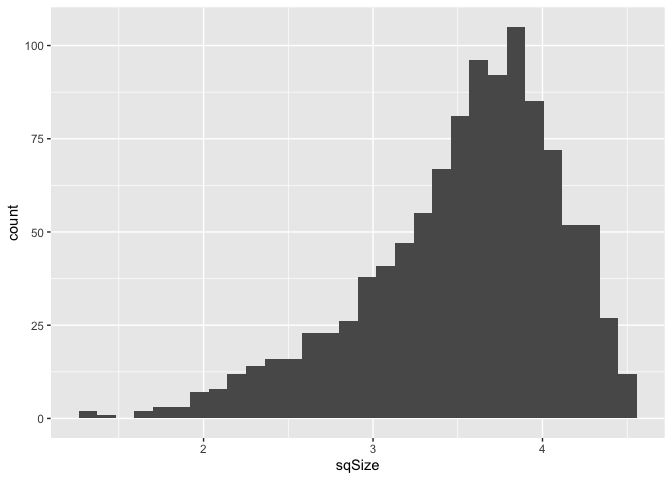
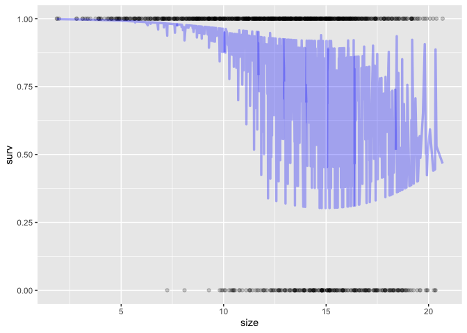
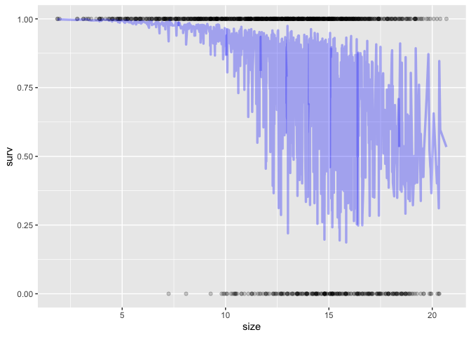
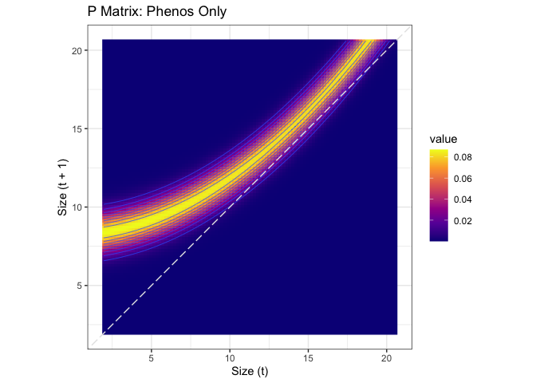
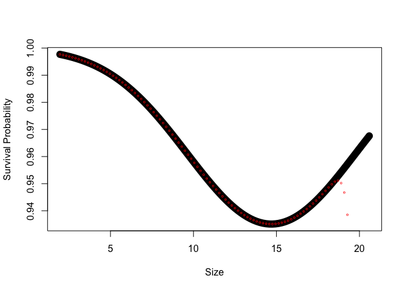
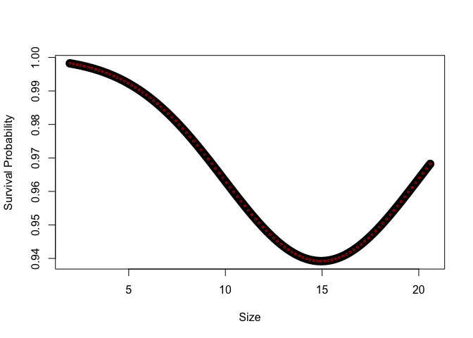
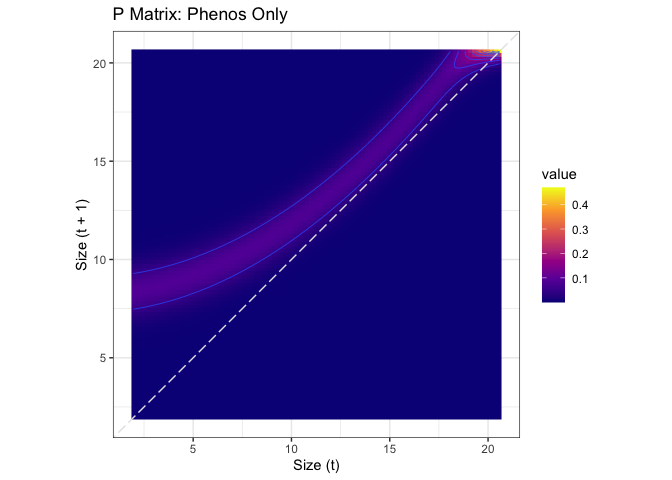
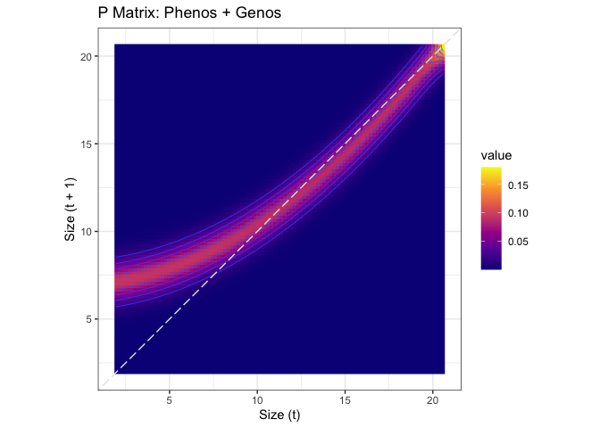

# IPM from Population Simulation

\*Simulations done in "Population_Sim_Trial.Rmd" file (currently using AlphaSimR)

**Goal:** Compare IPM created from just phenotypes from the simulation to an IPM created from phenotypes + genotype scores.

## Libraries


``` r
library(tidyverse)
```

```
## ── Attaching core tidyverse packages ──────────────────────── tidyverse 2.0.0 ──
## ✔ dplyr     1.1.4     ✔ readr     2.1.5
## ✔ forcats   1.0.0     ✔ stringr   1.5.1
## ✔ ggplot2   3.5.1     ✔ tibble    3.2.1
## ✔ lubridate 1.9.3     ✔ tidyr     1.3.1
## ✔ purrr     1.0.2     
## ── Conflicts ────────────────────────────────────────── tidyverse_conflicts() ──
## ✖ dplyr::filter() masks stats::filter()
## ✖ dplyr::lag()    masks stats::lag()
## ℹ Use the conflicted package (<http://conflicted.r-lib.org/>) to force all conflicts to become errors
```

``` r
library(broom)
library(broom.mixed)
library(magrittr)
```

```
## 
## Attaching package: 'magrittr'
## 
## The following object is masked from 'package:purrr':
## 
##     set_names
## 
## The following object is masked from 'package:tidyr':
## 
##     extract
```

``` r
library(lmerTest)
```

```
## Loading required package: lme4
## Loading required package: Matrix
## 
## Attaching package: 'Matrix'
## 
## The following objects are masked from 'package:tidyr':
## 
##     expand, pack, unpack
## 
## 
## Attaching package: 'lmerTest'
## 
## The following object is masked from 'package:lme4':
## 
##     lmer
## 
## The following object is masked from 'package:stats':
## 
##     step
```

``` r
conflicted::conflicts_prefer(lmerTest::lmer)
```

```
## [conflicted] Will prefer lmerTest::lmer over any other package.
```

``` r
conflicted::conflicts_prefer(dplyr::filter)
```

```
## [conflicted] Will prefer dplyr::filter over any other package.
```

``` r
conflicted::conflicts_prefer(dplyr::mutate)
```

```
## [conflicted] Will prefer dplyr::mutate over any other package.
```

## Load the data

``` r
simpop <- read_csv("../output/PopSim_Phenos-Genos_v3.csv")
```

```
## Rows: 12000 Columns: 27
## ── Column specification ────────────────────────────────────────────────────────
## Delimiter: ","
## dbl (27): germination.logit_pheno, establishment.logit_pheno, y1surv.logit_p...
## 
## ℹ Use `spec()` to retrieve the full column specification for this data.
## ℹ Specify the column types or set `show_col_types = FALSE` to quiet this message.
```

``` r
names(simpop)
```

```
##  [1] "germination.logit_pheno"   "establishment.logit_pheno"
##  [3] "y1surv.logit_pheno"        "beta_pheno"               
##  [5] "k_pheno"                   "flowering.logit_pheno"    
##  [7] "fruitPerPlant_pheno"       "germination.prob"         
##  [9] "establishment.prob"        "y1surv.prob"              
## [11] "flowering.prob"            "germinated"               
## [13] "established"               "y1surv"                   
## [15] "flowered"                  "Indiv_ID"                 
## [17] "week"                      "week_next"                
## [19] "elapsed_weeks"             "size"                     
## [21] "germination.logit_geno"    "establishment.logit_geno" 
## [23] "y1surv.logit_geno"         "beta_geno"                
## [25] "k_geno"                    "flowering.logit_geno"     
## [27] "fruitPerPlant_geno"
```

``` r
#logit_pheno = scaled probability/phenotype
#_geno = genotype score for that trait 
#size = height calculated from simulated Weibull parameters (alpha, beta, k, and delta)
####Note: we will use the genotype score for k for this 
#elapsed_weeks = interval between weeks - should all be 1 in this data
```

### Add size next and weekly surv

``` r
unique(simpop$established) #NA = did not germinate, 1 = established (survived first 3 weeks in field); 0 = did not establish
```

```
## [1] NA  0  1
```

``` r
unique(simpop$y1surv) #NA = did not establish, 1 = survived to week 12; 0 = did not survive 
```

```
## [1] NA  0  1
```

``` r
#simpop %>% select(Indiv_ID, germinated, established, y1surv, k_pheno, week, size) %>% filter(Indiv_ID<5)

simpop_timeprep <- simpop %>%
  mutate(weeks = as.numeric(week - 1), #Weeks since week 1 (equivalent to pre-transplant or initial size) 
         size = if_else(germinated==0, NA, size) #no size if no germ
         ) %>%   
  group_by(Indiv_ID) %>% 
  mutate(surv=if_else(germinated==0, NA, #surv = NA if you did not germ 
                        if_else(week==1, 1, #if you did germinate, assume you survived to week 1 (equivalent to pre-transplant size time point)
                                if_else(established==0, 0, #surv = 0 after week 1 if you did not establish 
                                        if_else(week<5, 1, #if you did establish, your surv is equal to 1 for the first 3 weeks post-transplant 
                                                y1surv) #your survival for weeks 5-12 is then equal to your y1surv
                                        )))) %>% 
  mutate(death.week=if_else(y1surv==1, NA, #if survive year 1 no death week 
                            first(week, order_by = surv)) #first week where surv = 0 
           ) %>% 
  #note we only have establishment and y1surv survival from the pop sim --> little weekly variation 
  mutate(size_next = lead(size, order_by = week), #next time point's size) 
         size = if_else(is.na(death.week), size,
                        if_else(week>death.week, NA, size))) %>%  
  ungroup() %>% 
  mutate(size_next=if_else(surv==0, NA, size_next))

simpop_timeprep %>% #look at data for a few indivs to see if above worked
  drop_na(surv) %>% 
  select(Indiv_ID, week, weeks, germinated, established, y1surv, size, size_next, surv, death.week) %>% 
  filter(Indiv_ID<25)
```

```
## # A tibble: 84 × 10
##    Indiv_ID  week weeks germinated established y1surv  size size_next  surv
##       <dbl> <dbl> <dbl>      <dbl>       <dbl>  <dbl> <dbl>     <dbl> <dbl>
##  1        3     1     0          1           0     NA  4.37        NA     1
##  2        3     2     1          1           0     NA NA           NA     0
##  3        3     3     2          1           0     NA NA           NA     0
##  4        3     4     3          1           0     NA NA           NA     0
##  5        3     5     4          1           0     NA NA           NA     0
##  6        3     6     5          1           0     NA NA           NA     0
##  7        3     7     6          1           0     NA NA           NA     0
##  8        3     8     7          1           0     NA NA           NA     0
##  9        3     9     8          1           0     NA NA           NA     0
## 10        3    10     9          1           0     NA NA           NA     0
## # ℹ 74 more rows
## # ℹ 1 more variable: death.week <dbl>
```

``` r
simpop_timeprep_surv <- simpop_timeprep %>% drop_na(surv, size) #for surv models 
simpop_timeprep_size <- simpop_timeprep %>% drop_na(size, size_next) #for size models 
```

### Scaling and transformations

``` r
simpop_timeprep_surv %>%  #slightly skewed
  ggplot(aes(x=size)) +
  geom_histogram()
```

```
## `stat_bin()` using `bins = 30`. Pick better value with `binwidth`.
```

<!-- -->

``` r
simpop_timeprep_surv_scaled <- simpop_timeprep_surv %>% 
  mutate(logSize=log(size),
         sqSize=sqrt(size)) 

simpop_timeprep_surv_scaled %>% #not better
  ggplot(aes(x=logSize)) +
  geom_histogram()
```

```
## `stat_bin()` using `bins = 30`. Pick better value with `binwidth`.
```

<!-- -->

``` r
simpop_timeprep_surv_scaled %>% #not better
  ggplot(aes(x=sqSize)) +
  geom_histogram()
```

```
## `stat_bin()` using `bins = 30`. Pick better value with `binwidth`.
```

<!-- -->

## Survival Models

### Phenos Only

``` r
surv.models_pheno <- tribble(
  ~name,          ~f,
  "1_linear_size",                 "surv ~ size", 
  "2_linear_weeks",                "surv ~ size + weeks",
  "3a_quadratic_size",             "surv ~ size + I(size^2)", 
  "3b_quadratic_size_weeks",       "surv ~ size + I(size^2) + weeks", 
  "4a_cubic_size",                 "surv ~ size + I(size^2) + I(size^3)",
  "4b_cubic_size_weeks",           "surv ~ size + I(size^2) + I(size^3) + weeks"
)

#run the models 
surv.models_pheno <- surv.models_pheno %>%
  mutate(glm = map(f, ~ glm(as.formula(.), 
                            data = simpop_timeprep_surv, 
                            family = "binomial")), #, #run the models 
         predict = map(glm, predict, type = "response"), 
         glance = map(glm, tidy),
         AIC = map(glm, AIC),
         BIC = map(glm, BIC)) #glance at the model results

surv.models_pheno %>% select(-f, -glm, -predict) %>% unnest(BIC) %>% arrange(BIC) #look at the model fitting info 
```

```
## # A tibble: 6 × 4
##   name                    glance           AIC         BIC
##   <chr>                   <list>           <list>    <dbl>
## 1 3a_quadratic_size       <tibble [3 × 5]> <dbl [1]>  538.
## 2 3b_quadratic_size_weeks <tibble [4 × 5]> <dbl [1]>  544.
## 3 4a_cubic_size           <tibble [4 × 5]> <dbl [1]>  544.
## 4 4b_cubic_size_weeks     <tibble [5 × 5]> <dbl [1]>  549.
## 5 1_linear_size           <tibble [2 × 5]> <dbl [1]>  551.
## 6 2_linear_weeks          <tibble [3 × 5]> <dbl [1]>  555.
```

``` r
surv.models_pheno %>% select(-f, -glm, -predict) %>% unnest(AIC) %>% arrange(AIC) #look at the model fitting info 
```

```
## # A tibble: 6 × 4
##   name                    glance             AIC BIC      
##   <chr>                   <list>           <dbl> <list>   
## 1 3a_quadratic_size       <tibble [3 × 5]>  523. <dbl [1]>
## 2 3b_quadratic_size_weeks <tibble [4 × 5]>  524. <dbl [1]>
## 3 4a_cubic_size           <tibble [4 × 5]>  524. <dbl [1]>
## 4 4b_cubic_size_weeks     <tibble [5 × 5]>  524. <dbl [1]>
## 5 2_linear_weeks          <tibble [3 × 5]>  540. <dbl [1]>
## 6 1_linear_size           <tibble [2 × 5]>  541. <dbl [1]>
```

``` r
#3a_quadratic size best by AIC and BIC
```


``` r
survival.model.final_pheno <- surv.models_pheno %>% filter(name == "3a_quadratic_size") %>% pull(glm) %>% magrittr::extract2(1)
summary(survival.model.final_pheno)
```

```
## 
## Call:
## glm(formula = as.formula(.), family = "binomial", data = simpop_timeprep_surv)
## 
## Coefficients:
##             Estimate Std. Error z value Pr(>|z|)    
## (Intercept) 10.58309    2.28396   4.634 3.59e-06 ***
## size        -1.26333    0.35096  -3.600 0.000319 ***
## I(size^2)    0.04734    0.01328   3.565 0.000364 ***
## ---
## Signif. codes:  0 '***' 0.001 '**' 0.01 '*' 0.05 '.' 0.1 ' ' 1
## 
## (Dispersion parameter for binomial family taken to be 1)
## 
##     Null deviance: 539.26  on 1077  degrees of freedom
## Residual deviance: 517.13  on 1075  degrees of freedom
## AIC: 523.13
## 
## Number of Fisher Scoring iterations: 7
```

#### Predicted vs. Observed Survival

``` r
simpop_timeprep_surv %>% 
  mutate(pred_fixef = predict(survival.model.final_pheno, newdata = ., type="response", re.form = NA)) %>% 
  ggplot(aes(x = size, y = surv)) +
  geom_point(alpha=.2) +
  geom_line(aes(y = pred_fixef), 
            color = "blue", 
            size = 1.2, alpha=0.3) 
```

```
## Warning: Using `size` aesthetic for lines was deprecated in ggplot2 3.4.0.
## ℹ Please use `linewidth` instead.
## This warning is displayed once every 8 hours.
## Call `lifecycle::last_lifecycle_warnings()` to see where this warning was
## generated.
```

<!-- -->

### Phenos + Genos

``` r
surv.models_genos <- tribble(
  ~name,          ~f,
  "1a_linear_size",                 "surv ~ size", 
  "1b_linear_size_genos",           "surv ~ size + establishment.logit_geno + y1surv.logit_geno", 
  "2a_linear_weeks",                "surv ~ size + weeks",
  "2b_linear_weeks_geno",           "surv ~ size + weeks + establishment.logit_geno + y1surv.logit_geno",
  "3a_quadratic_size",              "surv ~ size + I(size^2)", 
  "3b_quadratic_size_weeks",        "surv ~ size + I(size^2) + weeks", 
  "3c_quadratic_size_weeks_geno",   "surv ~ size + I(size^2) + weeks + establishment.logit_geno + y1surv.logit_geno",
  "4a_cubic_size",                  "surv ~ size + I(size^2) + I(size^3)",
  "4b_cubic_size_weeks",            "surv ~ size + I(size^2) + I(size^3) + weeks",
  "4c_cubic_size_weeks_geno",       "surv ~ size + I(size^2) + I(size^3) + weeks + establishment.logit_geno + y1surv.logit_geno"
)

#run the models 
surv.models_genos <- surv.models_genos %>%
  mutate(glm = map(f, ~ glm(as.formula(.), 
                            data = simpop_timeprep_surv, 
                            family = "binomial")), #, #run the models 
         predict = map(glm, predict, type = "response"), 
         glance = map(glm, tidy),
         AIC = map(glm, AIC),
         BIC = map(glm, BIC)) #glance at the model results

surv.models_genos %>% select(-f, -glm, -predict) %>% unnest(BIC) %>% arrange(BIC) #look at the model fitting info 
```

```
## # A tibble: 10 × 4
##    name                         glance           AIC         BIC
##    <chr>                        <list>           <list>    <dbl>
##  1 3a_quadratic_size            <tibble [3 × 5]> <dbl [1]>  538.
##  2 3b_quadratic_size_weeks      <tibble [4 × 5]> <dbl [1]>  544.
##  3 4a_cubic_size                <tibble [4 × 5]> <dbl [1]>  544.
##  4 4b_cubic_size_weeks          <tibble [5 × 5]> <dbl [1]>  549.
##  5 1a_linear_size               <tibble [2 × 5]> <dbl [1]>  551.
##  6 3c_quadratic_size_weeks_geno <tibble [6 × 5]> <dbl [1]>  552.
##  7 2a_linear_weeks              <tibble [3 × 5]> <dbl [1]>  555.
##  8 4c_cubic_size_weeks_geno     <tibble [7 × 5]> <dbl [1]>  558.
##  9 1b_linear_size_genos         <tibble [4 × 5]> <dbl [1]>  559.
## 10 2b_linear_weeks_geno         <tibble [5 × 5]> <dbl [1]>  562.
```

``` r
surv.models_genos %>% select(-f, -glm, -predict) %>% unnest(AIC) %>% arrange(AIC) #look at the model fitting info 
```

```
## # A tibble: 10 × 4
##    name                         glance             AIC BIC      
##    <chr>                        <list>           <dbl> <list>   
##  1 3c_quadratic_size_weeks_geno <tibble [6 × 5]>  522. <dbl [1]>
##  2 4c_cubic_size_weeks_geno     <tibble [7 × 5]>  523. <dbl [1]>
##  3 3a_quadratic_size            <tibble [3 × 5]>  523. <dbl [1]>
##  4 3b_quadratic_size_weeks      <tibble [4 × 5]>  524. <dbl [1]>
##  5 4a_cubic_size                <tibble [4 × 5]>  524. <dbl [1]>
##  6 4b_cubic_size_weeks          <tibble [5 × 5]>  524. <dbl [1]>
##  7 2b_linear_weeks_geno         <tibble [5 × 5]>  538. <dbl [1]>
##  8 1b_linear_size_genos         <tibble [4 × 5]>  539. <dbl [1]>
##  9 2a_linear_weeks              <tibble [3 × 5]>  540. <dbl [1]>
## 10 1a_linear_size               <tibble [2 × 5]>  541. <dbl [1]>
```

``` r
#3a_quadratic_size best by BIC
#3c_quadratic_size_weeks_geno best by AIC 
```


``` r
survival.model.final_genos <- surv.models_genos %>% filter(name == "3c_quadratic_size_weeks_geno") %>% pull(glm) %>% magrittr::extract2(1)
summary(survival.model.final_genos)
```

```
## 
## Call:
## glm(formula = as.formula(.), family = "binomial", data = simpop_timeprep_surv)
## 
## Coefficients:
##                          Estimate Std. Error z value Pr(>|z|)    
## (Intercept)              10.95377    2.46308   4.447  8.7e-06 ***
## size                     -1.27993    0.35498  -3.606 0.000311 ***
## I(size^2)                 0.04596    0.01348   3.409 0.000653 ***
## weeks                     0.06035    0.05115   1.180 0.238032    
## establishment.logit_geno -1.18035    0.82833  -1.425 0.154166    
## y1surv.logit_geno        -3.91592    2.43225  -1.610 0.107398    
## ---
## Signif. codes:  0 '***' 0.001 '**' 0.01 '*' 0.05 '.' 0.1 ' ' 1
## 
## (Dispersion parameter for binomial family taken to be 1)
## 
##     Null deviance: 539.26  on 1077  degrees of freedom
## Residual deviance: 510.09  on 1072  degrees of freedom
## AIC: 522.09
## 
## Number of Fisher Scoring iterations: 7
```

#### Predicted vs. Observed Survival

``` r
simpop_timeprep_surv %>% 
  mutate(pred_fixef = predict(survival.model.final_genos, newdata = ., type="response", re.form = NA)) %>% 
  ggplot(aes(x = size, y = surv)) +
  geom_point(alpha=.2) +
  geom_line(aes(y = pred_fixef), 
            color = "blue", 
            size = 1.2, alpha=0.3) 
```

<!-- -->

## Growth Models

### Observed Patterns

``` r
simpop_timeprep_size %>% 
  ggplot(aes(x=size, y=size_next)) +
  geom_point()  +
  geom_abline() +
  geom_smooth(method = "lm")
```

```
## `geom_smooth()` using formula = 'y ~ x'
```

<!-- -->

### Phenos Only

``` r
size.models_pheno <- tribble(
  ~name,          ~f,
  "1_linear_size",                 "size_next ~ size", 
  "2_linear_weeks",                "size_next ~ size + weeks",
  "3a_quadratic_size",             "size_next ~ size + I(size^2)", 
  "3b_quadratic_size_weeks",       "size_next ~ size + I(size^2) + weeks", 
  "4a_cubic_size",                 "size_next ~ size + I(size^2) + I(size^3)",
  "4b_cubic_size_weeks",           "size_next ~ size + I(size^2) + I(size^3) + weeks"
)

#run the models 
size.models_pheno <- size.models_pheno %>%
  mutate(lm = map(f, ~ lm(as.formula(.), 
                            data = simpop_timeprep_size)), #, #run the models 
         predict = map(lm, predict), 
         glance = map(lm, glance)) #glance at the model results

size.models_pheno %>% select(-f, -lm, -predict) %>% unnest(glance) %>% arrange(BIC) #look at the model fitting info 
```

```
## # A tibble: 6 × 13
##   name  r.squared adj.r.squared sigma statistic p.value    df logLik   AIC   BIC
##   <chr>     <dbl>         <dbl> <dbl>     <dbl>   <dbl> <dbl>  <dbl> <dbl> <dbl>
## 1 3b_q…     0.921         0.921 0.809     3493.       0     3 -1086. 2181. 2205.
## 2 4b_c…     0.921         0.921 0.810     2618.       0     4 -1086. 2183. 2212.
## 3 3a_q…     0.912         0.912 0.854     4656.       0     2 -1135. 2278. 2297.
## 4 4a_c…     0.912         0.912 0.855     3101.       0     3 -1135. 2280. 2304.
## 5 2_li…     0.888         0.888 0.964     3556.       0     2 -1244. 2497. 2516.
## 6 1_li…     0.883         0.883 0.984     6798.       0     1 -1263. 2531. 2546.
## # ℹ 3 more variables: deviance <dbl>, df.residual <int>, nobs <int>
```

``` r
size.models_pheno %>% select(-f, -lm, -predict) %>% unnest(glance) %>% arrange(AIC) #look at the model fitting info 
```

```
## # A tibble: 6 × 13
##   name  r.squared adj.r.squared sigma statistic p.value    df logLik   AIC   BIC
##   <chr>     <dbl>         <dbl> <dbl>     <dbl>   <dbl> <dbl>  <dbl> <dbl> <dbl>
## 1 3b_q…     0.921         0.921 0.809     3493.       0     3 -1086. 2181. 2205.
## 2 4b_c…     0.921         0.921 0.810     2618.       0     4 -1086. 2183. 2212.
## 3 3a_q…     0.912         0.912 0.854     4656.       0     2 -1135. 2278. 2297.
## 4 4a_c…     0.912         0.912 0.855     3101.       0     3 -1135. 2280. 2304.
## 5 2_li…     0.888         0.888 0.964     3556.       0     2 -1244. 2497. 2516.
## 6 1_li…     0.883         0.883 0.984     6798.       0     1 -1263. 2531. 2546.
## # ℹ 3 more variables: deviance <dbl>, df.residual <int>, nobs <int>
```

``` r
#3b_quadratic_size_weeks best by AIC and BIC
```


``` r
size.model.final_pheno <- size.models_pheno %>% filter(name == "3b_quadratic_size_weeks") %>% pull(lm) %>% magrittr::extract2(1)
summary(size.model.final_pheno)
```

```
## 
## Call:
## lm(formula = as.formula(.), data = simpop_timeprep_size)
## 
## Residuals:
##     Min      1Q  Median      3Q     Max 
## -2.9978 -0.3287 -0.0451  0.2080  3.3750 
## 
## Coefficients:
##              Estimate Std. Error t value Pr(>|t|)    
## (Intercept)  8.145335   0.239225  34.049   <2e-16 ***
## size         0.039671   0.040509   0.979    0.328    
## I(size^2)    0.032509   0.001671  19.457   <2e-16 ***
## weeks       -0.125330   0.012312 -10.179   <2e-16 ***
## ---
## Signif. codes:  0 '***' 0.001 '**' 0.01 '*' 0.05 '.' 0.1 ' ' 1
## 
## Residual standard error: 0.8092 on 897 degrees of freedom
## Multiple R-squared:  0.9212,	Adjusted R-squared:  0.9209 
## F-statistic:  3493 on 3 and 897 DF,  p-value: < 2.2e-16
```

#### Predicted vs. Observed Growth

``` r
simpop_timeprep_size %>% 
  cbind(predicted={size.models_pheno %>% filter(name=="3b_quadratic_size_weeks") %>% pull(predict) %>% unlist()}) %>%
  ggplot(aes(x=size_next, y = predicted)) +
  geom_point() +
  geom_abline(color="skyblue2")
```

<!-- -->

### Phenos + Genos

``` r
size.models_genos <- tribble(
  ~name,          ~f,
  "1a_linear_size",                 "size_next ~ size", 
  "1b_linear_size_geno",            "size_next ~ size + k_geno", 
  "2a_linear_weeks",                "size_next ~ size + weeks",
  "2b_linear_weeks_geno",           "size_next ~ size + weeks + k_geno",
  "3a_quadratic_size",              "size_next ~ size + I(size^2)", 
  "3b_quadratic_size_weeks",        "size_next ~ size + I(size^2) + weeks", 
  "3c_quadratic_size_weeks_geno",   "size_next ~ size + I(size^2) + weeks + k_geno",
  "4a_cubic_size",                  "size_next ~ size + I(size^2) + I(size^3)",
  "4b_cubic_size_weeks",            "size_next ~ size + I(size^2) + I(size^3) + weeks",
  "4c_cubic_size_weeks_geno",       "size_next ~ size + I(size^2) + I(size^3) + weeks + k_geno"
)

#run the models 
size.models_genos <- size.models_genos %>%
  mutate(lm = map(f, ~ lm(as.formula(.), 
                            data = simpop_timeprep_size)), #, #run the models 
         predict = map(lm, predict), 
         glance = map(lm, glance)) #glance at the model results

size.models_genos %>% select(-f, -lm, -predict) %>% unnest(glance) %>% arrange(BIC) #look at the model fitting info 
```

```
## # A tibble: 10 × 13
##    name       r.squared adj.r.squared sigma statistic p.value    df logLik   AIC
##    <chr>          <dbl>         <dbl> <dbl>     <dbl>   <dbl> <dbl>  <dbl> <dbl>
##  1 3c_quadra…     0.930         0.930 0.761     2995.       0     4 -1029. 2071.
##  2 4c_cubic_…     0.930         0.930 0.761     2394.       0     5 -1029. 2073.
##  3 3b_quadra…     0.921         0.921 0.809     3493.       0     3 -1086. 2181.
##  4 4b_cubic_…     0.921         0.921 0.810     2618.       0     4 -1086. 2183.
##  5 3a_quadra…     0.912         0.912 0.854     4656.       0     2 -1135. 2278.
##  6 4a_cubic_…     0.912         0.912 0.855     3101.       0     3 -1135. 2280.
##  7 2b_linear…     0.904         0.904 0.893     2812.       0     3 -1175. 2360.
##  8 1b_linear…     0.903         0.903 0.896     4186.       0     2 -1178. 2365.
##  9 2a_linear…     0.888         0.888 0.964     3556.       0     2 -1244. 2497.
## 10 1a_linear…     0.883         0.883 0.984     6798.       0     1 -1263. 2531.
## # ℹ 4 more variables: BIC <dbl>, deviance <dbl>, df.residual <int>, nobs <int>
```

``` r
size.models_genos %>% select(-f, -lm, -predict) %>% unnest(glance) %>% arrange(AIC) #look at the model fitting info 
```

```
## # A tibble: 10 × 13
##    name       r.squared adj.r.squared sigma statistic p.value    df logLik   AIC
##    <chr>          <dbl>         <dbl> <dbl>     <dbl>   <dbl> <dbl>  <dbl> <dbl>
##  1 3c_quadra…     0.930         0.930 0.761     2995.       0     4 -1029. 2071.
##  2 4c_cubic_…     0.930         0.930 0.761     2394.       0     5 -1029. 2073.
##  3 3b_quadra…     0.921         0.921 0.809     3493.       0     3 -1086. 2181.
##  4 4b_cubic_…     0.921         0.921 0.810     2618.       0     4 -1086. 2183.
##  5 3a_quadra…     0.912         0.912 0.854     4656.       0     2 -1135. 2278.
##  6 4a_cubic_…     0.912         0.912 0.855     3101.       0     3 -1135. 2280.
##  7 2b_linear…     0.904         0.904 0.893     2812.       0     3 -1175. 2360.
##  8 1b_linear…     0.903         0.903 0.896     4186.       0     2 -1178. 2365.
##  9 2a_linear…     0.888         0.888 0.964     3556.       0     2 -1244. 2497.
## 10 1a_linear…     0.883         0.883 0.984     6798.       0     1 -1263. 2531.
## # ℹ 4 more variables: BIC <dbl>, deviance <dbl>, df.residual <int>, nobs <int>
```

``` r
#3c_quadratic_size_weeks_geno best by AIC and BIC
```


``` r
size.model.final_genos <- size.models_genos %>% filter(name == "3c_quadratic_size_weeks_geno") %>% pull(lm) %>% magrittr::extract2(1)
summary(size.model.final_genos)
```

```
## 
## Call:
## lm(formula = as.formula(.), data = simpop_timeprep_size)
## 
## Residuals:
##     Min      1Q  Median      3Q     Max 
## -3.0004 -0.3675 -0.0804  0.2436  3.1670 
## 
## Coefficients:
##               Estimate Std. Error t value Pr(>|t|)    
## (Intercept)   6.949027   0.250134  27.781  < 2e-16 ***
## size          0.059096   0.038119   1.550    0.121    
## I(size^2)     0.029475   0.001595  18.480  < 2e-16 ***
## weeks        -0.082543   0.012219  -6.755 2.56e-11 ***
## k_geno      131.867772  12.076474  10.919  < 2e-16 ***
## ---
## Signif. codes:  0 '***' 0.001 '**' 0.01 '*' 0.05 '.' 0.1 ' ' 1
## 
## Residual standard error: 0.7606 on 896 degrees of freedom
## Multiple R-squared:  0.9304,	Adjusted R-squared:  0.9301 
## F-statistic:  2995 on 4 and 896 DF,  p-value: < 2.2e-16
```

#### Predicted vs. Observed Growth

``` r
simpop_timeprep_size %>% 
  cbind(predicted={size.models_genos %>% filter(name=="3c_quadratic_size_weeks_geno") %>% pull(predict) %>% unlist()}) %>%
  ggplot(aes(x=size_next, y = predicted)) +
  geom_point() +
  geom_abline(color="skyblue2")
```

<!-- -->

## P Matrix

### Make a dataframe to store the parameters

``` r
params=data.frame(
  surv.int=NA, # Intercept from logistic regression of survival
  surv.slope1=NA, # Slope from logistic regression of survival
  surv.slope2=NA, # Quadratic slope from logistic regression of survival
  growth.int=NA, # Intercept from linear regression of growth
  growth.slope1=NA, # Slope from linear regression of growth
  growth.slope2=NA, # Quadratic slope from linear regression of growth
  growth.sd=NA # Residual sd from the linear regression of growth
)

params_phenos <- params
params_genos <- params
```

### Use broom:tidy to create a df with the coef from each model

``` r
surv.coefs_pheno <- surv.models_pheno %>% 
  filter(name == "3a_quadratic_size") %>%
  mutate(coefs = map(glm, tidy)) %>% 
  select(name, f, coefs) %>% 
  unnest(coefs) 

params_phenos$surv.int <- surv.coefs_pheno %>% filter(term == "(Intercept)") %>% pull(estimate)
params_phenos$surv.slope1 <- surv.coefs_pheno %>% filter(term == "size") %>% pull(estimate)
params_phenos$surv.slope2 <- surv.coefs_pheno %>% filter(term == "I(size^2)") %>% pull(estimate)
```


``` r
surv.coefs_genos <- surv.models_genos %>% 
  filter(name == "3c_quadratic_size_weeks_geno") %>%
  mutate(coefs = map(glm, tidy)) %>% 
  select(name, f, coefs) %>% 
  unnest(coefs) 

params_genos$surv.int <- surv.coefs_genos %>% filter(term == "(Intercept)") %>% pull(estimate)
params_genos$surv.slope1 <- surv.coefs_genos %>% filter(term == "size") %>% pull(estimate)
params_genos$surv.slope2 <- surv.coefs_genos %>% filter(term == "I(size^2)") %>% pull(estimate)
```


``` r
growth.coefs_pheno <- size.models_pheno %>% 
  filter(name == "3b_quadratic_size_weeks") %>% 
  mutate(coefs = map(lm, tidy)) %>% 
  select(name, f, coefs) %>% 
  unnest(coefs) 

params_phenos$growth.int <- growth.coefs_pheno %>% filter(term == "(Intercept)") %>% pull(estimate)
params_phenos$growth.slope1 <- growth.coefs_pheno %>% filter(term == "size") %>% pull(estimate)
params_phenos$growth.slope2 <- growth.coefs_pheno %>% filter(term == "I(size^2)") %>% pull(estimate)

#Pull sigma which is the _modeled_ standard deviation of the residuals.  Merow uses observed sd of residuals.  
params_phenos$growth.sd <- size.models_pheno %>% filter(name == "3b_quadratic_size_weeks") %>% unnest(glance) %>% pull(sigma)
```


``` r
growth.coefs_genos <- size.models_genos %>% 
  filter(name == "3c_quadratic_size_weeks_geno") %>% 
  mutate(coefs = map(lm, tidy)) %>% 
  select(name, f, coefs) %>% 
  unnest(coefs) 

params_genos$growth.int <- growth.coefs_genos %>% filter(term == "(Intercept)") %>% pull(estimate)
params_genos$growth.slope1 <- growth.coefs_genos %>% filter(term == "size") %>% pull(estimate)
params_genos$growth.slope2 <- growth.coefs_genos %>% filter(term == "I(size^2)") %>% pull(estimate)

#Pull sigma which is the _modeled_ standard deviation of the residuals.  Merow uses observed sd of residuals.  
params_genos$growth.sd <- size.models_genos %>% filter(name == "3c_quadratic_size_weeks_geno") %>% unnest(glance) %>% pull(sigma)
```

### Define the functions

``` r
# 1. survival probability function
##This is inverse logit.  Provides survival probability based on size.
s.x_phenos=function(x,params_phenos) {
  u=exp(params_phenos$surv.int + params_phenos$surv.slope1*x + params_phenos$surv.slope2*x^2)
  return(u/(1+u)) 
}

# 2. growth function
## Return a probability distribution of new sizes at t+1 (xp) at a given size x.  
g.yx_phenos=function(xp,x,params_phenos) {
  dnorm(xp,mean=params_phenos$growth.int + params_phenos$growth.slope1*x + params_phenos$growth.slope2*x^2, sd=params_phenos$growth.sd)
}
```


``` r
# 1. survival probability function
##This is inverse logit.  Provides survival probability based on size.
s.x_genos=function(x,params_genos) {
  u=exp(params_genos$surv.int + params_genos$surv.slope1*x + params_genos$surv.slope2*x^2)
  return(u/(1+u)) 
}

# 2. growth function
## Return a probability distribution of new sizes at t+1 (xp) at a given size x.  
g.yx_genos=function(xp,x,params_genos) {
  dnorm(xp,mean=params_genos$growth.int + params_genos$growth.slope1*x + params_genos$growth.slope2*x^2, sd=params_genos$growth.sd)
}
```

### Define the structure of the IPM

``` r
# the sizes we are integrating over
minSize<-min(simpop_timeprep$size,na.rm=T) 
maxSize<-max(simpop_timeprep$size,na.rm=T) 

n=100 # dimensions of the matrix 

b=minSize+c(0:n)*(maxSize-minSize)/n # boundary points
y=0.5*(b[1:n]+b[2:(n+1)]) # mesh points
h=y[2]-y[1] # step size
```

### Make the matrices (G, S, and P)

``` r
G_phenos=h*outer(y,y,g.yx_phenos,params=params_phenos) # growth matrix

S_phenos=s.x_phenos(y,params=params_phenos) # survival at each size midpoint

P_phenos=G_phenos # placeholder; redefine P on the next line
for(i in 1:n) P_phenos[,i]=G_phenos[,i]*S_phenos[i] # growth/survival matrix
```


``` r
G_genos=h*outer(y,y,g.yx_genos,params=params_genos) # growth matrix

S_genos=s.x_genos(y,params=params_genos) # survival at each size midpoint

P_genos=G_genos # placeholder; redefine P on the next line
for(i in 1:n) P_genos[,i]=G_genos[,i]*S_genos[i] # growth/survival matrix
```

### Plot the matrix

``` r
P_phenos %>% as_tibble() %>%
  set_colnames(y) %>% #column names = each size mesh point 
  mutate(size.t1=y) %>%
  pivot_longer(-size.t1, names_to = "size.t", names_transform = as.numeric) %>%
  ggplot(aes(x=size.t, y = size.t1)) +
  geom_raster(aes(fill = value)) + #basic contour with fill determined by the growth*surv value 
  geom_contour(aes(z = value),lwd=.25) + #adds contour lines 
  geom_abline(intercept=0, slope = 1, color="gray90", lty=5) + #add 1:1 line 
  scale_fill_viridis_c(option = "plasma") + #change contour colors 
  labs(x = "Size (t)", y = "Size (t + 1)", title = "P Matrix: Phenos Only") +
  coord_equal() + #make it a square plot 
  theme_bw()
```

```
## Warning: The `x` argument of `as_tibble.matrix()` must have unique column names if
## `.name_repair` is omitted as of tibble 2.0.0.
## ℹ Using compatibility `.name_repair`.
## This warning is displayed once every 8 hours.
## Call `lifecycle::last_lifecycle_warnings()` to see where this warning was
## generated.
```

<!-- -->

``` r
P_genos %>% as_tibble() %>%
  set_colnames(y) %>% #column names = each size mesh point 
  mutate(size.t1=y) %>%
  pivot_longer(-size.t1, names_to = "size.t", names_transform = as.numeric) %>%
  ggplot(aes(x=size.t, y = size.t1)) +
  geom_raster(aes(fill = value)) + #basic contour with fill determined by the growth*surv value 
  geom_contour(aes(z = value),lwd=.25) + #adds contour lines 
  geom_abline(intercept=0, slope = 1, color="gray90", lty=5) + #add 1:1 line 
  scale_fill_viridis_c(option = "plasma") + #change contour colors 
  labs(x = "Size (t)", y = "Size (t + 1)", title = "P Matrix: Phenos + Genos") +
  coord_equal() + #make it a square plot 
  theme_bw()
```

<!-- -->
### Check for eviction

``` r
plot(y,s.x_phenos(y,params_phenos), #fitted survival model 
     xlab="Size",type="l",
        ylab="Survival Probability",lwd=12)
     points(y,apply(P_phenos,2,sum),col="red",lwd=3,cex=.1,pch=19) # column sums 
```

<!-- -->

``` r
#some eviction at larger sizes
```

``` r
plot(y,s.x_genos(y,params_genos), #fitted survival model 
     xlab="Size",type="l",
        ylab="Survival Probability",lwd=12)
     points(y,apply(P_genos,2,sum),col="red",lwd=3,cex=.1,pch=19) # column sums 
```

<!-- -->

``` r
#some eviction at larger sizes
```
#### Eviction correction using a constant 

``` r
Pc_phenos=G_phenos # placeholder; redefine P on the next line
for(i in 1:n) Pc_phenos[,i]=G_phenos[,i]*S_phenos[i] # growth/survival matrix
nvals <- colSums(Pc_phenos, na.rm = TRUE)
Pc_phenos <- t((t(Pc_phenos)/nvals) * s.x_phenos(y, params=params_phenos))

plot(y,s.x_phenos(y,params_phenos),xlab="Size",type="l",
        ylab="Survival Probability",lwd=12)
     points(y,apply(Pc_phenos,2,sum),col="red",lwd=3,cex=.1,pch=19) # solution worked
```

<!-- -->


``` r
Pc_genos=G_genos # placeholder; redefine P on the next line
for(i in 1:n) Pc_genos[,i]=G_genos[,i]*S_genos[i] # growth/survival matrix
nvals <- colSums(Pc_genos, na.rm = TRUE)
Pc_genos <- t((t(Pc_genos)/nvals) * s.x_genos(y, params=params_genos))

plot(y,s.x_genos(y,params_genos),xlab="Size",type="l",
        ylab="Survival Probability",lwd=12)
     points(y,apply(Pc_genos,2,sum),col="red",lwd=3,cex=.1,pch=19) # solution worked
```

<!-- -->

#### Plot corrected P matrices 

``` r
Pc_phenos %>% as_tibble() %>%
  set_colnames(y) %>% #column names = each size mesh point 
  mutate(size.t1=y) %>%
  pivot_longer(-size.t1, names_to = "size.t", names_transform = as.numeric) %>%
  ggplot(aes(x=size.t, y = size.t1)) +
  geom_raster(aes(fill = value)) + #basic contour with fill determined by the growth*surv value 
  geom_contour(aes(z = value),lwd=.25) + #adds contour lines 
  geom_abline(intercept=0, slope = 1, color="gray90", lty=5) + #add 1:1 line 
  scale_fill_viridis_c(option = "plasma") + #change contour colors 
  labs(x = "Size (t)", y = "Size (t + 1)", title = "P Matrix: Phenos Only") +
  coord_equal() + #make it a square plot 
  theme_bw()
```

<!-- -->


``` r
Pc_genos %>% as_tibble() %>%
  set_colnames(y) %>% #column names = each size mesh point 
  mutate(size.t1=y) %>%
  pivot_longer(-size.t1, names_to = "size.t", names_transform = as.numeric) %>%
  ggplot(aes(x=size.t, y = size.t1)) +
  geom_raster(aes(fill = value)) + #basic contour with fill determined by the growth*surv value 
  geom_contour(aes(z = value),lwd=.25) + #adds contour lines 
  geom_abline(intercept=0, slope = 1, color="gray90", lty=5) + #add 1:1 line 
  scale_fill_viridis_c(option = "plasma") + #change contour colors 
  labs(x = "Size (t)", y = "Size (t + 1)", title = "P Matrix: Phenos + Genos") +
  coord_equal() + #make it a square plot 
  theme_bw()
```

<!-- -->
