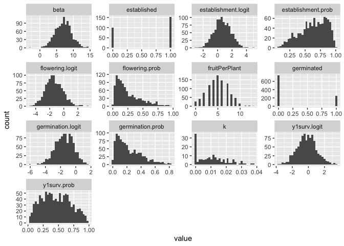
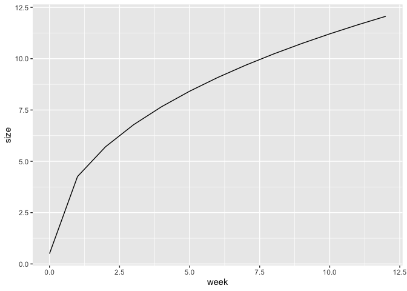

# Population Simulation Attempt

Rishav demoed AlphaSimR:
<https://cran.r-project.org/web/packages/AlphaSimR/index.html>

-   Rishav's demo is on his GitHub:
    <https://github.com/rishavray/IPM_practice/blob/main/IPM_genetic_simulation.Rmd>

## Libraries


``` r
library(AlphaSimR)
```

```
## Loading required package: R6
```

``` r
library(tidyverse)
```

```
## ── Attaching core tidyverse packages ──────────────────────── tidyverse 2.0.0 ──
## ✔ dplyr     1.1.4     ✔ readr     2.1.5
## ✔ forcats   1.0.0     ✔ stringr   1.5.1
## ✔ ggplot2   3.5.1     ✔ tibble    3.2.1
## ✔ lubridate 1.9.3     ✔ tidyr     1.3.1
## ✔ purrr     1.0.2
```

```
## ── Conflicts ────────────────────────────────────────── tidyverse_conflicts() ──
## ✖ dplyr::filter() masks stats::filter()
## ✖ dplyr::lag()    masks stats::lag()
## ✖ dplyr::mutate() masks AlphaSimR::mutate()
## ℹ Use the conflicted package (<http://conflicted.r-lib.org/>) to force all conflicts to become errors
```

``` r
logit <- brms::logit_scaled
inv_logit <- brms::inv_logit_scaled
```

## Create Founder Population


``` r
founderPop = runMacs(
  nInd = 1000, #number of individuals to simulate 
  nChr = 10, #number of chromosomes to simulate - may not be important to match to Streps' 14
  segSites = NULL, #number of segregating sites to keep per chromosome.
  species = "GENERIC" #The GENERIC history is meant to be a reasonable all-purpose choice. It runs quickly and models a population with an effective populations size that has gone through several historic bottlenecks.
)
```

## Get germ prob estimate from Maya's data

``` r
germprob <- read_csv("../data/WL2_2025_germ_prob.csv")
```

```
## Rows: 66 Columns: 4
## ── Column specification ────────────────────────────────────────────────────────
## Delimiter: ","
## chr (2): pop.id, Cross_Type
## dbl (2): prob, SE
## 
## ℹ Use `spec()` to retrieve the full column specification for this data.
## ℹ Specify the column types or set `show_col_types = FALSE` to quiet this message.
```

``` r
summary(germprob) #overall mean prob = 0.39
```

```
##     pop.id               prob                 SE             Cross_Type       
##  Length:66          Min.   :0.0000001   Min.   :0.0000847   Length:66         
##  Class :character   1st Qu.:0.1751701   1st Qu.:0.0328350   Class :character  
##  Mode  :character   Median :0.3541667   Median :0.0755195   Mode  :character  
##                     Mean   :0.3856414   Mean   :0.0866275                     
##                     3rd Qu.:0.5484085   3rd Qu.:0.1155918                     
##                     Max.   :0.9999999   Max.   :0.3535534
```

``` r
germprob %>% 
  group_by(Cross_Type) %>% 
  summarise(n=n(), meangerm=mean(prob)) #parents mean = 0.18 (lowest); F2s = highest 0.47
```

```
## # A tibble: 4 × 3
##   Cross_Type     n meangerm
##   <chr>      <int>    <dbl>
## 1 BC1           14    0.414
## 2 F1            17    0.359
## 3 F2            25    0.469
## 4 Parent        10    0.182
```

``` r
germprob %>% 
  filter(Cross_Type=="Parent") #WL2 prob = 0.27
```

```
## # A tibble: 10 × 4
##    pop.id   prob     SE Cross_Type
##    <chr>   <dbl>  <dbl> <chr>     
##  1 BH     0.190  0.0495 Parent    
##  2 CC     0.0635 0.0307 Parent    
##  3 DPR    0.222  0.0524 Parent    
##  4 LV1    0.0317 0.0221 Parent    
##  5 SQ3    0.254  0.0548 Parent    
##  6 TM2    0.170  0.0219 Parent    
##  7 WL1    0.333  0.0594 Parent    
##  8 WL2    0.272  0.0258 Parent    
##  9 WV     0.222  0.0524 Parent    
## 10 YO11   0.0635 0.0307 Parent
```

## Define Genetic Architecture for Traits

``` r
SP <- SimParam$new(founderPop)
#Starts the process of building a new simulation by creating a new SimParam object and assigning a founder population to the class.

traitMeans <- c(germination.logit = logit(0.18), #logit to scale it (from gene --> trait); used avg for all parents from Maya's data 
                establishment.logit = logit(0.67),
                y1surv.logit = logit(0.45),
                alpha = 40, #Hmax = alpha -Sets the asymptote (max growth) for the Weibull model 
                beta = 7, #Hmin = beta -Changes the y intercept (the lower limit) for the Weibull model- recruit size?
                k = 0.01, #Often described as the growth rate --\> related to the slope of the line for the Weibull model 
                delta = 0.5, #Sets the inflection point - when you shift b/t concave to convex for the Weibull model 
                flowering.logit = logit(0.25),
                fruitPerPlant = 30)

SP$addTraitA(nQtlPerChr = 10, 
              mean = traitMeans, 
              var = (traitMeans*0.25)^2, #genetic CV = 0.25 (?)
              gamma = TRUE, #a lot of small effect loci and a few large effect loci 
              shape = 1, #shape parameter for gamma distribution 
              name=names(traitMeans))
#addTraitAG - Randomly assigns eligible QTLs for one or more additive GxE traits. If simulating more than one trait, all traits will be pleiotropic with correlated effects.
#addTraitA - Randomly assigns eligible QTLs for one or more additive traits. If simulating more than one trait, all traits will be pleiotropic with correlated additive effects. (we will keep it simple for now)
##nQtlPerChr = number of QTLs per chromosome. Can be a single value or nChr values.
##mean = a vector of desired mean genetic values for one or more traits
##var = a vector of desired genetic variances for one or more traits
##varGxE = a vector of total genotype-by-environment variances for the traits
##name = optional name for trait(s)

SP$setVarE(h2=rep(0.5, length(traitMeans))) #set heritability to 0.5 
```

## Create Initial Population


``` r
pop = newPop(founderPop, simParam = SP)
pop1 <- setPheno(pop)
```


``` r
pheno <- pop1@pheno %>% as_tibble()
dim(pheno)
```

```
## [1] 1000    9
```

``` r
head(pheno)
```

```
## # A tibble: 6 × 9
##   germination.logit establishment.logit y1surv.logit alpha  beta      k delta
##               <dbl>               <dbl>        <dbl> <dbl> <dbl>  <dbl> <dbl>
## 1             -2.59               0.896       -0.170  27.5  6.96 0.0123 0.574
## 2             -1.57               0.549       -0.169  44.9  7.17 0.0146 0.499
## 3             -1.32               0.781       -0.228  49.9  6.48 0.0129 0.420
## 4             -1.26               1.15        -0.287  56.7  9.11 0.0101 0.613
## 5             -1.34               0.487       -0.298  33.2  8.33 0.0115 0.624
## 6             -1.81               0.740       -0.112  17.5  8.47 0.0150 0.651
## # ℹ 2 more variables: flowering.logit <dbl>, fruitPerPlant <dbl>
```

### Convert pheno logits to probabilities and phenotypes

``` r
pheno <- pheno %>%
  mutate(across(ends_with(".logit"), .fns = inv_logit, 
         .names = "{.col}.prob")) %>%
  rename_with(.fn = \(n) str_replace(n, "\\.logit\\.prob", "\\.prob")) %>%
  mutate(germinated = rbinom(n(), size=1, prob=germination.prob),
         established = ifelse(germinated, rbinom(n(), size=1, prob=establishment.prob), NA),
         beta, 
         alpha, 
         k = ifelse(established, k, NA), #can only have a growth rate if you establish
         delta = ifelse(established, delta, NA),
         y1surv = ifelse(established, rbinom(n(), size =1, prob=y1surv.prob), NA),
         flowered = ifelse(established, rbinom(n(), size = 1, prob = flowering.prob), NA),
         fruitPerPlant = ifelse(flowered, fruitPerPlant, NA))
```


``` r
pheno %>%
  pivot_longer(everything()) %>%
  ggplot(aes(x=value)) +
  geom_histogram() +
  facet_wrap(~name, scales="free")
```

```
## `stat_bin()` using `bins = 30`. Pick better value with `binwidth`.
```

```
## Warning: Removed 5224 rows containing non-finite outside the scale range
## (`stat_bin()`).
```

<!-- -->

## Try to get weekly growth data

### Model growth with the Weibull model


``` r
weibull <- function (t, alpha, beta, k, delta) {
  result <- alpha - (alpha - beta) * exp(-(k * t)^delta)
  return(result)
}

##Example:
growth <- tibble(week = seq(0,12, 1)) %>%
  mutate(size = weibull(t = week,
                          alpha = 40, #Hmax = alpha -  Sets the asymptote (max growth)
                          beta = 0.5, #Hmin = beta - Changes the y intercept (the lower limit)
                          k = 0.01, #k - Often described as the growth rate --\> related to the slope of the line
                          delta = 0.5)) #delta - Sets the inflection point - when you shift b/t concave to convex

growth %>%  ggplot(aes(x=week, y=size)) +
  geom_line()
```

<!-- -->

### Pheno weekly

``` r
pheno_weekly <- pheno %>% 
  mutate(Indiv_ID=row_number()) %>% 
  slice(rep(1:n(), each = 12)) %>% #duplicate each row 12 times 
  group_by(Indiv_ID) %>% 
  mutate(week=row_number(), #12 weeks for each indiv
         week_next=lead(week, order_by = week), 
         elapsed_days= week_next - week, #interval length in days
         size = if_else(week==1, beta, #size in week 1 is the min size (beta)
                        weibull(t = week, #otherwise use the weibull formula to calculate size
                        alpha = alpha,
                        beta = beta,
                        k = k, 
                        delta = delta)))
pheno_weekly
```

```
## # A tibble: 12,000 × 22
## # Groups:   Indiv_ID [1,000]
##    germination.logit establishment.logit y1surv.logit alpha  beta     k delta
##                <dbl>               <dbl>        <dbl> <dbl> <dbl> <dbl> <dbl>
##  1             -2.59               0.896       -0.170  27.5  6.96    NA    NA
##  2             -2.59               0.896       -0.170  27.5  6.96    NA    NA
##  3             -2.59               0.896       -0.170  27.5  6.96    NA    NA
##  4             -2.59               0.896       -0.170  27.5  6.96    NA    NA
##  5             -2.59               0.896       -0.170  27.5  6.96    NA    NA
##  6             -2.59               0.896       -0.170  27.5  6.96    NA    NA
##  7             -2.59               0.896       -0.170  27.5  6.96    NA    NA
##  8             -2.59               0.896       -0.170  27.5  6.96    NA    NA
##  9             -2.59               0.896       -0.170  27.5  6.96    NA    NA
## 10             -2.59               0.896       -0.170  27.5  6.96    NA    NA
## # ℹ 11,990 more rows
## # ℹ 15 more variables: flowering.logit <dbl>, fruitPerPlant <dbl>,
## #   germination.prob <dbl>, establishment.prob <dbl>, y1surv.prob <dbl>,
## #   flowering.prob <dbl>, germinated <int>, established <int>, y1surv <int>,
## #   flowered <int>, Indiv_ID <int>, week <int>, week_next <int>,
## #   elapsed_days <int>, size <dbl>
```

## Extract Genotype Scores

``` r
# Extract genotype scores for each individual
genotype_scores <- pop1@gv %>%
    as_tibble() %>%
    rownames_to_column(var = "Indiv_ID") %>%
    mutate(Indiv_ID = as.integer(Indiv_ID)) %>%
    select(Indiv_ID, everything())

# Join genotype scores with phenotypic data
pheno_weekly_merged <- pheno_weekly %>%
    left_join(genotype_scores, by = "Indiv_ID", suffix = c("_pheno", "_geno"))

pheno_weekly_merged %>% 
select(Indiv_ID, week, size, week_next, germination.logit_geno, germination.logit_pheno)
```

```
## # A tibble: 12,000 × 6
## # Groups:   Indiv_ID [1,000]
##    Indiv_ID  week  size week_next germination.logit_geno germination.logit_pheno
##       <int> <int> <dbl>     <int>                  <dbl>                   <dbl>
##  1        1     1  6.96         2                  -1.99                   -2.59
##  2        1     2 NA            3                  -1.99                   -2.59
##  3        1     3 NA            4                  -1.99                   -2.59
##  4        1     4 NA            5                  -1.99                   -2.59
##  5        1     5 NA            6                  -1.99                   -2.59
##  6        1     6 NA            7                  -1.99                   -2.59
##  7        1     7 NA            8                  -1.99                   -2.59
##  8        1     8 NA            9                  -1.99                   -2.59
##  9        1     9 NA           10                  -1.99                   -2.59
## 10        1    10 NA           11                  -1.99                   -2.59
## # ℹ 11,990 more rows
```

``` r
write_csv(pheno_weekly_merged, "../output/PopSim_Phenos-Genos_v1.csv")
```

